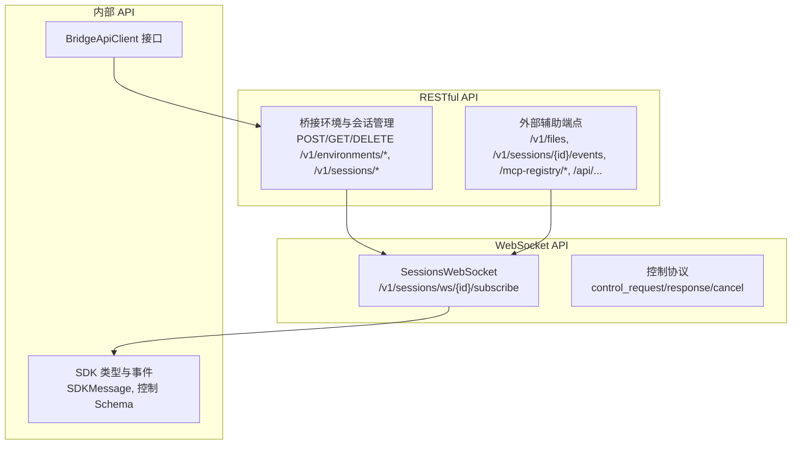
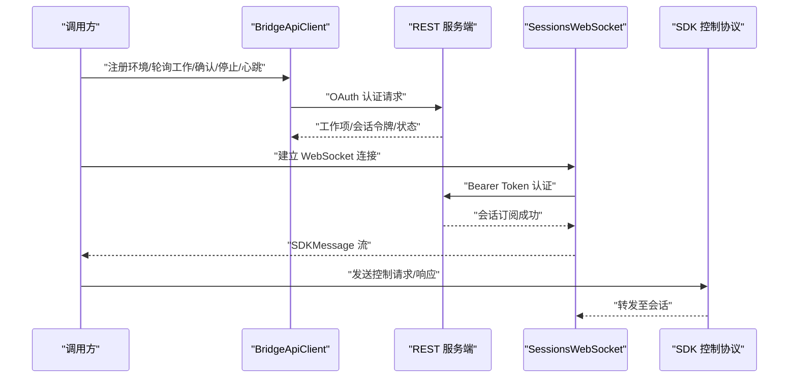
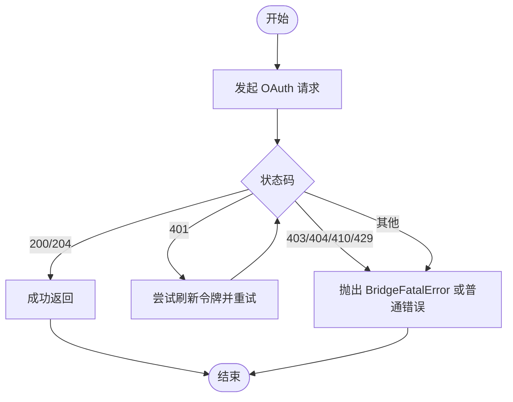
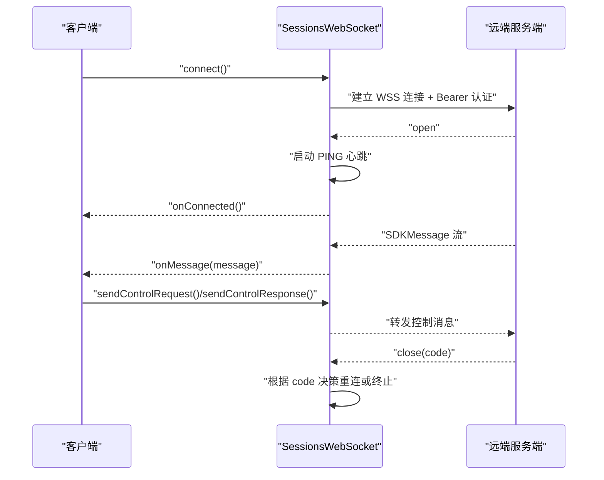
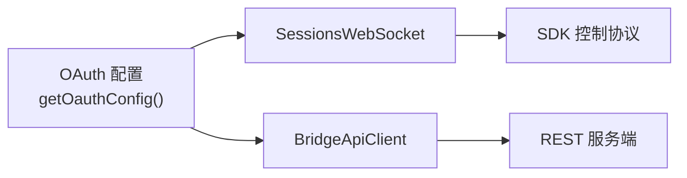

# API 参考手册

<cite>
**本文引用的文件**
- [SessionsWebSocket.ts](file://src/remote/SessionsWebSocket.ts)
- [bridgeApi.ts](file://src/bridge/bridgeApi.ts)
- [types.ts（桥接）](file://src/bridge/types.ts)
- [agentSdkTypes.js](file://src/entrypoints/agentSdkTypes.js)
- [controlTypes.js](file://src/entrypoints/sdk/controlTypes.js)
- [controlSchemas.ts](file://src/entrypoints/sdk/controlSchemas.ts)
- [oauth.ts](file://src/constants/oauth.ts)
- [external-dependencies.md](file://docs/external-dependencies.md)
- [errorUtils.ts（服务端 API）](file://src/services/api/errorUtils.ts)
</cite>

## 目录
1. [简介](#简介)
2. [项目结构与 API 分类](#项目结构与-api-分类)
3. [核心组件](#核心组件)
4. [架构总览](#架构总览)
5. [详细组件分析](#详细组件分析)
6. [依赖关系分析](#依赖关系分析)
7. [性能与可靠性特性](#性能与可靠性特性)
8. [故障排查指南](#故障排查指南)
9. [版本管理与迁移指南](#版本管理与迁移指南)
10. [结论](#结论)

## 简介
本参考手册面向使用 Claude Code Best 的开发者与集成方，系统化梳理项目中的对外 API 与内部 API 规范，覆盖：
- RESTful API：HTTP 方法、URL 模式、请求/响应结构、认证方式与错误处理
- WebSocket API：连接流程、消息协议、控制请求/响应、事件与重连策略
- 内部 API：桥接客户端接口、SDK 控制协议、类型与常量定义
- 典型使用场景与最佳实践
- 版本管理与迁移建议，确保向后兼容与平滑升级

## 项目结构与 API 分类
- RESTful API
  - 桥接环境与会话管理：注册、轮询、确认、停止、心跳、归档、重连、事件上报等
  - 外部辅助端点：文件上传、会话事件、MCP 注册表、设置同步等
- WebSocket API
  - 会话订阅：基于 /v1/sessions/ws/{id}/subscribe 的实时消息通道
  - 控制协议：控制请求/响应、取消请求、环境变量更新、保活消息等
- 内部 API
  - 桥接客户端接口：registerBridgeEnvironment、pollForWork、acknowledgeWork、stopWork、heartbeatWork、sendPermissionResponseEvent、archiveSession、reconnectSession
  - SDK 类型与事件：SDKMessage、控制类型、控制 Schema

**图表来源**
- [bridgeApi.ts:141-451](file://src/bridge/bridgeApi.ts#L141-L451)
- [SessionsWebSocket.ts:82-404](file://src/remote/SessionsWebSocket.ts#L82-L404)
- [controlSchemas.ts:594-640](file://src/entrypoints/sdk/controlSchemas.ts#L594-L640)

**章节来源**
- [bridgeApi.ts:141-451](file://src/bridge/bridgeApi.ts#L141-L451)
- [SessionsWebSocket.ts:82-404](file://src/remote/SessionsWebSocket.ts#L82-L404)
- [external-dependencies.md:170-194](file://docs/external-dependencies.md#L170-L194)

## 核心组件
- 桥接客户端（BridgeApiClient）
  - 提供注册环境、轮询工作、确认工作、停止工作、心跳、发送权限响应事件、归档会话、重连会话等能力
  - 支持 OAuth 认证与 401 自动刷新重试
- 会话 WebSocket 客户端（SessionsWebSocket）
  - 连接到 /v1/sessions/ws/{id}/subscribe，基于 Bearer Token 认证
  - 支持自动重连、PONG 心跳、消息解析与回调分发
- SDK 控制协议
  - 控制请求/响应、取消请求、保活消息、环境变量更新等消息类型
- OAuth 配置与常量
  - 生产/预发/本地配置、作用域集合、授权与令牌端点、MCP 代理配置

**章节来源**
- [types.ts（桥接）:133-176](file://src/bridge/types.ts#L133-L176)
- [SessionsWebSocket.ts:82-404](file://src/remote/SessionsWebSocket.ts#L82-L404)
- [controlSchemas.ts:594-640](file://src/entrypoints/sdk/controlSchemas.ts#L594-L640)
- [oauth.ts:60-104](file://src/constants/oauth.ts#L60-L104)

## 架构总览
下图展示了从桥接客户端到远程服务端、再到会话 WebSocket 的整体调用链路与消息流向。

**图表来源**
- [bridgeApi.ts:141-451](file://src/bridge/bridgeApi.ts#L141-L451)
- [SessionsWebSocket.ts:100-205](file://src/remote/SessionsWebSocket.ts#L100-L205)
- [controlSchemas.ts:594-640](file://src/entrypoints/sdk/controlSchemas.ts#L594-L640)

## 详细组件分析

### RESTful API：桥接与会话管理
- 端点概览
  - 注册环境：POST /v1/environments/bridge
  - 轮询工作：GET /v1/environments/{environmentId}/work/poll
  - 确认工作：POST /v1/environments/{environmentId}/work/{workId}/ack
  - 停止工作：POST /v1/environments/{environmentId}/work/{workId}/stop
  - 删除环境：DELETE /v1/environments/bridge/{environmentId}
  - 归档会话：POST /v1/sessions/{sessionId}/archive
  - 重连会话：POST /v1/environments/{environmentId}/bridge/reconnect
  - 发送权限响应事件：POST /v1/sessions/{sessionId}/events
  - 心跳：POST /v1/environments/{environmentId}/work/{workId}/heartbeat
- 认证与头部
  - Authorization: Bearer {token}
  - anthropic-version: 2023-06-01
  - anthropic-beta: environments-2025-11-01
  - x-environment-runner-version: {runnerVersion}
  - 可选 X-Trusted-Device-Token（在特定安全策略启用时）
- 关键行为
  - 401 自动刷新重试（若提供 onAuth401）
  - 403/404/410/429 等状态码映射为明确错误
  - 轮询空闲时有日志节流
  - 工作项 ID 与会话 ID 采用安全校验（仅允许字母数字、下划线、短横线）

**图表来源**
- [bridgeApi.ts:106-139](file://src/bridge/bridgeApi.ts#L106-L139)
- [bridgeApi.ts:454-500](file://src/bridge/bridgeApi.ts#L454-L500)

**章节来源**
- [bridgeApi.ts:141-451](file://src/bridge/bridgeApi.ts#L141-L451)
- [types.ts（桥接）:18-51](file://src/bridge/types.ts#L18-L51)

### WebSocket API：会话订阅与控制
- 连接地址与认证
  - wss://{BASE_API_URL 替换为 wss://}/v1/sessions/ws/{sessionId}/subscribe?organization_uuid={orgUuid}
  - 认证：Authorization: Bearer {access_token}
  - anthropic-version: 2023-06-01
- 消息类型
  - SDKMessage（会话输出流）
  - SDKControlRequest（控制请求）
  - SDKControlResponse（控制响应）
  - SDKControlCancelRequest（取消请求）
- 控制协议要点
  - 控制请求携带 request_id（随机 UUID），响应同型返回
  - 支持 keep_alive、update_environment_variables 等消息
- 连接与重连
  - 初始连接成功后进入 connected 状态
  - 支持 PING/PONG 心跳；断开时按策略重连（最大次数、延迟递增）
  - 4001（会话不存在）有限次重试；4003 等永久关闭码直接终止

**图表来源**
- [SessionsWebSocket.ts:100-205](file://src/remote/SessionsWebSocket.ts#L100-L205)
- [SessionsWebSocket.ts:234-288](file://src/remote/SessionsWebSocket.ts#L234-L288)
- [controlSchemas.ts:594-640](file://src/entrypoints/sdk/controlSchemas.ts#L594-L640)

**章节来源**
- [SessionsWebSocket.ts:74-404](file://src/remote/SessionsWebSocket.ts#L74-L404)
- [agentSdkTypes.js:4-40](file://src/entrypoints/agentSdkTypes.js#L4-L40)
- [controlTypes.js:1-9](file://src/entrypoints/sdk/controlTypes.js#L1-L9)
- [controlSchemas.ts:594-640](file://src/entrypoints/sdk/controlSchemas.ts#L594-L640)

### 外部辅助端点（REST）
- 文件上传/下载：/v1/files
- 会话事件：/v1/sessions/{id}/events
- MCP 服务器注册表：/mcp-registry/v0/servers
- 设置同步：/api/claude_code/settings
- 企业托管设置（1h 轮询）：/api/claude_code/managed_settings
- 团队记忆同步：/api/claude_code/team_memory?repo={}
- 可信设备注册：/api/auth/trusted_devices
- 其他：组织级 MCP 配置、推荐活动、超额信用、管理员请求、域名安全检查等

**章节来源**
- [external-dependencies.md:170-194](file://docs/external-dependencies.md#L170-L194)

### 内部 API：桥接客户端接口规范
- 函数与职责
  - registerBridgeEnvironment(config)：注册/重连环境，返回 environment_id 与 environment_secret
  - pollForWork(environmentId, environmentSecret, signal?, reclaimOlderThanMs?)：轮询工作项，支持空闲日志节流
  - acknowledgeWork(environmentId, workId, sessionToken)：确认工作
  - stopWork(environmentId, workId, force)：停止工作
  - deregisterEnvironment(environmentId)：删除环境
  - sendPermissionResponseEvent(sessionId, event, sessionToken)：向会话发送权限响应事件
  - archiveSession(sessionId)：归档会话
  - reconnectSession(environmentId, sessionId)：强制重连会话
  - heartbeatWork(environmentId, workId, sessionToken)：心跳并返回续期状态
- 参数与返回
  - 所有 ID 参数均进行安全校验（validateBridgeId）
  - 返回值多为 void 或结构化对象（如 heartbeatWork 返回 lease_extended 与 state）
- 异常处理
  - 401：尝试刷新令牌后仍失败则抛出 BridgeFatalError
  - 403/404/410：区分过期与权限问题，给出明确提示
  - 429：速率限制
  - 其他：通用错误包装

**章节来源**
- [types.ts（桥接）:133-176](file://src/bridge/types.ts#L133-L176)
- [bridgeApi.ts:454-500](file://src/bridge/bridgeApi.ts#L454-L500)

### 类型定义与接口文档
- SDK 事件与退出原因
  - HOOK_EVENTS：会话生命周期与工具使用相关事件
  - EXIT_REASONS：会话退出原因集合
- 控制协议类型
  - StdoutMessage、SDKControlInitializeRequest/Response、SDKControlMcpSetServersResponse、SDKControlReloadPluginsResponse、StdinMessage、SDKPartialAssistantMessage
- 控制协议 Schema
  - SDKControlResponseSchema、SDKControlCancelRequestSchema、SDKKeepAliveMessageSchema、SDKUpdateEnvironmentVariablesMessageSchema
- OAuth 常量
  - BASE_API_URL、TOKEN_URL、API_KEY_URL、ROLES_URL、SCOPES、CLIENT_ID、MCP_PROXY_URL/MCP_PROXY_PATH 等
- 桥接类型
  - WorkResponse、WorkSecret、SessionActivity、SpawnMode、BridgeWorkerType、BridgeConfig、PermissionResponseEvent、BridgeApiClient、SessionHandle、SessionSpawner、BridgeLogger

**章节来源**
- [agentSdkTypes.js:4-40](file://src/entrypoints/agentSdkTypes.js#L4-L40)
- [controlTypes.js:1-9](file://src/entrypoints/sdk/controlTypes.js#L1-L9)
- [controlSchemas.ts:594-640](file://src/entrypoints/sdk/controlSchemas.ts#L594-L640)
- [oauth.ts:60-104](file://src/constants/oauth.ts#L60-L104)
- [types.ts（桥接）:18-263](file://src/bridge/types.ts#L18-L263)

## 依赖关系分析
- 认证与配置
  - OAuth 配置通过 getOauthConfig() 动态选择生产/预发/本地，并支持自定义基地址与客户端 ID 覆盖
- REST 与 WebSocket
  - SessionsWebSocket 使用 OAuth 配置中的 BASE_API_URL 构造 WSS 地址
  - BridgeApiClient 与 SessionsWebSocket 在认证与头部字段上保持一致
- 错误处理
  - REST 层统一映射状态码到 BridgeFatalError 或普通错误
  - WebSocket 层对解析失败与断开进行日志与重连策略控制

**图表来源**
- [oauth.ts:186-234](file://src/constants/oauth.ts#L186-L234)
- [SessionsWebSocket.ts:108-118](file://src/remote/SessionsWebSocket.ts#L108-L118)
- [bridgeApi.ts:76-89](file://src/bridge/bridgeApi.ts#L76-L89)

**章节来源**
- [oauth.ts:186-234](file://src/constants/oauth.ts#L186-L234)
- [SessionsWebSocket.ts:108-118](file://src/remote/SessionsWebSocket.ts#L108-L118)
- [bridgeApi.ts:76-89](file://src/bridge/bridgeApi.ts#L76-L89)

## 性能与可靠性特性
- 重连与退避
  - 最大重连次数与固定延迟；针对 4001（会话不存在）进行有限次重试
- 心跳与空闲处理
  - PING/PONG 心跳维持长连接；轮询空闲时日志节流
- 认证与安全
  - 401 自动刷新重试；可选可信设备令牌头；ID 安全校验防止注入
- 错误诊断
  - 统一错误提取与类型识别；SSL/TLS 错误细化提示

**章节来源**
- [SessionsWebSocket.ts:17-36](file://src/remote/SessionsWebSocket.ts#L17-L36)
- [SessionsWebSocket.ts:290-323](file://src/remote/SessionsWebSocket.ts#L290-L323)
- [bridgeApi.ts:76-89](file://src/bridge/bridgeApi.ts#L76-L89)
- [bridgeApi.ts:454-500](file://src/bridge/bridgeApi.ts#L454-L500)
- [errorUtils.ts（服务端 API）:204-235](file://src/services/api/errorUtils.ts#L204-L235)

## 故障排查指南
- 401 未授权
  - 若提供 onAuth401，将尝试刷新令牌并重试一次；否则抛出 BridgeFatalError 并附带登录指引
- 403 权限不足
  - 区分会话过期与角色权限不足；过期场景提示重启远程控制
- 404 未找到
  - 远程控制可能对该组织不可用
- 410 已过期
  - 明确提示重启远程控制
- 429 速率限制
  - 轮询过于频繁导致；降低轮询频率
- WebSocket 断开
  - 4003 等永久关闭码不再重连；4001 有限次重试；其他情况按策略重连
- SSL/TLS 错误
  - 证书验证失败、过期、吊销、主机名不匹配等均有明确提示

**章节来源**
- [bridgeApi.ts:454-500](file://src/bridge/bridgeApi.ts#L454-L500)
- [SessionsWebSocket.ts:246-287](file://src/remote/SessionsWebSocket.ts#L246-L287)
- [errorUtils.ts（服务端 API）:204-235](file://src/services/api/errorUtils.ts#L204-L235)

## 版本管理与迁移指南
- 认证版本
  - anthropic-version: 2023-06-01；请勿降级以避免协议不兼容
- Beta 头部
  - anthropic-beta: environments-2025-11-01；用于实验性能力开关，未来可能变更或移除
- OAuth 配置演进
  - 支持通过环境变量覆盖 OAuth 基地址与客户端 ID；仅允许白名单基地址，防止凭据泄露
- 控制协议
  - 控制请求/响应、取消请求、保活消息、环境变量更新等消息类型保持稳定；新增类型不会被硬编码拒绝，建议下游按 type 字段动态处理
- 向后兼容
  - REST 端点与头部保持稳定；如需实验性能力，请通过 beta 头部开启
  - WebSocket 协议接受任意字符串 type 的消息，未知类型由下游处理器决定

**章节来源**
- [bridgeApi.ts:76-89](file://src/bridge/bridgeApi.ts#L76-L89)
- [oauth.ts:198-231](file://src/constants/oauth.ts#L198-L231)
- [SessionsWebSocket.ts:46-55](file://src/remote/SessionsWebSocket.ts#L46-L55)

## 结论
本参考手册系统化梳理了 Claude Code Best 的 RESTful API、WebSocket API 与内部桥接接口，明确了认证方式、消息协议、错误处理与可靠性机制。建议在集成时：
- 使用 OAuth Bearer Token 并遵循 anthropic-version 与 anthropic-beta 约定
- 对 REST 与 WebSocket 实施稳健的重连与心跳策略
- 通过错误映射与 SSL/TLS 错误提示快速定位问题
- 关注 OAuth 配置与控制协议的演进，确保平滑升级