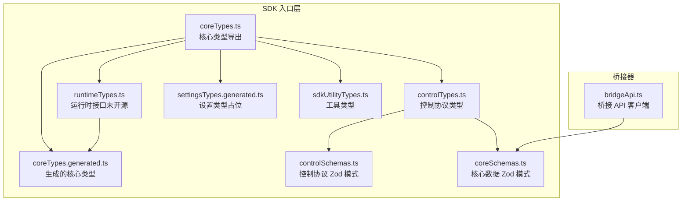
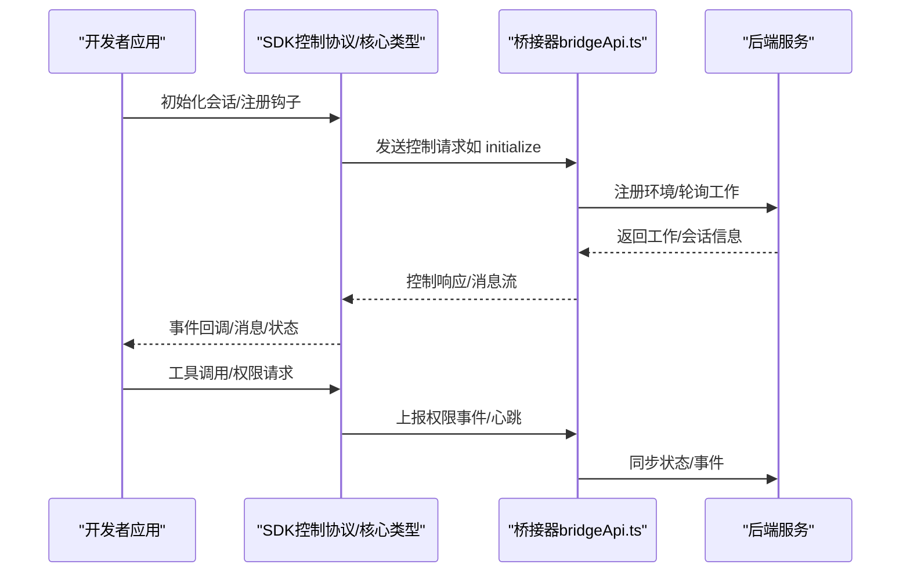
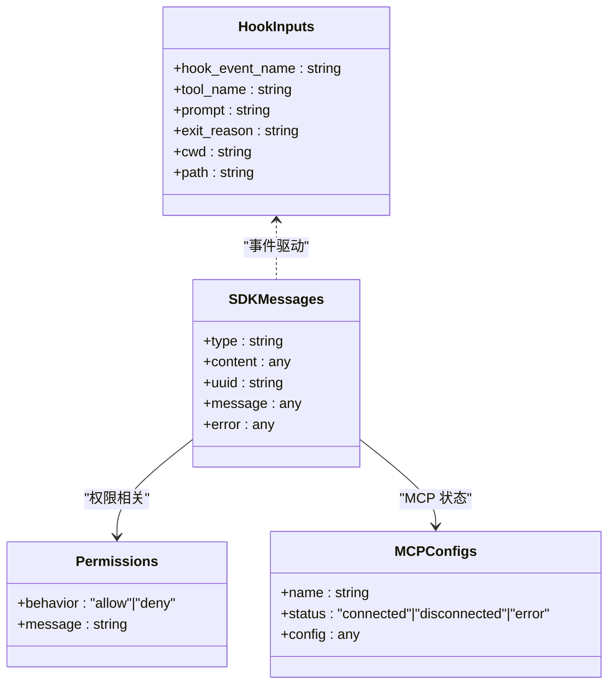
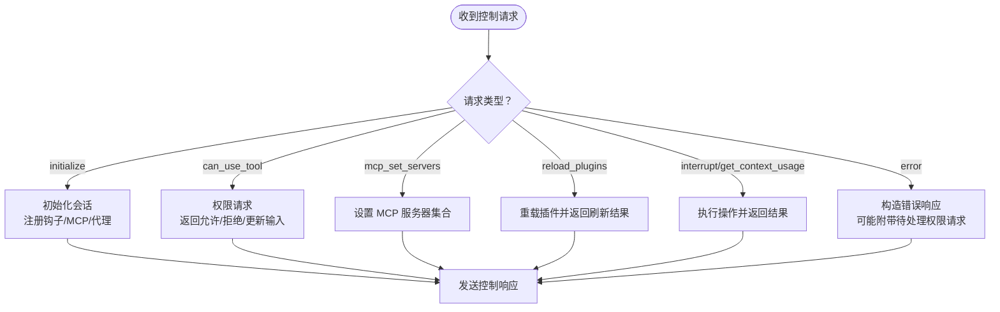
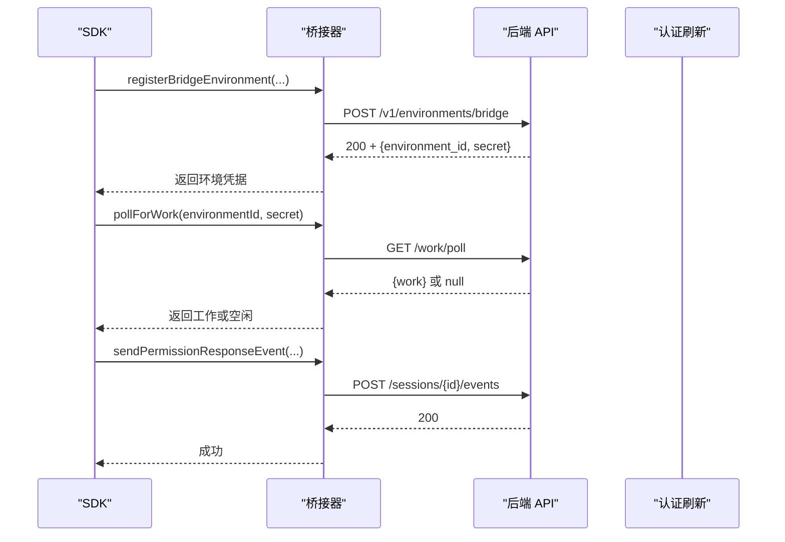
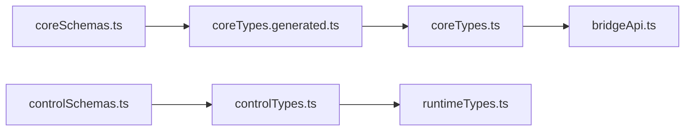

# SDK 开发者接口

<cite>
**本文引用的文件**
- [coreTypes.ts](file://src/entrypoints/sdk/coreTypes.ts)
- [coreTypes.generated.ts](file://src/entrypoints/sdk/coreTypes.generated.ts)
- [controlTypes.ts](file://src/entrypoints/sdk/controlTypes.ts)
- [controlSchemas.ts](file://src/entrypoints/sdk/controlSchemas.ts)
- [coreSchemas.ts](file://src/entrypoints/sdk/coreSchemas.ts)
- [runtimeTypes.ts](file://src/entrypoints/sdk/runtimeTypes.ts)
- [settingsTypes.generated.ts](file://src/entrypoints/sdk/settingsTypes.generated.ts)
- [sdkUtilityTypes.ts](file://src/entrypoints/sdk/sdkUtilityTypes.ts)
- [bridgeApi.ts](file://src/bridge/bridgeApi.ts)
</cite>

## 目录
1. [简介](#简介)
2. [项目结构](#项目结构)
3. [核心组件](#核心组件)
4. [架构总览](#架构总览)
5. [详细组件分析](#详细组件分析)
6. [依赖关系分析](#依赖关系分析)
7. [性能考量](#性能考量)
8. [故障排查指南](#故障排查指南)
9. [结论](#结论)
10. [附录](#附录)

## 简介
本文件面向希望在 Claude Code Best 生态中进行 SDK 开发与集成的工程师，系统化梳理 SDK 的核心类型、控制协议、会话与工具调用接口、扩展点与钩子机制，并提供 JavaScript/TypeScript 使用示例的路径指引、版本兼容性与升级建议、以及调试与开发辅助工具的使用说明。目标是帮助你在不深入源码的前提下，快速理解并正确使用 SDK。

## 项目结构
SDK 类型与协议位于入口层目录，围绕“核心类型（core）”“控制协议（control）”“运行时接口（runtime）”三部分组织，配合桥接器（bridge）实现与后端服务的通信。

图表来源
- [coreTypes.ts:1-63](file://src/entrypoints/sdk/coreTypes.ts#L1-L63)
- [coreTypes.generated.ts:1-180](file://src/entrypoints/sdk/coreTypes.generated.ts#L1-L180)
- [controlTypes.ts:1-35](file://src/entrypoints/sdk/controlTypes.ts#L1-L35)
- [controlSchemas.ts:1-664](file://src/entrypoints/sdk/controlSchemas.ts#L1-L664)
- [coreSchemas.ts:1-200](file://src/entrypoints/sdk/coreSchemas.ts#L1-L200)
- [runtimeTypes.ts:1-64](file://src/entrypoints/sdk/runtimeTypes.ts#L1-L64)
- [settingsTypes.generated.ts:1-5](file://src/entrypoints/sdk/settingsTypes.generated.ts#L1-L5)
- [sdkUtilityTypes.ts:1-25](file://src/entrypoints/sdk/sdkUtilityTypes.ts#L1-L25)
- [bridgeApi.ts:1-540](file://src/bridge/bridgeApi.ts#L1-L540)

章节来源
- [coreTypes.ts:1-63](file://src/entrypoints/sdk/coreTypes.ts#L1-L63)
- [controlTypes.ts:1-35](file://src/entrypoints/sdk/controlTypes.ts#L1-L35)
- [runtimeTypes.ts:1-64](file://src/entrypoints/sdk/runtimeTypes.ts#L1-L64)
- [bridgeApi.ts:1-540](file://src/bridge/bridgeApi.ts#L1-L540)

## 核心组件
- 核心类型与消息
  - 提供 SDK 会话、消息、权限、MCP 服务器、钩子输入输出等可序列化类型。
  - 包含常量事件列表（如 PreToolUse、PostToolUse、SessionStart、SessionEnd 等）与退出原因枚举。
- 控制协议
  - 定义 SDK 与 CLI/桥接之间的控制请求/响应、钩子回调、MCP 设置、插件重载、上下文使用统计等协议。
- 运行时接口
  - 描述 SDK 会话对象、工具定义、查询迭代器等运行时能力（部分类型为占位，非开源）。
- 桥接 API
  - 封装与后端环境注册、轮询工作、心跳、停止工作、归档会话、重连会话、权限事件上报等 API 调用。

章节来源
- [coreTypes.ts:24-63](file://src/entrypoints/sdk/coreTypes.ts#L24-L63)
- [coreTypes.generated.ts:68-180](file://src/entrypoints/sdk/coreTypes.generated.ts#L68-L180)
- [controlSchemas.ts:57-95](file://src/entrypoints/sdk/controlSchemas.ts#L57-L95)
- [runtimeTypes.ts:17-64](file://src/entrypoints/sdk/runtimeTypes.ts#L17-L64)
- [bridgeApi.ts:141-451](file://src/bridge/bridgeApi.ts#L141-L451)

## 架构总览
SDK 通过“控制协议”与“核心消息”与 CLI/桥接交互；桥接器负责与后端服务通信，处理认证、重试、错误分类与状态上报。

图表来源
- [controlSchemas.ts:577-610](file://src/entrypoints/sdk/controlSchemas.ts#L577-L610)
- [bridgeApi.ts:141-451](file://src/bridge/bridgeApi.ts#L141-L451)

## 详细组件分析

### 组件一：核心类型与消息（coreTypes.ts 与 coreTypes.generated.ts）
- 导出内容
  - 重新导出沙箱类型、生成类型、工具类型等，便于消费者直接使用。
  - 常量事件数组（HOOK_EVENTS）与退出原因数组（EXIT_REASONS），用于钩子与生命周期管理。
- 关键类型
  - Hook 输入输出类型（如 PreToolUseHookInput、PostToolUseHookInput 等）。
  - SDK 消息类型（用户消息、助手消息、部分助手消息、结果消息、状态消息、工具进度消息、压缩边界消息等）。
  - 权限、MCP 服务器配置与状态、账户信息、模型信息、使用统计等。
- 设计要点
  - 通过 Zod 模式生成强类型，保证序列化/反序列化一致性。
  - 钩子输入统一为带事件名的对象，便于路由与扩展。

图表来源
- [coreTypes.ts:24-63](file://src/entrypoints/sdk/coreTypes.ts#L24-L63)
- [coreTypes.generated.ts:68-180](file://src/entrypoints/sdk/coreTypes.generated.ts#L68-L180)

章节来源
- [coreTypes.ts:11-23](file://src/entrypoints/sdk/coreTypes.ts#L11-L23)
- [coreTypes.ts:24-63](file://src/entrypoints/sdk/coreTypes.ts#L24-L63)
- [coreTypes.generated.ts:68-180](file://src/entrypoints/sdk/coreTypes.generated.ts#L68-L180)

### 组件二：控制协议（controlTypes.ts 与 controlSchemas.ts）
- 控制请求/响应
  - 初始化请求（initialize）、中断请求（interrupt）、权限请求（can_use_tool）、设置模型/思考令牌、MCP 状态/设置/重连/开关、上下文使用统计、撤销异步消息、种子读取状态、重载插件、停止任务、应用标志设置、获取设置、Elicitation 请求/响应等。
  - 控制响应包含成功与错误两类，错误响应可携带待处理权限请求列表。
- 协议消息
  - Stdout/Stdin 消息聚合类型，包含 SDK 消息、控制请求/响应、取消请求、保活消息、环境变量更新消息等。
- 设计要点
  - 所有协议均基于 Zod 模式校验，确保跨进程/跨语言一致性。
  - 支持钩子回调匹配器（SDKHookCallbackMatcherSchema），允许按事件名路由到具体回调。

图表来源
- [controlSchemas.ts:552-620](file://src/entrypoints/sdk/controlSchemas.ts#L552-L620)
- [controlSchemas.ts:577-610](file://src/entrypoints/sdk/controlSchemas.ts#L577-L610)

章节来源
- [controlTypes.ts:23-35](file://src/entrypoints/sdk/controlTypes.ts#L23-L35)
- [controlSchemas.ts:57-95](file://src/entrypoints/sdk/controlSchemas.ts#L57-L95)
- [controlSchemas.ts:552-620](file://src/entrypoints/sdk/controlSchemas.ts#L552-L620)

### 组件三：运行时接口（runtimeTypes.ts）
- 会话接口
  - SDKSession：包含 sessionId、prompt（异步迭代器）、abort 等方法。
  - SDKSessionOptions：可选模型、系统提示等。
- 工具定义
  - SdkMcpToolDefinition：名称、描述、输入模式、处理器（异步）。
  - McpSdkServerConfigWithInstance：包含工具列表的 SDK MCP 服务器配置。
- 查询与内部选项
  - Query/InternalQuery：异步迭代器接口。
  - Options/InternalOptions：通用选项与内部选项。
- 设计要点
  - 该部分类型为占位，实际实现不在开源仓库中，需遵循接口约定进行对接。

章节来源
- [runtimeTypes.ts:17-64](file://src/entrypoints/sdk/runtimeTypes.ts#L17-L64)

### 组件四：桥接 API（bridgeApi.ts）
- 功能概览
  - 环境注册、轮询工作、确认工作、停止工作、注销环境、归档会话、重连会话、心跳、权限事件上报等。
  - 统一的请求头（含版本、beta 头、runner 版本、可信设备令牌等）。
  - OAuth 401 自动重试与错误分类（致命错误、过期、速率限制等）。
- 错误处理
  - 对 401/403/404/410/429 等状态进行分类处理，区分可恢复与不可恢复错误。
  - 提供 isExpiredErrorType/isSuppressible403 等辅助判断函数。

图表来源
- [bridgeApi.ts:141-451](file://src/bridge/bridgeApi.ts#L141-L451)

章节来源
- [bridgeApi.ts:12-36](file://src/bridge/bridgeApi.ts#L12-L36)
- [bridgeApi.ts:454-540](file://src/bridge/bridgeApi.ts#L454-L540)

### 组件五：钩子与扩展点
- 钩子事件
  - 包括 PreToolUse、PostToolUse、PostToolUseFailure、Notification、UserPromptSubmit、SessionStart、SessionEnd、Stop、StopFailure、SubagentStart、SubagentStop、PreCompact、PostCompact、PermissionRequest、PermissionDenied、Setup、TeammateIdle、TaskCreated、TaskCompleted、Elicitation、ElicitationResult、ConfigChange、WorktreeCreate、WorktreeRemove、InstructionsLoaded、CwdChanged、FileChanged 等。
- 钩子输出
  - 同步钩子输出支持 continue、suppressOutput、stopReason、decision、systemMessage、reason、hookSpecificOutput 等字段。
  - 钩子特定输出覆盖权限决策、通知、会话初始消息、工作树路径等场景。
- 设计要点
  - 通过 HookInputSchema/HookJSONOutputSchema 统一输入输出结构，便于 SDK 消费者实现自定义逻辑。

章节来源
- [coreTypes.ts:24-63](file://src/entrypoints/sdk/coreTypes.ts#L24-L63)
- [coreSchemas.ts:806-974](file://src/entrypoints/sdk/coreSchemas.ts#L806-L974)

### 组件六：工具类型与 MCP 集成
- 工具类型
  - SdkToolDefinition：名称、描述、输入模式、扩展字段。
- MCP 配置
  - 支持 stdio、sse、http、sdk、claudeai-proxy 等传输方式与状态。
- 设计要点
  - 通过 McpServerConfigForProcessTransportSchema/McpServerStatusSchema 约束 MCP 服务器配置与状态，确保跨语言/进程一致性。

章节来源
- [toolTypes.ts:1-10](file://src/entrypoints/sdk/toolTypes.ts#L1-L10)
- [coreSchemas.ts:106-165](file://src/entrypoints/sdk/coreSchemas.ts#L106-L165)

## 依赖关系分析
- 类型生成链路
  - coreSchemas.ts 与 controlSchemas.ts 定义 Zod 模式，coreTypes.generated.ts 与 controlTypes.ts 基于模式推断类型，最终由 coreTypes.ts 汇总导出。
- 协议与消息
  - controlSchemas.ts 中的 StdoutMessageSchema/StdinMessageSchema 聚合了 SDK 消息、控制请求/响应、取消请求、保活消息、环境变量更新消息。
- 运行时与桥接
  - runtimeTypes.ts 的 SDKSession 与工具定义通过 coreTypes.generated.ts 的消息与权限类型与桥接器交互。

图表来源
- [coreSchemas.ts:1-200](file://src/entrypoints/sdk/coreSchemas.ts#L1-L200)
- [coreTypes.generated.ts:1-180](file://src/entrypoints/sdk/coreTypes.generated.ts#L1-L180)
- [controlSchemas.ts:1-664](file://src/entrypoints/sdk/controlSchemas.ts#L1-L664)
- [controlTypes.ts:1-35](file://src/entrypoints/sdk/controlTypes.ts#L1-L35)
- [coreTypes.ts:1-63](file://src/entrypoints/sdk/coreTypes.ts#L1-L63)
- [runtimeTypes.ts:1-64](file://src/entrypoints/sdk/runtimeTypes.ts#L1-L64)
- [bridgeApi.ts:1-540](file://src/bridge/bridgeApi.ts#L1-L540)

章节来源
- [coreSchemas.ts:1-200](file://src/entrypoints/sdk/coreSchemas.ts#L1-L200)
- [controlSchemas.ts:642-664](file://src/entrypoints/sdk/controlSchemas.ts#L642-L664)
- [coreTypes.ts:11-23](file://src/entrypoints/sdk/coreTypes.ts#L11-L23)

## 性能考量
- 轮询与心跳
  - 轮询接口带有超时与信号支持，避免阻塞；心跳接口返回是否延长租约与当前状态，便于资源调度。
- 空闲日志节流
  - 连续空闲轮询采用对数间隔日志，降低噪声。
- 速率限制与重试
  - 429 速率限制明确抛错；401 可触发 OAuth 刷新重试一次，提升可用性。
- 上下文使用统计
  - 提供按类别细分的上下文使用情况，便于优化提示与工具调用策略。

章节来源
- [bridgeApi.ts:199-247](file://src/bridge/bridgeApi.ts#L199-L247)
- [bridgeApi.ts:387-417](file://src/bridge/bridgeApi.ts#L387-L417)
- [bridgeApi.ts:493-498](file://src/bridge/bridgeApi.ts#L493-L498)
- [controlSchemas.ts:175-306](file://src/entrypoints/sdk/controlSchemas.ts#L175-L306)

## 故障排查指南
- 认证失败（401）
  - 触发 BridgeFatalError，若提供 onAuth401 回调则尝试刷新令牌并重试一次；否则直接抛出致命错误。
- 访问被拒（403）
  - 分类为可抑制的 403（如外部轮询或管理权限不足）与不可抑制错误；前者不应显示给用户。
- 会话/环境过期（404/410）
  - 明确提示重启远程控制命令；可通过 isExpiredErrorType 判断。
- 速率限制（429）
  - 减少轮询频率或等待冷却时间。
- 其他错误
  - 统一提取错误详情与类型，便于定位问题。

章节来源
- [bridgeApi.ts:454-540](file://src/bridge/bridgeApi.ts#L454-L540)
- [bridgeApi.ts:502-524](file://src/bridge/bridgeApi.ts#L502-L524)

## 结论
本 SDK 以 Zod 模式为核心，构建了稳定、可序列化的类型体系与控制协议，结合桥接器实现与后端服务的可靠通信。通过钩子与 MCP 集成，开发者可以灵活扩展工具与行为；借助桥接 API 的错误分类与重试机制，提升稳定性与可维护性。建议在集成时严格遵循控制协议与消息格式，合理使用钩子与 MCP 服务器配置，并利用上下文使用统计优化会话性能。

## 附录

### A. 初始化与会话管理（示例路径）
- 初始化会话
  - 参考控制请求初始化（initialize）与响应（initialize response）的模式定义。
  - 示例路径：[controlSchemas.ts:57-95](file://src/entrypoints/sdk/controlSchemas.ts#L57-L95)
- 环境注册与轮询
  - 参考桥接 API 的 registerBridgeEnvironment 与 pollForWork。
  - 示例路径：[bridgeApi.ts:141-247](file://src/bridge/bridgeApi.ts#L141-L247)
- 心跳与停止
  - 参考 heartbeatWork 与 stopWork。
  - 示例路径：[bridgeApi.ts:387-417](file://src/bridge/bridgeApi.ts#L387-L417)

章节来源
- [controlSchemas.ts:57-95](file://src/entrypoints/sdk/controlSchemas.ts#L57-L95)
- [bridgeApi.ts:141-247](file://src/bridge/bridgeApi.ts#L141-L247)
- [bridgeApi.ts:387-417](file://src/bridge/bridgeApi.ts#L387-L417)

### B. 工具调用接口（示例路径）
- 权限请求与决策
  - 参考 can_use_tool 请求与权限请求钩子输出。
  - 示例路径：[controlSchemas.ts:106-122](file://src/entrypoints/sdk/controlSchemas.ts#L106-L122)
  - 示例路径：[coreSchemas.ts:875-891](file://src/entrypoints/sdk/coreSchemas.ts#L875-L891)
- MCP 工具与服务器
  - 参考 MCP 服务器配置与状态、工具定义。
  - 示例路径：[coreSchemas.ts:106-165](file://src/entrypoints/sdk/coreSchemas.ts#L106-L165)
  - 示例路径：[runtimeTypes.ts:30-43](file://src/entrypoints/sdk/runtimeTypes.ts#L30-L43)

章节来源
- [controlSchemas.ts:106-122](file://src/entrypoints/sdk/controlSchemas.ts#L106-L122)
- [coreSchemas.ts:106-165](file://src/entrypoints/sdk/coreSchemas.ts#L106-L165)
- [runtimeTypes.ts:30-43](file://src/entrypoints/sdk/runtimeTypes.ts#L30-L43)

### C. 钩子与扩展点（示例路径）
- 钩子事件与输出
  - 参考 HOOK_EVENTS 常量与各类钩子特定输出。
  - 示例路径：[coreTypes.ts:24-63](file://src/entrypoints/sdk/coreTypes.ts#L24-L63)
  - 示例路径：[coreSchemas.ts:806-974](file://src/entrypoints/sdk/coreSchemas.ts#L806-L974)
- 钩子回调匹配器
  - 参考 SDKHookCallbackMatcherSchema。
  - 示例路径：[controlSchemas.ts:43-51](file://src/entrypoints/sdk/controlSchemas.ts#L43-L51)

章节来源
- [coreTypes.ts:24-63](file://src/entrypoints/sdk/coreTypes.ts#L24-L63)
- [coreSchemas.ts:806-974](file://src/entrypoints/sdk/coreSchemas.ts#L806-L974)
- [controlSchemas.ts:43-51](file://src/entrypoints/sdk/controlSchemas.ts#L43-L51)

### D. 版本兼容性与升级路径
- 版本标记
  - 桥接 API 使用 anthropic-version 与 anthropic-beta 头部，确保与后端兼容。
  - 示例路径：[bridgeApi.ts:76-89](file://src/bridge/bridgeApi.ts#L76-L89)
- 类型生成
  - 核心类型由 coreSchemas.ts 生成，修改模式后需重新生成类型文件。
  - 示例路径：[coreTypes.ts:4-7](file://src/entrypoints/sdk/coreTypes.ts#L4-L7)
- 升级建议
  - 保持与最新 beta 头部一致；新增钩子事件或控制请求时，优先通过模式扩展而非破坏性变更。

章节来源
- [bridgeApi.ts:76-89](file://src/bridge/bridgeApi.ts#L76-L89)
- [coreTypes.ts:4-7](file://src/entrypoints/sdk/coreTypes.ts#L4-L7)

### E. 调试工具与开发辅助
- 调试输出
  - 桥接 API 支持 onDebug 回调，打印请求/响应细节与错误摘要。
  - 示例路径：[bridgeApi.ts:68-71](file://src/bridge/bridgeApi.ts#L68-L71)
- 错误详情提取
  - 提供 extractErrorDetail/extractErrorTypeFromData 辅助诊断。
  - 示例路径：[bridgeApi.ts:526-539](file://src/bridge/bridgeApi.ts#L526-L539)
- 空闲轮询日志节流
  - 连续空闲轮询按阈值输出日志，避免噪音。
  - 示例路径：[bridgeApi.ts:207-239](file://src/bridge/bridgeApi.ts#L207-L239)

章节来源
- [bridgeApi.ts:68-71](file://src/bridge/bridgeApi.ts#L68-L71)
- [bridgeApi.ts:526-539](file://src/bridge/bridgeApi.ts#L526-L539)
- [bridgeApi.ts:207-239](file://src/bridge/bridgeApi.ts#L207-L239)