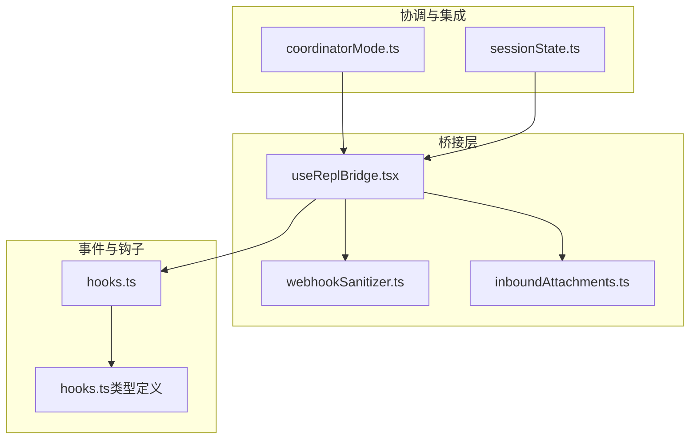
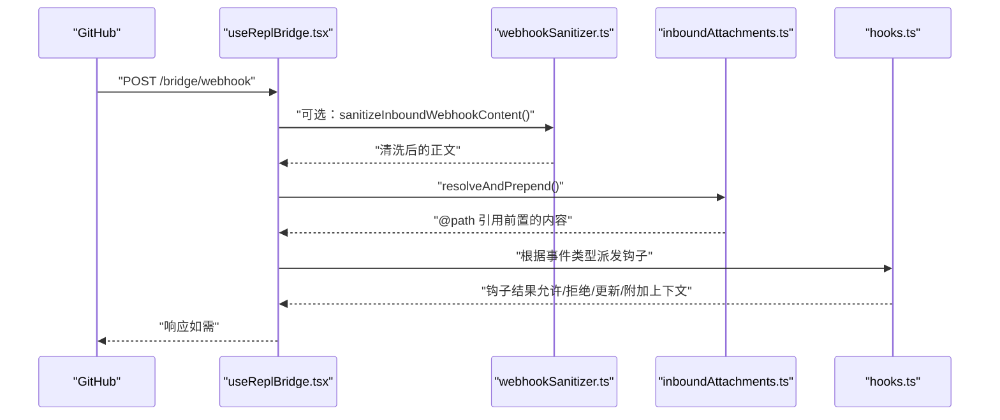
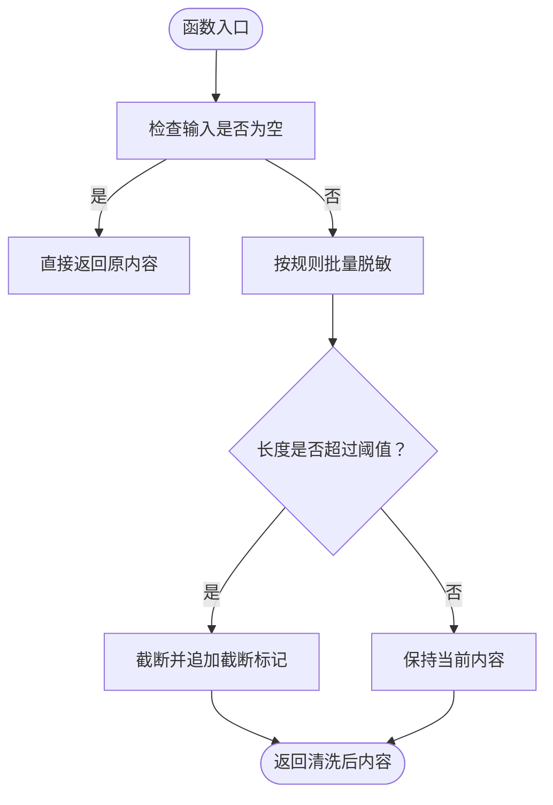
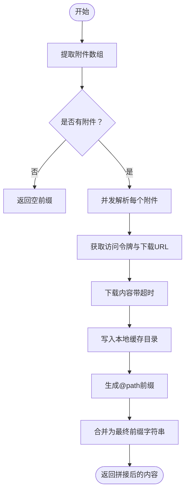
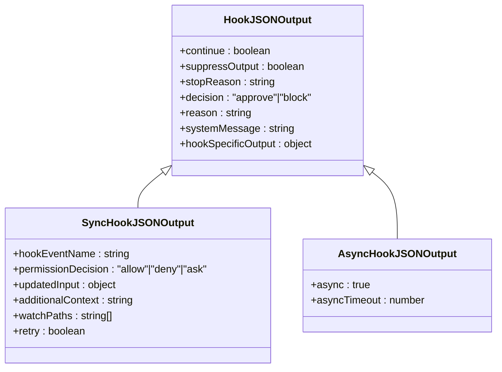
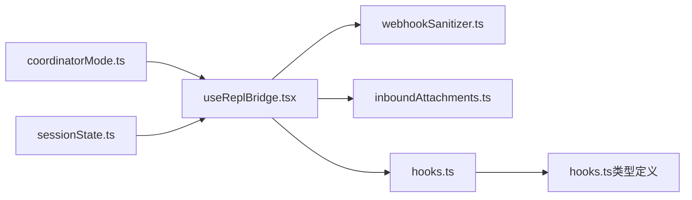

# Webhook 事件系统

<cite>
**本文引用的文件**
- [webhookSanitizer.ts](file://src/bridge/webhookSanitizer.ts)
- [useReplBridge.tsx](file://src/hooks/useReplBridge.tsx)
- [inboundAttachments.ts](file://src/bridge/inboundAttachments.ts)
- [hooks.ts](file://src/utils/hooks.ts)
- [hooks.ts（类型定义）](file://src/types/hooks.ts)
- [coordinatorMode.ts](file://src/coordinator/coordinatorMode.ts)
- [sessionState.ts](file://src/utils/sessionState.ts)
</cite>

## 目录
1. [简介](#简介)
2. [项目结构](#项目结构)
3. [核心组件](#核心组件)
4. [架构总览](#架构总览)
5. [详细组件分析](#详细组件分析)
6. [依赖关系分析](#依赖关系分析)
7. [性能考量](#性能考量)
8. [故障排查指南](#故障排查指南)
9. [结论](#结论)
10. [附录](#附录)

## 简介
本文件面向 Claude Code 的 Webhook 事件系统，聚焦于 GitHub Webhook 的接收与处理流程、安全清洗、附件解析与预处理、以及与会话系统的集成方式。文档将从系统架构、数据流、处理逻辑、错误处理与安全防护等方面进行深入说明，并提供最佳实践与排障建议。

## 项目结构
与 Webhook 事件系统直接相关的核心模块包括：
- 入站消息与附件处理：负责从桥接层接收用户消息、提取并解析附件、拼接本地路径引用。
- 安全清洗：对入站 Webhook 内容进行敏感信息脱敏与超长截断，确保日志与会话中不泄露敏感数据。
- 钩子系统：统一的事件驱动扩展机制，支持命令型、回调型与 HTTP 型钩子；Webhook 事件可作为触发点参与后续处理。
- 协调器模式：提供订阅/退订 PR 活动的接口说明，用于将外部事件转化为内部消息。

**图表来源**
- [useReplBridge.tsx:222-236](file://src/hooks/useReplBridge.tsx#L222-L236)
- [webhookSanitizer.ts:34-57](file://src/bridge/webhookSanitizer.ts#L34-L57)
- [inboundAttachments.ts:167-176](file://src/bridge/inboundAttachments.ts#L167-L176)
- [hooks.ts:1-800](file://src/utils/hooks.ts#L1-L800)
- [hooks.ts（类型定义）:1-290](file://src/types/hooks.ts#L1-L290)
- [coordinatorMode.ts:120-140](file://src/coordinator/coordinatorMode.ts#L120-L140)
- [sessionState.ts:1-20](file://src/utils/sessionState.ts#L1-L20)

**章节来源**
- [useReplBridge.tsx:222-236](file://src/hooks/useReplBridge.tsx#L222-L236)
- [webhookSanitizer.ts:1-58](file://src/bridge/webhookSanitizer.ts#L1-L58)
- [inboundAttachments.ts:1-176](file://src/bridge/inboundAttachments.ts#L1-L176)
- [hooks.ts:1-800](file://src/utils/hooks.ts#L1-L800)
- [hooks.ts（类型定义）:1-290](file://src/types/hooks.ts#L1-L290)
- [coordinatorMode.ts:120-140](file://src/coordinator/coordinatorMode.ts#L120-L140)
- [sessionState.ts:1-20](file://src/utils/sessionState.ts#L1-L20)

## 核心组件
- 入站 Webhook 清洗器：在启用特性开关时，对入站 GitHub Webhook 的原始内容执行敏感信息脱敏与长度截断，确保日志与会话安全。
- 入站附件解析器：从消息中提取附件元数据，下载到本地缓存目录，生成 @path 引用并前置到内容末尾，便于后续工具读取。
- 钩子系统：统一的事件驱动扩展框架，支持命令型、回调型与 HTTP 型钩子；通过输入上下文与输出模式控制后续行为（允许/拒绝/询问/更新输入/追加上下文等）。
- 协调器模式：提供订阅/退订 PR 活动的接口说明，将外部事件转化为内部消息，供会话使用。

**章节来源**
- [webhookSanitizer.ts:1-58](file://src/bridge/webhookSanitizer.ts#L1-L58)
- [inboundAttachments.ts:1-176](file://src/bridge/inboundAttachments.ts#L1-L176)
- [hooks.ts:1-800](file://src/utils/hooks.ts#L1-L800)
- [hooks.ts（类型定义）:1-290](file://src/types/hooks.ts#L1-L290)
- [coordinatorMode.ts:120-140](file://src/coordinator/coordinatorMode.ts#L120-L140)

## 架构总览
下图展示了从 Webhook 到会话处理的关键路径：消息进入桥接层后，按需进行内容清洗与附件解析，随后进入钩子系统进行事件处理与决策，最终注入会话或触发进一步动作。

**图表来源**
- [useReplBridge.tsx:222-236](file://src/hooks/useReplBridge.tsx#L222-L236)
- [webhookSanitizer.ts:34-57](file://src/bridge/webhookSanitizer.ts#L34-L57)
- [inboundAttachments.ts:167-176](file://src/bridge/inboundAttachments.ts#L167-L176)
- [hooks.ts:1-800](file://src/utils/hooks.ts#L1-L800)

## 详细组件分析

### 组件一：入站 Webhook 清洗器（webhookSanitizer.ts）
职责与能力
- 在启用特性开关时，对入站 Webhook 的原始内容进行敏感信息脱敏（如 GitHub PAT、Anthropic 密钥、AWS 凭证、Slack 令牌等），并在必要时截断过长内容，避免日志膨胀与潜在泄露。
- 该函数必须同步且不可抛出异常，异常情况下返回安全占位符字符串。

关键实现要点
- 敏感模式匹配：内置多类常见密钥与令牌格式的正则表达式，覆盖 GitHub、Anthropic、AWS、npm、Slack 等场景。
- 截断策略：超过阈值（约 100KB）时截断并追加标记，避免跨边界截断导致的敏感信息泄露。
- 错误兜底：任何异常均返回安全占位符，确保不会将原始内容写入日志或会话。

**图表来源**
- [webhookSanitizer.ts:34-57](file://src/bridge/webhookSanitizer.ts#L34-L57)

**章节来源**
- [webhookSanitizer.ts:1-58](file://src/bridge/webhookSanitizer.ts#L1-L58)

### 组件二：入站附件解析与前置（inboundAttachments.ts）
职责与能力
- 从入站消息中提取附件元数据（file_uuid、file_name），尝试下载到本地缓存目录，并生成带引号的 @path 引用，前置到内容末尾，以便后续工具读取。
- 最佳努力策略：若无访问令牌、网络失败、非 2xx 或磁盘写入失败，仅记录调试日志并跳过该附件，保证消息仍能到达模型。

关键实现要点
- 下载与存储：基于桥接访问令牌与基础地址拉取内容，写入 ~/.claude/uploads/{sessionId}/，命名规范化以避免路径问题。
- 路径拼接：为每个附件生成唯一前缀与安全文件名，避免同名冲突；最终以 quoted 形式拼接到内容末尾。
- 失败处理：严格捕获异常并降级为“无附件”，不影响整体消息传递。

**图表来源**
- [inboundAttachments.ts:167-176](file://src/bridge/inboundAttachments.ts#L167-L176)

**章节来源**
- [inboundAttachments.ts:1-176](file://src/bridge/inboundAttachments.ts#L1-L176)

### 组件三：桥接层入站消息处理（useReplBridge.tsx）
职责与能力
- 在启用特性开关时，先对入站内容进行清洗，再解析并前置附件，最后将消息注入会话或触发后续处理。
- 动态导入清洗与附件模块，避免在非桥接模式下引入无关代码。

关键实现要点
- 条件执行：仅当特性开关开启时才进行清洗与附件解析。
- 解析与拼接：先清洗，再解析附件并前置 @path 引用，确保内容结构正确。

**章节来源**
- [useReplBridge.tsx:222-236](file://src/hooks/useReplBridge.tsx#L222-L236)

### 组件四：钩子系统（hooks.ts 与 hooks.ts 类型定义）
职责与能力
- 提供统一的事件驱动扩展机制，支持命令型、回调型与 HTTP 型钩子。
- 对于 Webhook 事件，可通过钩子系统进行权限决策、输入更新、上下文附加、异步处理等操作。
- 输出模式支持：允许、拒绝、询问、阻止继续、停止原因、系统消息、附加上下文、更新 MCP 工具输出等。

关键实现要点
- 同步/异步钩子：首行检测 {"async": true}，支持后台运行与唤醒机制。
- 输出解析：严格校验 JSON 结构，支持空体与非 JSON 的错误提示。
- 权限与输入更新：针对 PreToolUse、PermissionRequest 等事件，支持更新输入与权限决策。
- 超时与取消：为钩子执行设置默认超时，支持 AbortSignal 中断。

**图表来源**
- [hooks.ts（类型定义）:50-176](file://src/types/hooks.ts#L50-L176)

**章节来源**
- [hooks.ts:1-800](file://src/utils/hooks.ts#L1-L800)
- [hooks.ts（类型定义）:1-290](file://src/types/hooks.ts#L1-L290)

### 组件五：协调器模式与 PR 订阅（coordinatorMode.ts）
职责与能力
- 提供订阅/退订 GitHub PR 活动的接口说明，事件以用户消息形式进入会话。
- 明确指出某些状态变更（如 mergeable 状态）无法通过 Webhook 获取，需轮询查询。

**章节来源**
- [coordinatorMode.ts:120-140](file://src/coordinator/coordinatorMode.ts#L120-L140)

### 组件六：会话状态与日志（sessionState.ts）
职责与能力
- 记录 Webhook 载荷的类型化日志，便于诊断与审计。

**章节来源**
- [sessionState.ts:1-20](file://src/utils/sessionState.ts#L1-L20)

## 依赖关系分析
- useReplBridge.tsx 依赖 webhookSanitizer.ts 与 inboundAttachments.ts，实现内容清洗与附件前置。
- inboundAttachments.ts 依赖桥接配置与本地文件系统，负责下载与落盘。
- hooks.ts 依赖类型定义与工具集，负责事件分发、输出解析与权限控制。
- coordinatorMode.ts 与 sessionState.ts 为上层集成与可观测性提供支撑。

**图表来源**
- [useReplBridge.tsx:222-236](file://src/hooks/useReplBridge.tsx#L222-L236)
- [webhookSanitizer.ts:34-57](file://src/bridge/webhookSanitizer.ts#L34-L57)
- [inboundAttachments.ts:167-176](file://src/bridge/inboundAttachments.ts#L167-L176)
- [hooks.ts:1-800](file://src/utils/hooks.ts#L1-L800)
- [hooks.ts（类型定义）:1-290](file://src/types/hooks.ts#L1-L290)
- [coordinatorMode.ts:120-140](file://src/coordinator/coordinatorMode.ts#L120-L140)
- [sessionState.ts:1-20](file://src/utils/sessionState.ts#L1-L20)

**章节来源**
- [useReplBridge.tsx:222-236](file://src/hooks/useReplBridge.tsx#L222-L236)
- [webhookSanitizer.ts:1-58](file://src/bridge/webhookSanitizer.ts#L1-L58)
- [inboundAttachments.ts:1-176](file://src/bridge/inboundAttachments.ts#L1-L176)
- [hooks.ts:1-800](file://src/utils/hooks.ts#L1-L800)
- [hooks.ts（类型定义）:1-290](file://src/types/hooks.ts#L1-L290)
- [coordinatorMode.ts:120-140](file://src/coordinator/coordinatorMode.ts#L120-L140)
- [sessionState.ts:1-20](file://src/utils/sessionState.ts#L1-L20)

## 性能考量
- 并发下载：附件解析采用并发策略，提升吞吐；同时注意磁盘与网络资源限制。
- 超时与取消：钩子执行设置默认超时，避免长时间阻塞；AbortSignal 支持中断。
- 日志与截断：清洗器在脱敏后再截断，避免跨边界泄露；日志中仅保留脱敏后的安全内容。
- 附件大小：建议控制单次 Webhook 附件总量，避免频繁大文件下载影响会话响应时间。

## 故障排查指南
常见问题与定位
- Webhook 内容未被清洗：确认特性开关已启用，检查清洗函数是否被调用。
- 附件未生效：检查访问令牌是否存在、下载是否返回非 2xx、磁盘写入是否成功；查看调试日志。
- 钩子输出不符合规范：核对输出 JSON 结构与字段，参考类型定义中的 schema。
- 会话中出现敏感信息：确认清洗规则是否覆盖对应格式，必要时调整正则或增加新规则。

定位步骤
- 查看 useReplBridge.tsx 的调用链，确认清洗与附件前置是否执行。
- 检查 inboundAttachments.ts 的下载与写入日志，关注失败分支。
- 校验 hooks.ts 的输出解析与权限决策分支，确认事件名与字段一致。
- 使用 sessionState.ts 的日志记录辅助定位 Webhook 载荷类型与关键字段。

**章节来源**
- [useReplBridge.tsx:222-236](file://src/hooks/useReplBridge.tsx#L222-L236)
- [inboundAttachments.ts:1-176](file://src/bridge/inboundAttachments.ts#L1-L176)
- [hooks.ts:454-488](file://src/utils/hooks.ts#L454-L488)
- [sessionState.ts:1-20](file://src/utils/sessionState.ts#L1-L20)

## 结论
Claude Code 的 Webhook 事件系统通过“清洗—解析—钩子—注入”的流水线，实现了对 GitHub Webhook 的安全接入与灵活扩展。清洗器保障了敏感信息不外泄，附件解析器提供了稳定的本地化文件访问能力，钩子系统则为权限控制、输入更新与上下文增强提供了统一接口。配合协调器模式与可观测性日志，整体具备良好的安全性、可维护性与可扩展性。

## 附录

### Webhook 配置与验证（基于现有实现的实践建议）
- 特性开关：启用 KAIROS_GITHUB_WEBHOOKS 以激活清洗与附件处理逻辑。
- 访问令牌：确保桥接访问令牌可用，以便下载附件。
- 超时与重试：为钩子设置合理超时；对网络失败采用指数退避重试策略。
- 幂等性：在钩子中实现幂等逻辑（如去重标识），避免重复处理同一事件。
- 过滤与路由：结合钩子匹配器与事件上下文，按工具名、源类型等进行事件过滤。

**章节来源**
- [useReplBridge.tsx:222-236](file://src/hooks/useReplBridge.tsx#L222-L236)
- [inboundAttachments.ts:1-176](file://src/bridge/inboundAttachments.ts#L1-L176)
- [hooks.ts:1-800](file://src/utils/hooks.ts#L1-L800)