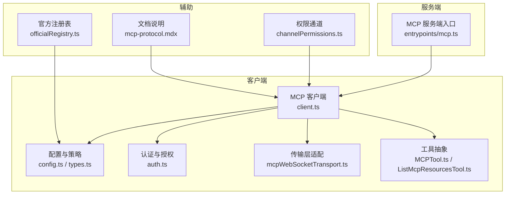
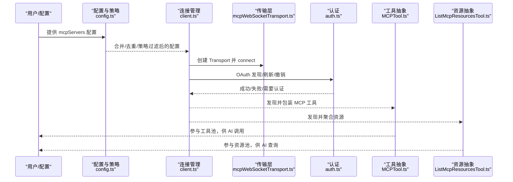
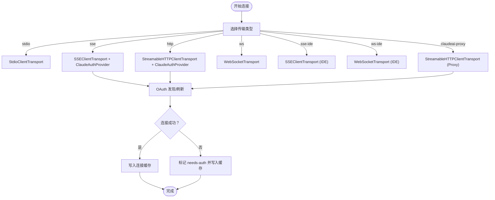
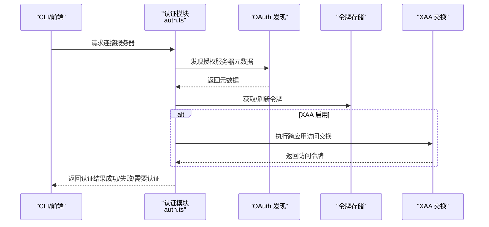
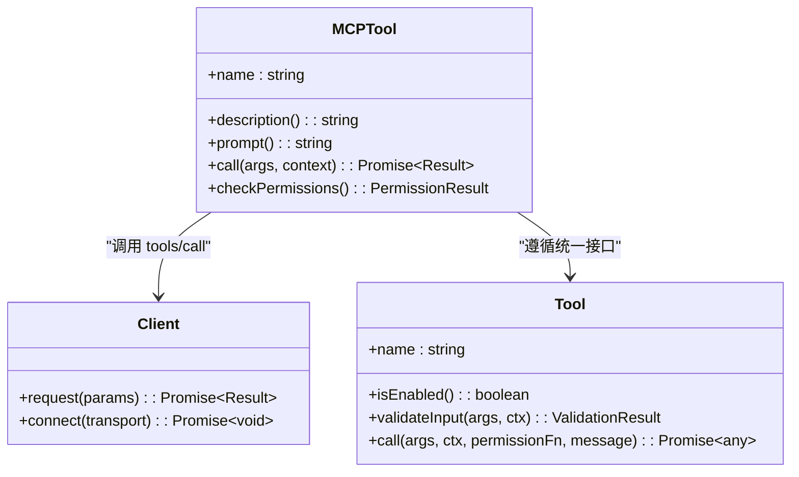
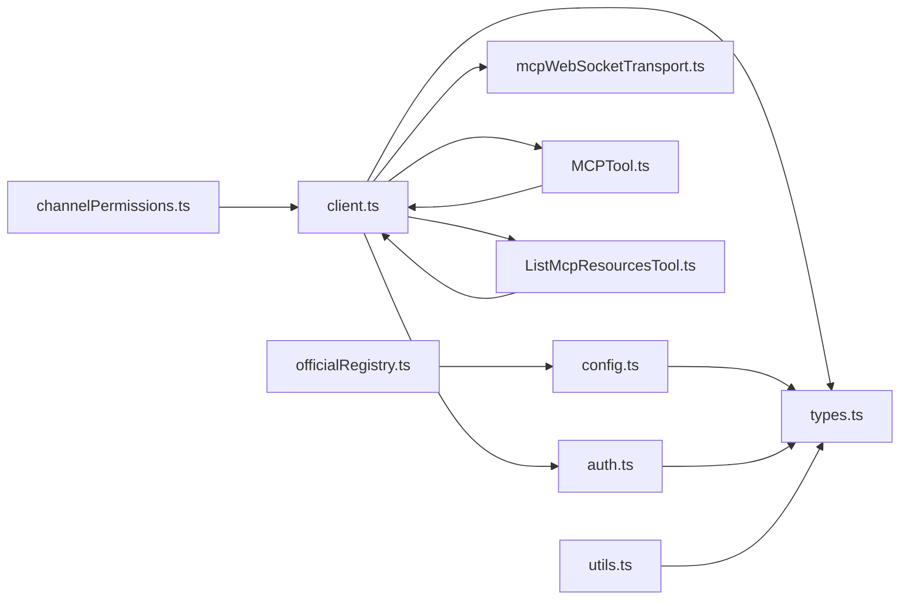

# MCP 协议 API

<cite>
**本文引用的文件**
- [client.ts](file://src/services/mcp/client.ts)
- [config.ts](file://src/services/mcp/config.ts)
- [types.ts](file://src/services/mcp/types.ts)
- [auth.ts](file://src/services/mcp/auth.ts)
- [utils.ts](file://src/services/mcp/utils.ts)
- [mcp-protocol.mdx](file://docs/extensibility/mcp-protocol.mdx)
- [mcpWebSocketTransport.ts](file://src/utils/mcpWebSocketTransport.ts)
- [MCPTool.ts](file://src/tools/MCPTool/MCPTool.ts)
- [ListMcpResourcesTool.ts](file://src/tools/ListMcpResourcesTool/ListMcpResourcesTool.ts)
- [officialRegistry.ts](file://src/services/mcp/officialRegistry.ts)
- [channelPermissions.ts](file://src/services/mcp/channelPermissions.ts)
- [mcp.ts](file://src/entrypoints/mcp.ts)
</cite>

## 目录
1. [简介](#简介)
2. [项目结构](#项目结构)
3. [核心组件](#核心组件)
4. [架构总览](#架构总览)
5. [详细组件分析](#详细组件分析)
6. [依赖关系分析](#依赖关系分析)
7. [性能考量](#性能考量)
8. [故障排查指南](#故障排查指南)
9. [结论](#结论)
10. [附录](#附录)

## 简介
本文件系统性梳理 Claude Code Best 的 MCP（Model Context Protocol）协议实现，覆盖协议版本与消息格式、服务器发现与连接、认证流程、工具与资源发现、能力声明、配置与权限管理、生命周期与状态同步、错误处理与调试优化等。文档以代码为依据，结合官方文档与测试用例，提供面向开发者的权威参考。

## 项目结构
围绕 MCP 的核心模块分布于以下位置：
- 服务端入口与工具暴露：src/entrypoints/mcp.ts
- 客户端连接与工具执行：src/services/mcp/client.ts
- 配置与策略：src/services/mcp/config.ts、src/services/mcp/types.ts
- 认证与授权：src/services/mcp/auth.ts
- 传输层适配：src/utils/mcpWebSocketTransport.ts
- 工具与资源抽象：src/tools/MCPTool/MCPTool.ts、src/tools/ListMcpResourcesTool/ListMcpResourcesTool.ts
- 权限通道与合规：src/services/mcp/channelPermissions.ts
- 官方注册表与 URL 归一化：src/services/mcp/officialRegistry.ts
- 文档与集成说明：docs/extensibility/mcp-protocol.mdx

**图表来源**
- [client.ts](file://src/services/mcp/client.ts)
- [config.ts](file://src/services/mcp/config.ts)
- [types.ts](file://src/services/mcp/types.ts)
- [auth.ts](file://src/services/mcp/auth.ts)
- [mcpWebSocketTransport.ts](file://src/utils/mcpWebSocketTransport.ts)
- [MCPTool.ts](file://src/tools/MCPTool/MCPTool.ts)
- [ListMcpResourcesTool.ts](file://src/tools/ListMcpResourcesTool/ListMcpResourcesTool.ts)
- [channelPermissions.ts](file://src/services/mcp/channelPermissions.ts)
- [officialRegistry.ts](file://src/services/mcp/officialRegistry.ts)
- [mcp-protocol.mdx](file://docs/extensibility/mcp-protocol.mdx)
- [mcp.ts](file://src/entrypoints/mcp.ts)

**章节来源**
- [mcp-protocol.mdx](file://docs/extensibility/mcp-protocol.mdx)

## 核心组件
- MCP 客户端与连接管理：负责创建不同传输类型的连接、缓存与重连、工具与资源发现、会话过期检测与重试。
- 配置与策略：定义服务器配置类型、签名去重、企业策略、URL 模式匹配、范围与作用域。
- 认证与授权：OAuth 发现、令牌刷新、跨应用访问（XAA）、令牌撤销、认证失败缓存。
- 传输层适配：WebSocketTransport 封装原生或 ws 包的事件模型，统一 JSON-RPC 消息收发。
- 工具与资源抽象：将 MCP 工具与资源映射为统一工具接口，支持只读、破坏性、并发安全等标注。
- 权限通道：在多通道（如 Telegram、iMessage）上进行权限提示与决策的桥接。
- 官方注册表：预取并校验官方 MCP 服务器 URL，辅助信任判定。
- 服务端入口：将本地工具暴露为 MCP 服务端，供外部客户端调用。

**章节来源**
- [client.ts](file://src/services/mcp/client.ts)
- [config.ts](file://src/services/mcp/config.ts)
- [types.ts](file://src/services/mcp/types.ts)
- [auth.ts](file://src/services/mcp/auth.ts)
- [mcpWebSocketTransport.ts](file://src/utils/mcpWebSocketTransport.ts)
- [MCPTool.ts](file://src/tools/MCPTool/MCPTool.ts)
- [ListMcpResourcesTool.ts](file://src/tools/ListMcpResourcesTool/ListMcpResourcesTool.ts)
- [channelPermissions.ts](file://src/services/mcp/channelPermissions.ts)
- [officialRegistry.ts](file://src/services/mcp/officialRegistry.ts)
- [mcp.ts](file://src/entrypoints/mcp.ts)

## 架构总览
下图展示从配置到可用工具的全链路：合并配置 → 管理连接 → 发现工具/资源 → 统一工具池 → AI 工具调用。

**图表来源**
- [config.ts](file://src/services/mcp/config.ts)
- [client.ts](file://src/services/mcp/client.ts)
- [mcpWebSocketTransport.ts](file://src/utils/mcpWebSocketTransport.ts)
- [auth.ts](file://src/services/mcp/auth.ts)
- [MCPTool.ts](file://src/tools/MCPTool/MCPTool.ts)
- [ListMcpResourcesTool.ts](file://src/tools/ListMcpResourcesTool/ListMcpResourcesTool.ts)

## 详细组件分析

### 协议版本与消息格式
- 协议实现基于 @modelcontextprotocol/sdk，使用 JSON-RPC 2.0 作为消息载体，支持 tools/list、tools/call、resources/list、prompts/list 等标准方法。
- 传输层封装了 SSEClientTransport、StreamableHTTPClientTransport、WebSocketTransport、StdioClientTransport 等，分别对应 SSE、HTTP 流、WebSocket、STDIO 四类连接。
- 客户端对请求设置 Accept: application/json, text/event-stream，满足 Streamable HTTP 规范要求。

**章节来源**
- [client.ts](file://src/services/mcp/client.ts)
- [mcpWebSocketTransport.ts](file://src/utils/mcpWebSocketTransport.ts)

### 服务器发现与连接建立
- 连接入口 connectToServer 支持七种传输类型：stdio、sse、http、sse-ide、ws-ide、ws、claudeai-proxy；默认 stdio。
- 连接缓存：使用 memoize 缓存连接对象，键为 `${name}-${JSON.stringify(config)}`，并在 onclose 清理工具/资源/LRU 缓存。
- 并发控制：本地服务器默认批大小 3，远程服务器默认批大小 20；批量连接按环境变量 MCP_SERVER_CONNECTION_BATCH_SIZE、MCP_REMOTE_SERVER_CONNECTION_BATCH_SIZE 控制。
- 连接降级：连续错误计数达到阈值（如 ECONNRESET、ETIMEDOUT、EPIPE）触发主动关闭与重连；HTTP 传输检测会话过期（404 + JSON-RPC code -32001）。

**图表来源**
- [client.ts](file://src/services/mcp/client.ts)
- [auth.ts](file://src/services/mcp/auth.ts)
- [mcpWebSocketTransport.ts](file://src/utils/mcpWebSocketTransport.ts)

**章节来源**
- [client.ts](file://src/services/mcp/client.ts)
- [config.ts](file://src/services/mcp/config.ts)

### 认证流程与权限控制
- OAuth 发现：优先使用配置的 authServerMetadataUrl，否则按 RFC 9728 → RFC 8414 探测；支持非标准错误码归一化。
- 令牌刷新：带超时的独立 fetch，避免 AbortSignal.timeout 的 GC 惰性导致内存泄漏。
- 令牌撤销：先撤销 refresh_token，再撤销 access_token；支持 RFC 7009 兼容与回退方案。
- 跨应用访问（XAA）：单点 IdP 登录，随后进行 RFC 8693 + RFC 7523 交换，复用 OAuth 存储。
- 认证失败缓存：needs-auth 写入 15 分钟 TTL 的缓存文件，避免重复弹窗。
- 权限通道：在多通道上进行权限提示与决策，要求服务器显式声明实验能力，确保可控的权限表面。

**图表来源**
- [auth.ts](file://src/services/mcp/auth.ts)

**章节来源**
- [auth.ts](file://src/services/mcp/auth.ts)
- [channelPermissions.ts](file://src/services/mcp/channelPermissions.ts)

### 工具注册机制与能力声明
- 工具发现：client.request('tools/list')，并使用 LRU 缓存（上限 20）；工具名格式为 mcp__<serverName>__<toolName>。
- 能力声明：客户端 capabilities 由服务端 capabilities 决定；工具标注来自 tool.annotations（只读、破坏性、开放世界、显示名）。
- 工具包装：统一为 Tool 接口，参与权限检查与 UI 渲染；默认行为为 passthrough，确保每次调用均走权限链路。

**图表来源**
- [MCPTool.ts](file://src/tools/MCPTool/MCPTool.ts)
- [client.ts](file://src/services/mcp/client.ts)

**章节来源**
- [client.ts](file://src/services/mcp/client.ts)
- [MCPTool.ts](file://src/tools/MCPTool/MCPTool.ts)

### 资源发现与能力协商
- 资源发现：client.request('resources/list')，结果按服务器聚合；ListMcpResourcesTool 支持筛选与汇总。
- 能力协商：客户端 capabilities 与服务端 capabilities 对齐；实验能力通过 capabilities.experimental 声明（如通道权限）。

**章节来源**
- [ListMcpResourcesTool.ts](file://src/tools/ListMcpResourcesTool/ListMcpResourcesTool.ts)
- [client.ts](file://src/services/mcp/client.ts)

### 配置管理与服务器管理
- 配置来源：user、project、local、dynamic、enterprise、claudeai 六种作用域；支持企业策略（允许/拒绝清单）与 URL 模式匹配。
- 去重策略：基于命令数组或 URL（去除查询参数）签名去重，避免插件与手动配置冲突。
- 项目级审批：.mcp.json 中的服务器需经项目设置审批（启用全部或单独批准），或在非交互模式下自动批准。
- 企业策略：denylist 优先于 allowlist；空 allowlist 表示禁止所有；支持命令/URL/名称三类匹配。

**章节来源**
- [config.ts](file://src/services/mcp/config.ts)
- [utils.ts](file://src/services/mcp/utils.ts)

### 工具生命周期与状态同步
- 生命周期：连接缓存命中/失效、工具/资源缓存命中/失效、onclose 清理、重连与自动重试。
- 状态同步：资源变更通知触发资源缓存失效；会话过期检测触发一次性重试。
- 错误处理：McpSessionExpiredError、McpAuthError、McpToolCallError_I_VERIFIED_THIS_IS_NOT_CODE_OR_FILEPATHS 等分类错误，配合日志与遥测。

**章节来源**
- [client.ts](file://src/services/mcp/client.ts)

### 服务端入口与工具暴露
- 服务端入口：startMCPServer 创建 Server，声明 capabilities.tools，注册 ListTools 与 CallTool 请求处理器。
- 工具暴露：将本地工具转换为 MCP 工具，输入/输出 Schema 通过 zod 转换；工具调用上下文包含命令、主循环模型、调试开关等。

**章节来源**
- [mcp.ts](file://src/entrypoints/mcp.ts)

## 依赖关系分析

**图表来源**
- [client.ts](file://src/services/mcp/client.ts)
- [types.ts](file://src/services/mcp/types.ts)
- [auth.ts](file://src/services/mcp/auth.ts)
- [mcpWebSocketTransport.ts](file://src/utils/mcpWebSocketTransport.ts)
- [MCPTool.ts](file://src/tools/MCPTool/MCPTool.ts)
- [ListMcpResourcesTool.ts](file://src/tools/ListMcpResourcesTool/ListMcpResourcesTool.ts)
- [config.ts](file://src/services/mcp/config.ts)
- [utils.ts](file://src/services/mcp/utils.ts)
- [officialRegistry.ts](file://src/services/mcp/officialRegistry.ts)
- [channelPermissions.ts](file://src/services/mcp/channelPermissions.ts)

**章节来源**
- [client.ts](file://src/services/mcp/client.ts)
- [config.ts](file://src/services/mcp/config.ts)
- [types.ts](file://src/services/mcp/types.ts)
- [auth.ts](file://src/services/mcp/auth.ts)
- [mcpWebSocketTransport.ts](file://src/utils/mcpWebSocketTransport.ts)
- [MCPTool.ts](file://src/tools/MCPTool/MCPTool.ts)
- [ListMcpResourcesTool.ts](file://src/tools/ListMcpResourcesTool/ListMcpResourcesTool.ts)
- [utils.ts](file://src/services/mcp/utils.ts)
- [officialRegistry.ts](file://src/services/mcp/officialRegistry.ts)
- [channelPermissions.ts](file://src/services/mcp/channelPermissions.ts)

## 性能考量
- 请求级超时：wrapFetchWithTimeout 为每个请求创建独立超时控制器，避免 AbortSignal.timeout 的 GC 惰性导致内存占用。
- 连接缓存：lodash.memoize 缓存连接对象，减少重复握手成本；onclose 清理工具/资源/LRU 缓存，避免陈旧状态。
- 并发控制：本地服务器默认批大小 3，远程服务器默认批大小 20，平衡资源占用与吞吐。
- 工具描述截断：限制 MCP 工具描述长度，避免大体积描述影响模型上下文。
- 图片处理：二进制内容持久化与自动缩放，降低内存峰值与网络开销。

**章节来源**
- [client.ts](file://src/services/mcp/client.ts)
- [mcp-protocol.mdx](file://docs/extensibility/mcp-protocol.mdx)

## 故障排查指南
- 认证失败（needs-auth）：检查 OAuth 配置、令牌是否过期或被撤销；查看 needs-auth 缓存文件与日志。
- 会话过期（404 + JSON-RPC code -32001）：触发一次性重试，若仍失败，清理缓存并重新连接。
- 连接失败（ECONNRESET/ETIMEDOUT/EPIPE）：超过连续错误阈值后主动关闭并重连；检查网络代理与 TLS 设置。
- 工具调用错误：捕获 McpToolCallError_I_VERIFIED_THIS_IS_NOT_CODE_OR_FILEPATHS，保留 _meta 信息用于诊断。
- 权限通道问题：确认服务器已声明实验能力，且通道在允许列表内；核对短 ID 与回复格式。

**章节来源**
- [client.ts](file://src/services/mcp/client.ts)
- [auth.ts](file://src/services/mcp/auth.ts)
- [channelPermissions.ts](file://src/services/mcp/channelPermissions.ts)

## 结论
本文件基于源码对 Claude Code Best 的 MCP 协议实现进行了全面梳理，涵盖连接、认证、工具与资源发现、能力声明、配置与权限、生命周期与状态同步、错误处理与性能优化等方面。开发者可据此快速理解并扩展 MCP 能力，构建稳定可靠的模型上下文服务生态。

## 附录

### MCP 通信示例（步骤说明）
- 工具调用
  1) 确保连接有效（重连/缓存命中）
  2) 发送 tools/call 请求
  3) 处理图片结果（缩放/持久化）
  4) 内容截断与元数据保留
  5) 返回结果或错误
- 资源获取
  1) 发送 resources/list 请求
  2) 按服务器聚合结果
  3) 在 onclose 或资源变更通知后失效缓存
- 能力协商
  1) 读取服务端 capabilities
  2) 根据 capabilities 决定可用功能
  3) 实验能力需显式声明

**章节来源**
- [client.ts](file://src/services/mcp/client.ts)
- [ListMcpResourcesTool.ts](file://src/tools/ListMcpResourcesTool/ListMcpResourcesTool.ts)