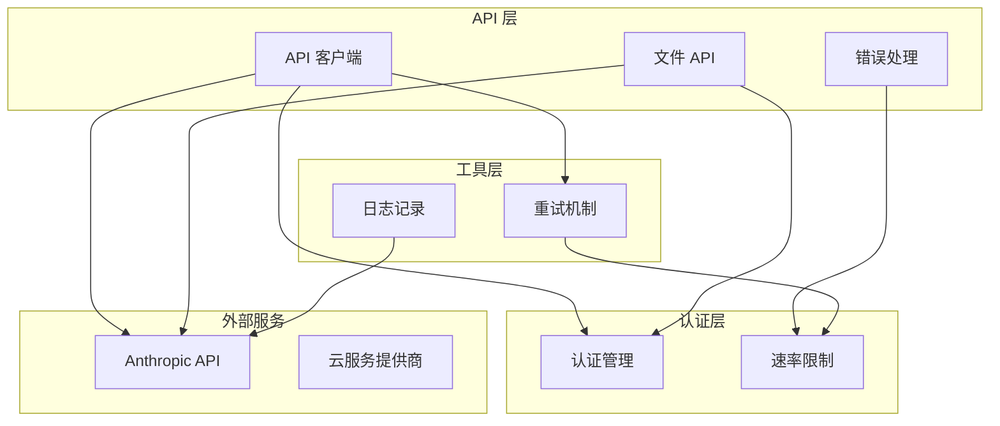
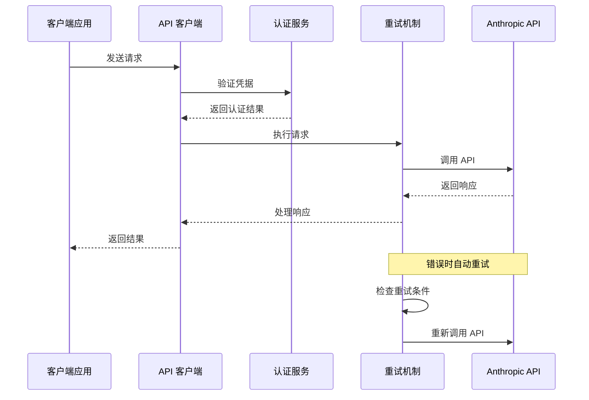
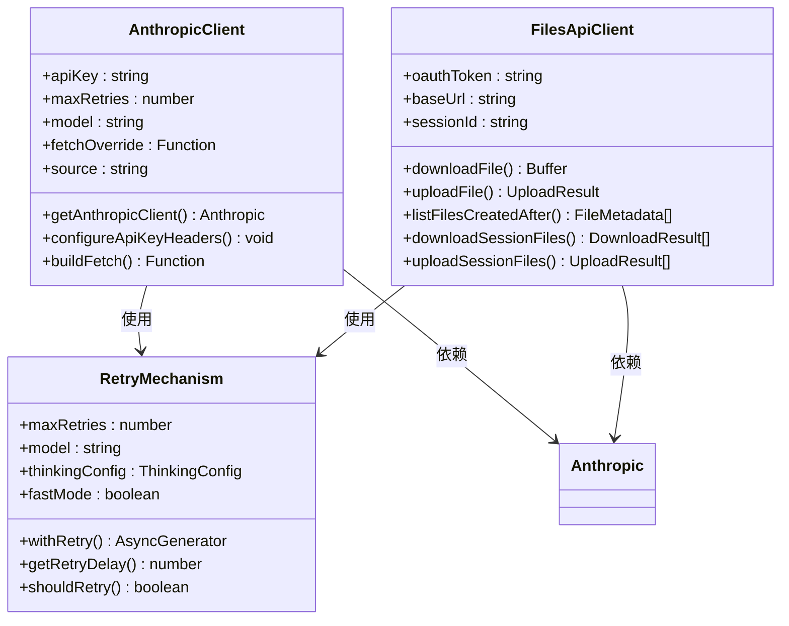
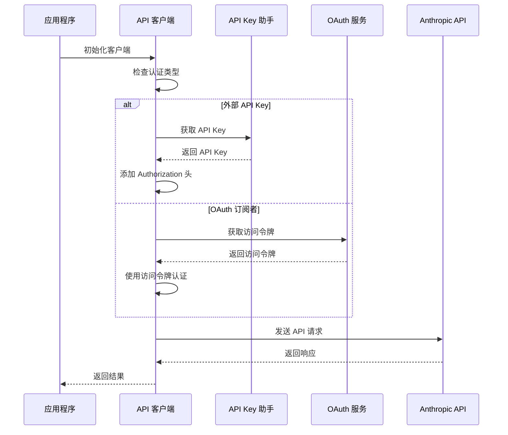
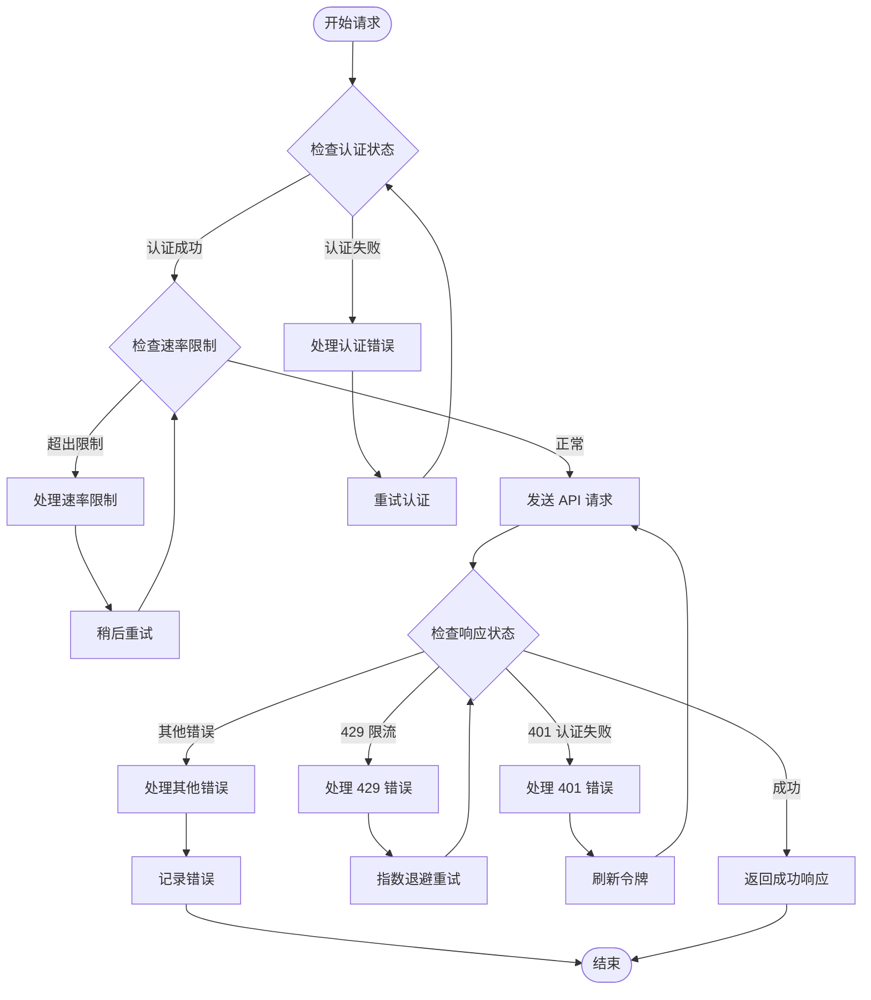
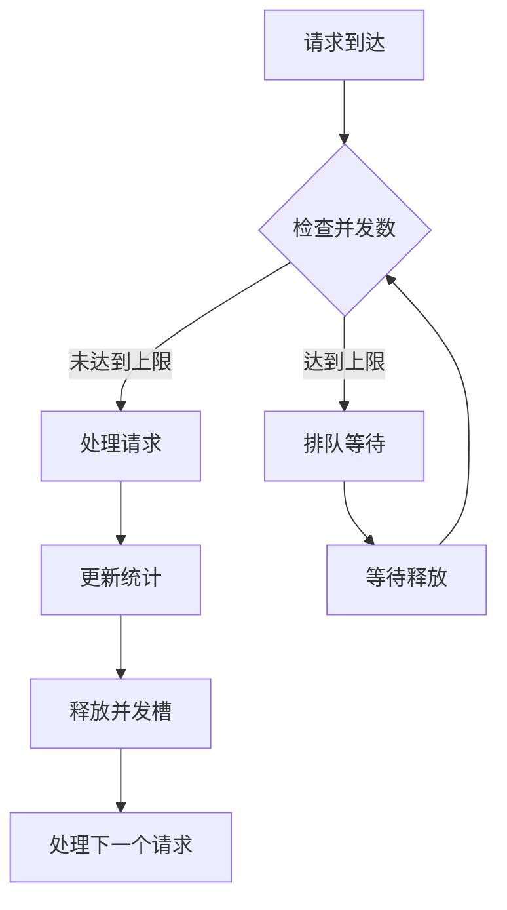

# REST API 接口

<cite>
**本文档引用的文件**
- [client.ts](file://src/services/api/client.ts)
- [claude.ts](file://src/services/api/claude.ts)
- [filesApi.ts](file://src/services/api/filesApi.ts)
- [errors.ts](file://src/services/api/errors.ts)
- [logging.ts](file://src/services/api/logging.ts)
- [withRetry.ts](file://src/services/api/withRetry.ts)
- [claudeAiLimits.ts](file://src/services/claudeAiLimits.ts)
- [auth.ts](file://src/utils/auth.ts)
- [errorUtils.ts](file://src/services/api/errorUtils.ts)
- [external-dependencies.md](file://docs/external-dependencies.md)
</cite>

## 目录
1. [简介](#简介)
2. [项目结构](#项目结构)
3. [核心组件](#核心组件)
4. [架构概览](#架构概览)
5. [详细组件分析](#详细组件分析)
6. [依赖关系分析](#依赖关系分析)
7. [性能考量](#性能考量)
8. [故障排除指南](#故障排除指南)
9. [结论](#结论)

## 简介

本文档为 Claude Code Best 提供详细的 REST API 接口文档。Claude Code Best 是一个基于 Anthropic Claude API 的智能代码助手，通过统一的 API 客户端封装支持多种认证方式和部署环境。

该系统提供了以下主要功能：
- 消息对话接口：支持文本和工具调用的对话交互
- 文件管理接口：支持文件上传、下载和列表操作
- 错误处理机制：完善的错误分类和重试策略
- 速率限制管理：基于头部信息的配额监控和告警
- 安全认证：支持 API Key 和 OAuth 两种认证方式

## 项目结构

Claude Code Best 的 API 架构采用模块化设计，主要组件分布如下：



**图表来源**
- [client.ts:88-316](file://src/services/api/client.ts#L88-L316)
- [claude.ts:1-50](file://src/services/api/claude.ts#L1-L50)
- [filesApi.ts:1-50](file://src/services/api/filesApi.ts#L1-L50)

**章节来源**
- [client.ts:1-390](file://src/services/api/client.ts#L1-L390)
- [claude.ts:1-200](file://src/services/api/claude.ts#L1-L200)
- [filesApi.ts:1-100](file://src/services/api/filesApi.ts#L1-L100)

## 核心组件

### API 客户端管理

API 客户端是整个系统的入口点，负责：
- 统一的认证处理和头部配置
- 多种部署环境的支持（第一方、AWS Bedrock、GCP Vertex、Azure Foundry）
- 请求超时和重试机制
- 代理和自定义头部支持

### 文件管理服务

文件管理服务提供完整的文件生命周期管理：
- 文件上传（支持多文件并发）
- 文件下载（支持断点续传）
- 文件列表查询
- 并发控制和重试机制

### 错误处理系统

错误处理系统具备以下特性：
- 详细的错误分类和标签化
- 自动化的重试策略
- 用户友好的错误消息
- 详细的日志记录和追踪

**章节来源**
- [client.ts:88-316](file://src/services/api/client.ts#L88-L316)
- [filesApi.ts:125-345](file://src/services/api/filesApi.ts#L125-L345)
- [errors.ts:425-934](file://src/services/api/errors.ts#L425-L934)

## 架构概览

Claude Code Best 采用分层架构设计，确保了良好的可维护性和扩展性：



**图表来源**
- [client.ts:131-140](file://src/services/api/client.ts#L131-L140)
- [withRetry.ts:170-253](file://src/services/api/withRetry.ts#L170-L253)

**章节来源**
- [client.ts:318-328](file://src/services/api/client.ts#L318-L328)
- [withRetry.ts:170-517](file://src/services/api/withRetry.ts#L170-L517)

## 详细组件分析

### API 客户端类图



**图表来源**
- [client.ts:88-316](file://src/services/api/client.ts#L88-L316)
- [filesApi.ts:125-593](file://src/services/api/filesApi.ts#L125-L593)
- [withRetry.ts:170-253](file://src/services/api/withRetry.ts#L170-L253)

### 认证流程序列图



**图表来源**
- [client.ts:318-328](file://src/services/api/client.ts#L318-L328)
- [auth.ts:470-500](file://src/utils/auth.ts#L470-L500)

**章节来源**
- [client.ts:318-328](file://src/services/api/client.ts#L318-L328)
- [auth.ts:470-500](file://src/utils/auth.ts#L470-L500)

### 错误处理流程图



**图表来源**
- [errors.ts:465-558](file://src/services/api/errors.ts#L465-L558)
- [withRetry.ts:696-787](file://src/services/api/withRetry.ts#L696-L787)

**章节来源**
- [errors.ts:465-558](file://src/services/api/errors.ts#L465-L558)
- [withRetry.ts:696-787](file://src/services/api/withRetry.ts#L696-L787)

## 依赖关系分析

### 外部依赖关系

```mermaid
graph LR
subgraph "内部模块"
Client[API 客户端]
Files[文件 API]
Errors[错误处理]
Retry[重试机制]
Limits[速率限制]
end
subgraph "外部库"
AnthropicSDK[@anthropic-ai/sdk]
Axios[axios]
GoogleAuth[google-auth-library]
AWS[aws-sdk]
end
subgraph "云服务"
Bedrock[AWS Bedrock]
Vertex[GCP Vertex]
Foundry[Azure Foundry]
end
Client --> AnthropicSDK
Files --> Axios
Client --> GoogleAuth
Client --> AWS
Client --> Bedrock
Client --> Vertex
Client --> Foundry
Retry --> Limits
Errors --> Limits
```

**图表来源**
- [client.ts:1-25](file://src/services/api/client.ts#L1-L25)
- [filesApi.ts:10-25](file://src/services/api/filesApi.ts#L10-L25)

**章节来源**
- [client.ts:1-31](file://src/services/api/client.ts#L1-L31)
- [filesApi.ts:10-28](file://src/services/api/filesApi.ts#L10-L28)

### 内部模块耦合度分析

系统采用松耦合设计，各模块职责明确：
- **低耦合高内聚**：每个模块专注于特定功能领域
- **接口抽象**：通过统一接口处理不同云服务提供商
- **错误隔离**：错误处理在独立模块中实现
- **配置驱动**：通过环境变量控制行为

## 性能考量

### 缓存策略

系统实现了多层次的缓存机制：
- **提示词缓存**：支持 1 小时 TTL 的全局缓存
- **工具调用缓存**：针对工具执行结果的缓存
- **认证缓存**：API Key 和 OAuth 令牌的缓存
- **响应缓存**：针对重复请求的响应缓存

### 并发控制



**图表来源**
- [filesApi.ts:270-307](file://src/services/api/filesApi.ts#L270-L307)
- [withRetry.ts:530-548](file://src/services/api/withRetry.ts#L530-L548)

### 重试策略优化

系统采用智能重试策略：
- **指数退避**：基础延迟 500ms，最大 32 秒
- **条件重试**：仅对可重试的错误进行重试
- **持久模式**：支持长时间挂起的重试
- **快速模式降级**：在限流时自动降级到标准速度

**章节来源**
- [withRetry.ts:530-548](file://src/services/api/withRetry.ts#L530-L548)
- [filesApi.ts:270-307](file://src/services/api/filesApi.ts#L270-L307)

## 故障排除指南

### 常见错误诊断

| 错误类型 | HTTP 状态码 | 常见原因 | 解决方案 |
|---------|------------|----------|----------|
| 认证失败 | 401 | API Key 无效或过期 | 检查 API Key 配置，重新登录 |
| 权限不足 | 403 | OAuth 令牌被撤销 | 刷新 OAuth 令牌 |
| 请求过多 | 429 | 速率限制触发 | 等待重置时间或降低请求频率 |
| 超时 | 408 | 网络连接问题 | 检查网络连接，增加超时时间 |
| 内部错误 | 500 | 服务器内部错误 | 稍后重试或联系支持 |

### 诊断工具

系统提供了丰富的诊断工具：
- **详细日志**：通过 `--debug` 参数启用调试模式
- **请求追踪**：自动添加客户端请求 ID
- **错误分类**：详细的错误类型标签化
- **性能指标**：请求耗时和重试次数统计

**章节来源**
- [errors.ts:965-1161](file://src/services/api/errors.ts#L965-L1161)
- [logging.ts:235-396](file://src/services/api/logging.ts#L235-L396)

## 结论

Claude Code Best 的 REST API 接口设计体现了现代 API 的最佳实践：

**主要优势**：
- **统一的认证接口**：支持多种认证方式的无缝切换
- **强大的错误处理**：完善的错误分类和自动重试机制
- **灵活的部署选项**：支持多种云服务提供商和部署环境
- **高性能设计**：多层缓存和并发控制确保高吞吐量

**技术特点**：
- 模块化架构设计，职责分离清晰
- 智能的重试策略和错误恢复机制
- 详细的日志记录和监控支持
- 灵活的配置选项和环境适配

该 API 设计为 Claude Code Best 提供了稳定可靠的服务接口，能够满足各种复杂场景下的需求。