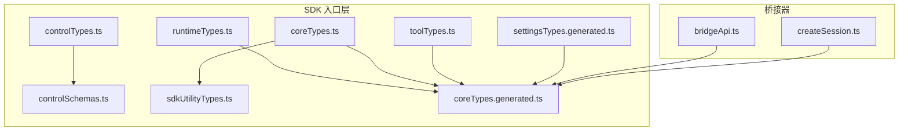
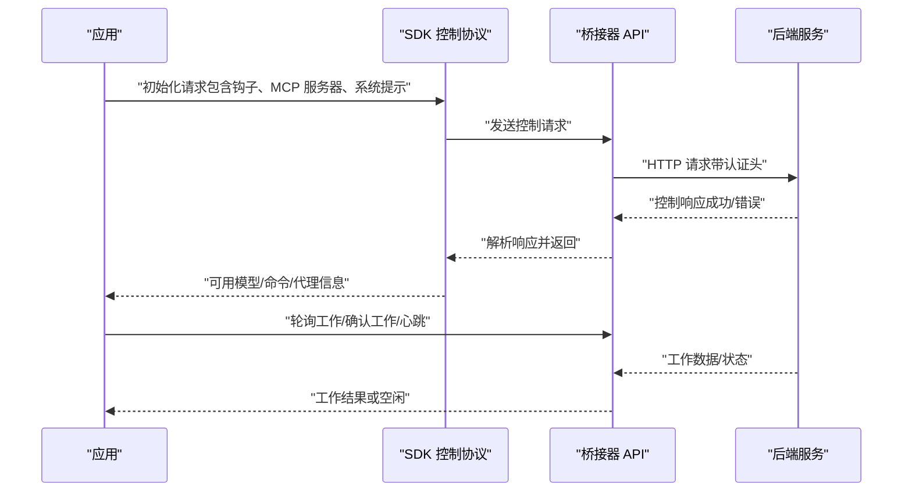
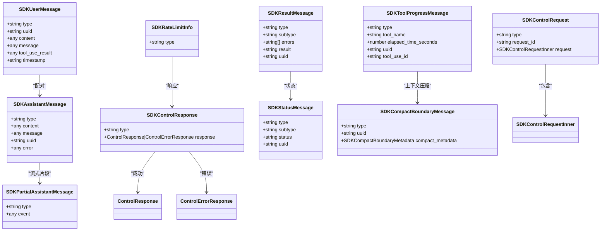
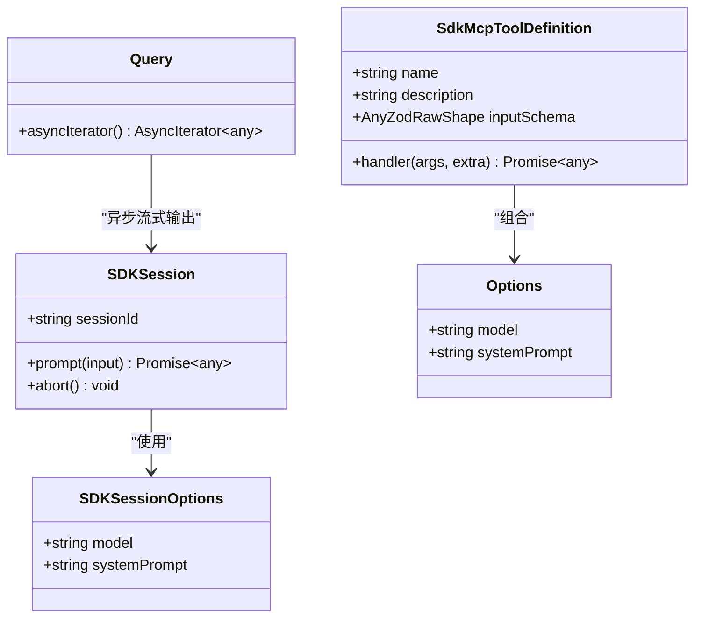
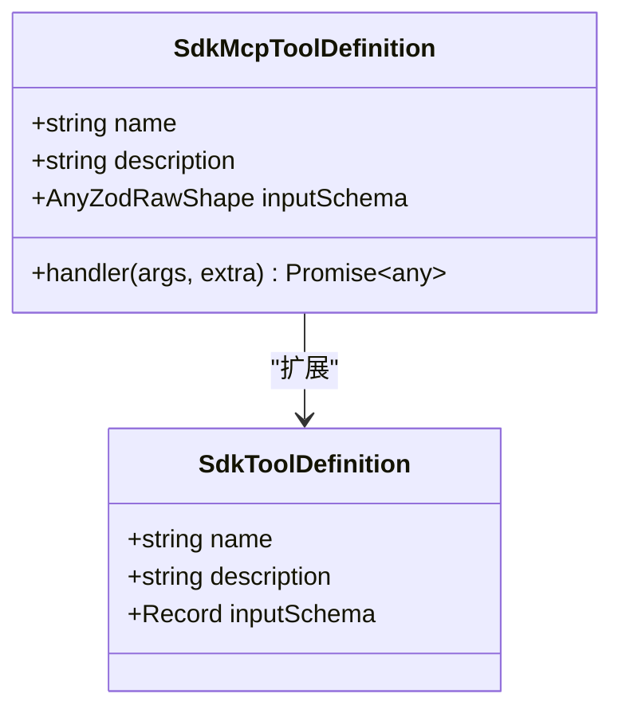
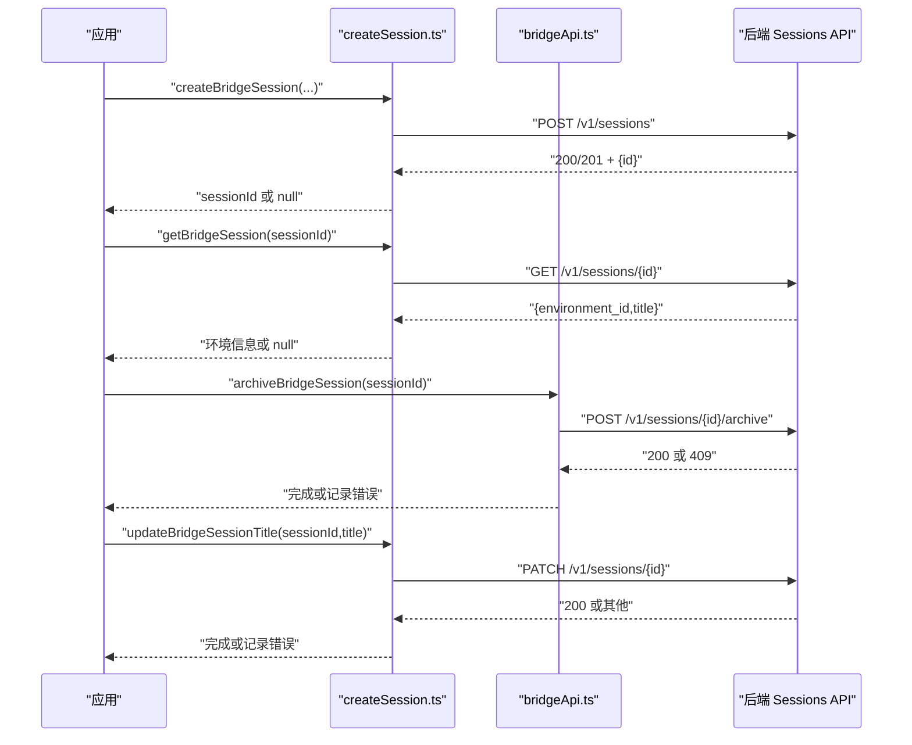
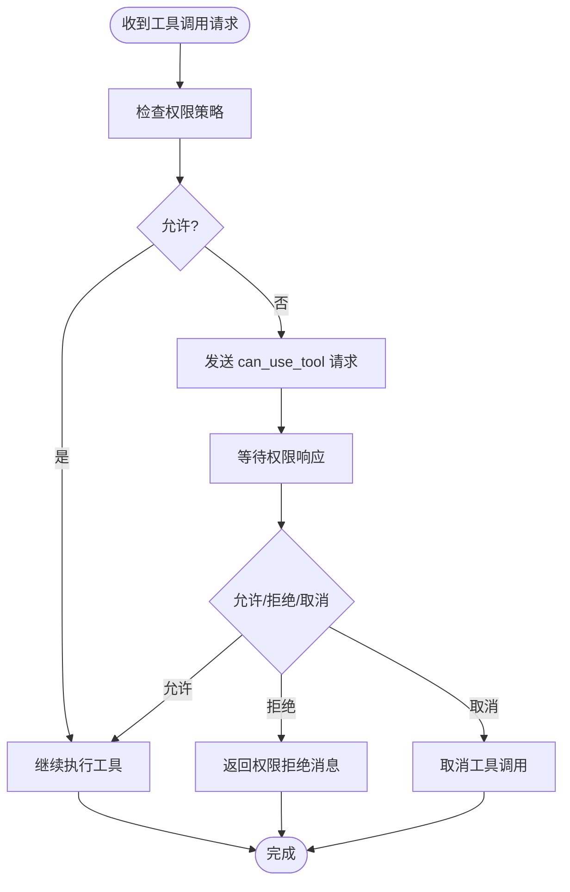
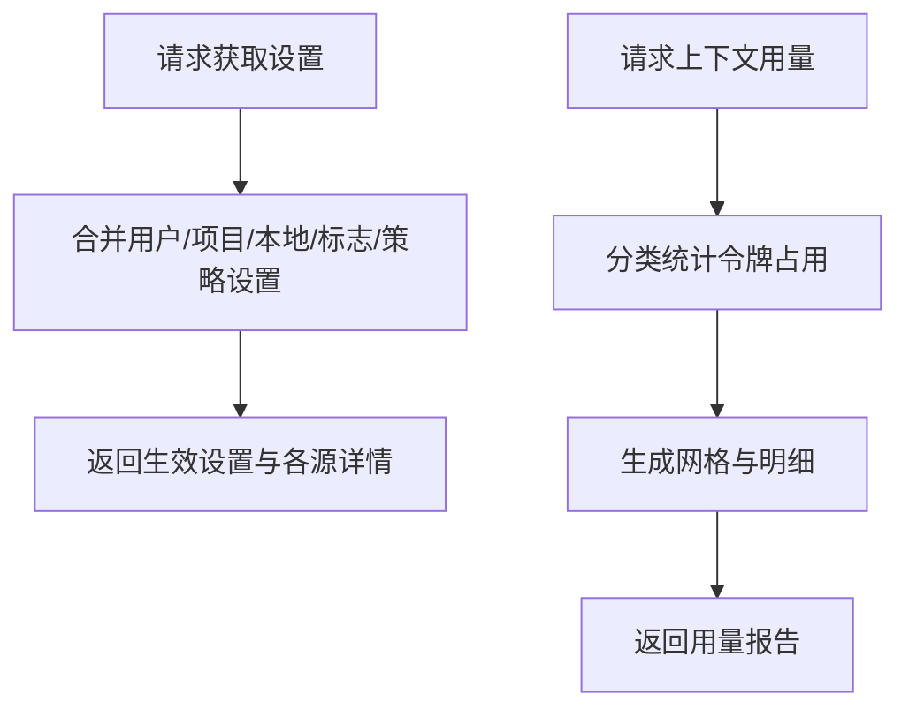
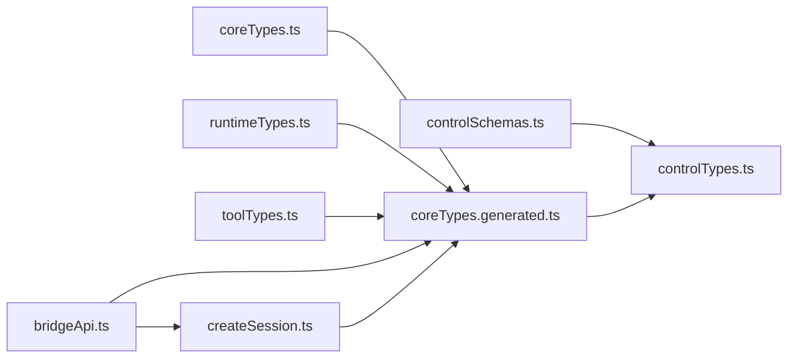

# SDK API 接口

<cite>
**本文引用的文件**
- [coreTypes.ts](file://src/entrypoints/sdk/coreTypes.ts)
- [coreTypes.generated.ts](file://src/entrypoints/sdk/coreTypes.generated.ts)
- [toolTypes.ts](file://src/entrypoints/sdk/toolTypes.ts)
- [controlTypes.ts](file://src/entrypoints/sdk/controlTypes.ts)
- [controlSchemas.ts](file://src/entrypoints/sdk/controlSchemas.ts)
- [runtimeTypes.ts](file://src/entrypoints/sdk/runtimeTypes.ts)
- [sdkUtilityTypes.ts](file://src/entrypoints/sdk/sdkUtilityTypes.ts)
- [settingsTypes.generated.ts](file://src/entrypoints/sdk/settingsTypes.generated.ts)
- [bridgeApi.ts](file://src/bridge/bridgeApi.ts)
- [createSession.ts](file://src/bridge/createSession.ts)
</cite>

## 目录
1. [简介](#简介)
2. [项目结构](#项目结构)
3. [核心组件](#核心组件)
4. [架构总览](#架构总览)
5. [详细组件分析](#详细组件分析)
6. [依赖分析](#依赖分析)
7. [性能考虑](#性能考虑)
8. [故障排查指南](#故障排查指南)
9. [结论](#结论)
10. [附录](#附录)

## 简介
本文件为 Claude Code Best 的 SDK API 接口文档，聚焦于 SDK 的核心接口与类型定义，涵盖：
- SDK 初始化配置与客户端实例创建
- 会话管理（创建、查询、归档、重命名）
- 工具调用 API 与命令执行接口
- 事件监听机制（钩子事件、权限请求、状态消息等）
- Node.js 与浏览器环境集成要点
- 版本兼容性、升级路径与废弃警告
- 错误处理、日志记录与性能监控接口
- 扩展开发指南、自定义工具集成与第三方库适配建议

## 项目结构
SDK 类型与协议主要位于入口点目录中，配合桥接器模块完成与后端服务的通信。

**图表来源**
- [controlTypes.ts:1-35](file://src/entrypoints/sdk/controlTypes.ts#L1-L35)
- [controlSchemas.ts:1-664](file://src/entrypoints/sdk/controlSchemas.ts#L1-L664)
- [runtimeTypes.ts:1-64](file://src/entrypoints/sdk/runtimeTypes.ts#L1-L64)
- [sdkUtilityTypes.ts:1-25](file://src/entrypoints/sdk/sdkUtilityTypes.ts#L1-L25)
- [toolTypes.ts:1-10](file://src/entrypoints/sdk/toolTypes.ts#L1-L10)
- [coreTypes.generated.ts:1-180](file://src/entrypoints/sdk/coreTypes.generated.ts#L1-L180)
- [coreTypes.ts:1-63](file://src/entrypoints/sdk/coreTypes.ts#L1-L63)
- [settingsTypes.generated.ts:1-5](file://src/entrypoints/sdk/settingsTypes.generated.ts#L1-L5)
- [bridgeApi.ts:1-540](file://src/bridge/bridgeApi.ts#L1-L540)
- [createSession.ts:1-385](file://src/bridge/createSession.ts#L1-L385)

**章节来源**
- [coreTypes.ts:1-63](file://src/entrypoints/sdk/coreTypes.ts#L1-L63)
- [coreTypes.generated.ts:1-180](file://src/entrypoints/sdk/coreTypes.generated.ts#L1-L180)
- [toolTypes.ts:1-10](file://src/entrypoints/sdk/toolTypes.ts#L1-L10)
- [controlTypes.ts:1-35](file://src/entrypoints/sdk/controlTypes.ts#L1-L35)
- [controlSchemas.ts:1-664](file://src/entrypoints/sdk/controlSchemas.ts#L1-L664)
- [runtimeTypes.ts:1-64](file://src/entrypoints/sdk/runtimeTypes.ts#L1-L64)
- [sdkUtilityTypes.ts:1-25](file://src/entrypoints/sdk/sdkUtilityTypes.ts#L1-L25)
- [settingsTypes.generated.ts:1-5](file://src/entrypoints/sdk/settingsTypes.generated.ts#L1-L5)
- [bridgeApi.ts:1-540](file://src/bridge/bridgeApi.ts#L1-L540)
- [createSession.ts:1-385](file://src/bridge/createSession.ts#L1-L385)

## 核心组件
- SDK 控制协议类型：由 Zod 模式推断出的控制请求/响应与消息类型，用于 CLI 桥与服务器之间的通信。
- 运行时类型：非序列化类型（回调、接口）与会话接口定义，用于 SDK 实现者在运行时使用。
- 核心类型：SDK 可消费的通用可序列化类型（消息、权限、MCP 配置、钩子输入等）。
- 工具类型：工具定义的最小接口（名称、描述、输入模式），便于构建自定义工具。
- 设置类型：设置结构的占位类型（由 JSON Schema 生成）。
- 桥接器 API：封装与后端桥接服务交互的客户端方法（注册环境、轮询任务、确认工作、心跳、事件上报等）。
- 会话创建与管理：通过桥接器创建、获取、归档与更新标题的会话操作。

**章节来源**
- [controlTypes.ts:1-35](file://src/entrypoints/sdk/controlTypes.ts#L1-L35)
- [runtimeTypes.ts:1-64](file://src/entrypoints/sdk/runtimeTypes.ts#L1-L64)
- [coreTypes.ts:1-63](file://src/entrypoints/sdk/coreTypes.ts#L1-L63)
- [coreTypes.generated.ts:1-180](file://src/entrypoints/sdk/coreTypes.generated.ts#L1-L180)
- [toolTypes.ts:1-10](file://src/entrypoints/sdk/toolTypes.ts#L1-L10)
- [settingsTypes.generated.ts:1-5](file://src/entrypoints/sdk/settingsTypes.generated.ts#L1-L5)
- [bridgeApi.ts:1-540](file://src/bridge/bridgeApi.ts#L1-L540)
- [createSession.ts:1-385](file://src/bridge/createSession.ts#L1-L385)

## 架构总览
SDK 通过“控制协议”与“桥接器”协同工作：
- 控制协议定义了请求/响应与消息格式，确保 CLI 与 SDK 实现之间的稳定契约。
- 桥接器负责与后端服务交互，完成环境注册、会话生命周期管理与事件上报。
- 运行时类型与核心类型为 SDK 消费者提供一致的类型安全体验。

**图表来源**
- [controlSchemas.ts:55-95](file://src/entrypoints/sdk/controlSchemas.ts#L55-L95)
- [bridgeApi.ts:141-197](file://src/bridge/bridgeApi.ts#L141-L197)
- [bridgeApi.ts:199-247](file://src/bridge/bridgeApi.ts#L199-L247)

**章节来源**
- [controlSchemas.ts:1-664](file://src/entrypoints/sdk/controlSchemas.ts#L1-L664)
- [bridgeApi.ts:1-540](file://src/bridge/bridgeApi.ts#L1-L540)

## 详细组件分析

### 控制协议类型与消息
- 控制请求/响应类型：基于 Zod 模式推断，覆盖初始化、权限请求、MCP 状态、上下文用量、撤销异步消息、种子读取状态、插件重载、任务停止、设置获取与应答、用户引导（elicitation）等。
- 消息类型：标准 SDK 消息、用户消息、助手消息、部分助手消息、结果消息、状态消息、工具进度消息、压缩边界消息、速率限制信息等。
- 钩子事件：预工具使用、后工具使用、工具使用失败、通知、用户提交提示、会话开始/结束、停止/失败、子代理启动/停止、压缩前后、权限请求/拒绝、设置变更、工作树创建/移除、指令加载、当前目录/文件变化等。

**图表来源**
- [controlTypes.ts:23-35](file://src/entrypoints/sdk/controlTypes.ts#L23-L35)
- [coreTypes.generated.ts:100-146](file://src/entrypoints/sdk/coreTypes.generated.ts#L100-L146)
- [controlSchemas.ts:552-610](file://src/entrypoints/sdk/controlSchemas.ts#L552-L610)

**章节来源**
- [controlTypes.ts:1-35](file://src/entrypoints/sdk/controlTypes.ts#L1-L35)
- [coreTypes.generated.ts:100-146](file://src/entrypoints/sdk/coreTypes.generated.ts#L100-L146)
- [controlSchemas.ts:55-664](file://src/entrypoints/sdk/controlSchemas.ts#L55-L664)

### 运行时类型与会话接口
- SDKSession：会话对象，包含 sessionId、prompt（支持字符串或异步迭代器）、abort 等。
- 选项与查询：SDKSessionOptions、InternalOptions、Query、InternalQuery 等。
- 动态 MCP 工具：SdkMcpToolDefinition，支持泛型输入模式与处理器函数。
- 会话操作：fork、get、list、mutate 等选项与结果类型。

**图表来源**
- [runtimeTypes.ts:17-22](file://src/entrypoints/sdk/runtimeTypes.ts#L17-L22)
- [runtimeTypes.ts:24-28](file://src/entrypoints/sdk/runtimeTypes.ts#L24-L28)
- [runtimeTypes.ts:30-36](file://src/entrypoints/sdk/runtimeTypes.ts#L30-L36)
- [runtimeTypes.ts:45-62](file://src/entrypoints/sdk/runtimeTypes.ts#L45-L62)

**章节来源**
- [runtimeTypes.ts:1-64](file://src/entrypoints/sdk/runtimeTypes.ts#L1-L64)

### 工具类型与自定义工具
- SdkToolDefinition：最小工具定义接口，包含名称、描述与输入模式。
- SdkMcpToolDefinition：动态 MCP 工具定义，支持泛型输入模式与处理器函数，便于在 SDK 中注册自定义工具。

**图表来源**
- [toolTypes.ts:4-9](file://src/entrypoints/sdk/toolTypes.ts#L4-L9)
- [runtimeTypes.ts:30-36](file://src/entrypoints/sdk/runtimeTypes.ts#L30-L36)

**章节来源**
- [toolTypes.ts:1-10](file://src/entrypoints/sdk/toolTypes.ts#L1-L10)
- [runtimeTypes.ts:30-36](file://src/entrypoints/sdk/runtimeTypes.ts#L30-L36)

### 会话管理（创建、查询、归档、重命名）
- 创建会话：向 Sessions API 发送事件与上下文，返回会话 ID；支持 Git 源与产出上下文。
- 查询会话：获取会话的环境 ID 与标题。
- 归档会话：显式归档任意状态的会话，幂等处理已归档场景。
- 更新标题：保持与远端同步的最佳努力操作。

**图表来源**
- [createSession.ts:34-180](file://src/bridge/createSession.ts#L34-L180)
- [createSession.ts:190-244](file://src/bridge/createSession.ts#L190-L244)
- [createSession.ts:263-317](file://src/bridge/createSession.ts#L263-L317)
- [createSession.ts:327-384](file://src/bridge/createSession.ts#L327-L384)
- [bridgeApi.ts:325-356](file://src/bridge/bridgeApi.ts#L325-L356)

**章节来源**
- [createSession.ts:1-385](file://src/bridge/createSession.ts#L1-L385)
- [bridgeApi.ts:325-356](file://src/bridge/bridgeApi.ts#L325-L356)

### 权限与钩子事件
- 权限请求：can_use_tool 控制请求携带工具名、输入与建议规则，支持阻断路径与决策原因。
- 钩子事件：涵盖工具使用前后、通知、用户提示提交、会话生命周期、停止/失败、子代理、压缩、权限请求/拒绝、设置变更、工作树与文件变化等。
- 事件上报：通过桥接器发送权限响应事件到后端。

**图表来源**
- [controlSchemas.ts:106-122](file://src/entrypoints/sdk/controlSchemas.ts#L106-L122)
- [bridgeApi.ts:419-450](file://src/bridge/bridgeApi.ts#L419-L450)

**章节来源**
- [controlSchemas.ts:106-122](file://src/entrypoints/sdk/controlSchemas.ts#L106-L122)
- [bridgeApi.ts:419-450](file://src/bridge/bridgeApi.ts#L419-L450)

### 设置与上下文用量
- 获取设置：合并多源设置并返回生效值与各源详情。
- 上下文用量：按类别统计令牌占用、网格可视化、延迟加载内置工具、系统工具、技能、代理与命令等。

**图表来源**
- [controlSchemas.ts:475-520](file://src/entrypoints/sdk/controlSchemas.ts#L475-L520)
- [controlSchemas.ts:175-306](file://src/entrypoints/sdk/controlSchemas.ts#L175-L306)

**章节来源**
- [controlSchemas.ts:475-520](file://src/entrypoints/sdk/controlSchemas.ts#L475-L520)
- [controlSchemas.ts:175-306](file://src/entrypoints/sdk/controlSchemas.ts#L175-L306)

## 依赖分析
- 控制协议依赖 Zod 模式与核心类型生成器，确保类型与运行时验证一致。
- 运行时类型与核心类型相互补充：前者承载非序列化能力，后者提供可传输的契约。
- 桥接器 API 依赖认证与组织信息，统一注入头信息并处理 401 刷新与错误映射。
- 会话管理通过桥接器 API 与 Sessions API 协作，保证幂等与最佳努力行为。

**图表来源**
- [controlSchemas.ts:1-31](file://src/entrypoints/sdk/controlSchemas.ts#L1-L31)
- [controlTypes.ts:7-21](file://src/entrypoints/sdk/controlTypes.ts#L7-L21)
- [coreTypes.ts:12-22](file://src/entrypoints/sdk/coreTypes.ts#L12-L22)
- [runtimeTypes.ts:1-64](file://src/entrypoints/sdk/runtimeTypes.ts#L1-L64)
- [toolTypes.ts:1-10](file://src/entrypoints/sdk/toolTypes.ts#L1-L10)
- [bridgeApi.ts:1-540](file://src/bridge/bridgeApi.ts#L1-L540)
- [createSession.ts:1-385](file://src/bridge/createSession.ts#L1-L385)

**章节来源**
- [controlSchemas.ts:1-664](file://src/entrypoints/sdk/controlSchemas.ts#L1-L664)
- [controlTypes.ts:1-35](file://src/entrypoints/sdk/controlTypes.ts#L1-L35)
- [coreTypes.ts:1-63](file://src/entrypoints/sdk/coreTypes.ts#L1-L63)
- [runtimeTypes.ts:1-64](file://src/entrypoints/sdk/runtimeTypes.ts#L1-L64)
- [toolTypes.ts:1-10](file://src/entrypoints/sdk/toolTypes.ts#L1-L10)
- [bridgeApi.ts:1-540](file://src/bridge/bridgeApi.ts#L1-L540)
- [createSession.ts:1-385](file://src/bridge/createSession.ts#L1-L385)

## 性能考虑
- 轮询与心跳：桥接器提供心跳与轮询接口，避免频繁轮询导致的 429 限制。
- 幂等与最佳努力：会话归档与标题更新采用幂等设计，减少重复请求带来的开销。
- 上下文用量可视化：通过网格与分类统计帮助识别高占用来源，优化上下文窗口使用。

[本节为通用指导，不直接分析具体文件]

## 故障排查指南
- 认证失败（401）：触发 OAuth 刷新流程，若刷新失败则抛出致命错误；请检查访问令牌与刷新回调。
- 权限相关（403）：区分可抑制的权限错误与核心功能影响的错误；对于外部轮询与管理操作的 403 可能无需用户提示。
- 会话过期（410/404）：提示重新启动远程控制会话。
- 速率限制（429）：降低轮询频率，遵循后端建议。
- 会话创建/查询失败：检查网络、组织 UUID 与认证头；记录详细错误信息以便定位。

**章节来源**
- [bridgeApi.ts:454-500](file://src/bridge/bridgeApi.ts#L454-L500)
- [bridgeApi.ts:502-508](file://src/bridge/bridgeApi.ts#L502-L508)
- [bridgeApi.ts:516-524](file://src/bridge/bridgeApi.ts#L516-L524)
- [createSession.ts:146-166](file://src/bridge/createSession.ts#L146-L166)
- [createSession.ts:222-241](file://src/bridge/createSession.ts#L222-L241)
- [createSession.ts:299-316](file://src/bridge/createSession.ts#L299-L316)

## 结论
本 SDK 提供了以 Zod 模式驱动的强类型控制协议与运行时接口，结合桥接器实现与后端服务的稳定交互。通过会话管理、权限与钩子事件机制，开发者可以构建从 Node.js 到浏览器的跨平台集成方案，并在工具扩展、性能监控与错误处理方面获得一致的体验。

[本节为总结，不直接分析具体文件]

## 附录

### SDK 初始化配置与客户端实例创建
- 初始化请求：包含钩子匹配器、MCP 服务器、系统提示、代理与提示建议开关等。
- 客户端实例：通过 SDKSession 接口进行对话与中断；运行时选项支持模型与系统提示。

**章节来源**
- [controlSchemas.ts:57-95](file://src/entrypoints/sdk/controlSchemas.ts#L57-L95)
- [runtimeTypes.ts:17-22](file://src/entrypoints/sdk/runtimeTypes.ts#L17-L22)
- [runtimeTypes.ts:24-28](file://src/entrypoints/sdk/runtimeTypes.ts#L24-L28)

### 工具调用 API 与命令执行接口
- 工具定义：最小接口与动态 MCP 工具定义，支持泛型输入模式与处理器。
- 命令执行：通过控制协议中的命令列表与代理信息获取可用命令与代理。

**章节来源**
- [toolTypes.ts:4-9](file://src/entrypoints/sdk/toolTypes.ts#L4-L9)
- [runtimeTypes.ts:30-36](file://src/entrypoints/sdk/runtimeTypes.ts#L30-L36)
- [controlSchemas.ts:77-94](file://src/entrypoints/sdk/controlSchemas.ts#L77-L94)

### 事件监听机制
- 钩子事件：覆盖工具使用、通知、会话生命周期、停止/失败、权限请求/拒绝、设置变更、工作树与文件变化等。
- 权限响应事件：通过桥接器上报权限决策与用户输入。

**章节来源**
- [coreTypes.ts:25-53](file://src/entrypoints/sdk/coreTypes.ts#L25-L53)
- [bridgeApi.ts:419-450](file://src/bridge/bridgeApi.ts#L419-L450)

### Node.js 与浏览器环境集成
- Node.js：可直接使用桥接器 API 与会话管理函数，具备完整的认证与组织头注入。
- 浏览器：建议通过受控通道（如远程控制桥接）与后端交互，注意认证与 CORS 处理。

[本节为通用指导，不直接分析具体文件]

### 版本兼容性、升级路径与废弃警告
- 类型生成：核心类型由 Zod 模式生成，修改模式需重新生成类型文件。
- 控制协议：新增/变更请求/响应需同时更新模式与类型推断。
- 废弃警告：遵循模式注释中的内部标记与迁移建议，逐步替换旧字段与行为。

**章节来源**
- [coreTypes.ts:4-6](file://src/entrypoints/sdk/coreTypes.ts#L4-L6)
- [controlSchemas.ts:1-8](file://src/entrypoints/sdk/controlSchemas.ts#L1-L8)

### 错误处理、日志记录与性能监控接口
- 错误处理：统一的状态码映射与致命错误类型，支持 401 刷新与 403 抑制。
- 日志记录：桥接器与会话管理函数均提供调试日志输出。
- 性能监控：上下文用量统计与网格可视化，辅助识别热点与优化策略。

**章节来源**
- [bridgeApi.ts:454-500](file://src/bridge/bridgeApi.ts#L454-L500)
- [createSession.ts:152-157](file://src/bridge/createSession.ts#L152-L157)
- [createSession.ts:222-241](file://src/bridge/createSession.ts#L222-L241)
- [controlSchemas.ts:175-306](file://src/entrypoints/sdk/controlSchemas.ts#L175-L306)

### 扩展开发指南、自定义工具集成与第三方库适配建议
- 自定义工具：实现 SdkMcpToolDefinition，提供输入模式与处理器；在初始化阶段注册至 SDK。
- 第三方库适配：通过 MCP 服务器配置与 SDK 控制协议对接，确保消息格式与事件路由一致。
- 最佳实践：保持输入模式的 Zod 验证、事件的幂等处理与错误的明确分类。

**章节来源**
- [runtimeTypes.ts:30-36](file://src/entrypoints/sdk/runtimeTypes.ts#L30-L36)
- [controlSchemas.ts:374-403](file://src/entrypoints/sdk/controlSchemas.ts#L374-L403)