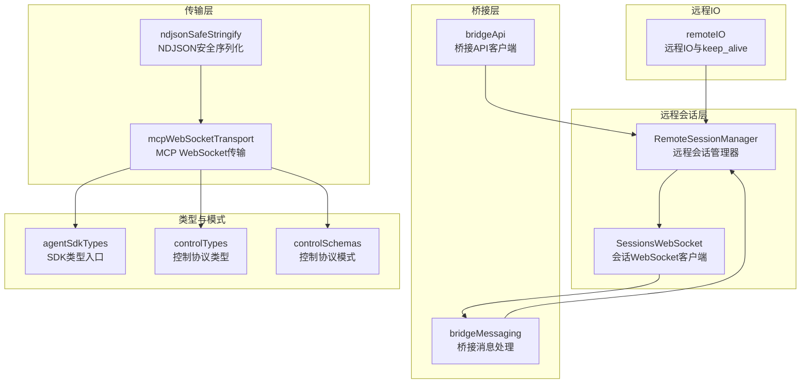
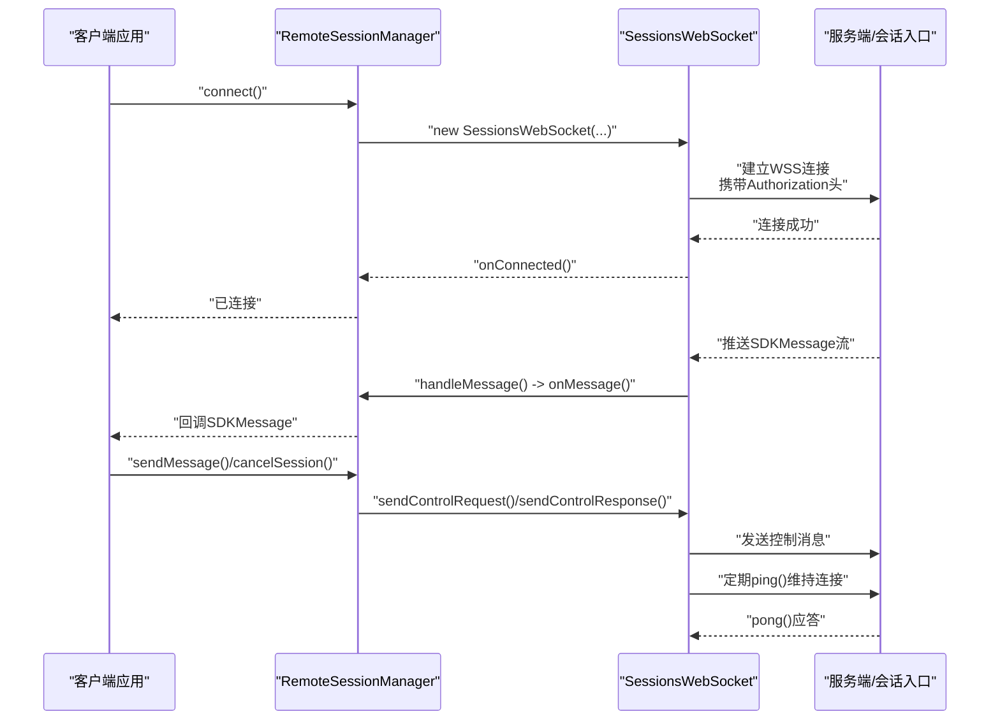
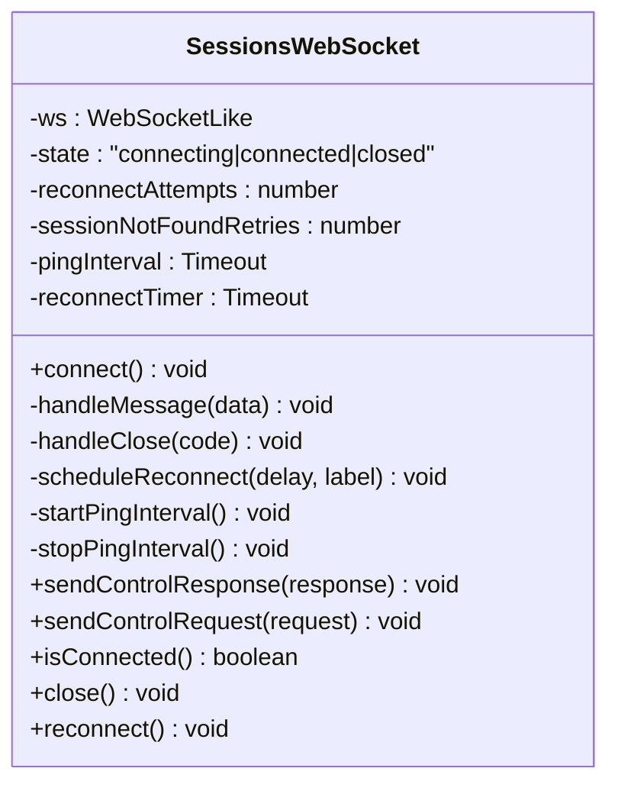
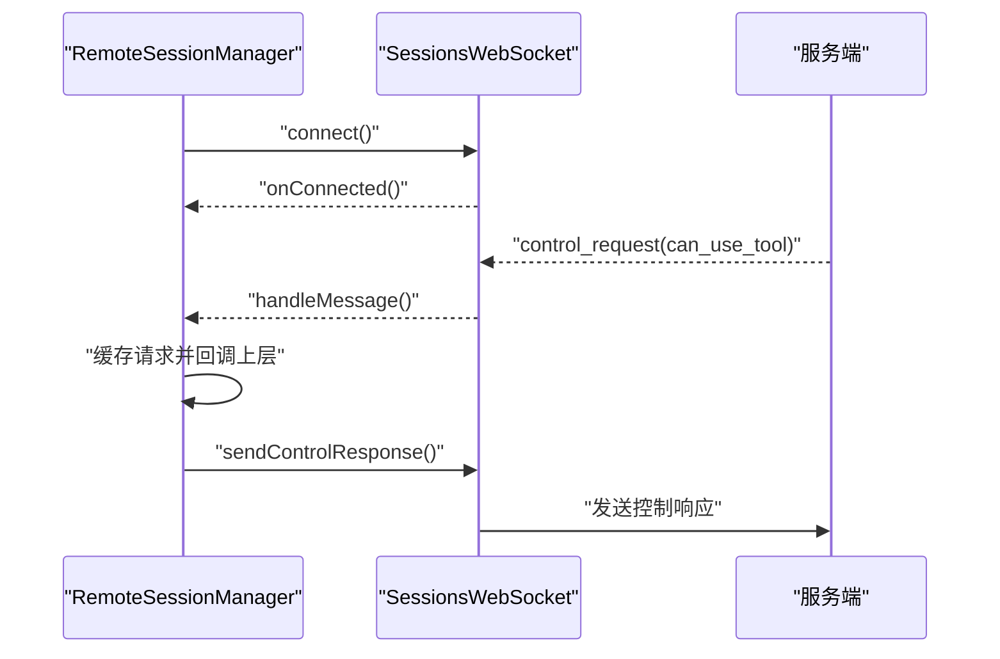
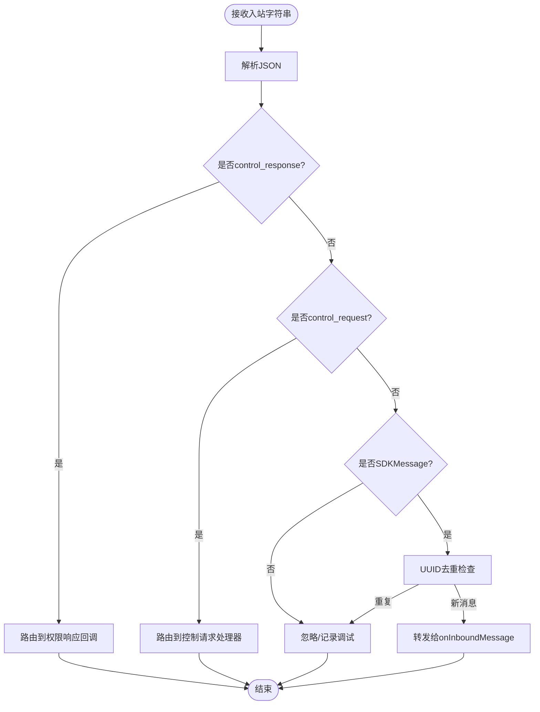
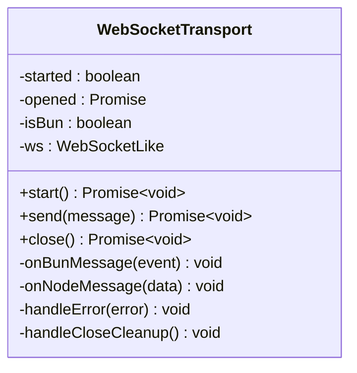
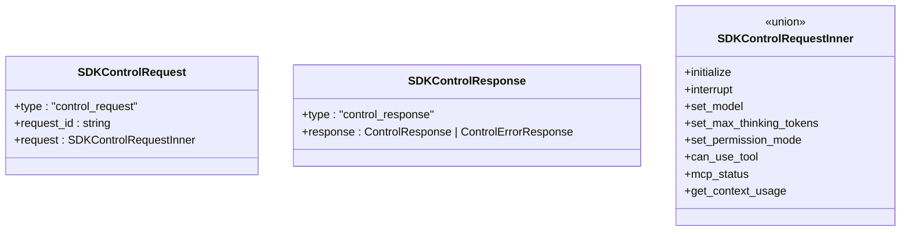
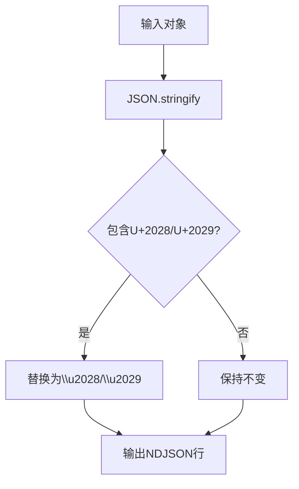
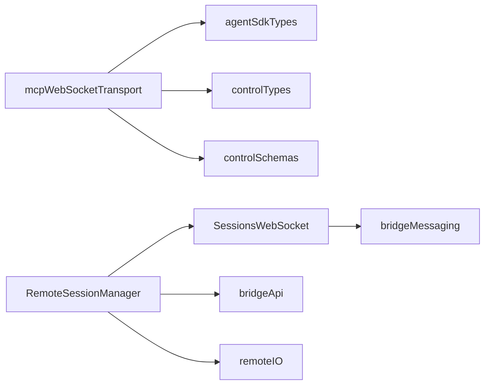

# WebSocket API 接口

<cite>
**本文档引用的文件**
- [SessionsWebSocket.ts](file://src/remote/SessionsWebSocket.ts)
- [bridgeMessaging.ts](file://src/bridge/bridgeMessaging.ts)
- [remoteSessionManager.ts](file://src/remote/remoteSessionManager.ts)
- [mcpWebSocketTransport.ts](file://src/utils/mcpWebSocketTransport.ts)
- [agentSdkTypes.ts](file://src/entrypoints/agentSdkTypes.ts)
- [controlTypes.ts](file://src/entrypoints/sdk/controlTypes.ts)
- [controlSchemas.ts](file://src/entrypoints/sdk/controlSchemas.ts)
- [ndjsonSafeStringify.ts](file://src/cli/ndjsonSafeStringify.ts)
- [bridgeApi.ts](file://src/bridge/bridgeApi.ts)
- [remoteIO.ts](file://src/cli/remoteIO.ts)
</cite>

## 目录
1. [简介](#简介)
2. [项目结构](#项目结构)
3. [核心组件](#核心组件)
4. [架构总览](#架构总览)
5. [详细组件分析](#详细组件分析)
6. [依赖关系分析](#依赖关系分析)
7. [性能考虑](#性能考虑)
8. [故障排查指南](#故障排查指南)
9. [结论](#结论)
10. [附录](#附录)

## 简介
本文件面向 Claude Code Best 的 WebSocket API 接口，系统性梳理实时通信协议与实现细节，覆盖连接建立、握手认证、消息格式与类型、流式响应处理、事件通知、双向控制协议、连接管理与重连机制、异常处理策略、消息序列化与传输优化，以及性能监控与调试工具使用方法。目标读者既包括需要集成 SDK 的开发者，也包括需要理解内部实现的工程人员。

## 项目结构
围绕 WebSocket 的核心实现分布在以下模块：
- 远程会话 WebSocket 客户端：负责与服务端建立订阅连接、心跳保活、消息解析与转发、断线重连与关闭清理。
- 桥接消息处理：负责桥接层入站消息解析、去重、控制请求路由与响应。
- 远程会话管理器：协调 WebSocket 订阅、HTTP 发送、权限请求/响应流程。
- MCP WebSocket 传输：通用的 JSON-RPC over WebSocket 传输层，支持 Bun 与 Node 差异。
- 类型与模式：SDK 消息类型、控制协议类型与模式定义。
- 序列化与传输：NDJSON 安全序列化工具，避免行分隔符导致的消息截断。
- 桥接 API：桥接环境注册、轮询工作、心跳、会话归档等 HTTP API 辅助。
- 远程 IO：保持活跃的 keep_alive 帧与优雅关闭。

**图表来源**
- [remoteSessionManager.ts:95-325](file://src/remote/remoteSessionManager.ts#L95-L325)
- [SessionsWebSocket.ts:82-404](file://src/remote/SessionsWebSocket.ts#L82-L404)
- [bridgeMessaging.ts:132-208](file://src/bridge/bridgeMessaging.ts#L132-L208)
- [mcpWebSocketTransport.ts:22-200](file://src/utils/mcpWebSocketTransport.ts#L22-L200)
- [agentSdkTypes.ts:12-31](file://src/entrypoints/agentSdkTypes.ts#L12-L31)
- [controlTypes.ts:23-35](file://src/entrypoints/sdk/controlTypes.ts#L23-L35)
- [controlSchemas.ts:57-95](file://src/entrypoints/sdk/controlSchemas.ts#L57-L95)
- [ndjsonSafeStringify.ts:30-32](file://src/cli/ndjsonSafeStringify.ts#L30-L32)
- [bridgeApi.ts:141-540](file://src/bridge/bridgeApi.ts#L141-L540)
- [remoteIO.ts:184-196](file://src/cli/remoteIO.ts#L184-L196)

**章节来源**
- [remoteSessionManager.ts:1-345](file://src/remote/remoteSessionManager.ts#L1-L345)
- [SessionsWebSocket.ts:1-405](file://src/remote/SessionsWebSocket.ts#L1-L405)
- [bridgeMessaging.ts:1-463](file://src/bridge/bridgeMessaging.ts#L1-L463)
- [mcpWebSocketTransport.ts:1-201](file://src/utils/mcpWebSocketTransport.ts#L1-L201)
- [agentSdkTypes.ts:1-446](file://src/entrypoints/agentSdkTypes.ts#L1-L446)
- [controlTypes.ts:1-35](file://src/entrypoints/sdk/controlTypes.ts#L1-L35)
- [controlSchemas.ts:1-200](file://src/entrypoints/sdk/controlSchemas.ts#L1-L200)
- [ndjsonSafeStringify.ts:1-33](file://src/cli/ndjsonSafeStringify.ts#L1-L33)
- [bridgeApi.ts:1-540](file://src/bridge/bridgeApi.ts#L1-L540)
- [remoteIO.ts:174-199](file://src/cli/remoteIO.ts#L174-L199)

## 核心组件
- SessionsWebSocket：会话级 WebSocket 客户端，负责连接、认证、消息解析、心跳、断线重连与关闭清理。
- RemoteSessionManager：远程会话管理器，封装 WebSocket 订阅、HTTP 发送、权限请求/响应流程。
- bridgeMessaging：桥接消息处理，负责入站消息解析、去重、控制请求路由与响应。
- mcpWebSocketTransport：通用 JSON-RPC over WebSocket 传输层，适配 Bun 与 Node 差异。
- 类型与模式：SDK 消息类型、控制协议类型与模式定义，确保消息结构一致性。
- ndjsonSafeStringify：NDJSON 安全序列化，避免行分隔符导致的消息截断。
- bridgeApi：桥接环境注册、轮询工作、心跳、会话归档等 HTTP API 辅助。
- remoteIO：保持活跃的 keep_alive 帧与优雅关闭。

**章节来源**
- [SessionsWebSocket.ts:82-404](file://src/remote/SessionsWebSocket.ts#L82-L404)
- [remoteSessionManager.ts:95-325](file://src/remote/remoteSessionManager.ts#L95-L325)
- [bridgeMessaging.ts:132-208](file://src/bridge/bridgeMessaging.ts#L132-L208)
- [mcpWebSocketTransport.ts:22-200](file://src/utils/mcpWebSocketTransport.ts#L22-L200)
- [agentSdkTypes.ts:12-31](file://src/entrypoints/agentSdkTypes.ts#L12-L31)
- [controlTypes.ts:23-35](file://src/entrypoints/sdk/controlTypes.ts#L23-L35)
- [controlSchemas.ts:57-95](file://src/entrypoints/sdk/controlSchemas.ts#L57-L95)
- [ndjsonSafeStringify.ts:30-32](file://src/cli/ndjsonSafeStringify.ts#L30-L32)
- [bridgeApi.ts:141-540](file://src/bridge/bridgeApi.ts#L141-L540)
- [remoteIO.ts:184-196](file://src/cli/remoteIO.ts#L184-L196)

## 架构总览
下图展示从客户端到服务端的 WebSocket 通信路径，包括连接建立、认证、消息流转与控制协议交互。

**图表来源**
- [remoteSessionManager.ts:108-141](file://src/remote/remoteSessionManager.ts#L108-L141)
- [SessionsWebSocket.ts:100-205](file://src/remote/SessionsWebSocket.ts#L100-L205)
- [bridgeMessaging.ts:132-208](file://src/bridge/bridgeMessaging.ts#L132-L208)

**章节来源**
- [remoteSessionManager.ts:108-141](file://src/remote/remoteSessionManager.ts#L108-L141)
- [SessionsWebSocket.ts:100-205](file://src/remote/SessionsWebSocket.ts#L100-L205)
- [bridgeMessaging.ts:132-208](file://src/bridge/bridgeMessaging.ts#L132-L208)

## 详细组件分析

### SessionsWebSocket 组件分析
- 连接建立与握手
  - 使用组织 UUID 参数与 OAuth Bearer 认证头建立 WSS 连接。
  - Bun 与 Node 环境分别通过原生 WebSocket 与 ws 包实现，统一事件接口。
- 心跳与保活
  - 启动周期性 ping，收到 pong 后继续；异常时在关闭处理中统一收敛。
- 消息处理
  - 解析入站字符串为 JSON，按类型守卫过滤 SDKMessage，其余忽略或记录调试日志。
- 断线与重连
  - 支持有限次数重连与指数退避；对特定关闭码（如 4001）进行特殊处理；永久关闭码直接停止重连。
- 控制消息
  - 提供发送 control_request 与 control_response 的能力，用于中断、设置模型、权限模式等。

**图表来源**
- [SessionsWebSocket.ts:82-404](file://src/remote/SessionsWebSocket.ts#L82-L404)

**章节来源**
- [SessionsWebSocket.ts:100-205](file://src/remote/SessionsWebSocket.ts#L100-L205)
- [SessionsWebSocket.ts:210-288](file://src/remote/SessionsWebSocket.ts#L210-L288)
- [SessionsWebSocket.ts:301-357](file://src/remote/SessionsWebSocket.ts#L301-L357)
- [SessionsWebSocket.ts:362-404](file://src/remote/SessionsWebSocket.ts#L362-L404)

### RemoteSessionManager 组件分析
- 角色与职责
  - 封装 SessionsWebSocket，提供 onMessage/onConnected/onDisconnected/onReconnecting/onError 回调。
  - 处理控制请求（如工具使用权限），维护待处理权限请求映射，向服务端发送控制响应。
  - 提供 sendMessage（通过 HTTP）、cancelSession（发送中断控制请求）、disconnect/reconnect 等操作。
- 权限请求/响应流程
  - 接收 can_use_tool 控制请求，缓存并回调上层；上层决定允许/拒绝后，构造 control_response 并发送。

**图表来源**
- [remoteSessionManager.ts:108-141](file://src/remote/remoteSessionManager.ts#L108-L141)
- [remoteSessionManager.ts:189-215](file://src/remote/remoteSessionManager.ts#L189-L215)
- [remoteSessionManager.ts:248-283](file://src/remote/remoteSessionManager.ts#L248-L283)

**章节来源**
- [remoteSessionManager.ts:95-325](file://src/remote/remoteSessionManager.ts#L95-L325)

### 桥接消息处理（bridgeMessaging）
- 入站消息解析与去重
  - 解析入站字符串为对象，先判定是否为 control_response 或 control_request，再判定是否为 SDKMessage。
  - 使用 BoundedUUIDSet 对 echo 与重复入站消息进行去重，保证幂等。
- 控制请求处理
  - 对 initialize、set_model、set_max_thinking_tokens、set_permission_mode、interrupt 等子类型进行处理，并在超时前返回响应，避免服务端挂起。
- 结果消息
  - 生成最小化的 result_success 事件，用于会话归档。

**图表来源**
- [bridgeMessaging.ts:132-208](file://src/bridge/bridgeMessaging.ts#L132-L208)
- [bridgeMessaging.ts:243-392](file://src/bridge/bridgeMessaging.ts#L243-L392)

**章节来源**
- [bridgeMessaging.ts:132-208](file://src/bridge/bridgeMessaging.ts#L132-L208)
- [bridgeMessaging.ts:243-392](file://src/bridge/bridgeMessaging.ts#L243-L392)

### MCP WebSocket 传输（mcpWebSocketTransport）
- 传输层抽象
  - 统一 WebSocketLike 接口，适配 Bun 原生 WebSocket 与 Node ws 包。
  - 在 start() 中等待连接打开，send() 中进行 JSON-RPC 消息序列化与发送。
- 错误与关闭处理
  - 统一错误与关闭处理逻辑，移除事件监听，触发 onerror/onclose 回调。
- 发送优化
  - Bun 环境下原生 send 为同步，Node 环境下使用带回调的 send，保证错误可捕获。

**图表来源**
- [mcpWebSocketTransport.ts:22-200](file://src/utils/mcpWebSocketTransport.ts#L22-L200)

**章节来源**
- [mcpWebSocketTransport.ts:22-200](file://src/utils/mcpWebSocketTransport.ts#L22-L200)

### 类型与模式（SDK 与控制协议）
- SDK 类型入口
  - re-export 核心类型与运行时类型，控制协议类型通过 controlTypes 导出。
- 控制协议类型与模式
  - 定义 initialize、interrupt、set_model、set_max_thinking_tokens、set_permission_mode、can_use_tool、mcp_status、get_context_usage 等请求/响应结构。
  - 控制响应支持 success/error 两种子类型，错误响应包含 pending_permission_requests 字段以支持后续权限链路。

**图表来源**
- [agentSdkTypes.ts:17-26](file://src/entrypoints/agentSdkTypes.ts#L17-L26)
- [controlTypes.ts:23-35](file://src/entrypoints/sdk/controlTypes.ts#L23-L35)
- [controlSchemas.ts:57-95](file://src/entrypoints/sdk/controlSchemas.ts#L57-L95)
- [controlSchemas.ts:605-627](file://src/entrypoints/sdk/controlSchemas.ts#L605-L627)

**章节来源**
- [agentSdkTypes.ts:17-31](file://src/entrypoints/agentSdkTypes.ts#L17-L31)
- [controlTypes.ts:23-35](file://src/entrypoints/sdk/controlTypes.ts#L23-L35)
- [controlSchemas.ts:57-95](file://src/entrypoints/sdk/controlSchemas.ts#L57-L95)
- [controlSchemas.ts:605-627](file://src/entrypoints/sdk/controlSchemas.ts#L605-L627)

### 消息序列化与传输优化（NDJSON）
- 问题背景
  - JSON 中的 U+2028（行分隔符）与 U+2029（段分隔符）在 JavaScript 行终止语义下可能被误判为换行，导致单条 NDJSON 消息被截断。
- 解决方案
  - ndjsonSafeStringify 将上述字符转义为 \u2028/\u2029，保证输出仍为有效 JSON，但不会被行分割逻辑误切。

**图表来源**
- [ndjsonSafeStringify.ts:18-32](file://src/cli/ndjsonSafeStringify.ts#L18-L32)

**章节来源**
- [ndjsonSafeStringify.ts:1-33](file://src/cli/ndjsonSafeStringify.ts#L1-L33)

### 远程 IO 与保持活跃（keep_alive）
- keep_alive 帧
  - 在桥接拓扑下，按配置间隔发送 keep_alive 类型消息，防止代理空闲超时关闭连接。
- 优雅关闭
  - 注册清理钩子，在关闭时停止定时器并释放资源。

**章节来源**
- [remoteIO.ts:184-196](file://src/cli/remoteIO.ts#L184-L196)

## 依赖关系分析
- RemoteSessionManager 依赖 SessionsWebSocket 提供连接与消息转发能力。
- SessionsWebSocket 依赖桥接消息处理进行入站消息的类型判定与去重。
- mcpWebSocketTransport 作为通用传输层，独立于 SDK 协议，可用于其他 JSON-RPC over WebSocket 场景。
- 类型与模式文件为 SDK 与桥接层提供强类型保障。
- bridgeApi 提供桥接环境注册、轮询、心跳、归档等 HTTP 能力，辅助 WebSocket 生命周期管理。

**图表来源**
- [remoteSessionManager.ts:95-325](file://src/remote/remoteSessionManager.ts#L95-L325)
- [SessionsWebSocket.ts:82-404](file://src/remote/SessionsWebSocket.ts#L82-L404)
- [bridgeMessaging.ts:132-208](file://src/bridge/bridgeMessaging.ts#L132-L208)
- [mcpWebSocketTransport.ts:22-200](file://src/utils/mcpWebSocketTransport.ts#L22-L200)
- [agentSdkTypes.ts:17-31](file://src/entrypoints/agentSdkTypes.ts#L17-L31)
- [controlTypes.ts:23-35](file://src/entrypoints/sdk/controlTypes.ts#L23-L35)
- [controlSchemas.ts:57-95](file://src/entrypoints/sdk/controlSchemas.ts#L57-L95)
- [bridgeApi.ts:141-540](file://src/bridge/bridgeApi.ts#L141-L540)
- [remoteIO.ts:184-196](file://src/cli/remoteIO.ts#L184-L196)

**章节来源**
- [remoteSessionManager.ts:95-325](file://src/remote/remoteSessionManager.ts#L95-L325)
- [SessionsWebSocket.ts:82-404](file://src/remote/SessionsWebSocket.ts#L82-L404)
- [bridgeMessaging.ts:132-208](file://src/bridge/bridgeMessaging.ts#L132-L208)
- [mcpWebSocketTransport.ts:22-200](file://src/utils/mcpWebSocketTransport.ts#L22-L200)
- [agentSdkTypes.ts:17-31](file://src/entrypoints/agentSdkTypes.ts#L17-L31)
- [controlTypes.ts:23-35](file://src/entrypoints/sdk/controlTypes.ts#L23-L35)
- [controlSchemas.ts:57-95](file://src/entrypoints/sdk/controlSchemas.ts#L57-L95)
- [bridgeApi.ts:141-540](file://src/bridge/bridgeApi.ts#L141-L540)
- [remoteIO.ts:184-196](file://src/cli/remoteIO.ts#L184-L196)

## 性能考虑
- 心跳与保活
  - 固定间隔 ping/pong 防止代理空闲超时，建议根据网络质量调整间隔。
- 消息去重
  - BoundedUUIDSet 采用环形缓冲区，内存占用恒定，适合高吞吐场景。
- 序列化优化
  - ndjsonSafeStringify 避免行分隔符导致的截断，减少重传与解析失败。
- 连接管理
  - SessionsWebSocket 的有限重连次数与退避策略，避免雪崩效应。
- 传输层差异
  - Bun 环境下原生 send 为同步，Node 环境下使用带回调的 send，需注意错误处理一致性。

[本节为通用指导，无需具体文件分析]

## 故障排查指南
- 连接失败
  - 检查 Authorization 头与组织 UUID 参数是否正确；确认网络代理与 TLS 配置。
- 消息解析错误
  - 查看入站消息是否为合法 JSON；确认是否包含 U+2028/U+2029 导致的截断。
- 控制请求未响应
  - 确认在服务端超时前（约 10-14 秒）返回 control_response；检查 handleServerControlRequest 的分支。
- 权限请求未处理
  - 确认 RemoteSessionManager 是否正确缓存并回调上层；检查 respondToPermissionRequest 的调用时机。
- 重连策略
  - 关闭码 4001（会话不存在）有特殊重试窗口；永久关闭码（如 4003）不再重连。
- keep_alive 无效
  - 检查配置项 session_keepalive_interval_v2_ms 是否大于 0；确认定时器未被意外取消。

**章节来源**
- [SessionsWebSocket.ts:246-287](file://src/remote/SessionsWebSocket.ts#L246-L287)
- [bridgeMessaging.ts:132-208](file://src/bridge/bridgeMessaging.ts#L132-L208)
- [remoteSessionManager.ts:189-215](file://src/remote/remoteSessionManager.ts#L189-L215)
- [remoteIO.ts:184-196](file://src/cli/remoteIO.ts#L184-L196)

## 结论
本文档系统梳理了 Claude Code Best 的 WebSocket API 接口实现，涵盖连接建立、认证、消息格式、控制协议、重连与异常处理、序列化优化与性能要点。通过 SessionsWebSocket、RemoteSessionManager、bridgeMessaging 等组件的协作，实现了稳定可靠的实时通信与双向控制能力。建议在生产环境中结合 keep_alive、有限重连与消息去重策略，确保长连接的稳定性与可靠性。

[本节为总结，无需具体文件分析]

## 附录

### 消息类型与结构定义
- SDKMessage
  - 由 SDKMessageSchema 定义，包含用户/助手/系统等消息类型，以及唯一标识 uuid。
- 控制请求/响应
  - control_request：包含 request_id 与 request 子类型（如 initialize、interrupt、set_model、set_permission_mode、can_use_tool 等）。
  - control_response：包含 response 子类型（success/error），error 响应可包含 pending_permission_requests。
- keep_alive
  - 用于保持连接活跃，不参与业务处理。

**章节来源**
- [controlSchemas.ts:57-95](file://src/entrypoints/sdk/controlSchemas.ts#L57-L95)
- [controlSchemas.ts:605-627](file://src/entrypoints/sdk/controlSchemas.ts#L605-L627)

### 连接参数与握手协议
- URL 形式
  - wss://{BASE_API_URL 替换 https://}/v1/sessions/ws/{sessionId}/subscribe?organization_uuid={orgUuid}
- 认证方式
  - Authorization: Bearer {access_token}
  - anthropic-version: 2023-06-01
- 代理与 TLS
  - 支持代理与 TLS 选项，Bun 与 Node 环境分别通过不同 API 设置。

**章节来源**
- [SessionsWebSocket.ts:108-118](file://src/remote/SessionsWebSocket.ts#L108-L118)

### 实时通信协议要点
- 流式响应
  - 服务端推送 SDKMessage 流，客户端逐条解析并转发。
- 事件通知
  - control_request 用于服务器发起的生命周期与会话级事件（如初始化、设置模型、权限请求、中断等）。
- 双向通信
  - 客户端可通过 sendControlRequest 发送控制请求，通过 sendControlResponse 回复服务器。

**章节来源**
- [SessionsWebSocket.ts:328-357](file://src/remote/SessionsWebSocket.ts#L328-L357)
- [remoteSessionManager.ts:295-298](file://src/remote/remoteSessionManager.ts#L295-L298)

### 连接管理与重连机制
- 重连参数
  - 初始延迟 2000ms，最大重连次数 5 次；4001（会话不存在）有额外重试窗口。
- 永久关闭码
  - 4003（未授权）等关闭码直接停止重连。
- 强制重连
  - reconnect() 用于订阅过期后的强制重建。

**章节来源**
- [SessionsWebSocket.ts:17-36](file://src/remote/SessionsWebSocket.ts#L17-L36)
- [SessionsWebSocket.ts:258-272](file://src/remote/SessionsWebSocket.ts#L258-L272)
- [SessionsWebSocket.ts:393-403](file://src/remote/SessionsWebSocket.ts#L393-L403)

### 消息序列化格式（JSON/NDJSON）
- JSON
  - 使用 jsonStringify 进行标准 JSON 序列化。
- NDJSON
  - 使用 ndjsonSafeStringify，将 U+2028/U+2029 转义为 \u2028/\u2029，避免行分割导致的消息截断。

**章节来源**
- [ndjsonSafeStringify.ts:30-32](file://src/cli/ndjsonSafeStringify.ts#L30-L32)

### 性能监控指标与调试工具
- 日志与诊断
  - 使用 logForDebugging/logError 输出连接状态、消息解析与错误信息。
  - mcpWebSocketTransport 记录连接失败与消息失败的诊断事件。
- keep_alive
  - 通过定时发送 keep_alive 防止代理空闲超时。
- 桥接 API
  - 提供心跳、轮询、归档等辅助能力，便于监控与排障。

**章节来源**
- [mcpWebSocketTransport.ts:41-53](file://src/utils/mcpWebSocketTransport.ts#L41-L53)
- [mcpWebSocketTransport.ts:117-120](file://src/utils/mcpWebSocketTransport.ts#L117-L120)
- [remoteIO.ts:184-196](file://src/cli/remoteIO.ts#L184-L196)
- [bridgeApi.ts:387-417](file://src/bridge/bridgeApi.ts#L387-L417)