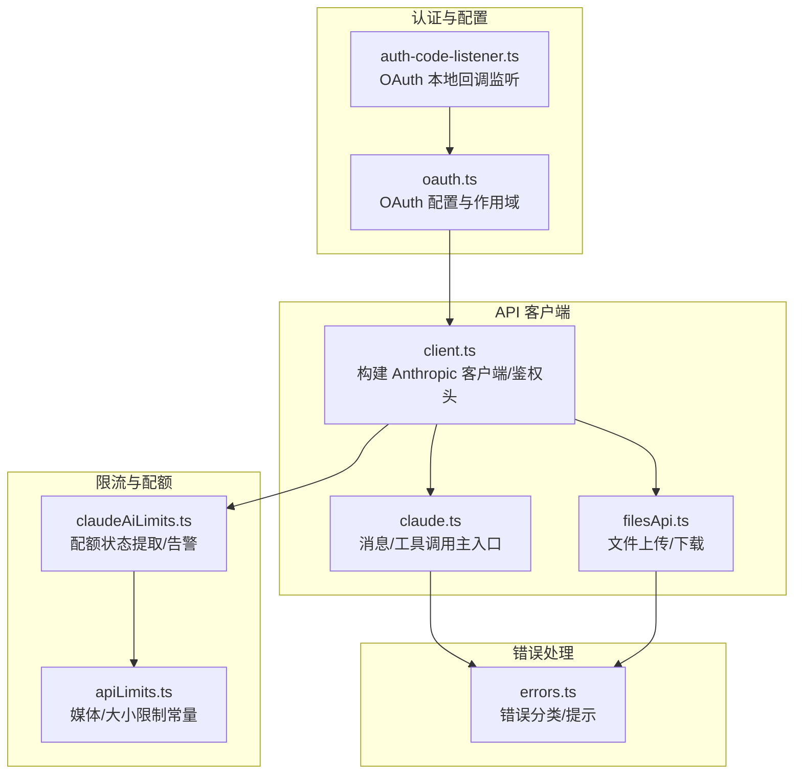
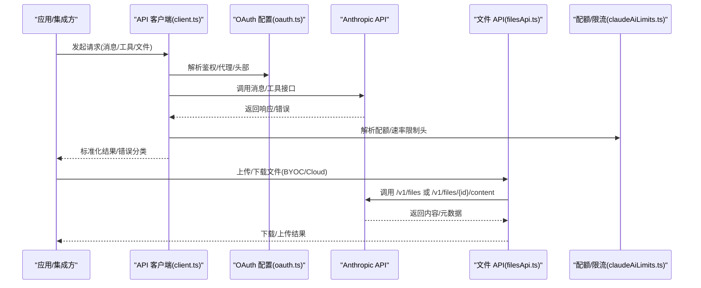
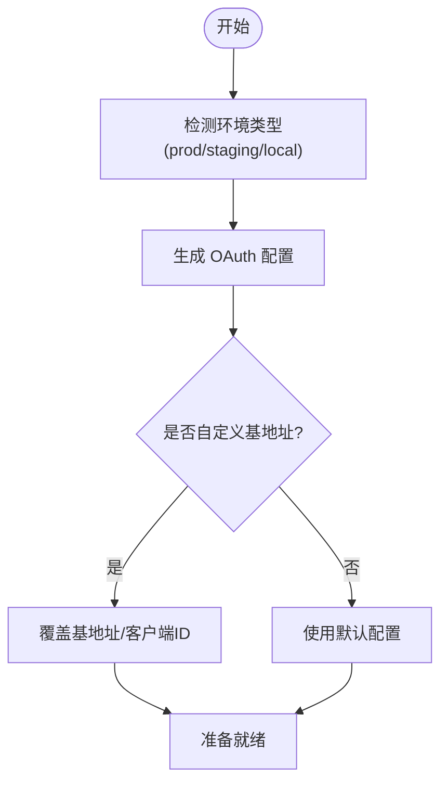
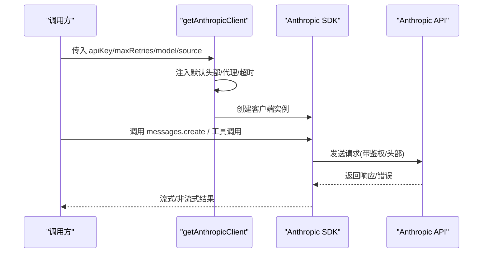
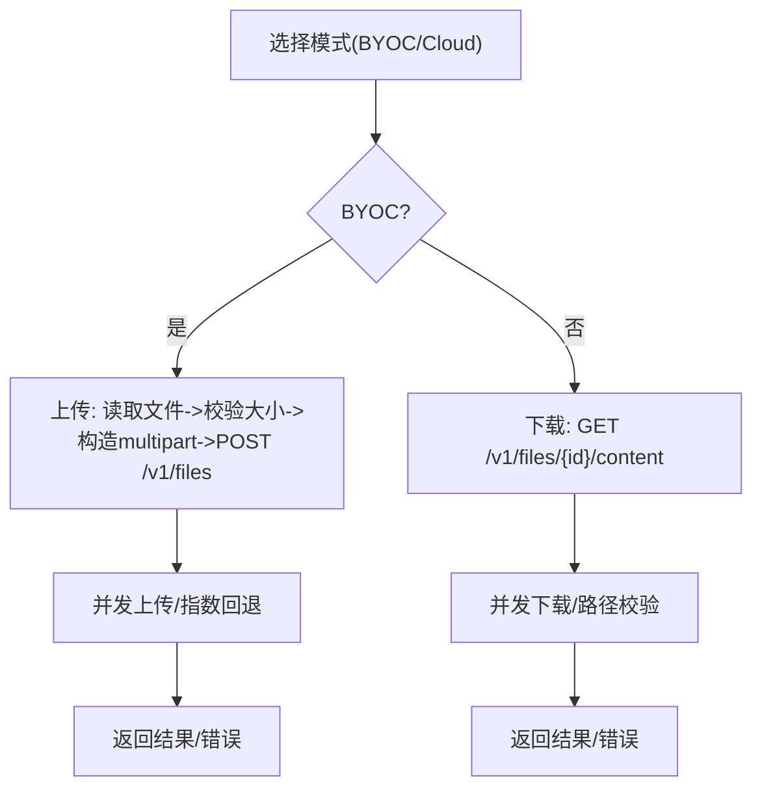
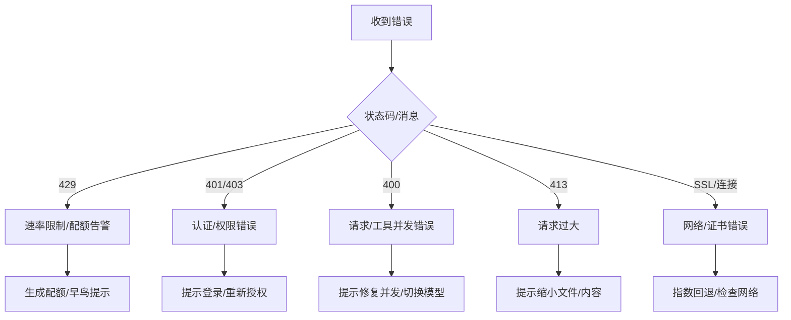
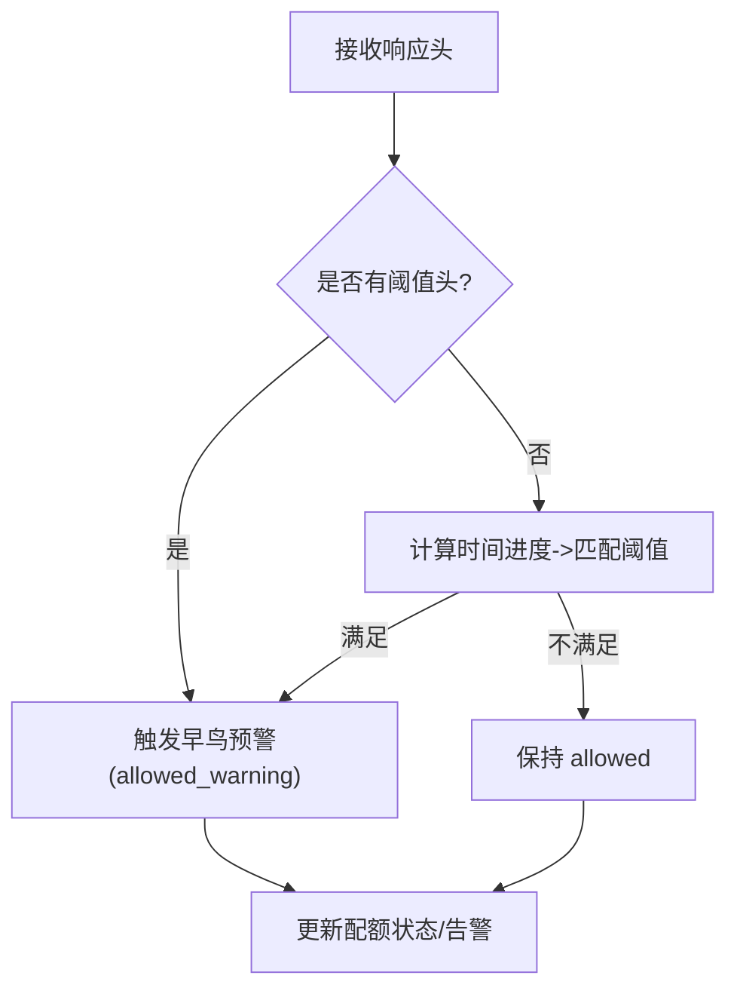
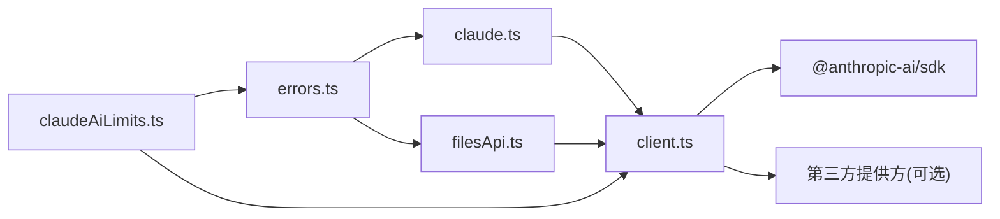

# 公共 API 接口

<cite>
**本文引用的文件**
- [oauth.ts](file://src/constants/oauth.ts)
- [client.ts](file://src/services/api/client.ts)
- [claude.ts](file://src/services/api/claude.ts)
- [filesApi.ts](file://src/services/api/filesApi.ts)
- [errors.ts](file://src/services/api/errors.ts)
- [apiLimits.ts](file://src/constants/apiLimits.ts)
- [claudeAiLimits.ts](file://src/services/claudeAiLimits.ts)
- [oauth.ts（服务端）](file://src/services/oauth/auth-code-listener.ts)
- [oauth.ts（外部依赖）](file://docs/external-dependencies.md)
</cite>

## 目录
1. [简介](#简介)
2. [项目结构](#项目结构)
3. [核心组件](#核心组件)
4. [架构总览](#架构总览)
5. [详细组件分析](#详细组件分析)
6. [依赖关系分析](#依赖关系分析)
7. [性能与可靠性](#性能与可靠性)
8. [故障排除指南](#故障排除指南)
9. [结论](#结论)
10. [附录：API 定义与示例](#附录api-定义与示例)

## 简介
本文件面向使用 Claude Code Best 的开发者与集成方，系统化梳理其对外公开的 API 接口与能力边界，覆盖：
- 对外暴露的 RESTful 端点与内部调用路径
- 认证机制、API 密钥管理与访问控制
- 请求/响应规范、错误码与状态码
- 速率限制、配额管理与降级策略
- 版本控制策略与向后兼容性
- 故障排除与最佳实践

说明：
- 仓库中存在多处“公共 API”端点（如文件上传/下载、OAuth 授权等），但这些端点并非直接由 Claude Code Best 的应用层对外提供，而是通过 Anthropic 平台或第三方服务间接使用。
- 本文重点描述 Claude Code Best 在调用外部 API 时的客户端封装、认证与限流策略，以及在本地会话中可被外部系统感知的桥接能力。

## 项目结构
围绕公共 API 的相关模块主要分布在以下位置：
- 认证与 OAuth 配置：src/constants/oauth.ts
- API 客户端封装：src/services/api/client.ts
- 主要业务调用入口：src/services/api/claude.ts
- 文件上传/下载：src/services/api/filesApi.ts
- 错误处理与分类：src/services/api/errors.ts
- 限额与配额：src/services/claudeAiLimits.ts、src/constants/apiLimits.ts
- OAuth 本地回调监听（用于授权码捕获）：src/services/oauth/auth-code-listener.ts
- 外部依赖文档中的“公共 API 端点汇总”：docs/external-dependencies.md

图表来源
- [oauth.ts:1-235](file://src/constants/oauth.ts#L1-L235)
- [client.ts:1-390](file://src/services/api/client.ts#L1-L390)
- [claude.ts:1-800](file://src/services/api/claude.ts#L1-L800)
- [filesApi.ts:1-749](file://src/services/api/filesApi.ts#L1-L749)
- [claudeAiLimits.ts:1-516](file://src/services/claudeAiLimits.ts#L1-L516)
- [apiLimits.ts:1-95](file://src/constants/apiLimits.ts#L1-L95)
- [errors.ts:1-1208](file://src/services/api/errors.ts#L1-L1208)
- [oauth.ts（服务端）:1-30](file://src/services/oauth/auth-code-listener.ts#L1-L30)

章节来源
- [oauth.ts:1-235](file://src/constants/oauth.ts#L1-L235)
- [client.ts:1-390](file://src/services/api/client.ts#L1-L390)
- [claude.ts:1-800](file://src/services/api/claude.ts#L1-L800)
- [filesApi.ts:1-749](file://src/services/api/filesApi.ts#L1-L749)
- [claudeAiLimits.ts:1-516](file://src/services/claudeAiLimits.ts#L1-L516)
- [apiLimits.ts:1-95](file://src/constants/apiLimits.ts#L1-L95)
- [errors.ts:1-1208](file://src/services/api/errors.ts#L1-L1208)
- [oauth.ts（服务端）:1-30](file://src/services/oauth/auth-code-listener.ts#L1-L30)

## 核心组件
- OAuth 配置与作用域
  - 提供生产/预发/本地三套 OAuth 配置，支持自定义基地址与客户端 ID 覆盖，统一管理授权范围与代理路径。
- API 客户端
  - 统一封装 Anthropic SDK 客户端创建、默认头部、超时、代理、重试与日志；支持 Bedrock/Vertex/Foundry 等第三方提供方。
- 主业务调用
  - 将消息、工具与模型参数标准化后调用 API，并处理流式/非流式响应、缓存控制与元数据。
- 文件 API
  - 支持 BYOC（自带密钥）模式下的文件上传与 Cloud 模式下的文件列表查询；提供并发下载、指数回退与路径校验。
- 错误处理
  - 针对 429/401/403/400/413 等常见错误进行分类与人性化提示；支持速率限制告警与配额状态提取。
- 限额与配额
  - 从响应头解析统一配额状态、窗口利用率与过量使用状态；提供早鸟预警与降级建议。

章节来源
- [oauth.ts:1-235](file://src/constants/oauth.ts#L1-L235)
- [client.ts:1-390](file://src/services/api/client.ts#L1-L390)
- [claude.ts:1-800](file://src/services/api/claude.ts#L1-L800)
- [filesApi.ts:1-749](file://src/services/api/filesApi.ts#L1-L749)
- [errors.ts:1-1208](file://src/services/api/errors.ts#L1-L1208)
- [claudeAiLimits.ts:1-516](file://src/services/claudeAiLimits.ts#L1-L516)
- [apiLimits.ts:1-95](file://src/constants/apiLimits.ts#L1-L95)

## 架构总览
下图展示 Claude Code Best 在调用外部 API 时的整体流程与关键交互点：

图表来源
- [client.ts:88-316](file://src/services/api/client.ts#L88-L316)
- [oauth.ts:186-234](file://src/constants/oauth.ts#L186-L234)
- [claude.ts:723-794](file://src/services/api/claude.ts#L723-L794)
- [filesApi.ts:132-180](file://src/services/api/filesApi.ts#L132-L180)
- [claudeAiLimits.ts:454-485](file://src/services/claudeAiLimits.ts#L454-L485)

## 详细组件分析

### 认证与访问控制
- OAuth 配置
  - 支持 prod/staging/local 三种环境，允许通过环境变量覆盖基地址与客户端 ID；提供统一的授权与令牌端点、成功跳转页与手动回调地址。
  - 作用域包括 Claude.ai 推断与文件上传、Console API Key 创建等。
- API Key 管理
  - 支持直接 API Key、OAuth 访问令牌与外部助手提供的密钥；在非订阅用户场景下自动注入 Authorization 头。
- 本地 OAuth 回调
  - 本地临时 HTTP 服务器捕获浏览器授权后的回调，提取授权码并返回，避免在 CLI 中打开浏览器后无反馈。

图表来源
- [oauth.ts:186-234](file://src/constants/oauth.ts#L186-L234)

章节来源
- [oauth.ts:1-235](file://src/constants/oauth.ts#L1-L235)
- [client.ts:318-328](file://src/services/api/client.ts#L318-L328)
- [oauth.ts（服务端）:1-30](file://src/services/oauth/auth-code-listener.ts#L1-L30)

### API 客户端与请求流程
- 客户端创建
  - 自动注入会话标识、用户代理、容器/远程会话标识等头部；支持额外保护头、自定义头部注入与代理转发。
  - 根据环境变量选择 Bedrock/Vertex/Foundry 或第一方 Anthropic SDK。
- 请求与重试
  - 默认超时、最大重试次数；支持 fetch 覆盖与调试日志；在第一方 API 场景下注入客户端请求 ID 便于关联日志。
- 消息与工具调用
  - 将用户/助手消息标准化为 API 参数，支持缓存控制、任务预算、努力级别等高级选项；流式/非流式两种模式。

图表来源
- [client.ts:88-316](file://src/services/api/client.ts#L88-L316)
- [claude.ts:723-794](file://src/services/api/claude.ts#L723-L794)

章节来源
- [client.ts:1-390](file://src/services/api/client.ts#L1-L390)
- [claude.ts:690-794](file://src/services/api/claude.ts#L690-L794)

### 文件上传/下载（BYOC 与 Cloud）
- BYOC（自带密钥）模式
  - 上传：支持并发上传、指数回退、大小校验与边界构造；返回文件 ID 与大小。
  - 下载：支持并发下载、路径规范化与防目录穿越校验。
- Cloud（订阅者）模式
  - 列表查询：基于时间戳分页拉取文件元数据；支持 401/403 等错误分类。
- 错误与重试
  - 针对 401/403/413 等状态码提供明确提示；网络错误指数回退，非可重试错误直接抛出。

图表来源
- [filesApi.ts:378-552](file://src/services/api/filesApi.ts#L378-L552)
- [filesApi.ts:132-180](file://src/services/api/filesApi.ts#L132-L180)
- [filesApi.ts:617-709](file://src/services/api/filesApi.ts#L617-L709)

章节来源
- [filesApi.ts:1-749](file://src/services/api/filesApi.ts#L1-L749)

### 错误处理与状态码
- 错误分类
  - 依据状态码与消息关键字进行分类，如 429（速率限制）、401/403（认证/权限）、400（输入/工具并发）、413（请求过大）、SSL/连接错误等。
- 用户提示
  - 针对不同错误类型生成友好提示，如“请运行 /login”、“尝试切换模型”、“启用额外用量”等。
- 速率限制与配额
  - 从响应头提取统一配额状态、窗口利用率与过量使用状态；支持早鸟预警与降级建议。

图表来源
- [errors.ts:465-558](file://src/services/api/errors.ts#L465-L558)
- [errors.ts:965-1161](file://src/services/api/errors.ts#L965-L1161)
- [claudeAiLimits.ts:454-485](file://src/services/claudeAiLimits.ts#L454-L485)

章节来源
- [errors.ts:1-1208](file://src/services/api/errors.ts#L1-L1208)
- [claudeAiLimits.ts:1-516](file://src/services/claudeAiLimits.ts#L1-L516)

### 速率限制与配额管理
- 统一配额头
  - 从响应头解析代表性的配额声明、窗口利用率、重置时间、过量使用状态与禁用原因。
- 早鸟预警
  - 优先检查“阈值已越界”头；若缺失则基于时间进度计算阈值触发，避免用户在窗口末尾耗尽。
- 降级与恢复
  - 当配额受限且可用时，提供降级建议（如切换到 Sonnet）；当过量使用被禁用时，给出禁用原因以便用户理解。

图表来源
- [claudeAiLimits.ts:255-374](file://src/services/claudeAiLimits.ts#L255-L374)
- [claudeAiLimits.ts:454-485](file://src/services/claudeAiLimits.ts#L454-L485)

章节来源
- [claudeAiLimits.ts:1-516](file://src/services/claudeAiLimits.ts#L1-L516)
- [apiLimits.ts:1-95](file://src/constants/apiLimits.ts#L1-L95)

## 依赖关系分析
- 组件耦合
  - client.ts 作为统一入口，被 claude.ts 与 filesApi.ts 复用；errors.ts 与 claudeAiLimits.ts 作为横切关注点被各调用方共享。
- 外部依赖
  - 第一方 Anthropic SDK；第三方提供方（Bedrock/Vertex/Foundry）通过条件导入；OAuth 服务端回调监听仅用于本地开发场景。
- 循环依赖
  - 通过模块拆分与延迟导入避免循环；错误处理与配额状态通过事件发布/订阅解耦。

图表来源
- [client.ts:153-220](file://src/services/api/client.ts#L153-L220)
- [claude.ts:1-800](file://src/services/api/claude.ts#L1-L800)
- [filesApi.ts:1-749](file://src/services/api/filesApi.ts#L1-L749)
- [errors.ts:1-1208](file://src/services/api/errors.ts#L1-L1208)
- [claudeAiLimits.ts:1-516](file://src/services/claudeAiLimits.ts#L1-L516)

章节来源
- [client.ts:1-390](file://src/services/api/client.ts#L1-L390)
- [claude.ts:1-800](file://src/services/api/claude.ts#L1-L800)
- [filesApi.ts:1-749](file://src/services/api/filesApi.ts#L1-L749)
- [errors.ts:1-1208](file://src/services/api/errors.ts#L1-L1208)
- [claudeAiLimits.ts:1-516](file://src/services/claudeAiLimits.ts#L1-L516)

## 性能与可靠性
- 超时与重试
  - 默认超时与最大重试次数可配置；网络错误与 529/429 触发指数回退；非幂等操作避免自动重试。
- 并发与限速
  - 文件上传/下载支持并发限制；API 层面遵循统一配额头进行早鸟预警与降级。
- 缓存与元数据
  - 支持提示缓存控制与会话元数据注入，减少重复计算与提升一致性。

[本节为通用指导，无需特定文件引用]

## 故障排除指南
- 认证失败
  - 401/403：检查 API Key/OAuth 是否有效；在 CCR 模式下提示网络瞬断而非登录问题。
- 速率限制
  - 429：查看配额状态与早鸟预警；必要时切换模型或等待重置。
- 请求过大
  - 413：减小文件/图片尺寸或内容长度；对 PDF 使用分页读取。
- 工具并发错误
  - 400（tool_use 并发/重复 ID）：修复消息对齐或回滚会话。
- SSL/证书错误
  - 检查网络与证书链；必要时配置代理或更新根证书。

章节来源
- [errors.ts:813-934](file://src/services/api/errors.ts#L813-L934)
- [claudeAiLimits.ts:454-485](file://src/services/claudeAiLimits.ts#L454-L485)

## 结论
- Claude Code Best 通过统一的 API 客户端封装，屏蔽了多种提供方与认证方式的差异，为上层业务提供一致的调用体验。
- 在错误处理与配额管理方面，系统具备完善的分类、提示与降级策略，有助于提升稳定性与可观测性。
- 对于需要对接“公共 API”的集成方，建议优先使用 SDK 客户端与统一的头部注入，确保代理、超时与重试策略的一致性。

[本节为总结，无需特定文件引用]

## 附录：API 定义与示例

### 1) 文件上传（BYOC 模式）
- 方法与路径
  - POST /v1/files
  - 请求头：Authorization: Bearer {oauth_token}, anthropic-version: 2023-06-01, anthropic-beta: files-api-2025-04-14,oauth-2025-04-20
  - 请求体：multipart/form-data，字段 file（二进制）与 purpose=user_data
- 成功响应
  - 200/201：返回 { id, filename, size_bytes }
- 失败响应
  - 401：无效或缺失 API Key
  - 403：无权限
  - 413：文件过大
- 示例
  - 成功：上传成功并返回文件 ID
  - 失败：401 提示无效 API Key

章节来源
- [filesApi.ts:378-552](file://src/services/api/filesApi.ts#L378-L552)

### 2) 文件下载（BYOC/Cloud 模式）
- 方法与路径
  - GET /v1/files/{file_id}/content
  - 请求头：Authorization: Bearer {oauth_token}, anthropic-version: 2023-06-01, anthropic-beta: files-api-2025-04-14,oauth-2025-04-20
- 成功响应
  - 200：返回文件二进制内容
- 失败响应
  - 401：无效或缺失 API Key
  - 403：无权限
  - 404：文件不存在
- 示例
  - 成功：下载指定文件内容
  - 失败：404 文件不存在

章节来源
- [filesApi.ts:132-180](file://src/services/api/filesApi.ts#L132-L180)

### 3) 文件列表（Cloud 模式）
- 方法与路径
  - GET /v1/files?after_created_at={timestamp}[&after_id={cursor}]
  - 请求头：Authorization: Bearer {oauth_token}, anthropic-version: 2023-06-01, anthropic-beta: files-api-2025-04-14,oauth-2025-04-20
- 成功响应
  - 200：返回文件数组，包含 filename、id、size_bytes；支持 has_more 与 after_id 分页
- 失败响应
  - 401：无效或缺失 API Key
  - 403：无权限
- 示例
  - 成功：返回指定时间后的文件列表
  - 失败：401 提示无效 API Key

章节来源
- [filesApi.ts:617-709](file://src/services/api/filesApi.ts#L617-L709)

### 4) OAuth 授权码回调（本地）
- 方法与路径
  - GET http://localhost:{port}/callback?code=AUTH_CODE&state=STATE
- 说明
  - 本地临时 HTTP 服务器捕获授权码并返回，避免 CLI 打开浏览器后无反馈。
- 示例
  - 成功：返回授权码
  - 失败：端口占用/网络异常

章节来源
- [oauth.ts（服务端）:1-30](file://src/services/oauth/auth-code-listener.ts#L1-L30)

### 5) 外部依赖中的“公共 API 端点汇总”
- 说明
  - 文档列举了与 Anthropic 平台相关的若干端点（如事件上报、指标导出、OAuth 管理、设置同步、团队记忆等），这些端点通常由平台侧维护，非 Claude Code Best 直接对外提供。
- 示例
  - /api/event_logging/batch、/api/claude_code/metrics、/api/oauth/claude_cli/create_api_key 等

章节来源
- [oauth.ts（外部依赖）:170-194](file://docs/external-dependencies.md#L170-L194)

### 6) 认证与访问控制要点
- OAuth 配置
  - 支持 prod/staging/local 三套配置；可通过环境变量覆盖基地址与客户端 ID。
- API Key 管理
  - 支持直接 API Key、OAuth 访问令牌与外部助手密钥；在非订阅用户场景下自动注入 Authorization 头。
- 会话与元数据
  - 自动注入会话 ID、用户代理、容器/远程会话标识等头部，便于追踪与审计。

章节来源
- [oauth.ts:186-234](file://src/constants/oauth.ts#L186-L234)
- [client.ts:104-116](file://src/services/api/client.ts#L104-L116)
- [client.ts:318-328](file://src/services/api/client.ts#L318-L328)

### 7) 速率限制与配额
- 响应头
  - anthropic-ratelimit-unified-{5h/7d}-utilization、anthropic-ratelimit-unified-reset、anthropic-ratelimit-unified-status、anthropic-ratelimit-unified-overage-status 等。
- 行为
  - 早鸟预警：阈值头优先；否则基于时间进度计算；配额受限时提供降级建议。
- 示例
  - 429：根据配额头生成早鸟提示或降级建议

章节来源
- [claudeAiLimits.ts:255-374](file://src/services/claudeAiLimits.ts#L255-L374)
- [claudeAiLimits.ts:454-485](file://src/services/claudeAiLimits.ts#L454-L485)
- [errors.ts:465-558](file://src/services/api/errors.ts#L465-L558)

### 8) 错误码与分类
- 常见状态码
  - 400：输入/并发/模型无效
  - 401/403：认证/权限
  - 404：资源不存在
  - 413：请求过大
  - 429：速率限制
  - 529：服务器过载
- 分类与提示
  - 基于状态码与消息关键字进行分类，并生成用户可理解的提示文本。

章节来源
- [errors.ts:965-1161](file://src/services/api/errors.ts#L965-L1161)
- [errors.ts:465-558](file://src/services/api/errors.ts#L465-L558)