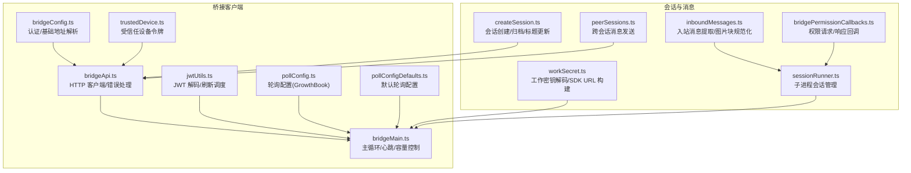
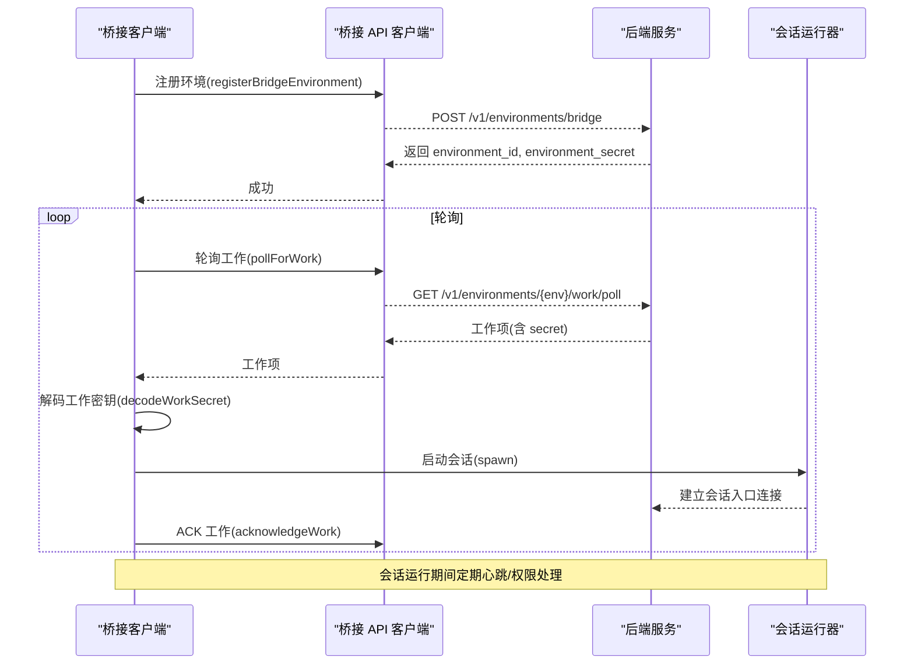
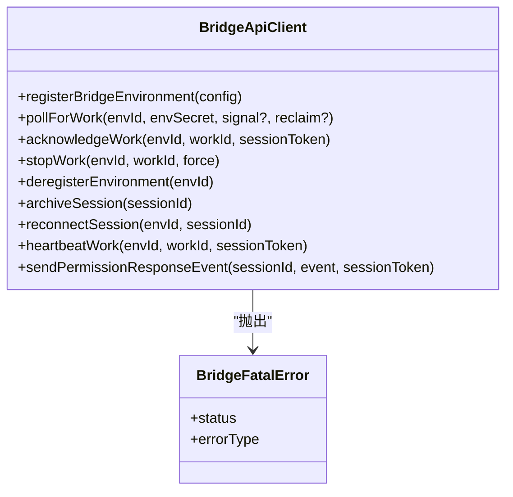
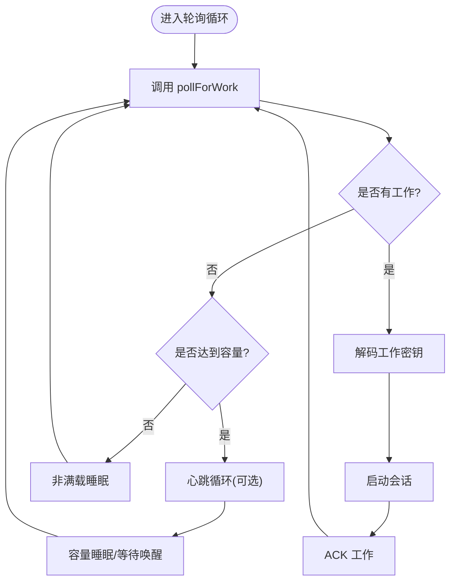
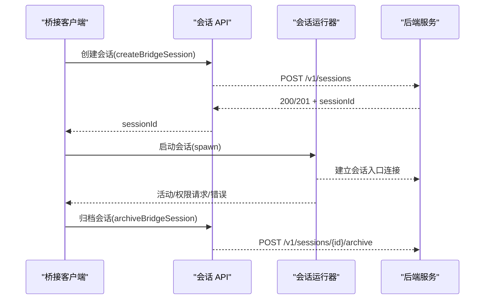
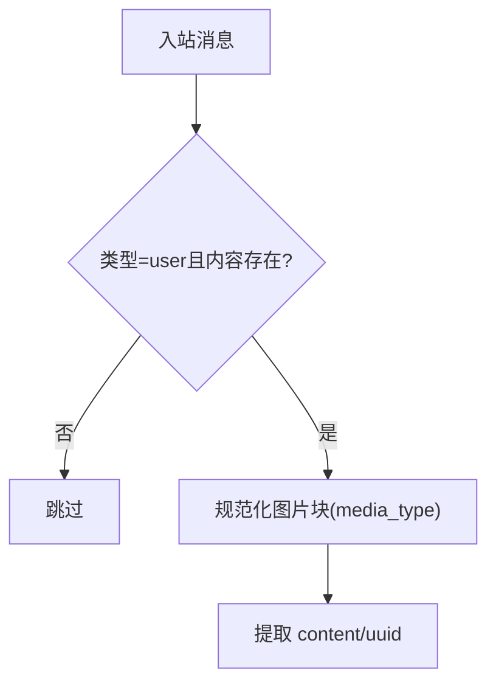
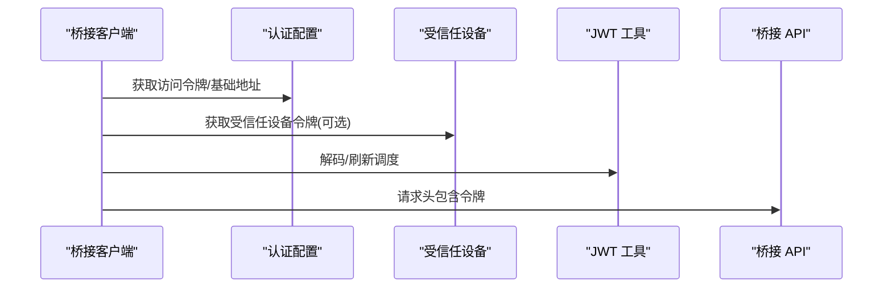
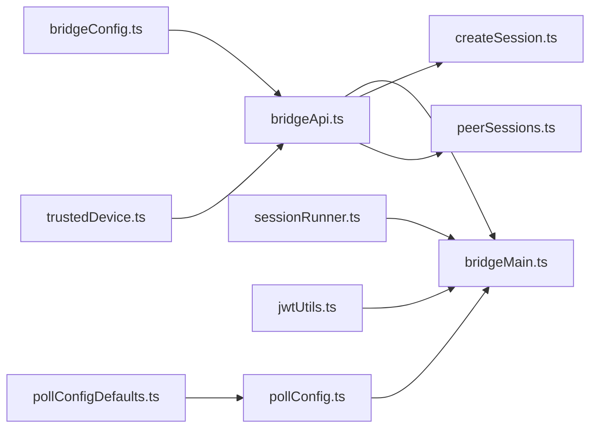

# 桥接 API 接口

<cite>
**本文引用的文件**
- [bridgeApi.ts](file://src/bridge/bridgeApi.ts)
- [bridgeMain.ts](file://src/bridge/bridgeMain.ts)
- [bridgeConfig.ts](file://src/bridge/bridgeConfig.ts)
- [types.ts](file://src/bridge/types.ts)
- [createSession.ts](file://src/bridge/createSession.ts)
- [inboundMessages.ts](file://src/bridge/inboundMessages.ts)
- [peerSessions.ts](file://src/bridge/peerSessions.ts)
- [sessionRunner.ts](file://src/bridge/sessionRunner.ts)
- [workSecret.ts](file://src/bridge/workSecret.ts)
- [bridgePermissionCallbacks.ts](file://src/bridge/bridgePermissionCallbacks.ts)
- [trustedDevice.ts](file://src/bridge/trustedDevice.ts)
- [jwtUtils.ts](file://src/bridge/jwtUtils.ts)
- [pollConfig.ts](file://src/bridge/pollConfig.ts)
- [pollConfigDefaults.ts](file://src/bridge/pollConfigDefaults.ts)
</cite>

## 目录
1. [简介](#简介)
2. [项目结构](#项目结构)
3. [核心组件](#核心组件)
4. [架构总览](#架构总览)
5. [详细组件分析](#详细组件分析)
6. [依赖关系分析](#依赖关系分析)
7. [性能考量](#性能考量)
8. [故障排查指南](#故障排查指南)
9. [结论](#结论)
10. [附录](#附录)

## 简介
本文件为 Claude Code Best 的桥接 API 接口的权威文档，覆盖桥接服务的启动与配置、会话管理、消息传递协议、安全与权限、性能优化与高可用等主题。读者可据此理解桥接客户端如何注册环境、轮询工作、管理会话生命周期、在本地与远程之间进行消息传递，并在生产环境中实现稳定、可靠、可扩展的运行。

## 项目结构
桥接相关代码集中在 src/bridge 目录，按职责划分为：
- 客户端 API 封装：bridgeApi.ts（HTTP 客户端、错误处理、重试）
- 运行循环与调度：bridgeMain.ts（主循环、心跳、容量唤醒、会话生命周期）
- 配置与认证：bridgeConfig.ts、trustedDevice.ts、jwtUtils.ts
- 会话创建与管理：createSession.ts、sessionRunner.ts、workSecret.ts
- 消息与权限：inboundMessages.ts、bridgePermissionCallbacks.ts、peerSessions.ts
- 轮询配置：pollConfig.ts、pollConfigDefaults.ts

图表来源
- [bridgeApi.ts:1-540](file://src/bridge/bridgeApi.ts#L1-L540)
- [bridgeMain.ts:141-800](file://src/bridge/bridgeMain.ts#L141-L800)
- [bridgeConfig.ts:1-49](file://src/bridge/bridgeConfig.ts#L1-L49)
- [trustedDevice.ts:1-211](file://src/bridge/trustedDevice.ts#L1-L211)
- [jwtUtils.ts:1-257](file://src/bridge/jwtUtils.ts#L1-L257)
- [pollConfig.ts:1-111](file://src/bridge/pollConfig.ts#L1-L111)
- [pollConfigDefaults.ts:1-83](file://src/bridge/pollConfigDefaults.ts#L1-L83)
- [createSession.ts:1-385](file://src/bridge/createSession.ts#L1-L385)
- [sessionRunner.ts:1-551](file://src/bridge/sessionRunner.ts#L1-L551)
- [workSecret.ts:1-128](file://src/bridge/workSecret.ts#L1-L128)
- [inboundMessages.ts:1-81](file://src/bridge/inboundMessages.ts#L1-L81)
- [bridgePermissionCallbacks.ts:1-44](file://src/bridge/bridgePermissionCallbacks.ts#L1-L44)
- [peerSessions.ts:1-85](file://src/bridge/peerSessions.ts#L1-L85)

章节来源
- [bridgeApi.ts:1-540](file://src/bridge/bridgeApi.ts#L1-L540)
- [bridgeMain.ts:141-800](file://src/bridge/bridgeMain.ts#L141-L800)
- [bridgeConfig.ts:1-49](file://src/bridge/bridgeConfig.ts#L1-L49)
- [trustedDevice.ts:1-211](file://src/bridge/trustedDevice.ts#L1-L211)
- [jwtUtils.ts:1-257](file://src/bridge/jwtUtils.ts#L1-L257)
- [pollConfig.ts:1-111](file://src/bridge/pollConfig.ts#L1-L111)
- [pollConfigDefaults.ts:1-83](file://src/bridge/pollConfigDefaults.ts#L1-L83)
- [createSession.ts:1-385](file://src/bridge/createSession.ts#L1-L385)
- [sessionRunner.ts:1-551](file://src/bridge/sessionRunner.ts#L1-L551)
- [workSecret.ts:1-128](file://src/bridge/workSecret.ts#L1-L128)
- [inboundMessages.ts:1-81](file://src/bridge/inboundMessages.ts#L1-L81)
- [bridgePermissionCallbacks.ts:1-44](file://src/bridge/bridgePermissionCallbacks.ts#L1-L44)
- [peerSessions.ts:1-85](file://src/bridge/peerSessions.ts#L1-L85)

## 核心组件
- 桥接客户端 API：封装环境注册、工作轮询、ACK、停止、反注册、会话归档、重连、心跳、权限事件发送等接口，内置 OAuth 401 自动重试与统一错误处理。
- 主运行循环：负责轮询工作、心跳保活、容量控制、会话生命周期管理、超时与中断处理、日志与诊断。
- 会话管理：通过子进程运行会话，解析活动、捕获 stderr、处理权限请求、支持 v1/v2 协议切换。
- 认证与安全：OAuth 访问令牌、受信任设备令牌、JWT 解码与刷新调度、路径安全校验。
- 消息与权限：入站消息规范化、权限请求/响应、跨会话消息投递。
- 配置与调度：基于 GrowthBook 的轮询配置，支持多会话模式下的容量与心跳策略。

章节来源
- [bridgeApi.ts:68-452](file://src/bridge/bridgeApi.ts#L68-L452)
- [bridgeMain.ts:141-800](file://src/bridge/bridgeMain.ts#L141-L800)
- [sessionRunner.ts:248-551](file://src/bridge/sessionRunner.ts#L248-L551)
- [trustedDevice.ts:54-87](file://src/bridge/trustedDevice.ts#L54-L87)
- [jwtUtils.ts:72-256](file://src/bridge/jwtUtils.ts#L72-L256)
- [inboundMessages.ts:21-81](file://src/bridge/inboundMessages.ts#L21-L81)
- [bridgePermissionCallbacks.ts:10-44](file://src/bridge/bridgePermissionCallbacks.ts#L10-L44)
- [peerSessions.ts:20-85](file://src/bridge/peerSessions.ts#L20-L85)
- [pollConfig.ts:102-111](file://src/bridge/pollConfig.ts#L102-L111)

## 架构总览
桥接客户端以“环境”为单位向后端注册，随后进入轮询循环；当有工作时解码工作密钥，派生会话接入 URL 并启动子进程会话；会话通过 WebSocket 或 HTTP(S) 与会话入口通信；桥接侧维护心跳、权限请求、容量与超时控制，并在必要时触发重连或归档。

图表来源
- [bridgeApi.ts:142-197](file://src/bridge/bridgeApi.ts#L142-L197)
- [bridgeApi.ts:199-247](file://src/bridge/bridgeApi.ts#L199-L247)
- [bridgeApi.ts:249-271](file://src/bridge/bridgeApi.ts#L249-L271)
- [workSecret.ts:6-32](file://src/bridge/workSecret.ts#L6-L32)
- [sessionRunner.ts:248-551](file://src/bridge/sessionRunner.ts#L248-L551)

## 详细组件分析

### 组件一：桥接 API 客户端（HTTP 客户端与错误处理）
- 功能要点
  - 环境注册：携带机器名、目录、分支、仓库、最大会话数、元数据（worker_type）等信息，支持幂等重注册。
  - 工作轮询：支持 reclaim_older_than_ms 查询参数，空响应用于空闲节流。
  - ACK/停止/反注册：ACK 会话令牌，停止工作使用 OAuth 令牌，反注册删除环境。
  - 会话归档/重连/心跳：归档幂等（409 忽略），重连强制服务器重新派发，心跳使用会话入口 JWT。
  - 权限事件：通过会话事件 API 发送 control_response。
  - 错误处理：统一 BridgeFatalError，区分 401/403/404/410/429 等场景，支持可抑制 403。
  - 安全校验：validateBridgeId 对路径段 ID 做安全校验，防止注入。
- 关键接口
  - registerBridgeEnvironment
  - pollForWork
  - acknowledgeWork
  - stopWork
  - deregisterEnvironment
  - archiveSession
  - reconnectSession
  - heartbeatWork
  - sendPermissionResponseEvent

图表来源
- [bridgeApi.ts:133-176](file://src/bridge/bridgeApi.ts#L133-L176)
- [bridgeApi.ts:56-66](file://src/bridge/bridgeApi.ts#L56-L66)

章节来源
- [bridgeApi.ts:68-452](file://src/bridge/bridgeApi.ts#L68-L452)
- [bridgeApi.ts:502-540](file://src/bridge/bridgeApi.ts#L502-L540)

### 组件二：主运行循环与心跳（bridgeMain）
- 功能要点
  - 会话映射与状态：活跃会话、开始时间、工作 ID、兼容 ID、入口 JWT、定时器、完成工作集合、工作树、超时标记、标题会话集、容量唤醒。
  - 心跳保活：对所有活跃工作项发送心跳，处理 401/403 触发重连，404/410 视为致命错误。
  - 令牌刷新：v1 使用 OAuth 更新，v2 通过 reconnectSession 触发服务器重新派发。
  - 生命周期：onSessionDone 清理、停止状态更新、清理工作树、归档会话、多会话模式下继续运行。
  - 轮询与节流：根据容量与配置选择空闲睡眠或心跳模式，避免过度轮询。
  - 诊断与日志：连接断开恢复、状态显示、调试日志、统计事件上报。
- 关键流程
  - 心跳循环 heartbeatActiveWorkItems
  - 会话结束 onSessionDone
  - 轮询与容量控制 runBridgeLoop

图表来源
- [bridgeMain.ts:600-784](file://src/bridge/bridgeMain.ts#L600-L784)
- [bridgeMain.ts:196-270](file://src/bridge/bridgeMain.ts#L196-L270)
- [bridgeMain.ts:442-591](file://src/bridge/bridgeMain.ts#L442-L591)

章节来源
- [bridgeMain.ts:141-800](file://src/bridge/bridgeMain.ts#L141-L800)

### 组件三：会话创建与管理（createSession 与 sessionRunner）
- 会话创建
  - POST /v1/sessions：支持标题、事件、Git 上下文、模型、权限模式等字段，返回会话 ID。
  - 会话获取/归档/标题更新：GET/PATCH/POST /v1/sessions/{id}，兼容层确保 ID 重标签。
- 会话运行
  - 子进程启动：传入 SDK URL、会话 ID、输入输出格式、调试文件、权限模式等。
  - 活动解析：从 NDJSON 输出解析工具使用、文本、结果/错误等事件，维护最近活动与 stderr。
  - 权限请求：检测 control_request，转发到服务器等待用户决策。
  - 令牌更新：通过 stdin 发送 update_environment_variables，动态替换会话入口令牌。
- 跨会话消息
  - 通过 bridge: 目标地址发送纯文本消息至其他会话，使用会话入口 URL 与当前访问令牌。

图表来源
- [createSession.ts:34-180](file://src/bridge/createSession.ts#L34-L180)
- [createSession.ts:190-244](file://src/bridge/createSession.ts#L190-L244)
- [createSession.ts:263-317](file://src/bridge/createSession.ts#L263-L317)
- [sessionRunner.ts:248-551](file://src/bridge/sessionRunner.ts#L248-L551)
- [peerSessions.ts:20-85](file://src/bridge/peerSessions.ts#L20-L85)

章节来源
- [createSession.ts:1-385](file://src/bridge/createSession.ts#L1-L385)
- [sessionRunner.ts:1-551](file://src/bridge/sessionRunner.ts#L1-L551)
- [peerSessions.ts:1-85](file://src/bridge/peerSessions.ts#L1-L85)

### 组件四：消息与权限（inboundMessages 与 bridgePermissionCallbacks）
- 入站消息提取
  - 支持字符串内容与 ContentBlockParam[]（含图片），规范化媒体类型字段，避免因字段命名差异导致的后续失败。
- 权限回调
  - 定义权限请求/响应的回调接口，校验响应的有效性（行为判别）。

图表来源
- [inboundMessages.ts:21-81](file://src/bridge/inboundMessages.ts#L21-L81)

章节来源
- [inboundMessages.ts:1-81](file://src/bridge/inboundMessages.ts#L1-L81)
- [bridgePermissionCallbacks.ts:1-44](file://src/bridge/bridgePermissionCallbacks.ts#L1-L44)

### 组件五：认证与安全（bridgeConfig、trustedDevice、jwtUtils）
- 认证来源
  - getBridgeAccessToken/getBridgeBaseUrl：优先使用开发覆盖变量，否则使用 OAuth 存储与配置。
- 受信任设备
  - 在启用门控时，读取持久化设备令牌并随请求头发送；登录后可进行设备注册。
- JWT 处理与刷新
  - 解码 JWT 载荷与过期时间；基于过期前缓冲区定时刷新；v2 通过 reconnectSession 触发服务器重新派发。

图表来源
- [bridgeConfig.ts:38-48](file://src/bridge/bridgeConfig.ts#L38-L48)
- [trustedDevice.ts:54-87](file://src/bridge/trustedDevice.ts#L54-L87)
- [jwtUtils.ts:21-49](file://src/bridge/jwtUtils.ts#L21-L49)
- [bridgeApi.ts:76-89](file://src/bridge/bridgeApi.ts#L76-L89)

章节来源
- [bridgeConfig.ts:1-49](file://src/bridge/bridgeConfig.ts#L1-L49)
- [trustedDevice.ts:1-211](file://src/bridge/trustedDevice.ts#L1-L211)
- [jwtUtils.ts:1-257](file://src/bridge/jwtUtils.ts#L1-L257)
- [bridgeApi.ts:1-540](file://src/bridge/bridgeApi.ts#L1-L540)

### 组件六：轮询配置与调度（pollConfig、pollConfigDefaults）
- 配置来源
  - GrowthBook 门控键：tengu_bridge_poll_interval_config，带最小值与有效性约束，确保至少启用心跳或容量轮询之一。
- 默认值
  - 非满载轮询间隔、满载轮询间隔、非独占心跳间隔、多会话轮询间隔、回收窗口、会话保活间隔等。
- 使用方式
  - 运行循环中动态拉取配置，结合容量状态选择心跳或轮询策略，避免紧循环。

章节来源
- [pollConfig.ts:28-92](file://src/bridge/pollConfig.ts#L28-L92)
- [pollConfig.ts:102-111](file://src/bridge/pollConfig.ts#L102-L111)
- [pollConfigDefaults.ts:44-83](file://src/bridge/pollConfigDefaults.ts#L44-L83)

## 依赖关系分析
- 组件耦合
  - bridgeApi.ts 作为 HTTP 客户端被 bridgeMain.ts、createSession.ts、peerSessions.ts 等广泛依赖。
  - sessionRunner.ts 与 bridgeMain.ts 通过 SessionHandle/SessionSpawner 接口协作。
  - jwtUtils.ts 与 bridgeMain.ts、replBridge.ts 共享令牌刷新逻辑。
  - pollConfig.ts 与 bridgeMain.ts、replBridge.ts 共享轮询配置。
- 外部依赖
  - axios 用于 HTTP 请求
  - child_process 用于会话子进程
  - lodash-es/memoize 用于受信任设备令牌缓存
  - zod 用于轮询配置校验

图表来源
- [bridgeApi.ts:1-540](file://src/bridge/bridgeApi.ts#L1-L540)
- [bridgeMain.ts:141-800](file://src/bridge/bridgeMain.ts#L141-L800)
- [createSession.ts:1-385](file://src/bridge/createSession.ts#L1-L385)
- [peerSessions.ts:1-85](file://src/bridge/peerSessions.ts#L1-L85)
- [sessionRunner.ts:1-551](file://src/bridge/sessionRunner.ts#L1-L551)
- [jwtUtils.ts:1-257](file://src/bridge/jwtUtils.ts#L1-L257)
- [pollConfig.ts:1-111](file://src/bridge/pollConfig.ts#L1-L111)
- [pollConfigDefaults.ts:1-83](file://src/bridge/pollConfigDefaults.ts#L1-L83)
- [bridgeConfig.ts:1-49](file://src/bridge/bridgeConfig.ts#L1-L49)
- [trustedDevice.ts:1-211](file://src/bridge/trustedDevice.ts#L1-L211)

## 性能考量
- 轮询节流
  - 非满载：使用较短轮询间隔提升响应速度
  - 满载/空闲：使用较长间隔或心跳模式，避免过度轮询
  - 回收窗口：reclaim_older_than_ms 控制重新派发旧工作的时间窗
- 心跳保活
  - 在容量限制下仍保持心跳，避免空转
  - 与轮询组合：心跳周期性退出以执行轮询
- 令牌刷新
  - 基于 JWT exp 的提前刷新，减少 401/403 导致的重连成本
  - v2 通过 reconnectSession 实现无感续期
- 日志与诊断
  - 空轮询计数与周期性日志，便于定位网络/权限问题
  - 事件上报与诊断日志，辅助性能分析

章节来源
- [bridgeMain.ts:600-784](file://src/bridge/bridgeMain.ts#L600-L784)
- [pollConfig.ts:28-92](file://src/bridge/pollConfig.ts#L28-L92)
- [pollConfigDefaults.ts:44-83](file://src/bridge/pollConfigDefaults.ts#L44-L83)
- [jwtUtils.ts:72-256](file://src/bridge/jwtUtils.ts#L72-L256)

## 故障排查指南
- 常见错误与处理
  - 401 未授权：检查登录状态与 OAuth 刷新；若支持自动刷新则重试一次
  - 403 权限不足：检查组织权限与角色；部分 403 可抑制不提示
  - 404/410 环境/会话过期：需重启或重新注册
  - 429 速率限制：降低轮询频率或等待
- 诊断技巧
  - 查看空轮询日志与断线恢复日志
  - 检查受信任设备令牌是否正确下发
  - 核对工作密钥解码与 SDK URL 构建
  - 关注心跳失败与重连行为
- 常见问题定位
  - 会话无法启动：检查子进程 stderr、活动解析、权限请求
  - 跨会话消息失败：确认目标会话 ID、会话入口 URL、访问令牌

章节来源
- [bridgeApi.ts:454-500](file://src/bridge/bridgeApi.ts#L454-L500)
- [bridgeApi.ts:516-524](file://src/bridge/bridgeApi.ts#L516-L524)
- [trustedDevice.ts:54-87](file://src/bridge/trustedDevice.ts#L54-L87)
- [workSecret.ts:6-32](file://src/bridge/workSecret.ts#L6-L32)
- [sessionRunner.ts:352-446](file://src/bridge/sessionRunner.ts#L352-L446)

## 结论
本桥接 API 通过清晰的客户端封装、稳健的主循环与心跳保活、灵活的轮询配置与令牌刷新机制，实现了本地与远程会话的可靠交互。配合受信任设备与权限回调体系，既满足安全要求，又兼顾用户体验。建议在生产部署中结合容量与心跳策略、严格的错误处理与诊断日志，持续优化轮询与刷新窗口，确保高可用与低延迟。

## 附录

### API 定义概览
- 环境管理
  - POST /v1/environments/bridge：注册环境
  - DELETE /v1/environments/bridge/{environment_id}：反注册环境
- 工作管理
  - GET /v1/environments/{environment_id}/work/poll：轮询工作
  - POST /v1/environments/{environment_id}/work/{work_id}/ack：ACK 工作
  - POST /v1/environments/{environment_id}/work/{work_id}/stop：停止工作
  - POST /v1/environments/{environment_id}/bridge/reconnect：重连会话
  - POST /v1/environments/{environment_id}/work/{work_id}/heartbeat：心跳
- 会话管理
  - POST /v1/sessions：创建会话
  - GET /v1/sessions/{session_id}：获取会话
  - PATCH /v1/sessions/{session_id}：更新标题
  - POST /v1/sessions/{session_id}/archive：归档会话
  - POST /v1/sessions/{session_id}/events：发送权限事件
  - POST /v1/sessions/{session_id}/messages：跨会话消息（bridge:）

章节来源
- [bridgeApi.ts:142-385](file://src/bridge/bridgeApi.ts#L142-L385)
- [createSession.ts:125-180](file://src/bridge/createSession.ts#L125-L180)
- [createSession.ts:190-244](file://src/bridge/createSession.ts#L190-L244)
- [createSession.ts:263-317](file://src/bridge/createSession.ts#L263-L317)
- [peerSessions.ts:46-64](file://src/bridge/peerSessions.ts#L46-L64)