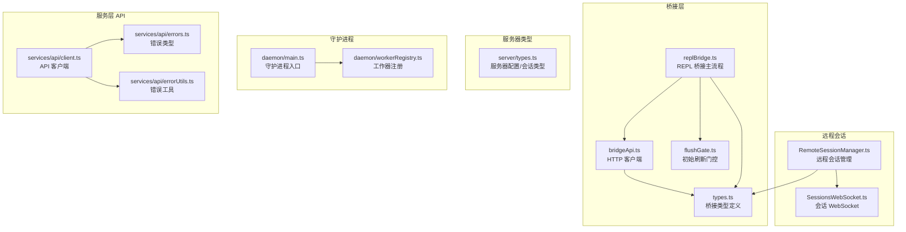
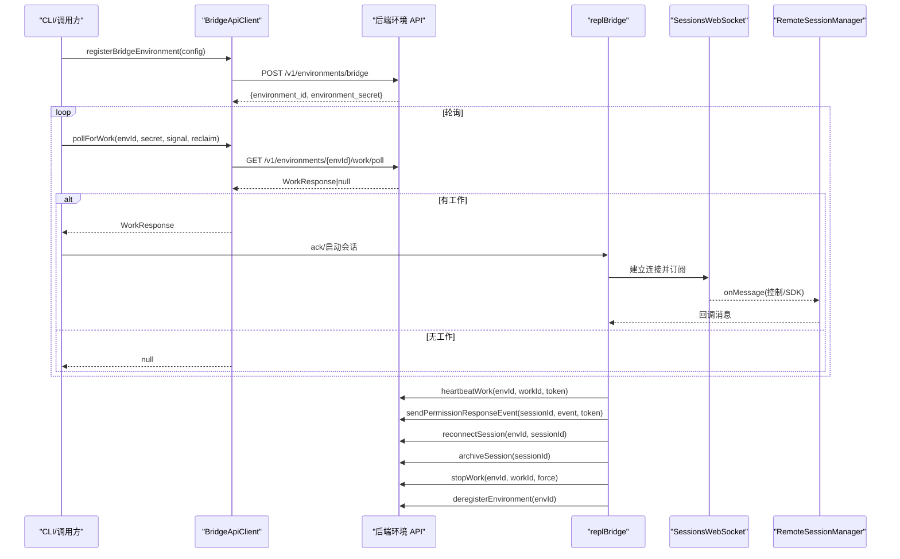
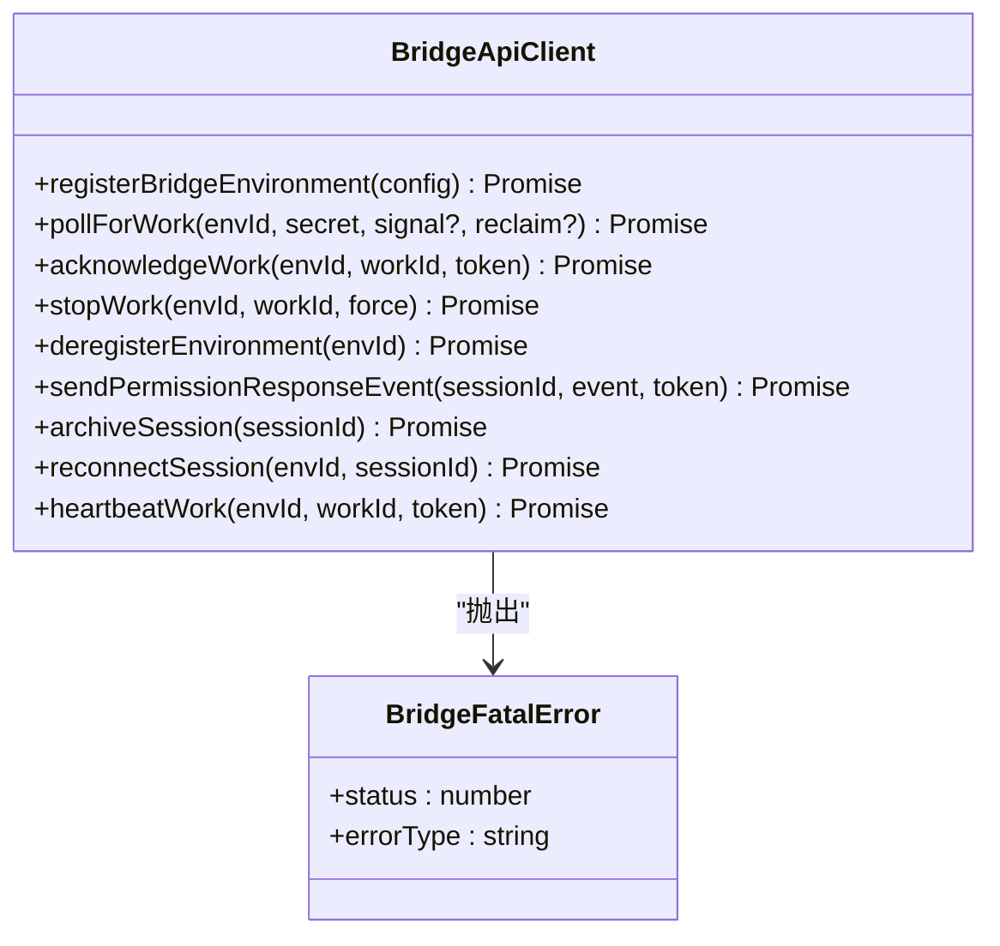
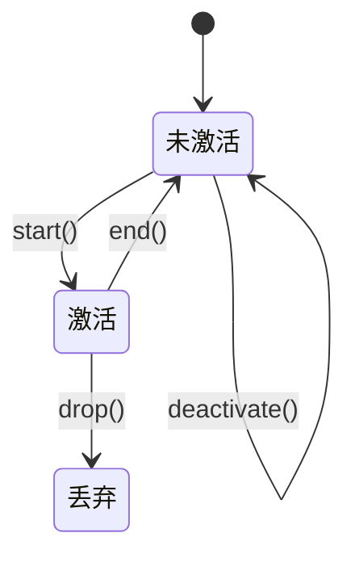
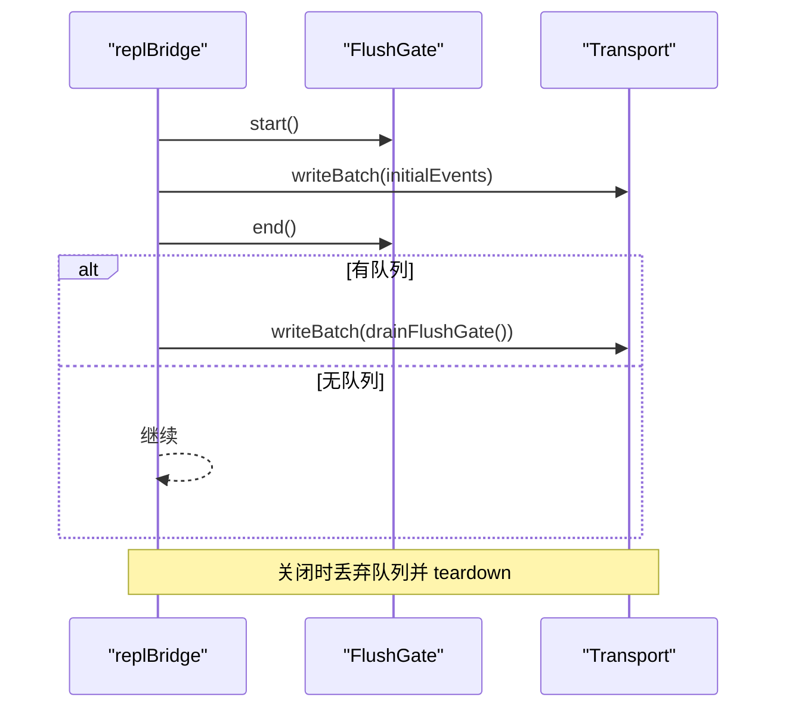
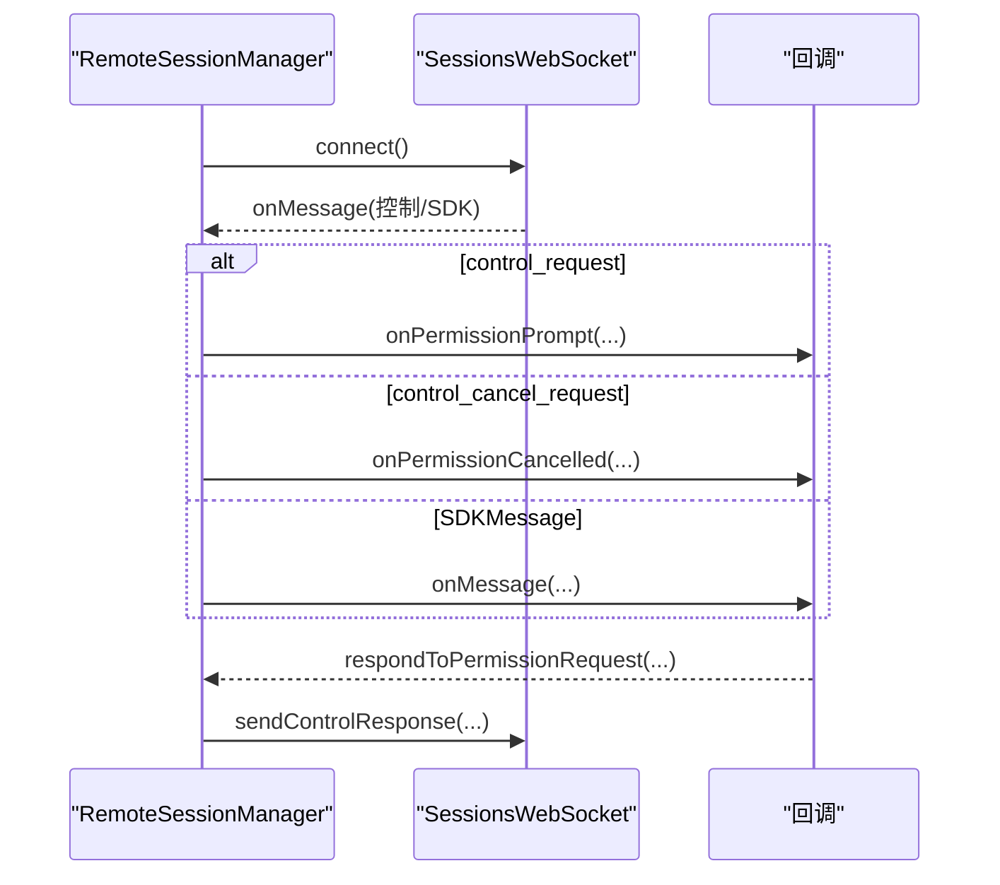
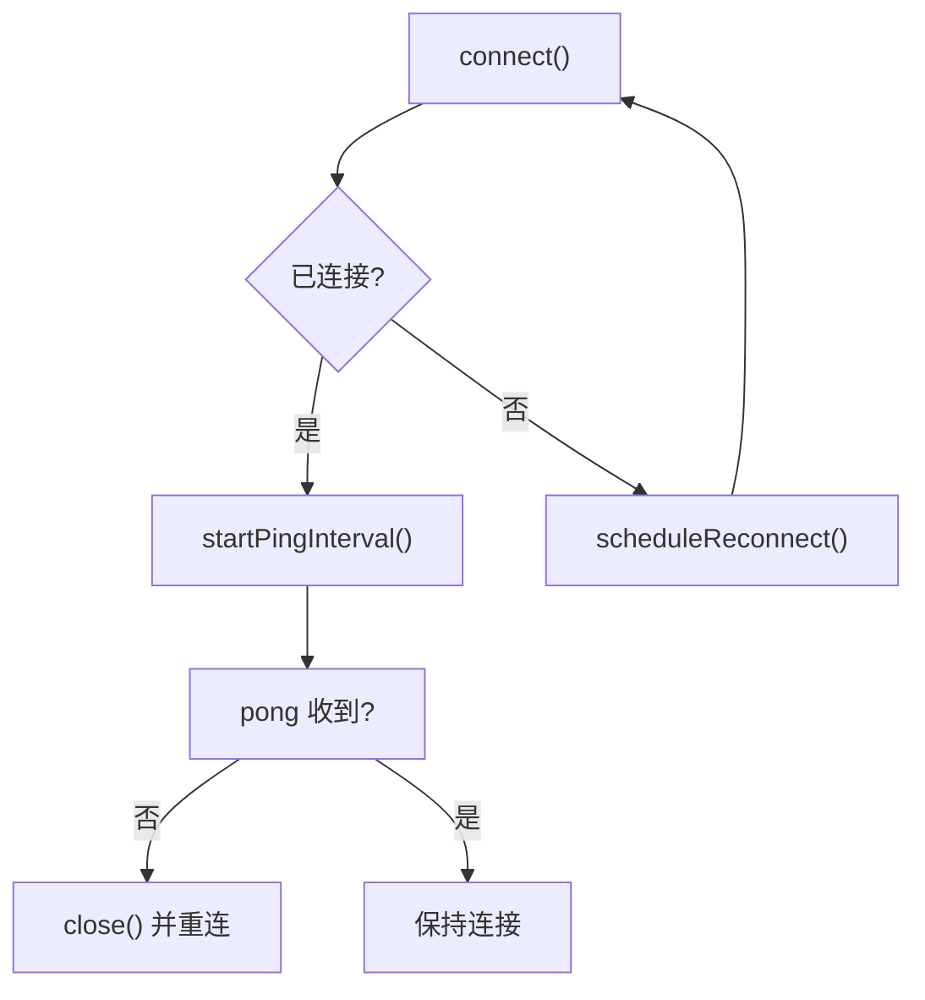
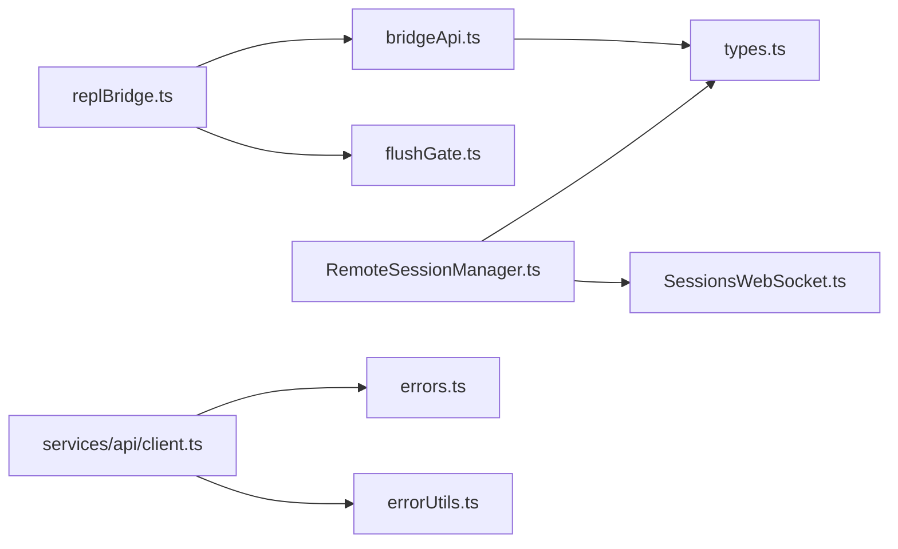

# 内部 API 接口

<cite>
**本文引用的文件**
- [src/bridge/bridgeApi.ts](file://src/bridge/bridgeApi.ts)
- [src/bridge/types.ts](file://src/bridge/types.ts)
- [src/bridge/flushGate.ts](file://src/bridge/flushGate.ts)
- [src/bridge/replBridge.ts](file://src/bridge/replBridge.ts)
- [src/remote/RemoteSessionManager.ts](file://src/remote/RemoteSessionManager.ts)
- [src/remote/SessionsWebSocket.ts](file://src/remote/SessionsWebSocket.ts)
- [src/server/types.ts](file://src/server/types.ts)
- [src/daemon/workerRegistry.ts](file://src/daemon/workerRegistry.ts)
- [src/daemon/main.ts](file://src/daemon/main.ts)
- [src/services/api/client.ts](file://src/services/api/client.ts)
- [src/services/api/errors.ts](file://src/services/api/errors.ts)
- [src/services/api/errorUtils.ts](file://src/services/api/errorUtils.ts)
- [src/utils/mcp/elicitationValidation.ts](file://src/utils/mcp/elicitationValidation.ts)
- [src/tools/PowerShellTool/clmTypes.ts](file://src/tools/PowerShellTool/clmTypes.ts)
</cite>

## 目录
1. [简介](#简介)
2. [项目结构](#项目结构)
3. [核心组件](#核心组件)
4. [架构总览](#架构总览)
5. [详细组件分析](#详细组件分析)
6. [依赖关系分析](#依赖关系分析)
7. [性能考量](#性能考量)
8. [故障排查指南](#故障排查指南)
9. [结论](#结论)
10. [附录](#附录)

## 简介
本文件面向 Claude Code Best 的内部开发者与集成方，系统化梳理内部 API 接口与类型定义，覆盖桥接（Bridge）与远程会话（Remote）两大子系统，以及服务端类型与错误处理约定。内容包括：
- 函数与类的接口规范：参数、返回值、异常与重试策略
- 组件间通信协议与数据格式（HTTP/WS）
- 类型定义文档：接口、枚举、泛型与联合类型
- 内部服务调用约定与生命周期管理
- 性能优化建议与最佳实践

## 项目结构
内部 API 主要分布在以下模块：
- 桥接层（Bridge）：负责本地环境注册、轮询工作、心跳、权限事件上报等
- 远程会话（Remote）：通过 WebSocket 订阅远端会话消息，处理控制请求/响应与权限流程
- 服务器类型（Server）：定义本地/头等舱服务器的配置、会话状态与索引
- 守护进程（Daemon）：守护进程入口与工作器注册占位
- 服务层 API（Services API）：客户端封装、错误类型与工具校验

**图表来源**
- [src/bridge/bridgeApi.ts:68-452](file://src/bridge/bridgeApi.ts#L68-L452)
- [src/bridge/types.ts:16-263](file://src/bridge/types.ts#L16-L263)
- [src/bridge/flushGate.ts:16-50](file://src/bridge/flushGate.ts#L16-L50)
- [src/bridge/replBridge.ts:845-1705](file://src/bridge/replBridge.ts#L845-L1705)
- [src/remote/RemoteSessionManager.ts:95-290](file://src/remote/RemoteSessionManager.ts#L95-L290)
- [src/remote/SessionsWebSocket.ts:153-404](file://src/remote/SessionsWebSocket.ts#L153-L404)
- [src/server/types.ts:13-58](file://src/server/types.ts#L13-L58)
- [src/daemon/main.ts:1-4](file://src/daemon/main.ts#L1-L4)
- [src/daemon/workerRegistry.ts:1-4](file://src/daemon/workerRegistry.ts#L1-L4)
- [src/services/api/client.ts](file://src/services/api/client.ts)
- [src/services/api/errors.ts](file://src/services/api/errors.ts)
- [src/services/api/errorUtils.ts](file://src/services/api/errorUtils.ts)

**章节来源**
- [src/bridge/bridgeApi.ts:68-452](file://src/bridge/bridgeApi.ts#L68-L452)
- [src/bridge/types.ts:16-263](file://src/bridge/types.ts#L16-L263)
- [src/bridge/flushGate.ts:16-50](file://src/bridge/flushGate.ts#L16-L50)
- [src/bridge/replBridge.ts:845-1705](file://src/bridge/replBridge.ts#L845-L1705)
- [src/remote/RemoteSessionManager.ts:95-290](file://src/remote/RemoteSessionManager.ts#L95-L290)
- [src/remote/SessionsWebSocket.ts:153-404](file://src/remote/SessionsWebSocket.ts#L153-L404)
- [src/server/types.ts:13-58](file://src/server/types.ts#L13-L58)
- [src/daemon/main.ts:1-4](file://src/daemon/main.ts#L1-L4)
- [src/daemon/workerRegistry.ts:1-4](file://src/daemon/workerRegistry.ts#L1-L4)
- [src/services/api/client.ts](file://src/services/api/client.ts)
- [src/services/api/errors.ts](file://src/services/api/errors.ts)
- [src/services/api/errorUtils.ts](file://src/services/api/errorUtils.ts)

## 核心组件
本节对关键内部 API 进行接口级说明，包括函数签名、参数类型、返回值与异常处理。

- 桥接 HTTP 客户端（BridgeApiClient）
  - registerBridgeEnvironment(config): 注册本地桥接环境，返回 environment_id 与 environment_secret
  - pollForWork(environmentId, environmentSecret, signal?, reclaimOlderThanMs?): 轮询工作项，返回 WorkResponse 或 null
  - acknowledgeWork(environmentId, workId, sessionToken): 确认工作项
  - stopWork(environmentId, workId, force): 停止工作项
  - deregisterEnvironment(environmentId): 注销环境
  - sendPermissionResponseEvent(sessionId, event, sessionToken): 上报权限决策事件
  - archiveSession(sessionId): 归档会话
  - reconnectSession(environmentId, sessionId): 强制断开旧实例并重排会话
  - heartbeatWork(environmentId, workId, sessionToken): 心跳续租，返回 lease_extended 与 state
  - validateBridgeId(id, label): 校验路径段安全 ID
  - BridgeFatalError: 401/403/404/410 等致命错误封装
  - isExpiredErrorType(errorType): 判断过期类错误
  - isSuppressible403(err): 可抑制的 403 权限错误
  - withOAuthRetry(fn, context): OAuth 401 自动重试
  - getHeaders(token)/resolveAuth(): 构造请求头与鉴权解析

- 桥接类型定义（Bridge Types）
  - WorkResponse/WorkData：工作项数据结构
  - WorkSecret：会话密钥与来源信息
  - SessionActivity/SessionActivityType：会话活动摘要
  - SpawnMode/BridgeWorkerType：工作模式与工作器类型
  - BridgeConfig：桥接配置（目录、分支、最大会话数、调试等）
  - PermissionResponseEvent：权限响应事件
  - BridgeApiClient 接口：上述方法的契约
  - SessionHandle/SessionSpawner/SessionSpawnOpts：会话句柄与生成器
  - BridgeLogger：桥接日志接口

- 初始刷新门控（FlushGate<T>）
  - start()/end()/enqueue(items...)/drop()/deactivate()
  - 属性 active/pendingCount
  - 用于在历史消息一次性刷新期间阻塞新消息写入

- REPL 桥接主流程（replBridge）
  - drainFlushGate(): 刷新后清空队列
  - writeMessages(messages): 去重过滤后写入传输
  - getSSESequenceNum(): 获取序列号高水位
  - 关闭时丢弃队列并触发 teardown

- 远程会话管理（RemoteSessionManager）
  - connect(): 建立 WebSocket 订阅
  - handleMessage(): 分发消息（控制请求/取消/响应/SDK 消息）
  - sendEventToRemoteSession(): 发送用户消息
  - respondToPermissionRequest(): 回应权限请求
  - isConnected(): 连接状态查询

- 会话 WebSocket（SessionsWebSocket）
  - connect()/close()/reconnect(): 生命周期管理
  - sendControlRequest()/sendControlResponse(): 控制请求/响应
  - ping/pong 心跳与自动重连
  - 状态机：connected/disconnected/reconnecting/closed

- 服务器类型（Server Types）
  - ServerConfig：端口、主机、认证、并发限制等
  - SessionState：starting/running/detached/stopping/stopped
  - SessionInfo/SessionIndexEntry/SessionIndex：会话元数据与持久化索引

- 守护进程（Daemon）
  - daemonMain(args): 守护进程入口（占位）
  - runDaemonWorker(workerId): 工作器运行（占位）

- 服务层 API（Services API）
  - 客户端封装与错误类型：统一错误处理与工具

**章节来源**
- [src/bridge/bridgeApi.ts:68-452](file://src/bridge/bridgeApi.ts#L68-L452)
- [src/bridge/types.ts:16-263](file://src/bridge/types.ts#L16-L263)
- [src/bridge/flushGate.ts:16-50](file://src/bridge/flushGate.ts#L16-L50)
- [src/bridge/replBridge.ts:845-1705](file://src/bridge/replBridge.ts#L845-L1705)
- [src/remote/RemoteSessionManager.ts:95-290](file://src/remote/RemoteSessionManager.ts#L95-L290)
- [src/remote/SessionsWebSocket.ts:153-404](file://src/remote/SessionsWebSocket.ts#L153-L404)
- [src/server/types.ts:13-58](file://src/server/types.ts#L13-L58)
- [src/daemon/main.ts:1-4](file://src/daemon/main.ts#L1-L4)
- [src/daemon/workerRegistry.ts:1-4](file://src/daemon/workerRegistry.ts#L1-L4)
- [src/services/api/client.ts](file://src/services/api/client.ts)
- [src/services/api/errors.ts](file://src/services/api/errors.ts)
- [src/services/api/errorUtils.ts](file://src/services/api/errorUtils.ts)

## 架构总览
下图展示桥接与远程会话的交互关系及数据流。

**图表来源**
- [src/bridge/bridgeApi.ts:142-451](file://src/bridge/bridgeApi.ts#L142-L451)
- [src/bridge/replBridge.ts:1273-1705](file://src/bridge/replBridge.ts#L1273-L1705)
- [src/remote/RemoteSessionManager.ts:108-290](file://src/remote/RemoteSessionManager.ts#L108-L290)
- [src/remote/SessionsWebSocket.ts:173-404](file://src/remote/SessionsWebSocket.ts#L173-L404)

## 详细组件分析

### 桥接 HTTP 客户端（BridgeApiClient）
- 角色与职责
  - 封装环境注册、工作轮询、确认、停止、注销、权限事件上报、会话归档与重连、心跳续租等
  - 提供 withOAuthRetry 实现 401 自动刷新与重试
  - validateBridgeId 防注入校验
- 关键流程
  - 注册：携带机器名、目录、分支、仓库、最大会话数、元数据（worker_type）、可选复用环境 ID
  - 轮询：支持 reclaimOlderThanMs 参数回收陈旧任务
  - 心跳：使用 SessionIngressAuth（JWT）避免数据库访问
  - 权限事件：以 control_response 形式上报
- 错误处理
  - 401：抛出 BridgeFatalError，提示登录；可结合 onAuth401 执行刷新
  - 403：Access denied，区分过期与权限不足
  - 404/410：未找到或已过期，提示重启
  - 429：频率限制
  - 其他：通用失败

**图表来源**
- [src/bridge/bridgeApi.ts:68-452](file://src/bridge/bridgeApi.ts#L68-L452)

**章节来源**
- [src/bridge/bridgeApi.ts:68-452](file://src/bridge/bridgeApi.ts#L68-L452)

### 初始刷新门控（FlushGate<T>）
- 作用：在桥接会话启动时，确保历史消息一次性刷新完成后，再顺序发送队列中的新消息
- 状态机：start → enqueue(true) → end() 返回队列 → drop()/deactivate()
- 在 replBridge 中配合 drainFlushGate 使用

**图表来源**
- [src/bridge/flushGate.ts:16-50](file://src/bridge/flushGate.ts#L16-L50)

**章节来源**
- [src/bridge/flushGate.ts:16-50](file://src/bridge/flushGate.ts#L16-L50)
- [src/bridge/replBridge.ts:845-920](file://src/bridge/replBridge.ts#L845-L920)

### REPL 桥接主流程（replBridge）
- 生命周期
  - 初始化：建立传输、设置回调、启动轮询
  - 写消息：去重（初始/近期已发送 UUID），必要时进入 flushGate
  - 刷新：首次批量写入后，drainFlushGate 清空队列
  - 关闭：丢弃队列并触发 teardown
- 关键点
  - getSSESequenceNum 合并当前传输与最后序列号
  - 对于 1000 正常关闭，触发 teardown 并结束会话

**图表来源**
- [src/bridge/replBridge.ts:845-920](file://src/bridge/replBridge.ts#L845-L920)
- [src/bridge/flushGate.ts:37-40](file://src/bridge/flushGate.ts#L37-L40)

**章节来源**
- [src/bridge/replBridge.ts:845-1705](file://src/bridge/replBridge.ts#L845-L1705)

### 远程会话管理（RemoteSessionManager）
- 职责
  - 建立 WebSocket 订阅，转发消息到回调
  - 处理控制请求（权限提示）与取消请求
  - 发送用户消息 via HTTP
  - 回应权限请求为 control_response
- 协议要点
  - control_request：来自服务器的权限提示
  - control_cancel_request：取消权限提示
  - control_response：允许/拒绝或带更新输入/消息

**图表来源**
- [src/remote/RemoteSessionManager.ts:146-283](file://src/remote/RemoteSessionManager.ts#L146-L283)
- [src/remote/SessionsWebSocket.ts:328-357](file://src/remote/SessionsWebSocket.ts#L328-L357)

**章节来源**
- [src/remote/RemoteSessionManager.ts:95-290](file://src/remote/RemoteSessionManager.ts#L95-L290)
- [src/remote/SessionsWebSocket.ts:153-404](file://src/remote/SessionsWebSocket.ts#L153-L404)

### 会话 WebSocket（SessionsWebSocket）
- 生命周期与重连
  - open → connected，启动 ping
  - close → reconnecting → connected 或 onClose
  - error → 记录并回调
- 控制消息
  - sendControlRequest：中断等控制请求
  - sendControlResponse：权限决策响应

**图表来源**
- [src/remote/SessionsWebSocket.ts:290-323](file://src/remote/SessionsWebSocket.ts#L290-L323)

**章节来源**
- [src/remote/SessionsWebSocket.ts:153-404](file://src/remote/SessionsWebSocket.ts#L153-L404)

### 服务器类型（Server Types）
- ServerConfig：监听地址、认证令牌、空闲超时、最大会话数、工作区
- SessionState：会话状态机
- SessionInfo/SessionIndexEntry/SessionIndex：会话元数据与持久化索引

**章节来源**
- [src/server/types.ts:13-58](file://src/server/types.ts#L13-L58)

### 守护进程（Daemon）
- 占位实现：runDaemonWorker 与 daemonMain 返回 Promise.resolve
- 语义：作为工作器调度与守护进程入口的占位

**章节来源**
- [src/daemon/workerRegistry.ts:1-4](file://src/daemon/workerRegistry.ts#L1-L4)
- [src/daemon/main.ts:1-4](file://src/daemon/main.ts#L1-L4)

### 服务层 API（Services API）
- 客户端封装与错误类型：统一错误处理与工具
- 与桥接/远程会话解耦，便于上层调用

**章节来源**
- [src/services/api/client.ts](file://src/services/api/client.ts)
- [src/services/api/errors.ts](file://src/services/api/errors.ts)
- [src/services/api/errorUtils.ts](file://src/services/api/errorUtils.ts)

## 依赖关系分析
- 模块内聚性
  - bridgeApi.ts 与 types.ts 高度内聚，形成“客户端+契约”的清晰边界
  - replBridge 依赖 bridgeApi 与 flushGate，承担消息写入与生命周期管理
  - RemoteSessionManager 与 SessionsWebSocket 解耦，前者专注业务逻辑，后者专注传输
- 外部依赖
  - axios 用于 HTTP 请求
  - ws 或原生 WebSocket 用于 SSE/WS
- 循环依赖风险
  - 当前结构未见循环导入；若后续扩展需注意避免 bridge 与 remote 的双向强耦合

**图表来源**
- [src/bridge/bridgeApi.ts:68-452](file://src/bridge/bridgeApi.ts#L68-L452)
- [src/bridge/types.ts:16-263](file://src/bridge/types.ts#L16-L263)
- [src/bridge/flushGate.ts:16-50](file://src/bridge/flushGate.ts#L16-L50)
- [src/bridge/replBridge.ts:845-1705](file://src/bridge/replBridge.ts#L845-L1705)
- [src/remote/RemoteSessionManager.ts:95-290](file://src/remote/RemoteSessionManager.ts#L95-L290)
- [src/remote/SessionsWebSocket.ts:153-404](file://src/remote/SessionsWebSocket.ts#L153-L404)
- [src/services/api/client.ts](file://src/services/api/client.ts)
- [src/services/api/errors.ts](file://src/services/api/errors.ts)
- [src/services/api/errorUtils.ts](file://src/services/api/errorUtils.ts)

**章节来源**
- [src/bridge/bridgeApi.ts:68-452](file://src/bridge/bridgeApi.ts#L68-L452)
- [src/bridge/types.ts:16-263](file://src/bridge/types.ts#L16-L263)
- [src/bridge/flushGate.ts:16-50](file://src/bridge/flushGate.ts#L16-L50)
- [src/bridge/replBridge.ts:845-1705](file://src/bridge/replBridge.ts#L845-L1705)
- [src/remote/RemoteSessionManager.ts:95-290](file://src/remote/RemoteSessionManager.ts#L95-L290)
- [src/remote/SessionsWebSocket.ts:153-404](file://src/remote/SessionsWebSocket.ts#L153-L404)
- [src/services/api/client.ts](file://src/services/api/client.ts)
- [src/services/api/errors.ts](file://src/services/api/errors.ts)
- [src/services/api/errorUtils.ts](file://src/services/api/errorUtils.ts)

## 性能考量
- 轮询与心跳
  - 轮询间隔与超时已内置，避免过于频繁导致 429
  - 心跳使用 SessionIngressAuth，减少数据库压力
- 初始刷新
  - 使用 FlushGate 避免历史消息与新消息交错，降低重传与乱序成本
- 传输与重连
  - SessionsWebSocket 的 ping/pong 与指数退避重连，提升稳定性
- 会话并发
  - 通过 max_sessions 与环境注册时的 max_sessions 字段控制资源占用

[本节为通用指导，无需特定文件来源]

## 故障排查指南
- 401 未授权
  - 触发 withOAuthRetry，尝试 onAuth401 刷新；若失败则抛出 BridgeFatalError
  - 建议检查登录状态与可信设备令牌
- 403 权限不足
  - 区分过期与权限范围不足；可使用 isSuppressible403 判断是否抑制显示
- 404/410 会话过期
  - 提示重新启动 Remote Control 或 /remote-control
- 429 频率限制
  - 降低轮询频率或增加间隔
- WebSocket 连接问题
  - 检查 onReconnecting/onError 回调，确认代理/TLS 设置与网络可达性
- 权限请求未决
  - 确保及时 respondToPermissionRequest，否则可能阻塞后续流程

**章节来源**
- [src/bridge/bridgeApi.ts:454-540](file://src/bridge/bridgeApi.ts#L454-L540)
- [src/remote/SessionsWebSocket.ts:153-404](file://src/remote/SessionsWebSocket.ts#L153-L404)
- [src/remote/RemoteSessionManager.ts:146-283](file://src/remote/RemoteSessionManager.ts#L146-L283)

## 结论
本文系统化梳理了桥接与远程会话的内部 API 接口、类型定义与生命周期管理，并提供了错误处理与性能优化建议。遵循本文档的接口契约与最佳实践，可确保内部组件稳定协作、可维护性强且具备良好的可观测性与可扩展性。

[本节为总结，无需特定文件来源]

## 附录

### 类型定义速览（接口/枚举/联合/泛型）
- 接口
  - BridgeApiClient：桥接 HTTP 客户端契约
  - SessionHandle/SessionSpawner/SessionSpawnOpts：会话句柄与生成器
  - BridgeLogger：桥接日志接口
- 枚举/联合
  - SessionDoneStatus：completed/failed/interrupted
  - SessionActivityType：tool_start/text/result/error
  - SpawnMode：single-session/worktree/same-dir
  - BridgeWorkerType：claude_code/claude_code_assistant
  - SessionState：starting/running/detached/stopping/stopped
- 泛型
  - FlushGate<T>：门控队列泛型
- 联合类型
  - WorkData：type 为 session 或 healthcheck
  - WorkResponse：包含 id/type/state/data/secret/created_at

**章节来源**
- [src/bridge/types.ts:18-263](file://src/bridge/types.ts#L18-L263)
- [src/bridge/flushGate.ts:16-26](file://src/bridge/flushGate.ts#L16-L26)
- [src/server/types.ts:26-58](file://src/server/types.ts#L26-L58)

### 工具与验证
- MCP 枚举提取
  - getEnumValues/getEnumLabels/getEnumLabel：从 EnumSchema 提取枚举值与标签
- CLM 类型安全
  - normalizeTypeName/isClmAllowedType：规范化类型名并判断是否在允许列表中

**章节来源**
- [src/utils/mcp/elicitationValidation.ts:101-133](file://src/utils/mcp/elicitationValidation.ts#L101-L133)
- [src/tools/PowerShellTool/clmTypes.ts:190-211](file://src/tools/PowerShellTool/clmTypes.ts#L190-L211)