# 上下文管理命令

<cite>
**本文档引用的文件**
- [src/commands/context/context.tsx](file://src/commands/context/context.tsx)
- [src/commands/context/context-noninteractive.ts](file://src/commands/context/context-noninteractive.ts)
- [src/commands/context/index.ts](file://src/commands/context/index.ts)
- [src/commands/compact/compact.ts](file://src/commands/compact/compact.ts)
- [src/commands/compact/index.ts](file://src/commands/compact/index.ts)
- [src/commands/memory/memory.tsx](file://src/commands/memory/memory.tsx)
- [src/commands/memory/index.ts](file://src/commands/memory/index.ts)
- [src/commands/ctx_viz/index.js](file://src/commands/ctx_viz/index.js)
- [src/components/ContextVisualization.tsx](file://src/components/ContextVisualization.tsx)
- [src/services/compact/microCompact.ts](file://src/services/compact/microCompact.ts)
- [src/services/compact/compact.ts](file://src/services/compact/compact.ts)
- [src/services/contextCollapse/operations.ts](file://src/services/contextCollapse/operations.ts)
- [src/utils/analyzeContext.ts](file://src/utils/analyzeContext.ts)
- [src/utils/messages.ts](file://src/utils/messages.ts)
- [src/utils/staticRender.ts](file://src/utils/staticRender.ts)
- [src/bootstrap/state.ts](file://src/bootstrap/state.ts)
- [src/keybindings/shortcutFormat.ts](file://src/keybindings/shortcutFormat.ts)
- [src/services/api/promptCacheBreakDetection.ts](file://src/services/api/promptCacheBreakDetection.ts)
- [src/services/compact/postCompactCleanup.ts](file://src/services/compact/postCompactCleanup.ts)
- [src/services/compact/sessionMemoryCompact.ts](file://src/services/compact/sessionMemoryCompact.ts)
- [src/services/compact/reactiveCompact.ts](file://src/services/compact/reactiveCompact.ts)
- [src/utils/systemPrompt.ts](file://src/utils/systemPrompt.ts)
- [src/context.ts](file://src/context.ts)
- [src/constants/prompts.ts](file://src/constants/prompts.ts)
- [src/utils/model/contextWindowUpgradeCheck.ts](file://src/utils/model/contextWindowUpgradeCheck.ts)
- [src/utils/hooks.ts](file://src/utils/hooks.ts)
- [src/utils/errors.ts](file://src/utils/errors.ts)
- [src/utils/log.ts](file://src/utils/log.ts)
- [src/utils/claudemd.ts](file://src/utils/claudemd.ts)
- [src/utils/envUtils.ts](file://src/utils/envUtils.ts)
- [src/utils/promptEditor.ts](file://src/utils/promptEditor.ts)
- [src/components/memory/MemoryFileSelector.js](file://src/components/memory/MemoryFileSelector.js)
- [src/components/memory/MemoryUpdateNotification.js](file://src/components/memory/MemoryUpdateNotification.js)
</cite>

## 目录
1. [简介](#简介)
2. [项目结构](#项目结构)
3. [核心组件](#核心组件)
4. [架构概览](#架构概览)
5. [详细组件分析](#详细组件分析)
6. [依赖关系分析](#依赖关系分析)
7. [性能考虑](#性能考虑)
8. [故障排除指南](#故障排除指南)
9. [结论](#结论)

## 简介

本文档详细介绍了 Claude Code 中的上下文管理相关命令，包括 context、compact、memory 和 ctx_viz 命令的实现细节和使用方法。这些命令提供了完整的上下文构建、压缩、内存管理和可视化功能，帮助用户有效管理对话历史和上下文信息。

上下文管理是 AI 对话系统的核心功能之一，它涉及如何有效地组织、压缩和展示大量的对话历史信息，确保模型能够获得最佳的上下文理解能力，同时避免超出模型的上下文窗口限制。

## 项目结构

上下文管理命令位于 `src/commands/` 目录下的四个子目录中：

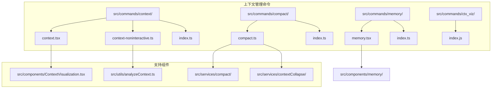

**图表来源**
- [src/commands/context/context.tsx:1-69](file://src/commands/context/context.tsx#L1-L69)
- [src/commands/compact/compact.ts:1-288](file://src/commands/compact/compact.ts#L1-L288)
- [src/commands/memory/memory.tsx:1-103](file://src/commands/memory/memory.tsx#L1-L103)

**章节来源**
- [src/commands/context/context.tsx:1-69](file://src/commands/context/context.tsx#L1-L69)
- [src/commands/compact/compact.ts:1-288](file://src/commands/compact/compact.ts#L1-L288)
- [src/commands/memory/memory.tsx:1-103](file://src/commands/memory/memory.tsx#L1-L103)

## 核心组件

### 上下文命令系统

上下文命令系统包含两个主要组件：交互式上下文命令和非交互式上下文命令。

#### 交互式上下文命令 (context.tsx)

交互式上下文命令提供彩色网格可视化，实时显示当前上下文的使用情况：

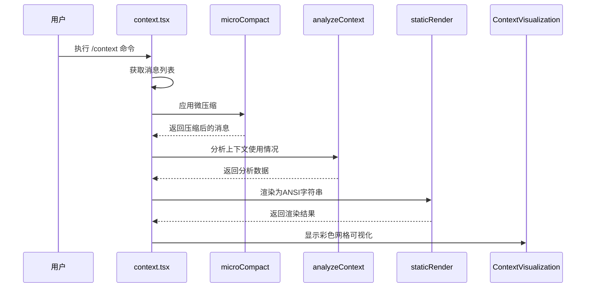

**图表来源**
- [src/commands/context/context.tsx:30-68](file://src/commands/context/context.tsx#L30-L68)
- [src/services/compact/microCompact.ts](file://src/services/compact/microCompact.ts)
- [src/utils/analyzeContext.ts](file://src/utils/analyzeContext.ts)
- [src/utils/staticRender.ts](file://src/utils/staticRender.ts)

#### 非交互式上下文命令 (context-noninteractive.ts)

非交互式上下文命令提供详细的文本格式输出，适合脚本和自动化使用：

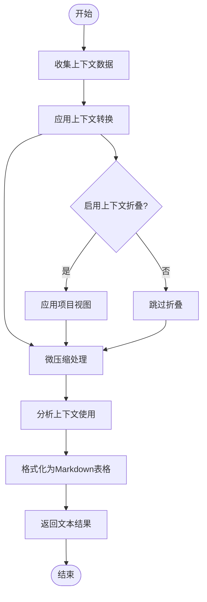

**图表来源**
- [src/commands/context/context-noninteractive.ts:34-88](file://src/commands/context/context-noninteractive.ts#L34-L88)

**章节来源**
- [src/commands/context/context.tsx:1-69](file://src/commands/context/context.tsx#L1-L69)
- [src/commands/context/context-noninteractive.ts:1-326](file://src/commands/context/context-noninteractive.ts#L1-L326)

### 压缩命令系统

压缩命令系统提供多种压缩策略，从简单的微压缩到复杂的会话记忆压缩：

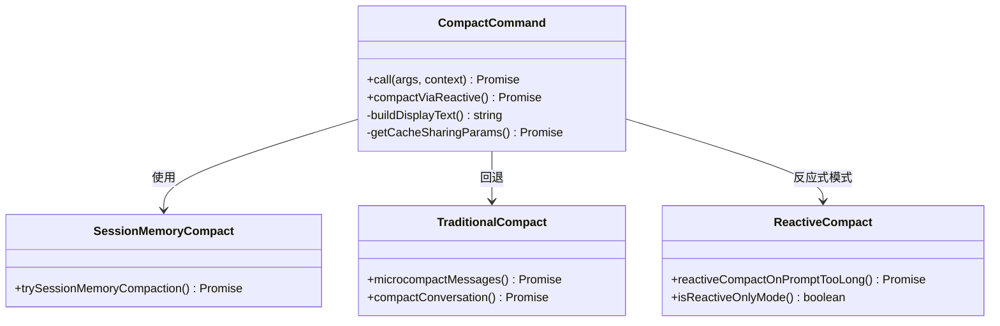

**图表来源**
- [src/commands/compact/compact.ts:40-137](file://src/commands/compact/compact.ts#L40-L137)
- [src/services/compact/sessionMemoryCompact.ts](file://src/services/compact/sessionMemoryCompact.ts)
- [src/services/compact/microCompact.ts](file://src/services/compact/microCompact.ts)
- [src/services/compact/compact.ts](file://src/services/compact/compact.ts)

**章节来源**
- [src/commands/compact/compact.ts:1-288](file://src/commands/compact/compact.ts#L1-L288)

### 内存命令系统

内存命令系统提供内存文件编辑功能，允许用户直接编辑 Claude 的记忆文件：

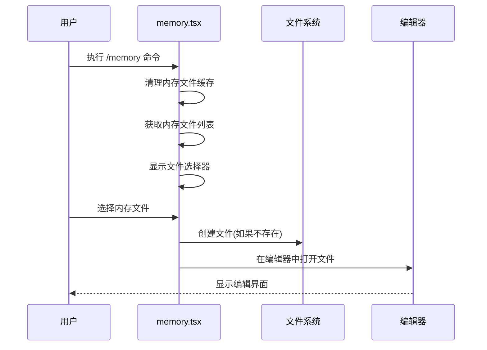

**图表来源**
- [src/commands/memory/memory.tsx:96-102](file://src/commands/memory/memory.tsx#L96-L102)

**章节来源**
- [src/commands/memory/memory.tsx:1-103](file://src/commands/memory/memory.tsx#L1-L103)

## 架构概览

上下文管理系统的整体架构采用分层设计，每个命令都有明确的职责分工：

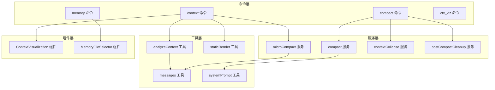

**图表来源**
- [src/commands/context/context.tsx:1-10](file://src/commands/context/context.tsx#L1-L10)
- [src/commands/compact/compact.ts:1-28](file://src/commands/compact/compact.ts#L1-L28)
- [src/commands/memory/memory.tsx:1-14](file://src/commands/memory/memory.tsx#L1-L14)

## 详细组件分析

### 上下文可视化组件

ContextVisualization 组件负责将上下文分析数据转换为彩色网格可视化：

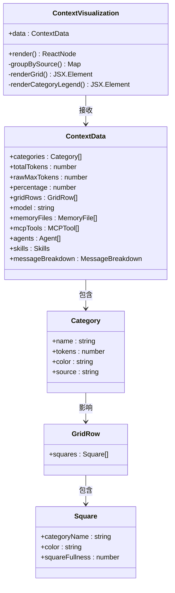

**图表来源**
- [src/components/ContextVisualization.tsx:117-184](file://src/components/ContextVisualization.tsx#L117-L184)
- [src/components/ContextVisualization.tsx:84-111](file://src/components/ContextVisualization.tsx#L84-L111)

#### 上下文分析流程

上下文分析过程包含多个步骤，确保准确反映模型实际看到的上下文：

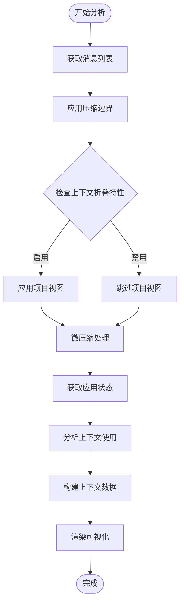

**图表来源**
- [src/commands/context/context.tsx:18-62](file://src/commands/context/context.tsx#L18-L62)
- [src/utils/analyzeContext.ts](file://src/utils/analyzeContext.ts)

**章节来源**
- [src/components/ContextVisualization.tsx:117-184](file://src/components/ContextVisualization.tsx#L117-L184)
- [src/commands/context/context.tsx:12-68](file://src/commands/context/context.tsx#L12-L68)

### 微压缩算法

微压缩算法是上下文管理的核心技术，通过智能删除冗余内容来减少令牌使用：

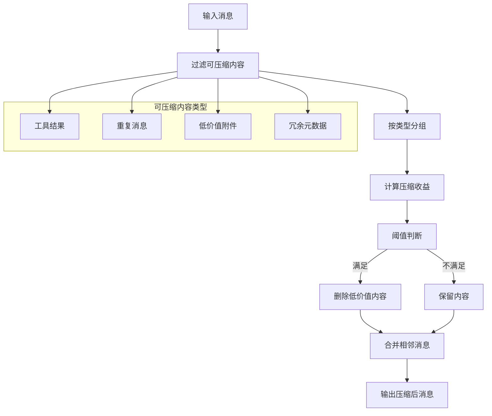

**图表来源**
- [src/services/compact/microCompact.ts:295-332](file://src/services/compact/microCompact.ts#L295-L332)

#### 微压缩实现细节

微压缩算法的关键实现包括：

1. **可压缩工具识别**：自动识别可以安全删除的工具调用结果
2. **缓存友好路径**：使用缓存编辑 API 进行无损压缩
3. **阈值控制**：基于 GrowthBook 配置的计数阈值触发压缩
4. **队列管理**：跟踪工具结果并排队 API 层的缓存编辑

**章节来源**
- [src/services/compact/microCompact.ts:295-332](file://src/services/compact/microCompact.ts#L295-L332)

### 上下文折叠机制

上下文折叠是高级的上下文管理功能，通过智能摘要生成来大幅减少上下文大小：

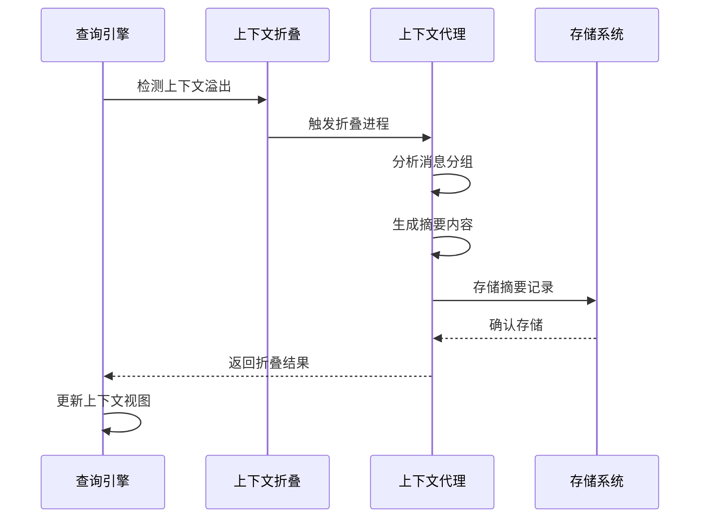

**图表来源**
- [src/services/contextCollapse/operations.ts:1-4](file://src/services/contextCollapse/operations.ts#L1-L4)

#### 上下文折叠特性

上下文折叠功能包含以下特性：

- **自动触发**：当检测到上下文溢出时自动激活
- **智能摘要**：为不同类型的上下文生成合适的摘要
- **持久化**：将折叠历史保存到会话存储中
- **恢复能力**：支持从折叠状态恢复原始上下文

**章节来源**
- [src/services/contextCollapse/operations.ts:1-4](file://src/services/contextCollapse/operations.ts#L1-L4)

### 压缩清理机制

压缩后清理机制确保系统在压缩操作后保持最佳状态：

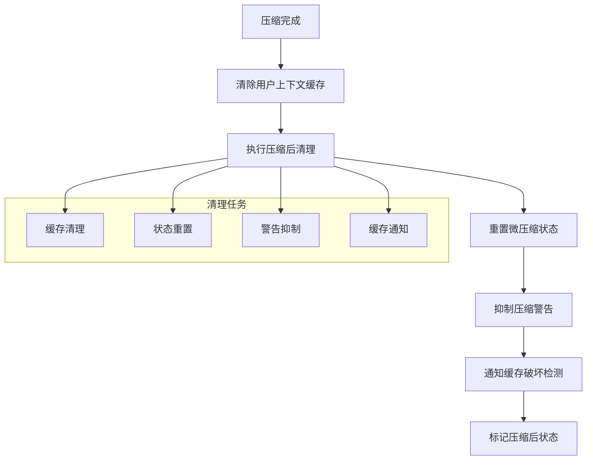

**图表来源**
- [src/commands/compact/compact.ts:55-83](file://src/commands/compact/compact.ts#L55-L83)
- [src/commands/compact/compact.ts:117-118](file://src/commands/compact/compact.ts#L117-L118)

**章节来源**
- [src/commands/compact/compact.ts:55-83](file://src/commands/compact/compact.ts#L55-L83)
- [src/commands/compact/compact.ts:117-118](file://src/commands/compact/compact.ts#L117-L118)

## 依赖关系分析

上下文管理命令之间的依赖关系如下：

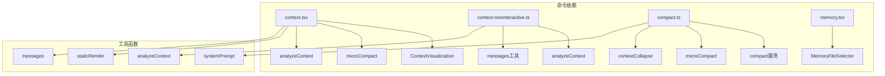

**图表来源**
- [src/commands/context/context.tsx:1-10](file://src/commands/context/context.tsx#L1-L10)
- [src/commands/compact/compact.ts:1-28](file://src/commands/compact/compact.ts#L1-L28)
- [src/commands/memory/memory.tsx:1-14](file://src/commands/memory/memory.tsx#L1-L14)

**章节来源**
- [src/commands/context/context.tsx:1-10](file://src/commands/context/context.tsx#L1-L10)
- [src/commands/compact/compact.ts:1-28](file://src/commands/compact/compact.ts#L1-L28)
- [src/commands/memory/memory.tsx:1-14](file://src/commands/memory/memory.tsx#L1-L14)

## 性能考虑

### 上下文压缩性能优化

1. **增量压缩**：微压缩算法只处理新增的消息，避免全量重新计算
2. **缓存利用**：充分利用现有的缓存机制，减少重复计算
3. **并发处理**：在可能的情况下并行执行多个压缩任务
4. **内存管理**：及时清理不再需要的中间结果

### 可视化性能优化

1. **延迟加载**：上下文可视化组件支持延迟加载，避免不必要的渲染
2. **响应式布局**：根据终端宽度动态调整网格大小
3. **颜色缓存**：缓存颜色计算结果，减少重复计算

### 内存使用监控

系统提供了多种内存使用监控机制：

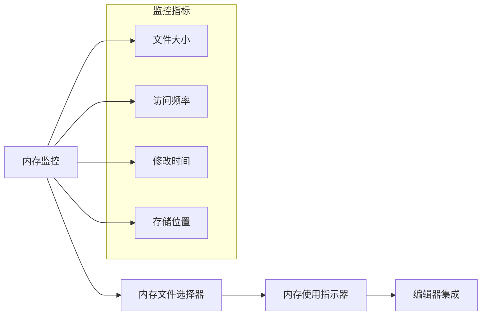

**图表来源**
- [src/commands/memory/memory.tsx:1-103](file://src/commands/memory/memory.tsx#L1-L103)

## 故障排除指南

### 常见问题及解决方案

#### 上下文命令无法显示

**问题**：`/context` 命令执行后没有显示任何输出

**可能原因**：
1. 消息列表为空
2. 上下文折叠特性未正确配置
3. 渲染失败

**解决方法**：
1. 检查是否有有效的对话历史
2. 验证上下文折叠特性标志
3. 查看渲染错误日志

#### 压缩命令执行失败

**问题**：`/compact` 命令报错或无法完成

**可能原因**：
1. 消息数量不足
2. 压缩过程中被中断
3. 缓存参数配置错误

**解决方法**：
1. 确保有足够的对话历史进行压缩
2. 检查压缩过程是否被意外中断
3. 验证系统提示词和上下文参数

#### 内存编辑功能异常

**问题**：`/memory` 命令无法打开内存文件

**可能原因**：
1. 文件权限问题
2. 编辑器配置错误
3. 文件系统异常

**解决方法**：
1. 检查文件权限和路径
2. 验证 EDITOR 或 VISUAL 环境变量
3. 确认文件系统正常工作

**章节来源**
- [src/commands/context/context.tsx:12-28](file://src/commands/context/context.tsx#L12-L28)
- [src/commands/compact/compact.ts:125-136](file://src/commands/compact/compact.ts#L125-L136)
- [src/commands/memory/memory.tsx:66-69](file://src/commands/memory/memory.tsx#L66-L69)

## 结论

上下文管理命令系统提供了完整的上下文构建、压缩、内存管理和可视化功能。通过合理的架构设计和优化策略，这些命令能够有效地帮助用户管理复杂的对话历史，确保模型获得最佳的上下文理解能力。

关键优势包括：
- **多层压缩策略**：从微压缩到会话记忆压缩的完整覆盖
- **智能可视化**：彩色网格直观展示上下文使用情况
- **灵活的配置选项**：支持不同的压缩模式和参数设置
- **完善的错误处理**：提供详细的错误信息和恢复机制

建议的最佳实践：
1. 定期使用 `/context` 命令监控上下文使用情况
2. 在适当的时候执行 `/compact` 命令进行上下文压缩
3. 利用 `/memory` 命令管理重要的上下文信息
4. 根据项目需求调整压缩策略和参数设置