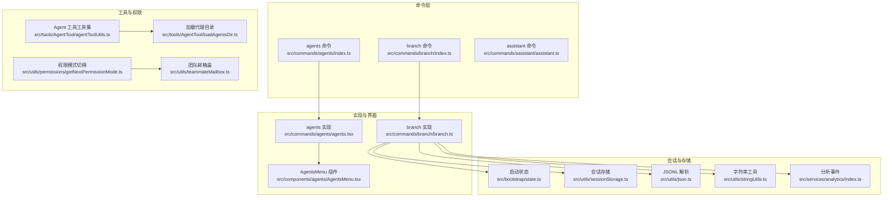
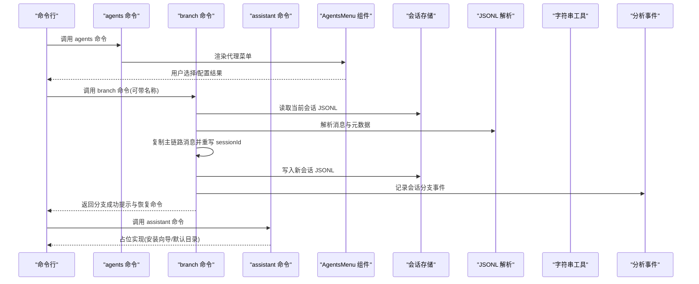
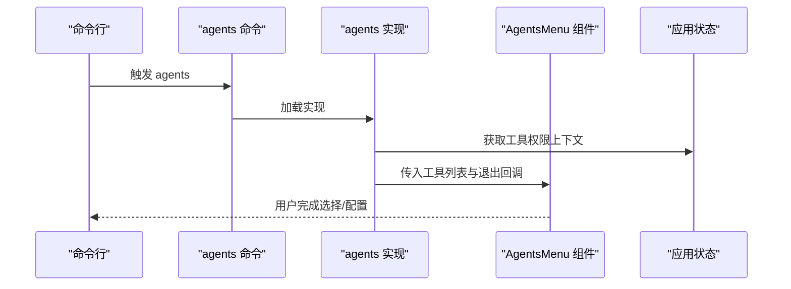
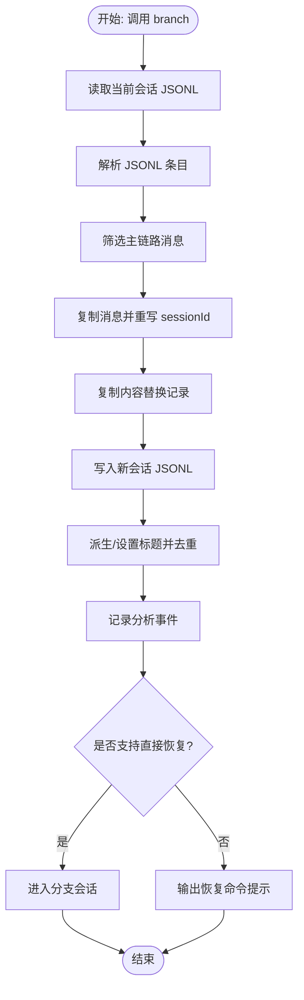
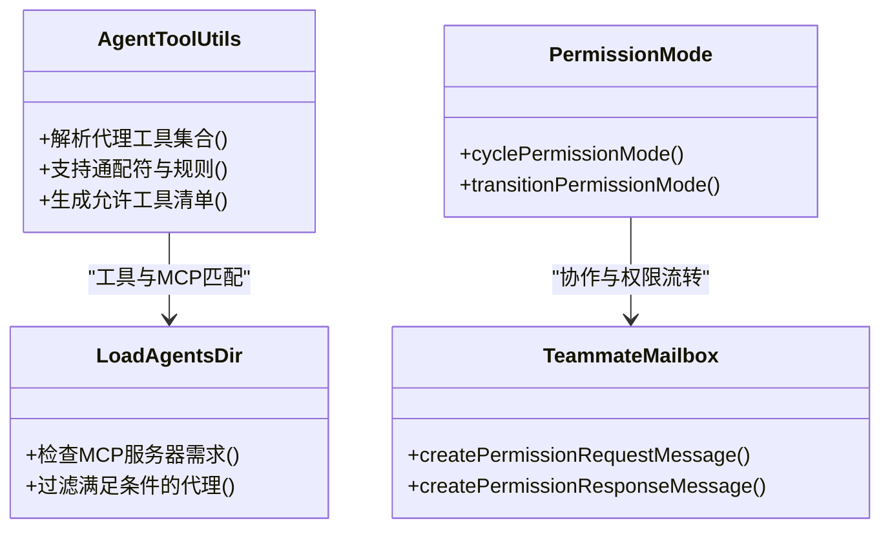
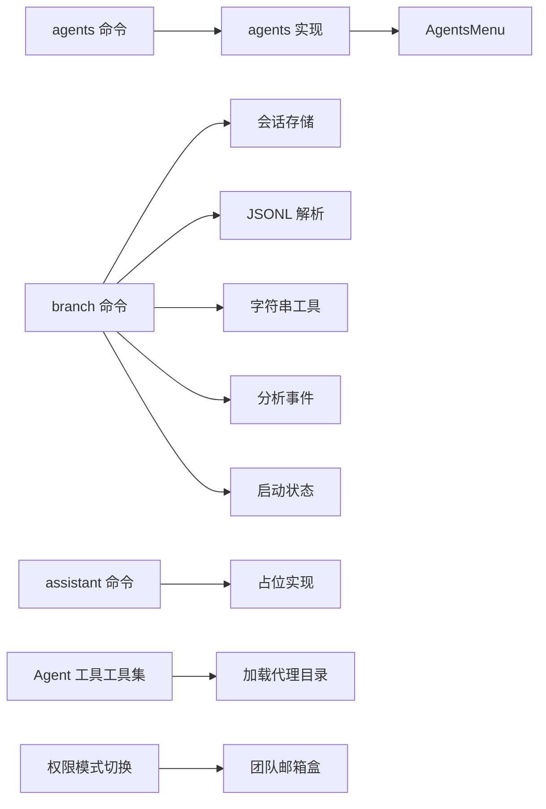

# 代理管理命令

<cite>
**本文引用的文件**
- [src/commands/agents/index.ts](file://src/commands/agents/index.ts)
- [src/commands/agents/agents.tsx](file://src/commands/agents/agents.tsx)
- [src/commands/branch/index.ts](file://src/commands/branch/index.ts)
- [src/commands/branch/branch.ts](file://src/commands/branch/branch.ts)
- [src/commands/assistant/assistant.ts](file://src/commands/assistant/assistant.ts)
- [src/components/agents/AgentsMenu.tsx](file://src/components/agents/AgentsMenu.tsx)
- [src/tools/AgentTool/agentToolUtils.ts](file://src/tools/AgentTool/agentToolUtils.ts)
- [src/tools/AgentTool/loadAgentsDir.ts](file://src/tools/AgentTool/loadAgentsDir.ts)
- [src/utils/permissions/getNextPermissionMode.ts](file://src/utils/permissions/getNextPermissionMode.ts)
- [src/utils/teammateMailbox.ts](file://src/utils/teammateMailbox.ts)
- [src/bootstrap/state.ts](file://src/bootstrap/state.ts)
- [src/utils/sessionStorage.ts](file://src/utils/sessionStorage.ts)
- [src/utils/json.ts](file://src/utils/json.ts)
- [src/utils/stringUtils.ts](file://src/utils/stringUtils.ts)
- [src/services/analytics/index.ts](file://src/services/analytics/index.ts)
- [src/types/command.ts](file://src/types/command.ts)
- [src/types/logs.ts](file://src/types/logs.ts)
</cite>

## 目录
1. [简介](#简介)
2. [项目结构](#项目结构)
3. [核心组件](#核心组件)
4. [架构总览](#架构总览)
5. [详细组件分析](#详细组件分析)
6. [依赖关系分析](#依赖关系分析)
7. [性能考量](#性能考量)
8. [故障排查指南](#故障排查指南)
9. [结论](#结论)
10. [附录](#附录)

## 简介
本技术文档聚焦于代理管理相关命令，涵盖以下方面：
- 代理配置与管理：agents 命令入口与界面交互
- 分支与复刻：branch 命令的会话分支机制与数据持久化
- 助手相关：assistant 命令的占位实现与后续扩展方向
- 代理生命周期与协作：工具权限模式切换、代理间通信与权限请求流程
- 最佳实践与常见场景：代理模板、配置管理与监控建议

## 项目结构
与代理管理相关的命令位于 src/commands 下，分别对应 agents、branch、assistant 三个子目录；代理配置界面由 src/components/agents 提供；代理工具能力由 src/tools/AgentTool 提供；权限与协作机制由工具权限系统与消息通道共同支撑。

图表来源
- [src/commands/agents/index.ts:1-11](file://src/commands/agents/index.ts#L1-L11)
- [src/commands/agents/agents.tsx:1-17](file://src/commands/agents/agents.tsx#L1-L17)
- [src/commands/branch/index.ts:1-15](file://src/commands/branch/index.ts#L1-L15)
- [src/commands/branch/branch.ts:1-297](file://src/commands/branch/branch.ts#L1-L297)
- [src/components/agents/AgentsMenu.tsx](file://src/components/agents/AgentsMenu.tsx)
- [src/tools/AgentTool/agentToolUtils.ts:162-188](file://src/tools/AgentTool/agentToolUtils.ts#L162-L188)
- [src/tools/AgentTool/loadAgentsDir.ts:220-255](file://src/tools/AgentTool/loadAgentsDir.ts#L220-L255)
- [src/utils/permissions/getNextPermissionMode.ts:81-101](file://src/utils/permissions/getNextPermissionMode.ts#L81-L101)
- [src/utils/teammateMailbox.ts:485-536](file://src/utils/teammateMailbox.ts#L485-L536)
- [src/bootstrap/state.ts](file://src/bootstrap/state.ts)
- [src/utils/sessionStorage.ts](file://src/utils/sessionStorage.ts)
- [src/utils/json.ts](file://src/utils/json.ts)
- [src/utils/stringUtils.ts](file://src/utils/stringUtils.ts)
- [src/services/analytics/index.ts](file://src/services/analytics/index.ts)

章节来源
- [src/commands/agents/index.ts:1-11](file://src/commands/agents/index.ts#L1-L11)
- [src/commands/branch/index.ts:1-15](file://src/commands/branch/index.ts#L1-L15)
- [src/commands/assistant/assistant.ts:1-12](file://src/commands/assistant/assistant.ts#L1-L12)

## 核心组件
- agents 命令：注册为本地 JSX 命令，描述为“管理代理配置”，通过调用 agents.tsx 打开代理菜单界面，用于代理配置与选择。
- branch 命令：注册为本地 JSX 命令，描述为“在此处对当前对话进行分支”，支持可选名称参数；在实现中复制当前会话的主链路消息与内容替换记录，生成新的会话 ID，并写入独立的 JSONL 文件，同时记录分析事件与自定义标题。
- assistant 命令：当前为占位实现，导出安装向导与默认安装目录计算函数，用于后续助手安装流程。

章节来源
- [src/commands/agents/index.ts:1-11](file://src/commands/agents/index.ts#L1-L11)
- [src/commands/agents/agents.tsx:1-17](file://src/commands/agents/agents.tsx#L1-L17)
- [src/commands/branch/index.ts:1-15](file://src/commands/branch/index.ts#L1-L15)
- [src/commands/branch/branch.ts:222-297](file://src/commands/branch/branch.ts#L222-L297)
- [src/commands/assistant/assistant.ts:1-12](file://src/commands/assistant/assistant.ts#L1-L12)

## 架构总览
下图展示 agents、branch、assistant 命令与核心模块之间的交互关系，以及代理工具与权限系统的协作路径。

图表来源
- [src/commands/agents/agents.tsx:7-16](file://src/commands/agents/agents.tsx#L7-L16)
- [src/commands/branch/branch.ts:61-173](file://src/commands/branch/branch.ts#L61-L173)
- [src/commands/assistant/assistant.ts:1-12](file://src/commands/assistant/assistant.ts#L1-L12)
- [src/utils/sessionStorage.ts](file://src/utils/sessionStorage.ts)
- [src/utils/json.ts](file://src/utils/json.ts)
- [src/utils/stringUtils.ts](file://src/utils/stringUtils.ts)
- [src/services/analytics/index.ts](file://src/services/analytics/index.ts)

## 详细组件分析

### agents 命令
- 注册方式：本地 JSX 命令，延迟加载实现模块。
- 运行逻辑：获取应用状态中的工具权限上下文，收集可用工具，渲染代理菜单，回调 onDone 完成交互。
- 关键点：与工具权限系统集成，确保菜单显示符合当前权限模式；通过 AgentsMenu 组件完成用户交互。

图表来源
- [src/commands/agents/index.ts:3-8](file://src/commands/agents/index.ts#L3-L8)
- [src/commands/agents/agents.tsx:7-16](file://src/commands/agents/agents.tsx#L7-L16)
- [src/components/agents/AgentsMenu.tsx](file://src/components/agents/AgentsMenu.tsx)

章节来源
- [src/commands/agents/index.ts:1-11](file://src/commands/agents/index.ts#L1-L11)
- [src/commands/agents/agents.tsx:1-17](file://src/commands/agents/agents.tsx#L1-L17)

### branch 命令
- 功能概述：基于当前会话创建分支（复刻），保留原始元数据，更新 sessionId 并记录 forkedFrom 溯源信息。
- 数据处理：
  - 从当前会话 JSONL 中解析所有条目，过滤出主链路消息。
  - 复制消息并重写 sessionId，保留父消息指针与 isSidechain 标记。
  - 复制内容替换记录（content-replacement）并写入新会话文件。
- 命名与去重：根据首个用户消息派生标题，若提供自定义标题则优先使用；通过 getUniqueForkName 处理命名冲突，自动添加数字后缀。
- 事件与恢复：记录分析事件，保存自定义标题，返回恢复提示或直接进入分支会话。
- 错误处理：当无会话或无消息时抛出明确错误。

图表来源
- [src/commands/branch/branch.ts:61-173](file://src/commands/branch/branch.ts#L61-L173)
- [src/commands/branch/branch.ts:179-220](file://src/commands/branch/branch.ts#L179-L220)
- [src/commands/branch/branch.ts:222-297](file://src/commands/branch/branch.ts#L222-L297)
- [src/utils/sessionStorage.ts](file://src/utils/sessionStorage.ts)
- [src/utils/json.ts](file://src/utils/json.ts)
- [src/utils/stringUtils.ts](file://src/utils/stringUtils.ts)
- [src/services/analytics/index.ts](file://src/services/analytics/index.ts)

章节来源
- [src/commands/branch/index.ts:1-15](file://src/commands/branch/index.ts#L1-L15)
- [src/commands/branch/branch.ts:1-297](file://src/commands/branch/branch.ts#L1-L297)

### assistant 命令
- 当前状态：占位实现，导出安装向导组件与默认安装目录计算函数，便于后续扩展。
- 后续方向：可结合 agents/branch 的会话与权限模型，提供助手安装、初始化与会话接入流程。

章节来源
- [src/commands/assistant/assistant.ts:1-12](file://src/commands/assistant/assistant.ts#L1-L12)

### 代理工具与权限系统
- 工具解析与授权：agentToolUtils 对代理声明的工具集合进行解析，支持通配符与规则解析，最终得到允许使用的工具清单。
- MCP 服务器要求：loadAgentsDir 支持按 MCP 服务器名称过滤代理，仅返回满足所需 MCP 服务器的代理。
- 权限模式切换：getNextPermissionMode 提供权限模式循环切换与上下文过渡，确保在不同模式下清理危险权限或准备必要权限。
- 代理间通信：teammateMailbox 提供权限请求/响应消息结构，支持代理向团队领导发起权限请求与接收响应。

图表来源
- [src/tools/AgentTool/agentToolUtils.ts:162-188](file://src/tools/AgentTool/agentToolUtils.ts#L162-L188)
- [src/tools/AgentTool/loadAgentsDir.ts:229-255](file://src/tools/AgentTool/loadAgentsDir.ts#L229-L255)
- [src/utils/permissions/getNextPermissionMode.ts:88-101](file://src/utils/permissions/getNextPermissionMode.ts#L88-L101)
- [src/utils/teammateMailbox.ts:485-536](file://src/utils/teammateMailbox.ts#L485-L536)

章节来源
- [src/tools/AgentTool/agentToolUtils.ts:162-188](file://src/tools/AgentTool/agentToolUtils.ts#L162-L188)
- [src/tools/AgentTool/loadAgentsDir.ts:229-255](file://src/tools/AgentTool/loadAgentsDir.ts#L229-L255)
- [src/utils/permissions/getNextPermissionMode.ts:81-101](file://src/utils/permissions/getNextPermissionMode.ts#L81-L101)
- [src/utils/teammateMailbox.ts:485-536](file://src/utils/teammateMailbox.ts#L485-L536)

## 依赖关系分析
- agents 命令依赖：
  - agents.tsx 依赖应用状态与工具集合，渲染 AgentsMenu。
  - AgentsMenu 作为 UI 组件，负责代理配置与选择。
- branch 命令依赖：
  - 会话存储：读取/写入 JSONL 文件，解析/序列化消息。
  - 工具与字符串：派生标题、正则去重。
  - 分析事件：记录会话分支统计。
  - 启动状态：获取原始工作目录与会话 ID。
- assistant 命令依赖：
  - 当前为占位，后续将依赖 agents/branch 的会话与权限模型。
- 代理工具与权限系统：
  - AgentTool 工具集与 MCP 服务器过滤相互配合，确保代理可用性。
  - 权限模式切换与团队邮箱盒消息结构共同构成代理协作与权限控制基础。

图表来源
- [src/commands/agents/index.ts:3-8](file://src/commands/agents/index.ts#L3-L8)
- [src/commands/agents/agents.tsx:7-16](file://src/commands/agents/agents.tsx#L7-L16)
- [src/commands/branch/branch.ts:61-173](file://src/commands/branch/branch.ts#L61-L173)
- [src/commands/assistant/assistant.ts:1-12](file://src/commands/assistant/assistant.ts#L1-L12)
- [src/tools/AgentTool/agentToolUtils.ts:162-188](file://src/tools/AgentTool/agentToolUtils.ts#L162-L188)
- [src/tools/AgentTool/loadAgentsDir.ts:229-255](file://src/tools/AgentTool/loadAgentsDir.ts#L229-L255)
- [src/utils/permissions/getNextPermissionMode.ts:88-101](file://src/utils/permissions/getNextPermissionMode.ts#L88-L101)
- [src/utils/teammateMailbox.ts:485-536](file://src/utils/teammateMailbox.ts#L485-L536)

章节来源
- [src/commands/agents/index.ts:1-11](file://src/commands/agents/index.ts#L1-L11)
- [src/commands/branch/index.ts:1-15](file://src/commands/branch/index.ts#L1-L15)
- [src/commands/assistant/assistant.ts:1-12](file://src/commands/assistant/assistant.ts#L1-L12)

## 性能考量
- JSONL 解析与写入：分支操作涉及完整会话 JSONL 的读取与逐条重写，建议在大体量会话时关注磁盘 I/O 与内存占用，必要时分块处理或异步写入。
- 命名去重算法：getUniqueForkName 使用正则匹配与集合去重，时间复杂度与已存在分支数量线性相关；可通过缓存已用编号降低重复扫描成本。
- 权限模式切换：权限上下文转换可能涉及工具集合重建与权限校验，建议在批量切换时合并操作以减少重复计算。
- MCP 服务器过滤：按需过滤代理列表，避免不必要的工具加载与初始化。

## 故障排查指南
- 无会话可分支：
  - 现象：抛出“无会话可分支”或“无消息可分支”的错误。
  - 排查：确认当前会话是否存在且包含主链路消息；检查会话存储路径与文件权限。
  - 参考：[src/commands/branch/branch.ts:82-115](file://src/commands/branch/branch.ts#L82-L115)
- 命名冲突导致分支失败：
  - 现象：无法生成唯一分支名称。
  - 排查：检查现有会话标题是否遵循“基础名 (Branch)”或“基础名 (Branch N)”格式；确认搜索与正则匹配逻辑。
  - 参考：[src/commands/branch/branch.ts:179-220](file://src/commands/branch/branch.ts#L179-L220)
- 权限不足导致代理不可用：
  - 现象：代理工具不可用或 MCP 服务器缺失。
  - 排查：确认代理声明的 requiredMcpServers 是否满足；检查当前可用 MCP 服务器列表；核对权限模式是否允许相应工具。
  - 参考：[src/tools/AgentTool/loadAgentsDir.ts:229-255](file://src/tools/AgentTool/loadAgentsDir.ts#L229-L255)、[src/utils/permissions/getNextPermissionMode.ts:88-101](file://src/utils/permissions/getNextPermissionMode.ts#L88-L101)
- 代理间权限请求未生效：
  - 现象：权限请求未被处理或响应异常。
  - 排查：检查权限请求/响应消息结构是否正确；确认团队邮箱盒消息路由与处理逻辑。
  - 参考：[src/utils/teammateMailbox.ts:485-536](file://src/utils/teammateMailbox.ts#L485-L536)

章节来源
- [src/commands/branch/branch.ts:82-115](file://src/commands/branch/branch.ts#L82-L115)
- [src/commands/branch/branch.ts:179-220](file://src/commands/branch/branch.ts#L179-L220)
- [src/tools/AgentTool/loadAgentsDir.ts:229-255](file://src/tools/AgentTool/loadAgentsDir.ts#L229-L255)
- [src/utils/permissions/getNextPermissionMode.ts:88-101](file://src/utils/permissions/getNextPermissionMode.ts#L88-L101)
- [src/utils/teammateMailbox.ts:485-536](file://src/utils/teammateMailbox.ts#L485-L536)

## 结论
- agents 命令提供代理配置与选择入口，与工具权限系统紧密耦合。
- branch 命令实现了可靠的会话分支机制，具备标题派生、命名去重与分析事件记录能力。
- assistant 命令目前为占位实现，后续可与 agents/branch 的会话与权限模型深度整合。
- 代理工具与权限系统通过工具解析、MCP 服务器过滤、权限模式切换与团队邮箱盒消息结构，形成完整的代理生命周期与协作框架。

## 附录
- 参数与使用要点
  - agents：通过 AgentsMenu 进行代理配置与选择，回调 onDone 完成交互。
  - branch：支持可选名称参数；分支后可直接恢复或使用 /resume 命令恢复。
  - assistant：占位实现，提供安装向导与默认目录计算接口。
- 最佳实践
  - 代理模板：统一声明 requiredMcpServers 与工具集合，便于自动过滤与权限校验。
  - 配置管理：定期备份会话 JSONL，分支前评估会话体量与磁盘空间。
  - 监控方法：利用分析事件统计分支次数与消息量，结合权限模式切换日志定位问题。
- 相关类型与上下文
  - 命令类型与上下文：参考命令类型定义与工具使用上下文。
  - 日志与会话：参考日志类型与会话存储工具。

章节来源
- [src/types/command.ts](file://src/types/command.ts)
- [src/types/logs.ts](file://src/types/logs.ts)
- [src/bootstrap/state.ts](file://src/bootstrap/state.ts)
- [src/utils/sessionStorage.ts](file://src/utils/sessionStorage.ts)