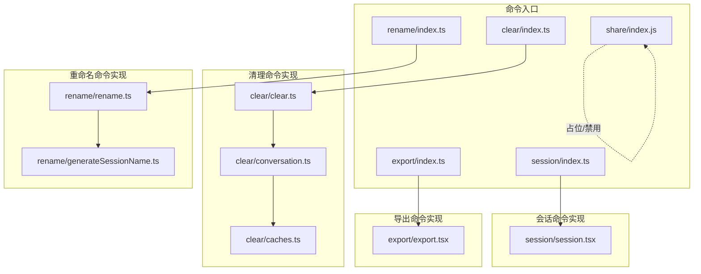
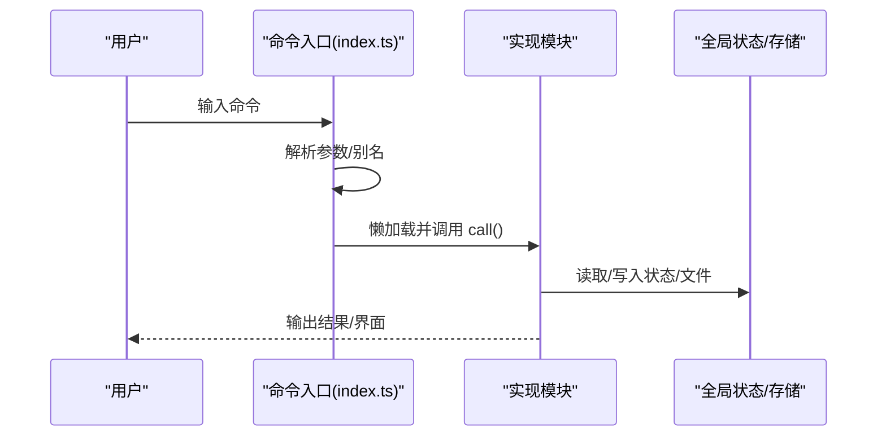
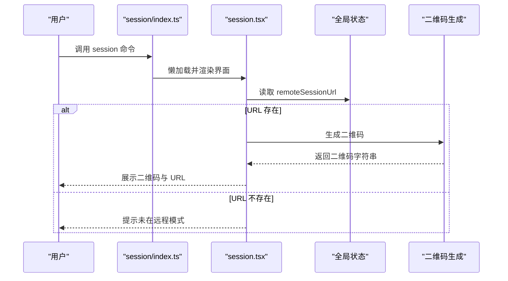
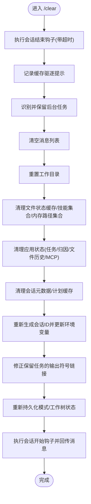
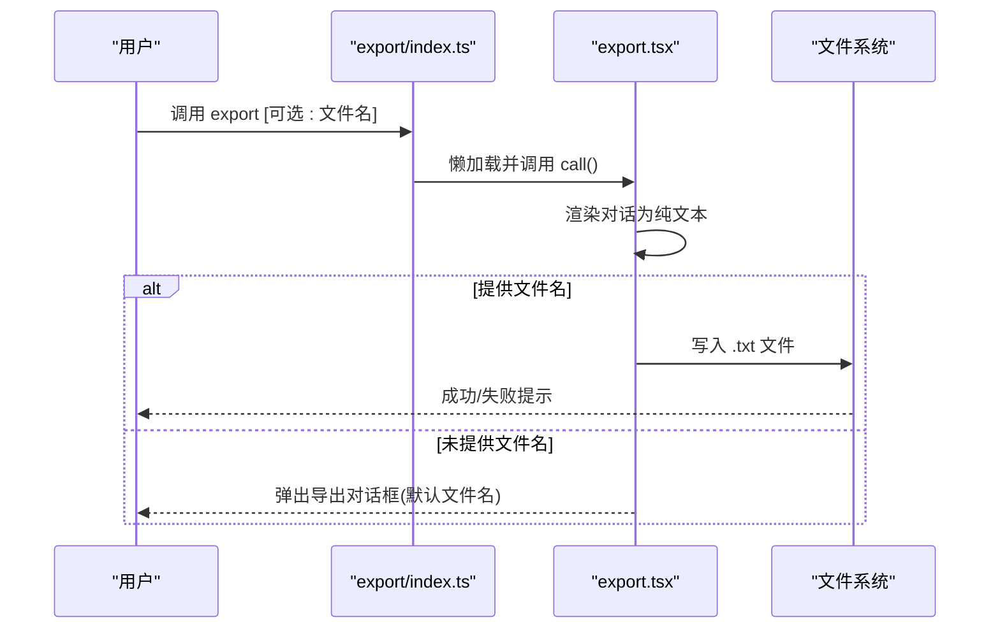
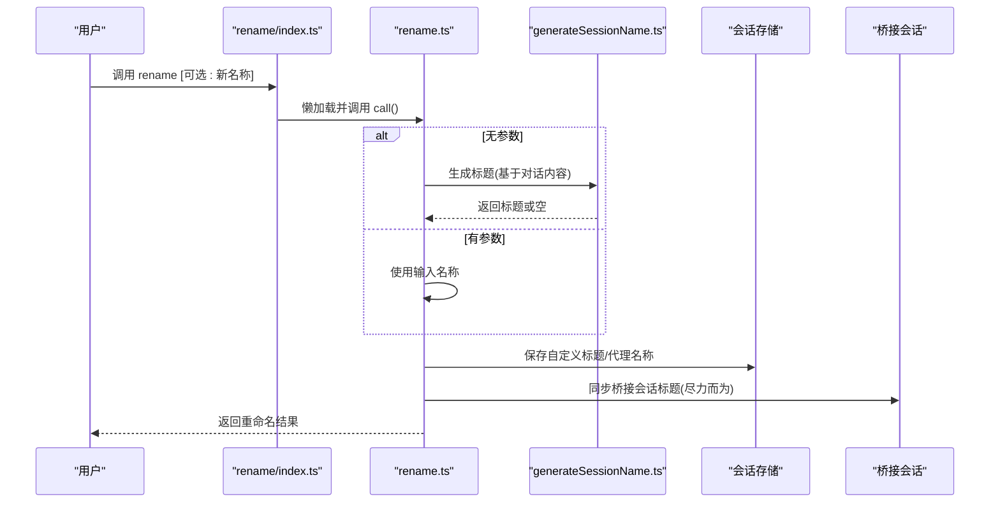
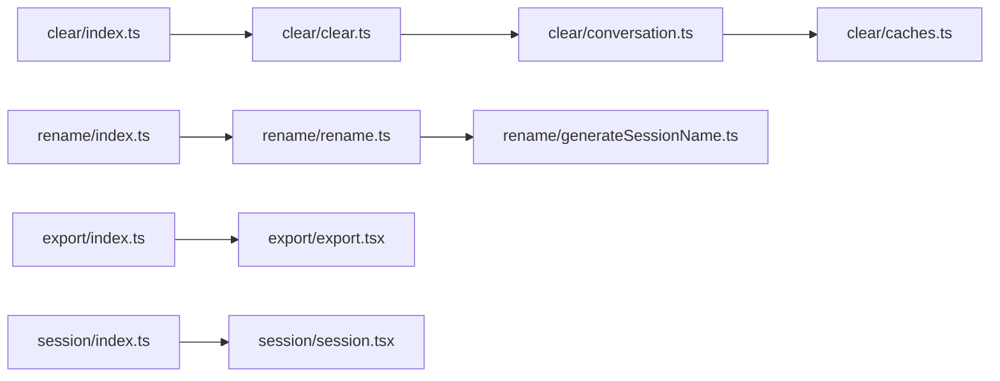

# 会话管理命令

<cite>
**本文引用的文件**
- [src/commands/session/index.ts](file://src/commands/session/index.ts)
- [src/commands/session/session.tsx](file://src/commands/session/session.tsx)
- [src/commands/clear/index.ts](file://src/commands/clear/index.ts)
- [src/commands/clear/clear.ts](file://src/commands/clear/clear.ts)
- [src/commands/clear/conversation.ts](file://src/commands/clear/conversation.ts)
- [src/commands/clear/caches.ts](file://src/commands/clear/caches.ts)
- [src/commands/export/index.ts](file://src/commands/export/index.ts)
- [src/commands/export/export.tsx](file://src/commands/export/export.tsx)
- [src/commands/share/index.js](file://src/commands/share/index.js)
- [src/commands/rename/index.ts](file://src/commands/rename/index.ts)
- [src/commands/rename/rename.ts](file://src/commands/rename/rename.ts)
- [src/commands/rename/generateSessionName.ts](file://src/commands/rename/generateSessionName.ts)
</cite>

## 目录
1. [简介](#简介)
2. [项目结构](#项目结构)
3. [核心组件](#核心组件)
4. [架构总览](#架构总览)
5. [详细组件分析](#详细组件分析)
6. [依赖关系分析](#依赖关系分析)
7. [性能考量](#性能考量)
8. [故障排查指南](#故障排查指南)
9. [结论](#结论)
10. [附录](#附录)

## 简介
本文件系统性梳理与“会话管理”相关的命令：session、clear、export、share、rename。内容涵盖命令入口定义、实现逻辑、数据流、状态管理、持久化策略、权限控制以及最佳实践（组织、备份恢复、协作）。读者无需深入源码即可理解各命令的行为与使用方式。

## 项目结构
围绕会话管理的命令位于 src/commands 下，每个命令以独立子目录组织，并通过 index.ts 暴露命令元信息，具体实现按需懒加载以优化启动时延。会话相关的状态与存储由全局状态与工具函数共同支撑。

图表来源
- [src/commands/session/index.ts:1-17](file://src/commands/session/index.ts#L1-L17)
- [src/commands/session/session.tsx:1-83](file://src/commands/session/session.tsx#L1-L83)
- [src/commands/clear/index.ts:1-20](file://src/commands/clear/index.ts#L1-L20)
- [src/commands/clear/clear.ts:1-8](file://src/commands/clear/clear.ts#L1-L8)
- [src/commands/clear/conversation.ts:1-252](file://src/commands/clear/conversation.ts#L1-L252)
- [src/commands/clear/caches.ts:1-145](file://src/commands/clear/caches.ts#L1-L145)
- [src/commands/export/index.ts:1-12](file://src/commands/export/index.ts#L1-L12)
- [src/commands/export/export.tsx:1-122](file://src/commands/export/export.tsx#L1-L122)
- [src/commands/rename/index.ts:1-13](file://src/commands/rename/index.ts#L1-L13)
- [src/commands/rename/rename.ts:1-88](file://src/commands/rename/rename.ts#L1-L88)
- [src/commands/rename/generateSessionName.ts:1-68](file://src/commands/rename/generateSessionName.ts#L1-L68)
- [src/commands/share/index.js:1-2](file://src/commands/share/index.js#L1-L2)

章节来源
- [src/commands/session/index.ts:1-17](file://src/commands/session/index.ts#L1-L17)
- [src/commands/clear/index.ts:1-20](file://src/commands/clear/index.ts#L1-L20)
- [src/commands/export/index.ts:1-12](file://src/commands/export/index.ts#L1-L12)
- [src/commands/rename/index.ts:1-13](file://src/commands/rename/index.ts#L1-L13)
- [src/commands/share/index.js:1-2](file://src/commands/share/index.js#L1-L2)

## 核心组件
- 会话展示命令（session）
  - 入口：在远程模式下启用，显示远程会话 URL 与二维码，支持键盘快捷键退出。
  - 关键点：仅在远程模式可用；URL 来源于全局应用状态；二维码生成失败不影响 URL 显示。
- 清理会话命令（clear）
  - 入口：描述为“清空对话历史并释放上下文”，别名包括 reset、new。
  - 实现：调用清理对话流程，该流程会执行会话结束钩子、清理缓存、重置会话标识、清理任务与状态等。
- 导出会话命令（export）
  - 入口：描述为“将当前对话导出到文件或剪贴板”，支持可选参数作为文件名。
  - 实现：渲染对话为纯文本；若提供文件名则直接写入；否则弹出对话框选择保存路径与文件名。
- 分享命令（share）
  - 当前为占位实现，处于禁用状态，不提供实际功能。
- 重命名命令（rename）
  - 入口：立即执行，支持可选名称参数；无参数时自动生成标题。
  - 实现：校验非队友身份；保存自定义标题与代理名称；同步桥接会话标题；更新本地状态。

章节来源
- [src/commands/session/session.tsx:1-83](file://src/commands/session/session.tsx#L1-L83)
- [src/commands/clear/index.ts:1-20](file://src/commands/clear/index.ts#L1-L20)
- [src/commands/clear/clear.ts:1-8](file://src/commands/clear/clear.ts#L1-L8)
- [src/commands/export/index.ts:1-12](file://src/commands/export/index.ts#L1-L12)
- [src/commands/export/export.tsx:1-122](file://src/commands/export/export.tsx#L1-L122)
- [src/commands/share/index.js:1-2](file://src/commands/share/index.js#L1-L2)
- [src/commands/rename/index.ts:1-13](file://src/commands/rename/index.ts#L1-L13)
- [src/commands/rename/rename.ts:1-88](file://src/commands/rename/rename.ts#L1-L88)

## 架构总览
会话管理命令遵循统一的命令框架：index.ts 定义命令元信息（类型、名称、别名、是否启用/隐藏、懒加载模块），具体实现按需导入。清理命令进一步细分为“清理对话”和“清理会话缓存”，以最小化对运行时的影响。

图表来源
- [src/commands/session/index.ts:1-17](file://src/commands/session/index.ts#L1-L17)
- [src/commands/session/session.tsx:80-83](file://src/commands/session/session.tsx#L80-L83)
- [src/commands/clear/index.ts:1-20](file://src/commands/clear/index.ts#L1-L20)
- [src/commands/clear/clear.ts:4-7](file://src/commands/clear/clear.ts#L4-L7)
- [src/commands/export/index.ts:1-12](file://src/commands/export/index.ts#L1-L12)
- [src/commands/export/export.tsx:66-121](file://src/commands/export/export.tsx#L66-L121)
- [src/commands/rename/index.ts:1-13](file://src/commands/rename/index.ts#L1-L13)
- [src/commands/rename/rename.ts:21-87](file://src/commands/rename/rename.ts#L21-L87)

## 详细组件分析

### 命令：session
- 功能概述
  - 在远程模式下展示远程会话 URL 与二维码，便于在浏览器中打开。
  - 不在远程模式时提示用户先以远程模式启动。
- 关键实现要点
  - 从全局状态读取远程会话 URL。
  - 异步生成二维码，失败时静默记录调试日志，但仍显示 URL。
  - 支持 ESC 快捷键关闭界面。
- 使用场景
  - 远程协作：在不同设备间共享会话链接。
  - 快速访问：通过二维码快速打开浏览器。

图表来源
- [src/commands/session/index.ts:4-14](file://src/commands/session/index.ts#L4-L14)
- [src/commands/session/session.tsx:14-78](file://src/commands/session/session.tsx#L14-L78)

章节来源
- [src/commands/session/index.ts:1-17](file://src/commands/session/index.ts#L1-L17)
- [src/commands/session/session.tsx:1-83](file://src/commands/session/session.tsx#L1-L83)

### 命令：clear
- 功能概述
  - 清空当前对话历史，释放上下文占用，同时清理相关缓存与状态，生成新的会话 ID。
- 处理流程
  - 执行会话结束钩子（带超时保护）。
  - 记录缓存驱逐提示事件。
  - 识别并保留后台任务，避免影响其继续运行。
  - 清空消息列表、工作目录、文件状态缓存、技能发现集合与内存路径集合。
  - 清理应用状态中的任务、归因、文件历史快照、MCP 状态等。
  - 清理计划缓存、会话元数据，重新生成会话 ID 并更新环境变量。
  - 对保留的本地代理任务修正输出符号链接，确保后续写入正确。
  - 重新持久化模式与工作树状态，执行会话开始钩子并回传提示消息。

图表来源
- [src/commands/clear/conversation.ts:49-251](file://src/commands/clear/conversation.ts#L49-L251)
- [src/commands/clear/clear.ts:4-7](file://src/commands/clear/clear.ts#L4-L7)
- [src/commands/clear/caches.ts:47-144](file://src/commands/clear/caches.ts#L47-L144)

章节来源
- [src/commands/clear/index.ts:1-20](file://src/commands/clear/index.ts#L1-L20)
- [src/commands/clear/clear.ts:1-8](file://src/commands/clear/clear.ts#L1-L8)
- [src/commands/clear/conversation.ts:1-252](file://src/commands/clear/conversation.ts#L1-L252)
- [src/commands/clear/caches.ts:1-145](file://src/commands/clear/caches.ts#L1-L145)

### 命令：export
- 功能概述
  - 将当前对话渲染为纯文本并导出到文件或通过对话框选择保存位置。
- 关键实现要点
  - 若提供文件名参数，则自动补全扩展名为 .txt 并写入当前工作目录。
  - 若未提供参数，则根据首条用户消息提取简短标题并生成默认文件名，随后弹出导出对话框。
  - 文件名清洗规则：去除特殊字符、替换空格为连字符、去除非必要连字符。
- 使用建议
  - 频繁导出：直接指定文件名，避免交互确认。
  - 归档命名：利用默认命名策略，结合时间戳与首条提示词形成可读文件名。

图表来源
- [src/commands/export/index.ts:1-12](file://src/commands/export/index.ts#L1-L12)
- [src/commands/export/export.tsx:66-121](file://src/commands/export/export.tsx#L66-L121)

章节来源
- [src/commands/export/index.ts:1-12](file://src/commands/export/index.ts#L1-L12)
- [src/commands/export/export.tsx:1-122](file://src/commands/export/export.tsx#L1-L122)

### 命令：share
- 功能概述
  - 当前为占位实现，命令被标记为禁用且隐藏，不提供任何功能。
- 后续建议
  - 若未来开放分享能力，应明确分享范围（公开/私有）、权限控制与过期策略，并与会话元数据联动。

章节来源
- [src/commands/share/index.js:1-2](file://src/commands/share/index.js#L1-L2)

### 命令：rename
- 功能概述
  - 重命名当前会话标题；若为队友身份则禁止重命名；支持无参自动生成标题。
- 关键实现要点
  - 校验非队友身份，防止冲突。
  - 无参数时基于压缩边界后的对话内容请求模型生成标题；失败则提示无法生成。
  - 保存自定义标题与代理名称，同步桥接会话标题（尽力而为，非阻塞）。
  - 更新本地状态中的独立代理上下文名称。
- 生成标题策略
  - 从对话中抽取文本，构造系统提示词，要求返回 JSON 包含 name 字段。
  - 解析 JSON 并返回合法字符串；异常时记录调试日志并返回空。

图表来源
- [src/commands/rename/index.ts:3-10](file://src/commands/rename/index.ts#L3-L10)
- [src/commands/rename/rename.ts:21-87](file://src/commands/rename/rename.ts#L21-L87)
- [src/commands/rename/generateSessionName.ts:10-67](file://src/commands/rename/generateSessionName.ts#L10-L67)

章节来源
- [src/commands/rename/index.ts:1-13](file://src/commands/rename/index.ts#L1-L13)
- [src/commands/rename/rename.ts:1-88](file://src/commands/rename/rename.ts#L1-L88)
- [src/commands/rename/generateSessionName.ts:1-68](file://src/commands/rename/generateSessionName.ts#L1-L68)

## 依赖关系分析
- 命令入口与实现
  - 各命令通过 index.ts 的 type 与 load 字段声明运行时类型与懒加载模块，降低启动成本。
- 清理命令的分层
  - clear.ts 仅负责调用清理对话流程；conversation.ts 负责完整的会话清理与状态重置；caches.ts 负责缓存层面的清理，二者解耦。
- 会话状态与存储
  - 会话 ID、远程 URL、桥接会话 ID 等来自全局状态；会话标题、代理名称、转录路径等通过工具函数持久化到文件系统。
- 权限与协作
  - 重命名命令对队友身份进行限制，体现团队协作中的角色分工；清理命令对后台任务进行保留策略，避免破坏协作任务。

图表来源
- [src/commands/clear/index.ts:1-20](file://src/commands/clear/index.ts#L1-L20)
- [src/commands/clear/clear.ts:1-8](file://src/commands/clear/clear.ts#L1-L8)
- [src/commands/clear/conversation.ts:1-252](file://src/commands/clear/conversation.ts#L1-L252)
- [src/commands/clear/caches.ts:1-145](file://src/commands/clear/caches.ts#L1-L145)
- [src/commands/rename/index.ts:1-13](file://src/commands/rename/index.ts#L1-L13)
- [src/commands/rename/rename.ts:1-88](file://src/commands/rename/rename.ts#L1-L88)
- [src/commands/rename/generateSessionName.ts:1-68](file://src/commands/rename/generateSessionName.ts#L1-L68)
- [src/commands/export/index.ts:1-12](file://src/commands/export/index.ts#L1-L12)
- [src/commands/export/export.tsx:1-122](file://src/commands/export/export.tsx#L1-L122)
- [src/commands/session/index.ts:1-17](file://src/commands/session/index.ts#L1-L17)
- [src/commands/session/session.tsx:1-83](file://src/commands/session/session.tsx#L1-L83)

章节来源
- [src/commands/clear/index.ts:1-20](file://src/commands/clear/index.ts#L1-L20)
- [src/commands/clear/clear.ts:1-8](file://src/commands/clear/clear.ts#L1-L8)
- [src/commands/clear/conversation.ts:1-252](file://src/commands/clear/conversation.ts#L1-L252)
- [src/commands/clear/caches.ts:1-145](file://src/commands/clear/caches.ts#L1-L145)
- [src/commands/rename/index.ts:1-13](file://src/commands/rename/index.ts#L1-L13)
- [src/commands/rename/rename.ts:1-88](file://src/commands/rename/rename.ts#L1-L88)
- [src/commands/rename/generateSessionName.ts:1-68](file://src/commands/rename/generateSessionName.ts#L1-L68)
- [src/commands/export/index.ts:1-12](file://src/commands/export/index.ts#L1-L12)
- [src/commands/export/export.tsx:1-122](file://src/commands/export/export.tsx#L1-L122)
- [src/commands/session/index.ts:1-17](file://src/commands/session/index.ts#L1-L17)
- [src/commands/session/session.tsx:1-83](file://src/commands/session/session.tsx#L1-L83)

## 性能考量
- 启动时延优化
  - 命令采用懒加载策略，仅在调用时才加载实现模块，减少主进程初始化开销。
- 清理效率
  - 清理会话时区分“清理对话”与“清理缓存”，优先保留后台任务，避免中断协作任务。
  - 缓存清理覆盖上下文、文件建议、动态技能、LSP 诊断、WebFetch 缓存等多个维度，确保下次会话从干净状态开始。
- 导出性能
  - 导出过程使用纯文本渲染，避免复杂格式导致的额外开销；直接写文件时采用同步写入以保证一致性。
- 二维码生成
  - 二维码生成失败不会阻断命令执行，URL 仍可正常显示，提升用户体验。

## 故障排查指南
- session 命令无响应或显示“不在远程模式”
  - 确认已以远程模式启动；检查全局状态中的远程会话 URL 是否存在。
  - 参考：[src/commands/session/session.tsx:39-49](file://src/commands/session/session.tsx#L39-L49)
- export 命令写入失败
  - 检查目标路径权限与磁盘空间；确认文件名后缀为 .txt；查看错误提示信息。
  - 参考：[src/commands/export/export.tsx:82-94](file://src/commands/export/export.tsx#L82-L94)
- rename 命令提示“无法生成标题”
  - 当前对话上下文不足时会触发；可手动提供新名称；或等待更多对话内容后再尝试自动生成。
  - 参考：[src/commands/rename/rename.ts:41-47](file://src/commands/rename/rename.ts#L41-L47)
- clear 命令中断后台任务
  - 清理流程会保留后台任务；若出现异常，检查任务状态与资源占用情况。
  - 参考：[src/commands/clear/conversation.ts:95-167](file://src/commands/clear/conversation.ts#L95-L167)

章节来源
- [src/commands/session/session.tsx:39-49](file://src/commands/session/session.tsx#L39-L49)
- [src/commands/export/export.tsx:82-94](file://src/commands/export/export.tsx#L82-L94)
- [src/commands/rename/rename.ts:41-47](file://src/commands/rename/rename.ts#L41-L47)
- [src/commands/clear/conversation.ts:95-167](file://src/commands/clear/conversation.ts#L95-L167)

## 结论
会话管理命令围绕“远程会话展示、清理、导出、分享占位、重命名”构建，既满足日常使用，又兼顾协作与性能。通过懒加载与分层清理，系统在保证功能完整性的同时降低了启动与运行时开销。建议在团队协作中配合重命名与导出机制，建立规范的会话命名与归档流程。

## 附录
- 最佳实践
  - 会话组织策略
    - 使用 /rename 为会话设置清晰主题；定期导出重要对话；为长周期任务建立分支式会话。
  - 会话备份与恢复
    - 定期导出对话为 .txt 文件；结合版本控制工具管理会话历史；清理前先导出关键内容。
  - 协作方法
    - 避免在共享会话中频繁重命名；后台任务尽量保留；清理前评估对协作者的影响。
- 相关实现参考
  - 会话状态与存储：[src/commands/clear/conversation.ts:197-208](file://src/commands/clear/conversation.ts#L197-L208)
  - 缓存清理范围：[src/commands/clear/caches.ts:47-144](file://src/commands/clear/caches.ts#L47-L144)
  - 导出文件名生成：[src/commands/export/export.tsx:49-57](file://src/commands/export/export.tsx#L49-L57)
  - 自动生成标题：[src/commands/rename/generateSessionName.ts:10-67](file://src/commands/rename/generateSessionName.ts#L10-L67)