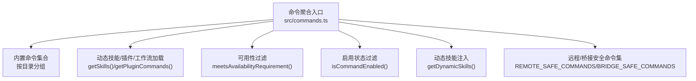
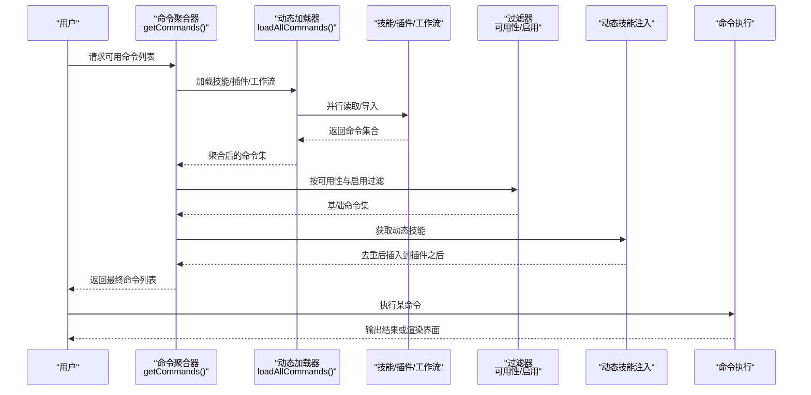
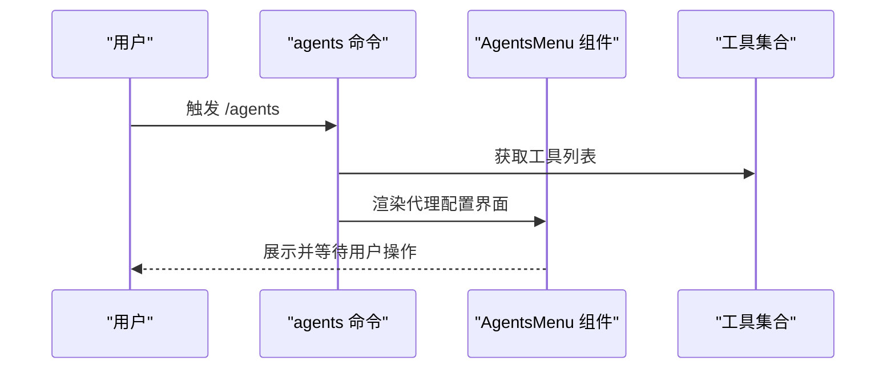
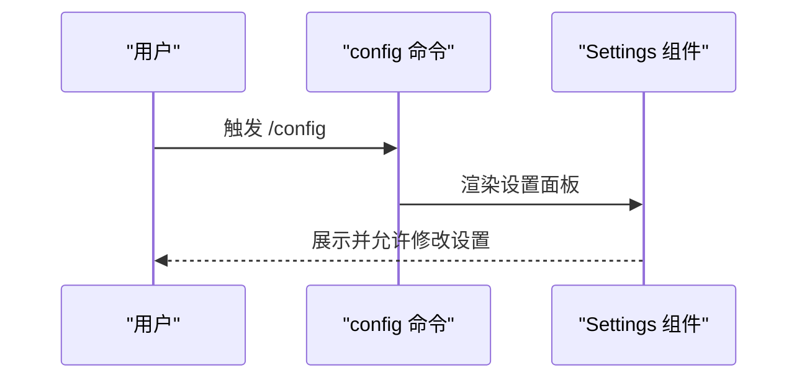
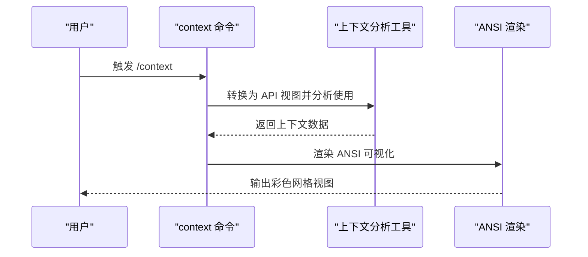
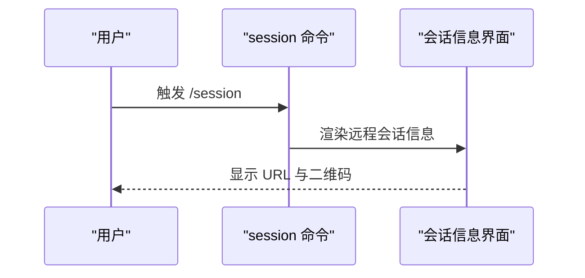
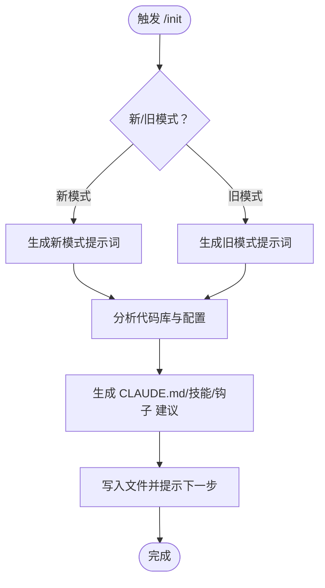
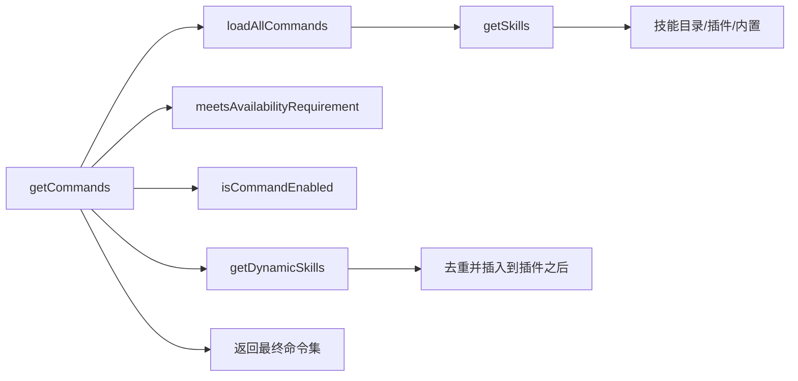

# 内置命令

<cite>
**本文引用的文件**
- [src/commands.ts](file://src/commands.ts)
- [src/commands/init.ts](file://src/commands/init.ts)
- [src/commands/agents/index.ts](file://src/commands/agents/index.ts)
- [src/commands/agents/agents.tsx](file://src/commands/agents/agents.tsx)
- [src/commands/config/index.ts](file://src/commands/config/index.ts)
- [src/commands/config/config.tsx](file://src/commands/config/config.tsx)
- [src/commands/context/index.ts](file://src/commands/context/index.ts)
- [src/commands/context/context.tsx](file://src/commands/context/context.tsx)
- [src/commands/session/index.ts](file://src/commands/session/index.ts)
- [src/commands/skills/index.ts](file://src/commands/skills/index.ts)
- [src/commands/tasks/index.ts](file://src/commands/tasks/index.ts)
</cite>

## 目录
1. [简介](#简介)
2. [项目结构](#项目结构)
3. [核心组件](#核心组件)
4. [架构总览](#架构总览)
5. [详细组件分析](#详细组件分析)
6. [依赖关系分析](#依赖关系分析)
7. [性能考量](#性能考量)
8. [故障排查指南](#故障排查指南)
9. [结论](#结论)
10. [附录](#附录)

## 简介
本文件面向 Claude Code Best 的“内置命令系统”，系统性梳理命令的组织方式、可用性与动态加载机制、执行流程、参数与权限校验、错误处理策略，并给出最佳实践与常见用法。文档覆盖代理管理、配置、上下文可视化、会话远程控制、技能与任务管理等类别，帮助开发者与用户高效理解并正确使用命令体系。

## 项目结构
命令系统的核心入口位于统一导出与聚合模块中，该模块负责：
- 汇聚所有内置命令（含条件特性开关命令）
- 动态加载技能、插件、工作流命令
- 过滤可用命令（按可用性要求与启用状态）
- 提供命令查询、格式化描述、远程/桥接安全过滤等能力

图表来源
- [src/commands.ts:256-519](file://src/commands.ts#L256-L519)

章节来源
- [src/commands.ts:1-757](file://src/commands.ts#L1-L757)

## 核心组件
- 命令类型与元数据
  - 每个命令对象包含名称、别名、描述、类型（prompt/local/local-jsx）、是否启用、可用性要求、来源标记、加载方式等字段。
  - 类型决定命令在不同运行环境中的行为：prompt 型可被模型调用；local 型在本地终端执行；local-jsx 型渲染 Ink UI。
- 命令可用性与启用
  - 可用性要求：如 Claude.ai 订阅者、Console 直连第一方服务等，通过认证与服务提供商判断。
  - 启用状态：由全局开关与命令自身 isEnabled 判定。
- 动态加载与缓存
  - 技能目录、插件、工作流命令通过异步加载并缓存，避免重复 I/O。
  - 命令列表也做缓存，支持清理以响应动态技能变更。
- 远程/桥接安全
  - 对远端模式与移动端桥接进行命令白名单过滤，确保仅允许安全命令执行。

章节来源
- [src/commands.ts:208-223](file://src/commands.ts#L208-L223)
- [src/commands.ts:419-445](file://src/commands.ts#L419-L445)
- [src/commands.ts:478-519](file://src/commands.ts#L478-L519)
- [src/commands.ts:621-678](file://src/commands.ts#L621-L678)

## 架构总览
下图展示命令系统从“发现—过滤—执行”的整体流程，以及动态技能注入点：

图表来源
- [src/commands.ts:451-519](file://src/commands.ts#L451-L519)
- [src/commands.ts:565-610](file://src/commands.ts#L565-L610)

## 详细组件分析

### 代理管理命令：agents
- 功能概述
  - 打开代理配置与管理界面，允许用户选择工具、权限上下文等。
- 执行流程
  - 通过 JSX 命令渲染代理菜单，传入当前工具集合与退出回调。
- 参数与权限
  - 无显式参数；需要具备工具权限上下文访问能力。
- 错误处理
  - 渲染层异常交由上层 UI 捕获；命令本身不抛出业务异常。
- 最佳实践
  - 在复杂项目中建议先通过此命令确认工具与权限范围再发起任务。

图表来源
- [src/commands/agents/index.ts:3-8](file://src/commands/agents/index.ts#L3-L8)
- [src/commands/agents/agents.tsx:7-16](file://src/commands/agents/agents.tsx#L7-L16)

章节来源
- [src/commands/agents/index.ts:1-11](file://src/commands/agents/index.ts#L1-L11)
- [src/commands/agents/agents.tsx:1-17](file://src/commands/agents/agents.tsx#L1-L17)

### 配置命令：config
- 功能概述
  - 打开配置面板，默认聚焦“Config”标签页，便于调整设置。
- 执行流程
  - JSX 命令直接渲染设置组件并绑定关闭回调。
- 参数与权限
  - 无显式参数；需具备应用状态访问能力。
- 错误处理
  - 设置组件内部处理校验与错误提示。
- 最佳实践
  - 将常用设置项集中在此面板调整，避免分散配置。

图表来源
- [src/commands/config/index.ts:3-9](file://src/commands/config/index.ts#L3-L9)
- [src/commands/config/config.tsx:5-7](file://src/commands/config/config.tsx#L5-L7)

章节来源
- [src/commands/config/index.ts:1-12](file://src/commands/config/index.ts#L1-L12)
- [src/commands/config/config.tsx:1-8](file://src/commands/config/config.tsx#L1-L8)

### 上下文管理命令：context
- 功能概述
  - 可视化当前对话上下文占用情况，支持交互式网格视图。
  - 提供非交互版本用于非交互会话。
- 执行流程
  - 将消息经微压缩与项目折叠转换为 API 视图，计算上下文使用并渲染 ANSI 可视化，回传给调用方。
- 参数与权限
  - 无显式参数；需要消息历史、模型信息、工具权限上下文、代理定义等。
- 错误处理
  - 若上下文分析失败，返回空输出或错误提示；命令层不抛出异常。
- 最佳实践
  - 在长对话前使用该命令评估上下文占用，必要时执行压缩或清理。

图表来源
- [src/commands/context/index.ts:4-24](file://src/commands/context/index.ts#L4-L24)
- [src/commands/context/context.tsx:30-68](file://src/commands/context/context.tsx#L30-L68)

章节来源
- [src/commands/context/index.ts:1-25](file://src/commands/context/index.ts#L1-L25)
- [src/commands/context/context.tsx:1-69](file://src/commands/context/context.tsx#L1-L69)

### 会话管理命令：session
- 功能概述
  - 在远程模式下显示远程会话 URL 与二维码，便于移动端/网页端接入。
- 执行流程
  - 条件启用：仅在远程模式下可见与可用；渲染会话信息界面。
- 参数与权限
  - 无显式参数；需要远程模式状态。
- 错误处理
  - 未启用时隐藏命令；渲染层处理不可用场景。
- 最佳实践
  - 在跨设备协作时优先使用该命令生成的链接快速建立会话。

图表来源
- [src/commands/session/index.ts:4-14](file://src/commands/session/index.ts#L4-L14)

章节来源
- [src/commands/session/index.ts:1-17](file://src/commands/session/index.ts#L1-L17)

### 技能命令：skills
- 功能概述
  - 列出当前可用的技能（含内置、插件、动态技能）。
- 执行流程
  - 作为本地 JSX 命令渲染技能列表界面。
- 参数与权限
  - 无显式参数；需要应用状态与技能索引。
- 错误处理
  - 技能加载失败时返回空列表，不影响其他命令。
- 最佳实践
  - 使用该命令快速定位可调用技能，结合 /help 查看技能描述。

章节来源
- [src/commands/skills/index.ts:1-11](file://src/commands/skills/index.ts#L1-L11)

### 任务管理命令：tasks
- 功能概述
  - 列出并管理后台任务（如脚本、监控等）。
- 执行流程
  - 作为本地 JSX 命令渲染任务管理界面。
- 参数与权限
  - 无显式参数；需要任务状态与调度上下文。
- 错误处理
  - 任务异常在界面内提示；命令层不抛出异常。
- 最佳实践
  - 定期检查任务队列，及时清理已完成或失败的任务。

章节来源
- [src/commands/tasks/index.ts:1-12](file://src/commands/tasks/index.ts#L1-L12)

### 初始化命令：init
- 功能概述
  - 生成/更新 CLAUDE.md 与可选的技能与钩子，提供项目级与个人级指引。
- 执行流程
  - 根据新旧模式生成不同提示词，引导用户完成项目初始化。
- 参数与权限
  - 无显式参数；需要项目根目录与环境变量控制。
- 错误处理
  - 失败时记录日志并提示用户重新尝试。
- 最佳实践
  - 新项目首次接入时运行该命令，形成团队共享与个人偏好两套指引。

图表来源
- [src/commands/init.ts:226-257](file://src/commands/init.ts#L226-L257)

章节来源
- [src/commands/init.ts:1-257](file://src/commands/init.ts#L1-L257)

## 依赖关系分析
- 命令聚合与过滤
  - getCommands 调用 loadAllCommands 并结合 meetsAvailabilityRequirement 与 isCommandEnabled 进行过滤。
  - getSkills 并行加载技能目录、插件技能与内置技能，失败时降级返回空数组。
- 动态注入
  - getDynamicSkills 提供运行时发现的技能，去重后插入到插件命令之后。
- 远程/桥接安全
  - REMOTE_SAFE_COMMANDS 与 BRIDGE_SAFE_COMMANDS 限定远端可执行命令集。

图表来源
- [src/commands.ts:478-519](file://src/commands.ts#L478-L519)
- [src/commands.ts:451-471](file://src/commands.ts#L451-L471)
- [src/commands.ts:355-400](file://src/commands.ts#L355-L400)

章节来源
- [src/commands.ts:419-445](file://src/commands.ts#L419-L445)
- [src/commands.ts:478-519](file://src/commands.ts#L478-L519)

## 性能考量
- 缓存策略
  - 命令列表与技能加载均采用 memoize 缓存，减少重复 I/O 与动态导入成本。
- 并行加载
  - 技能目录、插件技能、工作流命令采用 Promise.all 并行加载，缩短启动时间。
- 动态注入位置
  - 动态技能插入到插件命令之后，避免影响内置命令顺序，同时保持加载顺序稳定。
- 远端预过滤
  - 在 REPL 渲染前对命令进行远端安全过滤，避免短暂暴露本地命令。

章节来源
- [src/commands.ts:170-170](file://src/commands.ts#L170-L170)
- [src/commands.ts:451-471](file://src/commands.ts#L451-L471)
- [src/commands.ts:686-688](file://src/commands.ts#L686-L688)

## 故障排查指南
- 命令找不到
  - 使用 getCommand 时若命令不存在，会抛出参考错误并列出可用命令清单（含别名），便于快速定位。
- 技能加载失败
  - getSkills 对各来源分别捕获错误并记录调试日志，返回空数组继续运行，避免阻断主流程。
- 远端/桥接不可用
  - 使用 isBridgeSafeCommand 判断命令是否可在移动端/网页端执行；不在白名单的命令会被阻止。
- 可用性限制
  - meetsAvailabilityRequirement 会根据认证与服务提供商状态隐藏/显示命令，登录或切换账户后需刷新命令列表。

章节来源
- [src/commands.ts:706-721](file://src/commands.ts#L706-L721)
- [src/commands.ts:362-399](file://src/commands.ts#L362-L399)
- [src/commands.ts:674-678](file://src/commands.ts#L674-L678)
- [src/commands.ts:419-445](file://src/commands.ts#L419-L445)

## 结论
内置命令系统通过统一的命令元数据、可用性与启用过滤、动态加载与缓存、以及远程/桥接安全策略，实现了高扩展、低耦合且安全可控的命令生态。配合 /init 等引导类命令，能够帮助团队快速建立一致的开发与协作规范。

## 附录
- 命令分类速览
  - 代理管理：agents
  - 配置：config
  - 上下文：context（含非交互版本）
  - 会话：session（远程模式）
  - 技能：skills
  - 任务：tasks
  - 初始化：init

章节来源
- [src/commands.ts:258-348](file://src/commands.ts#L258-L348)
- [src/commands.ts:478-519](file://src/commands.ts#L478-L519)