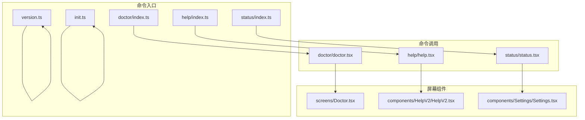
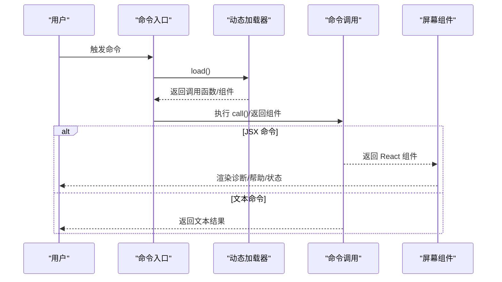
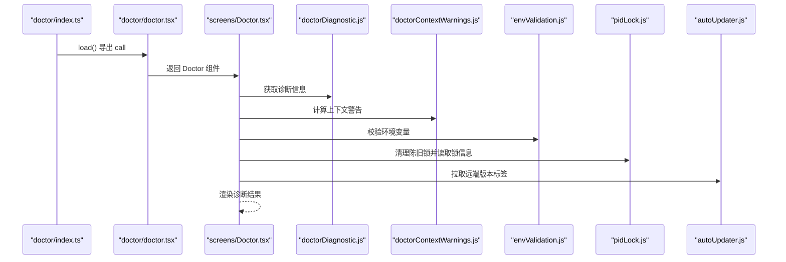
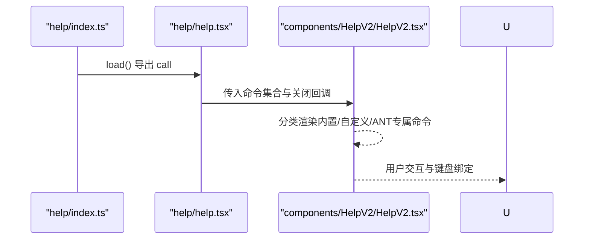
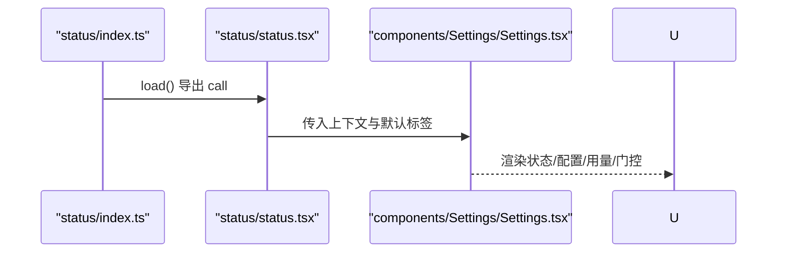
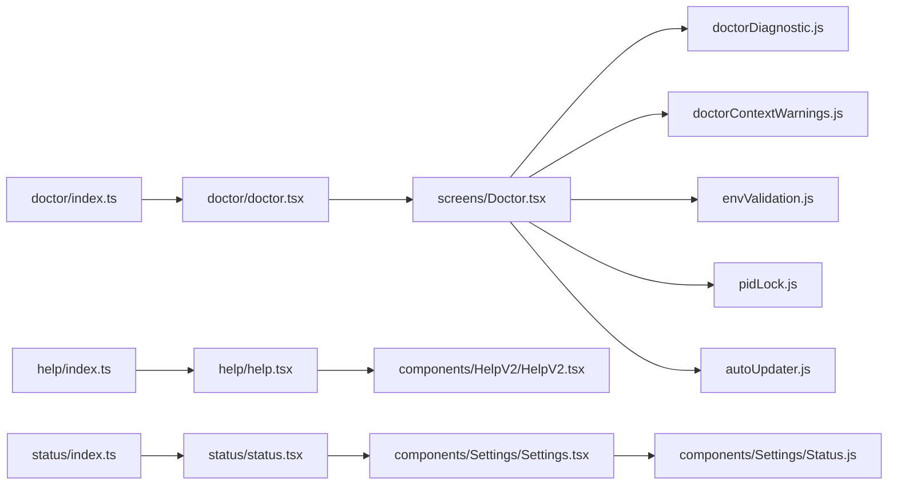

# 实用工具命令

<cite>
**本文引用的文件**
- [src/commands/doctor/index.ts](file://src/commands/doctor/index.ts)
- [src/commands/doctor/doctor.tsx](file://src/commands/doctor/doctor.tsx)
- [src/screens/Doctor.tsx](file://src/screens/Doctor.tsx)
- [src/utils/doctorDiagnostic.js](file://src/utils/doctorDiagnostic.js)
- [src/utils/doctorContextWarnings.js](file://src/utils/doctorContextWarnings.js)
- [src/utils/envValidation.js](file://src/utils/envValidation.js)
- [src/utils/nativeInstaller/pidLock.js](file://src/utils/nativeInstaller/pidLock.js)
- [src/utils/autoUpdater.js](file://src/utils/autoUpdater.js)
- [src/commands/help/index.ts](file://src/commands/help/index.ts)
- [src/commands/help/help.tsx](file://src/commands/help/help.tsx)
- [src/components/HelpV2/HelpV2.tsx](file://src/components/HelpV2/HelpV2.tsx)
- [src/commands/status/index.ts](file://src/commands/status/index.ts)
- [src/commands/status/status.tsx](file://src/commands/status/status.tsx)
- [src/components/Settings/Settings.tsx](file://src/components/Settings/Settings.tsx)
- [src/components/Settings/Status.js](file://src/components/Settings/Status.js)
- [src/commands/version.ts](file://src/commands/version.ts)
- [src/commands/init.ts](file://src/commands/init.ts)
</cite>

## 目录
1. [简介](#简介)
2. [项目结构](#项目结构)
3. [核心组件](#核心组件)
4. [架构总览](#架构总览)
5. [详细组件分析](#详细组件分析)
6. [依赖关系分析](#依赖关系分析)
7. [性能考量](#性能考量)
8. [故障排除指南](#故障排除指南)
9. [结论](#结论)
10. [附录](#附录)

## 简介
本文件面向实用工具类命令，系统性梳理诊断工具、帮助系统、版本信息、初始化与状态查询等命令的实现细节与使用方法。内容覆盖：
- doctor：系统诊断与健康检查，输出安装类型、包管理器、搜索能力、更新权限、环境变量、版本锁、代理/插件错误、上下文使用警告等
- help：命令与帮助界面，按内置/自定义/ANT专属分类展示命令列表
- version：打印当前运行版本（支持构建时间）
- init：引导式初始化 CLAUDE.md、个人偏好 CLAUDE.local.md、技能与钩子，并给出优化建议
- status：系统状态面板，包含版本、模型、账户、API 连通性、工具状态等

## 项目结构
实用工具命令均以“命令入口 + JSX 调用 + 屏幕组件”的模式组织，遵循统一的命令注册与加载机制。

图表来源
- [src/commands/doctor/index.ts:1-13](file://src/commands/doctor/index.ts#L1-L13)
- [src/commands/doctor/doctor.tsx:1-8](file://src/commands/doctor/doctor.tsx#L1-L8)
- [src/screens/Doctor.tsx:1-517](file://src/screens/Doctor.tsx#L1-L517)
- [src/commands/help/index.ts:1-11](file://src/commands/help/index.ts#L1-L11)
- [src/commands/help/help.tsx:1-11](file://src/commands/help/help.tsx#L1-L11)
- [src/components/HelpV2/HelpV2.tsx:1-139](file://src/components/HelpV2/HelpV2.tsx#L1-L139)
- [src/commands/status/index.ts:1-13](file://src/commands/status/index.ts#L1-L13)
- [src/commands/status/status.tsx:1-12](file://src/commands/status/status.tsx#L1-L12)
- [src/components/Settings/Settings.tsx:1-137](file://src/components/Settings/Settings.tsx#L1-L137)
- [src/commands/version.ts:1-23](file://src/commands/version.ts#L1-L23)
- [src/commands/init.ts:1-257](file://src/commands/init.ts#L1-L257)

章节来源
- [src/commands/doctor/index.ts:1-13](file://src/commands/doctor/index.ts#L1-L13)
- [src/commands/doctor/doctor.tsx:1-8](file://src/commands/doctor/doctor.tsx#L1-L8)
- [src/screens/Doctor.tsx:103-517](file://src/screens/Doctor.tsx#L103-L517)
- [src/commands/help/index.ts:1-11](file://src/commands/help/index.ts#L1-L11)
- [src/commands/help/help.tsx:1-11](file://src/commands/help/help.tsx#L1-L11)
- [src/components/HelpV2/HelpV2.tsx:27-139](file://src/components/HelpV2/HelpV2.tsx#L27-L139)
- [src/commands/status/index.ts:1-13](file://src/commands/status/index.ts#L1-L13)
- [src/commands/status/status.tsx:1-12](file://src/commands/status/status.tsx#L1-L12)
- [src/components/Settings/Settings.tsx:30-137](file://src/components/Settings/Settings.tsx#L30-L137)
- [src/commands/version.ts:1-23](file://src/commands/version.ts#L1-L23)
- [src/commands/init.ts:226-257](file://src/commands/init.ts#L226-L257)

## 核心组件
- doctor 命令
  - 入口：注册为本地 JSX 命令，可启用/禁用
  - 调用：返回 Doctor 屏幕组件，用于渲染诊断结果
  - 诊断数据：通过诊断工具聚合安装信息、包管理器、搜索能力、更新通道、环境变量、版本锁、上下文警告、插件错误等
- help 命令
  - 入口：注册为本地 JSX 命令
  - 调用：返回 HelpV2 组件，按内置/自定义/ANT专属分页显示命令
- status 命令
  - 入口：注册为本地 JSX 命令（立即执行）
  - 调用：返回 Settings 组件，默认打开“状态”标签
- version 命令
  - 入口：本地命令，仅在特定用户类型下可用
  - 行为：返回文本型结果，包含版本号与构建时间（若存在）
- init 命令
  - 入口：提示型命令，支持新旧两种初始化流程
  - 行为：引导用户选择生成范围与产物类型，扫描代码库并产出 CLAUDE.md、个人偏好、技能与钩子建议

章节来源
- [src/commands/doctor/index.ts:4-12](file://src/commands/doctor/index.ts#L4-L12)
- [src/commands/doctor/doctor.tsx:5-7](file://src/commands/doctor/doctor.tsx#L5-L7)
- [src/screens/Doctor.tsx:103-517](file://src/screens/Doctor.tsx#L103-L517)
- [src/commands/help/index.ts:3-10](file://src/commands/help/index.ts#L3-L10)
- [src/commands/help/help.tsx:5-10](file://src/commands/help/help.tsx#L5-L10)
- [src/components/HelpV2/HelpV2.tsx:27-139](file://src/components/HelpV2/HelpV2.tsx#L27-L139)
- [src/commands/status/index.ts:3-10](file://src/commands/status/index.ts#L3-L10)
- [src/commands/status/status.tsx:6-11](file://src/commands/status/status.tsx#L6-L11)
- [src/components/Settings/Settings.tsx:30-137](file://src/components/Settings/Settings.tsx#L30-L137)
- [src/commands/version.ts:3-20](file://src/commands/version.ts#L3-L20)
- [src/commands/init.ts:226-257](file://src/commands/init.ts#L226-L257)

## 架构总览
实用工具命令采用“命令注册 -> 动态加载 -> JSX 渲染 -> 屏幕组件”的统一路径；Doctor 与 Help/Status 作为终端内嵌 UI 的代表，复用 Ink 组件与键位绑定，提供一致的交互体验。

图表来源
- [src/commands/doctor/index.ts:9-10](file://src/commands/doctor/index.ts#L9-L10)
- [src/commands/doctor/doctor.tsx:5-7](file://src/commands/doctor/doctor.tsx#L5-L7)
- [src/commands/help/index.ts:7-8](file://src/commands/help/index.ts#L7-L8)
- [src/commands/help/help.tsx:5-10](file://src/commands/help/help.tsx#L5-L10)
- [src/commands/status/index.ts:9-10](file://src/commands/status/index.ts#L9-L10)
- [src/commands/status/status.tsx:6-11](file://src/commands/status/status.tsx#L6-L11)
- [src/commands/version.ts:3-10](file://src/commands/version.ts#L3-L10)

## 详细组件分析

### doctor 诊断命令
- 功能要点
  - 安装与运行信息：安装类型、版本、包管理器、路径、二进制、配置安装方式
  - 搜索能力：ripgrep 工作状态与模式（bundled/vendor/system）
  - 更新与权限：自动更新策略、更新权限、渠道、远端版本标签
  - 配置与警告：无效设置、配置警告、多实例检测
  - 环境变量校验：对输出长度上限等进行边界验证
  - 版本锁：基于 PID 的版本锁清理与状态
  - 上下文使用警告：CLAUDE.md、Agent、MCP 使用情况
  - 插件错误：插件加载/运行期错误汇总
- 关键数据流
  - 初始化时异步获取诊断信息与上下文警告
  - 通过 Suspense 渲染远端版本标签
  - 支持清理陈旧锁并统计清理数量
- 交互与退出
  - 键位绑定支持确认/取消，Enter/Esc/Ctrl+C 可关闭

图表来源
- [src/commands/doctor/index.ts:4-12](file://src/commands/doctor/index.ts#L4-L12)
- [src/commands/doctor/doctor.tsx:5-7](file://src/commands/doctor/doctor.tsx#L5-L7)
- [src/screens/Doctor.tsx:103-517](file://src/screens/Doctor.tsx#L103-L517)
- [src/utils/doctorDiagnostic.js](file://src/utils/doctorDiagnostic.js)
- [src/utils/doctorContextWarnings.js](file://src/utils/doctorContextWarnings.js)
- [src/utils/envValidation.js](file://src/utils/envValidation.js)
- [src/utils/nativeInstaller/pidLock.js](file://src/utils/nativeInstaller/pidLock.js)
- [src/utils/autoUpdater.js](file://src/utils/autoUpdater.js)

章节来源
- [src/commands/doctor/index.ts:4-12](file://src/commands/doctor/index.ts#L4-L12)
- [src/commands/doctor/doctor.tsx:5-7](file://src/commands/doctor/doctor.tsx#L5-L7)
- [src/screens/Doctor.tsx:103-517](file://src/screens/Doctor.tsx#L103-L517)

### help 帮助命令
- 功能要点
  - 分类展示：内置命令、自定义命令、ANT专属命令（按用户类型过滤）
  - 交互体验：支持键盘快捷键、模态/终端尺寸适配、标签页切换
  - 内容组织：通用信息与命令列表分离，便于导航
- 关键行为
  - 根据用户类型动态裁剪内部专用命令
  - 提供“ESC 取消”与二次确认退出提示

图表来源
- [src/commands/help/index.ts:3-10](file://src/commands/help/index.ts#L3-L10)
- [src/commands/help/help.tsx:5-10](file://src/commands/help/help.tsx#L5-L10)
- [src/components/HelpV2/HelpV2.tsx:27-139](file://src/components/HelpV2/HelpV2.tsx#L27-L139)

章节来源
- [src/commands/help/index.ts:3-10](file://src/commands/help/index.ts#L3-L10)
- [src/commands/help/help.tsx:5-10](file://src/commands/help/help.tsx#L5-L10)
- [src/components/HelpV2/HelpV2.tsx:27-139](file://src/components/HelpV2/HelpV2.tsx#L27-L139)

### status 状态命令
- 功能要点
  - 默认打开“状态”标签，展示版本、模型、账户、API 连通性、工具状态等
  - 支持在设置面板中切换到“配置/用量/门控”等标签
- 关键行为
  - 立即执行的本地 JSX 命令，直接渲染 Settings 组件

图表来源
- [src/commands/status/index.ts:3-10](file://src/commands/status/index.ts#L3-L10)
- [src/commands/status/status.tsx:6-11](file://src/commands/status/status.tsx#L6-L11)
- [src/components/Settings/Settings.tsx:30-137](file://src/components/Settings/Settings.tsx#L30-L137)

章节来源
- [src/commands/status/index.ts:3-10](file://src/commands/status/index.ts#L3-L10)
- [src/commands/status/status.tsx:6-11](file://src/commands/status/status.tsx#L6-L11)
- [src/components/Settings/Settings.tsx:30-137](file://src/components/Settings/Settings.tsx#L30-L137)

### version 版本命令
- 功能要点
  - 返回当前会话运行的版本信息
  - 若存在构建时间宏，则一并显示
  - 仅在特定用户类型下可用
- 关键行为
  - 文本型命令结果，适合非交互场景

章节来源
- [src/commands/version.ts:3-20](file://src/commands/version.ts#L3-L20)

### init 初始化命令
- 功能要点
  - 新流程：引导用户选择生成范围（项目/个人/两者）、是否生成技能与钩子
  - 扫描代码库：构建、测试、格式化、语言/框架、工作树、规则文件等
  - 产出建议：最小化的 CLAUDE.md、CLAUDE.local.md、技能与钩子清单
  - 优化建议：GitHub CLI、静态检查、钩子落地位置与事件匹配
- 关键行为
  - 提示型命令，支持动态内容与进度提示
  - 根据特性开关与用户类型决定描述文案

章节来源
- [src/commands/init.ts:226-257](file://src/commands/init.ts#L226-L257)

## 依赖关系分析
- 命令注册与加载
  - 各命令通过入口文件导出 Command 对象，包含名称、描述、类型、启用条件与动态加载函数
  - doctor/help/status 为本地 JSX 命令，返回 React 组件；version 为本地文本命令；init 为提示型命令
- Doctor 诊断数据来源
  - 诊断信息、上下文警告、环境变量校验、版本锁、远端版本标签等由各自工具模块提供
- Help/Settings 依赖
  - HelpV2 依赖命令集合与终端尺寸、键位显示、模态上下文
  - Settings 依赖状态诊断构建、键位绑定与内容高度计算

图表来源
- [src/commands/doctor/index.ts:1-13](file://src/commands/doctor/index.ts#L1-L13)
- [src/commands/doctor/doctor.tsx:1-8](file://src/commands/doctor/doctor.tsx#L1-L8)
- [src/screens/Doctor.tsx:1-517](file://src/screens/Doctor.tsx#L1-L517)
- [src/utils/doctorDiagnostic.js](file://src/utils/doctorDiagnostic.js)
- [src/utils/doctorContextWarnings.js](file://src/utils/doctorContextWarnings.js)
- [src/utils/envValidation.js](file://src/utils/envValidation.js)
- [src/utils/nativeInstaller/pidLock.js](file://src/utils/nativeInstaller/pidLock.js)
- [src/utils/autoUpdater.js](file://src/utils/autoUpdater.js)
- [src/commands/help/index.ts:1-11](file://src/commands/help/index.ts#L1-L11)
- [src/commands/help/help.tsx:1-11](file://src/commands/help/help.tsx#L1-L11)
- [src/components/HelpV2/HelpV2.tsx:1-139](file://src/components/HelpV2/HelpV2.tsx#L1-L139)
- [src/commands/status/index.ts:1-13](file://src/commands/status/index.ts#L1-L13)
- [src/commands/status/status.tsx:1-12](file://src/commands/status/status.tsx#L1-L12)
- [src/components/Settings/Settings.tsx:1-137](file://src/components/Settings/Settings.tsx#L1-L137)
- [src/components/Settings/Status.js](file://src/components/Settings/Status.js)

章节来源
- [src/commands/doctor/index.ts:1-13](file://src/commands/doctor/index.ts#L1-L13)
- [src/commands/doctor/doctor.tsx:1-8](file://src/commands/doctor/doctor.tsx#L1-L8)
- [src/screens/Doctor.tsx:1-517](file://src/screens/Doctor.tsx#L1-L517)
- [src/commands/help/index.ts:1-11](file://src/commands/help/index.ts#L1-L11)
- [src/commands/help/help.tsx:1-11](file://src/commands/help/help.tsx#L1-L11)
- [src/components/HelpV2/HelpV2.tsx:1-139](file://src/components/HelpV2/HelpV2.tsx#L1-L139)
- [src/commands/status/index.ts:1-13](file://src/commands/status/index.ts#L1-L13)
- [src/commands/status/status.tsx:1-12](file://src/commands/status/status.tsx#L1-L12)
- [src/components/Settings/Settings.tsx:1-137](file://src/components/Settings/Settings.tsx#L1-L137)

## 性能考量
- Doctor 诊断
  - 异步拉取诊断与上下文警告，避免阻塞 UI
  - 远端版本标签使用 Suspense，减少重复请求
  - 环境变量校验批量执行，避免多次解析
- Help/Settings
  - 终端尺寸与模态上下文动态适配，控制内容高度，减少重排
  - 状态诊断一次性构建并缓存，避免频繁刷新
- init 流程
  - 分阶段提示与可选产物，降低一次性负载
  - 通过 AskUserQuestion 与子代理探索代码库，避免全量扫描

## 故障排除指南
- doctor 常见问题
  - 多实例安装：检测到多个安装路径时，建议统一或清理冗余
  - 配置警告：根据修复建议调整配置项
  - 环境变量异常：检查输出长度上限等变量是否越界或被错误覆盖
  - 版本锁冲突：查看并清理陈旧锁，确保进程状态一致
  - 插件错误：定位具体插件源与错误消息，必要时回滚或禁用
  - 上下文使用警告：关注 CLAUDE.md、Agent、MCP 的使用情况，避免未生效规则
- help 常见问题
  - 命令不可见：确认用户类型与隐藏/内部命令过滤逻辑
  - 键盘快捷键冲突：检查键位绑定与当前上下文
- status 常见问题
  - 状态不更新：确认诊断构建已触发且未被 Tab 切换导致卸载
  - 权限受限：在“门控”标签检查相关策略
- version/init
  - init 未生成预期产物：检查用户选择与扫描结果，重新运行
  - version 不显示构建时间：确认构建时宏是否注入

章节来源
- [src/screens/Doctor.tsx:289-509](file://src/screens/Doctor.tsx#L289-L509)
- [src/components/HelpV2/HelpV2.tsx:40-104](file://src/components/HelpV2/HelpV2.tsx#L40-L104)
- [src/components/Settings/Settings.tsx:58-60](file://src/components/Settings/Settings.tsx#L58-L60)

## 结论
实用工具命令围绕“诊断—帮助—状态—版本—初始化”形成闭环，既满足日常运维与排障需求，又提供友好的交互体验。通过模块化与延迟加载，系统在保证功能完整性的同时兼顾性能与可维护性。

## 附录
- 使用建议
  - 定期运行 doctor 以发现配置与环境问题
  - 使用 help 快速浏览命令与快捷键
  - 通过 status 快速核对版本、模型与连接状态
  - 在新项目或变更后运行 init 生成/更新 CLAUDE.md 与技能
- 维护建议
  - 保持环境变量边界合理，避免过长输出引发性能问题
  - 定期清理陈旧版本锁，避免误判
  - 关注上下文使用警告，确保规则有效
- 性能监控
  - 利用 Settings 中的用量与状态标签观察资源占用
  - 通过 doctor 的更新与权限信息评估升级策略