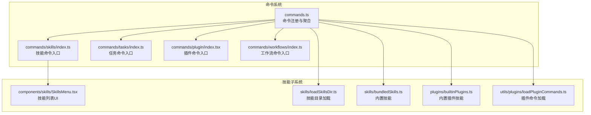
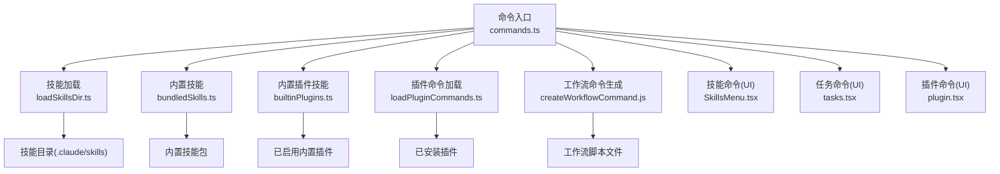
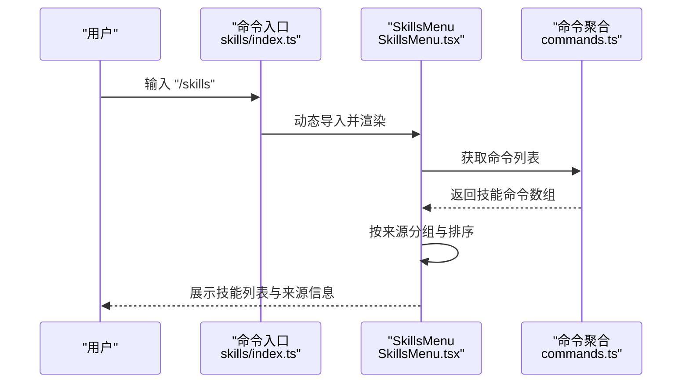
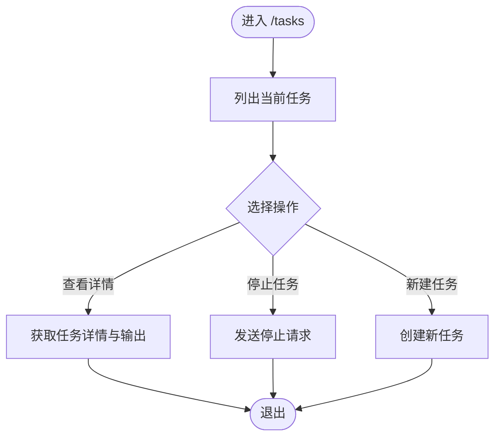
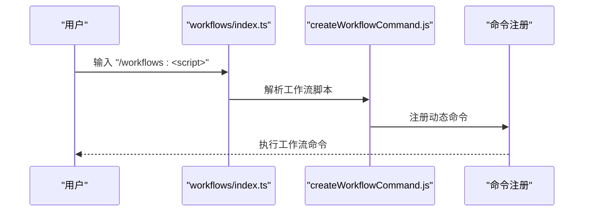
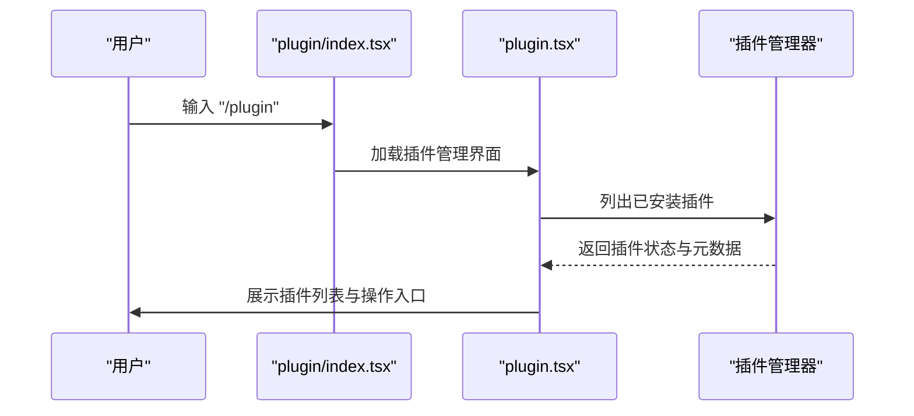
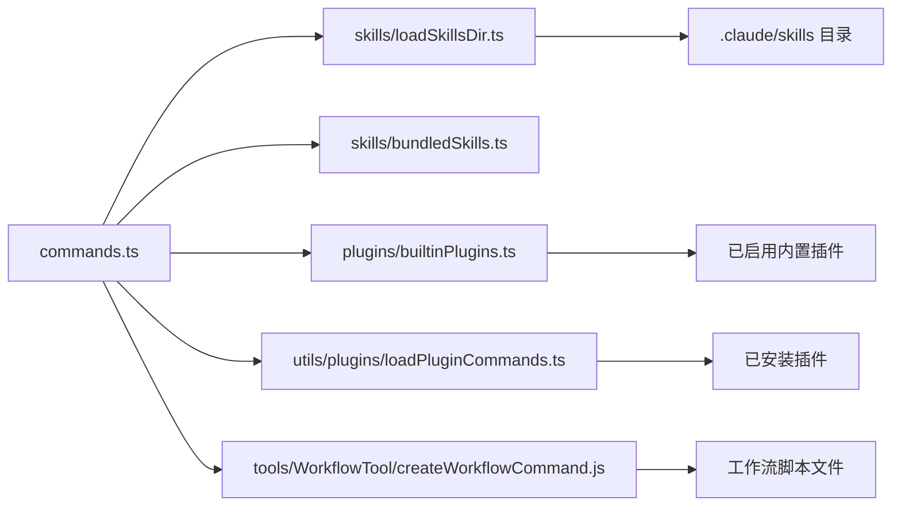

# 技能与任务命令

<cite>
**本文档引用的文件**
- [src/commands.ts](file://src/commands.ts)
- [src/commands/skills/index.ts](file://src/commands/skills/index.ts)
- [src/commands/skills/skills.tsx](file://src/commands/skills/skills.tsx)
- [src/components/skills/SkillsMenu.tsx](file://src/components/skills/SkillsMenu.tsx)
- [src/commands/tasks/index.ts](file://src/commands/tasks/index.ts)
- [src/commands/tasks/tasks.tsx](file://src/commands/tasks/tasks.tsx)
- [src/commands/plugin/index.tsx](file://src/commands/plugin/index.tsx)
- [src/commands/plugin/plugin.tsx](file://src/commands/plugin/plugin.tsx)
- [src/commands/workflows/index.ts](file://src/commands/workflows/index.ts)
- [src/skills/loadSkillsDir.ts](file://src/skills/loadSkillsDir.ts)
- [src/skills/bundledSkills.ts](file://src/skills/bundledSkills.ts)
- [src/plugins/builtinPlugins.ts](file://src/plugins/builtinPlugins.ts)
- [src/utils/plugins/loadPluginCommands.ts](file://src/utils/plugins/loadPluginCommands.ts)
- [src/tools/WorkflowTool/createWorkflowCommand.js](file://src/tools/WorkflowTool/createWorkflowCommand.js)
</cite>

## 目录
1. [简介](#简介)
2. [项目结构](#项目结构)
3. [核心组件](#核心组件)
4. [架构总览](#架构总览)
5. [详细组件分析](#详细组件分析)
6. [依赖关系分析](#依赖关系分析)
7. [性能考量](#性能考量)
8. [故障排除指南](#故障排除指南)
9. [结论](#结论)
10. [附录](#附录)

## 简介
本文件面向技能与任务管理相关命令的技术文档，涵盖以下命令的功能与实现细节：skills、tasks、workflows、plugin。内容包括技能加载机制、任务队列管理、工作流编排以及插件生态系统的集成方式；并提供技能开发、任务自动化与插件开发的最佳实践与规范。

## 项目结构
围绕技能与任务命令的核心目录与文件如下：
- 命令注册与聚合：src/commands.ts
- 技能命令入口与界面：src/commands/skills/*、src/components/skills/*
- 任务命令入口与界面：src/commands/tasks/*
- 插件命令入口与界面：src/commands/plugin/*
- 工作流命令入口（占位）：src/commands/workflows/*

**图表来源**
- [src/commands.ts:258-348](file://src/commands.ts#L258-L348)
- [src/commands/skills/index.ts:1-11](file://src/commands/skills/index.ts#L1-L11)
- [src/commands/tasks/index.ts:1-12](file://src/commands/tasks/index.ts#L1-L12)
- [src/commands/plugin/index.tsx:1-13](file://src/commands/plugin/index.tsx#L1-L13)
- [src/commands/workflows/index.ts:1-4](file://src/commands/workflows/index.ts#L1-L4)
- [src/components/skills/SkillsMenu.tsx:77-226](file://src/components/skills/SkillsMenu.tsx#L77-L226)
- [src/skills/loadSkillsDir.ts](file://src/skills/loadSkillsDir.ts)
- [src/skills/bundledSkills.ts](file://src/skills/bundledSkills.ts)
- [src/plugins/builtinPlugins.ts](file://src/plugins/builtinPlugins.ts)
- [src/utils/plugins/loadPluginCommands.ts](file://src/utils/plugins/loadPluginCommands.ts)

**章节来源**
- [src/commands.ts:258-348](file://src/commands.ts#L258-L348)
- [src/commands/skills/index.ts:1-11](file://src/commands/skills/index.ts#L1-L11)
- [src/commands/tasks/index.ts:1-12](file://src/commands/tasks/index.ts#L1-L12)
- [src/commands/plugin/index.tsx:1-13](file://src/commands/plugin/index.tsx#L1-L13)
- [src/commands/workflows/index.ts:1-4](file://src/commands/workflows/index.ts#L1-L4)

## 核心组件
本节概述四大命令的职责与交互关系：
- skills：列出并选择可用技能，支持来自用户配置、项目配置、插件与MCP的技能。
- tasks：列出并管理后台任务，提供任务生命周期控制与状态展示。
- workflows：工作流脚本命令入口（当前为占位），未来将由工具层动态生成具体命令。
- plugin：管理插件安装、启用、禁用、市场浏览与信任设置等。

关键实现要点：
- 命令注册与聚合：commands.ts 统一导出所有命令，并在运行时按需加载 UI 模块。
- 动态技能发现：通过技能目录扫描、插件技能注入与内置技能注册，形成最终技能索引。
- 可用性过滤：根据认证与提供商要求对命令进行可用性筛选。
- 远程模式安全：区分仅本地可执行与可通过远程桥接执行的安全命令集合。

**章节来源**
- [src/commands.ts:258-348](file://src/commands.ts#L258-L348)
- [src/commands.ts:419-445](file://src/commands.ts#L419-L445)
- [src/commands.ts:612-688](file://src/commands.ts#L612-L688)

## 架构总览
下图展示了命令系统如何整合技能、任务、工作流与插件：

**图表来源**
- [src/commands.ts:451-471](file://src/commands.ts#L451-L471)
- [src/skills/loadSkillsDir.ts](file://src/skills/loadSkillsDir.ts)
- [src/skills/bundledSkills.ts](file://src/skills/bundledSkills.ts)
- [src/plugins/builtinPlugins.ts](file://src/plugins/builtinPlugins.ts)
- [src/utils/plugins/loadPluginCommands.ts](file://src/utils/plugins/loadPluginCommands.ts)
- [src/tools/WorkflowTool/createWorkflowCommand.js](file://src/tools/WorkflowTool/createWorkflowCommand.js)

## 详细组件分析

### 技能命令（skills）
- 命令定义：本地 JSX 命令，名称为 skills，描述为“列出可用技能”，延迟加载 UI 模块。
- UI 实现：SkillsMenu 负责按来源分组显示技能，支持项目/本地/全局/策略设置来源、插件与MCP来源。
- 技能来源与排序：按命令名本地化排序，来源标题与副标题分别反映路径或服务器信息。
- 令牌估算：为每个技能估算前言描述的 token 数量，用于提示模型选择合适技能。

**图表来源**
- [src/commands/skills/index.ts:3-8](file://src/commands/skills/index.ts#L3-L8)
- [src/commands/skills/skills.tsx:6-11](file://src/commands/skills/skills.tsx#L6-L11)
- [src/components/skills/SkillsMenu.tsx:77-226](file://src/components/skills/SkillsMenu.tsx#L77-L226)
- [src/commands.ts:258-348](file://src/commands.ts#L258-L348)

**章节来源**
- [src/commands/skills/index.ts:1-11](file://src/commands/skills/index.ts#L1-L11)
- [src/commands/skills/skills.tsx:1-12](file://src/commands/skills/skills.tsx#L1-L12)
- [src/components/skills/SkillsMenu.tsx:1-228](file://src/components/skills/SkillsMenu.tsx#L1-L228)
- [src/commands.ts:258-348](file://src/commands.ts#L258-L348)

### 任务命令（tasks）
- 命令定义：本地 JSX 命令，名称为 tasks，别名为 bashes，描述为“列出并管理后台任务”，延迟加载 UI 模块。
- 任务类型：包含本地会话任务、本地 Shell 任务、本地代理任务、远程代理任务、监控 MCP 任务、工作流任务等。
- 生命周期：支持任务创建、查询、更新、输出获取与停止等操作。
- 队列管理：通过统一的任务抽象与工具层实现任务的调度与并发控制。

**图表来源**
- [src/commands/tasks/index.ts:3-9](file://src/commands/tasks/index.ts#L3-L9)
- [src/commands/tasks/tasks.tsx](file://src/commands/tasks/tasks.tsx)

**章节来源**
- [src/commands/tasks/index.ts:1-12](file://src/commands/tasks/index.ts#L1-L12)
- [src/commands/tasks/tasks.tsx](file://src/commands/tasks/tasks.tsx)

### 工作流命令（workflows）
- 当前状态：占位入口，实际工作流命令由工具层动态生成。
- 生成机制：通过 createWorkflowCommand.js 在运行时从工作流脚本文件中解析并注册命令。
- 使用场景：将复杂流程封装为可复用的脚本命令，便于模型调用与自动化执行。

**图表来源**
- [src/commands/workflows/index.ts:1-4](file://src/commands/workflows/index.ts#L1-L4)
- [src/tools/WorkflowTool/createWorkflowCommand.js](file://src/tools/WorkflowTool/createWorkflowCommand.js)

**章节来源**
- [src/commands/workflows/index.ts:1-4](file://src/commands/workflows/index.ts#L1-L4)
- [src/commands.ts:403-408](file://src/commands.ts#L403-L408)

### 插件命令（plugin）
- 命令定义：本地 JSX 命令，名称为 plugin，别名为 plugins、marketplace，描述为“管理 Claude Code 插件”，立即执行加载 UI 模块。
- 功能范围：插件市场浏览、插件安装/卸载/启用/禁用、信任设置、插件选项配置与错误处理。
- 安全与信任：提供插件信任警告与验证流程，确保用户明确授权后才执行潜在高风险操作。

**图表来源**
- [src/commands/plugin/index.tsx:3-10](file://src/commands/plugin/index.tsx#L3-L10)
- [src/commands/plugin/plugin.tsx](file://src/commands/plugin/plugin.tsx)

**章节来源**
- [src/commands/plugin/index.tsx:1-13](file://src/commands/plugin/index.tsx#L1-L13)
- [src/commands/plugin/plugin.tsx](file://src/commands/plugin/plugin.tsx)

## 依赖关系分析
命令系统通过统一入口聚合各类命令源，形成最终可用命令集。其依赖关系如下：

**图表来源**
- [src/commands.ts:451-471](file://src/commands.ts#L451-L471)
- [src/skills/loadSkillsDir.ts](file://src/skills/loadSkillsDir.ts)
- [src/skills/bundledSkills.ts](file://src/skills/bundledSkills.ts)
- [src/plugins/builtinPlugins.ts](file://src/plugins/builtinPlugins.ts)
- [src/utils/plugins/loadPluginCommands.ts](file://src/utils/plugins/loadPluginCommands.ts)
- [src/tools/WorkflowTool/createWorkflowCommand.js](file://src/tools/WorkflowTool/createWorkflowCommand.js)

**章节来源**
- [src/commands.ts:451-471](file://src/commands.ts#L451-L471)

## 性能考量
- 命令缓存：命令聚合与技能索引采用记忆化缓存，避免重复磁盘 I/O 与动态导入开销。
- 异步加载：命令 UI 模块按需异步加载，减少启动时长。
- 动态技能去重：在插入动态技能时进行去重与可用性检查，避免重复渲染与无效命令。
- 远程安全过滤：在远程模式下预过滤命令，减少不必要的初始化与渲染。

最佳实践建议：
- 合理组织技能文件，避免单个技能描述过长导致 token 估算偏大。
- 将高频使用的技能置于常用来源（如项目/本地设置），提升可见性。
- 对工作流脚本进行模块化拆分，减少一次性加载成本。
- 插件开发遵循最小权限原则，仅暴露必要命令与能力。

**章节来源**
- [src/commands.ts:451-471](file://src/commands.ts#L451-L471)
- [src/commands.ts:525-541](file://src/commands.ts#L525-L541)

## 故障排除指南
常见问题与排查步骤：
- 技能未显示：检查技能目录是否存在且命名规范正确；确认技能具备描述或 whenToUse 字段；查看日志中的技能加载失败提示。
- 插件命令不可用：确认插件已安装并启用；检查插件信任状态；查看插件错误对话框中的具体原因。
- 工作流命令缺失：确认工作流脚本文件存在且格式正确；检查 feature 标志是否开启；重新加载插件以刷新命令索引。
- 远程模式命令受限：确认命令类型是否在远程安全命令白名单中；对于需要本地上下文的命令，应在本地模式执行。

**章节来源**
- [src/commands.ts:355-400](file://src/commands.ts#L355-L400)
- [src/commands.ts:525-541](file://src/commands.ts#L525-L541)

## 结论
技能与任务命令体系通过统一的命令注册与聚合机制，实现了技能加载、任务管理、工作流编排与插件生态的无缝集成。借助记忆化缓存与按需加载，系统在保证功能完整性的同时兼顾性能与用户体验。建议开发者遵循本文提供的最佳实践，持续优化技能与任务的开发与维护流程。

## 附录

### 技能开发最佳实践
- 文件组织：将技能放置于 .claude/skills 或用户主目录下的技能目录，保持清晰的层级结构。
- 描述规范：为技能提供简洁明确的描述与 whenToUse 提示，便于模型理解使用时机。
- 前言优化：控制技能前言长度，避免过度 token 占用；必要时拆分为多个小技能。
- 权限与安全：尽量使用最小权限原则，避免直接访问敏感资源或执行高风险操作。

### 任务自动化策略
- 任务分类：根据执行环境（本地/远程）、资源占用与并发特性对任务进行分类管理。
- 生命周期：为任务设计清晰的创建、运行、监控与清理流程，确保异常情况下的可恢复性。
- 输出管理：统一任务输出格式，便于后续处理与审计；对敏感输出进行脱敏处理。

### 插件开发规范
- 命令设计：插件命令应具备明确的用途与描述，避免冗余或歧义；优先提供无副作用的只读命令。
- 错误处理：对可能失败的操作提供详细的错误信息与回退策略；在 UI 中提供清晰的错误对话框。
- 信任与验证：对涉及系统级操作的命令，必须经过用户显式授权与信任确认；提供可撤销的权限管理。