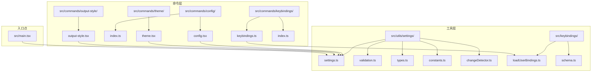
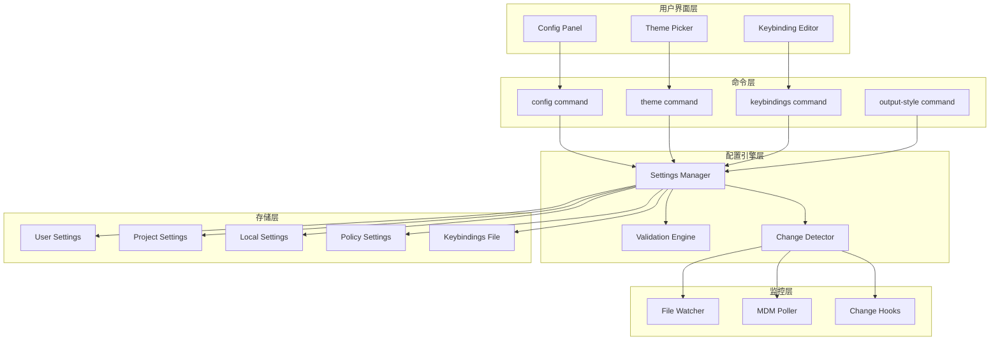
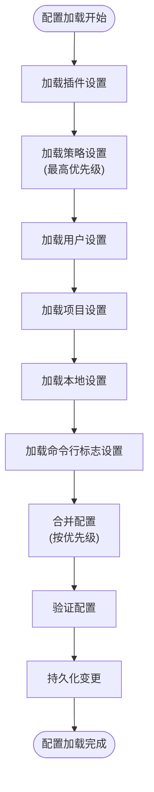
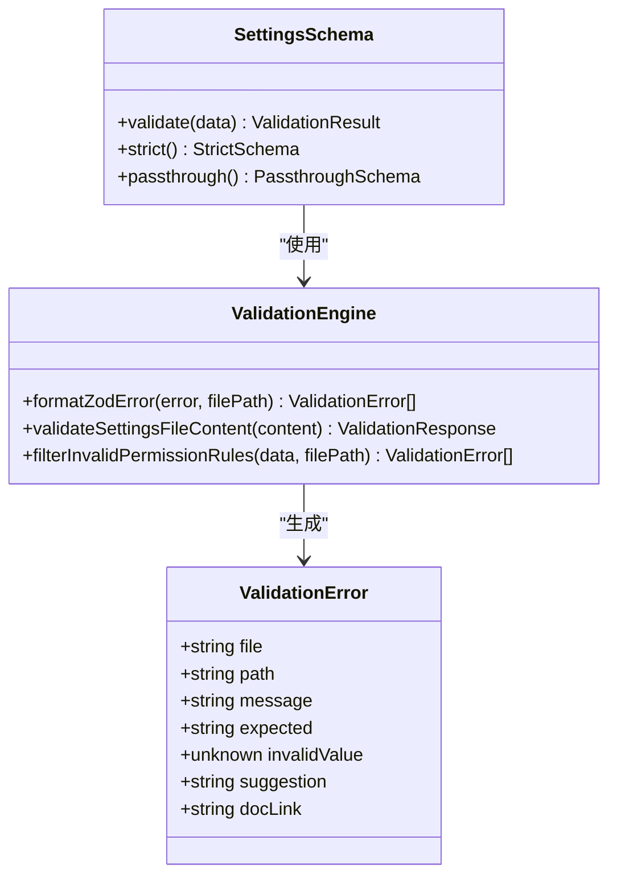
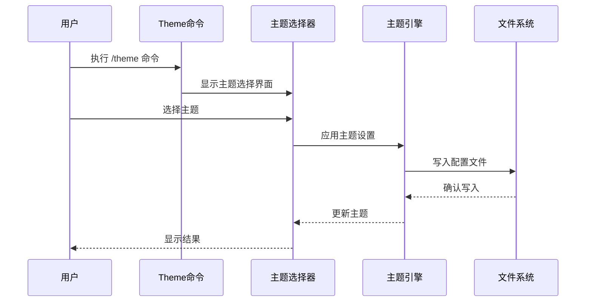
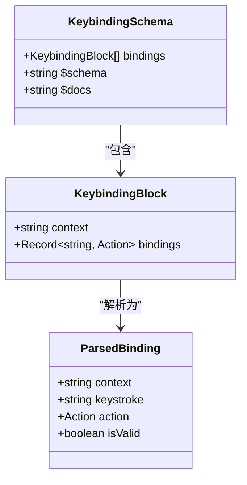
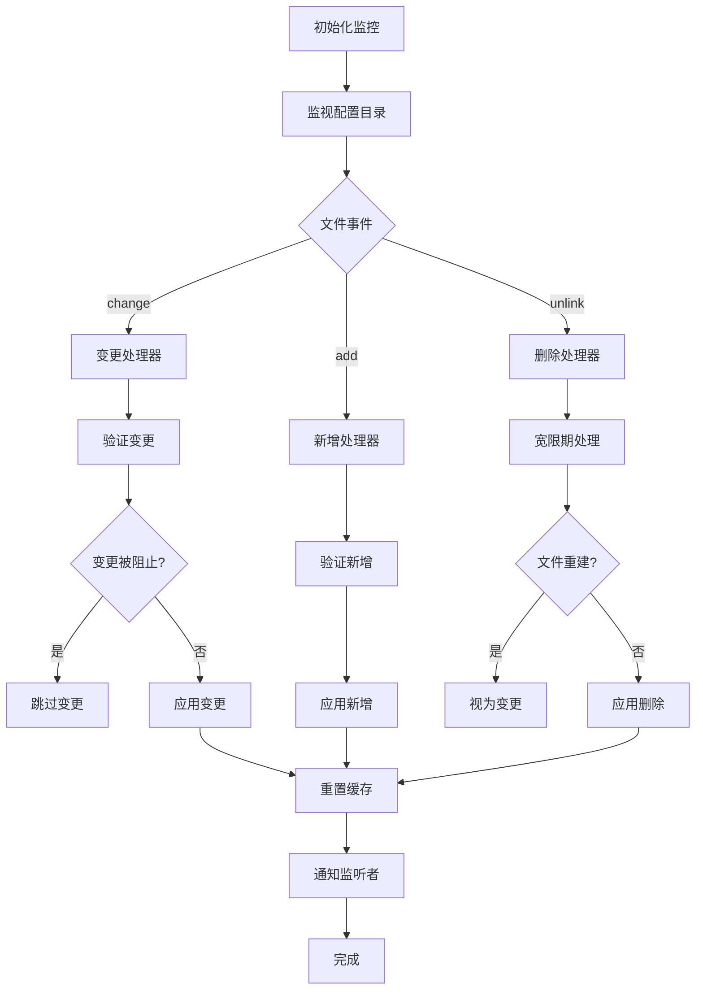
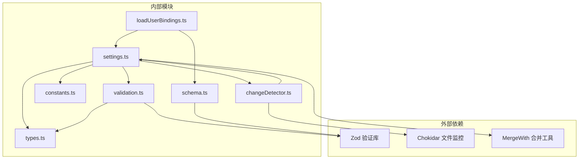

# 配置管理命令

<cite>
**本文档引用的文件**
- [config.tsx](file://src/commands/config/config.tsx)
- [index.ts](file://src/commands/config/index.ts)
- [theme.tsx](file://src/commands/theme/theme.tsx)
- [output-style.tsx](file://src/commands/output-style/output-style.tsx)
- [keybindings.ts](file://src/commands/keybindings/keybindings.ts)
- [index.ts](file://src/commands/keybindings/index.ts)
- [settings.ts](file://src/utils/settings/settings.ts)
- [validation.ts](file://src/utils/settings/validation.ts)
- [types.ts](file://src/utils/settings/types.ts)
- [constants.ts](file://src/utils/settings/constants.ts)
- [changeDetector.ts](file://src/utils/settings/changeDetector.ts)
- [loadUserBindings.ts](file://src/keybindings/loadUserBindings.ts)
- [schema.ts](file://src/keybindings/schema.ts)
- [main.tsx](file://src/main.tsx)
</cite>

## 目录
1. [简介](#简介)
2. [项目结构](#项目结构)
3. [核心组件](#核心组件)
4. [架构概览](#架构概览)
5. [详细组件分析](#详细组件分析)
6. [依赖关系分析](#依赖关系分析)
7. [性能考虑](#性能考虑)
8. [故障排除指南](#故障排除指南)
9. [结论](#结论)
10. [附录](#附录)

## 简介

本文档详细介绍了 Claude Code 中的配置管理相关命令，包括 `config`、`theme`、`output-style` 和 `keybindings` 命令的功能实现和使用方法。这些命令提供了完整的配置管理解决方案，支持配置查看、主题设置、输出样式控制和快捷键自定义。

配置管理系统采用分层架构设计，支持多种配置源（用户级、项目级、本地级、策略级）的合并和优先级处理。系统具备配置验证、热重载、同步机制等高级特性，确保配置的一致性和可靠性。

## 项目结构

配置管理相关的文件主要分布在以下目录结构中：



**图表来源**
- [config.tsx:1-8](file://src/commands/config/config.tsx#L1-L8)
- [theme.tsx:1-37](file://src/commands/theme/theme.tsx#L1-L37)
- [output-style.tsx:1-9](file://src/commands/output-style/output-style.tsx#L1-L9)
- [keybindings.ts:1-54](file://src/commands/keybindings/keybindings.ts#L1-L54)

**章节来源**
- [config.tsx:1-8](file://src/commands/config/config.tsx#L1-L8)
- [theme.tsx:1-37](file://src/commands/theme/theme.tsx#L1-L37)
- [output-style.tsx:1-9](file://src/commands/output-style/output-style.tsx#L1-L9)
- [keybindings.ts:1-54](file://src/commands/keybindings/keybindings.ts#L1-L54)

## 核心组件

### 配置命令系统

配置命令系统由四个主要命令组成，每个命令都有其特定的功能和实现方式：

#### Config 命令
Config 命令是配置管理的核心入口，提供图形化界面来查看和编辑所有配置选项。

#### Theme 命令
Theme 命令专门用于主题设置，支持多种预设主题和自定义语法高亮选项。

#### Output Style 命令
Output Style 命令用于控制助手响应的输出样式，现已标记为弃用状态。

#### Keybindings 命令
Keybindings 命令允许用户自定义键盘快捷键，支持复杂的上下文绑定和动作映射。

**章节来源**
- [config.tsx:1-8](file://src/commands/config/config.tsx#L1-L8)
- [theme.tsx:1-37](file://src/commands/theme/theme.tsx#L1-L37)
- [output-style.tsx:1-9](file://src/commands/output-style/output-style.tsx#L1-L9)
- [keybindings.ts:1-54](file://src/commands/keybindings/keybindings.ts#L1-L54)

## 架构概览

配置管理系统采用分层架构设计，确保各组件之间的清晰分离和职责明确：



**图表来源**
- [settings.ts:645-800](file://src/utils/settings/settings.ts#L645-L800)
- [changeDetector.ts:84-146](file://src/utils/settings/changeDetector.ts#L84-L146)
- [loadUserBindings.ts:353-404](file://src/keybindings/loadUserBindings.ts#L353-L404)

## 详细组件分析

### 配置管理核心引擎

配置管理的核心引擎负责处理所有配置相关的操作，包括配置加载、验证、合并和持久化。

#### 配置源管理

系统支持五种不同的配置源，每种源都有其特定的作用域和优先级：



**图表来源**
- [settings.ts:674-784](file://src/utils/settings/settings.ts#L674-L784)

#### 配置验证机制

配置验证系统使用 Zod 模式验证器确保配置文件的完整性和正确性：



**图表来源**
- [validation.ts:97-173](file://src/utils/settings/validation.ts#L97-L173)
- [types.ts:255-800](file://src/utils/settings/types.ts#L255-L800)

**章节来源**
- [settings.ts:645-800](file://src/utils/settings/settings.ts#L645-L800)
- [validation.ts:1-266](file://src/utils/settings/validation.ts#L1-L266)
- [types.ts:1-800](file://src/utils/settings/types.ts#L1-L800)

### 主题管理系统

主题管理系统提供了丰富的主题选择和自定义选项：

#### 主题选择流程



**图表来源**
- [theme.tsx:15-36](file://src/commands/theme/theme.tsx#L15-L36)

#### 支持的主题类型

系统支持多种主题变体，包括标准主题和色盲友好主题：

| 主题类型 | 描述 | 适用场景 |
|---------|------|----------|
| dark | 标准深色主题 | 夜间使用、低光环境 |
| light | 标准浅色主题 | 白天使用、明亮环境 |
| dark-daltonized | 色盲友好深色主题 | 色觉障碍用户 |
| light-daltonized | 色盲友好浅色主题 | 色觉障碍用户 |
| dark-ansi | ANSI 颜色深色主题 | 旧终端兼容 |
| light-ansi | ANSI 颜色浅色主题 | 旧终端兼容 |

**章节来源**
- [theme.tsx:1-37](file://src/commands/theme/theme.tsx#L1-L37)
- [Components/ThemePicker.tsx:83-105](file://src/components/ThemePicker.tsx#L83-L105)

### 快捷键管理系统

快捷键管理系统提供了强大的键盘自定义功能：

#### 快捷键配置结构



**图表来源**
- [schema.ts:177-229](file://src/keybindings/schema.ts#L177-L229)

#### 快捷键上下文系统

系统支持多种上下文环境，每种上下文都有特定的快捷键作用域：

| 上下文名称 | 作用范围 | 典型快捷键示例 |
|-----------|----------|---------------|
| Global | 全局有效 | Ctrl+C, Ctrl+V |
| Chat | 聊天输入框 | Enter, Esc |
| Autocomplete | 自动完成菜单 | Tab, Up/Down |
| Confirmation | 确认对话框 | Y/N, Enter |
| Transcript | 转录查看器 | Page Up/Down |
| ThemePicker | 主题选择器 | Space, Enter |
| Settings | 设置面板 | F1, Ctrl+S |

**章节来源**
- [loadUserBindings.ts:1-473](file://src/keybindings/loadUserBindings.ts#L1-L473)
- [schema.ts:1-237](file://src/keybindings/schema.ts#L1-L237)

### 配置热重载机制

配置热重载机制确保配置更改能够实时生效：

#### 文件监控系统



**图表来源**
- [changeDetector.ts:268-360](file://src/utils/settings/changeDetector.ts#L268-L360)

**章节来源**
- [changeDetector.ts:1-489](file://src/utils/settings/changeDetector.ts#L1-L489)

## 依赖关系分析

配置管理系统中的组件依赖关系如下：



**图表来源**
- [settings.ts:1-50](file://src/utils/settings/settings.ts#L1-L50)
- [changeDetector.ts:1-15](file://src/utils/settings/changeDetector.ts#L1-L15)

**章节来源**
- [settings.ts:1-50](file://src/utils/settings/settings.ts#L1-L50)
- [changeDetector.ts:1-15](file://src/utils/settings/changeDetector.ts#L1-L15)

## 性能考虑

配置管理系统在设计时充分考虑了性能优化：

### 缓存策略
- **设置缓存**: 使用内存缓存避免重复读取文件
- **解析缓存**: 缓存 JSON 解析结果减少重复解析
- **路径缓存**: 缓存设置文件路径避免重复计算

### 异步处理
- **文件监控**: 使用异步文件监控避免阻塞主线程
- **批量处理**: 合并多个配置变更后再统一处理
- **延迟加载**: 按需加载配置文件减少启动时间

### 内存管理
- **垃圾回收**: 及时清理不再使用的缓存数据
- **弱引用**: 使用弱引用来避免循环引用
- **资源清理**: 注册清理函数确保资源正确释放

## 故障排除指南

### 常见问题及解决方案

#### 配置文件格式错误
**症状**: 配置文件无法加载或显示错误信息
**原因**: JSON 格式不正确或字段类型错误
**解决方法**: 
1. 使用 JSON Schema 验证配置文件
2. 检查配置文件的语法和字段类型
3. 参考配置示例文件进行修正

#### 配置热重载失效
**症状**: 修改配置文件后设置未更新
**原因**: 文件监控异常或权限问题
**解决方法**:
1. 检查文件监控服务是否正常运行
2. 验证配置文件的读写权限
3. 重启应用程序重新建立监控连接

#### 快捷键冲突
**症状**: 自定义快捷键无效或与其他快捷键冲突
**原因**: 快捷键绑定格式错误或上下文不匹配
**解决方法**:
1. 检查快捷键绑定格式是否符合规范
2. 验证快捷键是否与系统快捷键冲突
3. 确认快捷键的应用上下文正确

**章节来源**
- [validation.ts:179-217](file://src/utils/settings/validation.ts#L179-L217)
- [loadUserBindings.ts:133-237](file://src/keybindings/loadUserBindings.ts#L133-L237)

## 结论

配置管理系统提供了完整、灵活且高性能的配置管理解决方案。通过分层架构设计、多源配置合并、智能验证机制和实时热重载功能，系统能够满足各种复杂的配置需求。

系统的模块化设计使得各个组件职责明确，易于维护和扩展。同时，完善的错误处理和故障排除机制确保了系统的稳定性和可靠性。

对于开发者而言，配置管理系统不仅提供了强大的功能，还为未来的功能扩展奠定了坚实的基础。

## 附录

### 配置最佳实践

#### 配置备份
- 定期备份重要配置文件
- 使用版本控制系统管理配置变更
- 创建配置快照以便快速恢复

#### 配置迁移
- 在升级前备份现有配置
- 逐步迁移配置项而非一次性替换
- 测试新配置在目标环境中的兼容性

#### 团队共享配置
- 使用项目级配置文件共享团队设置
- 建立配置变更审批流程
- 文档化配置项的用途和影响范围

### 命令使用示例

#### 查看当前配置
```bash
/config
```

#### 设置主题
```bash
/theme
```

#### 自定义快捷键
```bash
/keybindings
```

#### 输出样式设置（已弃用）
```bash
/output-style
```