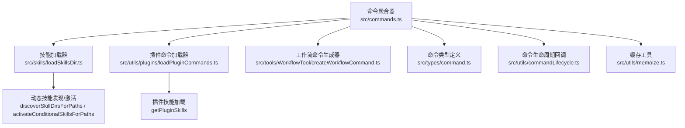
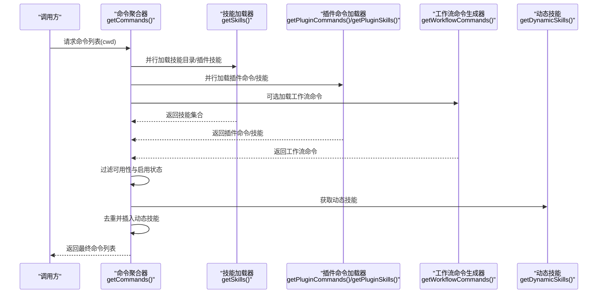
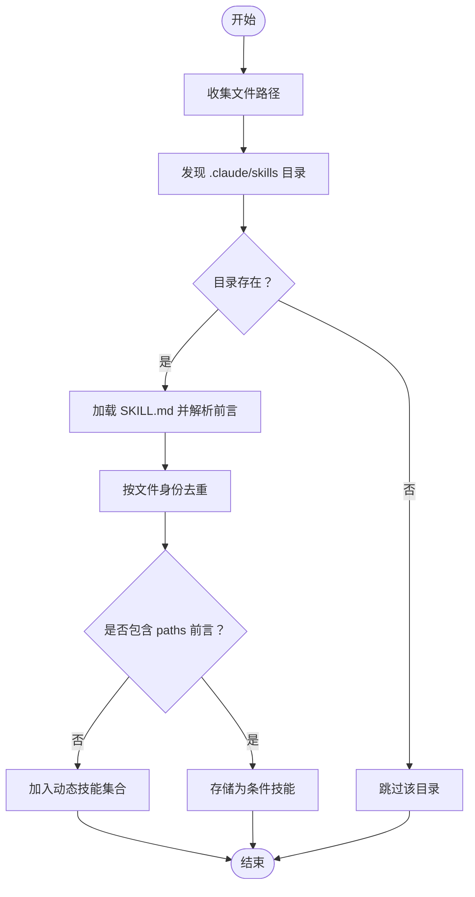
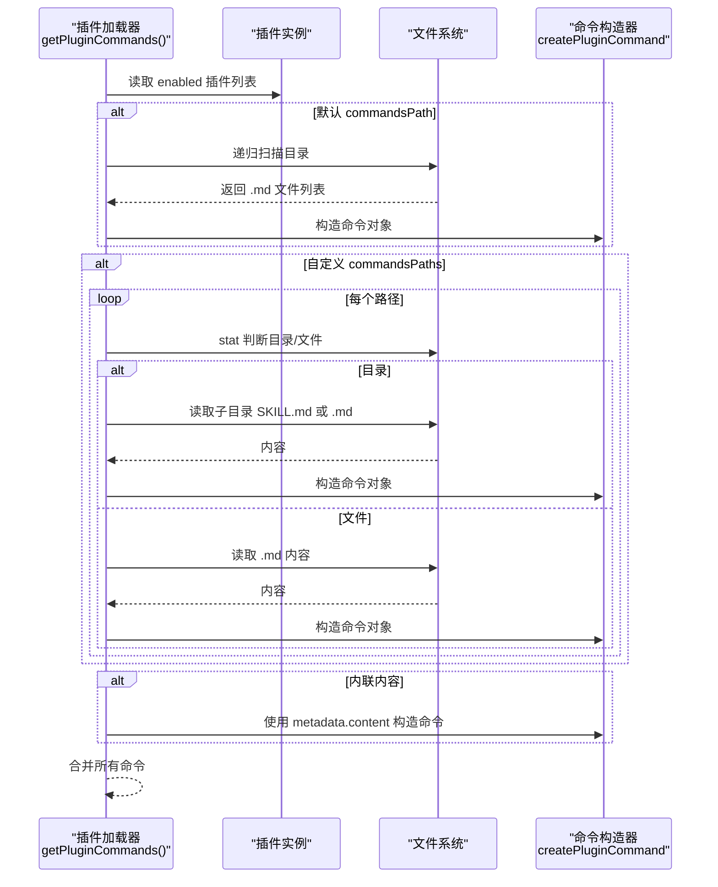
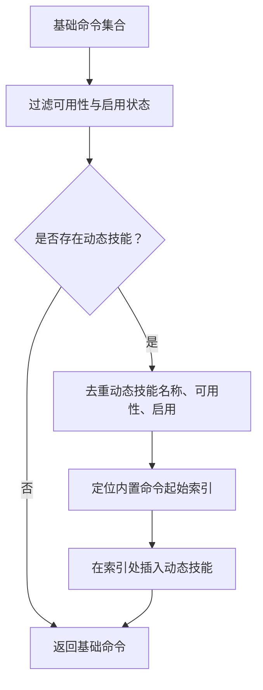
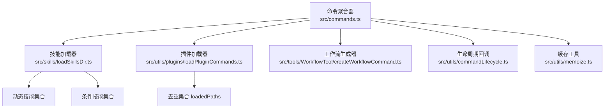

# 动态命令

<cite>
**本文引用的文件**
- [src/commands.ts](file://src/commands.ts)
- [src/skills/loadSkillsDir.ts](file://src/skills/loadSkillsDir.ts)
- [src/utils/plugins/loadPluginCommands.ts](file://src/utils/plugins/loadPluginCommands.ts)
- [src/types/command.ts](file://src/types/command.ts)
- [src/utils/commandLifecycle.ts](file://src/utils/commandLifecycle.ts)
- [src/utils/memoize.ts](file://src/utils/memoize.ts)
- [src/tools/WorkflowTool/createWorkflowCommand.ts](file://src/tools/WorkflowTool/createWorkflowCommand.ts)
</cite>

## 目录
1. [简介](#简介)
2. [项目结构](#项目结构)
3. [核心组件](#核心组件)
4. [架构总览](#架构总览)
5. [详细组件分析](#详细组件分析)
6. [依赖关系分析](#依赖关系分析)
7. [性能考量](#性能考量)
8. [故障排查指南](#故障排查指南)
9. [结论](#结论)
10. [附录：自定义动态命令开发指南](#附录自定义动态命令开发指南)

## 简介
本文件系统性阐述 Claude Code Best 的动态命令体系，覆盖技能命令、插件命令与工作流命令的加载机制、注册流程与执行方式；解释动态命令的发现过程、缓存策略与性能优化；并提供自定义动态命令的开发指南（接口规范、参数定义、生命周期管理），以及与内置命令的区别与集成方式。

## 项目结构
动态命令系统由以下关键模块构成：
- 命令聚合与过滤：负责从多源聚合命令、按可用性与启用状态过滤，并注入动态技能。
- 技能加载：支持用户/项目/策略来源的 /skills/ 目录与历史兼容的 /commands/ 目录；支持动态发现与条件技能激活。
- 插件命令与技能：从已启用插件中加载命令与技能，支持目录、文件与内联内容三种来源。
- 工作流命令：在特性开关开启时，通过工具层生成工作流命令。
- 类型与生命周期：统一的命令类型定义与生命周期通知回调。

图示来源
- [src/commands.ts:447-520](file://src/commands.ts#L447-L520)
- [src/skills/loadSkillsDir.ts:818-1058](file://src/skills/loadSkillsDir.ts#L818-L1058)
- [src/utils/plugins/loadPluginCommands.ts:414-677](file://src/utils/plugins/loadPluginCommands.ts#L414-L677)
- [src/tools/WorkflowTool/createWorkflowCommand.ts:1-4](file://src/tools/WorkflowTool/createWorkflowCommand.ts#L1-L4)
- [src/types/command.ts:1-217](file://src/types/command.ts#L1-L217)
- [src/utils/commandLifecycle.ts:1-22](file://src/utils/commandLifecycle.ts#L1-L22)
- [src/utils/memoize.ts:1-215](file://src/utils/memoize.ts#L1-L215)

章节来源
- [src/commands.ts:447-520](file://src/commands.ts#L447-L520)
- [src/skills/loadSkillsDir.ts:818-1058](file://src/skills/loadSkillsDir.ts#L818-L1058)
- [src/utils/plugins/loadPluginCommands.ts:414-677](file://src/utils/plugins/loadPluginCommands.ts#L414-L677)
- [src/tools/WorkflowTool/createWorkflowCommand.ts:1-4](file://src/tools/WorkflowTool/createWorkflowCommand.ts#L1-L4)
- [src/types/command.ts:1-217](file://src/types/command.ts#L1-L217)
- [src/utils/commandLifecycle.ts:1-22](file://src/utils/commandLifecycle.ts#L1-L22)
- [src/utils/memoize.ts:1-215](file://src/utils/memoize.ts#L1-L215)

## 核心组件
- 命令聚合与过滤
  - 聚合来源：内置命令、技能目录、插件命令、插件技能、工作流命令、捆绑技能与内置插件技能。
  - 过滤逻辑：按可用性要求与启用状态过滤；动态技能去重后插入到插件技能之后、内置命令之前。
- 技能加载
  - 支持多来源路径：策略/用户/项目/附加目录；支持历史兼容的 /commands/ 目录。
  - 动态发现：基于文件操作路径向上遍历，发现 .claude/skills 子目录并加载。
  - 条件技能：根据 paths 前言匹配文件路径，在命中时激活并加入动态技能集合。
- 插件命令与技能
  - 支持默认 commandsPath、自定义 commandsPaths、单文件与内联内容四种来源。
  - 统一使用 createPluginCommand 构造命令对象，支持变量替换、参数注入与 shell 执行。
- 工作流命令
  - 在特性开关开启时，通过工具层生成工作流命令；当前仓库中为占位实现，实际逻辑位于工具层。
- 类型与生命周期
  - 统一的 Command/PromptCommand/LocalCommand/LocalJSXCommand 类型定义。
  - 提供命令生命周期监听器，便于外部模块在命令开始/完成时进行处理。

章节来源
- [src/commands.ts:447-520](file://src/commands.ts#L447-L520)
- [src/skills/loadSkillsDir.ts:638-804](file://src/skills/loadSkillsDir.ts#L638-L804)
- [src/utils/plugins/loadPluginCommands.ts:218-412](file://src/utils/plugins/loadPluginCommands.ts#L218-L412)
- [src/tools/WorkflowTool/createWorkflowCommand.ts:1-4](file://src/tools/WorkflowTool/createWorkflowCommand.ts#L1-L4)
- [src/types/command.ts:16-217](file://src/types/command.ts#L16-L217)
- [src/utils/commandLifecycle.ts:1-22](file://src/utils/commandLifecycle.ts#L1-L22)

## 架构总览
动态命令系统采用“多源聚合 + 按需过滤 + 动态注入”的架构。命令聚合器负责协调各数据源，动态技能在运行期被发现并注入到命令列表中，同时保持与内置命令的优先级顺序。

图示来源
- [src/commands.ts:447-520](file://src/commands.ts#L447-L520)
- [src/skills/loadSkillsDir.ts:638-804](file://src/skills/loadSkillsDir.ts#L638-L804)
- [src/utils/plugins/loadPluginCommands.ts:414-677](file://src/utils/plugins/loadPluginCommands.ts#L414-L677)
- [src/tools/WorkflowTool/createWorkflowCommand.ts:1-4](file://src/tools/WorkflowTool/createWorkflowCommand.ts#L1-L4)

## 详细组件分析

### 技能命令加载与动态发现
- 加载范围
  - 策略/用户/项目/附加目录下的 /skills/ 目录；历史兼容的 /commands/ 目录。
  - 支持符号链接与重复路径去重，避免同一文件多次加载。
- 动态发现
  - 基于文件路径向上遍历，发现 .claude/skills 子目录；仅在项目设置启用且未限制为插件独占时生效。
  - 发现的技能按深度排序，更深的目录优先级更高。
- 条件技能
  - 读取前言中的 paths 列表，使用 gitignore 风格匹配；命中后激活并加入动态技能集合。
- 去重与合并
  - 合并后对动态技能进行去重，确保名称唯一；与基础命令集合再次去重后插入。

图示来源
- [src/skills/loadSkillsDir.ts:861-915](file://src/skills/loadSkillsDir.ts#L861-L915)
- [src/skills/loadSkillsDir.ts:917-975](file://src/skills/loadSkillsDir.ts#L917-L975)
- [src/skills/loadSkillsDir.ts:997-1058](file://src/skills/loadSkillsDir.ts#L997-L1058)

章节来源
- [src/skills/loadSkillsDir.ts:638-804](file://src/skills/loadSkillsDir.ts#L638-L804)
- [src/skills/loadSkillsDir.ts:818-1058](file://src/skills/loadSkillsDir.ts#L818-L1058)

### 插件命令与技能加载
- 命令来源
  - 默认 commandsPath、自定义 commandsPaths（目录或单文件）、内联内容（无源文件）。
  - 技能来源：默认 skillsPath、自定义 skillsPaths。
- 解析与构造
  - 统一解析前言字段（描述、arguments、allowed-tools、when_to_use、shell 等），构造 Command 对象。
  - 支持变量替换（如 ${CLAUDE_PLUGIN_ROOT}、${CLAUDE_PLUGIN_DATA}、${CLAUDE_SESSION_ID}）与参数注入。
- 并行与去重
  - 并行处理多个插件；每个插件内部维护 loadedPaths 集合防止重复加载。

图示来源
- [src/utils/plugins/loadPluginCommands.ts:414-677](file://src/utils/plugins/loadPluginCommands.ts#L414-L677)
- [src/utils/plugins/loadPluginCommands.ts:687-946](file://src/utils/plugins/loadPluginCommands.ts#L687-L946)

章节来源
- [src/utils/plugins/loadPluginCommands.ts:414-677](file://src/utils/plugins/loadPluginCommands.ts#L414-L677)
- [src/utils/plugins/loadPluginCommands.ts:687-946](file://src/utils/plugins/loadPluginCommands.ts#L687-L946)

### 工作流命令加载
- 特性开关控制：当 WORKFLOW_SCRIPTS 开启时，通过工具层生成工作流命令。
- 当前仓库实现为占位，实际逻辑位于工具层模块。

章节来源
- [src/tools/WorkflowTool/createWorkflowCommand.ts:1-4](file://src/tools/WorkflowTool/createWorkflowCommand.ts#L1-L4)
- [src/commands.ts:403-407](file://src/commands.ts#L403-L407)

### 命令聚合与动态注入
- 聚合顺序：捆绑技能 → 内置插件技能 → 技能目录命令 → 工作流命令 → 插件命令 → 插件技能 → 内置命令。
- 动态注入：动态技能去重后插入到插件技能之后、内置命令之前；若无动态技能则直接返回基础命令集合。

图示来源
- [src/commands.ts:478-519](file://src/commands.ts#L478-L519)

章节来源
- [src/commands.ts:447-520](file://src/commands.ts#L447-L520)

### 命令类型与生命周期
- 类型定义：统一的 Command 接口，区分 prompt/local/local-jsx 三类；支持前言字段、模型配置、工具允许列表、effort 等。
- 生命周期：提供 setCommandLifecycleListener 与 notifyCommandLifecycle，用于监听命令开始/完成事件。

章节来源
- [src/types/command.ts:16-217](file://src/types/command.ts#L16-L217)
- [src/utils/commandLifecycle.ts:1-22](file://src/utils/commandLifecycle.ts#L1-L22)

## 依赖关系分析
- 命令聚合器依赖技能加载器、插件加载器与工作流生成器；动态技能通过 getDynamicSkills 注入。
- 技能加载器内部维护动态技能集合与条件技能集合，支持去重与激活。
- 插件加载器内部维护 loadedPaths 集合，避免重复加载；支持多种来源。
- 缓存工具提供 memoize 与 memoizeWithTTL，用于命令与技能的缓存与刷新。

图示来源
- [src/commands.ts:447-520](file://src/commands.ts#L447-L520)
- [src/skills/loadSkillsDir.ts:818-1058](file://src/skills/loadSkillsDir.ts#L818-L1058)
- [src/utils/plugins/loadPluginCommands.ts:414-677](file://src/utils/plugins/loadPluginCommands.ts#L414-L677)
- [src/utils/commandLifecycle.ts:1-22](file://src/utils/commandLifecycle.ts#L1-L22)
- [src/utils/memoize.ts:1-215](file://src/utils/memoize.ts#L1-L215)

章节来源
- [src/commands.ts:447-520](file://src/commands.ts#L447-L520)
- [src/skills/loadSkillsDir.ts:818-1058](file://src/skills/loadSkillsDir.ts#L818-L1058)
- [src/utils/plugins/loadPluginCommands.ts:414-677](file://src/utils/plugins/loadPluginCommands.ts#L414-L677)
- [src/utils/commandLifecycle.ts:1-22](file://src/utils/commandLifecycle.ts#L1-L22)
- [src/utils/memoize.ts:1-215](file://src/utils/memoize.ts#L1-L215)

## 性能考量
- 并行加载：命令聚合器与技能/插件加载器广泛使用 Promise.all 并行处理，显著降低冷启动延迟。
- 写入式缓存：使用 memoize 与 memoizeWithTTL 实现写透缓存，热路径返回即时结果，后台异步刷新，避免阻塞。
- 去重与最小化 I/O：动态发现阶段记录已检查路径，避免重复 stat；文件身份去重避免重复解析。
- 条件技能延迟：仅在命中路径时激活，减少常驻内存与渲染负担。
- 清理策略：提供细粒度缓存清理接口，支持在动态技能变更后快速失效相关缓存。

章节来源
- [src/commands.ts:451-471](file://src/commands.ts#L451-L471)
- [src/skills/loadSkillsDir.ts:677-714](file://src/skills/loadSkillsDir.ts#L677-L714)
- [src/utils/plugins/loadPluginCommands.ts:431-436](file://src/utils/plugins/loadPluginCommands.ts#L431-L436)
- [src/utils/memoize.ts:40-215](file://src/utils/memoize.ts#L40-L215)

## 故障排查指南
- 技能加载失败
  - 现象：技能目录命令或插件技能加载报错但不中断整体流程。
  - 处理：查看调试日志中的错误信息；确认路径权限、文件编码与前言格式正确。
- 动态技能未出现
  - 现象：编辑文件后未触发动态技能显示。
  - 处理：确认项目设置启用且未限制为插件独占；检查文件路径是否匹配条件技能的 paths；必要时手动清理缓存并重试。
- 插件命令缺失
  - 现象：插件安装后命令未出现在列表中。
  - 处理：确认插件已启用；检查 commandsPath/skillsPath 是否存在；查看日志中的加载错误。
- 命令重复或顺序异常
  - 现象：命令列表中出现重复或顺序不符合预期。
  - 处理：确认去重逻辑与插入索引计算；检查动态技能注入位置是否正确。

章节来源
- [src/commands.ts:360-399](file://src/commands.ts#L360-L399)
- [src/skills/loadSkillsDir.ts:818-1058](file://src/skills/loadSkillsDir.ts#L818-L1058)
- [src/utils/plugins/loadPluginCommands.ts:414-677](file://src/utils/plugins/loadPluginCommands.ts#L414-L677)

## 结论
动态命令系统通过多源聚合、并行加载与写透缓存实现了高性能与高扩展性；动态发现与条件技能机制增强了上下文感知能力；严格的去重与注入顺序保障了命令列表的一致性与可预测性。配合完善的生命周期与缓存清理接口，开发者可以安全地扩展与维护动态命令生态。

## 附录：自定义动态命令开发指南
- 命令接口规范
  - 使用 PromptCommand 类型定义命令：包含名称、描述、参数、allowed-tools、when_to_use、shell 等字段；支持 disableModelInvocation 控制模型调用。
  - 若为技能，建议提供清晰的前言字段与示例输入，便于模型理解与调用。
- 参数定义
  - arguments 与 argument-hint：定义命令参数名与提示文本；系统会进行参数注入与替换。
  - allowed-tools：声明命令可使用的工具集，提升权限控制与安全性。
- 生命周期管理
  - 在命令执行前后通过生命周期回调进行日志记录或资源清理。
  - 对于需要频繁更新的命令，合理使用缓存清理接口以保证一致性。
- 与内置命令的区别与集成
  - 内置命令由命令聚合器集中注册，动态命令通过动态注入插入到插件技能之后、内置命令之前。
  - 动态命令需遵循可用性与启用状态过滤规则，确保在不同环境与权限下正确呈现。
- 开发建议
  - 将命令内容与变量分离，使用 ${CLAUDE_PLUGIN_ROOT}、${CLAUDE_SESSION_ID} 等变量实现可移植性。
  - 对于可能暴露敏感信息的内容，谨慎使用用户配置变量替换，避免在模型提示中泄露密钥。
  - 为复杂命令提供 when_to_use 场景说明，提升模型调用准确性。

章节来源
- [src/types/command.ts:16-217](file://src/types/command.ts#L16-L217)
- [src/utils/plugins/loadPluginCommands.ts:218-412](file://src/utils/plugins/loadPluginCommands.ts#L218-L412)
- [src/commands.ts:478-519](file://src/commands.ts#L478-L519)
- [src/utils/commandLifecycle.ts:1-22](file://src/utils/commandLifecycle.ts#L1-L22)