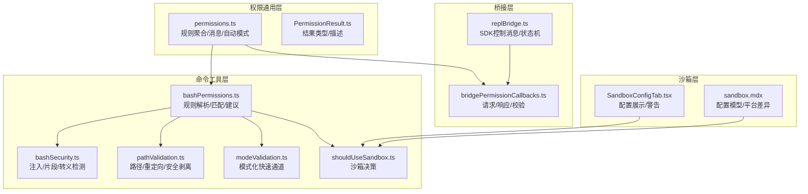
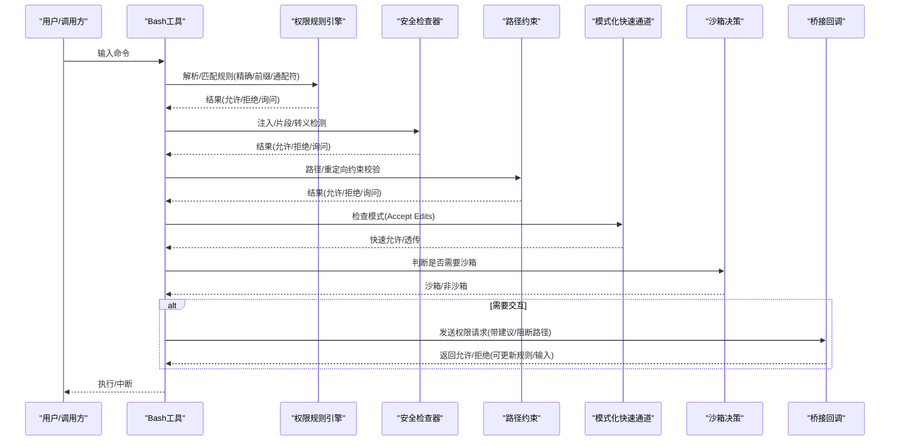
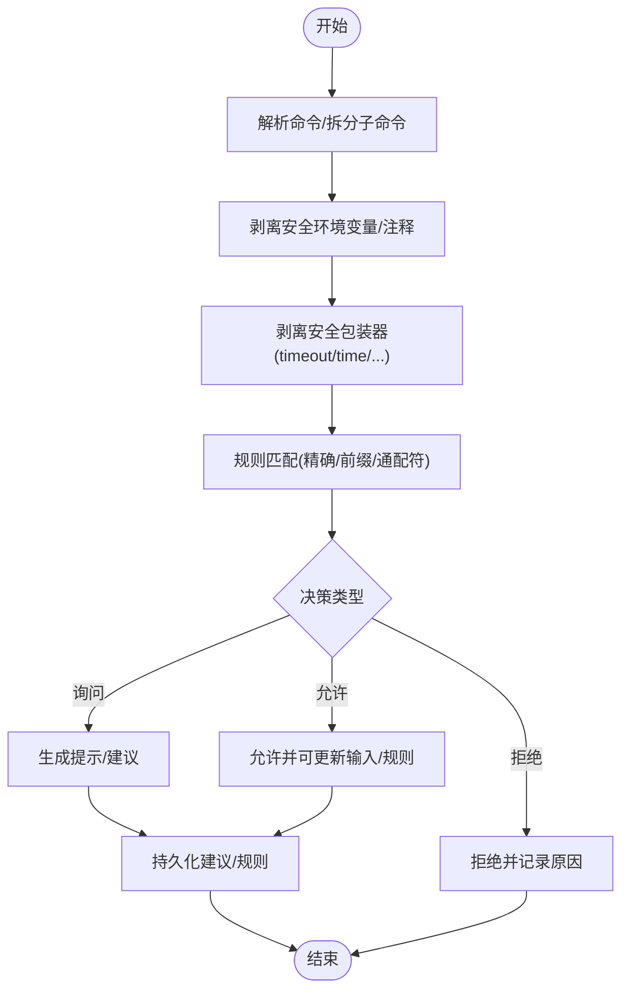
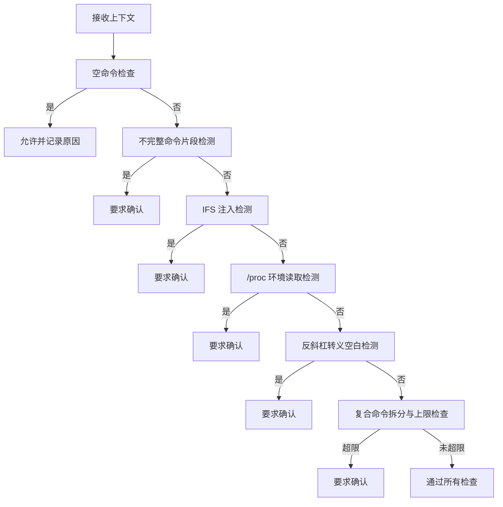
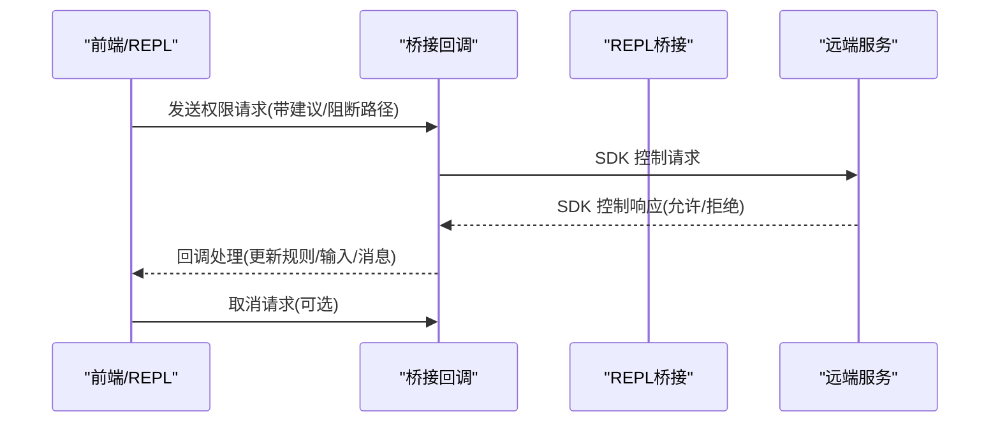
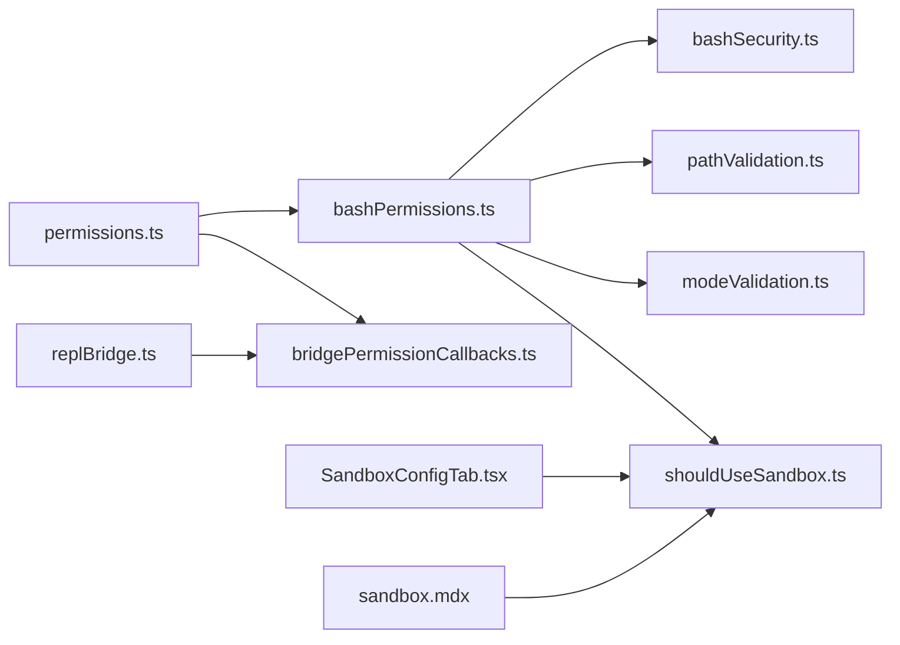

# 命令安全与权限

<cite>
**本文引用的文件**
- [src/tools/BashTool/bashPermissions.ts](file://src/tools/BashTool/bashPermissions.ts)
- [src/tools/BashTool/bashSecurity.ts](file://src/tools/BashTool/bashSecurity.ts)
- [src/tools/BashTool/pathValidation.ts](file://src/tools/BashTool/pathValidation.ts)
- [src/tools/BashTool/modeValidation.ts](file://src/tools/BashTool/modeValidation.ts)
- [src/tools/BashTool/shouldUseSandbox.ts](file://src/tools/BashTool/shouldUseSandbox.ts)
- [src/utils/permissions/permissions.ts](file://src/utils/permissions/permissions.ts)
- [src/utils/permissions/PermissionResult.ts](file://src/utils/permissions/PermissionResult.ts)
- [src/bridge/bridgePermissionCallbacks.ts](file://src/bridge/bridgePermissionCallbacks.ts)
- [src/bridge/replBridge.ts](file://src/bridge/replBridge.ts)
- [src/components/sandbox/SandboxConfigTab.tsx](file://src/components/sandbox/SandboxConfigTab.tsx)
- [docs/safety/sandbox.mdx](file://docs/safety/sandbox.mdx)
</cite>

## 目录
1. [简介](#简介)
2. [项目结构](#项目结构)
3. [核心组件](#核心组件)
4. [架构总览](#架构总览)
5. [详细组件分析](#详细组件分析)
6. [依赖关系分析](#依赖关系分析)
7. [性能考量](#性能考量)
8. [故障排查指南](#故障排查指南)
9. [结论](#结论)
10. [附录](#附录)

## 简介
本文件面向 Claude Code Best 的命令安全与权限系统，系统性梳理命令执行的安全检查机制、权限验证流程与访问控制策略。重点覆盖：
- 命令可用性检查：语法/语义/注入检测、路径约束、重定向与环境变量剥离、复合命令拆分与逐条判定
- 远程模式安全限制：桥接通道中的权限回调、控制消息编解码、跨端一致性校验
- 桥接模式权限控制：请求/响应模型、挂起处理器、取消与类型校验
- 命令权限规则：前缀/精确匹配、通配符规则、拒绝/询问/允许优先级、多来源合并
- 沙箱机制与安全策略：启用条件、排除命令、网络/文件系统限制、平台差异与依赖检查
- 配置指南与最佳实践：策略落地、风险缓解与运维建议

## 项目结构
围绕“命令安全与权限”的关键代码分布在以下模块：
- Bash 工具链：权限规则解析与匹配、安全检查器、路径与 sed 约束、模式化快速通道
- 权限通用层：规则聚合、提示消息构造、自动模式分类器、拒绝追踪与降级
- 桥接层：SDK 控制消息、权限请求/响应、REPL 侧桥接生命周期
- 沙箱适配器：沙箱开关、依赖检查、运行时包装、策略读取与变更

**图表来源**
- [src/tools/BashTool/bashPermissions.ts:1-800](file://src/tools/BashTool/bashPermissions.ts#L1-L800)
- [src/tools/BashTool/bashSecurity.ts:214-2592](file://src/tools/BashTool/bashSecurity.ts#L214-L2592)
- [src/tools/BashTool/pathValidation.ts:816-845](file://src/tools/BashTool/pathValidation.ts#L816-L845)
- [src/tools/BashTool/modeValidation.ts:1-116](file://src/tools/BashTool/modeValidation.ts#L1-L116)
- [src/tools/BashTool/shouldUseSandbox.ts:1-153](file://src/tools/BashTool/shouldUseSandbox.ts#L1-L153)
- [src/utils/permissions/permissions.ts:1-800](file://src/utils/permissions/permissions.ts#L1-L800)
- [src/utils/permissions/PermissionResult.ts:1-36](file://src/utils/permissions/PermissionResult.ts#L1-L36)
- [src/bridge/bridgePermissionCallbacks.ts:1-44](file://src/bridge/bridgePermissionCallbacks.ts#L1-L44)
- [src/bridge/replBridge.ts:1-200](file://src/bridge/replBridge.ts#L1-L200)
- [src/components/sandbox/SandboxConfigTab.tsx:1-38](file://src/components/sandbox/SandboxConfigTab.tsx#L1-L38)
- [docs/safety/sandbox.mdx:67-104](file://docs/safety/sandbox.mdx#L67-L104)

**章节来源**
- [src/tools/BashTool/bashPermissions.ts:1-800](file://src/tools/BashTool/bashPermissions.ts#L1-L800)
- [src/utils/permissions/permissions.ts:1-800](file://src/utils/permissions/permissions.ts#L1-L800)
- [src/bridge/bridgePermissionCallbacks.ts:1-44](file://src/bridge/bridgePermissionCallbacks.ts#L1-L44)
- [src/bridge/replBridge.ts:1-200](file://src/bridge/replBridge.ts#L1-L200)
- [src/components/sandbox/SandboxConfigTab.tsx:1-38](file://src/components/sandbox/SandboxConfigTab.tsx#L1-L38)
- [docs/safety/sandbox.mdx:67-104](file://docs/safety/sandbox.mdx#L67-L104)

## 核心组件
- Bash 权限规则引擎
  - 规则解析与匹配：支持精确、前缀、通配符；多来源合并；拒绝优先于询问再优先于允许
  - 建议生成：基于稳定前缀/首词/多行命令提取，避免无效或易绕过规则
  - 环境变量与包装器剥离：区分安全/不安全剥离场景，确保规则匹配与沙箱排除的一致性
- Bash 安全检查器
  - 注入与片段检测：IFS 变量使用、/proc 环境读取、反斜杠转义空白、不完整命令等
  - 复合命令拆分上限与建议上限，防止 ReDoS 与 UI 卡顿
- 路径与重定向约束
  - 解析输出重定向，剥离后用于规则匹配；路径合法性与工作目录约束
- 模式化快速通道
  - Accept Edits 模式对常见文件系统操作的自动放行
- 沙箱决策
  - 启用条件、排除命令（含动态特性）、用户策略与危险开关
- 权限通用层
  - 提示消息构造、自动模式分类器、拒绝追踪、钩子扩展点
- 桥接权限回调
  - 请求/响应模型、挂起处理器、类型校验与取消
- 沙箱配置与平台差异
  - 配置模型、依赖检查、平台实现差异与警告

**章节来源**
- [src/tools/BashTool/bashPermissions.ts:161-295](file://src/tools/BashTool/bashPermissions.ts#L161-L295)
- [src/tools/BashTool/bashSecurity.ts:244-2592](file://src/tools/BashTool/bashSecurity.ts#L244-L2592)
- [src/tools/BashTool/pathValidation.ts:834-845](file://src/tools/BashTool/pathValidation.ts#L834-L845)
- [src/tools/BashTool/modeValidation.ts:23-109](file://src/tools/BashTool/modeValidation.ts#L23-L109)
- [src/tools/BashTool/shouldUseSandbox.ts:130-153](file://src/tools/BashTool/shouldUseSandbox.ts#L130-L153)
- [src/utils/permissions/permissions.ts:137-231](file://src/utils/permissions/permissions.ts#L137-L231)
- [src/bridge/bridgePermissionCallbacks.ts:10-44](file://src/bridge/bridgePermissionCallbacks.ts#L10-L44)

## 架构总览
下图展示了从命令输入到最终执行的关键路径，包括权限规则匹配、安全检查、沙箱决策与桥接回调。

**图表来源**
- [src/tools/BashTool/bashPermissions.ts:778-800](file://src/tools/BashTool/bashPermissions.ts#L778-L800)
- [src/tools/BashTool/bashSecurity.ts:2571-2592](file://src/tools/BashTool/bashSecurity.ts#L2571-L2592)
- [src/tools/BashTool/pathValidation.ts:834-845](file://src/tools/BashTool/pathValidation.ts#L834-L845)
- [src/tools/BashTool/modeValidation.ts:72-109](file://src/tools/BashTool/modeValidation.ts#L72-L109)
- [src/tools/BashTool/shouldUseSandbox.ts:130-153](file://src/tools/BashTool/shouldUseSandbox.ts#L130-L153)
- [src/bridge/bridgePermissionCallbacks.ts:10-27](file://src/bridge/bridgePermissionCallbacks.ts#L10-L27)

## 详细组件分析

### Bash 权限规则引擎
- 规则来源与优先级
  - 支持多来源（本地/会话/命令行等）的允许/拒绝/询问规则，按来源合并
  - 决策顺序：拒绝 > 询问 > 允许 > 透传；复合命令逐条评估并汇总
- 建议生成
  - 基于稳定前缀（如 git commit）或首词（如 python3），避免通配符误用
  - 多行/heredoc 场景提取稳定前缀，避免规则不可复现
- 环境变量与包装器剥离
  - 安全剥离仅限白名单环境变量与已知安全包装器（timeout/time/nice/nohup/stdbuf）
  - 拒绝规则采用更严格剥离，排除二进制劫持变量（如 LD_*、PATH）

**图表来源**
- [src/tools/BashTool/bashPermissions.ts:524-615](file://src/tools/BashTool/bashPermissions.ts#L524-L615)
- [src/tools/BashTool/bashPermissions.ts:733-776](file://src/tools/BashTool/bashPermissions.ts#L733-L776)
- [src/tools/BashTool/bashPermissions.ts:778-800](file://src/tools/BashTool/bashPermissions.ts#L778-L800)

**章节来源**
- [src/tools/BashTool/bashPermissions.ts:161-295](file://src/tools/BashTool/bashPermissions.ts#L161-L295)
- [src/tools/BashTool/bashPermissions.ts:524-615](file://src/tools/BashTool/bashPermissions.ts#L524-L615)
- [src/tools/BashTool/bashPermissions.ts:733-776](file://src/tools/BashTool/bashPermissions.ts#L733-L776)
- [src/tools/BashTool/bashPermissions.ts:778-800](file://src/tools/BashTool/bashPermissions.ts#L778-L800)

### Bash 安全检查器
- 关键检查项
  - 不完整命令片段（以制表符开头）、IFS 变量使用、/proc 环境读取、反斜杠转义空白
  - 复合命令拆分上限与建议上限，防止性能退化
- 行为返回
  - ask：触发用户确认
  - deny/allow：直接终止或放行
  - passthrough：交由规则引擎/路径检查继续

**图表来源**
- [src/tools/BashTool/bashSecurity.ts:244-2592](file://src/tools/BashTool/bashSecurity.ts#L244-L2592)

**章节来源**
- [src/tools/BashTool/bashSecurity.ts:244-2592](file://src/tools/BashTool/bashSecurity.ts#L244-L2592)

### 路径与重定向约束
- 输出重定向剥离用于规则匹配，路径合法性与工作目录约束单独校验
- 对 cd 等命令进行特殊处理，避免路径逃逸

**章节来源**
- [src/tools/BashTool/pathValidation.ts:834-845](file://src/tools/BashTool/pathValidation.ts#L834-L845)

### 模式化快速通道
- Accept Edits 模式对常见文件系统操作（新建/删除/移动/复制/sed）自动允许
- 与其他模式（如 bypass/dontAsk）协同，避免绕过安全检查

**章节来源**
- [src/tools/BashTool/modeValidation.ts:23-109](file://src/tools/BashTool/modeValidation.ts#L23-L109)

### 沙箱机制与安全策略
- 启用条件
  - 沙箱开关、平台支持、策略锁定、依赖检查
- 排除命令
  - 用户配置与动态特性（蚂蚁用户）共同决定
  - 排除列表不是安全边界，实际安全控制仍依赖权限提示
- 运行时包装
  - 文件系统/网络/Unix Socket/本地绑定等限制
  - Linux 下通配符与 glob 警告

**章节来源**
- [src/tools/BashTool/shouldUseSandbox.ts:130-153](file://src/tools/BashTool/shouldUseSandbox.ts#L130-L153)
- [src/components/sandbox/SandboxConfigTab.tsx:1-38](file://src/components/sandbox/SandboxConfigTab.tsx#L1-L38)
- [docs/safety/sandbox.mdx:67-104](file://docs/safety/sandbox.mdx#L67-L104)

### 权限通用层
- 规则聚合与消息构造
  - 将多来源规则统一为允许/拒绝/询问集合，并生成可读提示
- 自动模式分类器
  - 在无 UI 上下文时替代人工确认，结合拒绝追踪与快速通道
- 钩子扩展点
  - 异步代理/头等代理可在权限请求前做决策

**章节来源**
- [src/utils/permissions/permissions.ts:137-231](file://src/utils/permissions/permissions.ts#L137-L231)
- [src/utils/permissions/permissions.ts:400-471](file://src/utils/permissions/permissions.ts#L400-L471)
- [src/utils/permissions/permissions.ts:518-800](file://src/utils/permissions/permissions.ts#L518-L800)

### 桥接模式权限控制
- 请求/响应模型
  - sendRequest/sendResponse/cancelRequest/onResponse
  - 类型谓词校验控制响应载荷
- REPL 侧桥接
  - SDK 控制消息编解码、状态机、能力唤醒与轮询配置

**图表来源**
- [src/bridge/bridgePermissionCallbacks.ts:10-44](file://src/bridge/bridgePermissionCallbacks.ts#L10-L44)
- [src/bridge/replBridge.ts:1-200](file://src/bridge/replBridge.ts#L1-L200)

**章节来源**
- [src/bridge/bridgePermissionCallbacks.ts:10-44](file://src/bridge/bridgePermissionCallbacks.ts#L10-L44)
- [src/bridge/replBridge.ts:1-200](file://src/bridge/replBridge.ts#L1-L200)

## 依赖关系分析
- 组件耦合
  - Bash 权限规则引擎依赖安全检查器、路径约束与沙箱决策
  - 权限通用层为工具与桥接提供统一的规则与消息接口
  - 沙箱配置与平台差异通过适配器抽象，降低平台耦合
- 外部依赖
  - 分类器（可选特性）用于自动模式
  - 设置源与策略加载模块

**图表来源**
- [src/tools/BashTool/bashPermissions.ts:1-800](file://src/tools/BashTool/bashPermissions.ts#L1-L800)
- [src/tools/BashTool/bashSecurity.ts:214-2592](file://src/tools/BashTool/bashSecurity.ts#L214-L2592)
- [src/tools/BashTool/pathValidation.ts:816-845](file://src/tools/BashTool/pathValidation.ts#L816-L845)
- [src/tools/BashTool/modeValidation.ts:1-116](file://src/tools/BashTool/modeValidation.ts#L1-L116)
- [src/tools/BashTool/shouldUseSandbox.ts:1-153](file://src/tools/BashTool/shouldUseSandbox.ts#L1-L153)
- [src/utils/permissions/permissions.ts:1-800](file://src/utils/permissions/permissions.ts#L1-L800)
- [src/bridge/bridgePermissionCallbacks.ts:1-44](file://src/bridge/bridgePermissionCallbacks.ts#L1-L44)
- [src/bridge/replBridge.ts:1-200](file://src/bridge/replBridge.ts#L1-L200)
- [src/components/sandbox/SandboxConfigTab.tsx:1-38](file://src/components/sandbox/SandboxConfigTab.tsx#L1-L38)
- [docs/safety/sandbox.mdx:67-104](file://docs/safety/sandbox.mdx#L67-L104)

**章节来源**
- [src/tools/BashTool/bashPermissions.ts:1-800](file://src/tools/BashTool/bashPermissions.ts#L1-L800)
- [src/utils/permissions/permissions.ts:1-800](file://src/utils/permissions/permissions.ts#L1-L800)
- [src/bridge/bridgePermissionCallbacks.ts:1-44](file://src/bridge/bridgePermissionCallbacks.ts#L1-L44)
- [src/bridge/replBridge.ts:1-200](file://src/bridge/replBridge.ts#L1-L200)
- [src/components/sandbox/SandboxConfigTab.tsx:1-38](file://src/components/sandbox/SandboxConfigTab.tsx#L1-L38)
- [docs/safety/sandbox.mdx:67-104](file://docs/safety/sandbox.mdx#L67-L104)

## 性能考量
- 复合命令拆分上限与建议上限，避免 ReDoS 与事件循环饥饿
- 分类器与拒绝追踪的成本与缓存统计，便于评估自动模式开销
- 沙箱初始化与依赖检查的缓存与重置，减少重复开销

[本节为通用指导，无需具体文件分析]

## 故障排查指南
- 权限提示频繁
  - 检查规则来源与建议数量上限，确认是否因复合命令导致
  - 查看拒绝追踪状态，必要时调整自动模式策略
- 沙箱未生效
  - 检查沙箱开关、平台支持与依赖检查结果
  - 确认排除命令列表与危险开关
- 桥接权限异常
  - 校验控制请求/响应的类型谓词与挂起处理器
  - 确认取消请求与响应回调的配对

**章节来源**
- [src/tools/BashTool/shouldUseSandbox.ts:130-153](file://src/tools/BashTool/shouldUseSandbox.ts#L130-L153)
- [src/bridge/bridgePermissionCallbacks.ts:29-44](file://src/bridge/bridgePermissionCallbacks.ts#L29-L44)
- [src/utils/permissions/permissions.ts:518-800](file://src/utils/permissions/permissions.ts#L518-L800)

## 结论
该系统通过“规则引擎 + 安全检查 + 沙箱 + 桥接回调”的组合，在保证可用性的同时强化命令执行的安全性。关键在于：
- 规则的稳定性与可解释性（前缀/通配符/建议生成）
- 多层次安全检查（注入/片段/路径/模式化快速通道）
- 沙箱作为强约束边界与可配置的弱化手段
- 桥接通道中严格的请求/响应模型与类型校验

## 附录

### 命令权限规则与沙箱配置要点
- 规则匹配
  - 精确/前缀/通配符三类规则，拒绝优先、询问次之、允许再次之
  - 建议生成避免无效规则，提升可维护性
- 沙箱配置
  - 开关、自动放行、排除命令、网络/文件系统限制
  - 平台差异与依赖检查，Linux 下注意通配符与 glob 警告

**章节来源**
- [src/tools/BashTool/bashPermissions.ts:161-295](file://src/tools/BashTool/bashPermissions.ts#L161-L295)
- [docs/safety/sandbox.mdx:67-104](file://docs/safety/sandbox.mdx#L67-L104)
- [src/components/sandbox/SandboxConfigTab.tsx:1-38](file://src/components/sandbox/SandboxConfigTab.tsx#L1-L38)