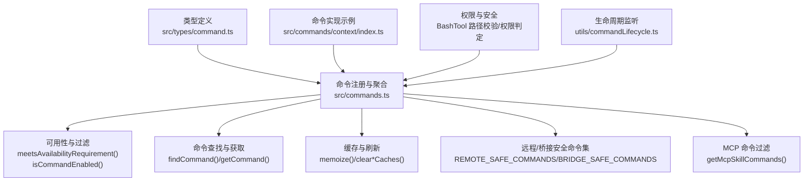
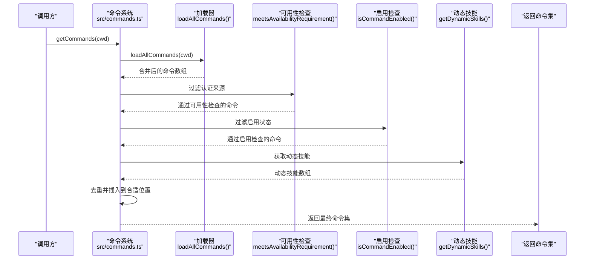
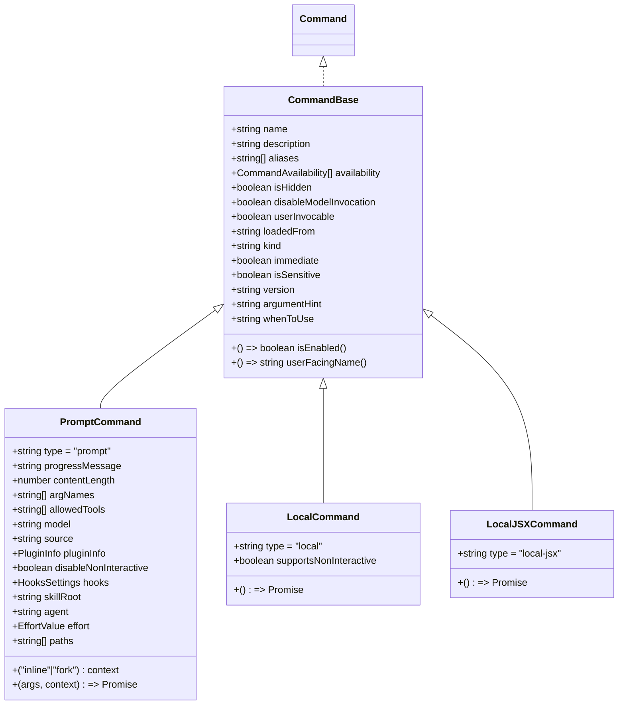
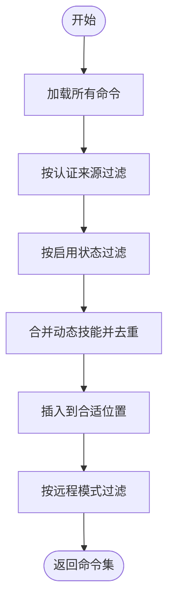
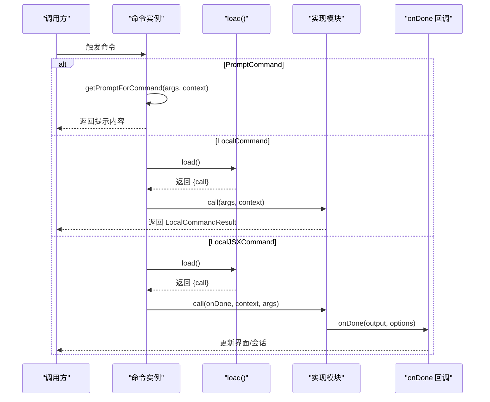
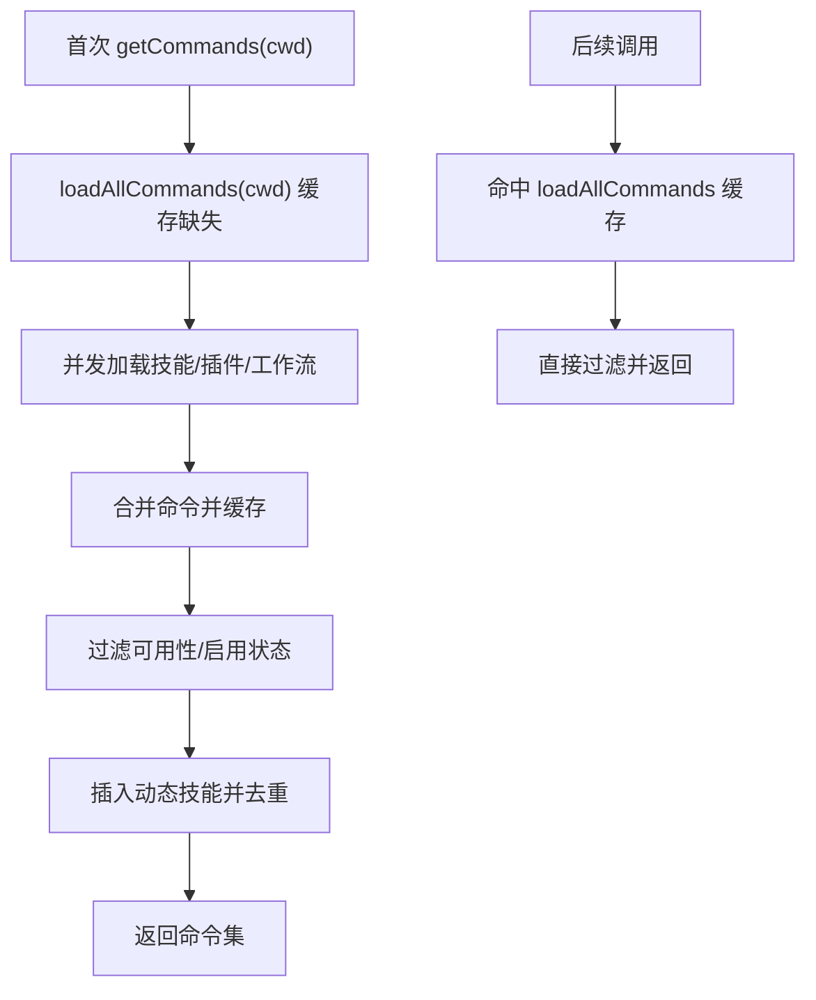
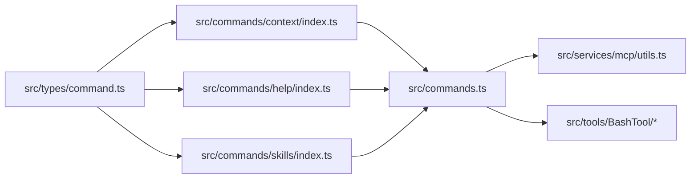

# 命令接口 API

<cite>
**本文引用的文件**
- [src/types/command.ts](file://src/types/command.ts)
- [src/commands.ts](file://src/commands.ts)
- [src/commands/init.ts](file://src/commands/init.ts)
- [src/commands/context/index.ts](file://src/commands/context/index.ts)
- [src/commands/help/index.ts](file://src/commands/help/index.ts)
- [src/commands/skills/index.ts](file://src/commands/skills/index.ts)
- [src/services/mcp/utils.ts](file://src/services/mcp/utils.ts)
- [src/utils/commandLifecycle.ts](file://src/utils/commandLifecycle.ts)
- [src/tools/BashTool/bashCommandHelpers.ts](file://src/tools/BashTool/bashCommandHelpers.ts)
- [src/tools/BashTool/bashPermissions.ts](file://src/tools/BashTool/bashPermissions.ts)
- [src/tools/BashTool/pathValidation.ts](file://src/tools/BashTool/pathValidation.ts)
- [src/hooks/useSkillsChange.ts](file://src/hooks/useSkillsChange.ts)
</cite>

## 目录
1. [简介](#简介)
2. [项目结构](#项目结构)
3. [核心组件](#核心组件)
4. [架构总览](#架构总览)
5. [详细组件分析](#详细组件分析)
6. [依赖关系分析](#依赖关系分析)
7. [性能考量](#性能考量)
8. [故障排查指南](#故障排查指南)
9. [结论](#结论)
10. [附录](#附录)

## 简介
本参考文档面向 Claude Code Best 的命令接口 API，系统化阐述 Command 类型定义、命令注册机制、命令查找与过滤算法、命令执行流程、扩展与自定义实践、缓存与性能优化策略以及错误处理模式。读者可据此理解命令的元数据、可用性检查、权限验证、执行参数与上下文，并掌握如何扩展与维护命令生态。

## 项目结构
命令接口 API 的核心由以下部分组成：
- 类型与契约：定义 Command 及其变体（PromptCommand、LocalCommand、LocalJSXCommand）的类型与工具函数
- 命令注册与聚合：集中导出内置命令、动态技能、插件技能、工作流命令等
- 命令可用性与过滤：按认证来源、特性开关、动态技能等进行过滤
- 命令执行：本地命令、JSX 命令、提示词型命令的调用路径
- 缓存与刷新：基于 memoize 的多层缓存与失效策略
- 权限与安全：命令级权限校验、路径约束与注入防护
- 生命周期与可观测性：命令生命周期监听

图表来源
- [src/types/command.ts:1-217](file://src/types/command.ts#L1-L217)
- [src/commands.ts:256-520](file://src/commands.ts#L256-L520)

章节来源
- [src/types/command.ts:1-217](file://src/types/command.ts#L1-L217)
- [src/commands.ts:256-520](file://src/commands.ts#L256-L520)

## 核心组件
- Command 类型与变体
  - CommandBase：命令通用元数据（名称、描述、别名、可用性、启用状态、来源标记等）
  - PromptCommand：提示词型命令，支持动态生成提示内容、模型选择、路径过滤等
  - LocalCommand：本地命令，延迟加载，支持非交互式执行
  - LocalJSXCommand：本地 JSX 命令，延迟加载，渲染 UI 组件
- 工具函数
  - getCommandName：解析用户可见名称
  - isCommandEnabled：解析启用状态
- 命令集合与导出
  - 内置命令列表、动态技能、插件技能、工作流命令的聚合
  - 远程/桥接安全命令白名单
  - MCP 技能过滤

章节来源
- [src/types/command.ts:169-217](file://src/types/command.ts#L169-L217)
- [src/commands.ts:256-348](file://src/commands.ts#L256-L348)

## 架构总览
命令系统采用“类型定义 + 集中注册 + 动态聚合 + 过滤与缓存”的架构。命令来源包括内置命令、技能目录、插件、工作流脚本、MCP 提供的技能等；在运行时根据认证来源、特性开关、动态技能等进行过滤与去重，最终形成对上层可用的命令集合。

图表来源
- [src/commands.ts:451-519](file://src/commands.ts#L451-L519)
- [src/commands.ts:419-445](file://src/commands.ts#L419-L445)
- [src/commands.ts:213-223](file://src/commands.ts#L213-L223)

## 详细组件分析

### 类型定义与接口
- CommandBase
  - 关键字段：name、description、aliases、availability、isEnabled、isHidden、isMcp、argumentHint、whenToUse、version、disableModelInvocation、userInvocable、loadedFrom、kind、immediate、isSensitive、userFacingName
  - 语义说明：用于声明命令的元数据与行为特征；availability 与 isEnabled 分离，前者静态决定可见性，后者动态决定启用状态
- PromptCommand
  - 关键字段：type='prompt'、progressMessage、contentLength、argNames、allowedTools、model、source、pluginInfo、disableNonInteractive、hooks、skillRoot、context、agent、effort、paths、getPromptForCommand(args, context)
  - 语义说明：提示词型命令，适合模型直接调用；支持路径过滤、上下文隔离（fork）、插件钩子等
- LocalCommand 与 LocalJSXCommand
  - LocalCommand：type='local'，supportsNonInteractive，load() 返回包含 call(args, context) 的模块
  - LocalJSXCommand：type='local-jsx'，load() 返回包含 call(onDone, context, args) 的模块，支持渲染 React 组件
- 上下文与结果
  - LocalJSXCommandContext：扩展 ToolUseContext，提供 canUseTool、setMessages、options（主题、IDE 安装状态、动态 MCP 配置）、回调等
  - LocalCommandResult：文本、紧凑化结果或跳过
  - LocalJSXCommandOnDone：命令完成回调，支持显示策略、是否继续对话、元消息注入等

图表来源
- [src/types/command.ts:169-217](file://src/types/command.ts#L169-L217)

章节来源
- [src/types/command.ts:16-217](file://src/types/command.ts#L16-L217)

### 命令注册与聚合
- 内置命令：通过显式导入各命令模块，统一加入 COMMANDS 列表
- 动态来源：
  - 技能目录命令：从用户技能目录加载
  - 插件命令与技能：从已启用插件加载
  - 工作流脚本：根据特性开关加载
  - 打包内置技能与插件技能：启动时同步注册
- 聚合顺序：打包技能 → 内置插件技能 → 技能目录命令 → 工作流命令 → 插件命令 → 插件技能 → 内置命令
- 特殊命令：
  - usageReport：懒加载实现
  - 内部专用命令：仅在特定环境可见

章节来源
- [src/commands.ts:256-348](file://src/commands.ts#L256-L348)
- [src/commands.ts:155-203](file://src/commands.ts#L155-L203)

### 命令可用性与过滤
- 认证来源过滤：meetsAvailabilityRequirement(cmd)
  - availability=['claude-ai'|'console']：区分 claude.ai 订阅者与控制台直连用户
  - 未设置 availability 的命令默认可用
- 启用状态过滤：isCommandEnabled(cmd)
  - 通过 isEnabled() 动态判断，未设置则视为启用
- 动态技能插入：去重后插入到插件技能之后、内置命令之前
- 远程/桥接安全命令：
  - REMOTE_SAFE_COMMANDS：仅影响本地状态的命令
  - BRIDGE_SAFE_COMMANDS：允许通过桥接通道执行的本地命令
  - isBridgeSafeCommand(cmd)：综合判断是否允许远端触发

图表来源
- [src/commands.ts:451-519](file://src/commands.ts#L451-L519)
- [src/commands.ts:419-445](file://src/commands.ts#L419-L445)
- [src/commands.ts:621-678](file://src/commands.ts#L621-L678)

章节来源
- [src/commands.ts:419-445](file://src/commands.ts#L419-L445)
- [src/commands.ts:478-519](file://src/commands.ts#L478-L519)
- [src/commands.ts:621-678](file://src/commands.ts#L621-L678)

### 命令查找与获取
- findCommand(commandName, commands)：按 name、userFacingName 或 aliases 查找
- hasCommand(commandName, commands)：是否存在
- getCommand(commandName, commands)：获取命令并抛出详细错误信息（含可用命令列表）

章节来源
- [src/commands.ts:690-721](file://src/commands.ts#L690-L721)

### 命令执行流程
- PromptCommand：通过 getPromptForCommand(args, context) 生成提示内容，交由模型使用
- LocalCommand：通过 load() 懒加载模块，调用 call(args, context)，返回 LocalCommandResult
- LocalJSXCommand：通过 load() 懒加载模块，调用 call(onDone, context, args)，返回 React 节点，onDone 控制输出与后续行为
- 典型执行路径示例：context 命令（可视化上下文）
  - local-jsx 命令：渲染上下文可视化组件，输出 ANSI 文本并通过 onDone 回传

图表来源
- [src/types/command.ts:53-152](file://src/types/command.ts#L53-L152)
- [src/commands/context/index.ts:4-24](file://src/commands/context/index.ts#L4-L24)

章节来源
- [src/types/command.ts:53-152](file://src/types/command.ts#L53-L152)
- [src/commands/context/index.ts:4-24](file://src/commands/context/index.ts#L4-L24)

### 扩展指南与自定义命令实现
- 新增内置命令
  - 在 src/commands 下创建新命令目录与入口文件，导出符合 Command 接口的对象
  - 将命令模块导入到 src/commands.ts 的 COMMANDS 列表中
- 新增提示词型命令
  - 实现 getPromptForCommand(args, context)，返回 ContentBlockParam[]
  - 设置 source、context、agent、paths 等元数据
- 新增本地命令
  - 导出 type='local'，提供 supportsNonInteractive 与 load() 返回 {call}
  - call(args, context) 返回 LocalCommandResult
- 新增 JSX 命令
  - 导出 type='local-jsx'，提供 load() 返回 {call}
  - call(onDone, context, args) 渲染 UI 并通过 onDone 输出结果
- 动态技能与插件
  - 技能目录命令：放置于用户技能目录，自动被 getSkills() 加载
  - 插件命令：在插件清单中声明 commands 字段，通过 getPluginCommands() 注册
  - 工作流脚本：根据特性开关生成命令

章节来源
- [src/commands.ts:256-348](file://src/commands.ts#L256-L348)
- [src/commands.ts:355-400](file://src/commands.ts#L355-L400)
- [src/commands.ts:402-408](file://src/commands.ts#L402-L408)

### 命令缓存机制与性能优化
- 多层缓存
  - loadAllCommands(cwd)：按工作目录缓存命令聚合结果，避免重复磁盘 I/O 与动态导入
  - getSkillToolCommands(cwd)/getSlashCommandToolSkills(cwd)：缓存技能类命令索引
  - lodash.memoize：广泛使用以减少重复计算
- 缓存失效
  - clearCommandMemoizationCaches()：清除命令相关 memoize 缓存
  - clearCommandsCache()：同时清理插件命令/技能缓存与技能缓存
  - useSkillsChange：监听技能变化，触发全量缓存清理与重新加载
- 性能建议
  - 将重型实现延迟到 load() 中，仅在需要时加载
  - 使用 paths 前置过滤，减少不必要的命令展示
  - 合理使用 memoize，避免在高频场景中产生过多缓存项

图表来源
- [src/commands.ts:451-471](file://src/commands.ts#L451-L471)
- [src/commands.ts:525-541](file://src/commands.ts#L525-L541)
- [src/hooks/useSkillsChange.ts:24-43](file://src/hooks/useSkillsChange.ts#L24-L43)

章节来源
- [src/commands.ts:451-471](file://src/commands.ts#L451-L471)
- [src/commands.ts:525-541](file://src/commands.ts#L525-L541)
- [src/hooks/useSkillsChange.ts:24-43](file://src/hooks/useSkillsChange.ts#L24-L43)

### 错误处理模式
- 命令查找失败
  - getCommand() 未找到时抛出带可用命令列表的错误，便于诊断
- 技能加载失败
  - getSkills() 对各来源分别捕获异常，记录日志并继续返回其他来源的结果
- 远程/桥接安全
  - isBridgeSafeCommand() 严格限制：prompt 命令默认允许；local 命令需显式列入 BRIDGE_SAFE_COMMANDS；local-jsx 命令一律阻止
- 生命周期监听
  - setCommandLifecycleListener()/notifyCommandLifecycle() 提供命令生命周期事件通知

章节来源
- [src/commands.ts:706-721](file://src/commands.ts#L706-L721)
- [src/commands.ts:360-400](file://src/commands.ts#L360-L400)
- [src/commands.ts:674-678](file://src/commands.ts#L674-L678)
- [src/utils/commandLifecycle.ts:1-21](file://src/utils/commandLifecycle.ts#L1-L21)

### 权限验证与安全
- 认证来源可用性
  - meetsAvailabilityRequirement(cmd)：根据 availability 与当前认证状态决定是否可见
- Bash 命令权限
  - bashCommandHelpers：拆分复合命令为子命令段，逐段评估权限，任一拒绝即整体拒绝
  - bashPermissions：收集规则、提取建议、去重并应用
  - pathValidation：剥离安全包装器、解析参数、校验路径合法性与注入风险
- MCP 命令归属
  - isMcpCommand()/isMcpTool()：识别 MCP 来源命令/工具
  - excludeCommandsByServer()/excludeStalePluginClients()：移除指定服务器命令与过期客户端

章节来源
- [src/commands.ts:419-445](file://src/commands.ts#L419-L445)
- [src/tools/BashTool/bashCommandHelpers.ts:84-131](file://src/tools/BashTool/bashCommandHelpers.ts#L84-L131)
- [src/tools/BashTool/bashPermissions.ts:2472-2490](file://src/tools/BashTool/bashPermissions.ts#L2472-L2490)
- [src/tools/BashTool/pathValidation.ts:834-845](file://src/tools/BashTool/pathValidation.ts#L834-L845)
- [src/services/mcp/utils.ts:129-256](file://src/services/mcp/utils.ts#L129-L256)

## 依赖关系分析
- 类型依赖
  - Command 依赖 ToolUseContext、EffortValue、ThemeName、PluginManifest、ScopedMcpServerConfig 等
- 运行时依赖
  - commands.ts 依赖 auth、settings、plugins、skills、mcp 等模块提供的能力
  - 命令实现依赖工具链（如 BashTool）、UI（如 Ink）、状态管理（如 AppState）

图表来源
- [src/types/command.ts:1-217](file://src/types/command.ts#L1-L217)
- [src/commands/context/index.ts:1-25](file://src/commands/context/index.ts#L1-L25)
- [src/commands/help/index.ts:1-11](file://src/commands/help/index.ts#L1-L11)
- [src/commands/skills/index.ts:1-11](file://src/commands/skills/index.ts#L1-L11)
- [src/commands.ts:1-520](file://src/commands.ts#L1-L520)

章节来源
- [src/commands.ts:1-520](file://src/commands.ts#L1-L520)

## 性能考量
- 懒加载：LocalCommand/LocalJSXCommand 通过 load() 延迟加载，降低初始启动成本
- 缓存策略：按 cwd 缓存命令聚合、技能索引、MCP 客户端变更检测哈希
- 并发加载：Promise.all 并行获取技能、插件、工作流等来源
- 去重与插入：动态技能与内置命令的插入位置固定，避免重复扫描
- 远程模式预过滤：REMOTE_SAFE_COMMANDS 在渲染前过滤，减少无关命令参与

## 故障排查指南
- 命令不可见
  - 检查 availability 与 meetsAvailabilityRequirement() 是否匹配当前认证来源
  - 检查 isEnabled() 是否返回 false（可能受特性开关或远程配置影响）
- 命令找不到
  - 使用 getCommand() 获取详细错误，确认大小写、别名与拼写
- 执行无响应
  - 检查 load() 是否成功、实现是否正确返回结果
  - 对于 JSX 命令，确认 onDone 是否被调用
- 权限被拒
  - BashTool：查看子命令段权限决策与拒绝原因
  - 路径校验：确认命令是否包含危险包装器或越界路径
- 缓存问题
  - 使用 clearCommandsCache()/clearCommandMemoizationCaches() 清理缓存
  - 监听 useSkillsChange，确保技能变化后及时刷新

章节来源
- [src/commands.ts:690-721](file://src/commands.ts#L690-L721)
- [src/commands.ts:525-541](file://src/commands.ts#L525-L541)
- [src/tools/BashTool/bashCommandHelpers.ts:84-131](file://src/tools/BashTool/bashCommandHelpers.ts#L84-L131)
- [src/hooks/useSkillsChange.ts:24-43](file://src/hooks/useSkillsChange.ts#L24-L43)

## 结论
命令接口 API 通过清晰的类型定义、灵活的注册与聚合机制、严格的可用性与安全过滤、完善的缓存与刷新策略，构建了可扩展、可观测且高性能的命令体系。开发者可依据本文档快速实现自定义命令，并在保证安全与性能的前提下持续扩展生态。

## 附录
- 示例命令实现
  - 提示词型命令：init 命令，动态返回不同提示内容
  - JSX 命令：help/skills 命令，延迟加载并渲染 UI
  - 本地命令：context（交互式）与 contextNonInteractive（非交互式），分别在不同会话模式下启用

章节来源
- [src/commands/init.ts:226-257](file://src/commands/init.ts#L226-L257)
- [src/commands/help/index.ts:3-11](file://src/commands/help/index.ts#L3-L11)
- [src/commands/skills/index.ts:3-11](file://src/commands/skills/index.ts#L3-L11)
- [src/commands/context/index.ts:4-24](file://src/commands/context/index.ts#L4-L24)