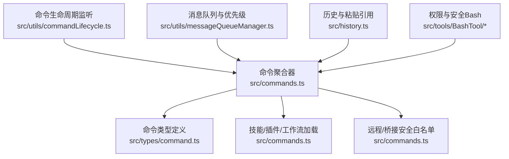
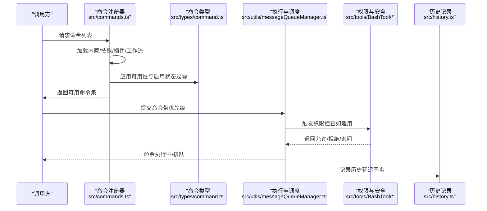
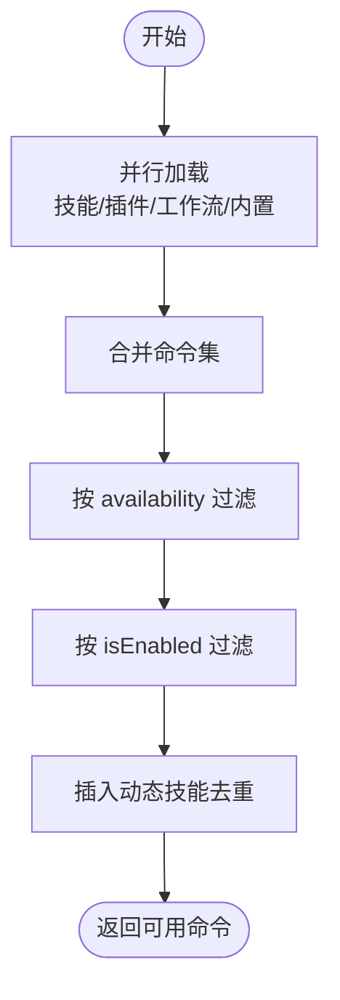
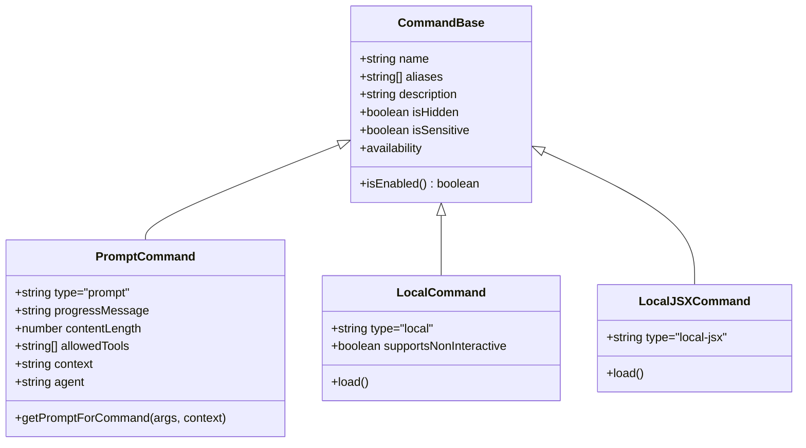
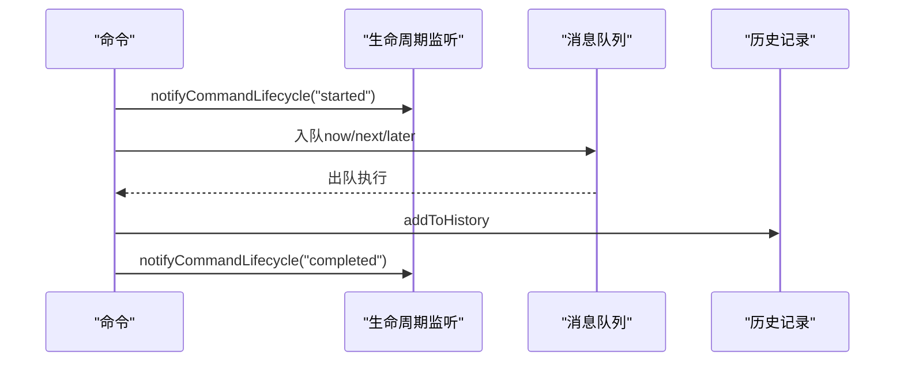
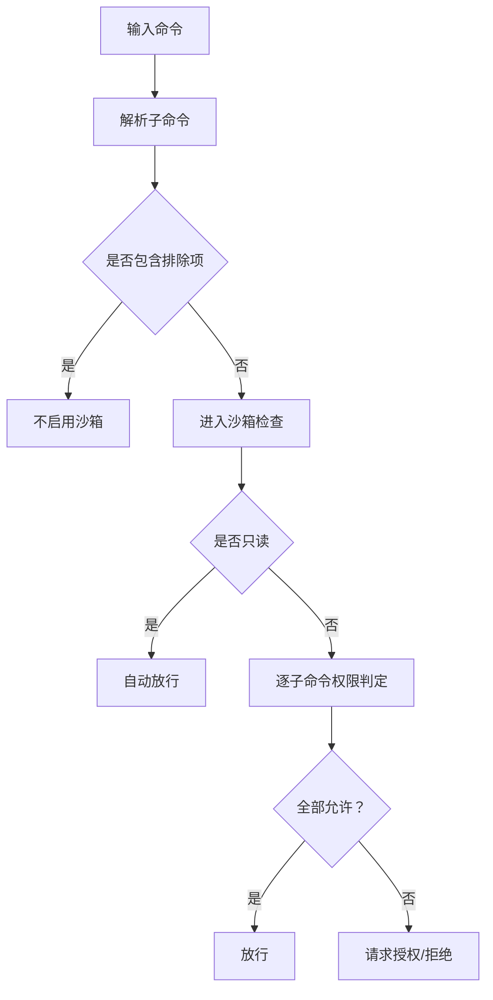
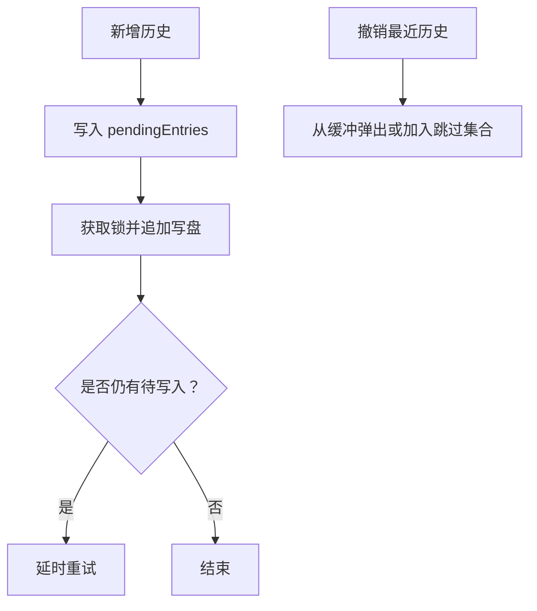
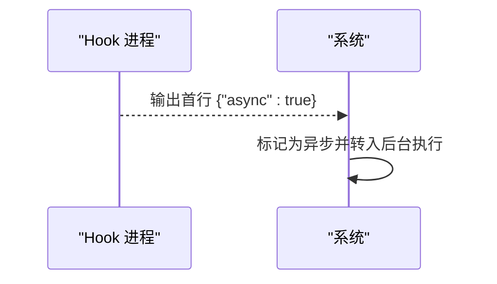
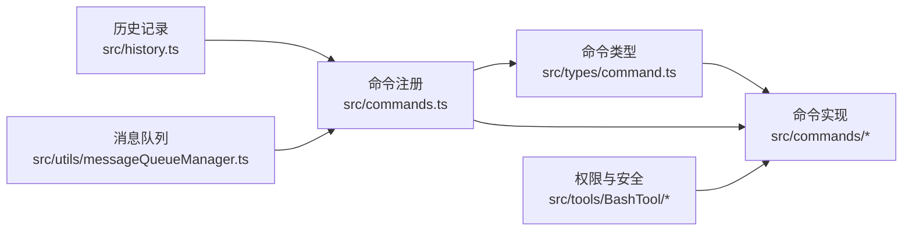

# 命令接口

<cite>
**本文引用的文件**
- [src/commands.ts](file://src/commands.ts)
- [src/types/command.ts](file://src/types/command.ts)
- [src/utils/commandLifecycle.ts](file://src/utils/commandLifecycle.ts)
- [src/history.ts](file://src/history.ts)
- [src/utils/errors.ts](file://src/utils/errors.ts)
- [src/utils/messageQueueManager.ts](file://src/utils/messageQueueManager.ts)
- [src/tools/BashTool/shouldUseSandbox.ts](file://src/tools/BashTool/shouldUseSandbox.ts)
- [src/tools/BashTool/bashPermissions.ts](file://src/tools/BashTool/bashPermissions.ts)
- [src/tools/BashTool/pathValidation.ts](file://src/tools/BashTool/pathValidation.ts)
- [src/utils/bash/commands.ts](file://src/utils/bash/commands.ts)
- [src/commands/clear/index.ts](file://src/commands/clear/index.ts)
- [src/commands/context/index.ts](file://src/commands/context/index.ts)
- [docs/extensibility/hooks.mdx](file://docs/extensibility/hooks.mdx)
- [docs/features/workflow-scripts.md](file://docs/features/workflow-scripts.md)
</cite>

## 目录
1. [简介](#简介)
2. [项目结构](#项目结构)
3. [核心组件](#核心组件)
4. [架构总览](#架构总览)
5. [详细组件分析](#详细组件分析)
6. [依赖关系分析](#依赖关系分析)
7. [性能考量](#性能考量)
8. [故障排查指南](#故障排查指南)
9. [结论](#结论)
10. [附录](#附录)

## 简介
本文件面向 Claude Code Best 的命令接口系统，提供从接口规范到实现细节的全景技术文档。内容覆盖命令注册机制、命令执行流程与参数处理、生命周期管理、权限验证与错误处理、扩展开发指南与自定义命令实现示例、异步执行与并发控制、命令历史与批量执行等主题。目标读者既包括需要快速上手的开发者，也包括希望深入理解系统设计的高级工程师。

## 项目结构
命令系统的核心由以下模块构成：
- 命令类型与元数据：定义命令的结构、可用性、交互类型与上下文信息
- 命令注册与聚合：集中加载内置命令、技能、插件技能、工作流脚本与动态技能
- 命令执行与调度：命令生命周期监听、消息队列优先级与并发控制
- 权限与安全：沙箱策略、路径校验、只读语义与子命令权限判定
- 历史与批量：命令历史持久化、粘贴内容引用解析、批量执行窗口与去重

**图示来源**
- [src/commands.ts:258-520](file://src/commands.ts#L258-L520)
- [src/types/command.ts:16-217](file://src/types/command.ts#L16-L217)
- [src/utils/commandLifecycle.ts:1-22](file://src/utils/commandLifecycle.ts#L1-L22)
- [src/utils/messageQueueManager.ts:151-292](file://src/utils/messageQueueManager.ts#L151-L292)
- [src/history.ts:106-180](file://src/history.ts#L106-L180)
- [src/tools/BashTool/shouldUseSandbox.ts:130-153](file://src/tools/BashTool/shouldUseSandbox.ts#L130-L153)

**章节来源**
- [src/commands.ts:258-520](file://src/commands.ts#L258-L520)
- [src/types/command.ts:16-217](file://src/types/command.ts#L16-L217)

## 核心组件
- 命令类型与元数据
  - 支持三类命令：prompt（模型可调用）、local（本地文本输出）、local-jsx（本地渲染 UI）
  - 提供命令可用性（按认证/提供商环境过滤）、启用状态、别名、隐藏、敏感参数、来源标记等
  - 定义命令结果展示策略与回调约定
- 命令注册与聚合
  - 内置命令集合与条件导入（特性开关）
  - 技能目录、插件技能、内置插件技能、工作流脚本的动态加载
  - 基于可用性与启用状态的过滤与去重
- 命令执行与调度
  - 生命周期监听器用于追踪命令启动/完成
  - 消息队列支持优先级（now/next/later）与批量出队
- 权限与安全
  - 沙箱策略与排除规则
  - 路径命令的安全校验与只读语义
  - 子命令粒度的权限判定
- 历史与批量
  - 历史条目写盘、锁文件并发、粘贴内容内联/外存存储
  - 历史检索与去重窗口、会话内优先排序

**章节来源**
- [src/types/command.ts:16-217](file://src/types/command.ts#L16-L217)
- [src/commands.ts:419-519](file://src/commands.ts#L419-L519)
- [src/utils/commandLifecycle.ts:1-22](file://src/utils/commandLifecycle.ts#L1-L22)
- [src/utils/messageQueueManager.ts:151-292](file://src/utils/messageQueueManager.ts#L151-L292)
- [src/history.ts:292-434](file://src/history.ts#L292-L434)

## 架构总览
命令系统采用“类型中心 + 动态聚合 + 条件加载”的架构：
- 类型层：统一的 Command 接口与子类型，确保不同来源命令的一致性
- 聚合层：集中加载与合并多源命令，处理可用性与启用状态
- 执行层：通过生命周期监听与消息队列实现可控的执行与并发
- 安全层：在工具执行前进行沙箱与路径校验，保障运行时安全
- 历史层：以 JSONL 形式持久化命令历史，支持粘贴内容引用解析

**图示来源**
- [src/commands.ts:478-519](file://src/commands.ts#L478-L519)
- [src/types/command.ts:16-217](file://src/types/command.ts#L16-L217)
- [src/utils/messageQueueManager.ts:151-292](file://src/utils/messageQueueManager.ts#L151-L292)
- [src/history.ts:355-434](file://src/history.ts#L355-L434)

## 详细组件分析

### 命令注册与聚合
- 内置命令与条件导入
  - 通过 memoized 的 COMMANDS 数组集中声明内置命令
  - 使用特性开关（feature flags）按需导入 pro/assistant/bridge/workflows 等命令
- 技能与插件
  - 技能目录命令、插件技能、内置插件技能、工作流脚本并行加载
  - 对加载失败进行兜底，避免影响整体可用性
- 可用性与启用状态
  - availability 按订阅/控制台环境过滤
  - isEnabled 支持动态启用/禁用（特性开关、环境变量等）
- 动态技能插入
  - 在插件技能之后、内置命令之前插入动态技能，避免重复
- 远程/桥接安全命令
  - REMOTE_SAFE_COMMANDS 与 BRIDGE_SAFE_COMMANDS 白名单，限制远端可执行命令范围

**图示来源**
- [src/commands.ts:451-519](file://src/commands.ts#L451-L519)

**章节来源**
- [src/commands.ts:258-520](file://src/commands.ts#L258-L520)
- [src/commands.ts:419-519](file://src/commands.ts#L419-L519)

### 命令类型与参数处理
- 命令类型
  - prompt：模型可调用，支持进度提示、内容长度、工具白名单、上下文策略（inline/fork）
  - local：本地文本输出，支持非交互执行
  - local-jsx：本地 UI 渲染，延迟加载
- 参数与上下文
  - args 字符串传入，由具体命令实现解析
  - ToolUseContext 提供工具调用、IDE 集成、主题等上下文
- 结果与展示
  - LocalCommandResult 支持 text/compact/skip
  - LocalJSXCommandOnDone 支持显示策略、后续查询、元消息注入

**图示来源**
- [src/types/command.ts:16-217](file://src/types/command.ts#L16-L217)

**章节来源**
- [src/types/command.ts:16-217](file://src/types/command.ts#L16-L217)

### 命令执行流程与生命周期
- 生命周期监听
  - setCommandLifecycleListener 注册监听器
  - notifyCommandLifecycle 在命令启动/完成时通知
- 消息队列与优先级
  - dequeue/peek/dequeueAll/dequeueAllMatching/remove 支持优先级与批量操作
  - FIFO 同优先级顺序，now > next > later
- 历史记录
  - addToHistory 将命令写入内存缓冲，异步锁文件写盘
  - removeLastFromHistory 支持撤销最近一次提交

**图示来源**
- [src/utils/commandLifecycle.ts:10-21](file://src/utils/commandLifecycle.ts#L10-L21)
- [src/utils/messageQueueManager.ts:151-292](file://src/utils/messageQueueManager.ts#L151-L292)
- [src/history.ts:355-434](file://src/history.ts#L355-L434)

**章节来源**
- [src/utils/commandLifecycle.ts:1-22](file://src/utils/commandLifecycle.ts#L1-L22)
- [src/utils/messageQueueManager.ts:151-292](file://src/utils/messageQueueManager.ts#L151-L292)
- [src/history.ts:355-434](file://src/history.ts#L355-L434)

### 权限验证与安全
- 沙箱策略
  - shouldUseSandbox 基于沙箱开关、显式禁用、排除规则决定是否启用沙箱
- 路径命令校验
  - validateSinglePathCommand/validateSinglePathCommandArgv 校验危险模式与路径越权
  - 支持 AST 解析与安全包装器剥离
- 只读语义
  - readOnlyValidation 判定命令是否只读，允许自动放行
- 子命令权限
  - bashPermissions 对每个子命令进行权限判定，全部允许才放行

**图示来源**
- [src/tools/BashTool/shouldUseSandbox.ts:130-153](file://src/tools/BashTool/shouldUseSandbox.ts#L130-L153)
- [src/tools/BashTool/pathValidation.ts:834-1109](file://src/tools/BashTool/pathValidation.ts#L834-L1109)
- [src/tools/BashTool/bashPermissions.ts:2434-2473](file://src/tools/BashTool/bashPermissions.ts#L2434-L2473)

**章节来源**
- [src/tools/BashTool/shouldUseSandbox.ts:130-153](file://src/tools/BashTool/shouldUseSandbox.ts#L130-L153)
- [src/tools/BashTool/pathValidation.ts:834-1109](file://src/tools/BashTool/pathValidation.ts#L834-L1109)
- [src/tools/BashTool/bashPermissions.ts:2434-2473](file://src/tools/BashTool/bashPermissions.ts#L2434-L2473)

### 命令历史管理与批量执行
- 历史写盘与并发
  - pendingEntries 缓冲，immediateFlushHistory 锁文件写盘，失败重试
  - getHistory 与 getTimestampedHistory 支持当前项目与会话优先
- 粘贴内容引用
  - parseReferences/expandPastedTextRefs 支持 [Pasted text #N] 与 [Image #N] 占位
  - resolveStoredPastedContent 支持内联/外存两种存储策略
- 批量执行
  - 消息队列支持批量出队与匹配移除，便于批量任务编排

**图示来源**
- [src/history.ts:292-353](file://src/history.ts#L292-L353)
- [src/history.ts:106-180](file://src/history.ts#L106-L180)

**章节来源**
- [src/history.ts:106-180](file://src/history.ts#L106-L180)
- [src/history.ts:292-434](file://src/history.ts#L292-L434)

### 异步执行模式与并发控制
- 异步 Hook 协议
  - 文档说明：若 Hook stdout 首行为 {"async":true}，系统将其转为后台任务
- 并发控制
  - StreamingToolExecutor 维护执行队列，仅当无并发冲突时启动下一个工具
  - 非并发工具必须等待当前执行完成后再启动

**图示来源**
- [docs/extensibility/hooks.mdx:76-89](file://docs/extensibility/hooks.mdx#L76-L89)

**章节来源**
- [docs/extensibility/hooks.mdx:54-89](file://docs/extensibility/hooks.mdx#L54-L89)
- [src/utils/messageQueueManager.ts:151-292](file://src/utils/messageQueueManager.ts#L151-L292)

### 扩展开发指南与自定义命令实现示例
- 自定义命令类型
  - prompt 命令：实现 getPromptForCommand，返回模型可见的内容块
  - local 命令：实现 load 返回 call(args, context)，返回 LocalCommandResult
  - local-jsx 命令：实现 load 返回 call(onDone, context, args)，返回 React 节点
- 命令元数据
  - name/description/aliases/isHidden/isSensitive/isEnabled/availability
  - loadedFrom/source/kind/disableModelInvocation 等标识命令来源与行为
- 示例参考
  - clear 命令：最小元数据，延迟加载实现
  - context 命令：交互式与非交互式双实现，按会话状态启用

**章节来源**
- [src/commands/clear/index.ts:10-19](file://src/commands/clear/index.ts#L10-L19)
- [src/commands/context/index.ts:4-24](file://src/commands/context/index.ts#L4-L24)
- [src/types/command.ts:16-217](file://src/types/command.ts#L16-L217)

### 工作流脚本与批量执行
- 工作流脚本
  - WORKFLOW_SCRIPTS 特性开启后，通过 createWorkflowCommand 生成命令
  - 文档指出当前为 stub 状态，但已布线至命令注册与任务系统
- 批量执行
  - 使用消息队列的批量出队与匹配移除，支持对一组命令进行统一处理

**章节来源**
- [docs/features/workflow-scripts.md:1-106](file://docs/features/workflow-scripts.md#L1-L106)
- [src/commands.ts:403-408](file://src/commands.ts#L403-L408)
- [src/utils/messageQueueManager.ts:199-266](file://src/utils/messageQueueManager.ts#L199-L266)

## 依赖关系分析
- 命令类型与实现解耦：通过 CommandBase 与子类型约束，不同来源命令共享一致的执行契约
- 动态加载与缓存：memoize 缓存命令聚合与技能加载，减少磁盘与动态导入开销
- 权限与执行分离：权限检查在工具执行前完成，命令层不感知安全细节
- 历史与执行解耦：历史写盘采用锁文件与异步重试，不影响命令执行主流程

**图示来源**
- [src/types/command.ts:16-217](file://src/types/command.ts#L16-L217)
- [src/commands.ts:258-520](file://src/commands.ts#L258-L520)
- [src/history.ts:292-434](file://src/history.ts#L292-L434)
- [src/utils/messageQueueManager.ts:151-292](file://src/utils/messageQueueManager.ts#L151-L292)

**章节来源**
- [src/commands.ts:258-520](file://src/commands.ts#L258-L520)
- [src/types/command.ts:16-217](file://src/types/command.ts#L16-L217)

## 性能考量
- 延迟加载与懒执行：local-jsx 与部分命令通过 load 延迟加载，降低启动时间
- 并发写盘与重试：历史写盘采用锁文件与指数退避重试，避免阻塞主线程
- 队列优先级：now/next/later 优先级减少不必要的等待
- 缓存策略：命令聚合与技能加载使用 memoize，避免重复 I/O

[本节为通用指导，无需特定文件来源]

## 故障排查指南
- 命令未出现
  - 检查 availability 是否与当前认证/提供商环境匹配
  - 检查 isEnabled 是否被特性开关或环境变量禁用
  - 检查是否被动态技能去重或远程安全白名单过滤
- 命令执行失败
  - 查看权限检查日志：沙箱策略、路径校验、只读语义与子命令权限
  - 若为 Hook 异步：确认 stdout 首行是否为 {"async":true}
- 历史记录异常
  - 检查锁文件是否被其他进程占用
  - 检查粘贴内容哈希是否正确解析
- 错误标准化
  - 使用 toError/errorMessage 统一错误表示，便于日志与 UI 显示

**章节来源**
- [src/commands.ts:419-519](file://src/commands.ts#L419-L519)
- [src/tools/BashTool/shouldUseSandbox.ts:130-153](file://src/tools/BashTool/shouldUseSandbox.ts#L130-L153)
- [src/history.ts:292-434](file://src/history.ts#L292-L434)
- [src/utils/errors.ts:111-141](file://src/utils/errors.ts#L111-L141)

## 结论
命令接口系统以类型为中心、以动态聚合为骨架、以生命周期与队列为执行引擎、以权限与历史为安全与可观测边界，形成了高扩展、强隔离、可演进的命令生态。通过本文档提供的接口规范、实现要点与最佳实践，开发者可以高效地扩展与集成自定义命令，并在复杂场景下保持系统的稳定性与安全性。

## 附录
- 快速清单
  - 定义命令类型与元数据，设置 availability/isEnabled/loadedFrom/source
  - 实现 getPromptForCommand（prompt）或 load/call（local/local-jsx）
  - 在 commands.ts 中注册并纳入可用命令集合
  - 如涉及工具执行，确保通过权限检查与沙箱策略
  - 使用 addToHistory 记录命令历史，必要时调用 removeLastFromHistory 撤销

[本节为概览性总结，无需特定文件来源]