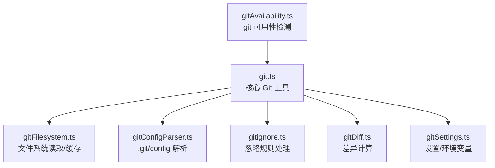
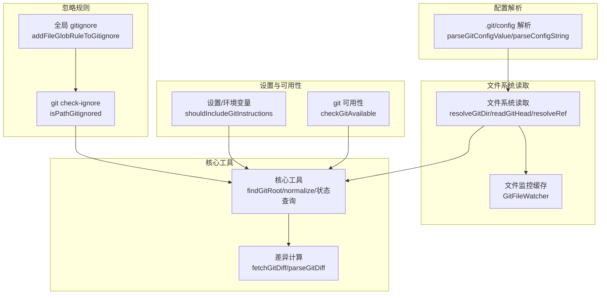
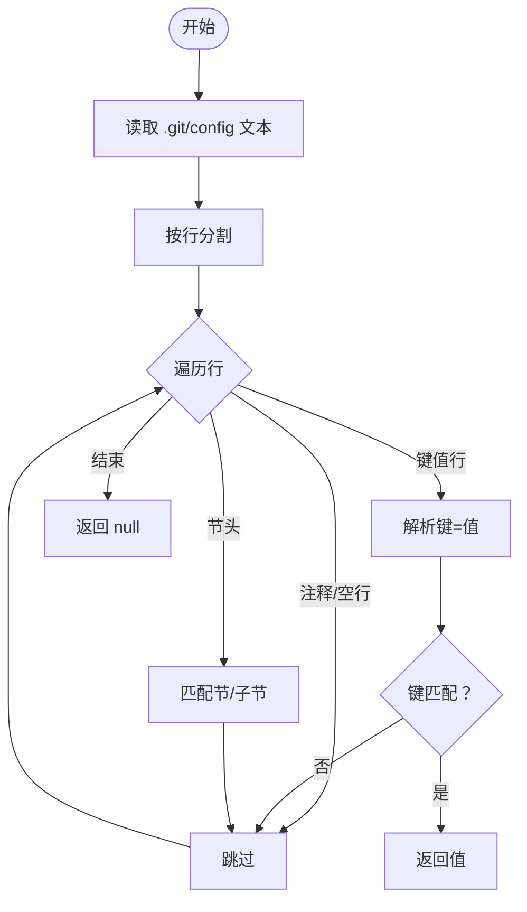
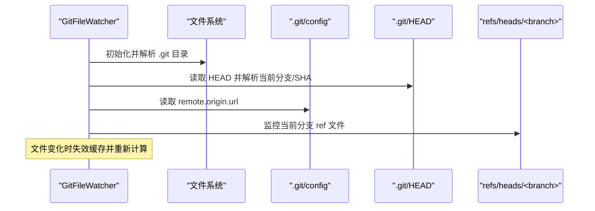
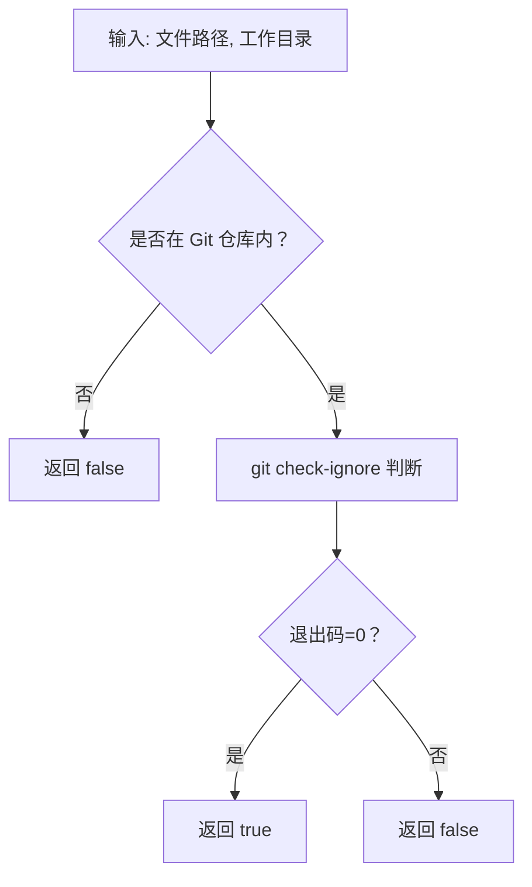
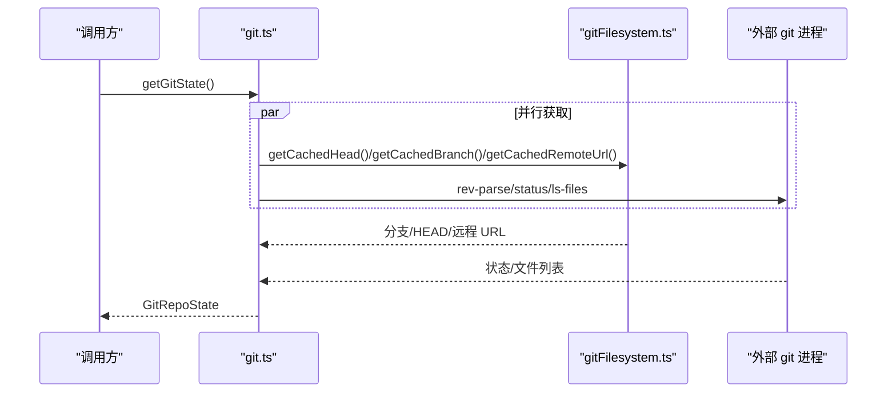
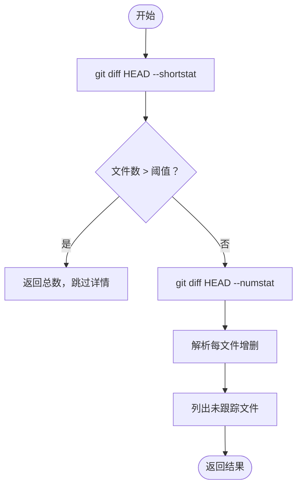
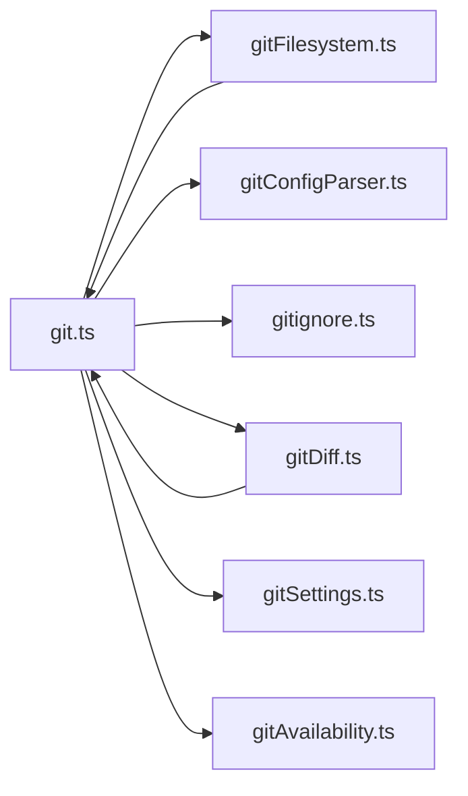

# Git 工具函数

<cite>
**本文档引用的文件**
- [src/utils/git.ts](file://src/utils/git.ts)
- [src/utils/git/gitConfigParser.ts](file://src/utils/git/gitConfigParser.ts)
- [src/utils/git/gitFilesystem.ts](file://src/utils/git/gitFilesystem.ts)
- [src/utils/git/gitignore.ts](file://src/utils/git/gitignore.ts)
- [src/utils/gitDiff.ts](file://src/utils/gitDiff.ts)
- [src/utils/gitSettings.ts](file://src/utils/gitSettings.ts)
- [src/utils/plugins/gitAvailability.ts](file://src/utils/plugins/gitAvailability.ts)
- [src/utils/__tests__/git.test.ts](file://src/utils/__tests__/git.test.ts)
- [src/utils/git/__tests__/gitConfigParser.test.ts](file://src/utils/git/__tests__/gitConfigParser.test.ts)
</cite>

## 目录
1. [简介](#简介)
2. [项目结构](#项目结构)
3. [核心组件](#核心组件)
4. [架构总览](#架构总览)
5. [详细组件分析](#详细组件分析)
6. [依赖关系分析](#依赖关系分析)
7. [性能考量](#性能考量)
8. [故障排查指南](#故障排查指南)
9. [结论](#结论)
10. [附录](#附录)

## 简介
本文件面向 Git 工具函数的技术文档，覆盖以下能力：
- Git 配置解析：从 .git/config 解析指定节与键值，支持大小写规则、转义与注释处理。
- 文件系统操作：基于文件系统直接读取 .git 目录、HEAD、refs、packed-refs 等，避免频繁调用外部进程；提供安全校验与缓存机制。
- 忽略规则处理：通过 git 命令检查路径是否被忽略；支持向全局 gitignore 添加规则。
- Git 仓库状态与操作：仓库根目录定位、规范化的远程 URL、分支/HEAD/默认分支/远程 URL 缓存、工作树数量、浅克隆检测、状态查询（干净/未推送/变更文件）、问题上报状态保留等。
- 差异计算：快速统计（--shortstat/numstat）与按需加载差异块，支持未跟踪文件与二进制文件处理。
- 可用性与设置：检测系统中 git 是否可用并缓存结果；根据用户设置控制相关行为。

## 项目结构
围绕 Git 的工具函数主要分布在以下模块：
- 核心 Git 工具：src/utils/git.ts
- Git 配置解析器：src/utils/git/gitConfigParser.ts
- 文件系统读取与缓存：src/utils/git/gitFilesystem.ts
- 忽略规则处理：src/utils/git/gitignore.ts
- 差异计算：src/utils/gitDiff.ts
- 设置与环境变量：src/utils/gitSettings.ts
- Git 可用性检测：src/utils/plugins/gitAvailability.ts
- 测试：src/utils/__tests__/git.test.ts、src/utils/git/__tests__/gitConfigParser.test.ts

图表来源
- [src/utils/git.ts:1-927](file://src/utils/git.ts#L1-L927)
- [src/utils/git/gitFilesystem.ts:1-700](file://src/utils/git/gitFilesystem.ts#L1-L700)
- [src/utils/git/gitConfigParser.ts:1-278](file://src/utils/git/gitConfigParser.ts#L1-L278)
- [src/utils/git/gitignore.ts:1-100](file://src/utils/git/gitignore.ts#L1-L100)
- [src/utils/gitDiff.ts:1-533](file://src/utils/gitDiff.ts#L1-L533)
- [src/utils/gitSettings.ts:1-19](file://src/utils/gitSettings.ts#L1-L19)
- [src/utils/plugins/gitAvailability.ts:1-70](file://src/utils/plugins/gitAvailability.ts#L1-L70)

章节来源
- [src/utils/git.ts:1-927](file://src/utils/git.ts#L1-L927)
- [src/utils/git/gitFilesystem.ts:1-700](file://src/utils/git/gitFilesystem.ts#L1-L700)
- [src/utils/git/gitConfigParser.ts:1-278](file://src/utils/git/gitConfigParser.ts#L1-L278)
- [src/utils/git/gitignore.ts:1-100](file://src/utils/git/gitignore.ts#L1-L100)
- [src/utils/gitDiff.ts:1-533](file://src/utils/gitDiff.ts#L1-L533)
- [src/utils/gitSettings.ts:1-19](file://src/utils/gitSettings.ts#L1-L19)
- [src/utils/plugins/gitAvailability.ts:1-70](file://src/utils/plugins/gitAvailability.ts#L1-L70)

## 核心组件
- Git 配置解析器
  - 功能：解析 .git/config 字符串或文件，按节/子节/键查找首个匹配值；支持大小写规则、引号、转义、行内注释。
  - 关键导出：parseGitConfigValue、parseConfigString。
  - 复杂度：线性扫描，时间复杂度 O(n)，n 为行数；空间复杂度 O(1)（不计输入）。
- 文件系统读取与缓存
  - 功能：解析 .git/HEAD、解析 refs（松散/打包）、读取 commondir、解析工作树 HEAD、读取远程 URL、浅克隆检测、工作树计数；通过文件监控缓存分支/HEAD/远程 URL/默认分支。
  - 关键导出：resolveGitDir、readGitHead、resolveRef、getCommonDir、readRawSymref、getCachedBranch、getCachedHead、getCachedRemoteUrl、getCachedDefaultBranch、isShallowClone、getWorktreeCountFromFs。
  - 安全性：对 ref 名称与 SHA 进行白名单校验，防止路径穿越与注入。
- 忽略规则处理
  - 功能：通过 git check-ignore 判断路径是否被忽略；向全局 .config/git/ignore 添加规则（若尚未被任何 ignore 规则覆盖）。
  - 关键导出：isPathGitignored、getGlobalGitignorePath、addFileGlobRuleToGitignore。
- Git 工具函数
  - 功能：仓库根定位（含工作树解析）、规范化远程 URL、生成远程 URL 哈希、检测 HEAD 是否跟踪远程、是否存在未推送提交、是否干净、变更文件列表、文件状态拆分、工作树数量、自动清理到干净状态的 stash、仓库状态聚合、GitHub 仓库识别、问题上报状态保留（含 untracked 文件捕获与二进制文件处理限制）。
  - 关键导出：findGitRoot/findCanonicalGitRoot、normalizeGitRemoteUrl/getRepoRemoteHash、getIsHeadOnRemote/hasUnpushedCommits/getIsClean/getChangedFiles/getFileStatus、getWorktreeCount、stashToCleanState、getGitState/getGithubRepo、preserveGitStateForIssue。
- 差异计算
  - 功能：快速统计（--shortstat/numstat），按需加载差异块（hunks），支持未跟踪文件、二进制文件、超大文件跳过、每文件行数限制；单文件差异（PR 类比）。
  - 关键导出：fetchGitDiff/fetchGitDiffHunks、parseGitNumstat/parseGitDiff/parseShortstat、fetchSingleFileGitDiff。
- 设置与可用性
  - 功能：根据环境变量与设置控制是否包含 Git 指令；检测系统中 git 是否可用并缓存结果。
  - 关键导出：shouldIncludeGitInstructions、checkGitAvailable/markGitUnavailable/clearGitAvailabilityCache。

章节来源
- [src/utils/git/gitConfigParser.ts:1-278](file://src/utils/git/gitConfigParser.ts#L1-L278)
- [src/utils/git/gitFilesystem.ts:1-700](file://src/utils/git/gitFilesystem.ts#L1-L700)
- [src/utils/git/gitignore.ts:1-100](file://src/utils/git/gitignore.ts#L1-L100)
- [src/utils/git.ts:1-927](file://src/utils/git.ts#L1-L927)
- [src/utils/gitDiff.ts:1-533](file://src/utils/gitDiff.ts#L1-L533)
- [src/utils/gitSettings.ts:1-19](file://src/utils/gitSettings.ts#L1-L19)
- [src/utils/plugins/gitAvailability.ts:1-70](file://src/utils/plugins/gitAvailability.ts#L1-L70)

## 架构总览
下图展示 Git 工具函数的模块交互与数据流：

图表来源
- [src/utils/git/gitConfigParser.ts:1-278](file://src/utils/git/gitConfigParser.ts#L1-L278)
- [src/utils/git/gitFilesystem.ts:1-700](file://src/utils/git/gitFilesystem.ts#L1-L700)
- [src/utils/git/gitignore.ts:1-100](file://src/utils/git/gitignore.ts#L1-L100)
- [src/utils/git.ts:1-927](file://src/utils/git.ts#L1-L927)
- [src/utils/gitDiff.ts:1-533](file://src/utils/gitDiff.ts#L1-L533)
- [src/utils/gitSettings.ts:1-19](file://src/utils/gitSettings.ts#L1-L19)
- [src/utils/plugins/gitAvailability.ts:1-70](file://src/utils/plugins/gitAvailability.ts#L1-L70)

## 详细组件分析

### Git 配置解析器
- 设计要点
  - 支持节名大小写不敏感、子节名大小写敏感、键名大小写不敏感。
  - 值解析支持引号、反斜杠转义、行内注释（# 或 ;）。
  - 提供从文件与字符串两种入口，便于测试与复用。
- 数据结构与算法
  - 时间复杂度 O(n)；空间复杂度 O(1)。
- 错误处理
  - 文件不存在或解析失败时返回空值，保证上层健壮性。
- 使用示例（路径）
  - [parseGitConfigValue:18-30](file://src/utils/git/gitConfigParser.ts#L18-L30)
  - [parseConfigString:36-73](file://src/utils/git/gitConfigParser.ts#L36-L73)

图表来源
- [src/utils/git/gitConfigParser.ts:36-73](file://src/utils/git/gitConfigParser.ts#L36-L73)

章节来源
- [src/utils/git/gitConfigParser.ts:1-278](file://src/utils/git/gitConfigParser.ts#L1-L278)
- [src/utils/git/__tests__/gitConfigParser.test.ts:1-139](file://src/utils/git/__tests__/gitConfigParser.test.ts#L1-L139)

### 文件系统读取与缓存（GitFilesystem）
- 设计要点
  - 通过文件系统直接读取 .git/HEAD、refs、packed-refs，避免频繁 spawn 子进程。
  - GitFileWatcher 基于 fs.watchFile 监控 HEAD/config/当前分支 ref，惰性初始化并在文件变化时失效缓存。
  - 对工作树与子模块进行特殊处理：解析 .git 文件中的 gitdir，读取 commondir，确保共享引用目录正确。
  - 安全校验：对 ref 名称与 SHA 进行白名单校验，拒绝危险字符与路径穿越。
- 关键函数
  - [resolveGitDir:40-76](file://src/utils/git/gitFilesystem.ts#L40-L76)
  - [readGitHead:149-183](file://src/utils/git/gitFilesystem.ts#L149-L183)
  - [resolveRef:203-266](file://src/utils/git/gitFilesystem.ts#L203-L266)
  - [getCommonDir:273-280](file://src/utils/git/gitFilesystem.ts#L273-L280)
  - [readRawSymref:287-309](file://src/utils/git/gitFilesystem.ts#L287-L309)
  - [getCachedBranch/getCachedHead/getCachedRemoteUrl/getCachedDefaultBranch:568-582](file://src/utils/git/gitFilesystem.ts#L568-L582)
  - [isShallowClone/getWorktreeCountFromFs:667-700](file://src/utils/git/gitFilesystem.ts#L667-L700)

图表来源
- [src/utils/git/gitFilesystem.ts:333-496](file://src/utils/git/gitFilesystem.ts#L333-L496)

章节来源
- [src/utils/git/gitFilesystem.ts:1-700](file://src/utils/git/gitFilesystem.ts#L1-L700)

### 忽略规则处理（gitignore）
- 设计要点
  - 通过 git check-ignore 判断路径是否被忽略，遵循仓库 .gitignore、.git/info/exclude、全局 gitignore 的优先级。
  - 向全局 .config/git/ignore 添加规则前先检查是否已被现有规则覆盖，避免重复。
- 关键函数
  - [isPathGitignored:23-37](file://src/utils/git/gitignore.ts#L23-L37)
  - [getGlobalGitignorePath:43-45](file://src/utils/git/gitignore.ts#L43-L45)
  - [addFileGlobRuleToGitignore:53-99](file://src/utils/git/gitignore.ts#L53-L99)

图表来源
- [src/utils/git/gitignore.ts:23-37](file://src/utils/git/gitignore.ts#L23-L37)

章节来源
- [src/utils/git/gitignore.ts:1-100](file://src/utils/git/gitignore.ts#L1-L100)

### 核心 Git 工具函数（git.ts）
- 设计要点
  - 仓库根定位：向上遍历目录寻找 .git（支持工作树/子模块），并提供规范化的“主仓库根”解析。
  - 远程 URL 规范化与哈希：统一 SSH/HTTPS/代理 URL 格式，生成短哈希用于唯一标识。
  - 状态查询：HEAD 是否跟踪远程、是否存在未推送提交、是否干净、变更文件列表、文件状态拆分、工作树数量。
  - 问题上报状态保留：在存在远程/浅克隆等情况下选择合适的回退策略，捕获未跟踪文件并限制大小与数量。
  - 安全性：对工作树链路进行严格验证，防止恶意仓库绕过信任对话执行钩子。
- 关键函数
  - [findGitRoot/findCanonicalGitRoot:27-210](file://src/utils/git.ts#L27-L210)
  - [normalizeGitRemoteUrl/getRepoRemoteHash:283-338](file://src/utils/git.ts#L283-L338)
  - [getIsHeadOnRemote/hasUnpushedCommits/getIsClean/getChangedFiles/getFileStatus:340-417](file://src/utils/git.ts#L340-L417)
  - [getWorktreeCount/stashToCleanState:419-461](file://src/utils/git.ts#L419-L461)
  - [getGitState/getGithubRepo:472-521](file://src/utils/git.ts#L472-L521)
  - [preserveGitStateForIssue:724-845](file://src/utils/git.ts#L724-L845)
  - [isCurrentDirectoryBareGitRepo:875-927](file://src/utils/git.ts#L875-L927)

图表来源
- [src/utils/git.ts:472-502](file://src/utils/git.ts#L472-L502)
- [src/utils/git/gitFilesystem.ts:568-582](file://src/utils/git/gitFilesystem.ts#L568-L582)

章节来源
- [src/utils/git.ts:1-927](file://src/utils/git.ts#L1-L927)

### 差异计算（gitDiff.ts）
- 设计要点
  - 快速统计：先用 --shortstat 获取文件数与增删行数，超过阈值时仅返回总数，避免加载大量内容。
  - 详细统计：用 --numstat 聚合每文件增删行数，支持二进制文件标记。
  - 按需加载：差异块（hunks）通过 fetchGitDiffHunks 按需解析，避免轮询时的昂贵调用。
  - 未跟踪文件：列出未跟踪文件并作为“新增”显示，不读取内容。
  - 单文件差异：对已跟踪文件生成 PR 类比差异；对未跟踪文件生成合成差异。
- 关键函数
  - [fetchGitDiff/fetchGitDiffHunks:49-135](file://src/utils/gitDiff.ts#L49-L135)
  - [parseGitNumstat/parseGitDiff/parseShortstat:148-382](file://src/utils/gitDiff.ts#L148-L382)
  - [fetchSingleFileGitDiff:405-441](file://src/utils/gitDiff.ts#L405-L441)

图表来源
- [src/utils/gitDiff.ts:49-108](file://src/utils/gitDiff.ts#L49-L108)

章节来源
- [src/utils/gitDiff.ts:1-533](file://src/utils/gitDiff.ts#L1-L533)

### 设置与可用性（gitSettings、gitAvailability）
- 设计要点
  - 根据环境变量与初始设置决定是否包含 Git 指令提示。
  - 检测系统中 git 是否可用并缓存结果，避免重复查询 PATH。
- 关键函数
  - [shouldIncludeGitInstructions:13-18](file://src/utils/gitSettings.ts#L13-L18)
  - [checkGitAvailable/markGitUnavailable/clearGitAvailabilityCache:42-70](file://src/utils/plugins/gitAvailability.ts#L42-L70)

章节来源
- [src/utils/gitSettings.ts:1-19](file://src/utils/gitSettings.ts#L1-L19)
- [src/utils/plugins/gitAvailability.ts:1-70](file://src/utils/plugins/gitAvailability.ts#L1-L70)

## 依赖关系分析
- 模块耦合
  - git.ts 依赖 gitFilesystem.ts（文件系统读取）、gitConfigParser.ts（配置解析）、gitignore.ts（忽略规则）、gitDiff.ts（差异计算）、gitSettings.ts（设置）、plugins/gitAvailability.ts（可用性）。
  - gitFilesystem.ts 依赖 git.ts 的 findGitRoot 以解析 .git 目录。
  - gitDiff.ts 依赖 git.ts 的 getIsGit、findGitRoot 等工具。
- 外部依赖
  - 执行 git 子进程（通过封装的 execFileNoThrowWithCwd/execFileNoThrow）。
  - 文件系统 API（fs/promises、fs.watchFile/unwatchFile）。
  - 缓存与工具（lodash-es/memoize、memoizeWithLRU）。

图表来源
- [src/utils/git.ts:1-25](file://src/utils/git.ts#L1-L25)
- [src/utils/git/gitFilesystem.ts:15-22](file://src/utils/git/gitFilesystem.ts#L15-L22)
- [src/utils/gitDiff.ts:1-14](file://src/utils/gitDiff.ts#L1-L14)

章节来源
- [src/utils/git.ts:1-25](file://src/utils/git.ts#L1-L25)
- [src/utils/git/gitFilesystem.ts:15-22](file://src/utils/git/gitFilesystem.ts#L15-L22)
- [src/utils/gitDiff.ts:1-14](file://src/utils/gitDiff.ts#L1-L14)

## 性能考量
- 文件系统读取优先：gitFilesystem.ts 通过直接读取 .git/HEAD、refs、packed-refs 等替代频繁 spawn，显著降低开销。
- 缓存与惰性初始化：GitFileWatcher 在首次访问时启动文件监控，后续读取直接命中缓存；HEAD/分支/远程 URL/默认分支均缓存。
- 差异计算优化：
  - 先用 --shortstat 快速判断是否需要进一步解析。
  - 每文件行数与文件数限制，避免内存峰值过高。
  - 二进制文件与超大文件跳过，减少 I/O。
- 远程 URL 规范化与哈希：仅在需要时计算，且使用轻量正则与字符串处理。
- 大型仓库表现：
  - findGitRoot 采用自顶向下扫描，结合 LRU 缓存，编辑多文件时避免重复计算。
  - preserveGitStateForIssue 在浅克隆或无远程时采用降级模式，避免昂贵的 format-patch 计算。

[本节为通用性能讨论，无需特定文件分析]

## 故障排查指南
- 常见问题与对策
  - 无法检测到 Git：确认 PATH 中存在 git；若系统存在 xcrun shim 导致执行失败，可调用 markGitUnavailable() 使会话内后续检查返回 false。
  - 忽略规则无效：确认路径是否已在本地 .gitignore、.git/info/exclude 或全局 .config/git/ignore 中被覆盖；必要时使用 addFileGlobRuleToGitignore 添加规则。
  - 工作树/子模块路径解析异常：检查 .git 文件中的 gitdir 与 commondir 是否正确；git.ts 对工作树链路进行了严格验证，若不满足条件将回退到原始根。
  - 差异计算为空：在合并/变基/挑选/回滚等临时状态下会跳过 diff 计算；等待操作完成后再试。
  - 问题上报状态保留失败：在浅克隆或无远程时会降级为 HEAD-only 模式；检查远程配置与网络连通性。
- 相关函数
  - [checkGitAvailable/markGitUnavailable:42-61](file://src/utils/plugins/gitAvailability.ts#L42-L61)
  - [isPathGitignored/addFileGlobRuleToGitignore:23-99](file://src/utils/git/gitignore.ts#L23-L99)
  - [isInTransientGitState:307-326](file://src/utils/gitDiff.ts#L307-L326)
  - [preserveGitStateForIssue:724-845](file://src/utils/git.ts#L724-L845)

章节来源
- [src/utils/plugins/gitAvailability.ts:1-70](file://src/utils/plugins/gitAvailability.ts#L1-L70)
- [src/utils/git/gitignore.ts:1-100](file://src/utils/git/gitignore.ts#L1-L100)
- [src/utils/gitDiff.ts:307-326](file://src/utils/gitDiff.ts#L307-L326)
- [src/utils/git.ts:724-845](file://src/utils/git.ts#L724-L845)

## 结论
该套 Git 工具函数通过“文件系统读取 + 缓存 + 外部命令”的混合策略，在保证正确性的同时兼顾性能与安全性。配置解析、忽略规则、仓库状态与差异计算等能力相互解耦，既可独立使用，也可组合实现复杂场景（如问题上报状态保留）。建议在大型仓库中优先使用文件系统读取与缓存接口，并配合差异计算的按需加载策略，以获得最佳体验。

[本节为总结性内容，无需特定文件分析]

## 附录
- 实际使用示例（路径）
  - 获取仓库根与规范化远程 URL
    - [findGitRoot/findCanonicalGitRoot:27-210](file://src/utils/git.ts#L27-L210)
    - [normalizeGitRemoteUrl:283-321](file://src/utils/git.ts#L283-L321)
  - 查询仓库状态
    - [getGitState:472-502](file://src/utils/git.ts#L472-L502)
    - [getFileStatus:389-417](file://src/utils/git.ts#L389-L417)
  - 保存到干净状态
    - [stashToCleanState:429-461](file://src/utils/git.ts#L429-L461)
  - 生成问题上报状态
    - [preserveGitStateForIssue:724-845](file://src/utils/git.ts#L724-L845)
  - 差异计算
    - [fetchGitDiff:49-108](file://src/utils/gitDiff.ts#L49-L108)
    - [fetchSingleFileGitDiff:405-441](file://src/utils/gitDiff.ts#L405-L441)
  - 忽略规则
    - [isPathGitignored:23-37](file://src/utils/git/gitignore.ts#L23-L37)
    - [addFileGlobRuleToGitignore:53-99](file://src/utils/git/gitignore.ts#L53-L99)
  - 配置解析
    - [parseGitConfigValue:18-30](file://src/utils/git/gitConfigParser.ts#L18-L30)
  - 可用性与设置
    - [checkGitAvailable:42-44](file://src/utils/plugins/gitAvailability.ts#L42-L44)
    - [shouldIncludeGitInstructions:13-18](file://src/utils/gitSettings.ts#L13-L18)

章节来源
- [src/utils/git.ts:27-502](file://src/utils/git.ts#L27-L502)
- [src/utils/gitDiff.ts:49-441](file://src/utils/gitDiff.ts#L49-L441)
- [src/utils/git/gitignore.ts:23-99](file://src/utils/git/gitignore.ts#L23-L99)
- [src/utils/git/gitConfigParser.ts:18-30](file://src/utils/git/gitConfigParser.ts#L18-L30)
- [src/utils/plugins/gitAvailability.ts:42-44](file://src/utils/plugins/gitAvailability.ts#L42-L44)
- [src/utils/gitSettings.ts:13-18](file://src/utils/gitSettings.ts#L13-L18)