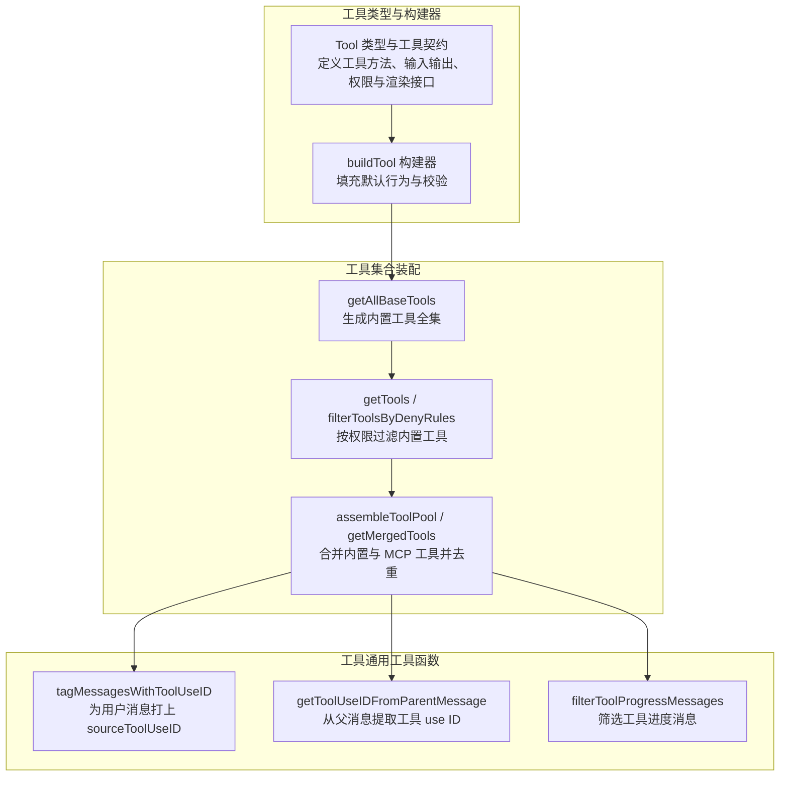
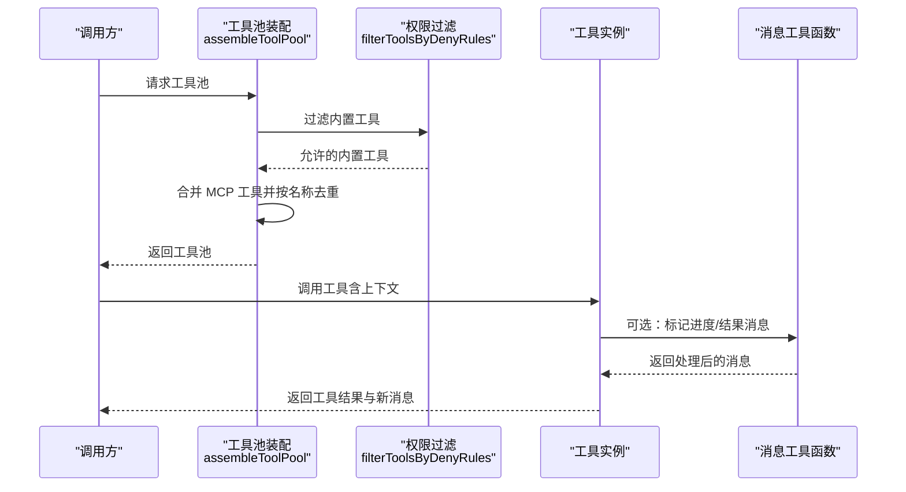
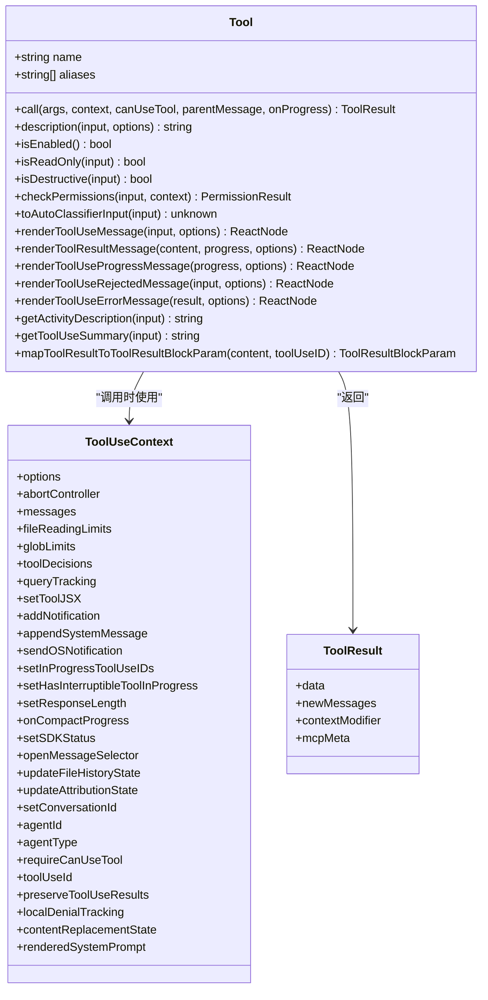
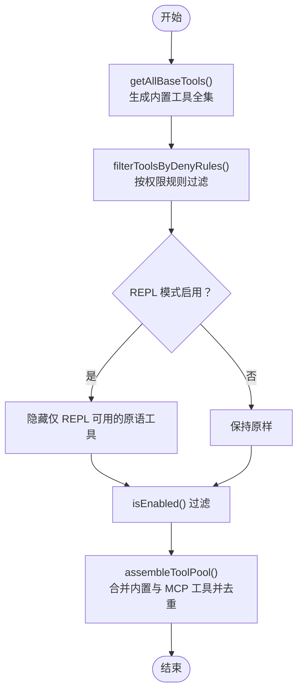
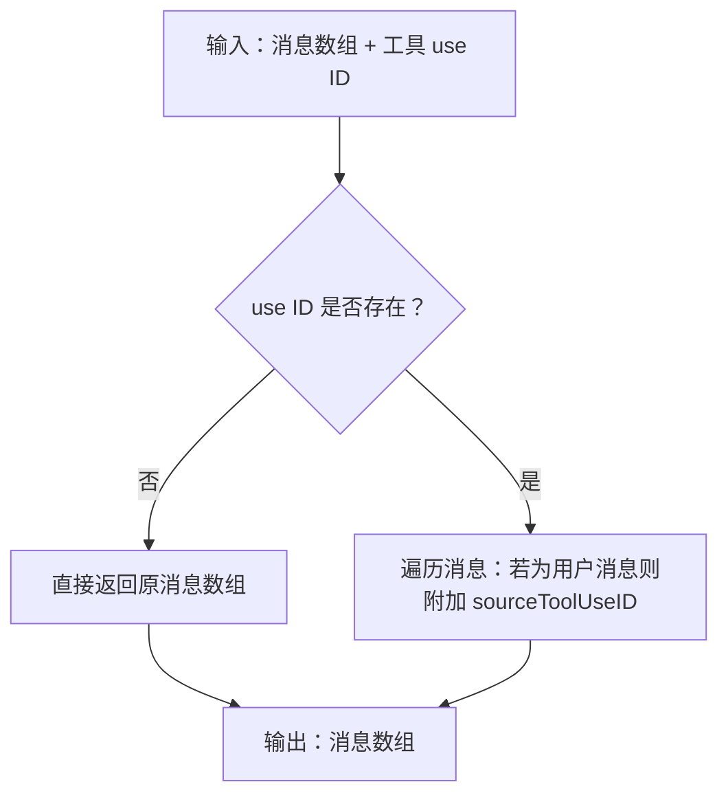
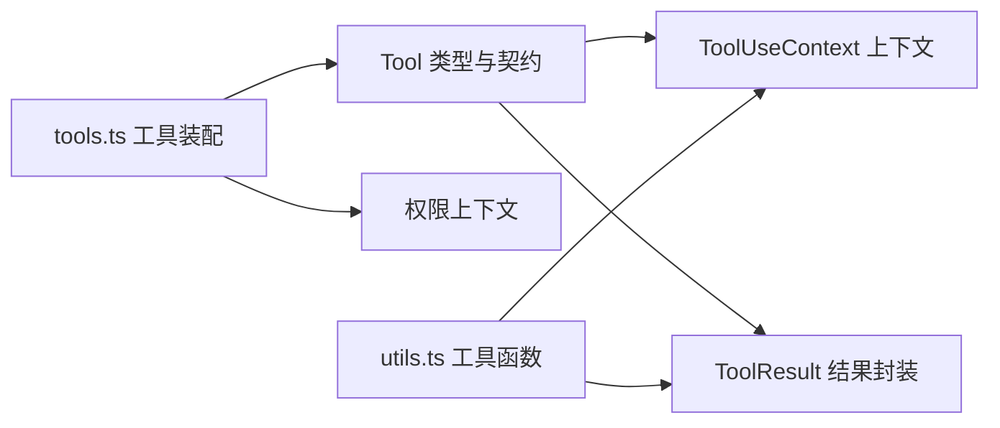

# 工具函数 API

<cite>
**本文引用的文件**
- [Tool.ts](file://src/Tool.ts)
- [tools.ts](file://src/tools.ts)
- [utils.ts](file://src/tools/utils.ts)
- [Tool.ts（测试）](file://src/__tests__/Tool.test.ts)
- [工具系统测试](file://src/__tests__/tools.test.ts)
</cite>

## 目录
1. [简介](#简介)
2. [项目结构](#项目结构)
3. [核心组件](#核心组件)
4. [架构总览](#架构总览)
5. [详细组件分析](#详细组件分析)
6. [依赖分析](#依赖分析)
7. [性能考虑](#性能考虑)
8. [故障排查指南](#故障排查指南)
9. [结论](#结论)
10. [附录](#附录)

## 简介
本文件面向 Claude Code Best 的“工具函数 API”，系统性梳理与工具调用、权限控制、用户输入处理及消息处理相关的核心函数与类型定义。内容覆盖：
- 工具接口规范：工具类型、调用上下文、进度回调、结果封装等
- 权限控制函数：工具匹配、权限检查、规则过滤
- 用户输入处理函数：消息标记、父消息中提取工具 use ID
- 消息处理函数：工具进度消息筛选、消息标记与去重
- 使用示例与最佳实践：如何在不同场景下正确调用与组合这些函数
- 性能特性与内存使用：时间复杂度、空间复杂度与缓存策略
- 错误处理与调试辅助：常见异常路径、断言与测试参考

## 项目结构
工具系统由“工具类型与构建器”“工具集合装配”“工具通用工具函数”三部分组成：
- 工具类型与构建器：定义工具契约、默认行为与构建器
- 工具集合装配：按权限与特性开关组装内置工具与 MCP 工具
- 工具通用工具函数：消息标记、父消息解析、进度消息筛选等

图表来源
- [Tool.ts:362-792](file://src/Tool.ts#L362-L792)
- [tools.ts:191-387](file://src/tools.ts#L191-L387)
- [utils.ts:12-40](file://src/tools/utils.ts#L12-L40)

章节来源
- [Tool.ts:1-793](file://src/Tool.ts#L1-L793)
- [tools.ts:1-388](file://src/tools.ts#L1-L388)
- [utils.ts:1-41](file://src/tools/utils.ts#L1-L41)

## 核心组件
本节聚焦工具系统的关键类型与函数，帮助快速理解接口与职责边界。

- 工具类型与契约
  - 工具对象包含名称、别名、输入/输出模式、描述、权限检查、并发安全、只读/破坏性判定、活动描述、自动分类输入、渲染接口、进度与结果消息渲染等能力
  - 提供工具匹配与查找函数，支持按主名或别名定位工具
- 工具构建器
  - buildTool 将部分定义与默认行为合并，确保工具具备一致的默认实现
- 工具集合装配
  - getAllBaseTools 产出内置工具全集，受环境变量与特性开关影响
  - getTools 在内置工具基础上按权限规则与 REPL 模式进行过滤
  - assembleToolPool 合并内置与 MCP 工具，并按名称去重，内置优先
  - getMergedTools 返回未去重的完整工具池，用于统计与搜索阈值计算
- 工具通用工具函数
  - tagMessagesWithToolUseID：为用户消息附加 sourceToolUseID，避免 UI 重复显示“运行中”
  - getToolUseIDFromParentMessage：从父消息的工具块中提取 use ID
  - filterToolProgressMessages：过滤掉钩子进度，保留工具进度消息

章节来源
- [Tool.ts:158-792](file://src/Tool.ts#L158-L792)
- [tools.ts:177-387](file://src/tools.ts#L177-L387)
- [utils.ts:12-40](file://src/tools/utils.ts#L12-L40)

## 架构总览
工具系统通过“类型契约 + 构建器 + 装配器 + 通用工具函数”的分层设计，实现：
- 统一的工具调用协议与可观察性接口
- 基于权限规则的动态过滤与去重
- 面向 UI 的消息标记与进度筛选
- 对外暴露稳定的工具池与工具查询接口

图表来源
- [tools.ts:343-365](file://src/tools.ts#L343-L365)
- [tools.ts:260-267](file://src/tools.ts#L260-L267)
- [utils.ts:12-25](file://src/tools/utils.ts#L12-L25)

## 详细组件分析

### 工具类型与构建器（Tool.ts）
- 关键类型
  - Tool：工具契约，包含名称、别名、输入/输出模式、描述、权限检查、并发安全、只读/破坏性、活动描述、自动分类输入、渲染接口、进度与结果消息渲染等
  - ToolUseContext：工具调用上下文，包含命令列表、调试开关、模型、工具集合、MCP 客户端与资源、会话状态、通知与 UI 回调、文件读取/全局限制、工具决策追踪、提示请求回调、工具 use ID、内容替换状态等
  - ToolResult：工具结果封装，包含数据、新增消息、上下文修改器与 MCP 元数据
  - 工具进度类型：AgentToolProgress、BashProgress、MCPProgress、REPLToolProgress、SkillToolProgress、TaskOutputProgress、WebSearchProgress 等
- 关键函数
  - toolMatchesName：按主名或别名匹配工具
  - findToolByName：在工具集合中查找工具
  - filterToolProgressMessages：过滤掉钩子进度，仅保留工具进度消息
  - buildTool：将部分定义与默认行为合并，确保工具具备一致的默认实现
- 默认行为
  - 未显式实现的方法采用安全默认：启用、非并发安全、非只读、非破坏性、允许权限、空自动分类输入、名称即用户可见名

图表来源
- [Tool.ts:362-792](file://src/Tool.ts#L362-L792)

章节来源
- [Tool.ts:158-792](file://src/Tool.ts#L158-L792)

### 工具集合装配（tools.ts）
- getAllBaseTools：生成内置工具全集，依据环境变量与特性开关选择性包含工具（如 PowerShell、Web 浏览器、任务管理、工作树模式、协调员模式、REPL、工作流脚本等）
- getTools：在内置工具基础上按权限规则与 REPL 模式过滤，同时应用 isEnabled 判定
- filterToolsByDenyRules：根据权限上下文中的拒绝规则过滤工具，支持 MCP 服务器前缀规则
- assembleToolPool：合并内置与 MCP 工具，按名称排序并去重，内置优先
- getMergedTools：返回未去重的完整工具池，便于统计与阈值计算

图表来源
- [tools.ts:191-325](file://src/tools.ts#L191-L325)

章节来源
- [tools.ts:177-387](file://src/tools.ts#L177-L387)

### 工具通用工具函数（utils.ts）
- tagMessagesWithToolUseID：当存在工具 use ID 时，为用户消息附加 sourceToolUseID，防止 UI 重复显示“运行中”
- getToolUseIDFromParentMessage：从父消息的工具块中提取对应工具的 use ID，用于消息关联与去重
- filterToolProgressMessages：过滤掉钩子进度消息，仅保留工具进度消息

图表来源
- [utils.ts:12-25](file://src/tools/utils.ts#L12-L25)

章节来源
- [utils.ts:12-40](file://src/tools/utils.ts#L12-L40)

## 依赖分析
- 工具类型与构建器依赖
  - ToolUseContext 引入命令、调试、模型、工具集合、MCP 客户端与资源、会话状态、通知与 UI 回调、文件读取/全局限制、工具决策追踪、提示请求回调、工具 use ID、内容替换状态等
  - 工具结果 ToolResult 支持注入新消息与上下文修改器，便于跨工具协作
- 工具集合装配依赖
  - 权限上下文 ToolPermissionContext 决定工具是否被过滤
  - 特性开关与环境变量控制工具可用性
  - MCP 工具与内置工具合并时按名称去重，内置优先
- 工具通用工具函数依赖
  - 消息类型（用户、附件、系统）与工具块结构（tool_use）

图表来源
- [Tool.ts:158-300](file://src/Tool.ts#L158-L300)
- [tools.ts:260-325](file://src/tools.ts#L260-L325)
- [utils.ts:12-40](file://src/tools/utils.ts#L12-L40)

章节来源
- [Tool.ts:158-300](file://src/Tool.ts#L158-L300)
- [tools.ts:260-325](file://src/tools.ts#L260-L325)
- [utils.ts:12-40](file://src/tools/utils.ts#L12-L40)

## 性能考虑
- 时间复杂度
  - 工具匹配与查找：O(n)，n 为工具数量
  - 权限过滤：O(k·m)，k 为工具数，m 为权限规则数（通常较小）
  - 工具池合并与去重：O((n+m) log(n+m))，主要由排序决定
  - 消息标记与进度筛选：O(p)，p 为消息/进度条目数
- 空间复杂度
  - 工具池装配：O(n+m)，存储内置与 MCP 工具副本
  - 消息处理：O(p)，复制消息数组并附加字段
- 缓存与稳定性
  - 工具池按名称排序以稳定提示缓存键，避免 MCP 工具插入导致的缓存失效
  - 内置工具优先策略保证缓存命中率与一致性

[本节为通用性能讨论，不直接分析具体文件]

## 故障排查指南
- 工具未出现在工具池
  - 检查权限上下文中的拒绝规则是否屏蔽该工具
  - 检查特性开关与环境变量是否禁用了该工具
  - 检查是否处于 REPL 模式且该工具被标记为仅 REPL 可用
- 工具调用无进度或 UI 不更新
  - 确认 onProgress 回调已传入工具调用流程
  - 使用 filterToolProgressMessages 确保仅传递工具进度消息
- 消息重复或“运行中”闪烁
  - 使用 tagMessagesWithToolUseID 为用户消息附加 sourceToolUseID
  - 确保父消息中存在正确的工具块（tool_use），以便 getToolUseIDFromParentMessage 提取 use ID
- 权限相关问题
  - 自定义工具需实现 checkPermissions 或确保默认允许策略满足需求
  - 若工具需要交互确认，确认 requiresUserInteraction 返回 true 并正确处理用户输入

章节来源
- [tools.ts:260-325](file://src/tools.ts#L260-L325)
- [utils.ts:12-40](file://src/tools/utils.ts#L12-L40)
- [Tool.ts:500-503](file://src/Tool.ts#L500-L503)

## 结论
工具函数 API 通过统一的类型契约、可配置的构建器与灵活的装配器，提供了高内聚、低耦合的工具体系。配合权限过滤、消息标记与进度筛选等通用工具函数，能够稳定支撑多场景下的工具调用与 UI 渲染。建议在扩展新工具时遵循以下原则：
- 明确工具的只读/破坏性与并发安全属性
- 实现必要的权限检查与自动分类输入
- 提供清晰的活动描述与结果渲染接口
- 使用工具池装配函数与消息工具函数确保一致性与可维护性

[本节为总结性内容，不直接分析具体文件]

## 附录

### 接口规范速查（函数与类型）
- 工具类型与契约
  - Tool：工具对象，包含名称、别名、输入/输出模式、描述、权限检查、并发安全、只读/破坏性、活动描述、自动分类输入、渲染接口、进度与结果消息渲染等
  - ToolUseContext：工具调用上下文，包含命令列表、调试开关、模型、工具集合、MCP 客户端与资源、会话状态、通知与 UI 回调、文件读取/全局限制、工具决策追踪、提示请求回调、工具 use ID、内容替换状态等
  - ToolResult：工具结果封装，包含数据、新增消息、上下文修改器与 MCP 元数据
  - 工具进度类型：AgentToolProgress、BashProgress、MCPProgress、REPLToolProgress、SkillToolProgress、TaskOutputProgress、WebSearchProgress 等
- 工具匹配与查找
  - toolMatchesName：按主名或别名匹配工具
  - findToolByName：在工具集合中查找工具
- 工具池装配
  - getAllBaseTools：生成内置工具全集
  - getTools：按权限与模式过滤内置工具
  - filterToolsByDenyRules：按权限规则过滤工具
  - assembleToolPool：合并内置与 MCP 工具并去重
  - getMergedTools：返回未去重的完整工具池
- 消息处理
  - tagMessagesWithToolUseID：为用户消息附加 sourceToolUseID
  - getToolUseIDFromParentMessage：从父消息提取工具 use ID
  - filterToolProgressMessages：过滤钩子进度，保留工具进度消息

章节来源
- [Tool.ts:158-792](file://src/Tool.ts#L158-L792)
- [tools.ts:177-387](file://src/tools.ts#L177-L387)
- [utils.ts:12-40](file://src/tools/utils.ts#L12-L40)

### 使用示例与最佳实践
- 在 REPL 模式下隐藏原语工具，仅通过 VM 访问
  - 使用 getTools 并结合 isReplModeEnabled 与 REPL_ONLY_TOOLS
- 合并内置与 MCP 工具并去重
  - 使用 assembleToolPool，内置工具优先
- 为用户消息附加 sourceToolUseID，避免 UI 重复显示
  - 使用 tagMessagesWithToolUseID
- 从父消息提取工具 use ID，用于消息关联
  - 使用 getToolUseIDFromParentMessage
- 过滤钩子进度，仅传递工具进度消息
  - 使用 filterToolProgressMessages

章节来源
- [tools.ts:270-325](file://src/tools.ts#L270-L325)
- [utils.ts:12-40](file://src/tools/utils.ts#L12-L40)

### 测试参考
- 工具类型与构建器测试
  - [Tool.ts（测试）](file://src/__tests__/Tool.test.ts)
- 工具系统装配与过滤测试
  - [工具系统测试](file://src/__tests__/tools.test.ts)

章节来源
- [Tool.ts（测试）](file://src/__tests__/Tool.test.ts)
- [工具系统测试](file://src/__tests__/tools.test.ts)