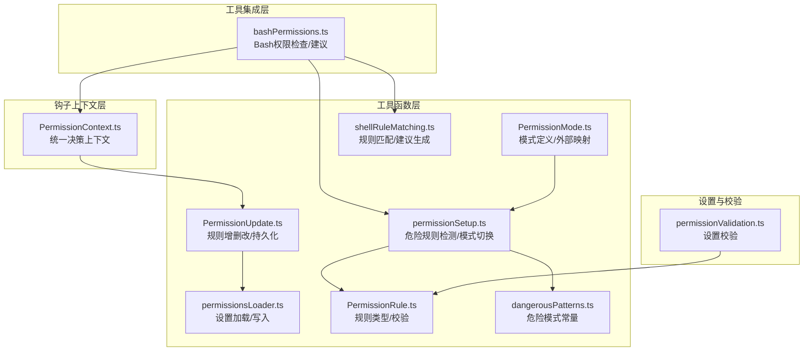
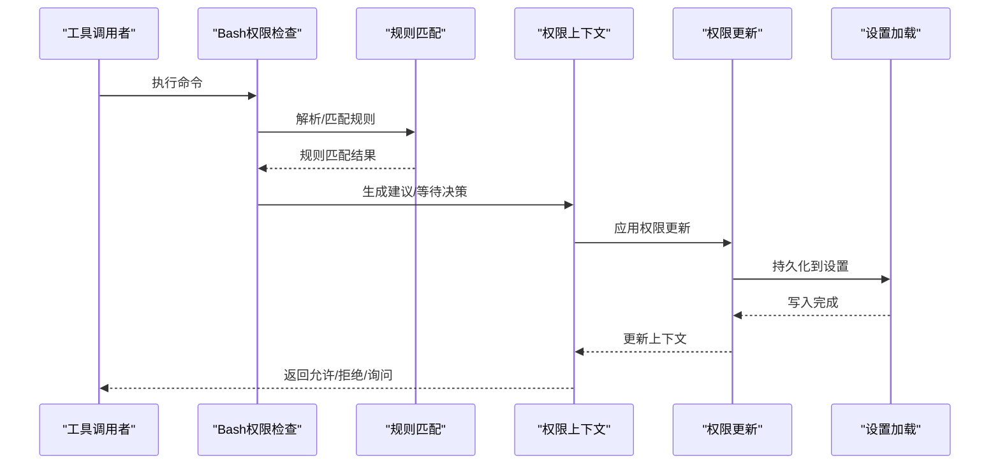
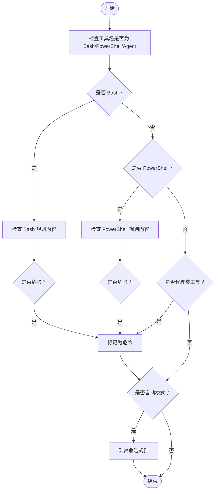
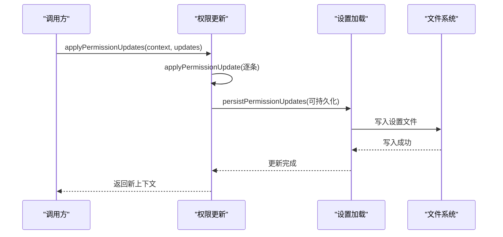
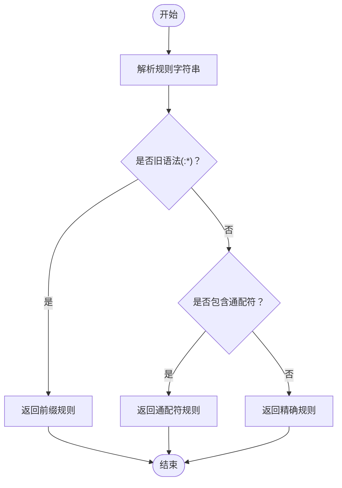
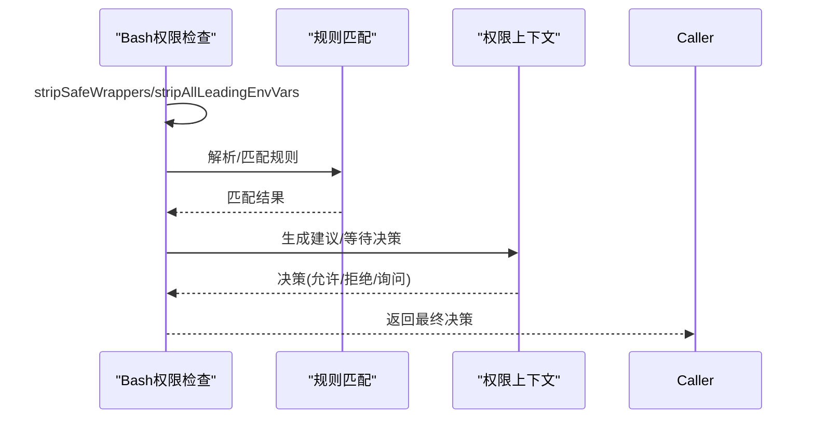
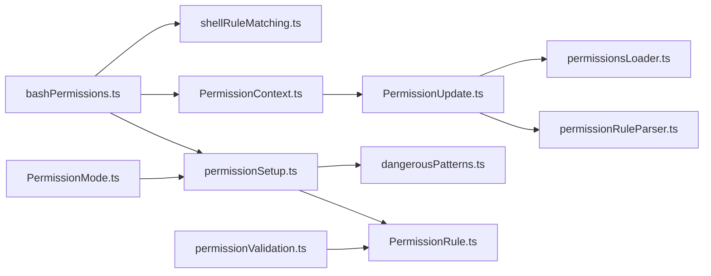

# 权限控制工具函数

<cite>
**本文档引用的文件**
- [permissionSetup.ts](file://src/utils/permissions/permissionSetup.ts)
- [PermissionUpdate.ts](file://src/utils/permissions/PermissionUpdate.ts)
- [permissionsLoader.ts](file://src/utils/permissions/permissionsLoader.ts)
- [PermissionRule.ts](file://src/utils/permissions/PermissionRule.ts)
- [PermissionMode.ts](file://src/utils/permissions/PermissionMode.ts)
- [dangerousPatterns.ts](file://src/utils/permissions/dangerousPatterns.ts)
- [shellRuleMatching.ts](file://src/utils/permissions/shellRuleMatching.ts)
- [bashPermissions.ts](file://src/tools/BashTool/bashPermissions.ts)
- [PermissionContext.ts](file://src/hooks/toolPermission/PermissionContext.ts)
- [permissionValidation.ts](file://src/utils/settings/permissionValidation.ts)
</cite>

## 目录
1. [简介](#简介)
2. [项目结构](#项目结构)
3. [核心组件](#核心组件)
4. [架构概览](#架构概览)
5. [详细组件分析](#详细组件分析)
6. [依赖关系分析](#依赖关系分析)
7. [性能考量](#性能考量)
8. [故障排除指南](#故障排除指南)
9. [结论](#结论)
10. [附录](#附录)

## 简介
本文件系统性梳理并文档化了权限控制工具函数，涵盖权限规则解析、Bash 命令分类器、权限验证与访问控制等核心能力。文档面向不同技术背景的读者，既提供高层架构视图，也包含代码级实现细节、数据流图、序列图与流程图，帮助开发者快速理解并正确使用权限系统。

## 项目结构
权限系统主要分布在以下模块：
- 工具函数层：规则解析、更新应用、危险规则检测、模式转换等
- 工具集成层：Bash 工具的权限检查与建议生成
- 钩子上下文层：统一的权限决策上下文与持久化
- 设置加载层：从多源设置加载与写入权限规则
- 模式与规则定义层：权限模式、规则值与行为的类型与校验

**图表来源**
- [permissionSetup.ts:1-1534](file://src/utils/permissions/permissionSetup.ts#L1-L1534)
- [PermissionUpdate.ts:1-390](file://src/utils/permissions/PermissionUpdate.ts#L1-L390)
- [permissionsLoader.ts:1-297](file://src/utils/permissions/permissionsLoader.ts#L1-L297)
- [PermissionRule.ts:1-41](file://src/utils/permissions/PermissionRule.ts#L1-L41)
- [PermissionMode.ts:1-142](file://src/utils/permissions/PermissionMode.ts#L1-L142)
- [dangerousPatterns.ts:1-81](file://src/utils/permissions/dangerousPatterns.ts#L1-L81)
- [shellRuleMatching.ts:1-229](file://src/utils/permissions/shellRuleMatching.ts#L1-L229)
- [bashPermissions.ts:1-2622](file://src/tools/BashTool/bashPermissions.ts#L1-L2622)
- [PermissionContext.ts:1-389](file://src/hooks/toolPermission/PermissionContext.ts#L1-L389)
- [permissionValidation.ts:238-262](file://src/utils/settings/permissionValidation.ts#L238-L262)

**章节来源**
- [permissionSetup.ts:1-1534](file://src/utils/permissions/permissionSetup.ts#L1-L1534)
- [PermissionUpdate.ts:1-390](file://src/utils/permissions/PermissionUpdate.ts#L1-L390)
- [permissionsLoader.ts:1-297](file://src/utils/permissions/permissionsLoader.ts#L1-L297)
- [PermissionRule.ts:1-41](file://src/utils/permissions/PermissionRule.ts#L1-L41)
- [PermissionMode.ts:1-142](file://src/utils/permissions/PermissionMode.ts#L1-L142)
- [dangerousPatterns.ts:1-81](file://src/utils/permissions/dangerousPatterns.ts#L1-L81)
- [shellRuleMatching.ts:1-229](file://src/utils/permissions/shellRuleMatching.ts#L1-L229)
- [bashPermissions.ts:1-2622](file://src/tools/BashTool/bashPermissions.ts#L1-L2622)
- [PermissionContext.ts:1-389](file://src/hooks/toolPermission/PermissionContext.ts#L1-L389)
- [permissionValidation.ts:238-262](file://src/utils/settings/permissionValidation.ts#L238-L262)

## 核心组件
- 规则解析与匹配
  - 解析规则字符串为结构化对象（精确、前缀、通配符）
  - 生成规则建议（精确/前缀）
  - 匹配命令与规则（支持转义与大小写敏感）
- 权限更新与持久化
  - 应用单条或多条权限更新（添加/替换/移除规则、添加/移除目录）
  - 将更新持久化到用户/项目/本地设置
- 危险规则检测
  - 检测 Bash/PowerShell 的危险前缀与通配符模式
  - 检测代理类工具（如 Agent）的过度允许规则
  - 自动模式下剥离危险规则并可恢复
- 权限模式管理
  - 定义与转换权限模式（默认/计划/自动/绕过等）
  - 外部模式映射与颜色标识
- Bash 工具权限检查
  - 前缀提取、包装器剥离、环境变量剥离
  - 分类器集成与自动批准
  - 路径约束与重定向处理
- 统一权限上下文
  - 用户/钩子/分类器的决策汇聚
  - 决策日志与持久化

**章节来源**
- [shellRuleMatching.ts:1-229](file://src/utils/permissions/shellRuleMatching.ts#L1-L229)
- [PermissionUpdate.ts:1-390](file://src/utils/permissions/PermissionUpdate.ts#L1-L390)
- [permissionSetup.ts:1-1534](file://src/utils/permissions/permissionSetup.ts#L1-L1534)
- [PermissionMode.ts:1-142](file://src/utils/permissions/PermissionMode.ts#L1-L142)
- [bashPermissions.ts:1-2622](file://src/tools/BashTool/bashPermissions.ts#L1-L2622)
- [PermissionContext.ts:1-389](file://src/hooks/toolPermission/PermissionContext.ts#L1-L389)

## 架构概览
权限系统采用分层设计：上层通过工具调用触发权限检查，中层负责规则解析与匹配，底层负责设置加载与持久化，同时提供危险规则检测与模式切换能力。

**图表来源**
- [bashPermissions.ts:1-2622](file://src/tools/BashTool/bashPermissions.ts#L1-L2622)
- [shellRuleMatching.ts:1-229](file://src/utils/permissions/shellRuleMatching.ts#L1-L229)
- [PermissionContext.ts:1-389](file://src/hooks/toolPermission/PermissionContext.ts#L1-L389)
- [PermissionUpdate.ts:1-390](file://src/utils/permissions/PermissionUpdate.ts#L1-L390)
- [permissionsLoader.ts:1-297](file://src/utils/permissions/permissionsLoader.ts#L1-L297)

## 详细组件分析

### 组件A：危险规则检测与自动模式切换
- 功能概述
  - 检测 Bash/PowerShell 的危险前缀与通配符模式
  - 检测代理类工具的过度允许规则
  - 在进入自动模式时剥离危险规则，在退出时恢复
- 关键函数
  - isDangerousBashPermission(toolName, ruleContent): 判断 Bash 规则是否危险
  - isDangerousPowerShellPermission(toolName, ruleContent): 判断 PowerShell 规则是否危险
  - isOverlyBroadBashAllowRule(ruleValue): 判断 Bash 是否允许所有命令
  - findDangerousClassifierPermissions(rules, cliAllowedTools): 查找危险规则
  - stripDangerousPermissionsForAutoMode(context): 进入自动模式时剥离危险规则
  - restoreDangerousPermissions(context): 退出自动模式时恢复危险规则
- 参数与返回
  - 输入：工具名、规则内容或规则值、规则数组、CLI 允许列表、权限上下文
  - 输出：布尔值或危险规则信息数组、更新后的权限上下文
- 安全考虑
  - 危险模式包括：无内容的工具级允许、解释器前缀/通配符、代理类工具允许
  - 自动模式下仅保留安全规则，避免绕过分类器
- 使用示例
  - 在启动自动模式前调用 findDangerousClassifierPermissions 收集危险规则
  - 调用 stripDangerousPermissionsForAutoMode 清理上下文
  - 退出自动模式时调用 restoreDangerousPermissions 恢复规则

**图表来源**
- [permissionSetup.ts:84-450](file://src/utils/permissions/permissionSetup.ts#L84-L450)

**章节来源**
- [permissionSetup.ts:84-450](file://src/utils/permissions/permissionSetup.ts#L84-L450)
- [dangerousPatterns.ts:1-81](file://src/utils/permissions/dangerousPatterns.ts#L1-L81)

### 组件B：权限更新与持久化
- 功能概述
  - 应用单条或多条权限更新（添加/替换/移除规则、添加/移除目录）
  - 将更新持久化到用户/项目/本地设置
  - 提供规则提取与存在性检查
- 关键函数
  - applyPermissionUpdate(context, update): 应用单条更新
  - applyPermissionUpdates(context, updates): 应用多条更新
  - persistPermissionUpdate(update): 持久化单条更新
  - persistPermissionUpdates(updates): 持久化多条更新
  - extractRules(updates): 提取规则值
  - hasRules(updates): 检查是否存在规则
  - createReadRuleSuggestion(dirPath, destination): 为目录创建读取规则建议
- 参数与返回
  - 输入：权限上下文、更新对象（含类型、行为、目标、规则值）、目录列表
  - 输出：更新后的权限上下文、是否可持久化、规则建议
- 安全考虑
  - 仅对可编辑设置源进行持久化
  - 去重与规范化规则值，避免重复与兼容性问题
- 使用示例
  - 添加允许规则：构造 addRules 更新并调用 applyPermissionUpdates
  - 移除规则：构造 removeRules 更新并调用 persistPermissionUpdates
  - 创建目录读取建议：调用 createReadRuleSuggestion 并应用

**图表来源**
- [PermissionUpdate.ts:55-206](file://src/utils/permissions/PermissionUpdate.ts#L55-L206)
- [permissionsLoader.ts:229-296](file://src/utils/permissions/permissionsLoader.ts#L229-L296)

**章节来源**
- [PermissionUpdate.ts:1-390](file://src/utils/permissions/PermissionUpdate.ts#L1-L390)
- [permissionsLoader.ts:1-297](file://src/utils/permissions/permissionsLoader.ts#L1-L297)

### 组件C：规则解析与匹配
- 功能概述
  - 将规则字符串解析为结构化对象（精确/前缀/通配符）
  - 生成规则建议（精确/前缀）
  - 匹配命令与规则（支持转义与大小写敏感）
- 关键函数
  - parsePermissionRule(permissionRule): 解析规则字符串
  - matchWildcardPattern(pattern, command, caseInsensitive): 通配符匹配
  - permissionRuleExtractPrefix(permissionRule): 提取前缀（兼容旧语法）
  - suggestionForExactCommand(toolName, command): 精确规则建议
  - suggestionForPrefix(toolName, prefix): 前缀规则建议
- 参数与返回
  - 输入：规则字符串、命令、工具名、前缀
  - 输出：结构化规则对象、匹配布尔值、建议更新
- 安全考虑
  - 通配符转义处理，避免误匹配
  - 旧语法兼容（`:*` 前缀）
- 使用示例
  - 解析规则：parsePermissionRule("git:*")
  - 通配符匹配：matchWildcardPattern("python*", "python3 -c '...'")
  - 生成建议：suggestionForPrefix("Bash", "npm run")

**图表来源**
- [shellRuleMatching.ts:159-184](file://src/utils/permissions/shellRuleMatching.ts#L159-L184)

**章节来源**
- [shellRuleMatching.ts:1-229](file://src/utils/permissions/shellRuleMatching.ts#L1-L229)

### 组件D：Bash 工具权限检查
- 功能概述
  - 提取命令前缀、剥离包装器与环境变量、处理输出重定向
  - 生成规则建议（精确/前缀），集成分类器自动批准
  - 路径约束与 sed 约束检查
- 关键函数
  - getSimpleCommandPrefix(command): 提取稳定前缀
  - getFirstWordPrefix(command): 回退提取首词前缀
  - stripSafeWrappers(command): 剥离安全包装器
  - stripAllLeadingEnvVars(command, blocklist?): 剥离所有环境变量
  - stripWrappersFromArgv(argv): 包装器剥离（argv 级）
  - suggestionForExactCommand(command): 精确规则建议
  - suggestionForPrefix(prefix): 前缀规则建议
- 参数与返回
  - 输入：命令字符串、argv 数组、blocklist 正则
  - 输出：前缀字符串、剥离后的命令、建议更新
- 安全考虑
  - 严格区分允许/拒绝规则的剥离策略
  - 包装器剥离与 argv 剥离需保持同步
  - 环境变量剥离的安全白名单
- 使用示例
  - 前缀提取：getSimpleCommandPrefix("NODE_ENV=prod npm run build")
  - 包装器剥离：stripSafeWrappers("nice -n 10 bash -c '...'")
  - 生成建议：suggestionForPrefix("Bash", "git commit")

**图表来源**
- [bashPermissions.ts:161-776](file://src/tools/BashTool/bashPermissions.ts#L161-L776)
- [shellRuleMatching.ts:1-229](file://src/utils/permissions/shellRuleMatching.ts#L1-L229)
- [PermissionContext.ts:1-389](file://src/hooks/toolPermission/PermissionContext.ts#L1-L389)

**章节来源**
- [bashPermissions.ts:1-2622](file://src/tools/BashTool/bashPermissions.ts#L1-L2622)
- [shellRuleMatching.ts:1-229](file://src/utils/permissions/shellRuleMatching.ts#L1-L229)
- [PermissionContext.ts:1-389](file://src/hooks/toolPermission/PermissionContext.ts#L1-L389)

### 组件E：权限模式管理
- 功能概述
  - 定义权限模式（默认/计划/自动/绕过/不询问）
  - 模式转换与状态切换（进入/退出自动模式）
  - 外部模式映射与颜色标识
- 关键函数
  - permissionModeFromString(str): 字符串转模式
  - toExternalPermissionMode(mode): 映射到外部模式
  - permissionModeTitle/ShortTitle/Symbol/Color(mode): 获取模式显示信息
  - transitionPermissionMode(fromMode, toMode, context): 模式切换
- 参数与返回
  - 输入：模式字符串、当前/目标模式、权限上下文
  - 输出：新的权限上下文、外部模式
- 安全考虑
  - 自动模式入口受门控限制
  - 计划模式与自动模式的组合行为
- 使用示例
  - 切换到自动模式：transitionPermissionMode("default", "auto", context)

**章节来源**
- [PermissionMode.ts:1-142](file://src/utils/permissions/PermissionMode.ts#L1-L142)
- [permissionSetup.ts:597-646](file://src/utils/permissions/permissionSetup.ts#L597-L646)

### 组件F：设置加载与规则写入
- 功能概述
  - 从多源设置加载权限规则
  - 向设置文件追加/删除规则
  - 管理策略设置下的规则限制
- 关键函数
  - loadAllPermissionRulesFromDisk(): 加载所有规则
  - getPermissionRulesForSource(source): 从指定源加载规则
  - addPermissionRulesToSettings({ruleValues, ruleBehavior}, source): 添加规则
  - deletePermissionRuleFromSettings(rule): 删除规则
  - shouldAllowManagedPermissionRulesOnly(): 仅允许策略规则
- 参数与返回
  - 输入：规则值数组、行为、设置源
  - 输出：布尔成功标志、规则数组
- 安全考虑
  - 仅在允许策略规则时写入
  - 去重与规范化规则值
- 使用示例
  - 添加规则：addPermissionRulesToSettings({rules, "allow"}, "localSettings")

**章节来源**
- [permissionsLoader.ts:1-297](file://src/utils/permissions/permissionsLoader.ts#L1-L297)

### 组件G：权限规则类型与校验
- 功能概述
  - 定义权限规则的行为（允许/拒绝/询问）
  - 定义规则值结构（工具名+规则内容）
  - 设置校验（Zod Schema）与自定义校验
- 关键类型
  - PermissionBehavior: "allow" | "deny" | "ask"
  - PermissionRuleValue: { toolName: string, ruleContent?: string }
  - PermissionRule: { source, ruleBehavior, ruleValue }
- 校验逻辑
  - permissionRuleValueSchema: 规则值结构校验
  - PermissionRuleSchema: 规则数组自定义校验（错误提示/建议/示例）
- 使用示例
  - 校验规则数组：PermissionRuleSchema.parse(rules)

**章节来源**
- [PermissionRule.ts:1-41](file://src/utils/permissions/PermissionRule.ts#L1-L41)
- [permissionValidation.ts:238-262](file://src/utils/settings/permissionValidation.ts#L238-L262)

## 依赖关系分析
- 组件耦合
  - bashPermissions 依赖 shellRuleMatching、PermissionContext、permissionSetup
  - PermissionUpdate 依赖 permissionsLoader、permissionRuleParser
  - permissionSetup 依赖 dangerousPatterns、PermissionRule、PermissionUpdate
- 外部依赖
  - 设置加载依赖文件系统与 JSON 解析
  - 分类器集成依赖特征开关与异步等待
- 循环依赖
  - 类型定义通过 types/permissions.ts 解耦，避免循环导入

**图表来源**
- [bashPermissions.ts:1-2622](file://src/tools/BashTool/bashPermissions.ts#L1-L2622)
- [shellRuleMatching.ts:1-229](file://src/utils/permissions/shellRuleMatching.ts#L1-L229)
- [PermissionContext.ts:1-389](file://src/hooks/toolPermission/PermissionContext.ts#L1-L389)
- [PermissionUpdate.ts:1-390](file://src/utils/permissions/PermissionUpdate.ts#L1-L390)
- [permissionsLoader.ts:1-297](file://src/utils/permissions/permissionsLoader.ts#L1-L297)
- [permissionSetup.ts:1-1534](file://src/utils/permissions/permissionSetup.ts#L1-L1534)
- [dangerousPatterns.ts:1-81](file://src/utils/permissions/dangerousPatterns.ts#L1-L81)
- [PermissionRule.ts:1-41](file://src/utils/permissions/PermissionRule.ts#L1-L41)
- [PermissionMode.ts:1-142](file://src/utils/permissions/PermissionMode.ts#L1-L142)
- [permissionValidation.ts:238-262](file://src/utils/settings/permissionValidation.ts#L238-L262)

**章节来源**
- [bashPermissions.ts:1-2622](file://src/tools/BashTool/bashPermissions.ts#L1-L2622)
- [PermissionUpdate.ts:1-390](file://src/utils/permissions/PermissionUpdate.ts#L1-L390)
- [permissionsLoader.ts:1-297](file://src/utils/permissions/permissionsLoader.ts#L1-L297)
- [permissionSetup.ts:1-1534](file://src/utils/permissions/permissionSetup.ts#L1-L1534)
- [PermissionRule.ts:1-41](file://src/utils/permissions/PermissionRule.ts#L1-L41)
- [PermissionMode.ts:1-142](file://src/utils/permissions/PermissionMode.ts#L1-L142)
- [dangerousPatterns.ts:1-81](file://src/utils/permissions/dangerousPatterns.ts#L1-L81)
- [shellRuleMatching.ts:1-229](file://src/utils/permissions/shellRuleMatching.ts#L1-L229)
- [PermissionContext.ts:1-389](file://src/hooks/toolPermission/PermissionContext.ts#L1-L389)
- [permissionValidation.ts:238-262](file://src/utils/settings/permissionValidation.ts#L238-L262)

## 性能考量
- 规则匹配复杂度
  - 通配符匹配使用预编译正则，避免重复编译开销
  - 命令候选生成采用固定点迭代，避免指数级增长
- 安全检查成本
  - 包装器剥离与环境变量剥离分阶段进行，减少回溯
  - 分类器自动批准在异步通道中进行，避免阻塞主流程
- 存储与加载
  - 设置加载采用懒加载与去重策略，降低 I/O 与内存占用

[本节为通用指导，无需特定文件来源]

## 故障排除指南
- 常见问题
  - 规则未生效：检查规则是否被持久化到正确的设置源
  - 自动模式无法进入：确认门控状态与策略设置
  - 命令被错误拒绝：检查规则建议与前缀提取是否合理
- 排查步骤
  - 查看权限上下文日志与决策原因
  - 验证规则值是否规范化（去重/兼容）
  - 确认危险规则检测结果并按需移除
- 相关函数
  - logPermissionDecision：记录决策详情
  - findDangerousClassifierPermissions：定位危险规则
  - shouldAllowManagedPermissionRulesOnly：检查策略限制

**章节来源**
- [PermissionContext.ts:113-131](file://src/hooks/toolPermission/PermissionContext.ts#L113-L131)
- [permissionSetup.ts:295-342](file://src/utils/permissions/permissionSetup.ts#L295-L342)
- [permissionsLoader.ts:31-44](file://src/utils/permissions/permissionsLoader.ts#L31-L44)

## 结论
权限控制工具函数围绕“规则解析—匹配—决策—持久化”的闭环构建，结合危险规则检测与模式切换，确保在自动化与交互式场景下均具备可控的安全边界。通过统一的权限上下文与设置加载机制，系统实现了灵活的规则管理与高可维护性。

[本节为总结，无需特定文件来源]

## 附录
- 最佳实践
  - 优先使用前缀/通配符规则而非精确规则，提升复用性
  - 在自动模式下避免过度允许解释器前缀
  - 定期清理危险规则并启用策略限制
- 安全建议
  - 严格控制设置源的可编辑范围
  - 对环境变量与包装器剥离保持最小必要原则
  - 使用分类器自动批准时注意门控与审计

[本节为通用指导，无需特定文件来源]