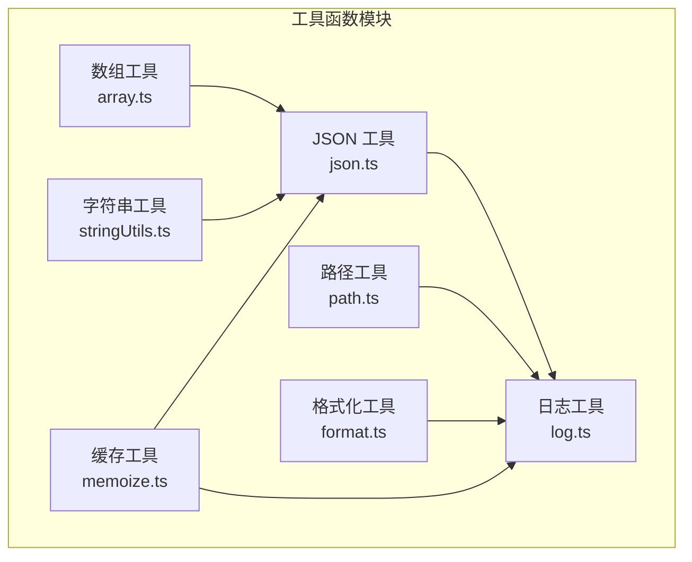
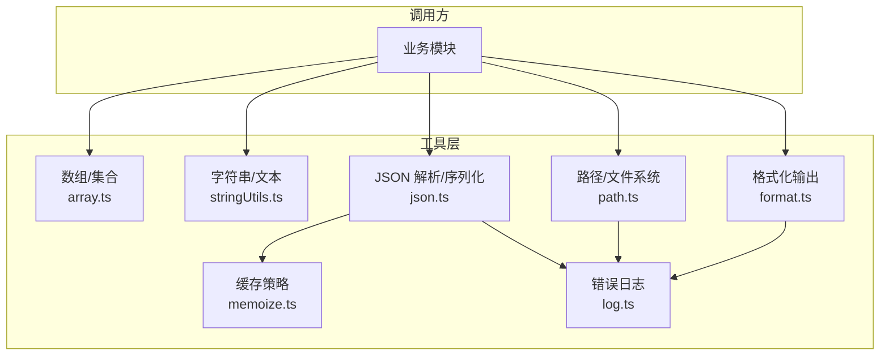
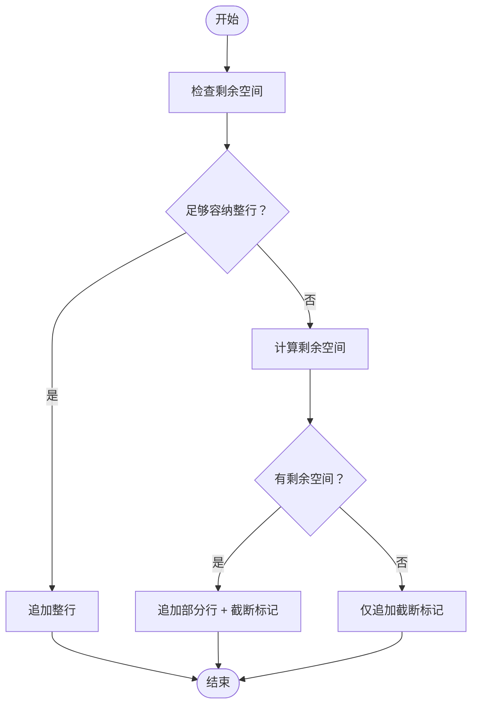
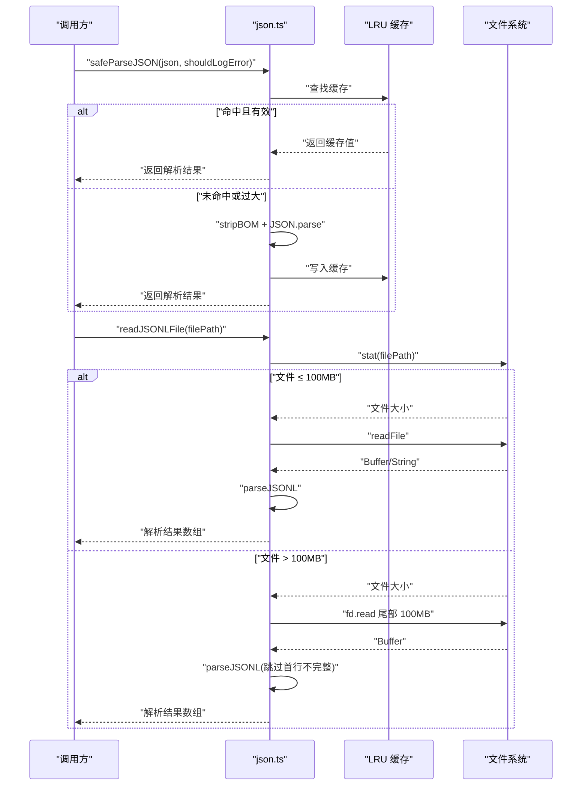
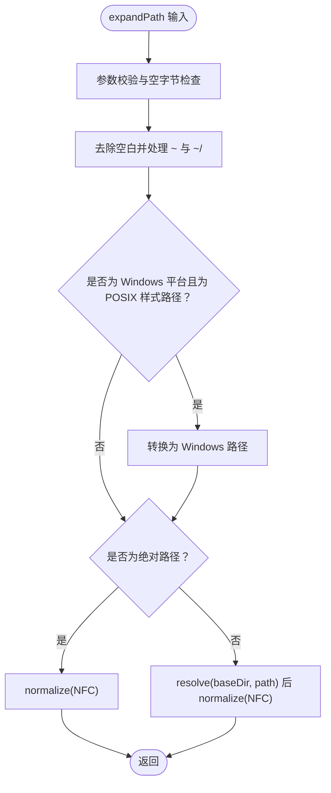
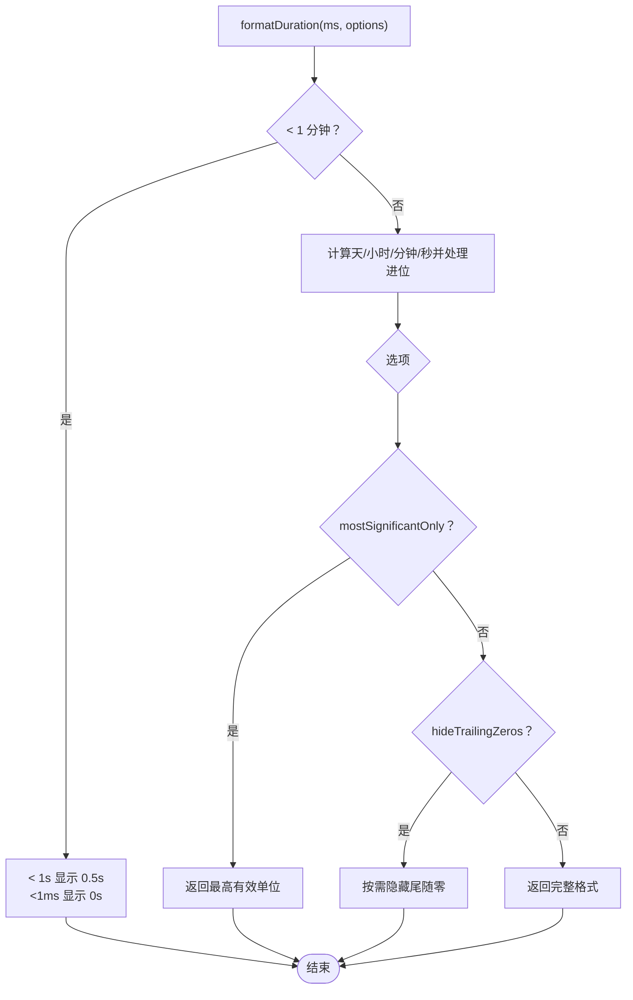
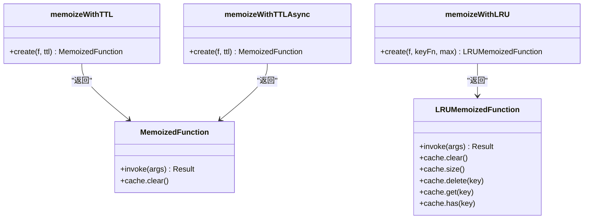
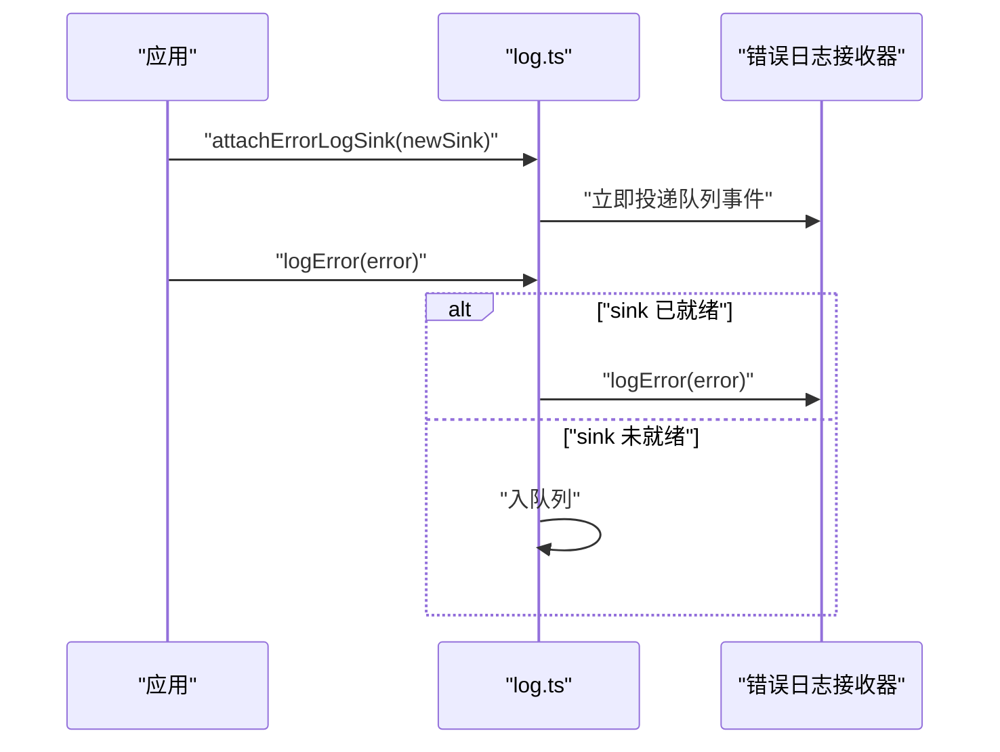
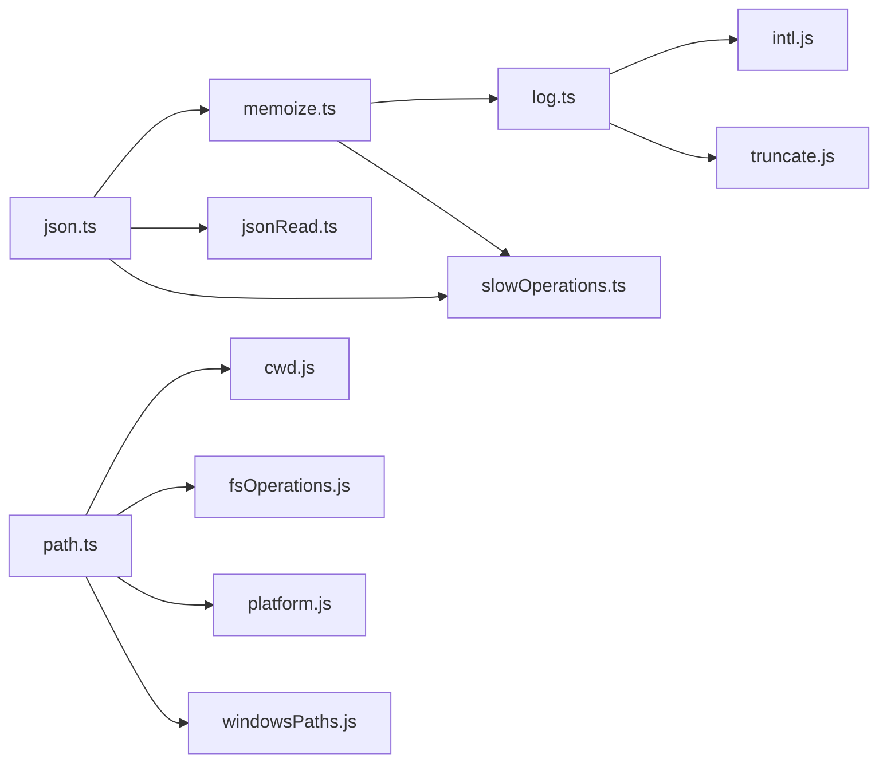

# 核心工具函数

<cite>
**本文档引用的文件**
- [array.ts](file://src/utils/array.ts)
- [stringUtils.ts](file://src/utils/stringUtils.ts)
- [json.ts](file://src/utils/json.ts)
- [path.ts](file://src/utils/path.ts)
- [format.ts](file://src/utils/format.ts)
- [memoize.ts](file://src/utils/memoize.ts)
- [log.ts](file://src/utils/log.ts)
- [truncate.ts](file://src/utils/truncate.ts)
- [jsonRead.ts](file://src/utils/jsonRead.ts)
- [slowOperations.ts](file://src/utils/slowOperations.ts)
- [intl.js](file://src/utils/intl.js)
- [truncate.js](file://src/utils/truncate.js)
- [cwd.js](file://src/utils/cwd.js)
- [fsOperations.js](file://src/utils/fsOperations.js)
- [platform.js](file://src/utils/platform.js)
- [windowsPaths.js](file://src/utils/windowsPaths.js)
- [sessionStoragePortable.js](file://src/utils/sessionStoragePortable.js)
</cite>

## 目录
1. [简介](#简介)
2. [项目结构](#项目结构)
3. [核心组件](#核心组件)
4. [架构总览](#架构总览)
5. [详细组件分析](#详细组件分析)
6. [依赖分析](#依赖分析)
7. [性能考虑](#性能考虑)
8. [故障排除指南](#故障排除指南)
9. [结论](#结论)
10. [附录](#附录)

## 简介
本文件面向“核心工具函数”，系统性梳理并记录项目中的通用基础能力，包括数组操作、字符串处理、JSON 序列化与解析、路径操作、格式化显示以及缓存与日志等关键模块。文档从设计原则、参数与返回值、使用场景、性能特性与内存注意事项等方面进行说明，并提供实际使用示例与最佳实践，帮助开发者在不深入源码的情况下高效正确地使用这些工具。

## 项目结构
核心工具函数主要位于 src/utils 目录下，按功能域拆分：数组与集合（array.ts）、字符串与文本处理（stringUtils.ts）、JSON 解析与写入（json.ts）、路径与文件系统（path.ts）、格式化输出（format.ts）、缓存策略（memoize.ts）、错误日志（log.ts）等。这些模块彼此解耦，通过明确的接口与类型约束提供纯函数式能力，便于复用与测试。

**图表来源**
- [array.ts](file://src/utils/array.ts)
- [stringUtils.ts](file://src/utils/stringUtils.ts)
- [json.ts](file://src/utils/json.ts)
- [path.ts](file://src/utils/path.ts)
- [format.ts](file://src/utils/format.ts)
- [memoize.ts](file://src/utils/memoize.ts)
- [log.ts](file://src/utils/log.ts)

**章节来源**
- [array.ts](file://src/utils/array.ts)
- [stringUtils.ts](file://src/utils/stringUtils.ts)
- [json.ts](file://src/utils/json.ts)
- [path.ts](file://src/utils/path.ts)
- [format.ts](file://src/utils/format.ts)
- [memoize.ts](file://src/utils/memoize.ts)
- [log.ts](file://src/utils/log.ts)

## 核心组件
本节对各核心工具函数进行概览式说明，涵盖用途、输入输出、典型场景与注意事项。

- 数组工具（array.ts）
  - intersperse：在数组元素之间插入分隔符，支持基于索引的动态分隔符生成。
  - count：按谓词统计数组中满足条件的元素个数。
  - uniq：对可迭代对象去重，返回数组形式。

- 字符串工具（stringUtils.ts）
  - escapeRegExp：转义正则特殊字符，用于字面量模式。
  - capitalize：首字母大写，其余不变。
  - plural：根据数量选择单复数形式。
  - firstLineOf：快速提取首行，避免分配 split 数组。
  - countCharInString：使用 indexOf 跳跃计数指定字符出现次数。
  - normalizeFullWidthDigits/normalizeFullWidthSpace：全角数字与空格规范化。
  - safeJoinLines：安全拼接字符串，超限时截断并标记。
  - EndTruncatingAccumulator：末尾截断累加器，防止内存暴涨。
  - truncateToLines：按行数截断文本，保留前若干行并添加省略号。

- JSON 工具（json.ts）
  - safeParseJSON：带 BOM 去除与 LRU 缓存的 JSON 安全解析，支持错误日志控制。
  - safeParseJSONC：支持注释的 JSONC 解析。
  - parseJSONL：逐行解析 JSONL，优先使用 Bun 的高性能实现，否则回退到字符串/Buffer 扫描。
  - readJSONLFile：读取最大 100MB 的 JSONL 文件，自动从尾部读取并跳过不完整首行。
  - addItemToJSONCArray：向 JSONC 数组安全追加项，保持注释与格式。

- 路径工具（path.ts）
  - expandPath：展开 ~、相对路径与 POSIX 跨平台路径，统一为当前平台原生格式。
  - toRelativePath：将绝对路径相对化，超出当前工作目录时保持绝对以避免歧义。
  - getDirectoryForPath：推断给定路径的目录（存在性与 UNC 安全处理）。
  - containsPathTraversal：检测路径遍历模式。
  - normalizePathForConfigKey：标准化路径为 JSON 键一致格式（统一前斜杠）。

- 格式化工具（format.ts）
  - formatFileSize：字节到 KB/MB/GB 的人性化格式。
  - formatSecondsShort：毫秒到秒的短格式（保留一位小数）。
  - formatDuration：通用时长格式化，支持隐藏尾随零、仅最高有效单位等选项。
  - formatNumber/formatTokens：数字紧凑格式化与 token 显示格式。
  - formatRelativeTime/formatRelativeTimeAgo：相对时间格式化，支持多种风格与数值策略。
  - formatLogMetadata：日志元数据组合（时间、大小或消息数、分支、标签、PR 等）。
  - formatResetTime/formatResetText：重置时间格式化（日期/时间/时区）。

- 缓存工具（memoize.ts）
  - memoizeWithTTL：带 TTL 的写入穿透缓存，命中即返回，过期则异步刷新并返回旧值。
  - memoizeWithTTLAsync：异步版本，支持并发冷请求去重与清理。
  - memoizeWithLRU：LRU 驱逐策略，防止内存无限增长，提供缓存查询与管理方法。

- 日志工具（log.ts）
  - attachErrorLogSink/getInMemoryErrors：错误日志接收器挂载与内存错误队列访问。
  - logError/logMCPError/logMCPDebug：多目的地错误记录（调试、内存、持久化）。
  - loadErrorLogs/getErrorLogByIndex：错误日志列表加载与索引访问。
  - getLogDisplayTitle：会话标题生成与显示友好化。
  - captureAPIRequest：捕获 API 请求参数（不含消息体），用于问题排查。

**章节来源**
- [array.ts](file://src/utils/array.ts)
- [stringUtils.ts](file://src/utils/stringUtils.ts)
- [json.ts](file://src/utils/json.ts)
- [path.ts](file://src/utils/path.ts)
- [format.ts](file://src/utils/format.ts)
- [memoize.ts](file://src/utils/memoize.ts)
- [log.ts](file://src/utils/log.ts)

## 架构总览
核心工具函数遵循“纯函数 + 可配置缓存 + 统一日志”的设计原则，确保：
- 输入输出明确、无副作用；
- 对热点数据采用 LRU/TTL 缓存，降低重复计算与 IO；
- 对错误与异常进行统一记录与上报；
- 对字符串与 JSON 处理进行安全与性能优化。

**图表来源**
- [array.ts](file://src/utils/array.ts)
- [stringUtils.ts](file://src/utils/stringUtils.ts)
- [json.ts](file://src/utils/json.ts)
- [path.ts](file://src/utils/path.ts)
- [format.ts](file://src/utils/format.ts)
- [memoize.ts](file://src/utils/memoize.ts)
- [log.ts](file://src/utils/log.ts)

## 详细组件分析

### 数组工具（array.ts）
- intersperse
  - 参数：数组、分隔符生成函数（基于索引）
  - 返回：插入分隔符后的新数组
  - 使用场景：需要在元素间插入分隔符的渲染或拼接逻辑
  - 性能：flatMap 线性时间，空间开销与输出长度线性相关
- count
  - 参数：只读数组、谓词函数
  - 返回：满足条件的元素个数
  - 使用场景：统计过滤结果数量
  - 性能：O(n)，常数级额外空间
- uniq
  - 参数：可迭代对象
  - 返回：去重后的数组
  - 使用场景：去除重复项，保持顺序
  - 性能：O(n)，Set 去重

**章节来源**
- [array.ts](file://src/utils/array.ts)

### 字符串工具（stringUtils.ts）
- escapeRegExp/capitalize/plural/firstLineOf/countCharInString
  - 设计原则：避免不必要的分配；对正则与字符串操作进行最小化处理
  - 性能：countCharInString 使用 indexOf 跳跃，减少逐字符扫描
- normalizeFullWidthDigits/normalizeFullWidthSpace
  - 场景：接受 CJK 输入时的兼容性处理
- safeJoinLines
  - 设计原则：在内存限制内尽可能保留内容，超限截断并标记
  - 注意：MAX_STRING_LENGTH 作为阈值，避免内存溢出
- EndTruncatingAccumulator
  - 设计原则：当达到容量上限时，仅保留前半部分，后半部分截断
  - 方法：append/toString/clear/length/truncated/totalBytes
  - 使用场景：流式输出累积，如命令行输出、日志拼接
- truncateToLines
  - 设计原则：按行截断，保留前若干行并添加省略号

**图表来源**
- [stringUtils.ts](file://src/utils/stringUtils.ts)

**章节来源**
- [stringUtils.ts](file://src/utils/stringUtils.ts)

### JSON 工具（json.ts）
- safeParseJSON
  - 设计原则：带 BOM 去除、LRU 缓存、错误日志可选
  - 缓存策略：键为 JSON 字符串，最多 50 条，超过 8KB 不缓存
  - 返回：解析成功返回值，失败返回 null（或可选错误日志）
- safeParseJSONC
  - 支持注释与非标准字段的 JSONC 解析
- parseJSONL
  - 性能：优先使用 Bun.JSONL.parseChunk；否则按行扫描，跳过非法行
  - 内存：逐行解析，避免一次性加载大文件
- readJSONLFile
  - 限制：最大读取 100MB，从文件尾部读取并跳过首行不完整片段
- addItemToJSONCArray
  - 语义：向 JSONC 数组追加新项，保持注释与缩进格式

**图表来源**
- [json.ts](file://src/utils/json.ts)
- [jsonRead.ts](file://src/utils/jsonRead.ts)
- [slowOperations.ts](file://src/utils/slowOperations.ts)

**章节来源**
- [json.ts](file://src/utils/json.ts)
- [jsonRead.ts](file://src/utils/jsonRead.ts)
- [slowOperations.ts](file://src/utils/slowOperations.ts)

### 路径工具（path.ts）
- expandPath
  - 功能：展开 ~、相对路径、POSIX 跨平台路径，统一为当前平台原生格式
  - 安全：校验空字节、UNC 路径处理、规范化 NFC 形态
  - 返回：标准化后的绝对路径
- toRelativePath
  - 功能：若路径在当前工作目录内，返回相对路径，否则保持绝对
- getDirectoryForPath
  - 功能：根据路径是否存在与类型推断目录（UNC 安全）
- containsPathTraversal
  - 功能：检测 ../ 或 ..\ 等遍历模式
- normalizePathForConfigKey
  - 功能：将路径标准化为 JSON 键一致的前斜杠格式

**图表来源**
- [path.ts](file://src/utils/path.ts)
- [cwd.js](file://src/utils/cwd.js)
- [fsOperations.js](file://src/utils/fsOperations.js)
- [platform.js](file://src/utils/platform.js)
- [windowsPaths.js](file://src/utils/windowsPaths.js)

**章节来源**
- [path.ts](file://src/utils/path.ts)

### 格式化工具（format.ts）
- formatFileSize：字节到 KB/MB/GB 的人性化格式
- formatSecondsShort：毫秒到秒的短格式（保留一位小数）
- formatDuration：通用时长格式化，支持隐藏尾随零、仅最高有效单位
- formatNumber/formatTokens：数字紧凑格式化与 token 显示格式
- formatRelativeTime/formatRelativeTimeAgo：相对时间格式化，支持多种风格与数值策略
- formatLogMetadata：日志元数据组合（时间、大小或消息数、分支、标签、PR 等）
- formatResetTime/formatResetText：重置时间格式化（日期/时间/时区）

**图表来源**
- [format.ts](file://src/utils/format.ts)
- [intl.js](file://src/utils/intl.js)
- [truncate.js](file://src/utils/truncate.js)

**章节来源**
- [format.ts](file://src/utils/format.ts)

### 缓存工具（memoize.ts）
- memoizeWithTTL
  - 行为：命中直接返回；过期返回旧值并后台刷新；无缓存阻塞计算
  - 并发：Map 存储缓存条目，避免重复刷新
- memoizeWithTTLAsync
  - 行为：异步版本，支持并发冷请求去重与清理
  - 并发：inFlight Map 防止重复发起请求
- memoizeWithLRU
  - 行为：LRU 驱逐，防止内存无限增长
  - 接口：提供 clear/size/delete/get/has 等缓存管理方法

**图表来源**
- [memoize.ts](file://src/utils/memoize.ts)

**章节来源**
- [memoize.ts](file://src/utils/memoize.ts)

### 日志工具（log.ts）
- attachErrorLogSink/getInMemoryErrors：错误日志接收器挂载与内存错误队列访问
- logError/logMCPError/logMCPDebug：多目的地错误记录（调试、内存、持久化）
- loadErrorLogs/getErrorLogByIndex：错误日志列表加载与索引访问
- getLogDisplayTitle：会话标题生成与显示友好化
- captureAPIRequest：捕获 API 请求参数（不含消息体），用于问题排查

**图表来源**
- [log.ts](file://src/utils/log.ts)

**章节来源**
- [log.ts](file://src/utils/log.ts)

## 依赖分析
- 模块内聚与耦合
  - array.ts、stringUtils.ts、format.ts 为纯函数，内聚高、耦合低
  - json.ts 依赖 memoize.ts、jsonRead.ts、slowOperations.ts 提升性能与健壮性
  - path.ts 依赖 cwd.js、fsOperations.js、platform.js、windowsPaths.js 实现跨平台路径处理
  - memoize.ts 依赖 lru-cache、log.ts、slowOperations.ts 提供缓存与日志能力
  - log.ts 依赖 intl.js、truncate.js 提供国际化与文本截断能力
- 外部依赖
  - jsonc-parser：JSONC 解析
  - lru-cache：LRU 缓存
  - Bun JSONL：高性能 JSONL 解析（可选）

**图表来源**
- [json.ts](file://src/utils/json.ts)
- [memoize.ts](file://src/utils/memoize.ts)
- [log.ts](file://src/utils/log.ts)
- [path.ts](file://src/utils/path.ts)

**章节来源**
- [json.ts](file://src/utils/json.ts)
- [memoize.ts](file://src/utils/memoize.ts)
- [log.ts](file://src/utils/log.ts)
- [path.ts](file://src/utils/path.ts)

## 性能考虑
- 字符串与 JSON
  - 使用 indexOf 跳跃计数与逐行解析，避免全量扫描与分配
  - LRU 缓存限制键大小与条目数量，防止内存膨胀
  - Bun JSONL parseChunk 优先使用，显著提升大文件解析性能
- 路径处理
  - 统一 NFC 规范化与平台转换，减少后续比较与 IO 成本
  - UNC 安全处理避免凭据泄露与无效 stat
- 缓存策略
  - TTL 缓存返回旧值并后台刷新，保证响应性
  - LRU 缓存结合键函数与最大容量，平衡命中率与内存占用
- 格式化
  - Intl.NumberFormat 缓存实例，避免昂贵构造
  - 相对时间格式化按需选择风格，减少字符串拼接

[本节为通用性能指导，无需特定文件引用]

## 故障排除指南
- JSON 解析失败
  - 现象：safeParseJSON 返回 null，错误被记录
  - 排查：确认输入是否为有效 JSON；检查 BOM；查看 shouldLogError 控制
  - 参考：[json.ts](file://src/utils/json.ts)
- JSONL 解析异常
  - 现象：parseJSONL 跳过非法行；readJSONLFile 仅读取尾部
  - 排查：确认文件编码与换行符；检查首行完整性
  - 参考：[json.ts](file://src/utils/json.ts)
- 路径展开错误
  - 现象：抛出类型错误或包含空字节
  - 排查：确保传入字符串且不含空字节；Windows 下 POSIX 路径转换失败时回退原始路径
  - 参考：[path.ts](file://src/utils/path.ts)
- 输出截断
  - 现象：safeJoinLines/EndTruncatingAccumulator 截断并添加标记
  - 排查：调整 maxSize；评估是否需要更细粒度的截断策略
  - 参考：[stringUtils.ts](file://src/utils/stringUtils.ts)
- 缓存命中异常
  - 现象：LRU 缓存未命中或内存增长
  - 排查：检查键函数与最大容量；确认缓存清理时机
  - 参考：[memoize.ts](file://src/utils/memoize.ts)
- 错误日志丢失
  - 现象：attachErrorLogSink 前的日志未落盘
  - 排查：确认 sink 是否及时挂载；检查队列 draining
  - 参考：[log.ts](file://src/utils/log.ts)

**章节来源**
- [json.ts](file://src/utils/json.ts)
- [stringUtils.ts](file://src/utils/stringUtils.ts)
- [path.ts](file://src/utils/path.ts)
- [memoize.ts](file://src/utils/memoize.ts)
- [log.ts](file://src/utils/log.ts)

## 结论
核心工具函数以“纯函数 + 可配置缓存 + 统一日志”为设计基石，覆盖数组、字符串、JSON、路径、格式化与缓存/日志等关键领域。它们在保证正确性的同时，兼顾性能与内存安全，适合在复杂业务场景中复用与扩展。建议在新增工具函数时遵循现有模式：明确输入输出、提供错误处理与日志、合理使用缓存、注意跨平台与边界条件。

[本节为总结性内容，无需特定文件引用]

## 附录
- 实际使用示例（路径与场景）
  - 数据处理：使用 uniq 去重、count 统计、intersperse 插入分隔符
  - 格式转换：formatFileSize/formatDuration/formatNumber/formatTokens
  - 文件操作：expandPath/toRelativePath/getDirectoryForPath/containsPathTraversal
  - JSON 处理：safeParseJSON/safeParseJSONC/parseJSONL/readJSONLFile/addItemToJSONCArray
  - 文本处理：escapeRegExp/capitalize/plural/firstLineOf/countCharInString/safeJoinLines/EndTruncatingAccumulator/truncateToLines
  - 缓存与日志：memoizeWithTTL/memoizeWithTTLAsync/memoizeWithLRU/logError/loadErrorLogs

[本节为概念性汇总，无需特定文件引用]