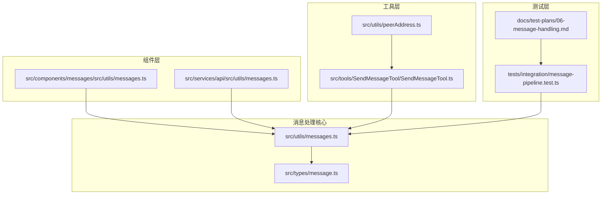
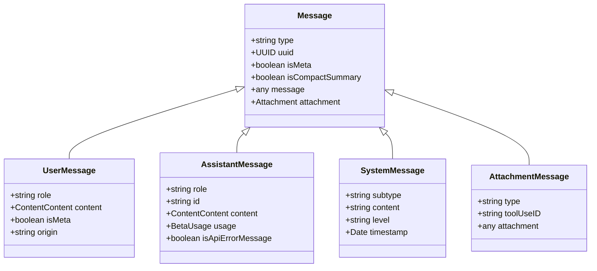
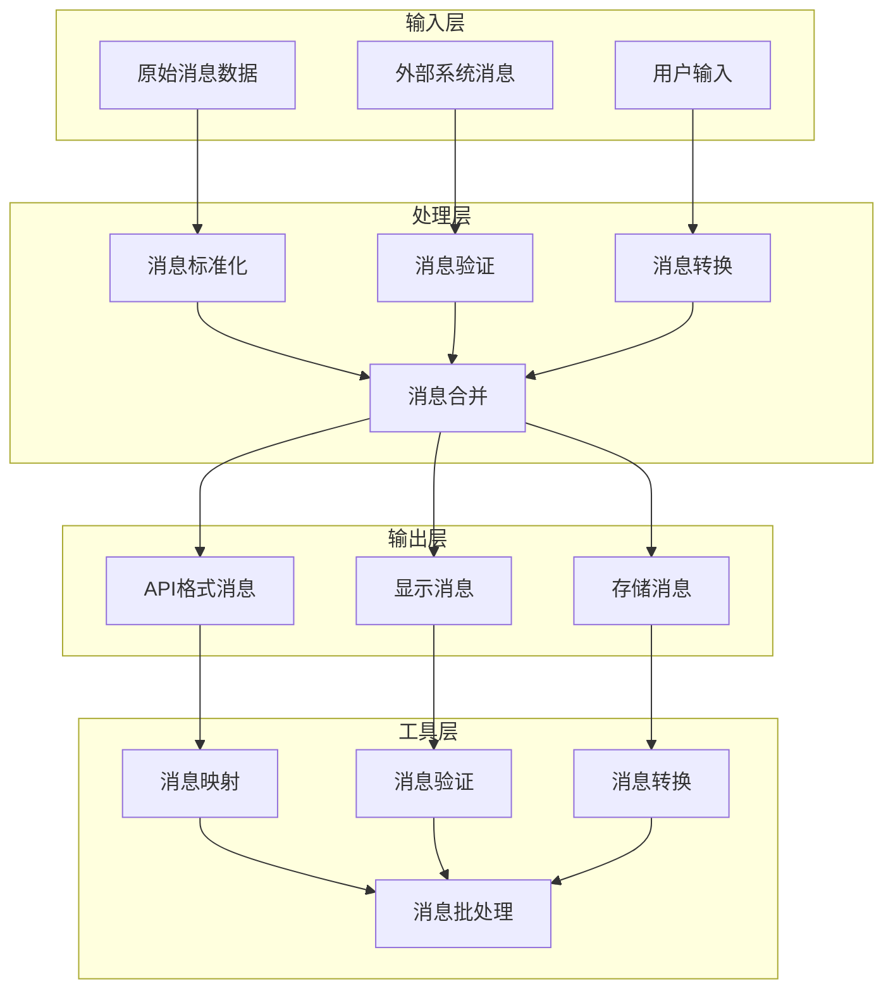
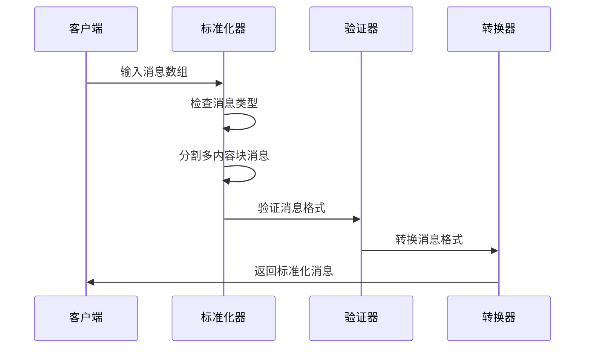
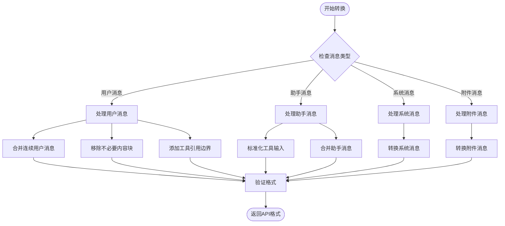
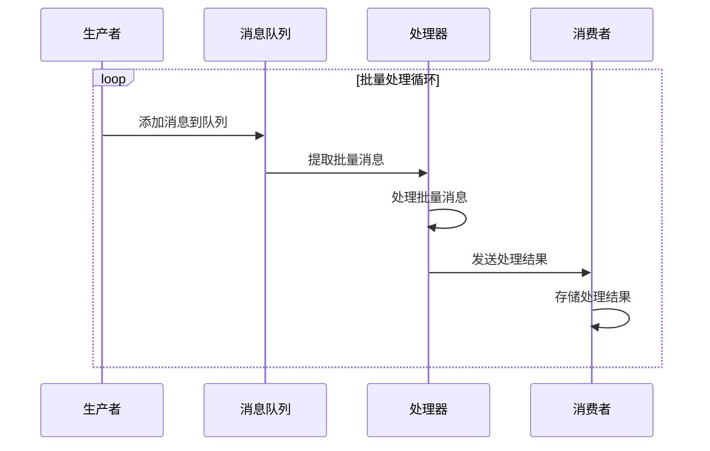
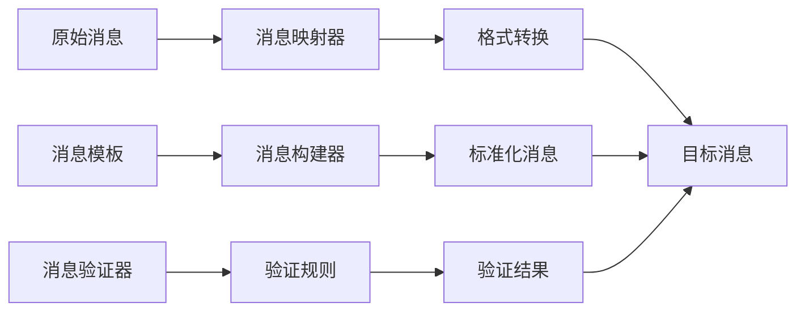

# 消息处理工具函数

<cite>
**本文档引用的文件**
- [src/utils/messages.ts](file://src/utils/messages.ts)
- [src/types/message.ts](file://src/types/message.ts)
- [src/components/messages/src/utils/messages.ts](file://src/components/messages/src/utils/messages.ts)
- [src/services/api/src/utils/messages.ts](file://src/services/api/src/utils/messages.ts)
- [src/tools/SendMessageTool/SendMessageTool.ts](file://src/tools/SendMessageTool/SendMessageTool.ts)
- [src/utils/peerAddress.ts](file://src/utils/peerAddress.ts)
- [tests/integration/message-pipeline.test.ts](file://tests/integration/message-pipeline.test.ts)
- [docs/test-plans/06-message-handling.md](file://docs/test-plans/06-message-handling.md)
</cite>

## 目录
1. [简介](#简介)
2. [项目结构](#项目结构)
3. [核心组件](#核心组件)
4. [架构概览](#架构概览)
5. [详细组件分析](#详细组件分析)
6. [依赖关系分析](#依赖关系分析)
7. [性能考虑](#性能考虑)
8. [故障排除指南](#故障排除指南)
9. [结论](#结论)

## 简介

本文档详细记录了 Claude Code 项目中的消息处理工具函数，这是一个复杂的消息处理系统，负责处理用户消息、助手消息、系统消息以及各种附件消息的创建、转换、验证和标准化。该系统支持多种消息格式，包括文本、图像、工具调用结果等，并提供了完整的消息管道处理能力。

消息处理工具函数涵盖了从基础的消息创建到复杂的 API 格式转换、消息验证、批处理优化等多个层面的功能。系统设计注重性能优化，提供了消息去重、缓存机制、批量处理等特性，以确保在大规模消息处理场景下的高效运行。

## 项目结构

消息处理功能主要分布在以下目录中：



**图表来源**
- [src/utils/messages.ts:1-800](file://src/utils/messages.ts#L1-L800)
- [src/types/message.ts:1-168](file://src/types/message.ts#L1-L168)

**章节来源**
- [src/utils/messages.ts:1-800](file://src/utils/messages.ts#L1-L800)
- [src/types/message.ts:1-168](file://src/types/message.ts#L1-L168)

## 核心组件

### 基础消息类型定义

系统定义了完整的消息类型体系，包括用户消息、助手消息、系统消息和附件消息等：



**图表来源**
- [src/types/message.ts:33-79](file://src/types/message.ts#L33-L79)

### 消息创建函数

系统提供了丰富的消息创建函数，用于创建不同类型的消息：

- `createUserMessage()`: 创建用户消息
- `createAssistantMessage()`: 创建助手消息  
- `createSystemMessage()`: 创建系统消息
- `createProgressMessage()`: 创建进度消息
- `createToolResultMessage()`: 创建工具结果消息

**章节来源**
- [src/utils/messages.ts:461-524](file://src/utils/messages.ts#L461-L524)
- [src/utils/messages.ts:4377-4394](file://src/utils/messages.ts#L4377-L4394)

## 架构概览

消息处理系统采用分层架构设计，从底层的消息类型定义到上层的业务逻辑处理：



**图表来源**
- [src/utils/messages.ts:2008-2394](file://src/utils/messages.ts#L2008-L2394)
- [src/utils/messages.ts:732-825](file://src/utils/messages.ts#L732-L825)

## 详细组件分析

### 消息标准化处理

消息标准化是整个系统的核心功能之一，负责将不同格式的消息转换为统一的标准格式：



**图表来源**
- [src/utils/messages.ts:732-825](file://src/utils/messages.ts#L732-L825)
- [src/utils/messages.ts:2008-2394](file://src/utils/messages.ts#L2008-L2394)

#### 标准化流程详解

标准化过程包含以下关键步骤：

1. **消息类型识别**: 自动识别消息类型（用户、助手、系统、附件）
2. **内容块分割**: 将包含多个内容块的消息拆分为独立消息
3. **UUID生成**: 为新生成的消息生成唯一标识符
4. **格式验证**: 验证消息格式的正确性
5. **类型转换**: 将消息转换为目标格式

**章节来源**
- [src/utils/messages.ts:732-825](file://src/utils/messages.ts#L732-L825)

### API 消息格式转换

API 消息格式转换是系统的重要功能，负责将内部消息格式转换为 API 可接受的格式：



**图表来源**
- [src/utils/messages.ts:2008-2394](file://src/utils/messages.ts#L2008-L2394)

#### 转换规则

API 消息转换遵循严格的规则：

1. **工具引用处理**: 处理工具引用块，确保符合 API 规范
2. **内容块顺序**: 确保工具结果消息优先于工具调用消息
3. **元数据处理**: 正确处理消息的元数据信息
4. **错误处理**: 处理 API 错误情况

**章节来源**
- [src/utils/messages.ts:2008-2394](file://src/utils/messages.ts#L2008-L2394)

### 消息验证系统

系统内置了完善的消息验证机制，确保消息的完整性和正确性：

```mermaid
classDiagram
class MessageValidator {
+validateMessageType(message) boolean
+validateContentFormat(message) boolean
+validateUUID(message) boolean
+validateTimestamp(message) boolean
+validateContentBlocks(message) boolean
}
class ContentBlockValidator {
+validateTextBlock(block) boolean
+validateImageBlock(block) boolean
+validateToolResultBlock(block) boolean
+validateToolUseBlock(block) boolean
}
class MessageValidator --> ContentBlockValidator
class AddressValidator {
+validateAddress(address) boolean
+parseAddress(to) Address
}
MessageValidator --> AddressValidator
```

**图表来源**
- [src/utils/messages.ts:634-688](file://src/utils/messages.ts#L634-L688)
- [src/utils/peerAddress.ts:1-21](file://src/utils/peerAddress.ts#L1-L21)

#### 验证规则

消息验证包括多个层面：

1. **地址验证**: 验证消息接收地址的有效性
2. **内容验证**: 验证消息内容的完整性
3. **格式验证**: 验证消息格式的正确性
4. **时间戳验证**: 验证消息时间戳的有效性

**章节来源**
- [src/utils/messages.ts:634-688](file://src/utils/messages.ts#L634-L688)
- [src/utils/peerAddress.ts:1-21](file://src/utils/peerAddress.ts#L1-L21)

### 批量处理能力

系统提供了强大的批量处理能力，支持高效的消息批处理：



**图表来源**
- [src/cli/transports/SerialBatchEventUploader.ts:213-233](file://src/cli/transports/SerialBatchEventUploader.ts#L213-L233)

#### 批处理优化

批量处理通过以下方式优化性能：

1. **批量大小控制**: 限制单次处理的消息数量
2. **字节大小控制**: 控制批量消息的总字节数
3. **内存管理**: 避免内存泄漏和过度占用
4. **错误处理**: 处理不可序列化的消息项

**章节来源**
- [src/cli/transports/SerialBatchEventUploader.ts:213-233](file://src/cli/transports/SerialBatchEventUploader.ts#L213-L233)

### 消息映射功能

系统提供了灵活的消息映射功能，支持消息格式的转换和映射：



**图表来源**
- [src/utils/messages.ts:634-688](file://src/utils/messages.ts#L634-L688)

#### 映射功能特性

消息映射功能包括：

1. **标签提取**: 从 HTML 内容中提取特定标签
2. **格式转换**: 支持多种消息格式之间的转换
3. **内容过滤**: 过滤不需要的内容
4. **模板应用**: 应用预定义的消息模板

**章节来源**
- [src/utils/messages.ts:634-688](file://src/utils/messages.ts#L634-L688)

## 依赖关系分析

消息处理系统的依赖关系如下：

```mermaid
graph TB
subgraph "核心依赖"
A[@anthropic-ai/sdk]
B[crypto]
C[lodash-es]
D[自定义工具]
end
subgraph "内部模块"
E[messages.ts]
F[message.ts]
G[peerAddress.ts]
H[api.ts]
end
subgraph "外部系统"
I[SendMessageTool]
J[CLI系统]
K[Web界面]
end
A --> E
B --> E
C --> E
D --> E
E --> F
E --> G
E --> H
I --> E
J --> E
K --> E
```

**图表来源**
- [src/utils/messages.ts:1-50](file://src/utils/messages.ts#L1-L50)
- [src/utils/peerAddress.ts:1-21](file://src/utils/peerAddress.ts#L1-L21)

**章节来源**
- [src/utils/messages.ts:1-50](file://src/utils/messages.ts#L1-L50)
- [src/utils/peerAddress.ts:1-21](file://src/utils/peerAddress.ts#L1-L21)

## 性能考虑

### 时间复杂度分析

消息处理函数的时间复杂度分析：

1. **消息标准化**: O(n*m)，其中 n 是消息数量，m 是平均内容块数量
2. **API 转换**: O(n)，线性处理所有消息
3. **消息验证**: O(n*k)，其中 k 是验证规则数量
4. **批量处理**: O(n)，批量处理优化

### 内存优化策略

系统采用了多种内存优化策略：

1. **消息去重**: 使用 UUID 确保消息唯一性
2. **缓存机制**: 实现 LRU 缓存避免重复计算
3. **流式处理**: 支持流式消息处理减少内存占用
4. **垃圾回收**: 及时释放不再使用的消息对象

### 批量处理优化

批量处理通过以下方式提升性能：

1. **批量大小限制**: 防止单次处理过多消息导致内存溢出
2. **字节大小监控**: 控制批量消息的总大小
3. **异步处理**: 支持异步消息处理避免阻塞
4. **错误恢复**: 处理失败的消息不影响整体处理流程

## 故障排除指南

### 常见问题及解决方案

1. **消息格式错误**
   - 检查消息内容是否符合规范
   - 验证 UUID 格式的正确性
   - 确认时间戳格式的合法性

2. **API 调用失败**
   - 检查工具引用的可用性
   - 验证消息内容块的完整性
   - 确认 API 错误信息的处理

3. **性能问题**
   - 检查批量处理配置
   - 监控内存使用情况
   - 优化消息处理流程

### 调试工具

系统提供了多种调试工具：

1. **日志记录**: 详细的日志记录帮助定位问题
2. **状态监控**: 实时监控消息处理状态
3. **错误报告**: 自动生成错误报告便于分析

**章节来源**
- [src/utils/messages.ts:2678-2778](file://src/utils/messages.ts#L2678-L2778)

## 结论

消息处理工具函数构成了 Claude Code 项目的核心基础设施，提供了完整的消息处理能力。系统通过分层架构设计、完善的验证机制、高效的批量处理能力和灵活的消息映射功能，实现了高性能、高可靠性的消息处理服务。

该系统的设计充分考虑了实际应用场景的需求，包括消息格式标准化、API 兼容性处理、性能优化等多个方面。通过模块化的架构和清晰的接口设计，系统具有良好的可扩展性和维护性，能够适应不断变化的业务需求。

未来的发展方向包括进一步优化性能、增强消息处理能力、改进错误处理机制等方面，以提供更好的用户体验和技术支持。