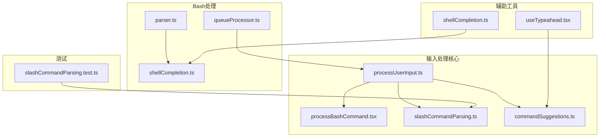
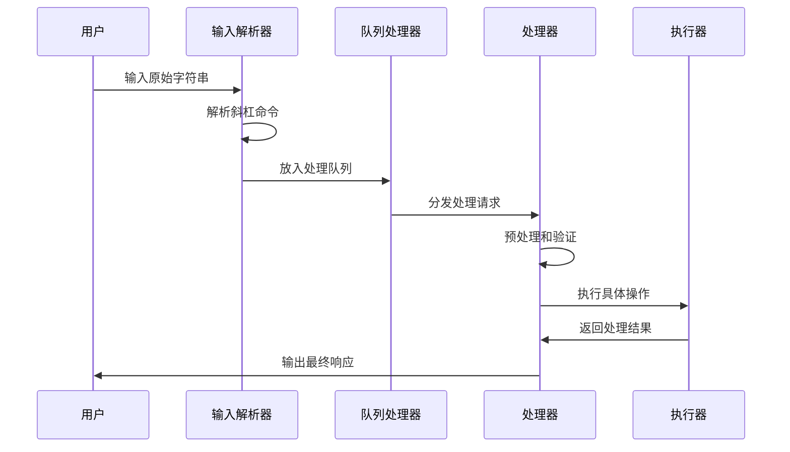
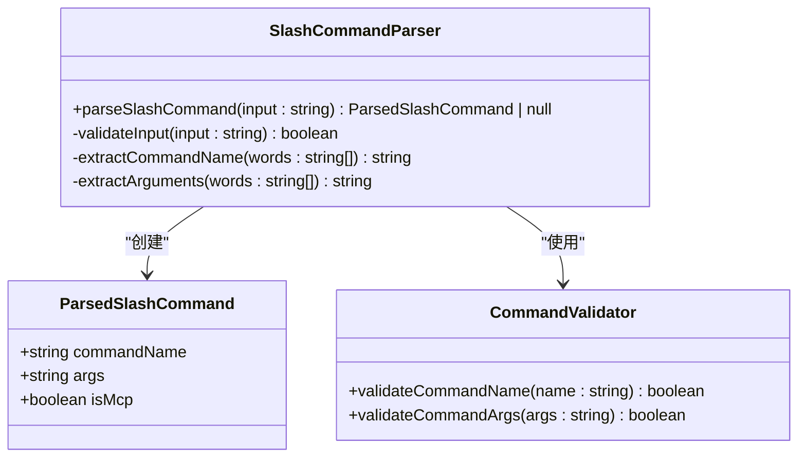
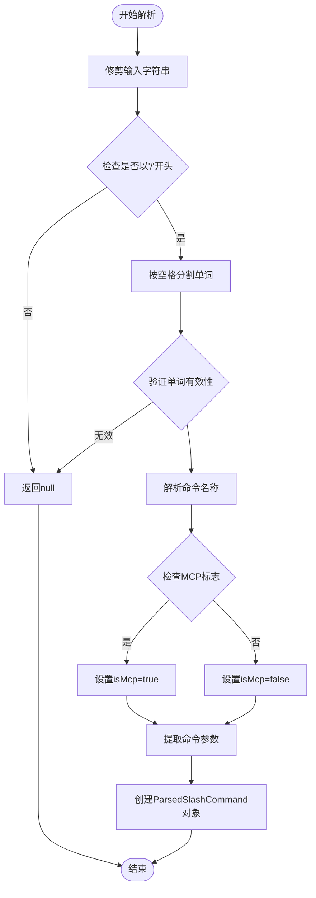
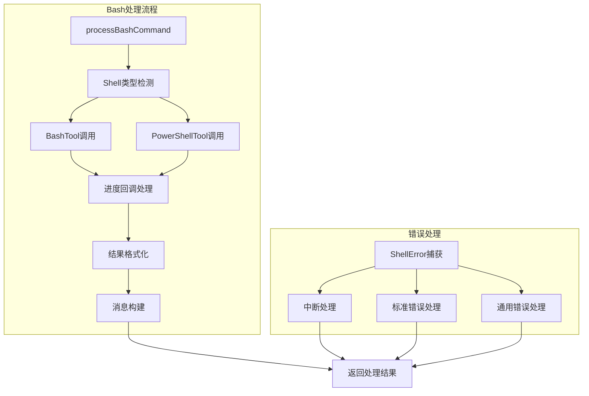
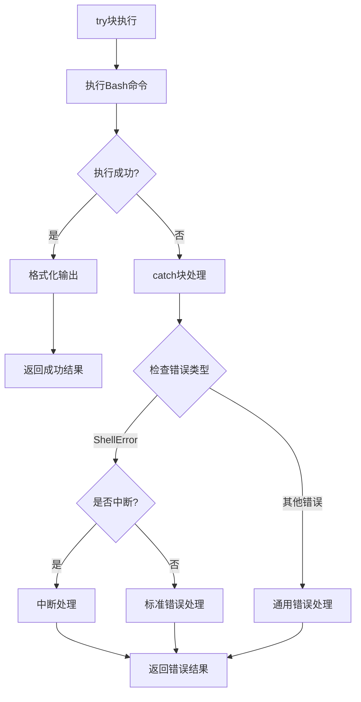
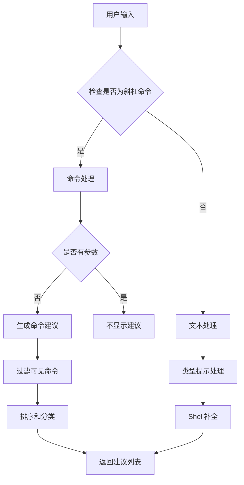
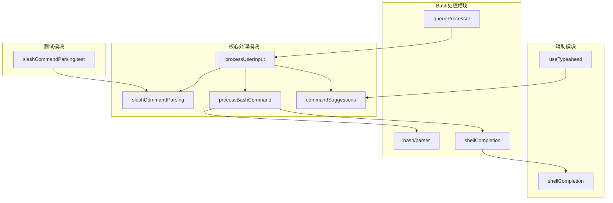

# 用户输入处理工具函数

<cite>
**本文档引用的文件**
- [slashCommandParsing.ts](file://src/utils/slashCommandParsing.ts)
- [processUserInput.ts](file://src/utils/processUserInput/processUserInput.ts)
- [processBashCommand.tsx](file://src/utils/processUserInput/processBashCommand.tsx)
- [parser.ts](file://src/utils/bash/parser.ts)
- [queueProcessor.ts](file://src/utils/queueProcessor.ts)
- [commandSuggestions.ts](file://src/utils/suggestions/commandSuggestions.ts)
- [shellCompletion.ts](file://src/utils/bash/shellCompletion.ts)
- [useTypeahead.tsx](file://src/hooks/useTypeahead.tsx)
- [slashCommandParsing.test.ts](file://src/utils/__tests__/slashCommandParsing.test.ts)
</cite>

## 目录
1. [简介](#简介)
2. [项目结构](#项目结构)
3. [核心组件](#核心组件)
4. [架构概览](#架构概览)
5. [详细组件分析](#详细组件分析)
6. [依赖关系分析](#依赖关系分析)
7. [性能考虑](#性能考虑)
8. [故障排除指南](#故障排除指南)
9. [结论](#结论)

## 简介

本文档详细记录了Claude Code项目中的用户输入处理工具函数，涵盖了Bash命令处理、斜杠命令解析、文本提示处理等核心功能。这些工具函数构成了系统的输入处理管道，负责将用户的原始输入转换为系统可执行的操作。

系统采用模块化设计，通过多个专门的工具函数协同工作，实现了对不同类型输入的智能识别和处理。主要功能包括：

- 斜杠命令的解析和路由
- Bash命令的安全执行
- 文本提示的预处理和标准化
- 输入建议和自动完成功能
- 并发处理和队列管理

## 项目结构

用户输入处理相关的代码主要分布在以下目录结构中：



**图表来源**
- [processUserInput.ts:1-606](file://src/utils/processUserInput/processUserInput.ts#L1-L606)
- [processBashCommand.tsx:1-206](file://src/utils/processUserInput/processBashCommand.tsx#L1-L206)
- [slashCommandParsing.ts:1-61](file://src/utils/slashCommandParsing.ts#L1-L61)

**章节来源**
- [processUserInput.ts:1-606](file://src/utils/processUserInput/processUserInput.ts#L1-L606)
- [processBashCommand.tsx:1-206](file://src/utils/processUserInput/processBashCommand.tsx#L1-L206)
- [slashCommandParsing.ts:1-61](file://src/utils/slashCommandParsing.ts#L1-L61)

## 核心组件

### 斜杠命令解析器

斜杠命令解析器是输入处理系统的核心组件之一，负责将用户输入的斜杠命令解析为结构化的数据对象。

**主要功能：**
- 验证输入是否以斜杠开头
- 提取命令名称和参数
- 识别MCP命令类型
- 处理空白字符和边界情况

**数据结构：**
```typescript
interface ParsedSlashCommand {
  commandName: string;
  args: string;
  isMcp: boolean;
}
```

**处理流程：**
1. 输入验证（必须以'/'开头）
2. 字符串修剪和分割
3. 命令类型识别（标准命令 vs MCP命令）
4. 参数提取和返回

**章节来源**
- [slashCommandParsing.ts:25-60](file://src/utils/slashCommandParsing.ts#L25-L60)

### Bash命令处理器

Bash命令处理器提供了安全的命令执行环境，支持跨平台的shell操作。

**核心特性：**
- 自动shell选择（Bash vs PowerShell）
- 进度实时更新
- 错误处理和恢复
- 安全沙箱机制

**处理流程：**
1. Shell类型检测和路由
2. 用户消息创建和准备
3. 实时进度UI更新
4. 命令执行和结果处理
5. 错误捕获和响应

**章节来源**
- [processBashCommand.tsx:27-206](file://src/utils/processUserInput/processBashCommand.tsx#L27-L206)

### 输入预处理管道

输入预处理管道负责将原始输入转换为系统可理解的格式，支持多种输入模式。

**处理阶段：**
1. **模式识别**：区分prompt、bash、task-notification等模式
2. **图像处理**：调整和优化粘贴的图像内容
3. **附件提取**：从输入中提取相关上下文信息
4. **命令检测**：识别和分类不同类型的命令
5. **标准化**：统一输入格式和编码

**章节来源**
- [processUserInput.ts:281-589](file://src/utils/processUserInput/processUserInput.ts#L281-L589)

## 架构概览

系统采用分层架构设计，通过明确的职责分离实现高效的输入处理：



**图表来源**
- [processUserInput.ts:85-270](file://src/utils/processUserInput/processUserInput.ts#L85-L270)
- [queueProcessor.ts:52-87](file://src/utils/queueProcessor.ts#L52-L87)

## 详细组件分析

### 斜杠命令解析组件

#### 类图设计



**图表来源**
- [slashCommandParsing.ts:5-60](file://src/utils/slashCommandParsing.ts#L5-L60)

#### 处理流程图



**图表来源**
- [slashCommandParsing.ts:25-60](file://src/utils/slashCommandParsing.ts#L25-L60)

**章节来源**
- [slashCommandParsing.ts:1-61](file://src/utils/slashCommandParsing.ts#L1-L61)

### Bash命令处理组件

#### 组件交互图



**图表来源**
- [processBashCommand.tsx:27-206](file://src/utils/processUserInput/processBashCommand.tsx#L27-L206)

#### 错误处理流程



**图表来源**
- [processBashCommand.tsx:166-204](file://src/utils/processUserInput/processBashCommand.tsx#L166-L204)

**章节来源**
- [processBashCommand.tsx:1-206](file://src/utils/processUserInput/processBashCommand.tsx#L1-L206)

### 输入建议和自动完成组件

#### 建议生成流程



**图表来源**
- [commandSuggestions.ts:301-507](file://src/utils/suggestions/commandSuggestions.ts#L301-L507)

**章节来源**
- [commandSuggestions.ts:1-577](file://src/utils/suggestions/commandSuggestions.ts#L1-L577)

## 依赖关系分析

### 模块依赖图



**图表来源**
- [processUserInput.ts:56-61](file://src/utils/processUserInput/processUserInput.ts#L56-L61)
- [processBashCommand.tsx:15-25](file://src/utils/processUserInput/processBashCommand.tsx#L15-L25)

### 数据流依赖

系统中的数据流遵循严格的依赖关系：

1. **输入层** → **解析层** → **处理层** → **执行层** → **输出层**

2. **同步依赖**：解析器和处理器之间的直接调用关系

3. **异步依赖**：队列处理器和执行器之间的事件驱动关系

4. **配置依赖**：各模块对全局配置和状态的依赖关系

**章节来源**
- [queueProcessor.ts:1-95](file://src/utils/queueProcessor.ts#L1-L95)

## 性能考虑

### 并发处理能力

系统采用多层并发控制机制：

1. **队列处理并发**：单个命令逐个处理，确保错误隔离
2. **批量处理并发**：相同模式的非斜杠命令可以批量处理
3. **异步执行并发**：Bash命令执行支持异步处理
4. **资源限制并发**：通过工具执行器控制并发数量

### 性能优化策略

1. **延迟加载**：PowerShell工具仅在需要时加载
2. **缓存机制**：命令建议使用Fuse索引缓存
3. **并行处理**：图像处理和队列处理并行执行
4. **内存管理**：及时清理临时数据和DOM节点

### 内存使用特征

- **峰值内存**：主要用于Bash输出缓冲区
- **持续内存**：命令建议缓存和工具状态
- **垃圾回收**：定期清理未使用的临时对象

## 故障排除指南

### 常见问题诊断

1. **斜杠命令解析失败**
   - 检查输入是否以'/'开头
   - 验证命令名称的有效性
   - 确认参数格式正确

2. **Bash命令执行错误**
   - 检查shell类型配置
   - 验证命令权限设置
   - 查看错误日志输出

3. **输入建议不显示**
   - 确认命令输入格式
   - 检查参数是否存在
   - 验证命令可见性设置

### 调试技巧

1. **启用详细日志**：查看tengu_*事件日志
2. **检查队列状态**：确认命令是否正确入队
3. **验证输入格式**：使用测试用例验证解析逻辑

**章节来源**
- [slashCommandParsing.test.ts:1-58](file://src/utils/__tests__/slashCommandParsing.test.ts#L1-L58)

## 结论

用户输入处理工具函数构成了Claude Code系统的核心基础设施，通过模块化设计和清晰的职责分离，实现了高效、安全、可扩展的输入处理能力。

**主要优势：**
- **模块化设计**：每个组件职责明确，便于维护和扩展
- **安全性保障**：Bash命令执行具有多重安全防护
- **用户体验**：智能建议和自动完成功能提升使用体验
- **性能优化**：并发处理和缓存机制确保系统响应速度

**未来改进方向：**
- 增强输入验证和错误处理机制
- 优化大文件和复杂命令的处理性能
- 扩展更多输入格式和协议支持
- 加强监控和诊断工具的功能