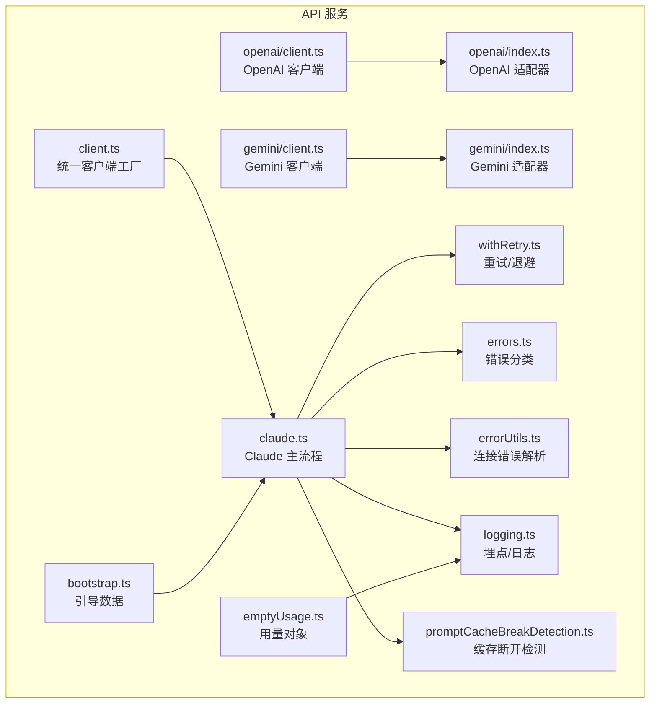
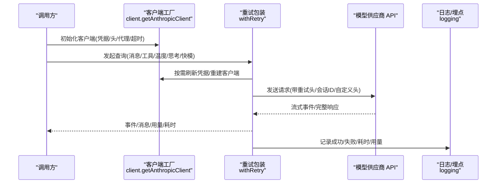
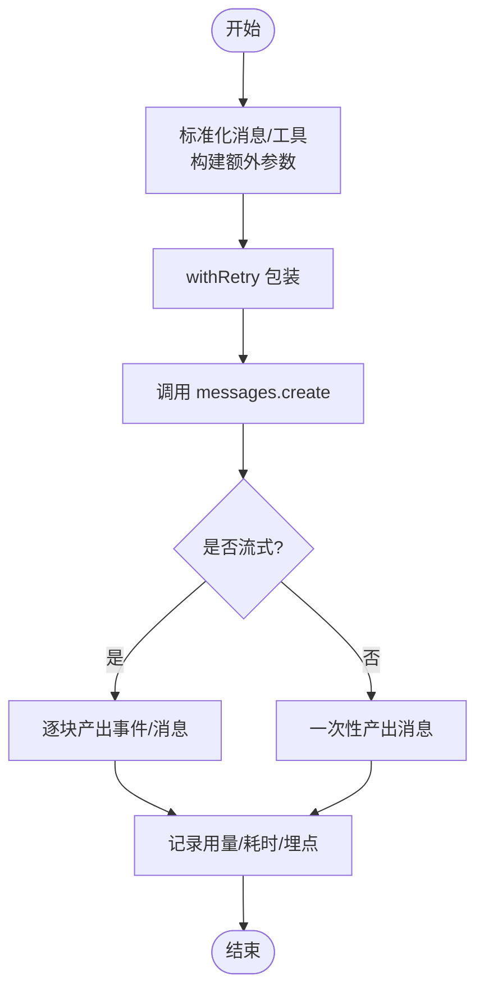
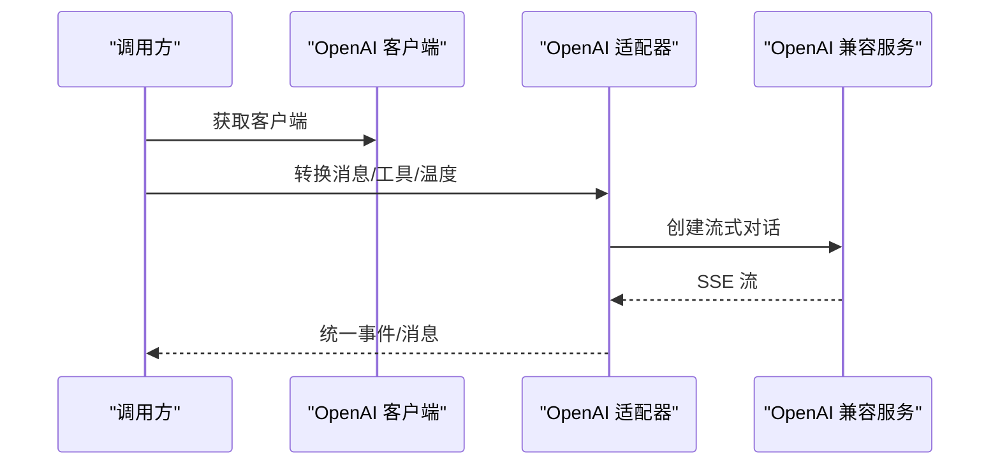
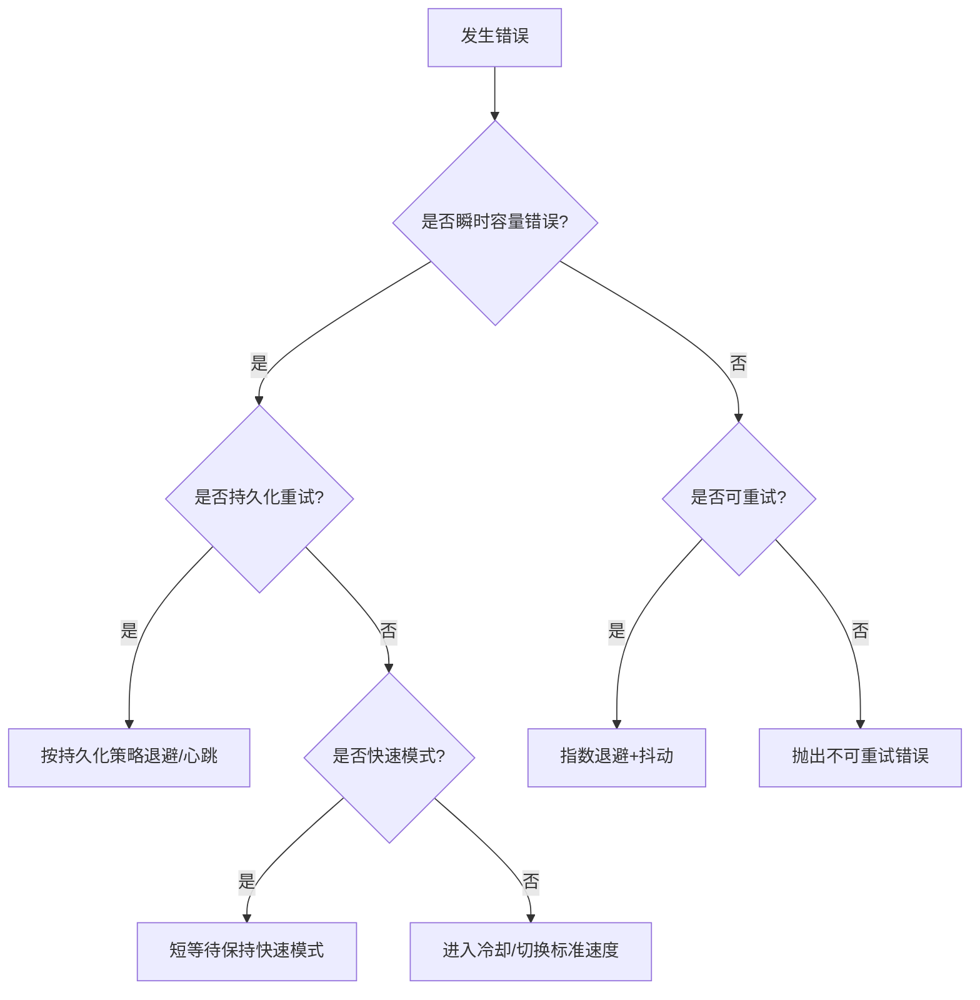
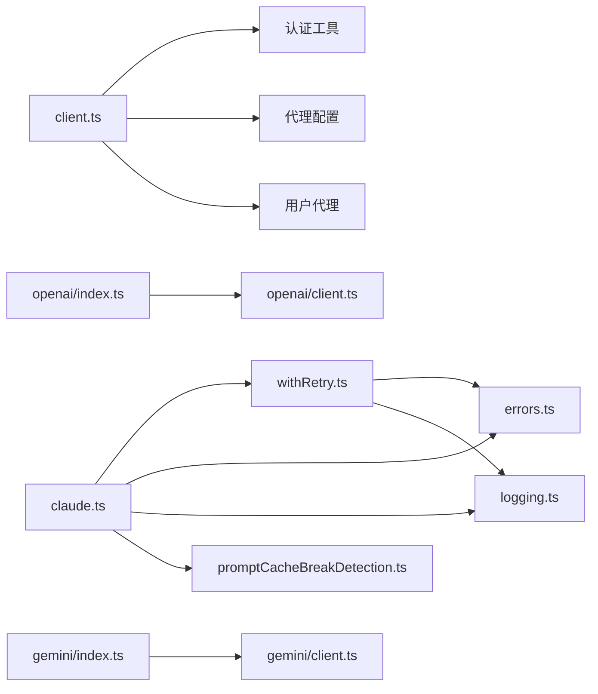

# API 服务

<cite>
**本文引用的文件**
- [src/services/api/client.ts](file://src/services/api/client.ts)
- [src/services/api/claude.ts](file://src/services/api/claude.ts)
- [src/services/api/openai/client.ts](file://src/services/api/openai/client.ts)
- [src/services/api/openai/index.ts](file://src/services/api/openai/index.ts)
- [src/services/api/gemini/client.ts](file://src/services/api/gemini/client.ts)
- [src/services/api/gemini/index.ts](file://src/services/api/gemini/index.ts)
- [src/services/api/withRetry.ts](file://src/services/api/withRetry.ts)
- [src/services/api/errors.ts](file://src/services/api/errors.ts)
- [src/services/api/errorUtils.ts](file://src/services/api/errorUtils.ts)
- [src/services/api/logging.ts](file://src/services/api/logging.ts)
- [src/services/api/promptCacheBreakDetection.ts](file://src/services/api/promptCacheBreakDetection.ts)
- [src/services/api/bootstrap.ts](file://src/services/api/bootstrap.ts)
- [src/services/api/emptyUsage.ts](file://src/services/api/emptyUsage.ts)
</cite>

## 目录
1. [简介](#简介)
2. [项目结构](#项目结构)
3. [核心组件](#核心组件)
4. [架构总览](#架构总览)
5. [详细组件分析](#详细组件分析)
6. [依赖关系分析](#依赖关系分析)
7. [性能考量](#性能考量)
8. [故障排查指南](#故障排查指南)
9. [结论](#结论)
10. [附录](#附录)

## 简介
本文件面向 Claude Code Best 的 API 服务，系统性梳理并记录以下能力：
- 多模型供应商统一接入：Claude（第一方）、OpenAI 兼容、Gemini（Google AI）以及第三方/自托管网关。
- 客户端初始化、认证机制、请求构建与响应处理。
- 错误分类与处理策略、重试与退避、速率限制与容量管理。
- 提示词缓存检测与告警、代理与网络层适配。
- 调用示例与最佳实践。

## 项目结构
API 服务位于 src/services/api 目录下，按“供应商 + 通用能力”组织：
- 供应商客户端：client.ts（Claude 第一方）、openai/（OpenAI 兼容）、gemini/（Gemini）
- 通用能力：withRetry.ts（重试/退避）、errors.ts（错误分类与消息）、errorUtils.ts（连接错误解析）、logging.ts（埋点与日志）、promptCacheBreakDetection.ts（提示词缓存断开检测）、bootstrap.ts（引导数据拉取）、emptyUsage.ts（零初始化用量对象）

图表来源
- [src/services/api/client.ts:88-316](file://src/services/api/client.ts#L88-L316)
- [src/services/api/claude.ts:723-764](file://src/services/api/claude.ts#L723-L764)
- [src/services/api/openai/client.ts:16-43](file://src/services/api/openai/client.ts#L16-L43)
- [src/services/api/openai/index.ts:29-217](file://src/services/api/openai/index.ts#L29-L217)
- [src/services/api/gemini/client.ts:26-98](file://src/services/api/gemini/client.ts#L26-L98)
- [src/services/api/gemini/index.ts:30-193](file://src/services/api/gemini/index.ts#L30-L193)
- [src/services/api/withRetry.ts:170-517](file://src/services/api/withRetry.ts#L170-L517)
- [src/services/api/errors.ts:425-574](file://src/services/api/errors.ts#L425-L574)
- [src/services/api/errorUtils.ts:42-261](file://src/services/api/errorUtils.ts#L42-L261)
- [src/services/api/logging.ts:171-797](file://src/services/api/logging.ts#L171-L797)
- [src/services/api/promptCacheBreakDetection.ts:247-430](file://src/services/api/promptCacheBreakDetection.ts#L247-L430)
- [src/services/api/bootstrap.ts:42-142](file://src/services/api/bootstrap.ts#L42-L142)
- [src/services/api/emptyUsage.ts:8-22](file://src/services/api/emptyUsage.ts#L8-L22)

章节来源
- [src/services/api/client.ts:1-390](file://src/services/api/client.ts#L1-L390)
- [src/services/api/claude.ts:1-800](file://src/services/api/claude.ts#L1-L800)
- [src/services/api/openai/client.ts:1-49](file://src/services/api/openai/client.ts#L1-L49)
- [src/services/api/openai/index.ts:1-217](file://src/services/api/openai/index.ts#L1-L217)
- [src/services/api/gemini/client.ts:1-98](file://src/services/api/gemini/client.ts#L1-L98)
- [src/services/api/gemini/index.ts:1-193](file://src/services/api/gemini/index.ts#L1-L193)
- [src/services/api/withRetry.ts:1-823](file://src/services/api/withRetry.ts#L1-L823)
- [src/services/api/errors.ts:1-1208](file://src/services/api/errors.ts#L1-L1208)
- [src/services/api/errorUtils.ts:1-261](file://src/services/api/errorUtils.ts#L1-L261)
- [src/services/api/logging.ts:1-797](file://src/services/api/logging.ts#L1-L797)
- [src/services/api/promptCacheBreakDetection.ts:1-728](file://src/services/api/promptCacheBreakDetection.ts#L1-L728)
- [src/services/api/bootstrap.ts:1-142](file://src/services/api/bootstrap.ts#L1-L142)
- [src/services/api/emptyUsage.ts:1-23](file://src/services/api/emptyUsage.ts#L1-L23)

## 核心组件
- 统一客户端工厂：根据环境变量与模型选择，动态构造 Anthropic/Bedrock/Vertex/Foundry 或第三方兼容客户端；注入默认头、会话标识、用户代理、可选自定义头、代理配置等。
- 查询编排：将消息与工具标准化，构建请求体，调用 withRetry 包裹的查询函数，产出流式事件或完整消息，并进行成本统计与埋点。
- 重试与退避：基于状态码、错误类型、速率限制头、持久化重试模式等策略，指数退避+抖动，支持 529/429/超时/连接错误等场景。
- 错误分类与消息：对 429/400/401/403/413/5xx 等进行细粒度分类，生成用户可读提示；对媒体尺寸、提示过长、工具并发等问题给出修复建议。
- 日志与埋点：记录请求耗时、用量、停止原因、网关类型、是否快模、前一次请求 ID 等；支持 OTel 事件上报与链路追踪。
- 提示词缓存断开检测：在调用前后对比系统提示、工具、模型、快模、全局缓存策略、Beta 头、努力值、额外参数等，定位缓存未命中原因并输出差异文件。

章节来源
- [src/services/api/client.ts:88-316](file://src/services/api/client.ts#L88-L316)
- [src/services/api/claude.ts:723-764](file://src/services/api/claude.ts#L723-L764)
- [src/services/api/withRetry.ts:170-517](file://src/services/api/withRetry.ts#L170-L517)
- [src/services/api/errors.ts:425-574](file://src/services/api/errors.ts#L425-L574)
- [src/services/api/logging.ts:171-797](file://src/services/api/logging.ts#L171-L797)
- [src/services/api/promptCacheBreakDetection.ts:247-430](file://src/services/api/promptCacheBreakDetection.ts#L247-L430)

## 架构总览
多供应商统一查询路径如下：

图表来源
- [src/services/api/client.ts:88-316](file://src/services/api/client.ts#L88-L316)
- [src/services/api/withRetry.ts:170-517](file://src/services/api/withRetry.ts#L170-L517)
- [src/services/api/logging.ts:581-797](file://src/services/api/logging.ts#L581-L797)

## 详细组件分析

### Claude 客户端与查询主流程
- 客户端工厂
  - 支持第一方、Bedrock、Vertex、Foundry 四种后端，自动注入默认头、会话 ID、用户代理、可选自定义头、代理配置。
  - OAuth 刷新、AWS/GCP 凭据刷新、调试日志、请求 ID 注入（仅第一方）。
- 查询主流程
  - 将消息与工具标准化，构建额外参数（如 beta 头、任务预算、努力值），调用 withRetry 包裹的 messages.create。
  - 支持非流式与流式两种返回路径，统一产出 AssistantMessage 与流事件。
  - 计费与用量统计、成本计算、埋点上报、提示词缓存控制。

图表来源
- [src/services/api/claude.ts:723-764](file://src/services/api/claude.ts#L723-L764)
- [src/services/api/withRetry.ts:170-517](file://src/services/api/withRetry.ts#L170-L517)
- [src/services/api/logging.ts:581-797](file://src/services/api/logging.ts#L581-L797)

章节来源
- [src/services/api/client.ts:88-316](file://src/services/api/client.ts#L88-L316)
- [src/services/api/claude.ts:690-764](file://src/services/api/claude.ts#L690-L764)
- [src/services/api/logging.ts:171-797](file://src/services/api/logging.ts#L171-L797)

### OpenAI 兼容适配
- 客户端
  - 从环境变量读取密钥与基础地址，支持组织/项目 ID、代理、超时、最大重试次数。
- 适配器
  - 将 Anthropic 消息/工具格式转换为 OpenAI 格式，调用 chat.completions.create 并将 SSE 流转换为统一事件流，最终产出与 Claude 一致的消息结构。

图表来源
- [src/services/api/openai/client.ts:16-43](file://src/services/api/openai/client.ts#L16-L43)
- [src/services/api/openai/index.ts:29-217](file://src/services/api/openai/index.ts#L29-L217)

章节来源
- [src/services/api/openai/client.ts:1-49](file://src/services/api/openai/client.ts#L1-L49)
- [src/services/api/openai/index.ts:1-217](file://src/services/api/openai/index.ts#L1-L217)

### Gemini 适配
- 客户端
  - 基于 Google Generative Language API，使用 SSE 流式接口，注入 API Key。
- 适配器
  - 将 Anthropic 消息/工具转换为 Gemini 格式，支持思考配置，将流转换为统一事件流。

章节来源
- [src/services/api/gemini/client.ts:1-98](file://src/services/api/gemini/client.ts#L1-L98)
- [src/services/api/gemini/index.ts:1-193](file://src/services/api/gemini/index.ts#L1-L193)

### 重试与退避策略
- 触发条件
  - 429/529（容量/配额）、408/409、5xx、连接错误（含 ECONNRESET/EPIPE）、401/403（凭据失效）、最大令牌上下文溢出、快模拒绝、持久化重试模式。
- 退避算法
  - 指数退避 + 抖动，支持 Retry-After 头、窗口型限速 reset 时间、持久化模式下的心跳分片等待。
- 快速模式降级
  - 面对 429/529 且快速模式开启时，短等待保持快速模式以保留缓存；长等待则进入冷却并切换到标准速度模型。
- 持久化重试
  - 在非前台来源（如摘要/建议/分类器）遇到 529 时直接放弃重试，避免放大效应；前台来源按策略重试。

图表来源
- [src/services/api/withRetry.ts:170-517](file://src/services/api/withRetry.ts#L170-L517)

章节来源
- [src/services/api/withRetry.ts:1-823](file://src/services/api/withRetry.ts#L1-L823)

### 错误分类与处理
- 分类维度
  - 429/配额/超额使用、提示过长、请求过大、媒体尺寸/密码保护/无效 PDF、工具并发/重复 ID、无效模型名、信用不足、组织禁用、连接错误（SSL/TLS/超时）等。
- 用户提示
  - 针对不同错误生成可操作的提示，如启用额外使用、切换模型、清理图片/PDF、重试登录等。
- 连接错误解析
  - 从错误 cause 链提取根因代码与信息，区分 SSL/TLS 与非 SSL 场景，提供针对性建议。

章节来源
- [src/services/api/errors.ts:1-1208](file://src/services/api/errors.ts#L1-L1208)
- [src/services/api/errorUtils.ts:1-261](file://src/services/api/errorUtils.ts#L1-L261)

### 日志与埋点
- 成功事件
  - 记录模型、用量、TTFT、耗时、尝试次数、停止原因、网关类型、是否快模、前一次请求 ID、权限模式、全局缓存策略、内容长度分布等。
- 失败事件
  - 记录错误类型、状态码、错误详情、尝试次数、客户端请求 ID、是否回退到非流式、查询来源、调用链信息等。
- OTel 事件
  - 上报 API 请求/错误事件，便于外部可观测性平台采集。

章节来源
- [src/services/api/logging.ts:171-797](file://src/services/api/logging.ts#L171-L797)

### 提示词缓存断开检测
- 追踪项
  - 系统提示、工具集合、模型、快模开关、全局缓存策略、Beta 头、自动模式、超额使用状态、缓存编辑开关、努力值、额外请求体等。
- 断开判定
  - 当缓存读取令牌显著下降且时间间隔超过阈值，结合变更清单判断原因（模型变化、系统提示变化、工具变化、Beta 头变化、策略变化等）。
- 差异输出
  - 生成 diff 文件用于调试，包含前后状态快照。

章节来源
- [src/services/api/promptCacheBreakDetection.ts:247-666](file://src/services/api/promptCacheBreakDetection.ts#L247-L666)

### 引导数据拉取
- 适用场景
  - 仅在第一方、非“仅必要流量”、具备可用 OAuth 或 API Key 时拉取。
- 数据内容
  - 客户端数据缓存、附加模型选项列表。
- 缓存策略
  - 仅在数据变化时写入磁盘，避免频繁写入。

章节来源
- [src/services/api/bootstrap.ts:42-142](file://src/services/api/bootstrap.ts#L42-L142)

## 依赖关系分析
- 客户端工厂依赖认证工具、HTTP 工具、模型提供商、代理配置、调试与环境变量。
- 查询主流程依赖重试、错误分类、日志、用量对象、提示词缓存检测。
- OpenAI/Gemini 适配器依赖各自客户端与消息/工具转换模块。
- 重试模块依赖认证刷新、云厂商凭据刷新、速率限制模拟、代理禁用保活等。

图表来源
- [src/services/api/client.ts:1-390](file://src/services/api/client.ts#L1-L390)
- [src/services/api/claude.ts:1-800](file://src/services/api/claude.ts#L1-L800)
- [src/services/api/openai/index.ts:1-217](file://src/services/api/openai/index.ts#L1-L217)
- [src/services/api/gemini/index.ts:1-193](file://src/services/api/gemini/index.ts#L1-L193)
- [src/services/api/withRetry.ts:1-823](file://src/services/api/withRetry.ts#L1-L823)
- [src/services/api/errors.ts:1-1208](file://src/services/api/errors.ts#L1-L1208)
- [src/services/api/logging.ts:1-797](file://src/services/api/logging.ts#L1-L797)
- [src/services/api/promptCacheBreakDetection.ts:1-728](file://src/services/api/promptCacheBreakDetection.ts#L1-L728)

## 性能考量
- 重试与退避
  - 合理设置最大重试次数与退避上限，避免放大网络压力；对持久化重试采用心跳分片降低空闲标记风险。
- 快速模式
  - 在 529/429 时优先短等待保持快速模式以保留缓存，长等待再切换标准速度，减少缓存抖动。
- 代理与保活
  - 对特定连接错误禁用 keep-alive 以避免复用已断开连接；对 SSL/TLS 问题提供明确修复指引。
- 用量与成本
  - 使用零初始化用量对象避免重复导入重型模块；在适配器中同步用量与成本统计，便于会话级汇总。

[本节为通用指导，不直接分析具体文件]

## 故障排查指南
- 常见错误与处理
  - 429/529：检查速率限制头与配额状态，必要时启用额外使用或切换模型；前台来源可按策略重试，后台来源直接放弃。
  - 提示过长：缩短系统提示或压缩内容；解析差距以批量缩减。
  - 媒体/PDF 问题：调整图片尺寸、PDF 页面数量或转文本后再传。
  - 工具并发/重复 ID：清理历史消息中的不匹配条目，使用回滚命令恢复。
  - 无效模型名：确认订阅计划或组织权限；Ant 用户联系支持获取访问。
  - 连接错误：区分 SSL/TLS 与非 SSL，按错误代码提供修复建议。
- 调试技巧
  - 开启调试日志查看请求 ID 与连接细节；使用缓存断开检测生成的 diff 文件定位变更。
  - 检查代理与证书配置，企业用户可设置额外 CA 证书路径。

章节来源
- [src/services/api/errors.ts:425-574](file://src/services/api/errors.ts#L425-L574)
- [src/services/api/errorUtils.ts:42-261](file://src/services/api/errorUtils.ts#L42-L261)
- [src/services/api/promptCacheBreakDetection.ts:437-666](file://src/services/api/promptCacheBreakDetection.ts#L437-L666)

## 结论
该 API 服务通过统一客户端工厂与适配器，实现了对 Claude、OpenAI 兼容与 Gemini 的一致化调用；配合完善的重试/退避、错误分类、日志埋点与提示词缓存断开检测，能够在复杂网络与高负载环境下稳定运行，并提供可观测与可诊断能力。建议在生产环境中合理配置重试策略、速率限制与代理设置，并利用缓存断开检测持续优化提示词与工具配置。

[本节为总结性内容，不直接分析具体文件]

## 附录

### 接口与配置要点
- Claude 客户端初始化
  - 环境变量：API 密钥、AWS/GCP/Azure 凭据、区域、自定义头、代理、超时、额外体参数、调试开关等。
  - 功能：OAuth 刷新、凭据缓存清理、默认头注入、请求 ID 注入（第一方）、代理透传。
- 查询选项
  - 模型、工具、思考配置、温度、快模、任务预算、输出格式、代理覆盖、查询来源、代理服务器等。
- OpenAI/Gemini 适配
  - 模型映射、消息/工具转换、流式事件适配、温度/思考配置传递。

章节来源
- [src/services/api/client.ts:32-390](file://src/services/api/client.ts#L32-L390)
- [src/services/api/claude.ts:690-721](file://src/services/api/claude.ts#L690-L721)
- [src/services/api/openai/index.ts:29-100](file://src/services/api/openai/index.ts#L29-L100)
- [src/services/api/gemini/index.ts:30-101](file://src/services/api/gemini/index.ts#L30-L101)