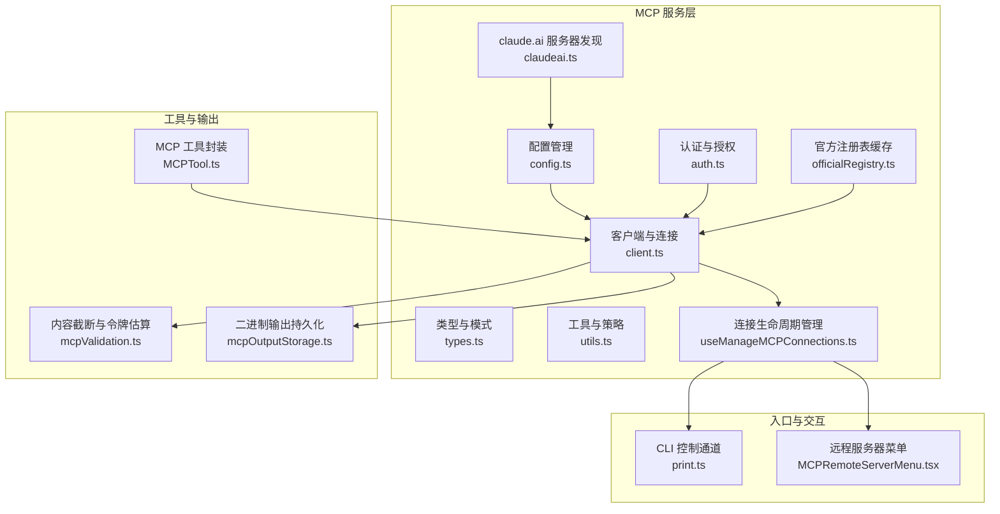
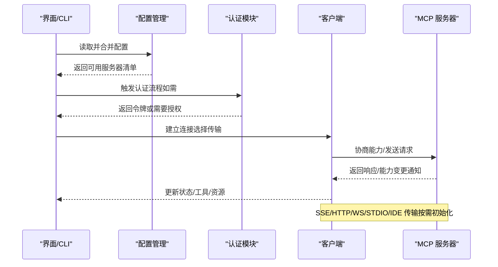
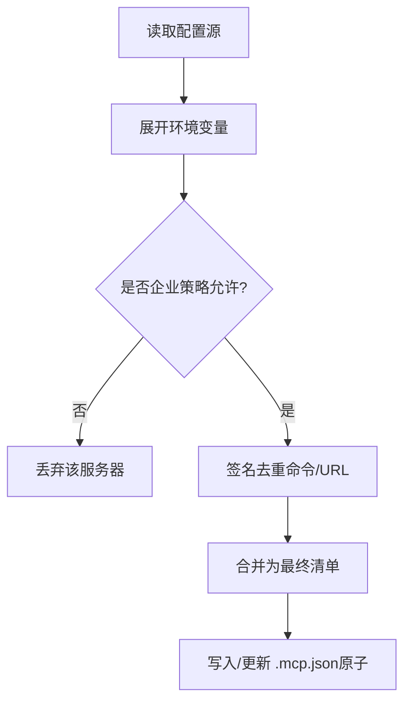
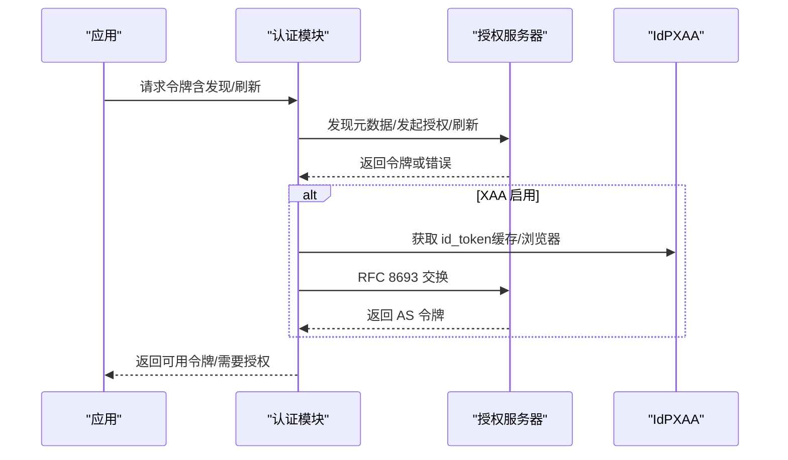
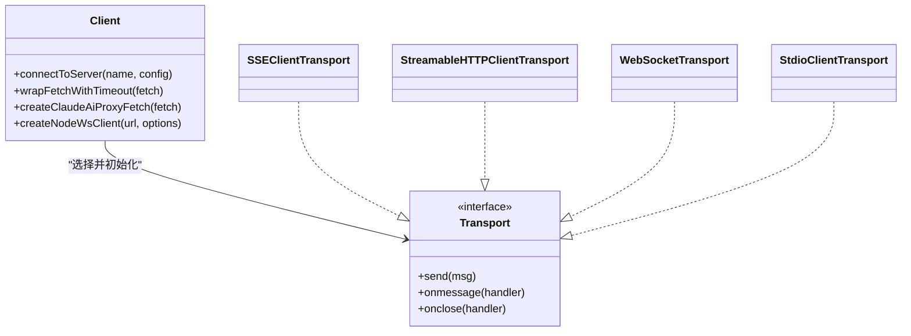
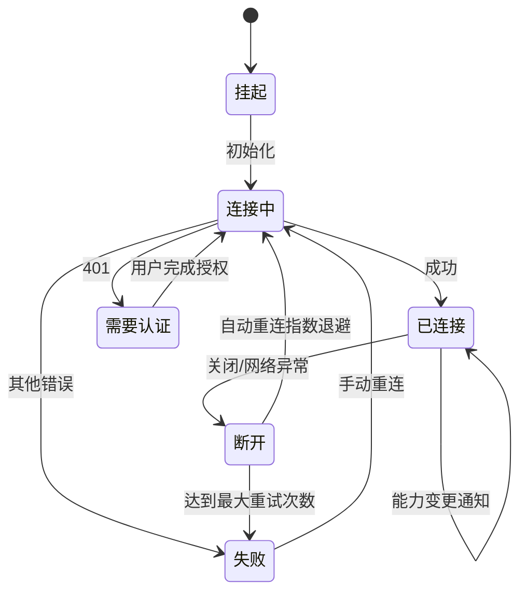
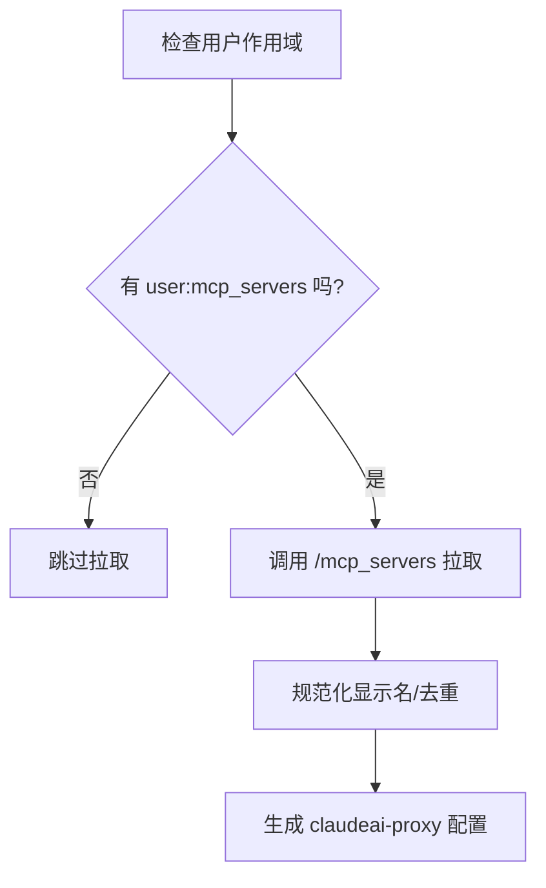
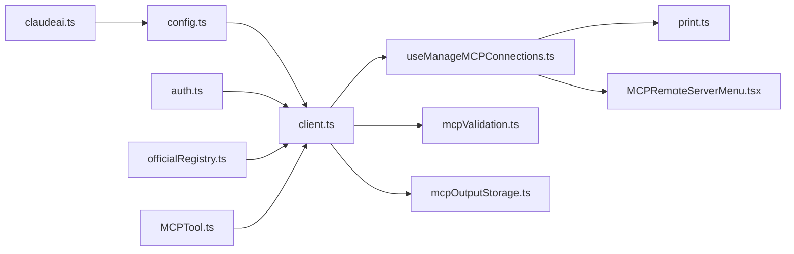

# MCP 服务

<cite>
**本文引用的文件**
- [client.ts](file://src/services/mcp/client.ts)
- [config.ts](file://src/services/mcp/config.ts)
- [auth.ts](file://src/services/mcp/auth.ts)
- [types.ts](file://src/services/mcp/types.ts)
- [utils.ts](file://src/services/mcp/utils.ts)
- [useManageMCPConnections.ts](file://src/services/mcp/useManageMCPConnections.ts)
- [claudeai.ts](file://src/services/mcp/claudeai.ts)
- [officialRegistry.ts](file://src/services/mcp/officialRegistry.ts)
- [mcpValidation.ts](file://src/utils/mcpValidation.ts)
- [mcpOutputStorage.ts](file://src/utils/mcpOutputStorage.ts)
- [MCPTool.ts](file://src/tools/MCPTool/MCPTool.ts)
- [MCPRemoteServerMenu.tsx](file://src/components/mcp/MCPRemoteServerMenu.tsx)
- [print.ts](file://src/cli/print.ts)
</cite>

## 目录
1. [简介](#简介)
2. [项目结构](#项目结构)
3. [核心组件](#核心组件)
4. [架构总览](#架构总览)
5. [详细组件分析](#详细组件分析)
6. [依赖关系分析](#依赖关系分析)
7. [性能考量](#性能考量)
8. [故障排查指南](#故障排查指南)
9. [结论](#结论)
10. [附录](#附录)

## 简介
本文件系统性梳理 Claude Code Best 中 MCP（Model Context Protocol）服务的设计与实现，覆盖 MCP 客户端、配置管理、认证机制、连接建立、协议协商、消息传输、服务器发现、连接池与重连、错误恢复、调试与性能监控等主题。文档面向不同技术背景的读者，既提供高层概览，也给出代码级的可视化与参考路径。

## 项目结构
MCP 服务主要位于 src/services/mcp 目录下，围绕“配置—认证—连接—状态—通知—资源/工具/提示词同步—输出处理”形成闭环；同时在工具层（src/tools/MCPTool）、CLI 层（src/cli/print.ts）以及 UI 组件（src/components/mcp）中提供入口与交互。

图示来源
- [config.ts:1-200](file://src/services/mcp/config.ts#L1-L200)
- [auth.ts:1-200](file://src/services/mcp/auth.ts#L1-L200)
- [client.ts:1-200](file://src/services/mcp/client.ts#L1-L200)
- [types.ts:1-120](file://src/services/mcp/types.ts#L1-L120)
- [utils.ts:1-120](file://src/services/mcp/utils.ts#L1-L120)
- [useManageMCPConnections.ts:1-120](file://src/services/mcp/useManageMCPConnections.ts#L1-L120)
- [claudeai.ts:1-120](file://src/services/mcp/claudeai.ts#L1-L120)
- [officialRegistry.ts:1-73](file://src/services/mcp/officialRegistry.ts#L1-L73)
- [mcpValidation.ts:1-120](file://src/utils/mcpValidation.ts#L1-L120)
- [mcpOutputStorage.ts:1-120](file://src/utils/mcpOutputStorage.ts#L1-L120)
- [MCPTool.ts:1-78](file://src/tools/MCPTool/MCPTool.ts#L1-L78)
- [print.ts:3277-3310](file://src/cli/print.ts#L3277-L3310)
- [MCPRemoteServerMenu.tsx:368-385](file://src/components/mcp/MCPRemoteServerMenu.tsx#L368-L385)

章节来源
- [config.ts:1-200](file://src/services/mcp/config.ts#L1-L200)
- [client.ts:1-200](file://src/services/mcp/client.ts#L1-L200)
- [auth.ts:1-200](file://src/services/mcp/auth.ts#L1-L200)
- [types.ts:1-120](file://src/services/mcp/types.ts#L1-L120)
- [utils.ts:1-120](file://src/services/mcp/utils.ts#L1-L120)
- [useManageMCPConnections.ts:1-120](file://src/services/mcp/useManageMCPConnections.ts#L1-L120)
- [claudeai.ts:1-120](file://src/services/mcp/claudeai.ts#L1-L120)
- [officialRegistry.ts:1-73](file://src/services/mcp/officialRegistry.ts#L1-L73)
- [mcpValidation.ts:1-120](file://src/utils/mcpValidation.ts#L1-L120)
- [mcpOutputStorage.ts:1-120](file://src/utils/mcpOutputStorage.ts#L1-L120)
- [MCPTool.ts:1-78](file://src/tools/MCPTool/MCPTool.ts#L1-L78)
- [print.ts:3277-3310](file://src/cli/print.ts#L3277-L3310)
- [MCPRemoteServerMenu.tsx:368-385](file://src/components/mcp/MCPRemoteServerMenu.tsx#L368-L385)

## 核心组件
- 配置管理：解析、合并、去重、策略过滤、企业策略、动态配置注入、代理与 TLS 选项、环境变量展开、签名去重、URL 规范化与安全日志。
- 认证与授权：OAuth 发现、元数据、令牌刷新、跨应用访问（XAA）、撤销、安全存储、步骤提升（step-up）与会话保持、401 自动处理与重试。
- 客户端与连接：多传输（stdio/SSE/HTTP/WebSocket/IDE）初始化、超时包装、Accept 头规范化、SSE 事件源独立 fetch、WebSocket mTLS、连接缓存、会话过期检测、错误分类与恢复。
- 生命周期与状态：批量状态更新、连接关闭回调、自动重连（指数退避）、失败/待认证/禁用/挂起状态机、能力变更通知监听与增量刷新。
- 服务器发现：claude.ai 组织级服务器拉取与命名冲突处理、官方注册表预取与命中判定。
- 输出与内容处理：MCP 输出截断阈值与策略、二进制内容持久化、格式描述与读取指引、图片压缩与令牌估算。

章节来源
- [config.ts:1-200](file://src/services/mcp/config.ts#L1-L200)
- [auth.ts:1-200](file://src/services/mcp/auth.ts#L1-L200)
- [client.ts:1-200](file://src/services/mcp/client.ts#L1-L200)
- [useManageMCPConnections.ts:1-200](file://src/services/mcp/useManageMCPConnections.ts#L1-L200)
- [claudeai.ts:1-120](file://src/services/mcp/claudeai.ts#L1-L120)
- [officialRegistry.ts:1-73](file://src/services/mcp/officialRegistry.ts#L1-L73)
- [mcpValidation.ts:1-120](file://src/utils/mcpValidation.ts#L1-L120)
- [mcpOutputStorage.ts:1-120](file://src/utils/mcpOutputStorage.ts#L1-L120)

## 架构总览
MCP 服务采用“配置驱动 + 传输抽象 + 能力感知 + 通知增量”的架构。配置层负责聚合用户/项目/企业/插件/动态/claude.ai 等多源配置并进行策略过滤；认证层通过 SDK 提供的发现与刷新能力保障安全；客户端层以统一的 MCP 协议与各传输对接，支持 SSE/HTTP/WS/STDIO/IDE 等；生命周期管理器负责连接状态、自动重连与能力变更通知；输出层对大体量结果进行截断与持久化。

图示来源
- [config.ts:1-200](file://src/services/mcp/config.ts#L1-L200)
- [auth.ts:1-200](file://src/services/mcp/auth.ts#L1-L200)
- [client.ts:1-200](file://src/services/mcp/client.ts#L1-L200)
- [useManageMCPConnections.ts:1-200](file://src/services/mcp/useManageMCPConnections.ts#L1-L200)

## 详细组件分析

### 配置管理（config.ts）
- 多源配置合并与去重：手动配置、插件配置、claude.ai 连接器、企业配置、动态配置，支持命令/URL/名称三类策略匹配与去重。
- 企业策略：允许/拒绝列表，支持名称、命令数组、URL 模式（通配），严格优先级顺序。
- 动态注入与写入：.mcp.json 原子写入、权限保留、临时文件清理；支持命令行动态配置。
- 环境变量展开与缺失检测：字符串/数组/对象字段的环境变量替换与缺失告警。
- URL 规范化与代理/TLS：代理与 mTLS 选项透传到连接层；URL 规范化用于日志与去重。
- 签名去重：基于命令/URL 的稳定哈希，避免重复连接同一后端。

图示来源
- [config.ts:1-200](file://src/services/mcp/config.ts#L1-L200)

章节来源
- [config.ts:1-200](file://src/services/mcp/config.ts#L1-L200)

### 认证与授权（auth.ts）
- OAuth 发现与元数据：支持配置的元数据 URL 或 RFC 9728/RFC 8414 探测；兼容非标准错误码归一化。
- 令牌刷新与 401 处理：带超时的独立 fetch 包装；claude.ai 代理场景的 bearer 注入与强制刷新。
- XAA（跨应用访问）：一次 IdP 登录复用，RFC 8693+jwt-bearer 交换，AS 客户端凭据保存于安全存储。
- 令牌撤销：先撤销刷新令牌再撤销访问令牌，支持 RFC 7009 与回退方案。
- 步骤提升与会话保持：保留 scope/discoveryState，避免重复探测；支持“保留步骤提升状态”的清空策略。
- 敏感参数红化与日志安全：对 state/nonce/code_verifier 等进行红化。

图示来源
- [auth.ts:1-200](file://src/services/mcp/auth.ts#L1-L200)

章节来源
- [auth.ts:1-200](file://src/services/mcp/auth.ts#L1-L200)

### 客户端与连接（client.ts）
- 传输抽象：SSEClientTransport、StreamableHTTPClientTransport、WebSocketTransport、StdioClientTransport、自定义 SDK 控制传输。
- 超时与 Accept 头：每个请求使用独立超时信号，避免“单次超时信号过期”问题；确保 Streamable HTTP 的 Accept 头符合规范。
- SSE 事件源：独立的非超时 fetch，避免长连接被短超时中断。
- WebSocket：支持 mTLS、代理、协议头、会话 ingress JWT、头部组合与日志脱敏。
- 连接缓存与会话过期：基于服务器键的连接缓存；检测 404+JSON-RPC -32001 判定会话过期并触发重建。
- 错误分类：McpAuthError、McpSessionExpiredError、McpToolCallError；统一分析字段与日志。

图示来源
- [client.ts:1-200](file://src/services/mcp/client.ts#L1-L200)

章节来源
- [client.ts:1-200](file://src/services/mcp/client.ts#L1-L200)

### 生命周期与状态管理（useManageMCPConnections.ts）
- 批量状态更新：16ms 时间窗口批处理，避免频繁渲染抖动。
- 连接关闭与自动重连：远程传输断开触发指数退避重连（最多 5 次，上限 30s），禁用/失败状态直接更新。
- 能力变更通知：监听 tools/prompt/resources 的 list_changed 通知，增量刷新工具/命令/资源。
- 通道通知（可选）：在特定特性开关下注册 claude/channel 通知处理器，支持权限回复与一次性提示。
- 插件客户端清理：重载插件时移除失效/变更的动态客户端，防止“幽灵工具”。

图示来源
- [useManageMCPConnections.ts:1-200](file://src/services/mcp/useManageMCPConnections.ts#L1-L200)

章节来源
- [useManageMCPConnections.ts:1-200](file://src/services/mcp/useManageMCPConnections.ts#L1-L200)

### 服务器发现与注册表（claudeai.ts、officialRegistry.ts）
- claude.ai 服务器：按用户作用域拉取组织级 MCP 服务器，生成“claude.ai 名称”，处理命名冲突并去重。
- 官方注册表：预取官方 MCP 服务器 URL 并进行规范化比对，用于风险识别与合规提示。

图示来源
- [claudeai.ts:1-120](file://src/services/mcp/claudeai.ts#L1-L120)
- [officialRegistry.ts:1-73](file://src/services/mcp/officialRegistry.ts#L1-L73)

章节来源
- [claudeai.ts:1-120](file://src/services/mcp/claudeai.ts#L1-L120)
- [officialRegistry.ts:1-73](file://src/services/mcp/officialRegistry.ts#L1-L73)

### 类型与模式（types.ts）
- 配置模式：stdio/sse/http/ws/sse-ide/ws-ide/sdk/claudeai-proxy 七种类型，含 OAuth/XAA 配置。
- 连接状态：connected/failed/needs-auth/pending/disabled 五态模型，携带能力、指令、清理函数等。
- CLI 序列化：客户端/工具/资源序列化结构，便于 CLI 输出与状态导出。

章节来源
- [types.ts:1-200](file://src/services/mcp/types.ts#L1-L200)

### 工具与输出处理（MCPTool.ts、mcpValidation.ts、mcpOutputStorage.ts）
- MCP 工具封装：统一的工具定义、输入/输出模式、UI 渲染钩子、截断检测与映射。
- 内容截断：基于令牌估算与阈值，对字符串与内容块进行截断，并追加提示信息；图片可压缩后写入。
- 二进制持久化：根据 MIME 推断扩展名，写入工具结果目录，提供读取指引与格式描述。

章节来源
- [MCPTool.ts:1-78](file://src/tools/MCPTool/MCPTool.ts#L1-L78)
- [mcpValidation.ts:1-200](file://src/utils/mcpValidation.ts#L1-L200)
- [mcpOutputStorage.ts:1-200](file://src/utils/mcpOutputStorage.ts#L1-L200)

### CLI 与 UI 集成点
- CLI 控制通道：处理 mcp_status、channel_enable、mcp_authenticate 等控制消息，注册/重连/通道启用。
- 远程服务器菜单：触发 OAuth 流程、等待回调、重连服务器并记录事件。

章节来源
- [print.ts:3277-3310](file://src/cli/print.ts#L3277-L3310)
- [MCPRemoteServerMenu.tsx:368-385](file://src/components/mcp/MCPRemoteServerMenu.tsx#L368-L385)

## 依赖关系分析
- 配置层依赖：设置系统、插件加载、企业策略、托管路径、平台信息。
- 认证层依赖：SDK auth、OAuth 错误模型、安全存储、锁文件、浏览器打开、跨应用访问。
- 客户端层依赖：SDK Client、传输实现、HTTP/WS 工具、代理/代理代理、mTLS、超时包装。
- 生命周期层依赖：状态存储、通知队列、通道权限、能力变更监听、插件错误聚合。
- 工具与输出层依赖：令牌估算、图像压缩、工具结果目录、分析埋点。

图示来源
- [config.ts:1-200](file://src/services/mcp/config.ts#L1-L200)
- [auth.ts:1-200](file://src/services/mcp/auth.ts#L1-L200)
- [client.ts:1-200](file://src/services/mcp/client.ts#L1-L200)
- [useManageMCPConnections.ts:1-200](file://src/services/mcp/useManageMCPConnections.ts#L1-L200)
- [mcpValidation.ts:1-200](file://src/utils/mcpValidation.ts#L1-L200)
- [mcpOutputStorage.ts:1-200](file://src/utils/mcpOutputStorage.ts#L1-L200)
- [print.ts:3277-3310](file://src/cli/print.ts#L3277-L3310)
- [MCPRemoteServerMenu.tsx:368-385](file://src/components/mcp/MCPRemoteServerMenu.tsx#L368-L385)
- [claudeai.ts:1-120](file://src/services/mcp/claudeai.ts#L1-L120)
- [officialRegistry.ts:1-73](file://src/services/mcp/officialRegistry.ts#L1-L73)
- [MCPTool.ts:1-78](file://src/tools/MCPTool/MCPTool.ts#L1-L78)

## 性能考量
- 连接与请求
  - 使用独立超时信号避免“单次超时信号过期”导致的请求失败。
  - SSE 事件源使用独立 fetch，避免长连接受短超时影响。
  - Streamable HTTP 明确设置 Accept 头，减少 406 拒绝。
- 批处理与缓存
  - 连接状态批处理（16ms 窗口）降低 UI 抖动。
  - 连接缓存与认证缓存（15 分钟 TTL）减少重复握手与认证。
  - MCP 工具/资源缓存基于名称与配置哈希，变更时主动失效。
- 重连策略
  - 指数退避（初始 1s，上限 30s，最多 5 次），避免风暴重试。
- 输出与内存
  - 大输出截断与二进制持久化，避免内存溢出与上下文污染。
  - 图像压缩在保证可读性的前提下尽量缩小体积。

## 故障排查指南
- 常见错误与定位
  - 401/未授权：检查 hasMcpDiscoveryButNoToken、handleRemoteAuthFailure、McpAuthError；查看 needs-auth 缓存与认证流程。
  - 会话过期：isMcpSessionExpiredError 检测 404+JSON-RPC -32001；触发 clearServerCache 与重建。
  - 连接失败：查看 transport 初始化日志、代理/TLS 设置、超时与 Accept 头；确认自动重连是否生效。
  - 工具/资源不更新：确认服务器是否声明对应 listChanged 能力，检查通知处理器注册。
- 调试与可观测性
  - CLI 控制通道：mcp_status、channel_enable、mcp_authenticate；注册/重连成功/失败均返回控制响应。
  - UI 行为：远程服务器菜单触发 OAuth 流程与重连；记录认证事件与等待回调。
  - 日志与埋点：大量 debug/error 事件与 analytics 事件，包括认证失败、代理 401、通道消息、列表变更等。

章节来源
- [client.ts:1-200](file://src/services/mcp/client.ts#L1-L200)
- [auth.ts:1-200](file://src/services/mcp/auth.ts#L1-L200)
- [useManageMCPConnections.ts:1-200](file://src/services/mcp/useManageMCPConnections.ts#L1-L200)
- [print.ts:3277-3310](file://src/cli/print.ts#L3277-L3310)
- [MCPRemoteServerMenu.tsx:368-385](file://src/components/mcp/MCPRemoteServerMenu.tsx#L368-L385)

## 结论
MCP 服务在配置、认证、连接、状态与输出等方面形成了高内聚、低耦合的体系：配置与策略确保安全与合规；认证模块提供稳健的 OAuth/XAA 能力；客户端层抽象多种传输并兼顾性能与可靠性；生命周期管理器通过通知与重连维持长期可用；输出层保障大体量结果的可控处理。整体设计兼顾易用性与工程化，适合在复杂环境中稳定运行。

## 附录
- 关键接口与路径参考
  - 配置读取与写入：[config.ts:1-200](file://src/services/mcp/config.ts#L1-L200)
  - 认证流程与 XAA：[auth.ts:1-200](file://src/services/mcp/auth.ts#L1-L200)
  - 客户端连接与传输：[client.ts:1-200](file://src/services/mcp/client.ts#L1-L200)
  - 生命周期与重连：[useManageMCPConnections.ts:1-200](file://src/services/mcp/useManageMCPConnections.ts#L1-L200)
  - 服务器发现与注册表：[claudeai.ts:1-120](file://src/services/mcp/claudeai.ts#L1-L120)、[officialRegistry.ts:1-73](file://src/services/mcp/officialRegistry.ts#L1-L73)
  - 输出与内容处理：[mcpValidation.ts:1-200](file://src/utils/mcpValidation.ts#L1-L200)、[mcpOutputStorage.ts:1-200](file://src/utils/mcpOutputStorage.ts#L1-L200)
  - 工具封装：[MCPTool.ts:1-78](file://src/tools/MCPTool/MCPTool.ts#L1-L78)
  - CLI 与 UI 集成：[print.ts:3277-3310](file://src/cli/print.ts#L3277-L3310)、[MCPRemoteServerMenu.tsx:368-385](file://src/components/mcp/MCPRemoteServerMenu.tsx#L368-L385)