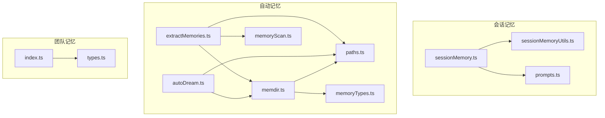
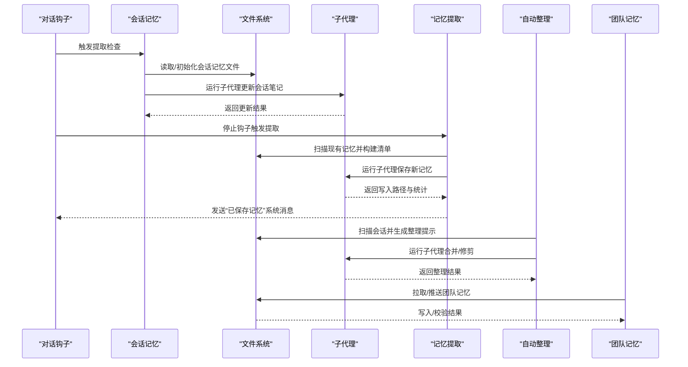
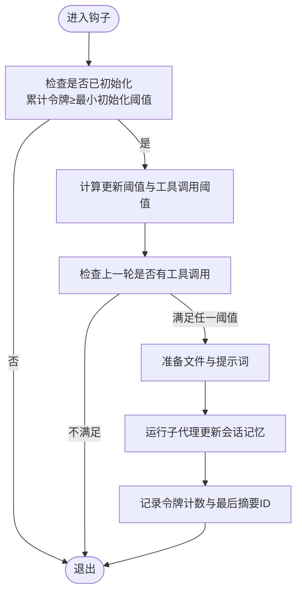
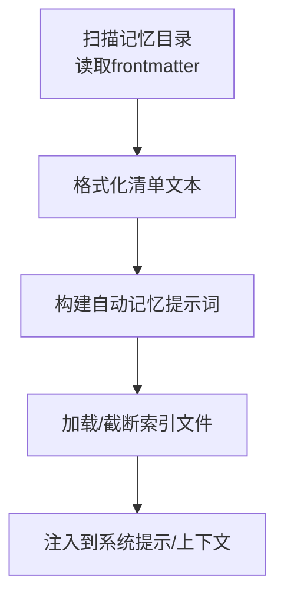
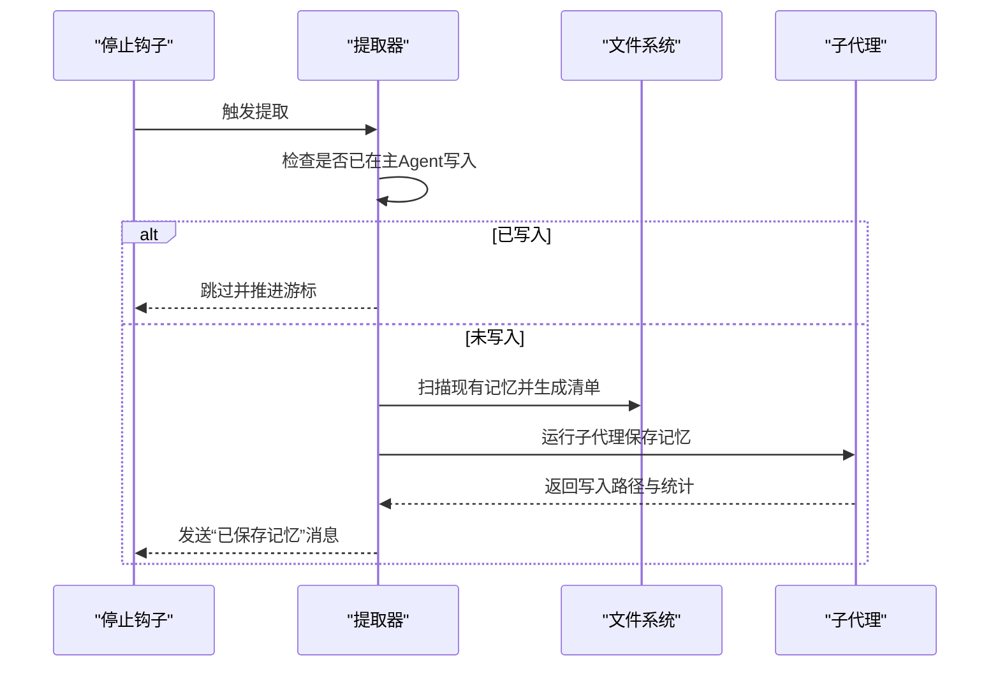
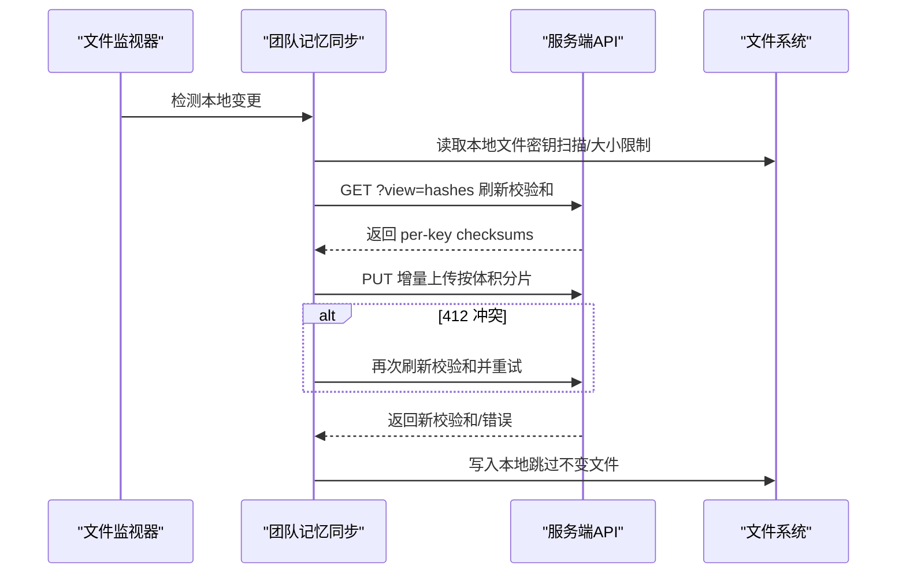
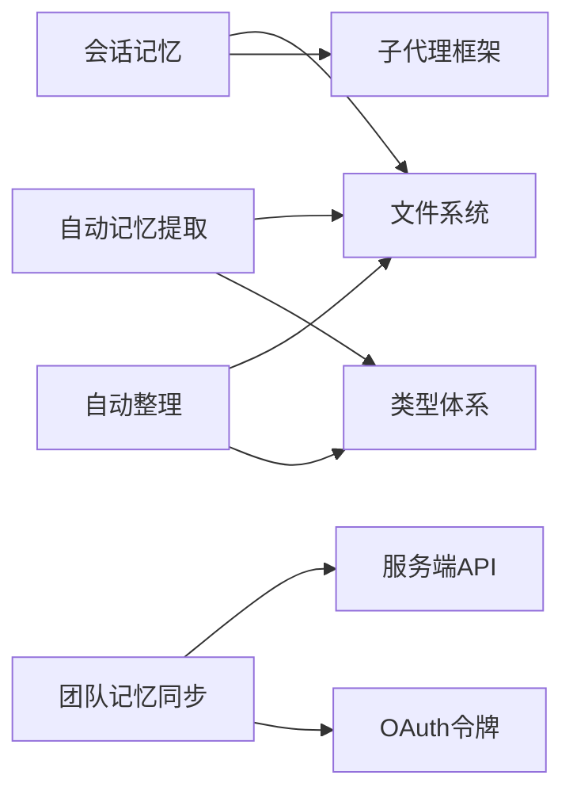

# 内存服务

<cite>
**本文档引用的文件**
- [sessionMemory.ts](file://src/services/SessionMemory/sessionMemory.ts)
- [sessionMemoryUtils.ts](file://src/services/SessionMemory/sessionMemoryUtils.ts)
- [prompts.ts](file://src/services/SessionMemory/prompts.ts)
- [memdir.ts](file://src/memdir/memdir.ts)
- [memoryTypes.ts](file://src/memdir/memoryTypes.ts)
- [paths.ts](file://src/memdir/paths.ts)
- [memoryScan.ts](file://src/memdir/memoryScan.ts)
- [extractMemories.ts](file://src/services/extractMemories/extractMemories.ts)
- [autoDream.ts](file://src/services/autoDream/autoDream.ts)
- [index.ts](file://src/services/teamMemorySync/index.ts)
- [types.ts](file://src/services/teamMemorySync/types.ts)
- [teamMemSaved.ts](file://src/components/messages/teamMemSaved.ts)
- [teammem.md](file://docs/features/teammem.md)
- [V6.md](file://V6.md)
</cite>

## 目录
1. [简介](#简介)
2. [项目结构](#项目结构)
3. [核心组件](#核心组件)
4. [架构总览](#架构总览)
5. [详细组件分析](#详细组件分析)
6. [依赖关系分析](#依赖关系分析)
7. [性能考量](#性能考量)
8. [故障排查指南](#故障排查指南)
9. [结论](#结论)
10. [附录](#附录)

## 简介
本技术文档面向 Claude Code Best 的内存服务，系统性阐述会话记忆管理、记忆提取与团队内存同步的接口规范、存储结构、检索算法与缓存策略，并给出持久化、增量更新与冲突解决机制的实现细节与优化建议。文档同时提供面向非专业读者的渐进式解释与可视化图示，帮助快速理解与落地使用。

## 项目结构
内存服务由三大子系统构成：
- 会话记忆（Session Memory）：在对话过程中后台提取并维护一个结构化的会话笔记文件，支持阈值触发与手动触发。
- 自动记忆（Auto Memory）：基于文件系统的 typed-memory 目录，按四类类型组织记忆，支持索引文件（MEMORY.md）与主题文件分离，具备截断与容量控制。
- 团队记忆（Team Memory）：跨会话、跨 Agent 共享的记忆目录，通过增量同步与乐观锁保障一致性。

**图表来源**
- [sessionMemory.ts:1-496](file://src/services/SessionMemory/sessionMemory.ts#L1-L496)
- [sessionMemoryUtils.ts:1-208](file://src/services/SessionMemory/sessionMemoryUtils.ts#L1-L208)
- [prompts.ts:1-325](file://src/services/SessionMemory/prompts.ts#L1-L325)
- [memdir.ts:1-508](file://src/memdir/memdir.ts#L1-L508)
- [memoryTypes.ts:1-272](file://src/memdir/memoryTypes.ts#L1-L272)
- [paths.ts:1-279](file://src/memdir/paths.ts#L1-L279)
- [memoryScan.ts:1-94](file://src/memdir/memoryScan.ts#L1-L94)
- [extractMemories.ts:1-616](file://src/services/extractMemories/extractMemories.ts#L1-L616)
- [autoDream.ts:1-327](file://src/services/autoDream/autoDream.ts#L1-L327)
- [index.ts:1-1257](file://src/services/teamMemorySync/index.ts#L1-L1257)
- [types.ts:1-157](file://src/services/teamMemorySync/types.ts#L1-L157)

**章节来源**
- [V6.md:1106-1196](file://V6.md#L1106-L1196)

## 核心组件
- 会话记忆模块：负责在对话钩子中按阈值触发提取，或由命令手动触发；通过模板与提示词生成更新内容，仅允许对指定文件进行编辑。
- 自动记忆模块：统一构建 typed-memory 行为指引与索引加载逻辑；提供 MEMORY.md 截断策略与容量限制；支持搜索过去上下文。
- 提取与整理模块：在每轮对话结束时后台提取记忆，限定工具权限，避免重复执行；定期后台整理（autoDream）合并与修剪记忆。
- 团队记忆模块：基于 GitHub 仓库的 per-repo 同步，采用增量上传与乐观锁；支持密钥扫描与路径穿越防护。

**章节来源**
- [sessionMemory.ts:1-496](file://src/services/SessionMemory/sessionMemory.ts#L1-L496)
- [memdir.ts:1-508](file://src/memdir/memdir.ts#L1-L508)
- [extractMemories.ts:1-616](file://src/services/extractMemories/extractMemories.ts#L1-L616)
- [autoDream.ts:1-327](file://src/services/autoDream/autoDream.ts#L1-L327)
- [index.ts:1-1257](file://src/services/teamMemorySync/index.ts#L1-L1257)

## 架构总览
内存服务的整体流程包括：会话记忆阈值判断与提取、自动记忆提取与索引维护、后台整理与压缩、团队记忆的拉取与推送。下图展示关键调用序列：

**图表来源**
- [sessionMemory.ts:269-375](file://src/services/SessionMemory/sessionMemory.ts#L269-L375)
- [extractMemories.ts:598-616](file://src/services/extractMemories/extractMemories.ts#L598-L616)
- [autoDream.ts:321-327](file://src/services/autoDream/autoDream.ts#L321-L327)
- [index.ts:770-800](file://src/services/teamMemorySync/index.ts#L770-L800)

## 详细组件分析

### 会话记忆（Session Memory）
- 触发条件
  - 初始化阈值：累计上下文窗口令牌数达到最小初始化阈值后启用。
  - 更新阈值：自上次提取以来上下文增长超过最小更新阈值；或上一轮无工具调用时亦可触发。
  - 工具调用阈值：自上次总结以来工具调用次数达到设定值。
- 文件与模板
  - 使用专用目录与文件路径，首次创建时写入模板；后续每次提取前读取当前内容。
  - 支持自定义模板与提示词，内置节长与总量上限检查与提醒。
- 工具权限
  - 仅允许对会话记忆文件执行编辑；其他工具调用一律拒绝，防止越权写入。
- 配置与状态
  - 配置项包括初始化阈值、更新阈值、工具调用间隔等；状态包括最后摘要消息 ID、提取时间戳、令牌计数等。
- 接口
  - 初始化：注册钩子，延迟加载远程配置。
  - 手动提取：绕过阈值直接触发，用于 /summary 命令。

**图表来源**
- [sessionMemory.ts:134-181](file://src/services/SessionMemory/sessionMemory.ts#L134-L181)
- [sessionMemoryUtils.ts:173-196](file://src/services/SessionMemory/sessionMemoryUtils.ts#L173-L196)

**章节来源**
- [sessionMemory.ts:134-375](file://src/services/SessionMemory/sessionMemory.ts#L134-L375)
- [sessionMemoryUtils.ts:1-208](file://src/services/SessionMemory/sessionMemoryUtils.ts#L1-L208)
- [prompts.ts:226-325](file://src/services/SessionMemory/prompts.ts#L226-L325)

### 自动记忆（Auto Memory）
- 存储结构
  - 目录：~/.claude/projects/<git-root>/memory/
  - 索引：MEMORY.md（最多200行，约25KB），作为主题文件的入口索引。
  - 主题文件：按四类类型（user/feedback/project/reference）组织，带 frontmatter。
- 行为指引
  - 明确“可保存/不可保存”的边界，强调不可复制派生信息（代码、历史、文档等）。
  - 提供“何时访问”“如何信任回忆”等指导，降低漂移风险。
- 搜索与索引
  - 通过扫描 frontmatter 快速生成清单，避免模型浪费令牌执行 ls。
  - 支持搜索 past context 的提示（受特性开关控制）。
- 截断策略
  - 先按行截断，再按字节截断至最近换行，附加警告提示。

**图表来源**
- [memoryScan.ts:45-94](file://src/memdir/memoryScan.ts#L45-L94)
- [memdir.ts:269-316](file://src/memdir/memdir.ts#L269-L316)
- [memdir.ts:419-507](file://src/memdir/memdir.ts#L419-L507)

**章节来源**
- [memdir.ts:1-508](file://src/memdir/memdir.ts#L1-L508)
- [memoryTypes.ts:1-272](file://src/memdir/memoryTypes.ts#L1-L272)
- [memoryScan.ts:1-94](file://src/memdir/memoryScan.ts#L1-L94)
- [paths.ts:1-279](file://src/memdir/paths.ts#L1-L279)

### 记忆提取（Extract Memories）
- 触发时机
  - 在每轮对话结束的停止钩子中触发，避免打断主流程。
- 工具权限
  - 仅允许只读工具（读取/搜索/Glob）与对 auto-memory 目录的只读 Shell 命令；编辑/写入仅限于 auto-memory 目录。
- 去重与互斥
  - 若主 Agent 已写入记忆，则跳过后台提取；否则按新消息增量提取。
- 输出与反馈
  - 统计写入文件数量、记忆条目数量、团队记忆数量；向系统消息注入“已保存记忆”提示。
- 并发与尾随运行
  - 支持并发去重（同批次多个触发合并为一次实际运行），并在完成后执行尾随运行以处理最新上下文。

**图表来源**
- [extractMemories.ts:527-587](file://src/services/extractMemories/extractMemories.ts#L527-L587)

**章节来源**
- [extractMemories.ts:1-616](file://src/services/extractMemories/extractMemories.ts#L1-L616)

### 自动整理（Auto Dream）
- 触发条件
  - 时间门限：自上次整理以来小时数达到最小值。
  - 会话门限：自上次整理以来新增会话数达到最小值。
  - 锁定机制：并发安全的整理锁，避免重复运行。
- 运行过程
  - 构建整理提示词，约束工具权限（只读 Shell），扫描会话并生成摘要。
  - 将整理结果写回主题文件与索引，向系统消息注入“已改进”提示。
- 任务状态
  - 通过任务系统跟踪进度与文件触达情况，支持用户中断与回滚。

**章节来源**
- [autoDream.ts:1-327](file://src/services/autoDream/autoDream.ts#L1-L327)

### 团队记忆同步（Team Memory Sync）
- 同步协议
  - 拉取：GET /api/claude_code/team_memory?repo={owner/repo}（含 ETag 条件请求）。
  - 推送：PUT /api/claude_code/team_memory?repo={owner/repo}（upsert 语义）。
  - 哈希视图：GET ?view=hashes 仅返回 per-key checksums，用于冲突重试。
- 冲突解决
  - 乐观锁：基于 ETag 的 If-Match/If-None-Match；412 冲突时刷新 serverChecksums 并重新计算 delta。
  - 本地优先：推送时若发生冲突，保留本地版本，避免覆盖用户最新编辑。
- 增量与容量
  - 增量上传：仅上传内容哈希变化的键；批量上传按体积分片（≤200KB）。
  - 容量学习：从 413 结构化错误中学习服务端最大条目限制，后续推送自动裁剪。
- 安全与合规
  - 密钥扫描：推送前扫描文件内容，跳过包含敏感信息的文件并记录告警。
  - 路径穿越防护：严格校验写入路径在 team 目录边界内。
- 接口
  - pullTeamMemory：从服务端拉取并写入本地，server-wins 语义。
  - pushTeamMemory：增量上传，冲突重试，返回上传统计与错误类型。

**图表来源**
- [index.ts:889-1112](file://src/services/teamMemorySync/index.ts#L889-L1112)
- [types.ts:77-157](file://src/services/teamMemorySync/types.ts#L77-L157)

**章节来源**
- [index.ts:1-1257](file://src/services/teamMemorySync/index.ts#L1-L1257)
- [types.ts:1-157](file://src/services/teamMemorySync/types.ts#L1-L157)
- [teammem.md:1-48](file://docs/features/teammem.md#L1-L48)

## 依赖关系分析
- 会话记忆依赖文件系统与子代理框架，通过钩子集成到对话循环；配置来自远程动态配置缓存。
- 自动记忆依赖 typed-memory 类型体系与路径解析，结合扫描与截断策略保证索引可控。
- 提取与整理依赖自动记忆目录与工具权限约束，确保只读与最小权限原则。
- 团队记忆依赖 OAuth 令牌与服务端 API，采用 ETag 乐观锁与增量上传。

**图表来源**
- [sessionMemory.ts:1-496](file://src/services/SessionMemory/sessionMemory.ts#L1-L496)
- [extractMemories.ts:1-616](file://src/services/extractMemories/extractMemories.ts#L1-L616)
- [autoDream.ts:1-327](file://src/services/autoDream/autoDream.ts#L1-L327)
- [index.ts:1-1257](file://src/services/teamMemorySync/index.ts#L1-L1257)

**章节来源**
- [sessionMemory.ts:1-496](file://src/services/SessionMemory/sessionMemory.ts#L1-L496)
- [memdir.ts:1-508](file://src/memdir/memdir.ts#L1-L508)
- [extractMemories.ts:1-616](file://src/services/extractMemories/extractMemories.ts#L1-L616)
- [autoDream.ts:1-327](file://src/services/autoDream/autoDream.ts#L1-L327)
- [index.ts:1-1257](file://src/services/teamMemorySync/index.ts#L1-L1257)

## 性能考量
- 会话记忆
  - 阈值设计避免频繁提取；模板与提示词变量替换减少重复计算；仅在主线程运行以避免子代理竞争。
  - 建议：合理设置工具调用阈值与更新阈值，平衡信息密度与成本。
- 自动记忆
  - frontmatter 扫描与清单格式化避免模型执行昂贵的文件系统操作；索引截断控制上下文大小。
  - 建议：定期运行 autoDream 合并冗余记忆，保持索引简洁。
- 提取与整理
  - 工具权限白名单与互斥逻辑避免重复工作；并发去重与尾随运行提升吞吐。
  - 建议：根据项目规模调整提取节流参数（tengu_bramble_lintel）。
- 团队记忆
  - 增量上传与体积分片降低网络负载；冲突重试与容量学习减少失败重试。
  - 建议：开启密钥扫描与路径穿越防护，避免合规风险与异常写入。

[本节为通用性能建议，无需特定文件引用]

## 故障排查指南
- 会话记忆
  - 症状：无法提取或提取频率过低
  - 排查：检查初始化与更新阈值配置；确认钩子是否在主线程运行；查看提取日志与令牌计数记录。
  - 相关文件：[sessionMemory.ts:269-375](file://src/services/SessionMemory/sessionMemory.ts#L269-L375)，[sessionMemoryUtils.ts:173-196](file://src/services/SessionMemory/sessionMemoryUtils.ts#L173-L196)
- 自动记忆
  - 症状：索引过大导致上下文截断
  - 排查：检查 MEMORY.md 行数与字节数；确认截断逻辑是否生效；核对类型与保存边界。
  - 相关文件：[memdir.ts:57-103](file://src/memdir/memdir.ts#L57-L103)，[memoryTypes.ts:180-222](file://src/memdir/memoryTypes.ts#L180-L222)
- 提取与整理
  - 症状：后台提取未执行或重复执行
  - 排查：确认主 Agent 是否已写入记忆；检查并发去重与尾随运行；查看工具权限拒绝日志。
  - 相关文件：[extractMemories.ts:348-360](file://src/services/extractMemories/extractMemories.ts#L348-L360)，[extractMemories.ts:527-587](file://src/services/extractMemories/extractMemories.ts#L527-L587)
- 团队记忆
  - 症状：推送 412 冲突或容量超限
  - 排查：确认 ETag 与 serverChecksums；检查增量 delta 与体分片；学习服务端最大条目限制并裁剪。
  - 相关文件：[index.ts:889-1112](file://src/services/teamMemorySync/index.ts#L889-L1112)，[types.ts:47-57](file://src/services/teamMemorySync/types.ts#L47-L57)

**章节来源**
- [sessionMemory.ts:269-375](file://src/services/SessionMemory/sessionMemory.ts#L269-L375)
- [sessionMemoryUtils.ts:173-196](file://src/services/SessionMemory/sessionMemoryUtils.ts#L173-L196)
- [memdir.ts:57-103](file://src/memdir/memdir.ts#L57-L103)
- [memoryTypes.ts:180-222](file://src/memdir/memoryTypes.ts#L180-L222)
- [extractMemories.ts:348-360](file://src/services/extractMemories/extractMemories.ts#L348-L360)
- [extractMemories.ts:527-587](file://src/services/extractMemories/extractMemories.ts#L527-L587)
- [index.ts:889-1112](file://src/services/teamMemorySync/index.ts#L889-L1112)
- [types.ts:47-57](file://src/services/teamMemorySync/types.ts#L47-L57)

## 结论
内存服务通过“会话记忆 + 自动记忆 + 团队记忆”的分层设计，在保证安全性与合规性的前提下，实现了高效、可扩展的记忆管理与同步能力。会话记忆聚焦对话连续性，自动记忆强调长期知识沉淀，团队记忆促进跨成员协作。配合阈值控制、增量更新与冲突解决机制，整体方案兼顾性能与可靠性。

[本节为总结性内容，无需特定文件引用]

## 附录

### 接口规范与数据模型

- 会话记忆
  - 配置项：minimumMessageTokensToInit、minimumTokensBetweenUpdate、toolCallsBetweenUpdates
  - 状态项：lastSummarizedMessageId、extractionStartedAt、tokensAtLastExtraction、initialized
  - 关键函数：shouldExtractMemory、manuallyExtractSessionMemory、createMemoryFileCanUseTool
  - 相关文件：[sessionMemoryUtils.ts:18-196](file://src/services/SessionMemory/sessionMemoryUtils.ts#L18-L196)，[sessionMemory.ts:134-453](file://src/services/SessionMemory/sessionMemory.ts#L134-L453)

- 自动记忆
  - 存储：MEMORY.md（索引）、主题文件（四类类型）
  - 截断：行数与字节双重限制，附加警告
  - 类型：user/feedback/project/reference
  - 相关文件：[memdir.ts:57-103](file://src/memdir/memdir.ts#L57-L103)，[memoryTypes.ts:14-31](file://src/memdir/memoryTypes.ts#L14-L31)

- 团队记忆
  - API：GET/PUT（含 view=hashes）、ETag 条件请求
  - 数据模型：entries（相对路径→内容）、entryChecksums（sha256）
  - 相关文件：[types.ts:16-57](file://src/services/teamMemorySync/types.ts#L16-L57)，[index.ts:163-184](file://src/services/teamMemorySync/index.ts#L163-L184)

- UI 与消息
  - 团队记忆保存提示：teamMemSavedPart
  - 相关文件：[teamMemSaved.ts:1-19](file://src/components/messages/teamMemSaved.ts#L1-L19)

**章节来源**
- [sessionMemoryUtils.ts:18-196](file://src/services/SessionMemory/sessionMemoryUtils.ts#L18-L196)
- [sessionMemory.ts:134-453](file://src/services/SessionMemory/sessionMemory.ts#L134-L453)
- [memdir.ts:57-103](file://src/memdir/memdir.ts#L57-L103)
- [memoryTypes.ts:14-31](file://src/memdir/memoryTypes.ts#L14-L31)
- [types.ts:16-57](file://src/services/teamMemorySync/types.ts#L16-L57)
- [index.ts:163-184](file://src/services/teamMemorySync/index.ts#L163-L184)
- [teamMemSaved.ts:1-19](file://src/components/messages/teamMemSaved.ts#L1-L19)