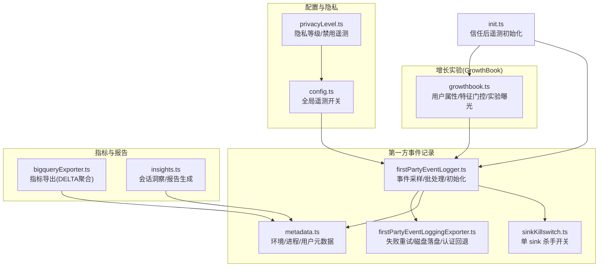
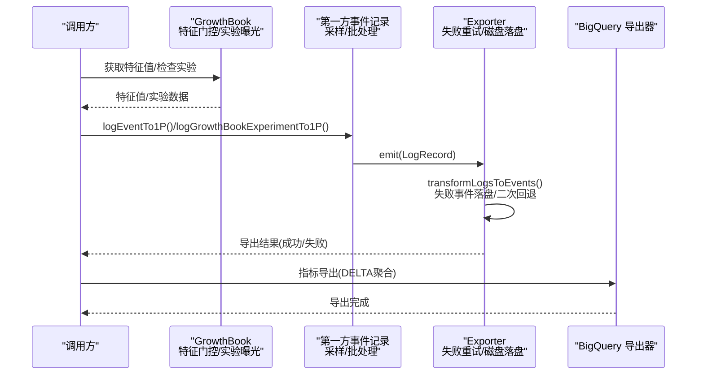
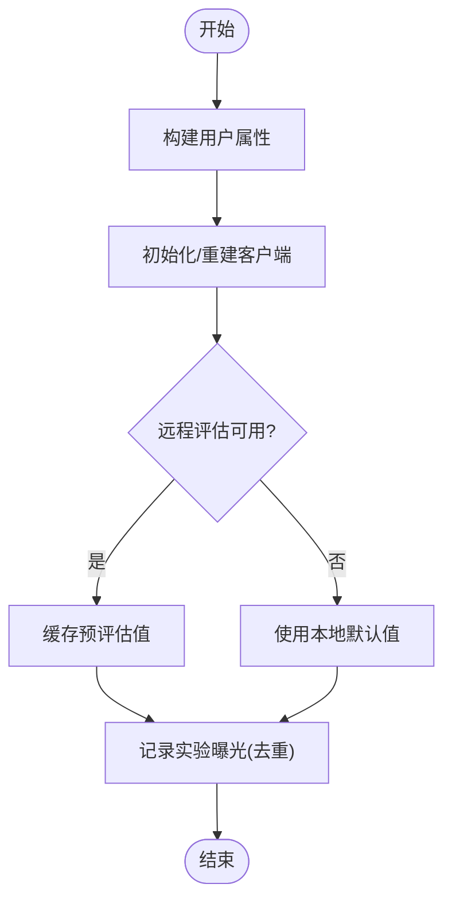
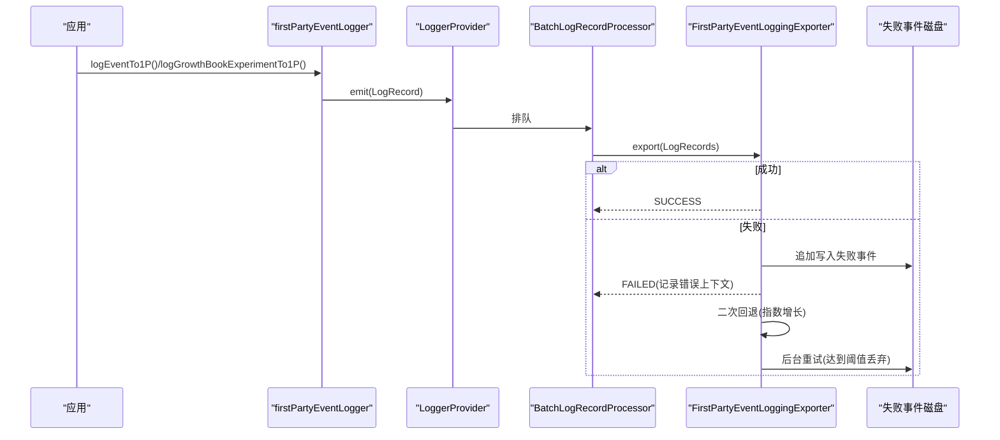
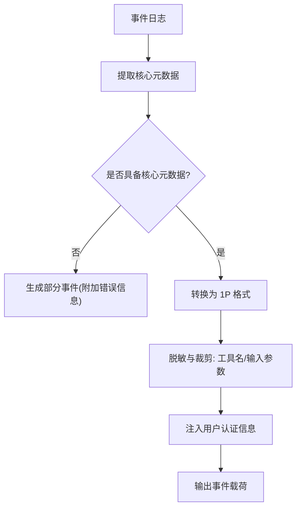
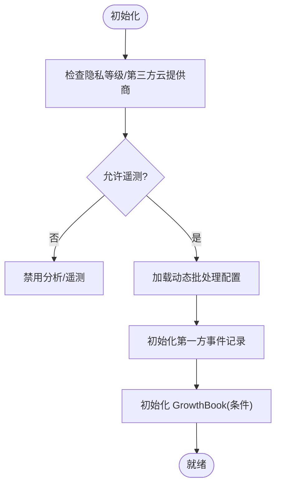
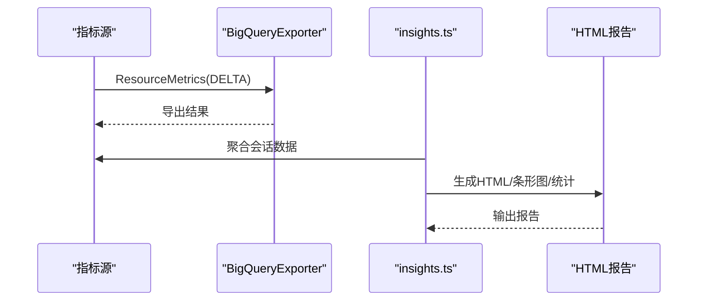
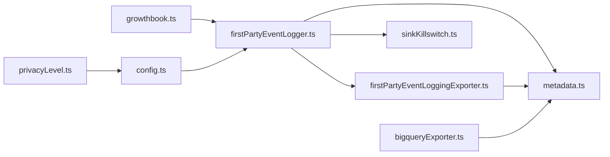

# 分析服务

<cite>
**本文引用的文件**
- [growthbook.ts](file://src/services/analytics/growthbook.ts)
- [firstPartyEventLogger.ts](file://src/services/analytics/firstPartyEventLogger.ts)
- [firstPartyEventLoggingExporter.ts](file://src/services/analytics/firstPartyEventLoggingExporter.ts)
- [sinkKillswitch.ts](file://src/services/analytics/sinkKillswitch.ts)
- [config.ts](file://src/services/analytics/config.ts)
- [metadata.ts](file://src/services/analytics/metadata.ts)
- [privacyLevel.ts](file://src/utils/privacyLevel.ts)
- [bigqueryExporter.ts](file://src/utils/telemetry/bigqueryExporter.ts)
- [init.ts](file://src/entrypoints/init.ts)
- [growthbook-ab-testing.mdx](file://docs/internals/growthbook-ab-testing.mdx)
- [telemetry-remote-config-audit.md](file://docs/telemetry-remote-config-audit.md)
- [growthbook-enablement-plan.md](file://docs/features/growthbook-enablement-plan.md)
- [insights.ts](file://src/commands/insights.ts)
</cite>

## 目录
1. [简介](#简介)
2. [项目结构](#项目结构)
3. [核心组件](#核心组件)
4. [架构总览](#架构总览)
5. [详细组件分析](#详细组件分析)
6. [依赖关系分析](#依赖关系分析)
7. [性能考量](#性能考量)
8. [故障排查指南](#故障排查指南)
9. [结论](#结论)
10. [附录](#附录)

## 简介
本技术文档面向 Claude Code Best 的分析服务，系统化阐述事件采集、增长实验（A/B 测试）与第一方事件记录的接口规范、事件数据结构、采样策略与隐私保护机制，并覆盖 AB 实验配置、指标计算与报告生成流程，以及分析服务的配置选项与数据导出方法。文档旨在帮助开发者与运营人员快速理解并正确使用分析能力。

## 项目结构
分析服务主要由以下模块构成：
- 增长实验（GrowthBook）：负责用户定向、实验曝光追踪与动态配置下发。
- 第一方事件记录：独立于客户 OTLP 遥测，用于内部事件批量上报与持久化。
- 元数据与隐私：统一事件元数据格式、工具名称脱敏、输入参数截断与隐私等级控制。
- 配置与开关：全局遥测开关、单 sink 杀手开关、批处理配置等。
- 指标导出与报告：BigQuery 指标导出器与洞察命令的报告生成。

**图表来源**
- [growthbook.ts:1-1257](file://src/services/analytics/growthbook.ts#L1-L1257)
- [firstPartyEventLogger.ts:1-450](file://src/services/analytics/firstPartyEventLogger.ts#L1-L450)
- [firstPartyEventLoggingExporter.ts:1-807](file://src/services/analytics/firstPartyEventLoggingExporter.ts#L1-L807)
- [metadata.ts:1-974](file://src/services/analytics/metadata.ts#L1-L974)
- [sinkKillswitch.ts:1-26](file://src/services/analytics/sinkKillswitch.ts#L1-L26)
- [config.ts:1-39](file://src/services/analytics/config.ts#L1-L39)
- [privacyLevel.ts:1-56](file://src/utils/privacyLevel.ts#L1-L56)
- [bigqueryExporter.ts:87-252](file://src/utils/telemetry/bigqueryExporter.ts#L87-L252)
- [init.ts:244-290](file://src/entrypoints/init.ts#L244-L290)
- [insights.ts:1913-2719](file://src/commands/insights.ts#L1913-L2719)

**章节来源**
- [growthbook.ts:1-1257](file://src/services/analytics/growthbook.ts#L1-L1257)
- [firstPartyEventLogger.ts:1-450](file://src/services/analytics/firstPartyEventLogger.ts#L1-L450)
- [firstPartyEventLoggingExporter.ts:1-807](file://src/services/analytics/firstPartyEventLoggingExporter.ts#L1-L807)
- [metadata.ts:1-974](file://src/services/analytics/metadata.ts#L1-L974)
- [sinkKillswitch.ts:1-26](file://src/services/analytics/sinkKillswitch.ts#L1-L26)
- [config.ts:1-39](file://src/services/analytics/config.ts#L1-L39)
- [privacyLevel.ts:1-56](file://src/utils/privacyLevel.ts#L1-L56)
- [bigqueryExporter.ts:87-252](file://src/utils/telemetry/bigqueryExporter.ts#L87-L252)
- [init.ts:244-290](file://src/entrypoints/init.ts#L244-L290)
- [insights.ts:1913-2719](file://src/commands/insights.ts#L1913-L2719)

## 核心组件
- 增长实验（GrowthBook）
  - 用户属性与特征门控：支持按平台、订阅类型、组织/账户 UUID、首次令牌时间等属性进行用户定向。
  - 实验曝光追踪：在访问特征值时记录曝光事件，避免会话内重复上报。
  - 本地默认值与覆盖：在无网络或禁用远程评估时，使用本地默认值；支持环境变量与内部配置覆盖。
  - 远程评估与缓存：处理 API 返回字段差异，缓存预评估值，定期刷新并落盘。
- 第一方事件记录
  - 事件采样：按事件类型配置采样率，随机丢弃以降低带宽与存储压力。
  - 批处理与导出：基于 OpenTelemetry BatchLogRecordProcessor，支持延迟、批次大小与队列上限配置。
  - 失败重试与磁盘落盘：网络失败时追加写入失败事件文件，采用二次回退策略，达到最大尝试次数后丢弃。
  - 认证回退：当 OAuth 令牌无效或缺少必要作用域时，自动降级为无认证发送。
- 元数据与隐私
  - 统一元数据：环境信息、进程指标、会话标识、代理/团队信息、订阅类型、仓库哈希等。
  - 工具名称脱敏：MCP 工具名按规则脱敏，避免泄露用户特定服务器配置。
  - 输入参数截断：对工具输入进行长度与深度限制，防止敏感信息泄露。
  - 隐私等级：支持 default/no-telemetry/essential-traffic 三档，统一控制遥测与非必要流量。
- 配置与开关
  - 全局遥测开关：测试环境、第三方云提供商（Bedrock/Vertex/Foundry）与隐私等级共同决定是否启用。
  - 单 sink 杀手开关：动态配置可临时禁用 Datadog 或第一方事件记录。
  - 批处理配置：通过动态配置调整导出延迟、批次大小、队列上限、重试次数与端点。
- 指标导出与报告
  - BigQuery 指标导出：DELTA 聚合时序，转换属性为字符串键值，确保仪表板稳定聚合。
  - 洞察与报告：命令行生成会话洞察 HTML 报告，包含时段分布、目标类别、结果与摩擦度量等。

**章节来源**
- [growthbook.ts:28-555](file://src/services/analytics/growthbook.ts#L28-L555)
- [firstPartyEventLogger.ts:27-449](file://src/services/analytics/firstPartyEventLogger.ts#L27-L449)
- [firstPartyEventLoggingExporter.ts:48-779](file://src/services/analytics/firstPartyEventLoggingExporter.ts#L48-L779)
- [metadata.ts:44-974](file://src/services/analytics/metadata.ts#L44-L974)
- [privacyLevel.ts:1-56](file://src/utils/privacyLevel.ts#L1-L56)
- [config.ts:1-39](file://src/services/analytics/config.ts#L1-L39)
- [bigqueryExporter.ts:221-252](file://src/utils/telemetry/bigqueryExporter.ts#L221-L252)
- [insights.ts:1913-2719](file://src/commands/insights.ts#L1913-L2719)

## 架构总览
分析服务采用“增长实验 + 第一方事件记录 + 元数据与隐私 + 配置与开关”的分层设计，既保证了实验的实时性与可控性，又确保内部事件的高可靠与可审计。

**图表来源**
- [growthbook.ts:748-793](file://src/services/analytics/growthbook.ts#L748-L793)
- [firstPartyEventLogger.ts:156-230](file://src/services/analytics/firstPartyEventLogger.ts#L156-L230)
- [firstPartyEventLoggingExporter.ts:277-377](file://src/services/analytics/firstPartyEventLoggingExporter.ts#L277-L377)
- [bigqueryExporter.ts:87-128](file://src/utils/telemetry/bigqueryExporter.ts#L87-L128)

## 详细组件分析

### 增长实验（GrowthBook）接口规范
- 用户属性
  - 关键字段：设备 ID、会话 ID、平台、组织/账户 UUID、订阅类型、首次令牌时间、应用版本、GitHub Actions 元数据等。
  - 属性来源：核心用户数据与 OAuth 配置，支持 Ant 内部构建下优先使用 OAuth 邮箱。
- 特征门控
  - 支持环境变量覆盖与内部配置覆盖，后者可在 /config Gates 标签页动态修改。
  - 本地默认值：在无网络或禁用远程评估时启用，涵盖纯本地功能与 API 依赖功能。
  - 远程评估：处理 API 返回字段差异，缓存预评估值并定期刷新，避免冻结旧值。
- 实验曝光
  - 访问特征值时记录一次曝光事件，会话内去重，避免重复上报。
  - 曝光事件包含实验 ID、变体 ID、用户属性与实验元数据。

**图表来源**
- [growthbook.ts:524-555](file://src/services/analytics/growthbook.ts#L524-L555)
- [growthbook.ts:699-742](file://src/services/analytics/growthbook.ts#L699-L742)
- [growthbook.ts:327-394](file://src/services/analytics/growthbook.ts#L327-L394)
- [growthbook.ts:296-314](file://src/services/analytics/growthbook.ts#L296-L314)

**章节来源**
- [growthbook.ts:28-555](file://src/services/analytics/growthbook.ts#L28-L555)
- [growthbook.ts:557-742](file://src/services/analytics/growthbook.ts#L557-L742)
- [growthbook.ts:748-793](file://src/services/analytics/growthbook.ts#L748-L793)
- [growthbook.ts:296-314](file://src/services/analytics/growthbook.ts#L296-L314)
- [growthbook-ab-testing.mdx:1-120](file://docs/internals/growthbook-ab-testing.mdx#L1-L120)

### 第一方事件记录接口规范
- 事件采样
  - 采样配置：按事件名配置采样率（0-1），未配置则默认 100%。
  - 采样判定：随机判断是否丢弃，0 表示全部丢弃，≥1 表示全部保留。
- 批处理与导出
  - 批处理参数：导出延迟、最大批次大小、最大队列大小、最大尝试次数、基础回退延迟、最大回退延迟。
  - 导出端点：默认生产端点，可通过动态配置覆盖；支持路径定制。
- 失败重试与磁盘落盘
  - 失败事件追加写入当前会话批次文件，采用二次回退策略。
  - 达到最大尝试次数后丢弃，后台异步重试；健康时立即重试排队事件。
- 认证回退
  - 当信任未建立或 OAuth 令牌无效/缺少作用域时，自动降级为无认证发送。
  - 401 错误时自动重试无认证请求，避免阻塞导出。
- 实验事件记录
  - 专用事件类型：GrowthbookExperimentEvent，包含实验 ID、变体 ID、环境、用户属性与实验元数据。
  - 设备 ID、账户/组织 UUID 与会话 ID 可选注入，用于关联用户上下文。

**图表来源**
- [firstPartyEventLogger.ts:156-230](file://src/services/analytics/firstPartyEventLogger.ts#L156-L230)
- [firstPartyEventLogger.ts:312-389](file://src/services/analytics/firstPartyEventLogger.ts#L312-L389)
- [firstPartyEventLoggingExporter.ts:277-377](file://src/services/analytics/firstPartyEventLoggingExporter.ts#L277-L377)
- [firstPartyEventLoggingExporter.ts:429-517](file://src/services/analytics/firstPartyEventLoggingExporter.ts#L429-L517)

**章节来源**
- [firstPartyEventLogger.ts:27-128](file://src/services/analytics/firstPartyEventLogger.ts#L27-L128)
- [firstPartyEventLogger.ts:130-230](file://src/services/analytics/firstPartyEventLogger.ts#L130-L230)
- [firstPartyEventLogger.ts:232-298](file://src/services/analytics/firstPartyEventLogger.ts#L232-L298)
- [firstPartyEventLogger.ts:300-449](file://src/services/analytics/firstPartyEventLogger.ts#L300-L449)
- [firstPartyEventLoggingExporter.ts:48-139](file://src/services/analytics/firstPartyEventLoggingExporter.ts#L48-L139)
- [firstPartyEventLoggingExporter.ts:277-779](file://src/services/analytics/firstPartyEventLoggingExporter.ts#L277-L779)

### 元数据与隐私保护机制
- 统一元数据
  - 环境上下文：平台、架构、Node 版本、终端、包管理器/运行时、CI/容器/远程环境、WSL/Linux 发行版、VCS 等。
  - 进程指标：内存使用、CPU 使用量与 CPU 百分比（基于时间差计算）。
  - 会话与代理：会话 ID、入口点、客户端类型、SWE-Bench 相关标识、代理/团队信息、订阅类型、仓库哈希等。
- 工具名称脱敏
  - MCP 工具名按规则脱敏，内置服务器与官方注册表的工具名可选择保留。
- 输入参数截断
  - 字符串超长截断、集合项数量限制、对象嵌套深度限制，JSON 最大长度限制，防止敏感信息泄露。
- 隐私等级
  - default：启用所有遥测与网络。
  - no-telemetry：禁用分析/遥测（Datadog、1P 事件、反馈调查）。
  - essential-traffic：禁用所有非必要网络（遥测、自动更新、Grove、发布说明等）。

**图表来源**
- [metadata.ts:693-743](file://src/services/analytics/metadata.ts#L693-L743)
- [metadata.ts:796-974](file://src/services/analytics/metadata.ts#L796-L974)
- [firstPartyEventLoggingExporter.ts:635-762](file://src/services/analytics/firstPartyEventLoggingExporter.ts#L635-L762)

**章节来源**
- [metadata.ts:44-337](file://src/services/analytics/metadata.ts#L44-L337)
- [metadata.ts:339-412](file://src/services/analytics/metadata.ts#L339-L412)
- [metadata.ts:414-743](file://src/services/analytics/metadata.ts#L414-L743)
- [metadata.ts:745-974](file://src/services/analytics/metadata.ts#L745-L974)
- [privacyLevel.ts:1-56](file://src/utils/privacyLevel.ts#L1-L56)

### 配置选项与开关
- 全局遥测开关
  - 测试环境禁用、第三方云提供商禁用、隐私等级禁用。
- 单 sink 杀手开关
  - 动态配置可临时禁用 Datadog 或第一方事件记录，fail-open 设计避免误杀。
- 批处理配置
  - 通过动态配置调整导出延迟、批次大小、队列上限、重试次数、端点与路径。
- 初始化时机
  - 信任对话框接受后初始化遥测，企业用户等待远程托管设置加载后再应用环境变量。

**图表来源**
- [config.ts:11-27](file://src/services/analytics/config.ts#L11-L27)
- [sinkKillswitch.ts:8-25](file://src/services/analytics/sinkKillswitch.ts#L8-L25)
- [firstPartyEventLogger.ts:312-389](file://src/services/analytics/firstPartyEventLogger.ts#L312-L389)
- [growthbook.ts:488-495](file://src/services/analytics/growthbook.ts#L488-L495)
- [init.ts:244-290](file://src/entrypoints/init.ts#L244-L290)

**章节来源**
- [config.ts:1-39](file://src/services/analytics/config.ts#L1-L39)
- [sinkKillswitch.ts:1-26](file://src/services/analytics/sinkKillswitch.ts#L1-L26)
- [firstPartyEventLogger.ts:87-128](file://src/services/analytics/firstPartyEventLogger.ts#L87-L128)
- [growthbook.ts:488-495](file://src/services/analytics/growthbook.ts#L488-L495)
- [init.ts:244-290](file://src/entrypoints/init.ts#L244-L290)

### 指标计算与报告生成流程
- 指标导出
  - BigQuery 导出器使用 DELTA 聚合时序，避免累计聚合破坏产品效率仪表板。
  - 属性转换为字符串键值，确保跨版本稳定性。
- 报告生成
  - 命令行洞察模块聚合会话数据，生成 HTML 报告，包含消息小时分布、目标类别、结果与摩擦度量等可视化元素。

**图表来源**
- [bigqueryExporter.ts:221-252](file://src/utils/telemetry/bigqueryExporter.ts#L221-L252)
- [insights.ts:1913-2719](file://src/commands/insights.ts#L1913-L2719)

**章节来源**
- [bigqueryExporter.ts:87-128](file://src/utils/telemetry/bigqueryExporter.ts#L87-L128)
- [bigqueryExporter.ts:221-252](file://src/utils/telemetry/bigqueryExporter.ts#L221-L252)
- [insights.ts:1913-2719](file://src/commands/insights.ts#L1913-L2719)

## 依赖关系分析
- 组件耦合
  - GrowthBook 与第一方事件记录通过动态配置耦合（批处理配置、采样配置、单 sink 杀手开关）。
  - 元数据模块被事件记录与 BigQuery 导出器共享，形成稳定的元数据契约。
- 外部依赖
  - Axios 用于 HTTP 请求与错误上下文提取。
  - OpenTelemetry SDK 用于日志记录与批处理。
  - 文件系统用于失败事件的磁盘持久化。
- 循环依赖规避
  - 单 sink 杀手开关通过动态配置读取，避免在 is1PEventLoggingEnabled 中递归调用。

**图表来源**
- [growthbook.ts:1-1257](file://src/services/analytics/growthbook.ts#L1-L1257)
- [firstPartyEventLogger.ts:1-450](file://src/services/analytics/firstPartyEventLogger.ts#L1-L450)
- [firstPartyEventLoggingExporter.ts:1-807](file://src/services/analytics/firstPartyEventLoggingExporter.ts#L1-L807)
- [metadata.ts:1-974](file://src/services/analytics/metadata.ts#L1-L974)
- [sinkKillswitch.ts:1-26](file://src/services/analytics/sinkKillswitch.ts#L1-L26)
- [config.ts:1-39](file://src/services/analytics/config.ts#L1-L39)
- [privacyLevel.ts:1-56](file://src/utils/privacyLevel.ts#L1-L56)
- [bigqueryExporter.ts:87-252](file://src/utils/telemetry/bigqueryExporter.ts#L87-L252)

**章节来源**
- [growthbook.ts:1-1257](file://src/services/analytics/growthbook.ts#L1-L1257)
- [firstPartyEventLogger.ts:1-450](file://src/services/analytics/firstPartyEventLogger.ts#L1-L450)
- [firstPartyEventLoggingExporter.ts:1-807](file://src/services/analytics/firstPartyEventLoggingExporter.ts#L1-L807)
- [metadata.ts:1-974](file://src/services/analytics/metadata.ts#L1-L974)
- [sinkKillswitch.ts:1-26](file://src/services/analytics/sinkKillswitch.ts#L1-L26)
- [config.ts:1-39](file://src/services/analytics/config.ts#L1-L39)
- [privacyLevel.ts:1-56](file://src/utils/privacyLevel.ts#L1-L56)
- [bigqueryExporter.ts:87-252](file://src/utils/telemetry/bigqueryExporter.ts#L87-L252)

## 性能考量
- 采样策略
  - 事件级采样降低网络与存储开销，建议对高频事件设置合理采样率。
- 批处理参数
  - 合理设置导出延迟与批次大小，平衡吞吐与延迟；队列上限避免内存峰值过高。
- 失败重试
  - 二次回退避免雪崩效应，达到最大尝试次数后丢弃，减少磁盘 IO 压力。
- 指标聚合
  - BigQuery 使用 DELTA 聚合，避免累计聚合导致的仪表板异常波动。

[本节为通用指导，无需具体文件分析]

## 故障排查指南
- 遥测未生效
  - 检查隐私等级与第三方云提供商设置，确认未被禁用。
  - 确认信任对话框已接受，或在非交互会话中自动信任。
- 导出失败
  - 查看失败事件磁盘文件，确认是否达到最大尝试次数。
  - 观察回退延迟与健康探测，等待后台重试。
- 认证问题
  - OAuth 令牌过期或缺少作用域时自动降级为无认证发送。
  - 401 错误时自动重试无认证请求。
- 单 sink 杀手开关
  - 动态配置可临时禁用 Datadog 或第一方事件记录，确认配置状态。

**章节来源**
- [privacyLevel.ts:1-56](file://src/utils/privacyLevel.ts#L1-L56)
- [init.ts:244-290](file://src/entrypoints/init.ts#L244-L290)
- [firstPartyEventLoggingExporter.ts:527-615](file://src/services/analytics/firstPartyEventLoggingExporter.ts#L527-L615)
- [sinkKillswitch.ts:8-25](file://src/services/analytics/sinkKillswitch.ts#L8-L25)

## 结论
分析服务通过 GrowthBook 的用户定向与实验曝光、第一方事件记录的高可靠导出、统一元数据与隐私保护机制，以及灵活的配置与开关，构建了可运维、可观测且合规的分析基础设施。结合 BigQuery 指标导出与洞察报告，能够支撑产品迭代与效果评估的闭环。

[本节为总结性内容，无需具体文件分析]

## 附录
- 配置与环境变量参考
  - 隐私与遥测：DISABLE_TELEMETRY、CLAUDE_CODE_DISABLE_NONESSENTIAL_TRAFFIC。
  - 第三方云提供商：CLAUDE_CODE_USE_BEDROCK、CLAUDE_CODE_USE_VERTEX、CLAUDE_CODE_USE_FOUNDRY。
  - 动态配置：tengu_1p_event_batch_config、tengu_event_sampling_config、tengu_frond_boric。
  - 工具详情日志：OTEL_LOG_TOOL_DETAILS。
- 文档与计划
  - GrowthBook A/B 测试体系与命名文化：见 internals/growthbook-ab-testing.mdx。
  - 遥测远程配置审计：见 telemetry-remote-config-audit.md。
  - GrowthBook 启用与隐私说明：见 features/growthbook-enablement-plan.md。

**章节来源**
- [growthbook-ab-testing.mdx:1-120](file://docs/internals/growthbook-ab-testing.mdx#L1-L120)
- [telemetry-remote-config-audit.md:96-136](file://docs/telemetry-remote-config-audit.md#L96-L136)
- [growthbook-enablement-plan.md:291-335](file://docs/features/growthbook-enablement-plan.md#L291-L335)