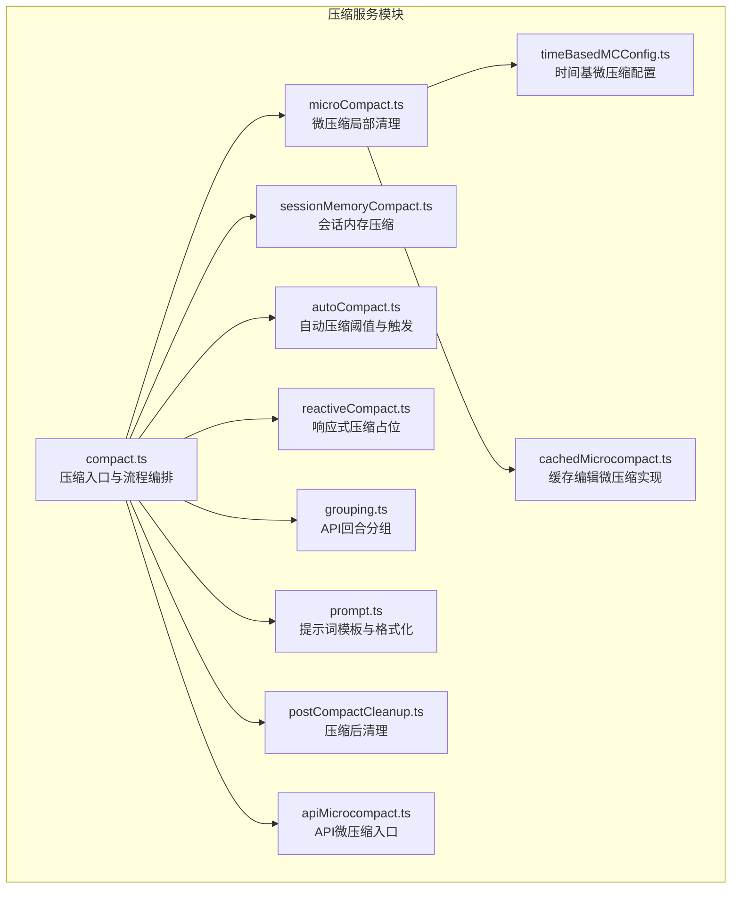
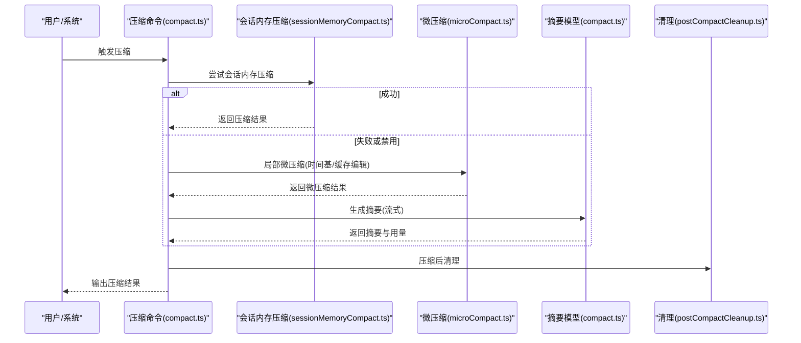
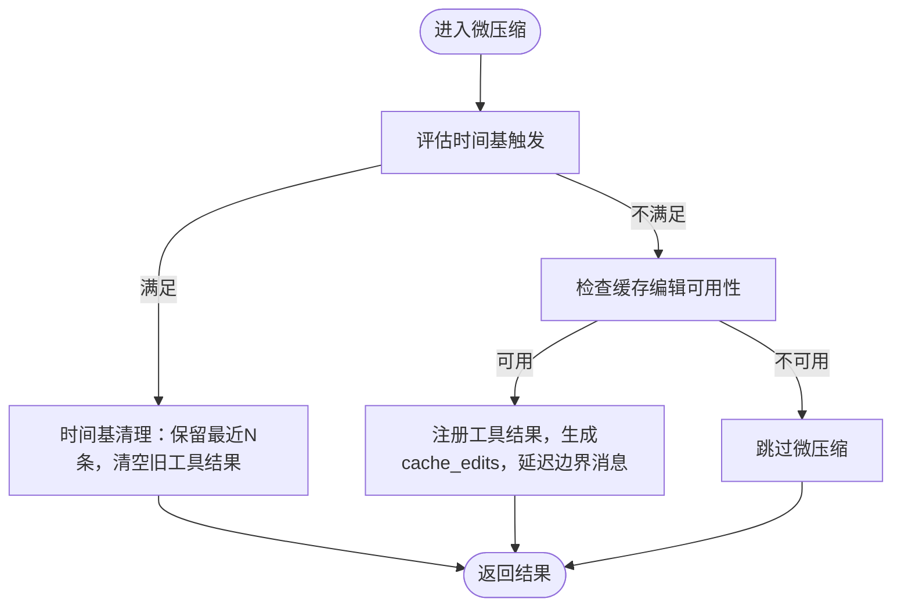
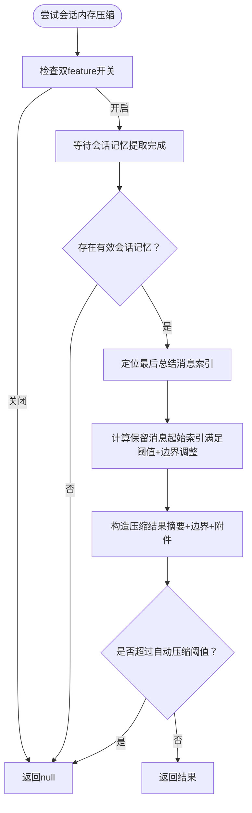
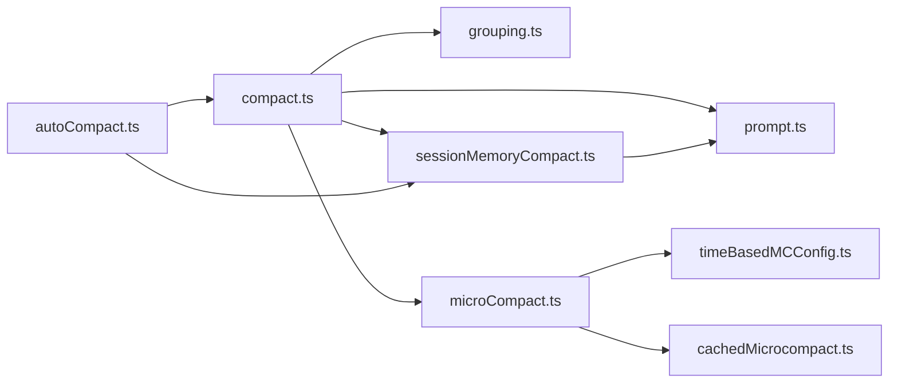

# 压缩服务

<cite>
**本文引用的文件**   
- [src/services/compact/compact.ts](file://src/services/compact/compact.ts)
- [src/services/compact/microCompact.ts](file://src/services/compact/microCompact.ts)
- [src/services/compact/sessionMemoryCompact.ts](file://src/services/compact/sessionMemoryCompact.ts)
- [src/services/compact/autoCompact.ts](file://src/services/compact/autoCompact.ts)
- [src/services/compact/reactiveCompact.ts](file://src/services/compact/reactiveCompact.ts)
- [src/services/compact/grouping.ts](file://src/services/compact/grouping.ts)
- [src/services/compact/prompt.ts](file://src/services/compact/prompt.ts)
- [src/services/compact/timeBasedMCConfig.ts](file://src/services/compact/timeBasedMCConfig.ts)
- [src/services/compact/cachedMCConfig.ts](file://src/services/compact/cachedMCConfig.ts)
- [src/services/compact/postCompactCleanup.ts](file://src/services/compact/postCompactCleanup.ts)
- [src/services/compact/apiMicrocompact.ts](file://src/services/compact/apiMicrocompact.ts)
- [src/services/compact/cachedMicrocompact.ts](file://src/services/compact/cachedMicrocompact.ts)
- [src/services/compact/snippet.ts](file://src/services/compact/snippet.ts)
- [src/services/compact/snipProjection.ts](file://src/services/compact/snipProjection.ts)
- [src/services/compact/compactWarningState.ts](file://src/services/compact/compactWarningState.ts)
- [src/services/compact/compactWarningHook.ts](file://src/services/compact/compactWarningHook.ts)
- [src/services/compact/compactWarningHook.ts](file://src/services/compact/compactWarningHook.ts)
- [src/services/compact/compactWarningState.ts](file://src/services/compact/compactWarningState.ts)
- [src/services/compact/compactWarningHook.ts](file://src/services/compact/compactWarningHook.ts)
- [src/services/compact/compactWarningState.ts](file://src/services/compact/compactWarningState.ts)
- [src/services/compact/compactWarningHook.ts](file://src/services/compact/compactWarningHook.ts)
- [src/services/compact/compactWarningState.ts](file://src/services/compact/compactWarningState.ts)
- [src/services/compact/compactWarningHook.ts](file://src/services/compact/compactWarningHook.ts)
- [src/services/compact/compactWarningState.ts](file://src/services/compact/compactWarningState.ts)
- [src/services/compact/compactWarningHook.ts](file://src/services/compact/compactWarningHook.ts)
- [src/services/compact/compactWarningState.ts](file://src/services/compact/compactWarningState.ts)
- [src/services/compact/compactWarningHook.ts](file://src/services/compact/compactWarningHook.ts)
- [src/services/compact/compactWarningState.ts](file://src/services/compact/compactWarningState.ts)
- [src/services/compact/compactWarningHook.ts](file://src/services/compact/compactWarningHook.ts)
- [src/services/compact/compactWarningState.ts](file://src/services/compact/compactWarningState.ts)
- [src/services/compact/compactWarningHook.ts](file://src/services/compact/compactWarningHook.ts)
- [src/services/compact/compactWarningState.ts](file://src/services/compact/compactWarningState.ts)
- [src/services/compact/compactWarningHook.ts](file://src/services/compact/compactWarningHook.ts)
- [src/services/compact/compactWarningState.ts](file://src/services/compact/compactWarningState.ts)
- [src/services/compact/compactWarningHook.ts](file://src/services/compact/compactWarningHook.ts)
- [src/services/compact/compactWarningState.ts](file://src/services/compact/compactWarningState.ts)
- [src/services/compact/compactWarningHook.ts](file://src/services/compact/compactWarningHook.ts)
- [src/services/compact/compactWarningState.ts](file://src/services/compact/compactWarningState.ts)
- [src/services/compact/compactWarningHook.ts](file://src/services......)
</cite>

## 目录
1. [简介](#简介)
2. [项目结构](#项目结构)
3. [核心组件](#核心组件)
4. [架构总览](#架构总览)
5. [详细组件分析](#详细组件分析)
6. [依赖关系分析](#依赖关系分析)
7. [性能考量](#性能考量)
8. [故障排除指南](#故障排除指南)
9. [结论](#结论)
10. [附录](#附录)

## 简介
本文件面向 Claude Code Best 的压缩服务，系统性梳理上下文压缩、微压缩与会话内存压缩的算法实现与接口规范，覆盖策略选择、阈值配置、性能调优参数、压缩质量评估、内存使用优化与实时压缩处理机制，并提供配置指南与故障排除方法。文档以“三层策略”为主线：MicroCompact（局部微压缩）、Session Memory Compact（会话内存压缩）、传统 API 摘要（全量压缩），并解释它们在不同场景下的触发条件与边界约束。

## 项目结构
压缩服务位于 src/services/compact 下，围绕“压缩入口、策略选择、阈值计算、提示词模板、分组与边界、清理与钩子、缓存与统计”等模块组织，形成可扩展的压缩流水线。

图示来源
- [src/services/compact/compact.ts](file://src/services/compact/compact.ts)
- [src/services/compact/microCompact.ts](file://src/services/compact/microCompact.ts)
- [src/services/compact/sessionMemoryCompact.ts](file://src/services/compact/sessionMemoryCompact.ts)
- [src/services/compact/autoCompact.ts](file://src/services/compact/autoCompact.ts)
- [src/services/compact/reactiveCompact.ts](file://src/services/compact/reactiveCompact.ts)
- [src/services/compact/grouping.ts](file://src/services/compact/grouping.ts)
- [src/services/compact/prompt.ts](file://src/services/compact/prompt.ts)
- [src/services/compact/timeBasedMCConfig.ts](file://src/services/compact/timeBasedMCConfig.ts)
- [src/services/compact/cachedMicrocompact.ts](file://src/services/compact/cachedMicrocompact.ts)
- [src/services/compact/postCompactCleanup.ts](file://src/services/compact/postCompactCleanup.ts)
- [src/services/compact/apiMicrocompact.ts](file://src/services/compact/apiMicrocompact.ts)

章节来源
- [src/services/compact/compact.ts](file://src/services/compact/compact.ts)
- [src/services/compact/microCompact.ts](file://src/services/compact/microCompact.ts)
- [src/services/compact/sessionMemoryCompact.ts](file://src/services/compact/sessionMemoryCompact.ts)
- [src/services/compact/autoCompact.ts](file://src/services/compact/autoCompact.ts)
- [src/services/compact/reactiveCompact.ts](file://src/services/compact/reactiveCompact.ts)
- [src/services/compact/grouping.ts](file://src/services/compact/grouping.ts)
- [src/services/compact/prompt.ts](file://src/services/compact/prompt.ts)
- [src/services/compact/timeBasedMCConfig.ts](file://src/services/compact/timeBasedMCConfig.ts)
- [src/services/compact/cachedMicrocompact.ts](file://src/services/compact/cachedMicrocompact.ts)
- [src/services/compact/postCompactCleanup.ts](file://src/services/compact/postCompactCleanup.ts)
- [src/services/compact/apiMicrocompact.ts](file://src/services/compact/apiMicrocompact.ts)

## 核心组件
- 压缩入口与流程编排：负责预处理、钩子执行、流式摘要生成、附件重建、边界标记与事件上报。
- 微压缩（MicroCompact）：针对单轮工具输出进行局部清理，支持时间基清理与缓存编辑两种路径。
- 会话内存压缩（Session Memory Compact）：基于已提取的会话记忆生成摘要，避免调用压缩模型，提升速度与成本效率。
- 自动压缩（AutoCompact）：根据有效上下文窗口与缓冲区计算阈值，决定是否触发压缩；并提供电路保护与重入控制。
- 提示词模板（Prompt）：提供基础/部分/向上部分的摘要提示词与格式化逻辑。
- 分组与边界（Grouping）：按 API 回合边界分组，确保压缩与恢复时的消息配对正确。
- 配置与状态：时间基微压缩配置、缓存编辑配置、压缩警告状态与钩子、压缩后清理。

章节来源
- [src/services/compact/compact.ts](file://src/services/compact/compact.ts)
- [src/services/compact/microCompact.ts](file://src/services/compact/microCompact.ts)
- [src/services/compact/sessionMemoryCompact.ts](file://src/services/compact/sessionMemoryCompact.ts)
- [src/services/compact/autoCompact.ts](file://src/services/compact/autoCompact.ts)
- [src/services/compact/prompt.ts](file://src/services/compact/prompt.ts)
- [src/services/compact/grouping.ts](file://src/services/compact/grouping.ts)
- [src/services/compact/timeBasedMCConfig.ts](file://src/services/compact/timeBasedMCConfig.ts)
- [src/services/compact/cachedMCConfig.ts](file://src/services/compact/cachedMCConfig.ts)
- [src/services/compact/compactWarningState.ts](file://src/services/compact/compactWarningState.ts)
- [src/services/compact/compactWarningHook.ts](file://src/services/compact/compactWarningHook.ts)
- [src/services/compact/postCompactCleanup.ts](file://src/services/compact/postCompactCleanup.ts)

## 架构总览
压缩服务采用“策略优先级链 + 流程编排”的架构：命令入口优先尝试会话内存压缩，其次在响应式模式下回退到传统摘要；自动压缩在查询循环中按阈值触发，支持电路保护与重入追踪。

图示来源
- [src/services/compact/compact.ts](file://src/services/compact/compact.ts)
- [src/services/compact/sessionMemoryCompact.ts](file://src/services/compact/sessionMemoryCompact.ts)
- [src/services/compact/microCompact.ts](file://src/services/compact/microCompact.ts)
- [src/services/compact/postCompactCleanup.ts](file://src/services/compact/postCompactCleanup.ts)

## 详细组件分析

### 组件A：压缩入口与流程编排（compact.ts）
- 主要职责
  - 预处理：剥离图片/文档块、去除会重注的附件、合并自定义与钩子指令。
  - 钩子：预压缩与后压缩钩子，支持显示消息与错误通知。
  - 流式摘要：带 PTL（提示过长）重试的摘要生成，支持缓存共享与前缀复用。
  - 附件重建：文件附件、异步代理附件、计划/技能/工具/代理清单等增量注入。
  - 边界标记与消息构建：统一顺序（边界标记、摘要、保留消息、附件、钩子结果）。
  - 事件上报：压缩前后 token 统计、缓存命中/创建、prompt cache 断裂检测等。
- 关键接口
  - compactConversation：主流程入口，返回 CompactionResult。
  - partialCompactConversation：围绕选定消息索引的部分压缩。
  - buildPostCompactMessages：统一消息序列构建。
  - truncateHeadForPTLRetry：针对摘要请求本身过长的兜底截断。
- 性能与质量
  - 通过提示词模板与格式化减少冗余信息，提高摘要可读性。
  - 附件重建避免信息丢失，同时限制预算防止过度膨胀。
  - PTL 重试与最大重试次数控制，平衡稳定性与成本。

章节来源
- [src/services/compact/compact.ts](file://src/services/compact/compact.ts)
- [src/services/compact/prompt.ts](file://src/services/compact/prompt.ts)

### 组件B：微压缩（MicroCompact，microCompact.ts）
- 策略与路径
  - 时间基微压缩：当自上次助手消息以来的时间超过阈值，清理旧工具结果，保留最近若干条，直接修改消息内容。
  - 缓存编辑微压缩：通过缓存编辑 API 在不破坏前缀的前提下删除工具结果，适合主线程与受支持模型。
- 关键接口
  - microcompactMessages：统一入口，先评估时间基触发，再尝试缓存编辑，否则返回原消息。
  - maybeTimeBasedMicrocompact：评估并执行时间基清理。
  - cachedMicrocompactPath：注册工具结果、计算待删集合、生成 cache_edits 并延迟边界消息插入。
  - estimateMessageTokens：保守估算消息 token 数量。
- 配置与状态
  - 时间基配置：enabled、gapThresholdMinutes、keepRecent。
  - 缓存编辑配置：通过 cachedMCConfig 获取（stub 文件，实际实现在 cachedMicrocompact.ts）。
- 质量与成本
  - 时间基清理避免冷缓存重写整段前缀，降低后续 API 调用成本。
  - 缓存编辑避免摘要模型调用，显著节省 token 与时间。

图示来源
- [src/services/compact/microCompact.ts](file://src/services/compact/microCompact.ts)
- [src/services/compact/timeBasedMCConfig.ts](file://src/services/compact/timeBasedMCConfig.ts)
- [src/services/compact/cachedMicrocompact.ts](file://src/services/compact/cachedMicrocompact.ts)

章节来源
- [src/services/compact/microCompact.ts](file://src/services/compact/microCompact.ts)
- [src/services/compact/timeBasedMCConfig.ts](file://src/services/compact/timeBasedMCConfig.ts)
- [src/services/compact/cachedMCConfig.ts](file://src/services/compact/cachedMCConfig.ts)

### 组件C：会话内存压缩（Session Memory Compact，sessionMemoryCompact.ts）
- 设计思想
  - 使用已提取的会话记忆作为摘要，避免调用压缩模型，提升速度与成本效率。
  - 通过配置阈值（最小保留 token、最少文本消息数、最大保留 token）与边界调整，保证 API 对齐与配对完整性。
- 关键接口
  - shouldUseSessionMemoryCompaction：双 feature gate 控制启用。
  - calculateMessagesToKeepIndex：从最后总结消息之后开始，向后扩展至满足最小保留条件，同时避免拆分工具对与思考块。
  - trySessionMemoryCompaction：尝试使用会话内存生成摘要并返回 CompactionResult。
  - createCompactionResultFromSessionMemory：构造摘要消息、边界标记与附件。
- 配置
  - 默认阈值：minTokens、minTextBlockMessages、maxTokens。
  - 运行时从远程配置加载并合并默认值。
- 质量与边界
  - 通过 adjustIndexToPreserveAPIInvariants 保障工具对与思考块的完整性。
  - 截断超长会话记忆片段，避免占用过多预算。

图示来源
- [src/services/compact/sessionMemoryCompact.ts](file://src/services/compact/sessionMemoryCompact.ts)

章节来源
- [src/services/compact/sessionMemoryCompact.ts](file://src/services/compact/sessionMemoryCompact.ts)

### 组件D：自动压缩（AutoCompact，autoCompact.ts）
- 阈值与窗口
  - getEffectiveContextWindowSize：基于模型上下文窗口与最大输出 token 计算有效窗口。
  - getAutoCompactThreshold：有效窗口减去缓冲区得到阈值，支持环境变量覆盖。
  - calculateTokenWarningState：计算百分比剩余、警告/错误阈值、是否达到自动压缩阈值与阻断上限。
- 触发与保护
  - shouldAutoCompact：综合用户设置、特性开关、响应式/折叠模式抑制、查询来源等判定。
  - autoCompactIfNeeded：电路保护（连续失败上限）、重入追踪（turnCounter/turnId）、优先尝试会话内存压缩。
- 与会话内存压缩的协作
  - 在阈值检查阶段传入阈值，避免 SM-compact 结果仍超阈值。
  - 成功后进行 prompt cache 断裂检测通知与标记后压缩状态。

章节来源
- [src/services/compact/autoCompact.ts](file://src/services/compact/autoCompact.ts)
- [src/services/compact/sessionMemoryCompact.ts](file://src/services/compact/sessionMemoryCompact.ts)

### 组件E：提示词模板与格式化（prompt.ts）
- 模板类型
  - 基础摘要：面向整段对话的详细分析与总结。
  - 部分摘要：仅聚焦最近消息，保留先前上下文。
  - 向上部分摘要：放置于继续会话开头，强调承接上下文。
- 格式化
  - formatCompactSummary：剥离分析草稿标签，替换摘要标签为可读标题。
  - getCompactUserSummaryMessage：拼接摘要与转录链接、最近消息保留提示、静默继续选项等。

章节来源
- [src/services/compact/prompt.ts](file://src/services/compact/prompt.ts)

### 组件F：消息分组与边界（grouping.ts）
- 分组策略
  - 按助手消息 id 切分 API 回合，确保每个回合内工具调用与结果配对有效。
  - 支持细粒度回合切分，便于响应式压缩在单轮会话中工作。
- 用途
  - 用于 PTL 重试时按回合丢弃最早内容，避免 API 合约违规。

章节来源
- [src/services/compact/grouping.ts](file://src/services/compact/grouping.ts)

### 组件G：响应式压缩（reactiveCompact.ts）
- 当前状态
  - 占位导出，未实现具体逻辑；未来可能替代或补充自动压缩的响应式路径。

章节来源
- [src/services/compact/reactiveCompact.ts](file://src/services/compact/reactiveCompact.ts)

### 组件H：压缩后清理（postCompactCleanup.ts）
- 作用
  - 清理与压缩相关的临时状态，重置 lastSummarizedMessageId，通知 prompt cache 断裂检测等。

章节来源
- [src/services/compact/postCompactCleanup.ts](file://src/services/compact/postCompactCleanup.ts)

### 组件I：API 微压缩入口（apiMicrocompact.ts）
- 作用
  - 提供与微压缩相关的 API 调用入口（占位或桥接）。

章节来源
- [src/services/compact/apiMicrocompact.ts](file://src/services/compact/apiMicrocompact.ts)

### 组件J：缓存编辑微压缩实现（cachedMicrocompact.ts）
- 作用
  - 注册工具结果、计算待删集合、生成 cache_edits、延迟边界消息插入，配合 API 层完成缓存编辑。

章节来源
- [src/services/compact/cachedMicrocompact.ts](file://src/services/compact/cachedMicrocompact.ts)

### 组件K：片段与投影（snippet.ts、snipProjection.ts）
- 作用
  - 片段化处理与投影（占位或桥接），用于压缩过程中的消息片段化与预测。

章节来源
- [src/services/compact/snippet.ts](file://src/services/compact/snippet.ts)
- [src/services/compact/snipProjection.ts](file://src/services/compact/snipProjection.ts)

### 组件L：压缩警告与钩子（compactWarningState.ts、compactWarningHook.ts）
- 作用
  - 管理压缩警告的抑制与恢复，以及压缩前后的钩子扩展点。

章节来源
- [src/services/compact/compactWarningState.ts](file://src/services/compact/compactWarningState.ts)
- [src/services/compact/compactWarningHook.ts](file://src/services/compact/compactWarningHook.ts)

## 依赖关系分析
- 模块耦合
  - compact.ts 为核心编排，依赖 grouping.ts、prompt.ts、微压缩与会话内存压缩模块。
  - microCompact.ts 依赖 timeBasedMCConfig.ts 与 cachedMicrocompact.ts。
  - sessionMemoryCompact.ts 依赖 SessionMemory 工具与提示词模板。
  - autoCompact.ts 依赖 token 统计、上下文窗口与特性开关。
- 外部依赖
  - API 查询与重试、Analytics、prompt cache 断裂检测等。

图示来源
- [src/services/compact/compact.ts](file://src/services/compact/compact.ts)
- [src/services/compact/microCompact.ts](file://src/services/compact/microCompact.ts)
- [src/services/compact/sessionMemoryCompact.ts](file://src/services/compact/sessionMemoryCompact.ts)
- [src/services/compact/autoCompact.ts](file://src/services/compact/autoCompact.ts)
- [src/services/compact/grouping.ts](file://src/services/compact/grouping.ts)
- [src/services/compact/prompt.ts](file://src/services/compact/prompt.ts)
- [src/services/compact/timeBasedMCConfig.ts](file://src/services/compact/timeBasedMCConfig.ts)
- [src/services/compact/cachedMicrocompact.ts](file://src/services/compact/cachedMicrocompact.ts)

## 性能考量
- 缓存友好
  - 微压缩优先使用时间基清理与缓存编辑，避免冷缓存重写整段前缀，降低后续 API 调用成本。
  - 会话内存压缩避免摘要模型调用，显著节省 token 与时间。
- 阈值与缓冲
  - 自动压缩阈值预留缓冲区，结合阻断上限避免无限重试与 API 洪水。
- 估算与预算
  - 保守估算消息 token 数量，限制附件与技能注入预算，防止压缩后上下文膨胀。
- 事件与监控
  - 详细的压缩事件上报（输入/输出/缓存 token、prompt cache 断裂检测）便于性能分析与调优。

## 故障排除指南
- 常见问题与定位
  - 提示过长（PTL）：检查摘要请求是否过大，必要时启用时间基微压缩或使用会话内存压缩。
  - 缓存断裂误报：压缩后通知 prompt cache 断裂检测，避免误判为外部中断。
  - 自动压缩无效：确认用户设置、特性开关、响应式/折叠模式抑制、查询来源等条件。
  - 会话内存为空：检查会话记忆提取状态与模板是否为空。
- 排查步骤
  - 查看压缩事件日志与 token 统计，确认阈值与预算是否合理。
  - 检查时间基与缓存编辑配置，确认是否被禁用或不适用当前模型。
  - 若出现循环压缩，检查电路保护与重入追踪状态。

章节来源
- [src/services/compact/compact.ts](file://src/services/compact/compact.ts)
- [src/services/compact/autoCompact.ts](file://src/services/compact/autoCompact.ts)
- [src/services/compact/sessionMemoryCompact.ts](file://src/services/compact/sessionMemoryCompact.ts)
- [src/services/compact/microCompact.ts](file://src/services/compact/microCompact.ts)

## 结论
压缩服务通过“微压缩 + 会话内存压缩 + 传统摘要”的三层策略，在不同场景下实现高效、低成本、低风险的上下文压缩。自动压缩阈值与缓冲区设计、时间基与缓存编辑微压缩、会话记忆摘要与严格的 API 对齐约束共同构成稳定可靠的压缩体系。建议在生产环境中结合业务特征与模型能力，动态调整阈值与配置，并持续监控压缩事件与性能指标。

## 附录

### 配置指南
- 自动压缩阈值
  - 有效上下文窗口 = 模型上下文窗口 - 最大摘要输出 token
  - 阈值 = 有效窗口 - 自动压缩缓冲区（默认 13K）
  - 可通过环境变量覆盖百分比或绝对值
- 会话内存压缩阈值
  - 默认：最小保留 10K token、最少 5 条文本消息、最多 40K token
  - 运行时从远程配置加载并合并默认值
- 微压缩配置
  - 时间基：enabled、gapThresholdMinutes、keepRecent
  - 缓存编辑：由 cachedMCConfig 提供（受支持模型与功能开关控制）

章节来源
- [src/services/compact/autoCompact.ts](file://src/services/compact/autoCompact.ts)
- [src/services/compact/sessionMemoryCompact.ts](file://src/services/compact/sessionMemoryCompact.ts)
- [src/services/compact/timeBasedMCConfig.ts](file://src/services/compact/timeBasedMCConfig.ts)
- [src/services/compact/cachedMCConfig.ts](file://src/services/compact/cachedMCConfig.ts)