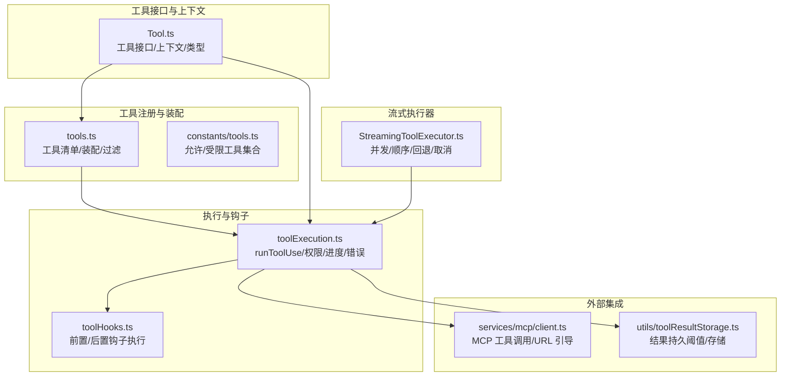
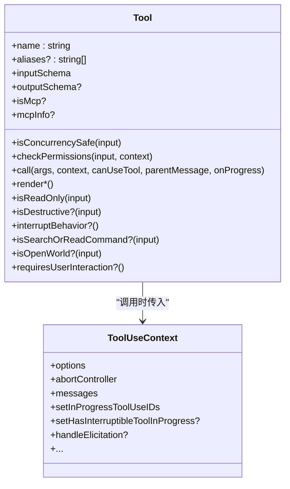
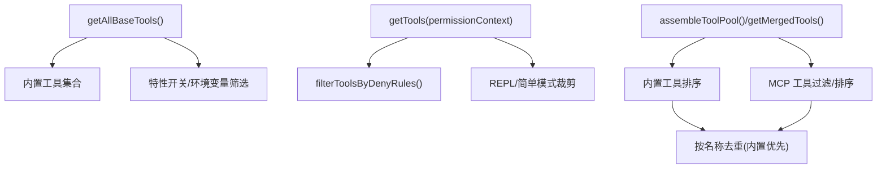
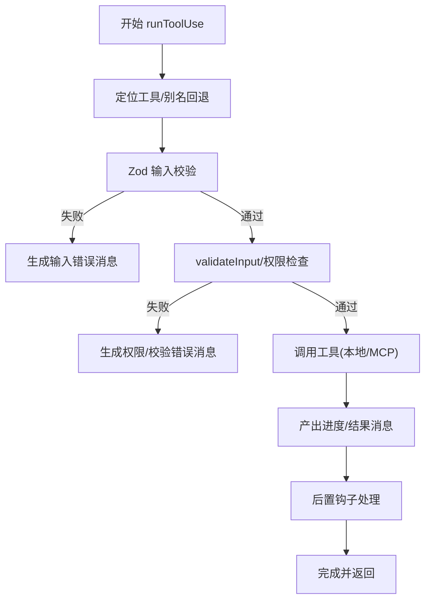
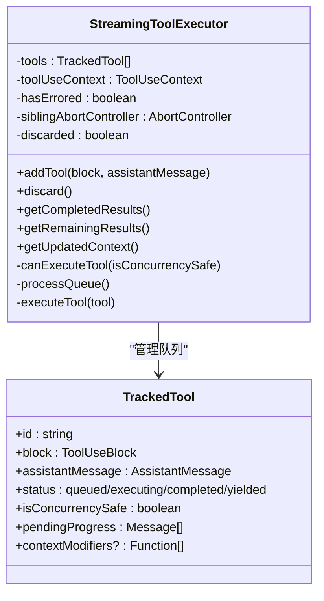
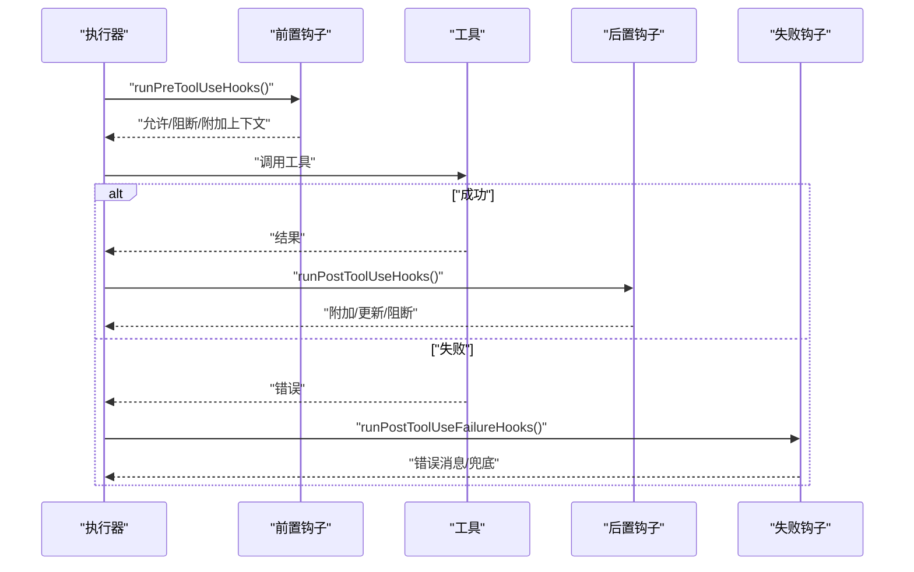
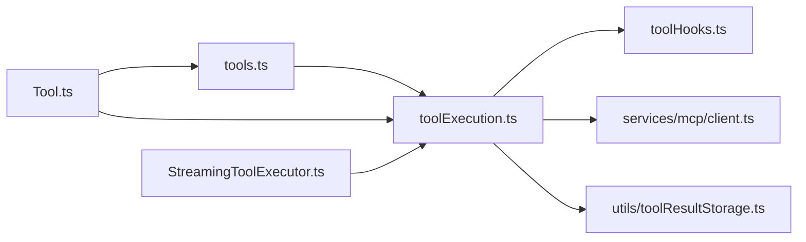

# 工具服务

<cite>
**本文引用的文件**
- [src/Tool.ts](file://src/Tool.ts)
- [src/tools.ts](file://src/tools.ts)
- [src/services/tools/StreamingToolExecutor.ts](file://src/services/tools/StreamingToolExecutor.ts)
- [src/services/tools/toolExecution.ts](file://src/services/tools/toolExecution.ts)
- [src/services/tools/toolHooks.ts](file://src/services/tools/toolHooks.ts)
- [learn/phase-2-conversation-loop.md](file://learn/phase-2-conversation-loop.md)
- [src/utils/toolResultStorage.ts](file://src/utils/toolResultStorage.ts)
- [src/constants/tools.ts](file://src/constants/tools.ts)
- [src/services/mcp/client.ts](file://src/services/mcp/client.ts)
</cite>

## 目录
1. [简介](#简介)
2. [项目结构](#项目结构)
3. [核心组件](#核心组件)
4. [架构总览](#架构总览)
5. [详细组件分析](#详细组件分析)
6. [依赖关系分析](#依赖关系分析)
7. [性能考量](#性能考量)
8. [故障排查指南](#故障排查指南)
9. [结论](#结论)
10. [附录](#附录)

## 简介
本文件面向 Claude Code Best 的工具服务，系统化梳理工具执行器、工具编排器与流式工具执行器的接口规范与运行机制，覆盖工具生命周期管理、并发执行控制、资源分配策略、工具注册与依赖注入、错误恢复流程，并提供配置项与性能优化建议。目标是帮助开发者与集成者快速理解并正确使用工具服务。

## 项目结构
工具服务围绕“工具接口定义”“工具注册与装配”“工具执行与钩子”“流式执行器”展开，形成清晰分层：
- 工具接口与类型：统一的 Tool 定义、工具上下文 ToolUseContext、工具权限上下文等。
- 工具注册与装配：内置工具清单、MCP 工具合并、权限过滤、REPL/简单模式等场景下的工具池组装。
- 工具执行与钩子：输入校验、权限决策、进度事件、结果生成、后置钩子与失败钩子。
- 流式执行器：在模型流式输出过程中即时启动工具，维护并发安全与顺序一致性，支持取消与回退。



图示来源
- [src/Tool.ts:158-300](file://src/Tool.ts#L158-L300)
- [src/tools.ts:191-387](file://src/tools.ts#L191-L387)
- [src/services/tools/toolExecution.ts:337-490](file://src/services/tools/toolExecution.ts#L337-L490)
- [src/services/tools/toolHooks.ts:39-191](file://src/services/tools/toolHooks.ts#L39-L191)
- [src/services/tools/StreamingToolExecutor.ts:40-124](file://src/services/tools/StreamingToolExecutor.ts#L40-L124)
- [src/services/mcp/client.ts:2873-2917](file://src/services/mcp/client.ts#L2873-L2917)
- [src/utils/toolResultStorage.ts:55-78](file://src/utils/toolResultStorage.ts#L55-L78)

章节来源
- [src/Tool.ts:158-300](file://src/Tool.ts#L158-L300)
- [src/tools.ts:191-387](file://src/tools.ts#L191-L387)
- [src/services/tools/toolExecution.ts:337-490](file://src/services/tools/toolExecution.ts#L337-L490)
- [src/services/tools/toolHooks.ts:39-191](file://src/services/tools/toolHooks.ts#L39-L191)
- [src/services/tools/StreamingToolExecutor.ts:40-124](file://src/services/tools/StreamingToolExecutor.ts#L40-L124)
- [src/services/mcp/client.ts:2873-2917](file://src/services/mcp/client.ts#L2873-L2917)
- [src/utils/toolResultStorage.ts:55-78](file://src/utils/toolResultStorage.ts#L55-L78)

## 核心组件
- 工具接口与上下文
  - Tool：统一的工具契约，包含 call、description、inputSchema、outputSchema、isConcurrencySafe、checkPermissions、render* 系列方法、用户交互与安全相关能力等。
  - ToolUseContext：工具调用所需的上下文，包括工具集、思考配置、MCP 客户端、文件状态缓存、消息列表、中断控制器、回调等。
- 工具注册与装配
  - getAllBaseTools/getTools/assembleToolPool/getMergedTools：按权限、特性开关、REPL 模式、工作树模式等组装最终可用工具集；支持内置工具与 MCP 工具去重合并。
- 工具执行与钩子
  - runToolUse：统一入口，负责工具查找、输入校验、权限检查、调用工具、进度与结果产出、错误处理与统计上报。
  - 前置/后置钩子：在工具调用前后执行，支持阻断、附加上下文、更新 MCP 输出、失败钩子等。
- 流式工具执行器
  - StreamingToolExecutor：在模型流式输出期间即时添加工具，维护并发安全（并发安全工具可并行，非并发工具串行独占），保证结果顺序，支持取消、兄弟进程级联取消、回退丢弃、进度优先产出。

章节来源
- [src/Tool.ts:362-695](file://src/Tool.ts#L362-L695)
- [src/Tool.ts:158-300](file://src/Tool.ts#L158-L300)
- [src/tools.ts:191-387](file://src/tools.ts#L191-L387)
- [src/services/tools/toolExecution.ts:337-490](file://src/services/tools/toolExecution.ts#L337-L490)
- [src/services/tools/toolHooks.ts:39-191](file://src/services/tools/toolHooks.ts#L39-L191)
- [src/services/tools/StreamingToolExecutor.ts:40-124](file://src/services/tools/StreamingToolExecutor.ts#L40-L124)

## 架构总览
工具服务在对话循环中与模型流式调用协同：模型边生成边返回，流式执行器边接收工具调用块并启动执行，同时执行权限与钩子，最终将进度与结果以消息形式回流给上层。

```mermaid
sequenceDiagram
participant Model as "模型(流式)"
participant Loop as "对话循环(query.ts)"
participant STE as "流式执行器(StreamingToolExecutor)"
participant Exec as "执行器(runToolUse)"
participant Hooks as "钩子(Pre/Post)"
participant MCP as "MCP客户端"
Model->>Loop : "流式返回消息"
Loop->>STE : "解析并识别 tool_use 块"
STE->>Exec : "addTool()/executeTool()"
Exec->>Exec : "输入校验/权限检查"
Exec->>Hooks : "runPreToolUseHooks()"
Hooks-->>Exec : "结果/阻断/附加上下文"
alt "MCP 工具"
Exec->>MCP : "调用远程工具"
MCP-->>Exec : "结果/进度/错误"
else "内置工具"
Exec->>Exec : "本地工具调用"
end
Exec-->>Hooks : "结果"
Hooks-->>Exec : "后置钩子处理"
Exec-->>STE : "进度/结果消息"
STE-->>Loop : "getCompletedResults()/getRemainingResults()"
Loop-->>Model : "继续流式对话"
```

图示来源
- [learn/phase-2-conversation-loop.md:177-220](file://learn/phase-2-conversation-loop.md#L177-L220)
- [src/services/tools/StreamingToolExecutor.ts:76-124](file://src/services/tools/StreamingToolExecutor.ts#L76-L124)
- [src/services/tools/toolExecution.ts:337-490](file://src/services/tools/toolExecution.ts#L337-L490)
- [src/services/tools/toolHooks.ts:39-191](file://src/services/tools/toolHooks.ts#L39-L191)

章节来源
- [learn/phase-2-conversation-loop.md:177-220](file://learn/phase-2-conversation-loop.md#L177-L220)
- [src/services/tools/StreamingToolExecutor.ts:76-124](file://src/services/tools/StreamingToolExecutor.ts#L76-L124)
- [src/services/tools/toolExecution.ts:337-490](file://src/services/tools/toolExecution.ts#L337-L490)
- [src/services/tools/toolHooks.ts:39-191](file://src/services/tools/toolHooks.ts#L39-L191)

## 详细组件分析

### 工具接口规范（Tool）
- 关键职责
  - 输入/输出模式：inputSchema、outputSchema、backfillObservableInput、mapToolResultToToolResultBlockParam。
  - 权限与安全：checkPermissions、validateInput、isReadOnly、isDestructive、toAutoClassifierInput、userFacingName、getActivityDescription。
  - 生命周期与渲染：call、renderToolUseMessage、renderToolResultMessage、renderToolUseProgressMessage、renderToolUseErrorMessage、renderToolUseRejectedMessage、renderGroupedToolUse。
  - 并发与中断：isConcurrencySafe、interruptBehavior、isSearchOrReadCommand、isOpenWorld、requiresUserInteraction。
  - MCP 支持：isMcp、mcpInfo、inputJSONSchema。
- 默认行为
  - buildTool 应用默认实现（如 isConcurrencySafe 默认 false、checkPermissions 默认放行等），确保工具最小可用形态。



图示来源
- [src/Tool.ts:362-695](file://src/Tool.ts#L362-L695)
- [src/Tool.ts:158-300](file://src/Tool.ts#L158-L300)

章节来源
- [src/Tool.ts:362-695](file://src/Tool.ts#L362-L695)
- [src/Tool.ts:757-774](file://src/Tool.ts#L757-L774)

### 工具注册与装配（tools.ts）
- 工具清单
  - getAllBaseTools：基于特性开关与环境变量聚合内置工具，含 Bash、文件读写、搜索、任务、技能、MCP 资源、工作树模式、计划模式、PowerShell、Web 浏览器等。
  - getTools：按权限规则过滤、REPL 模式隐藏原语、简单模式裁剪工具集。
  - assembleToolPool/getMergedTools：合并内置工具与 MCP 工具，按名称去重，内置工具优先，保持提示词缓存稳定性。
- 过滤与权限
  - filterToolsByDenyRules：根据权限上下文的拒绝规则剔除工具。
- 预设与选择
  - TOOL_PRESETS、parseToolPreset、getToolsForDefaultPreset：支持预设工具集与解析。



图示来源
- [src/tools.ts:191-387](file://src/tools.ts#L191-L387)
- [src/tools.ts:260-267](file://src/tools.ts#L260-L267)

章节来源
- [src/tools.ts:191-387](file://src/tools.ts#L191-L387)
- [src/tools.ts:260-267](file://src/tools.ts#L260-L267)

### 工具执行器（runToolUse）
- 入口与流程
  - 查找工具（优先当前会话可用工具，必要时回退至基础工具别名）。
  - 输入校验（Zod）、值校验（validateInput）、权限检查（前置钩子、规则、分类器、交互确认）。
  - 调用工具（本地或 MCP），产出进度与结果消息。
  - 后置钩子处理、失败钩子、统计与遥测上报。
- 并发与中断
  - 通过 ToolUseContext.abortController 控制单次工具调用的中断。
  - 对于 Bash 等可能有隐式依赖链的工具，发生错误时可触发兄弟进程级联取消。
- 结果持久化阈值
  - getPersistenceThreshold：受工具声明上限与特性标志共同约束，避免过大结果直接进入提示词。



图示来源
- [src/services/tools/toolExecution.ts:337-490](file://src/services/tools/toolExecution.ts#L337-L490)
- [src/services/tools/toolExecution.ts:599-799](file://src/services/tools/toolExecution.ts#L599-L799)
- [src/utils/toolResultStorage.ts:55-78](file://src/utils/toolResultStorage.ts#L55-L78)

章节来源
- [src/services/tools/toolExecution.ts:337-490](file://src/services/tools/toolExecution.ts#L337-L490)
- [src/services/tools/toolExecution.ts:599-799](file://src/services/tools/toolExecution.ts#L599-L799)
- [src/utils/toolResultStorage.ts:55-78](file://src/utils/toolResultStorage.ts#L55-L78)

### 流式工具执行器（StreamingToolExecutor）
- 并发与顺序
  - 并发安全工具：可与其他并发安全工具并行执行。
  - 非并发工具：必须独占执行，后续工具需等待其完成。
  - 顺序保证：按到达顺序缓冲并按序产出结果。
- 取消与回退
  - discard：丢弃所有待执行与进行中的工具，用于流式回退。
  - 兄弟进程级联取消：Bash 工具出错时，通过 siblingAbortController 触发其他兄弟进程立即终止。
  - 用户中断：根据工具 interruptBehavior 决定是否取消或阻塞。
- 进度与结果
  - 进度消息优先产出；completed 工具按序 yield；非并发工具前的并发工具可提前 yield。
  - 上下文修饰：非并发工具可在完成后修改共享上下文，以影响后续工具。



图示来源
- [src/services/tools/StreamingToolExecutor.ts:40-124](file://src/services/tools/StreamingToolExecutor.ts#L40-L124)
- [src/services/tools/StreamingToolExecutor.ts:129-151](file://src/services/tools/StreamingToolExecutor.ts#L129-L151)
- [src/services/tools/StreamingToolExecutor.ts:265-405](file://src/services/tools/StreamingToolExecutor.ts#L265-L405)
- [src/services/tools/StreamingToolExecutor.ts:412-490](file://src/services/tools/StreamingToolExecutor.ts#L412-L490)

章节来源
- [src/services/tools/StreamingToolExecutor.ts:40-124](file://src/services/tools/StreamingToolExecutor.ts#L40-L124)
- [src/services/tools/StreamingToolExecutor.ts:129-151](file://src/services/tools/StreamingToolExecutor.ts#L129-L151)
- [src/services/tools/StreamingToolExecutor.ts:265-405](file://src/services/tools/StreamingToolExecutor.ts#L265-L405)
- [src/services/tools/StreamingToolExecutor.ts:412-490](file://src/services/tools/StreamingToolExecutor.ts#L412-L490)

### 钩子与错误恢复（toolHooks.ts、toolExecution.ts）
- 前置钩子
  - runPreToolUseHooks：在权限检查与工具调用前执行，支持阻断、附加上下文、停止继续等。
- 后置钩子
  - runPostToolUseHooks：工具成功后执行，支持阻断继续、附加上下文、更新 MCP 输出、错误兜底等。
  - runPostToolUseFailureHooks：工具失败后执行，统一错误处理与消息产出。
- 错误恢复
  - 流式回退：StreamingToolExecutor.discard 丢弃结果，生成合成错误消息。
  - URL 引导（MCP）：当工具返回特定错误码时，客户端提取 elicitations 并引导用户输入 URL。



图示来源
- [src/services/tools/toolHooks.ts:39-191](file://src/services/tools/toolHooks.ts#L39-L191)
- [src/services/tools/toolExecution.ts:599-799](file://src/services/tools/toolExecution.ts#L599-L799)
- [src/services/mcp/client.ts:2873-2917](file://src/services/mcp/client.ts#L2873-L2917)

章节来源
- [src/services/tools/toolHooks.ts:39-191](file://src/services/tools/toolHooks.ts#L39-L191)
- [src/services/tools/toolExecution.ts:599-799](file://src/services/tools/toolExecution.ts#L599-L799)
- [src/services/mcp/client.ts:2873-2917](file://src/services/mcp/client.ts#L2873-L2917)

## 依赖关系分析
- 组件耦合
  - ToolUseContext 是执行器与流式执行器的共同依赖，承载工具集、MCP 客户端、消息与中断信号。
  - 工具注册模块（tools.ts）为执行器提供工具清单与权限过滤能力。
  - 钩子模块（toolHooks.ts）贯穿执行前后，增强扩展性与可观测性。
- 外部依赖
  - MCP 客户端（services/mcp/client.ts）负责远程工具调用与 URL 引导。
  - 结果存储阈值（utils/toolResultStorage.ts）影响工具输出的持久化策略。



图示来源
- [src/Tool.ts:362-695](file://src/Tool.ts#L362-L695)
- [src/tools.ts:191-387](file://src/tools.ts#L191-L387)
- [src/services/tools/toolExecution.ts:337-490](file://src/services/tools/toolExecution.ts#L337-L490)
- [src/services/tools/toolHooks.ts:39-191](file://src/services/tools/toolHooks.ts#L39-L191)
- [src/services/tools/StreamingToolExecutor.ts:40-124](file://src/services/tools/StreamingToolExecutor.ts#L40-L124)
- [src/services/mcp/client.ts:2873-2917](file://src/services/mcp/client.ts#L2873-L2917)
- [src/utils/toolResultStorage.ts:55-78](file://src/utils/toolResultStorage.ts#L55-L78)

章节来源
- [src/Tool.ts:362-695](file://src/Tool.ts#L362-L695)
- [src/tools.ts:191-387](file://src/tools.ts#L191-L387)
- [src/services/tools/toolExecution.ts:337-490](file://src/services/tools/toolExecution.ts#L337-L490)
- [src/services/tools/toolHooks.ts:39-191](file://src/services/tools/toolHooks.ts#L39-L191)
- [src/services/tools/StreamingToolExecutor.ts:40-124](file://src/services/tools/StreamingToolExecutor.ts#L40-L124)
- [src/services/mcp/client.ts:2873-2917](file://src/services/mcp/client.ts#L2873-L2917)
- [src/utils/toolResultStorage.ts:55-78](file://src/utils/toolResultStorage.ts#L55-L78)

## 性能考量
- 并发策略
  - 利用 isConcurrencySafe 将独立工具并行化，减少总耗时；对存在隐式依赖的工具（如 Bash）采用串行与级联取消，避免无效计算。
- 结果持久化
  - 使用 getPersistenceThreshold 控制工具输出大小，避免超大结果进入提示词导致缓存失效与延迟增加。
- 钩子与权限检查
  - 将高开销检查（如 Bash 分类器）提前并行，缩短主路径等待时间。
- 流式执行
  - 在模型流式输出期间尽早启动工具，降低端到端延迟；仅在必要时等待非并发工具完成。

[本节为通用指导，无需列出具体文件来源]

## 故障排查指南
- 工具不可用
  - 现象：出现“无此工具可用”的错误消息。
  - 排查：确认工具是否在当前权限上下文中启用；检查工具别名是否正确；核对 assembleToolPool 是否正确合并 MCP 工具。
- 输入校验失败
  - 现象：出现输入验证错误消息。
  - 排查：检查工具 inputSchema 与实际输入；若为延迟加载工具且未发现工具，参考提示补充 ToolSearch 调用后再试。
- 权限被拒或阻断
  - 现象：工具被拒绝或被钩子阻断。
  - 排查：查看权限规则、分类器结果与钩子返回；必要时调整规则或交互设置。
- Bash 级联失败
  - 现象：一个 Bash 工具失败导致其他兄弟工具被取消。
  - 排查：检查命令链依赖关系；必要时拆分命令或调整执行顺序。
- 流式回退
  - 现象：流式尝试失败，丢弃结果并生成回退错误消息。
  - 排查：确认网络与 MCP 服务器状态；检查工具参数与权限；考虑降级为非流式执行。

章节来源
- [src/services/tools/toolExecution.ts:369-411](file://src/services/tools/toolExecution.ts#L369-L411)
- [src/services/tools/toolExecution.ts:616-680](file://src/services/tools/toolExecution.ts#L616-L680)
- [src/services/tools/StreamingToolExecutor.ts:153-205](file://src/services/tools/StreamingToolExecutor.ts#L153-L205)
- [src/services/mcp/client.ts:2873-2917](file://src/services/mcp/client.ts#L2873-L2917)

## 结论
工具服务通过统一的工具接口、灵活的注册与装配机制、严谨的执行与钩子体系以及高效的流式执行器，实现了高扩展性与高可靠性的工具调用平台。合理利用并发安全标记、权限与钩子、结果持久化阈值与流式回退策略，可以在保证安全性的同时显著提升用户体验与系统性能。

[本节为总结性内容，无需列出具体文件来源]

## 附录

### 工具生命周期与关键阶段
- 解析与匹配：从消息中提取 tool_use 块，定位工具定义。
- 输入校验与权限：Zod 校验 + validateInput + 权限检查（含前置钩子）。
- 工具调用：本地或 MCP 调用，产出进度与结果。
- 后置处理：后置钩子、失败钩子、统计与遥测。
- 流式产出：进度优先、结果按序、必要时丢弃与回退。

章节来源
- [src/services/tools/toolExecution.ts:337-490](file://src/services/tools/toolExecution.ts#L337-L490)
- [src/services/tools/toolExecution.ts:599-799](file://src/services/tools/toolExecution.ts#L599-L799)
- [src/services/tools/StreamingToolExecutor.ts:412-490](file://src/services/tools/StreamingToolExecutor.ts#L412-L490)

### 并发与资源分配要点
- 并发安全：isConcurrencySafe 为 true 的工具可并行执行；非并发工具串行独占。
- 中断控制：工具级 AbortController 与全局中断信号协同，支持取消与阻塞策略。
- 上下文修饰：非并发工具完成后可修改共享上下文，影响后续工具。

章节来源
- [src/services/tools/StreamingToolExecutor.ts:129-151](file://src/services/tools/StreamingToolExecutor.ts#L129-L151)
- [src/services/tools/StreamingToolExecutor.ts:391-395](file://src/services/tools/StreamingToolExecutor.ts#L391-L395)

### 配置选项与最佳实践
- 工具池装配
  - 使用 assembleToolPool 或 getMergedTools 组装最终工具集，确保内置与 MCP 工具稳定排序与去重。
- 权限与模式
  - 通过 getTools 控制权限过滤与模式裁剪（REPL/简单模式）。
- 结果阈值
  - 依据 getPersistenceThreshold 设置工具输出上限，避免大结果进入提示词。
- 流式执行
  - 在模型流式输出期间及时 addTool，利用 getCompletedResults 与 getRemainingResults 有序产出。

章节来源
- [src/tools.ts:343-387](file://src/tools.ts#L343-L387)
- [src/tools.ts:269-325](file://src/tools.ts#L269-L325)
- [src/utils/toolResultStorage.ts:55-78](file://src/utils/toolResultStorage.ts#L55-L78)
- [src/services/tools/StreamingToolExecutor.ts:412-490](file://src/services/tools/StreamingToolExecutor.ts#L412-L490)