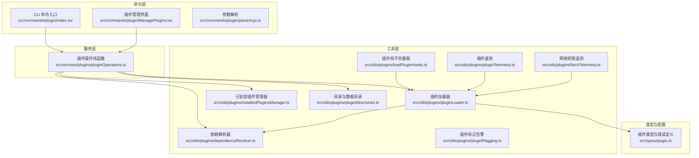
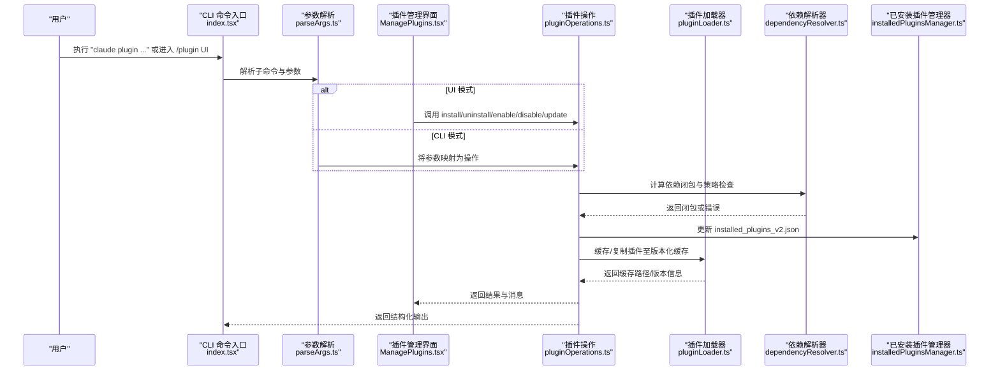
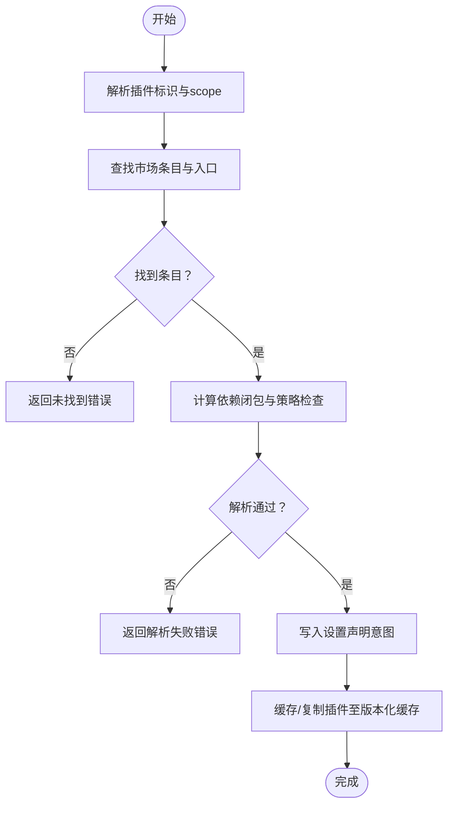
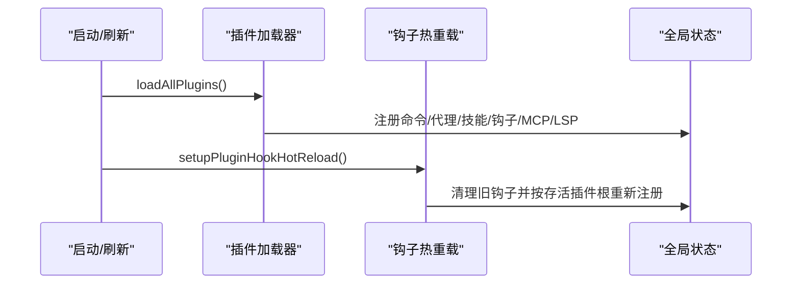
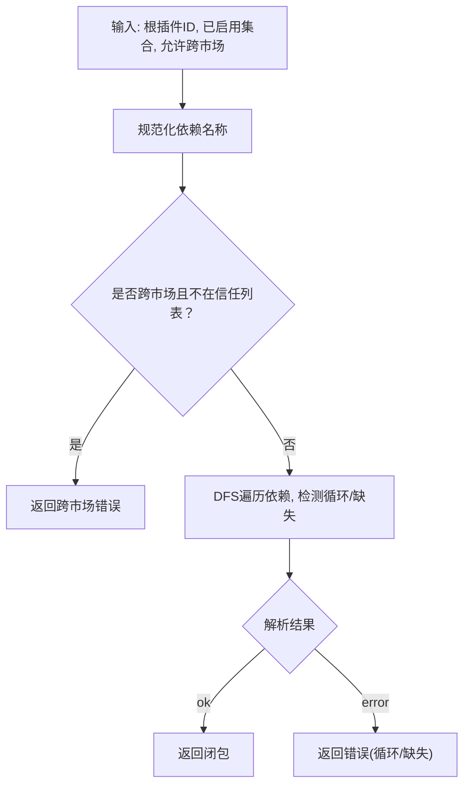
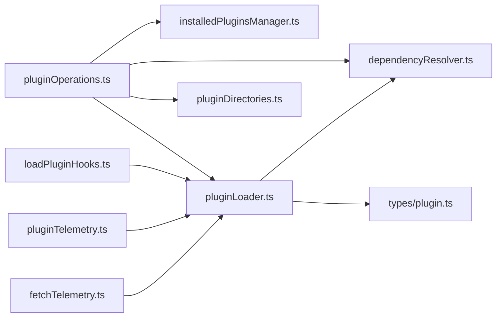

# 插件服务

<cite>
**本文档引用的文件**
- [src/utils/plugins/pluginLoader.ts](file://src/utils/plugins/pluginLoader.ts)
- [src/utils/plugins/dependencyResolver.ts](file://src/utils/plugins/dependencyResolver.ts)
- [src/utils/plugins/pluginInstallationHelpers.ts](file://src/utils/plugins/pluginInstallationHelpers.ts)
- [src/utils/plugins/installedPluginsManager.ts](file://src/utils/plugins/installedPluginsManager.ts)
- [src/utils/plugins/pluginDirectories.ts](file://src/utils/plugins/pluginDirectories.ts)
- [src/utils/plugins/pluginFlagging.ts](file://src/utils/plugins/pluginFlagging.ts)
- [src/utils/plugins/loadPluginHooks.ts](file://src/utils/plugins/loadPluginHooks.ts)
- [src/utils/plugins/pluginDirectories.ts](file://src/utils/plugins/pluginDirectories.ts)
- [src/utils/plugins/pluginTelemetry.ts](file://src/utils/plugins/pluginTelemetry.ts)
- [src/utils/plugins/fetchTelemetry.ts](file://src/utils/plugins/fetchTelemetry.ts)
- [src/services/plugins/pluginOperations.ts](file://src/services/plugins/pluginOperations.ts)
- [src/commands/plugin/ManagePlugins.tsx](file://src/commands/plugin/ManagePlugins.tsx)
- [src/commands/plugin/parseArgs.ts](file://src/commands/plugin/parseArgs.ts)
- [src/commands/plugin/index.tsx](file://src/commands/plugin/index.tsx)
- [src/hooks/useManagePlugins.ts](file://src/hooks/useManagePlugins.ts)
- [src/types/plugin.ts](file://src/types/plugin.ts)
- [src/cli/handlers/plugins.ts](file://src/cli/handlers/plugins.ts)
</cite>

## 目录
1. [简介](#简介)
2. [项目结构](#项目结构)
3. [核心组件](#核心组件)
4. [架构总览](#架构总览)
5. [详细组件分析](#详细组件分析)
6. [依赖关系分析](#依赖关系分析)
7. [性能考量](#性能考量)
8. [故障排查指南](#故障排查指南)
9. [结论](#结论)
10. [附录](#附录)

## 简介
本文件面向 Claude Code Best 的插件系统，提供从安装管理器、插件操作到 CLI 命令的完整技术文档。内容涵盖插件生命周期管理（发现、加载、启用/禁用、更新、卸载）、依赖解析与版本兼容性检查、插件注册与热重载、以及开发与调试方法。目标读者包括插件开发者、平台维护者与高级用户。

## 项目结构
插件子系统由“命令层”“服务层”“工具层”“类型与配置层”构成，围绕以下关键目录组织：
- 命令层：CLI 插件命令入口与交互界面，负责参数解析与用户交互。
- 服务层：纯函数式操作（安装/卸载/启用/禁用/更新），不直接写日志或退出进程。
- 工具层：插件加载器、依赖解析器、已安装插件管理器、目录与缓存策略、遥测与错误分类等。
- 类型与配置层：统一的插件数据模型、错误类型、市场与源配置等。

图表来源
- [src/commands/plugin/index.tsx:1-13](file://src/commands/plugin/index.tsx#L1-L13)
- [src/commands/plugin/ManagePlugins.tsx:1-120](file://src/commands/plugin/ManagePlugins.tsx#L1-L120)
- [src/commands/plugin/parseArgs.ts:1-50](file://src/commands/plugin/parseArgs.ts#L1-L50)
- [src/services/plugins/pluginOperations.ts:1-120](file://src/services/plugins/pluginOperations.ts#L1-L120)
- [src/utils/plugins/pluginLoader.ts:1-120](file://src/utils/plugins/pluginLoader.ts#L1-L120)
- [src/utils/plugins/dependencyResolver.ts:27-142](file://src/utils/plugins/dependencyResolver.ts#L27-L142)
- [src/utils/plugins/installedPluginsManager.ts:468-970](file://src/utils/plugins/installedPluginsManager.ts#L468-L970)
- [src/utils/plugins/pluginDirectories.ts:1-179](file://src/utils/plugins/pluginDirectories.ts#L1-L179)
- [src/utils/plugins/pluginFlagging.ts:86-144](file://src/utils/plugins/pluginFlagging.ts#L86-L144)
- [src/utils/plugins/loadPluginHooks.ts:1-287](file://src/utils/plugins/loadPluginHooks.ts#L1-L287)
- [src/utils/plugins/pluginTelemetry.ts:238-289](file://src/utils/plugins/pluginTelemetry.ts#L238-L289)
- [src/utils/plugins/fetchTelemetry.ts:1-136](file://src/utils/plugins/fetchTelemetry.ts#L1-L136)
- [src/types/plugin.ts:1-364](file://src/types/plugin.ts#L1-L364)

章节来源
- [src/commands/plugin/index.tsx:1-13](file://src/commands/plugin/index.tsx#L1-L13)
- [src/commands/plugin/ManagePlugins.tsx:1-120](file://src/commands/plugin/ManagePlugins.tsx#L1-L120)
- [src/commands/plugin/parseArgs.ts:1-50](file://src/commands/plugin/parseArgs.ts#L1-L50)
- [src/services/plugins/pluginOperations.ts:1-120](file://src/services/plugins/pluginOperations.ts#L1-L120)
- [src/utils/plugins/pluginLoader.ts:1-120](file://src/utils/plugins/pluginLoader.ts#L1-L120)

## 核心组件
- 插件加载器：负责插件发现、清单校验、组件路径解析、缓存与版本化存储、种子缓存命中、ZIP 缓存模式、Git 子目录克隆优化、NPM 包安装与复制。
- 依赖解析器：计算依赖闭包，处理跨市场限制、循环依赖检测、已启用插件跳过、策略阻断。
- 已安装插件管理器：维护 installed_plugins_v2.json，支持按作用域（用户/项目/本地/托管）记录安装，支持内存快照与磁盘直读，提供删除缓存与清理数据目录能力。
- 插件操作服务：提供安装、卸载、启用、禁用、批量禁用、查询安装位置等纯函数式操作，返回结构化结果与消息；与设置系统解耦，仅通过设置 API 写入。
- 插件目录与数据目录：集中管理插件根目录、种子目录、数据目录（持久化）、大小统计与清理。
- 插件标记与告警：记录并过期展示被标记的插件，用于安全与合规提示。
- 钩子热重载：基于远程策略变更检测，对插件钩子进行选择性重载，避免全量重启。
- 遥测与网络抓取：记录插件/市场拉取的主机、时延、成功率与错误类别，支持 GCS 迁移观测与问题定位。
- 类型与错误：统一的 LoadedPlugin、PluginError、PluginLoadResult 等类型，便于 UI 展示与错误分类。

章节来源
- [src/utils/plugins/pluginLoader.ts:1-800](file://src/utils/plugins/pluginLoader.ts#L1-L800)
- [src/utils/plugins/dependencyResolver.ts:27-142](file://src/utils/plugins/dependencyResolver.ts#L27-L142)
- [src/utils/plugins/installedPluginsManager.ts:468-970](file://src/utils/plugins/installedPluginsManager.ts#L468-L970)
- [src/utils/plugins/pluginDirectories.ts:1-179](file://src/utils/plugins/pluginDirectories.ts#L1-L179)
- [src/utils/plugins/pluginFlagging.ts:86-144](file://src/utils/plugins/pluginFlagging.ts#L86-L144)
- [src/utils/plugins/loadPluginHooks.ts:1-287](file://src/utils/plugins/loadPluginHooks.ts#L1-L287)
- [src/utils/plugins/pluginTelemetry.ts:238-289](file://src/utils/plugins/pluginTelemetry.ts#L238-L289)
- [src/utils/plugins/fetchTelemetry.ts:1-136](file://src/utils/plugins/fetchTelemetry.ts#L1-L136)
- [src/services/plugins/pluginOperations.ts:1-800](file://src/services/plugins/pluginOperations.ts#L1-L800)
- [src/types/plugin.ts:1-364](file://src/types/plugin.ts#L1-L364)

## 架构总览
下图展示了从 CLI 到服务层再到工具层的调用链路，以及关键状态与缓存点：

图表来源
- [src/commands/plugin/index.tsx:1-13](file://src/commands/plugin/index.tsx#L1-L13)
- [src/commands/plugin/parseArgs.ts:17-50](file://src/commands/plugin/parseArgs.ts#L17-L50)
- [src/commands/plugin/ManagePlugins.tsx:516-638](file://src/commands/plugin/ManagePlugins.tsx#L516-L638)
- [src/services/plugins/pluginOperations.ts:321-419](file://src/services/plugins/pluginOperations.ts#L321-L419)
- [src/utils/plugins/dependencyResolver.ts:95-142](file://src/utils/plugins/dependencyResolver.ts#L95-L142)
- [src/utils/plugins/installedPluginsManager.ts:906-970](file://src/utils/plugins/installedPluginsManager.ts#L906-L970)
- [src/utils/plugins/pluginLoader.ts:365-465](file://src/utils/plugins/pluginLoader.ts#L365-L465)

## 详细组件分析

### 组件一：插件安装管理器（安装/更新/卸载）
- 安装流程要点
  - 解析插件标识（支持 name@marketplace 或裸名自动搜索）。
  - 依赖闭包计算：跨市场依赖受信任列表限制；循环依赖与缺失依赖即时报错；已启用插件跳过重复安装以避免意外写入设置。
  - 策略检查：组织策略可阻止安装或其依赖。
  - 设置写入：先声明意图（写入 enabledPlugins），再材料化（缓存/复制插件）。
  - 结果返回：成功/失败、消息、依赖提示、scope 等。
- 卸载流程要点
  - 依据 installed_plugins_v2.json 精确定位安装位置与作用域。
  - 支持项目/本地/用户/托管作用域卸载；若为最后作用域，清理数据目录与插件选项。
  - 若存在反向依赖，给出警告但不阻塞卸载。
- 更新流程要点
  - 通过依赖解析器与策略检查后，执行缓存与复制；若已是最新则返回“已最新”。

图表来源
- [src/services/plugins/pluginOperations.ts:321-419](file://src/services/plugins/pluginOperations.ts#L321-L419)
- [src/utils/plugins/dependencyResolver.ts:95-142](file://src/utils/plugins/dependencyResolver.ts#L95-L142)
- [src/utils/plugins/pluginInstallationHelpers.ts:391-427](file://src/utils/plugins/pluginInstallationHelpers.ts#L391-L427)

章节来源
- [src/services/plugins/pluginOperations.ts:321-559](file://src/services/plugins/pluginOperations.ts#L321-L559)
- [src/utils/plugins/dependencyResolver.ts:95-142](file://src/utils/plugins/dependencyResolver.ts#L95-L142)
- [src/utils/plugins/pluginInstallationHelpers.ts:391-427](file://src/utils/plugins/pluginInstallationHelpers.ts#L391-L427)

### 组件二：插件生命周期与注册机制
- 生命周期阶段
  - 发现：从市场/种子缓存/本地源加载插件清单与组件路径。
  - 加载：校验清单、解析变量、合并内置与市场定义、收集错误。
  - 注册：将命令、代理、技能、钩子、MCP/LSP 服务器等注册到全局状态。
  - 启用/禁用：通过设置系统切换生效范围（用户/项目/本地/托管）。
  - 材料化：首次启用时进行缓存与复制，后续优先使用版本化缓存与 ZIP 缓存。
- 注册与热重载
  - 钩子热重载：监听策略设置变化，仅对仍启用的插件根进行存活匹配并重新注册，保留回调。
  - 初始加载：useManagePlugins 在挂载时一次性加载所有插件并执行去列与标记插件通知。

图表来源
- [src/utils/plugins/loadPluginHooks.ts:19-287](file://src/utils/plugins/loadPluginHooks.ts#L19-L287)
- [src/hooks/useManagePlugins.ts:26-55](file://src/hooks/useManagePlugins.ts#L26-L55)
- [src/utils/plugins/pluginLoader.ts:1-120](file://src/utils/plugins/pluginLoader.ts#L1-L120)

章节来源
- [src/utils/plugins/loadPluginHooks.ts:19-287](file://src/utils/plugins/loadPluginHooks.ts#L19-L287)
- [src/hooks/useManagePlugins.ts:26-55](file://src/hooks/useManagePlugins.ts#L26-L55)
- [src/utils/plugins/pluginLoader.ts:1-120](file://src/utils/plugins/pluginLoader.ts#L1-L120)

### 组件三：依赖解析与版本兼容性检查
- 依赖解析
  - 输入：根插件 ID、已启用插件集合、允许的跨市场依赖集合。
  - 输出：闭包或错误（循环、缺失、跨市场限制）。
  - 特性：同名依赖规范化；跨市场依赖必须在信任列表中；已启用插件跳过。
- 版本兼容性
  - 版本化缓存路径：按 marketplace/plugin/version 生成稳定目录。
  - 种子缓存：多层只读回退，命中即直接使用，避免重复下载。
  - ZIP 缓存：可选压缩格式，减少磁盘占用与 IO。
  - Git 子目录优化：partial clone + sparse-checkout，显著降低大仓库下载体积。

图表来源
- [src/utils/plugins/dependencyResolver.ts:27-142](file://src/utils/plugins/dependencyResolver.ts#L27-L142)
- [src/utils/plugins/pluginLoader.ts:139-188](file://src/utils/plugins/pluginLoader.ts#L139-L188)
- [src/utils/plugins/pluginLoader.ts:195-238](file://src/utils/plugins/pluginLoader.ts#L195-L238)
- [src/utils/plugins/pluginLoader.ts:183-188](file://src/utils/plugins/pluginLoader.ts#L183-L188)

章节来源
- [src/utils/plugins/dependencyResolver.ts:27-142](file://src/utils/plugins/dependencyResolver.ts#L27-L142)
- [src/utils/plugins/pluginLoader.ts:139-188](file://src/utils/plugins/pluginLoader.ts#L139-L188)
- [src/utils/plugins/pluginLoader.ts:195-238](file://src/utils/plugins/pluginLoader.ts#L195-L238)
- [src/utils/plugins/pluginLoader.ts:183-188](file://src/utils/plugins/pluginLoader.ts#L183-L188)

### 组件四：CLI 命令接口规范
- 子命令与别名
  - 主命令：plugin（别名 plugins、marketplace）。
  - 子命令：install/i、uninstall、enable、disable、manage、help、marketplace（add/remove/list）等。
- 参数解析
  - install 支持 plugin@marketplace 或本地路径/URL。
  - marketplace 支持 add/remove/list，并接受简写 market。
- 输出
  - UI 模式：交互式菜单与详情页。
  - CLI 模式：结构化 JSON 输出（如列出已安装插件及其 MCP 服务器、错误信息）。

章节来源
- [src/commands/plugin/index.tsx:1-13](file://src/commands/plugin/index.tsx#L1-L13)
- [src/commands/plugin/parseArgs.ts:17-50](file://src/commands/plugin/parseArgs.ts#L17-L50)
- [src/commands/plugin/ManagePlugins.tsx:516-638](file://src/commands/plugin/ManagePlugins.tsx#L516-L638)
- [src/cli/handlers/plugins.ts:199-238](file://src/cli/handlers/plugins.ts#L199-L238)

### 组件五：插件注册机制与热重载
- 注册机制
  - 插件清单中声明的命令、代理、技能、钩子、MCP/LSP 服务器在加载时被解析并注册。
  - 钩子注册采用“清空旧钩子，按存活插件根重新注册”的原子对称模式，确保一致性。
- 热重载
  - 基于策略设置变更检测，比较插件相关设置快照，仅在实际变化时触发清理与重载。
  - 对回调钩子进行保留，避免重复订阅。

章节来源
- [src/utils/plugins/loadPluginHooks.ts:19-287](file://src/utils/plugins/loadPluginHooks.ts#L19-L287)
- [src/utils/plugins/pluginLoader.ts:1-120](file://src/utils/plugins/pluginLoader.ts#L1-L120)

### 组件六：卸载流程与数据清理
- 卸载步骤
  - 定位安装位置与作用域，写入设置删除键，清理缓存。
  - 若为最后作用域，删除插件数据目录与插件选项。
  - 反向依赖警告（不阻塞）。
- 数据目录
  - 提供数据目录路径、大小统计、递归清理能力，确保卸载彻底。

章节来源
- [src/services/plugins/pluginOperations.ts:428-559](file://src/services/plugins/pluginOperations.ts#L428-L559)
- [src/utils/plugins/pluginDirectories.ts:97-179](file://src/utils/plugins/pluginDirectories.ts#L97-L179)

### 组件七：错误类型与分类
- 错误类型覆盖
  - 文件系统、Git、网络、清单解析/验证、市场不可用/加载失败、MCP/LSP 配置/启动/请求失败、依赖不满足、缓存缺失、通用错误等。
- 分类与展示
  - 提供统一的错误消息生成函数，便于 UI 展示与用户指引。
  - 遥测中按错误类别上报，支持定位网络与认证问题。

章节来源
- [src/types/plugin.ts:101-364](file://src/types/plugin.ts#L101-L364)
- [src/utils/plugins/pluginTelemetry.ts:238-289](file://src/utils/plugins/pluginTelemetry.ts#L238-L289)
- [src/utils/plugins/fetchTelemetry.ts:108-136](file://src/utils/plugins/fetchTelemetry.ts#L108-L136)

## 依赖关系分析

图表来源
- [src/services/plugins/pluginOperations.ts:1-120](file://src/services/plugins/pluginOperations.ts#L1-L120)
- [src/utils/plugins/dependencyResolver.ts:27-142](file://src/utils/plugins/dependencyResolver.ts#L27-L142)
- [src/utils/plugins/installedPluginsManager.ts:468-970](file://src/utils/plugins/installedPluginsManager.ts#L468-L970)
- [src/utils/plugins/pluginLoader.ts:1-120](file://src/utils/plugins/pluginLoader.ts#L1-L120)
- [src/utils/plugins/pluginDirectories.ts:1-179](file://src/utils/plugins/pluginDirectories.ts#L1-L179)
- [src/utils/plugins/loadPluginHooks.ts:1-287](file://src/utils/plugins/loadPluginHooks.ts#L1-L287)
- [src/utils/plugins/pluginTelemetry.ts:238-289](file://src/utils/plugins/pluginTelemetry.ts#L238-L289)
- [src/utils/plugins/fetchTelemetry.ts:1-136](file://src/utils/plugins/fetchTelemetry.ts#L1-L136)
- [src/types/plugin.ts:1-364](file://src/types/plugin.ts#L1-L364)

章节来源
- [src/services/plugins/pluginOperations.ts:1-120](file://src/services/plugins/pluginOperations.ts#L1-L120)
- [src/utils/plugins/dependencyResolver.ts:27-142](file://src/utils/plugins/dependencyResolver.ts#L27-L142)
- [src/utils/plugins/installedPluginsManager.ts:468-970](file://src/utils/plugins/installedPluginsManager.ts#L468-L970)
- [src/utils/plugins/pluginLoader.ts:1-120](file://src/utils/plugins/pluginLoader.ts#L1-L120)
- [src/utils/plugins/pluginDirectories.ts:1-179](file://src/utils/plugins/pluginDirectories.ts#L1-L179)
- [src/utils/plugins/loadPluginHooks.ts:1-287](file://src/utils/plugins/loadPluginHooks.ts#L1-L287)
- [src/utils/plugins/pluginTelemetry.ts:238-289](file://src/utils/plugins/pluginTelemetry.ts#L238-L289)
- [src/utils/plugins/fetchTelemetry.ts:1-136](file://src/utils/plugins/fetchTelemetry.ts#L1-L136)
- [src/types/plugin.ts:1-364](file://src/types/plugin.ts#L1-L364)

## 性能考量
- 缓存与压缩
  - 版本化缓存与 ZIP 缓存显著减少重复下载与磁盘占用，提升加载速度。
- 种子缓存
  - 多层只读种子目录回退，命中即用，避免网络与 IO。
- Git 子目录优化
  - partial clone + sparse-checkout，大幅降低大仓库下载体积。
- 避免全量重启
  - 钩子热重载仅对存活插件根进行重载，保留回调，减少停机时间。
- 遥测与可观测性
  - 网络抓取与加载错误分类，便于定位瓶颈与异常。

[本节为通用指导，无需特定文件来源]

## 故障排查指南
- 常见错误分类与建议
  - 网络/DNS/超时：检查代理、防火墙与 DNS；查看 fetchTelemetry 中的错误类别。
  - 认证失败：确认凭据与权限；检查市场配置。
  - 依赖不满足：启用所需依赖或移除依赖；查看反向依赖警告。
  - 清单解析/验证失败：修正 plugin.json 或市场条目。
  - 缓存缺失：运行 /reload-plugins 刷新缓存。
- 调试工具
  - 使用 /plugin UI 查看插件错误详情与指引。
  - 使用 CLI 插件命令输出结构化信息辅助诊断。
  - 关注插件加载错误遥测，按类别聚合分析。

章节来源
- [src/utils/plugins/pluginTelemetry.ts:238-289](file://src/utils/plugins/pluginTelemetry.ts#L238-L289)
- [src/utils/plugins/fetchTelemetry.ts:108-136](file://src/utils/plugins/fetchTelemetry.ts#L108-L136)
- [src/commands/plugin/ManagePlugins.tsx:2250-2278](file://src/commands/plugin/ManagePlugins.tsx#L2250-L2278)

## 结论
该插件系统通过清晰的分层设计与严格的依赖与策略控制，实现了可扩展、可观测、可维护的插件生态。安装管理器与操作服务提供一致的 API，加载器与缓存策略保障性能，热重载与遥测提升运维效率。建议在开发新插件时遵循清单规范、最小化依赖、关注错误分类与日志，以获得最佳体验。

[本节为总结，无需特定文件来源]

## 附录

### A. 插件开发指南（实践要点）
- 清单与组件
  - 提供 plugin.json，声明命令、代理、技能、钩子、MCP/LSP 等组件路径。
  - 组件路径需在插件根目录下，加载器会解析并注册。
- 依赖与版本
  - 在依赖解析中明确跨市场依赖信任；尽量使用稳定版本或固定提交。
  - 利用版本化缓存与 ZIP 缓存提升加载性能。
- 钩子与热重载
  - 钩子回调在热重载中会被保留，避免重复订阅；注意插件根变化的影响。
- 错误与日志
  - 使用统一的 PluginError 类型与消息生成函数，便于 UI 展示与用户指引。
  - 关注 fetchTelemetry 与 pluginTelemetry，定位网络与加载问题。

章节来源
- [src/types/plugin.ts:101-364](file://src/types/plugin.ts#L101-L364)
- [src/utils/plugins/pluginLoader.ts:1-120](file://src/utils/plugins/pluginLoader.ts#L1-L120)
- [src/utils/plugins/loadPluginHooks.ts:19-287](file://src/utils/plugins/loadPluginHooks.ts#L19-L287)
- [src/utils/plugins/fetchTelemetry.ts:108-136](file://src/utils/plugins/fetchTelemetry.ts#L108-L136)