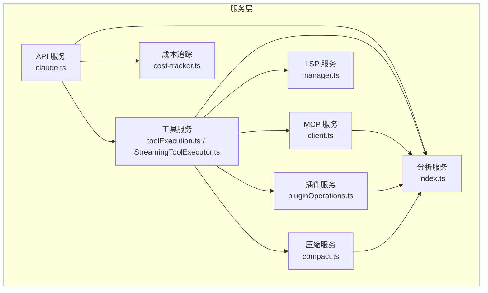
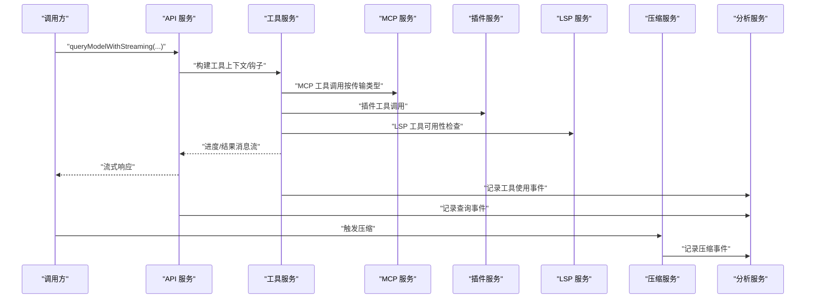
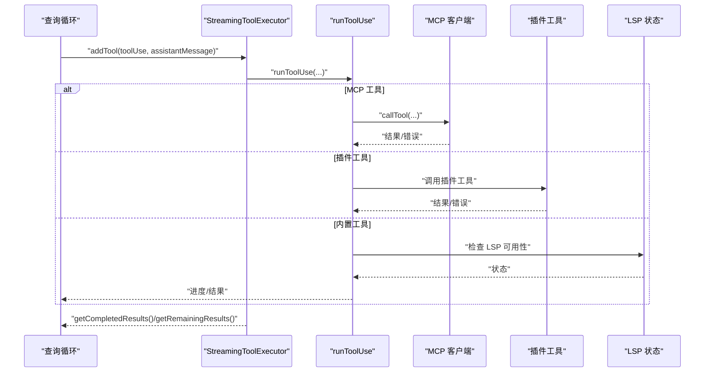
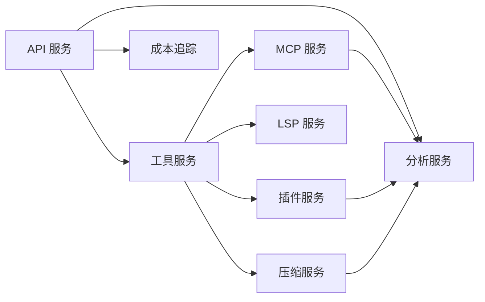

# 服务接口

<cite>
**本文引用的文件**
- [src/services/api/bootstrap.ts](file://src/services/api/bootstrap.ts)
- [src/services/api/claude.ts](file://src/services/api/claude.ts)
- [src/services/tools/toolExecution.ts](file://src/services/tools/toolExecution.ts)
- [src/services/tools/StreamingToolExecutor.ts](file://src/services/tools/StreamingToolExecutor.ts)
- [src/services/mcp/client.ts](file://src/services/mcp/client.ts)
- [src/services/plugins/pluginOperations.ts](file://src/services/plugins/pluginOperations.ts)
- [src/services/lsp/manager.ts](file://src/services/lsp/manager.ts)
- [src/services/compact/compact.ts](file://src/services/compact/compact.ts)
- [src/services/analytics/index.ts](file://src/services/analytics/index.ts)
- [src/services/src/cost-tracker.ts](file://src/services/src/cost-tracker.ts)
</cite>

## 目录
1. [简介](#简介)
2. [项目结构](#项目结构)
3. [核心组件](#核心组件)
4. [架构总览](#架构总览)
5. [详细组件分析](#详细组件分析)
6. [依赖关系分析](#依赖关系分析)
7. [性能考量](#性能考量)
8. [故障排查指南](#故障排查指南)
9. [结论](#结论)
10. [附录](#附录)

## 简介
本文件面向 Claude Code Best 的内部服务接口，系统性梳理并规范以下服务的接口规范与运行机制：
- API 服务：消息查询、模型调用、提示词缓存与重试策略
- 工具服务：工具执行、并发控制、权限校验与错误分类
- 压缩服务：对话压缩、边界标记、附件重建与钩子集成
- MCP 服务：MCP 协议客户端、传输层抽象、认证与会话管理
- 插件服务：插件安装/卸载/启用/禁用、作用域与依赖解析
- LSP 服务：语言服务器管理器生命周期与连接状态
- 分析与成本服务：事件日志、采样与成本追踪占位

目标是为开发者提供可操作的接口定义、数据交换格式、异常处理策略、服务间通信协议以及性能与监控要点。

## 项目结构
服务层位于 src/services 下，按功能域划分模块，采用“领域驱动”的组织方式：
- api：对外 API 调用封装、模型路由、缓存与重试
- tools：工具执行引擎、并发调度与进度流
- mcp：MCP 客户端、传输、认证与连接管理
- plugins：插件全生命周期管理
- lsp：语言服务器管理器单例与初始化流程
- compact：对话压缩与上下文缩减
- analytics：事件日志与采样
- 其他：成本追踪等

图表来源
- [src/services/api/claude.ts:1-800](file://src/services/api/claude.ts#L1-L800)
- [src/services/tools/toolExecution.ts:1-800](file://src/services/tools/toolExecution.ts#L1-L800)
- [src/services/tools/StreamingToolExecutor.ts:1-531](file://src/services/tools/StreamingToolExecutor.ts#L1-L531)
- [src/services/mcp/client.ts:1-800](file://src/services/mcp/client.ts#L1-L800)
- [src/services/plugins/pluginOperations.ts:1-800](file://src/services/plugins/pluginOperations.ts#L1-L800)
- [src/services/lsp/manager.ts:1-290](file://src/services/lsp/manager.ts#L1-L290)
- [src/services/compact/compact.ts:1-800](file://src/services/compact/compact.ts#L1-L800)
- [src/services/analytics/index.ts:1-174](file://src/services/analytics/index.ts#L1-L174)
- [src/services/src/cost-tracker.ts:1-3](file://src/services/src/cost-tracker.ts#L1-L3)

章节来源
- [src/services/api/bootstrap.ts:1-142](file://src/services/api/bootstrap.ts#L1-L142)
- [src/services/api/claude.ts:1-800](file://src/services/api/claude.ts#L1-L800)

## 核心组件
本节概述各服务的关键职责与公共接口能力。

- API 服务（claude.ts）
  - 提供无流式与流式查询封装，支持思考配置、工具选择、输出格式、任务预算、提示词缓存与元数据
  - 支持额外请求体参数拼装、缓存控制与 TTL 策略
  - 集成重试、配额状态提取、VCR 录放与日志

- 工具服务（toolExecution.ts / StreamingToolExecutor.ts）
  - 工具输入校验（Zod）、权限决策、钩子执行、进度消息与最终结果
  - 并发安全工具与串行工具的调度，兄弟进程错误传播与中断行为
  - MCP 工具识别与传输类型推断

- MCP 服务（client.ts）
  - 统一 MCP 客户端，支持 SSE/WS/HTTP/STDIO/SSE-IDE/WS-IDE/SDK 等传输
  - 认证失败缓存、代理与 mTLS、超时包装、会话过期检测与重连
  - 工具调用错误分类与元数据透传

- 插件服务（pluginOperations.ts）
  - 插件安装/卸载/启用/禁用/批量禁用、作用域解析、依赖反向查找与策略检查
  - 设置源写入、版本缓存清理、数据目录删除与选项清理

- LSP 服务（manager.ts）
  - 单例管理器初始化、异步初始化与状态机、重初始化与优雅关闭
  - 连接健康检查与被动通知处理器注册

- 压缩服务（compact.ts）
  - 对话总结生成、边界标记插入、文件/计划/技能/指令增量附件重建
  - 钩子前后置阶段、统计与遥测、提示过长回退与重试

- 分析服务（analytics/index.ts）
  - 事件队列与后端 Sink 注入、采样与 PII 字段剥离、异步/同步事件接口

- 成本追踪（cost-tracker.ts）
  - 类型占位，用于会话成本累计（当前为自动生成桩）

章节来源
- [src/services/api/claude.ts:690-721](file://src/services/api/claude.ts#L690-L721)
- [src/services/tools/toolExecution.ts:337-490](file://src/services/tools/toolExecution.ts#L337-L490)
- [src/services/tools/StreamingToolExecutor.ts:40-125](file://src/services/tools/StreamingToolExecutor.ts#L40-L125)
- [src/services/mcp/client.ts:1-200](file://src/services/mcp/client.ts#L1-L200)
- [src/services/plugins/pluginOperations.ts:321-419](file://src/services/plugins/pluginOperations.ts#L321-L419)
- [src/services/lsp/manager.ts:145-208](file://src/services/lsp/manager.ts#L145-L208)
- [src/services/compact/compact.ts:389-765](file://src/services/compact/compact.ts#L389-L765)
- [src/services/analytics/index.ts:133-164](file://src/services/analytics/index.ts#L133-L164)
- [src/services/src/cost-tracker.ts:1-3](file://src/services/src/cost-tracker.ts#L1-L3)

## 架构总览
下图展示服务间的调用关系与数据流：

图表来源
- [src/services/api/claude.ts:766-794](file://src/services/api/claude.ts#L766-L794)
- [src/services/tools/toolExecution.ts:337-490](file://src/services/tools/toolExecution.ts#L337-L490)
- [src/services/mcp/client.ts:596-608](file://src/services/mcp/client.ts#L596-L608)
- [src/services/plugins/pluginOperations.ts:321-419](file://src/services/plugins/pluginOperations.ts#L321-L419)
- [src/services/lsp/manager.ts:99-110](file://src/services/lsp/manager.ts#L99-L110)
- [src/services/compact/compact.ts:389-765](file://src/services/compact/compact.ts#L389-L765)
- [src/services/analytics/index.ts:133-164](file://src/services/analytics/index.ts#L133-L164)

## 详细组件分析

### API 服务（消息查询与模型调用）
- 公共方法
  - queryModelWithStreaming(...)：流式查询，返回事件/消息/系统错误消息
  - queryModelWithoutStreaming(...)：非流式查询，返回助手消息
  - getExtraBodyParams(...)：拼装额外请求体参数
  - getCacheControl(...) / getPromptCachingEnabled(...)：缓存控制与开关
  - getAPIMetadata(...)：用户/会话元数据
  - verifyApiKey(...)：API Key 可用性验证
- 参数类型
  - Options：包含模型、工具选择、思考配置、输出格式、任务预算、提示词缓存开关、代理覆盖、MCP 工具集合、查询来源与跟踪信息等
- 返回值
  - 流式：事件/消息/系统错误消息；非流式：助手消息
- 异常处理
  - 统一重试 withRetry；配额状态提取；VCR 录放；Abort 信号转换为 APIUserAbortError
- 数据交换格式
  - 消息数组（用户/助手/系统），内容块（文本/图像/工具结果/思维块等）
- 生命周期与依赖注入
  - 通过 getAnthropicClient 获取客户端实例；与 analytics、compact、mcp、vcr 等模块协作
- 性能与监控
  - 缓存 TTL 控制、提示词缓存开关、采样与事件上报

章节来源
- [src/services/api/claude.ts:690-721](file://src/services/api/claude.ts#L690-L721)
- [src/services/api/claude.ts:766-794](file://src/services/api/claude.ts#L766-L794)
- [src/services/api/claude.ts:273-318](file://src/services/api/claude.ts#L273-L318)
- [src/services/api/claude.ts:345-361](file://src/services/api/claude.ts#L345-L361)
- [src/services/api/claude.ts:490-515](file://src/services/api/claude.ts#L490-L515)
- [src/services/api/claude.ts:517-573](file://src/services/api/claude.ts#L517-L573)

### 工具服务（工具执行与并发调度）
- 公共方法
  - runToolUse(...)：异步迭代器，产出进度与最终结果
  - StreamingToolExecutor.addTool(...)：入队工具，按并发策略执行
  - StreamingToolExecutor.getRemainingResults()：等待并产出剩余结果
- 参数类型
  - ToolUseBlock、ToolUseContext、CanUseToolFn、MCP 服务器类型与基础 URL 推断
- 返回值
  - 用户消息（含 tool_result 或进度消息）；上下文修改器
- 异常处理
  - 输入校验失败、权限拒绝、MCP 工具错误分类、兄弟进程错误传播、用户中断与回退消息
- 数据交换格式
  - 工具输入对象（Zod Schema 校验）；工具结果内容块
- 生命周期与依赖注入
  - 通过工具定义与输入 Schema 注入；与 analytics、mcp、hooks、telemetry 等协作
- 性能与监控
  - 并发安全判定、中断行为（cancel/block）、进度事件与统计上报

图表来源
- [src/services/tools/StreamingToolExecutor.ts:76-124](file://src/services/tools/StreamingToolExecutor.ts#L76-L124)
- [src/services/tools/StreamingToolExecutor.ts:265-405](file://src/services/tools/StreamingToolExecutor.ts#L265-L405)
- [src/services/tools/toolExecution.ts:337-490](file://src/services/tools/toolExecution.ts#L337-L490)
- [src/services/mcp/client.ts:596-608](file://src/services/mcp/client.ts#L596-L608)
- [src/services/lsp/manager.ts:99-110](file://src/services/lsp/manager.ts#L99-L110)

章节来源
- [src/services/tools/toolExecution.ts:337-490](file://src/services/tools/toolExecution.ts#L337-L490)
- [src/services/tools/toolExecution.ts:599-760](file://src/services/tools/toolExecution.ts#L599-L760)
- [src/services/tools/StreamingToolExecutor.ts:40-125](file://src/services/tools/StreamingToolExecutor.ts#L40-L125)
- [src/services/tools/StreamingToolExecutor.ts:453-490](file://src/services/tools/StreamingToolExecutor.ts#L453-L490)

### 压缩服务（对话压缩与边界标记）
- 公共方法
  - compactConversation(...)：完整压缩，生成摘要、边界标记与附件
  - partialCompactConversation(...)：部分压缩（从/到某点）
  - buildPostCompactMessages(...)：统一消息顺序
- 参数类型
  - ToolUseContext、CacheSafeParams、自定义指令、是否自动压缩、重组信息
- 返回值
  - CompactionResult：边界标记、摘要消息、附件、钩子结果、统计信息
- 异常处理
  - 提示过长回退与重试、API 错误前缀识别、中断与不完整响应处理
- 数据交换格式
  - 消息数组（用户/助手/系统/进度/附件），边界元数据
- 生命周期与依赖注入
  - 钩子（预/会话开始/后置）、会话元数据重追加、提示词缓存断点通知
- 性能与监控
  - 粗估令牌数、统计分解、事件上报（预/后置钩子）

章节来源
- [src/services/compact/compact.ts:389-765](file://src/services/compact/compact.ts#L389-L765)
- [src/services/compact/compact.ts:774-800](file://src/services/compact/compact.ts#L774-L800)
- [src/services/compact/compact.ts:301-312](file://src/services/compact/compact.ts#L301-L312)

### MCP 服务（MCP 客户端与传输）
- 公共方法
  - connectToServer(...)：按配置连接不同传输（SSE/WS/HTTP/STDIO/SDK）
  - wrapFetchWithTimeout(...)：请求超时包装
  - createClaudeAiProxyFetch(...)：claude.ai 代理认证与重试
  - isMcpSessionExpiredError(...)：会话过期检测
  - getServerCacheKey(...)：连接缓存键
- 参数类型
  - ScopedMcpServerConfig、MCPServerConnection、传输类型
- 返回值
  - 连接结果（已连接/需要认证/失败）
- 异常处理
  - 认证失败缓存、401 处理、会话过期错误、传输层异常
- 数据交换格式
  - JSON-RPC/HTTP/WS/SSE；内容块与二进制输出持久化
- 生命周期与依赖注入
  - 传输层抽象（SSEClientTransport/StdioClientTransport/StreamableHTTP/WS），认证提供者，代理与 mTLS
- 性能与监控
  - 批量连接大小、超时策略、事件与遥测

章节来源
- [src/services/mcp/client.ts:596-608](file://src/services/mcp/client.ts#L596-L608)
- [src/services/mcp/client.ts:493-551](file://src/services/mcp/client.ts#L493-L551)
- [src/services/mcp/client.ts:373-423](file://src/services/mcp/client.ts#L373-L423)
- [src/services/mcp/client.ts:194-207](file://src/services/mcp/client.ts#L194-L207)

### 插件服务（插件安装/卸载/启用/禁用）
- 公共方法
  - installPluginOp(...) / uninstallPluginOp(...) / enablePluginOp(...) / disablePluginOp(...)
  - disableAllPluginsOp(...)：批量禁用
  - getPluginInstallationFromV2(...)：按项目路径优先解析安装范围
- 参数类型
  - 插件标识符（名称或 name@marketplace）、安装/更新作用域（user/project/local/managed）
- 返回值
  - PluginOperationResult / PluginUpdateResult：成功/失败、消息、插件信息、反向依赖警告
- 异常处理
  - 市场不存在、策略阻止、设置写入失败、依赖阻断、最后作用域移除清理数据与选项
- 数据交换格式
  - 插件清单、市场配置、设置源（user/project/local/managed）
- 生命周期与依赖注入
  - 设置源读取/写入、已安装插件 V2 文件、缓存清理、依赖反向查找
- 性能与监控
  - 无直接性能指标，关注设置写入与缓存一致性

章节来源
- [src/services/plugins/pluginOperations.ts:321-419](file://src/services/plugins/pluginOperations.ts#L321-L419)
- [src/services/plugins/pluginOperations.ts:428-559](file://src/services/plugins/pluginOperations.ts#L428-L559)
- [src/services/plugins/pluginOperations.ts:574-776](file://src/services/plugins/pluginOperations.ts#L574-L776)
- [src/services/plugins/pluginOperations.ts:258-299](file://src/services/plugins/pluginOperations.ts#L258-L299)

### LSP 服务（语言服务器管理器）
- 公共方法
  - initializeLspServerManager() / reinitializeLspServerManager() / shutdownLspServerManager()
  - getLspServerManager() / getInitializationStatus() / isLspConnected()
  - waitForInitialization()
- 参数类型
  - 初始化状态枚举、生成计数器、Promise
- 返回值
  - 管理器实例或 undefined；状态对象；连接状态布尔值
- 异常处理
  - 初始化失败清理实例；重试与生成计数器防陈旧初始化；关闭时吞掉错误并清理状态
- 数据交换格式
  - 服务器集合与状态（error/其他）
- 生命周期与依赖注入
  - 单例、异步初始化、被动通知处理器注册、测试重置
- 性能与监控
  - 懒启动、生成计数器避免竞态、日志调试

章节来源
- [src/services/lsp/manager.ts:145-208](file://src/services/lsp/manager.ts#L145-L208)
- [src/services/lsp/manager.ts:226-253](file://src/services/lsp/manager.ts#L226-L253)
- [src/services/lsp/manager.ts:267-289](file://src/services/lsp/manager.ts#L267-L289)

### 分析服务（事件日志与采样）
- 公共方法
  - attachAnalyticsSink(...)：附加 Sink 并排空队列
  - logEvent(...) / logEventAsync(...)：同步/异步事件记录
  - stripProtoFields(...)：剥离 _PROTO_ 前缀字段
- 参数类型
  - AnalyticsSink 接口、事件名与元数据
- 返回值
  - 无（或 Promise）
- 异常处理
  - 无 Sink 时入队，附加后异步排空；采样配置动态生效
- 数据交换格式
  - 事件名字符串 + 结构化元数据（布尔/数字/未定义）
- 生命周期与依赖注入
  - 应用启动时注入，子命令与默认命令均可调用
- 性能与监控
  - 采样率注入元数据；队列微任务排空避免启动延迟

章节来源
- [src/services/analytics/index.ts:95-123](file://src/services/analytics/index.ts#L95-L123)
- [src/services/analytics/index.ts:133-164](file://src/services/analytics/index.ts#L133-L164)

### 成本追踪（成本累计）
- 当前为类型占位，后续将实现 addToTotalSessionCost 等接口以接入成本计算与累计逻辑
- 与 API 服务在调用处存在类型引用（addToTotalSessionCost）

章节来源
- [src/services/src/cost-tracker.ts:1-3](file://src/services/src/cost-tracker.ts#L1-L3)
- [src/services/api/claude.ts:147-148](file://src/services/api/claude.ts#L147-L148)

## 依赖关系分析
- 低耦合高内聚：各服务独立封装，通过明确的函数签名与类型交互
- 关键依赖链
  - API 服务依赖 analytics、compact、mcp、vcr
  - 工具服务依赖 analytics、mcp、plugins、lsp、compact
  - MCP 服务依赖 analytics、auth、transport、proxy、mTLS
  - 插件服务依赖 settings、marketplace、policy、cache、directories
  - LSP 服务依赖 manager、notification、startup
  - 压缩服务依赖 api、analytics、attachments、hooks
  - 分析服务被广泛使用但无外部依赖
  - 成本追踪与 API 服务存在弱耦合

图表来源
- [src/services/api/claude.ts:222-232](file://src/services/api/claude.ts#L222-L232)
- [src/services/tools/toolExecution.ts:100-131](file://src/services/tools/toolExecution.ts#L100-L131)
- [src/services/mcp/client.ts:104-114](file://src/services/mcp/client.ts#L104-L114)
- [src/services/plugins/pluginOperations.ts:66-68](file://src/services/plugins/pluginOperations.ts#L66-L68)
- [src/services/lsp/manager.ts:8-9](file://src/services/lsp/manager.ts#L8-L9)
- [src/services/compact/compact.ts:96-100](file://src/services/compact/compact.ts#L96-L100)
- [src/services/analytics/index.ts:72-78](file://src/services/analytics/index.ts#L72-L78)
- [src/services/src/cost-tracker.ts:1-3](file://src/services/src/cost-tracker.ts#L1-L3)

## 性能考量
- 缓存与提示词缓存
  - getCacheControl / getPromptCachingEnabled 控制缓存 TTL 与开关
  - should1hCacheTTL 基于用户资格与查询来源白名单动态决定 1 小时 TTL
- 重试与超时
  - withRetry 提供指数退避与最大重试；wrapFetchWithTimeout 避免单次超时信号过期问题
- 并发与中断
  - StreamingToolExecutor 区分并发安全工具与串行工具，支持兄弟进程错误传播与中断行为
- 令牌估算与统计
  - 压缩服务使用粗估令牌数进行预判与事件上报
- 日志与诊断
  - 丰富的调试日志与诊断日志开关，便于定位性能瓶颈

[本节为通用指导，无需特定文件引用]

## 故障排查指南
- API 查询失败
  - 检查 verifyApiKey 是否返回 false；确认 betas、extraBodyParams、metadata 正确
  - 观察 withRetry 重试次数与错误类型；查看配额状态提取
- 工具执行错误
  - 输入校验失败：检查 Zod Schema 与 buildSchemaNotSentHint 提示
  - 权限拒绝：查看 runPreToolUseHooks 与 runPostToolUseFailureHooks 输出
  - MCP 工具错误：捕获 McpToolCallError_I_VERIFIED_THIS_IS_NOT_CODE_OR_FILEPATHS 并检查 _meta
- MCP 连接问题
  - 认证失败：handleRemoteAuthFailure 写入 needs-auth 缓存；createClaudeAiProxyFetch 处理 401
  - 会话过期：isMcpSessionExpiredError 检测；connectToServer 重连
- 插件操作失败
  - 市场不存在：installPluginOp 返回“未找到”；策略阻止：blocked-by-policy
  - 最后作用域移除：清理数据目录与选项；反向依赖警告
- LSP 初始化失败
  - 重试 initializeLspServerManager；shutdownLspServerManager 清理资源
- 压缩失败
  - 提示过长：truncateHeadForPTLRetry 回退；API 错误前缀识别

章节来源
- [src/services/api/claude.ts:517-573](file://src/services/api/claude.ts#L517-L573)
- [src/services/tools/toolExecution.ts:614-680](file://src/services/tools/toolExecution.ts#L614-L680)
- [src/services/mcp/client.ts:341-362](file://src/services/mcp/client.ts#L341-L362)
- [src/services/mcp/client.ts:194-207](file://src/services/mcp/client.ts#L194-L207)
- [src/services/plugins/pluginOperations.ts:361-419](file://src/services/plugins/pluginOperations.ts#L361-L419)
- [src/services/lsp/manager.ts:194-207](file://src/services/lsp/manager.ts#L194-L207)
- [src/services/compact/compact.ts:462-493](file://src/services/compact/compact.ts#L462-L493)

## 结论
本文档对 Claude Code Best 的核心服务接口进行了系统化梳理，明确了各服务的职责边界、公共方法、参数与返回值、异常处理策略、服务间通信协议与数据交换格式，并给出了生命周期管理与依赖注入模式的实践建议。结合性能与监控要点，开发者可在保证稳定性的同时高效扩展与维护服务接口。

[本节为总结，无需特定文件引用]

## 附录
- 术语
  - MCP：Model Context Protocol，用于与外部工具/服务器通信
  - VCR：录制与回放，用于测试与调试
  - LSP：Language Server Protocol，编辑器语言服务
  - 采样：事件日志采样，降低上报开销
- 版本与兼容
  - 代码中存在多处 feature 标记与条件加载，需关注特性开关对行为的影响

[本节为补充说明，无需特定文件引用]