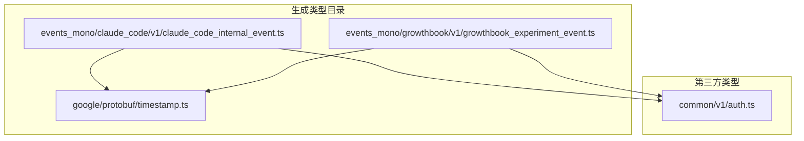
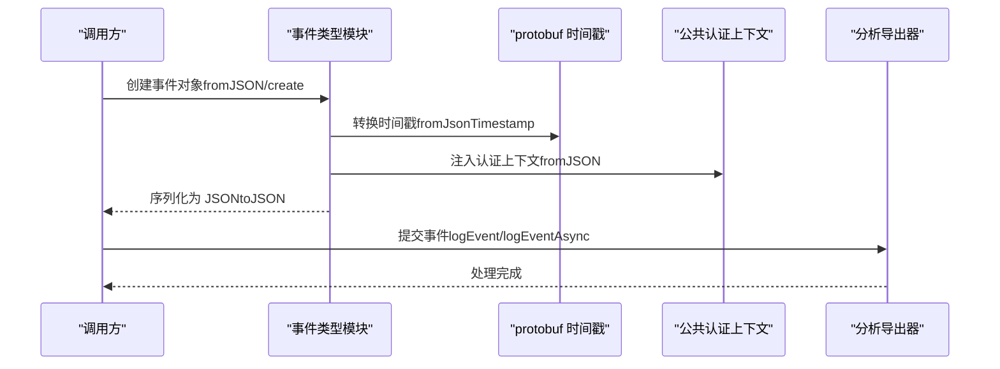
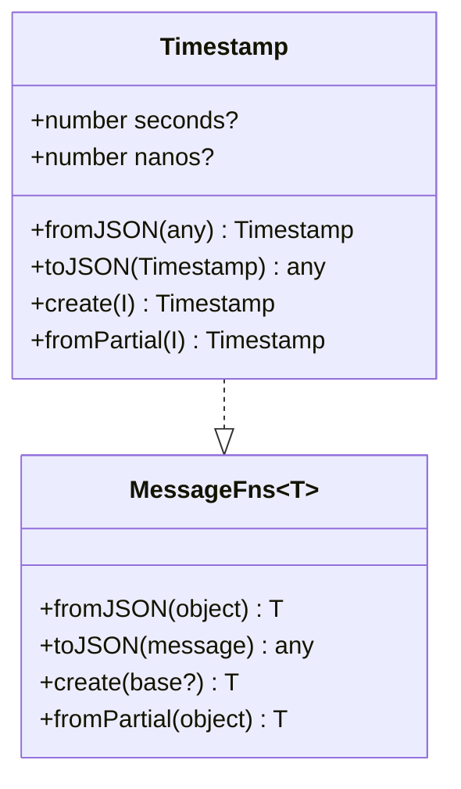
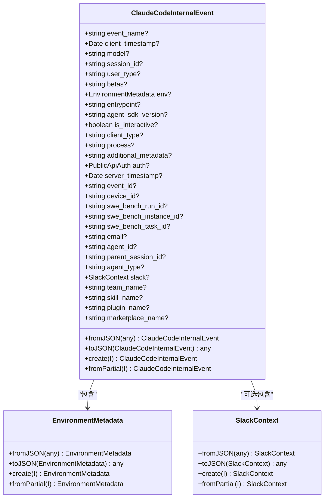
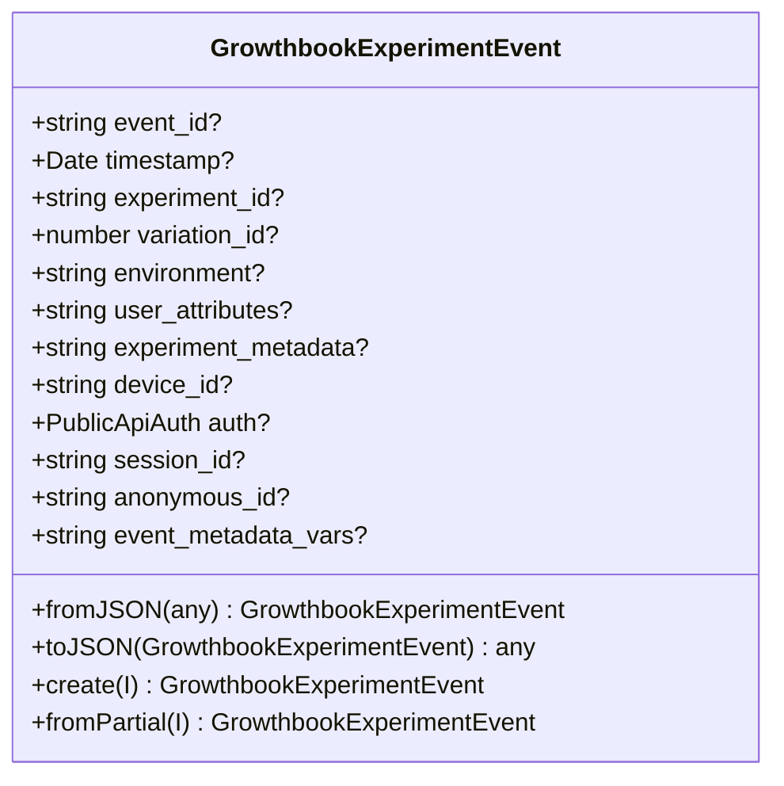
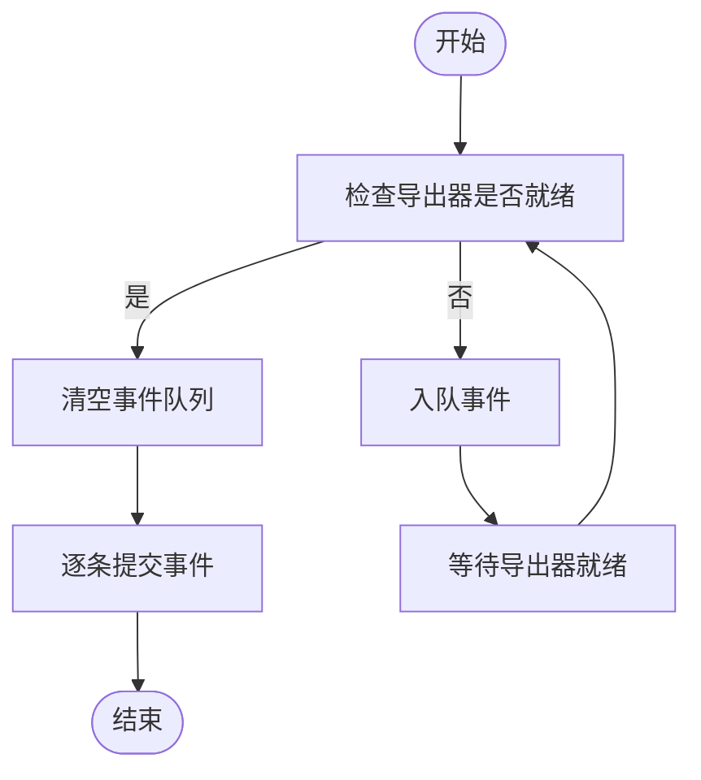
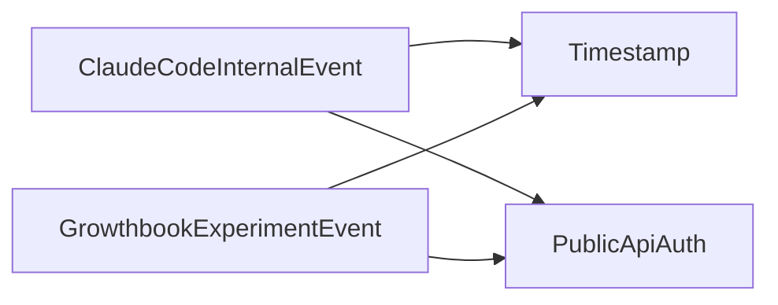

# 生成类型

<cite>
**本文引用的文件**
- [src/types/generated/google/protobuf/timestamp.ts](file://src/types/generated/google/protobuf/timestamp.ts)
- [src/types/generated/events_mono/claude_code/v1/claude_code_internal_event.ts](file://src/types/generated/events_mono/claude_code/v1/claude_code_internal_event.ts)
- [src/types/generated/events_mono/growthbook/v1/growthbook_experiment_event.ts](file://src/types/generated/events_mono/growthbook/v1/growthbook_experiment_event.ts)
- [src/services/analytics/index.ts](file://src/services/analytics/index.ts)
- [package.json](file://package.json)
</cite>

## 目录
1. [简介](#简介)
2. [项目结构](#项目结构)
3. [核心组件](#核心组件)
4. [架构总览](#架构总览)
5. [详细组件分析](#详细组件分析)
6. [依赖分析](#依赖分析)
7. [性能考虑](#性能考虑)
8. [故障排查指南](#故障排查指南)
9. [结论](#结论)
10. [附录](#附录)

## 简介
本文件系统性梳理 Claude Code Best 项目中的“生成类型”体系，覆盖由代码生成的事件类型、协议缓冲区（protobuf）类型以及第三方库类型。文档重点阐述：
- 事件类型：Claude Code 内部事件与 GrowthBook 实验事件的结构与用途
- 协议缓冲区类型：基于 protobuf 的时间戳类型及其序列化/反序列化工具
- 第三方库类型：与分析与日志导出相关的元数据类型与队列机制
- 设计模式与使用方法：统一的消息接口、深度拷贝与类型安全模式
- 类型映射与转换规则：JSON ↔ 对象、时间戳 ↔ Date 的双向转换
- 配置与定制：生成器版本、导入路径与字段约束
- 版本兼容与升级策略：生成器版本号、字段可空性与向后兼容

## 项目结构
生成类型主要位于 src/types/generated 目录下，按命名空间划分：
- google/protobuf：通用 protobuf 基础类型（如时间戳）
- events_mono/：事件域类型，包含 Claude Code 内部事件与 GrowthBook 实验事件
- 其他第三方类型：在事件类型中通过 import 引入（例如公共认证上下文）

图表来源
- [src/types/generated/google/protobuf/timestamp.ts:1-188](file://src/types/generated/google/protobuf/timestamp.ts#L1-L188)
- [src/types/generated/events_mono/claude_code/v1/claude_code_internal_event.ts:1-130](file://src/types/generated/events_mono/claude_code/v1/claude_code_internal_event.ts#L1-L130)
- [src/types/generated/events_mono/growthbook/v1/growthbook_experiment_event.ts:1-41](file://src/types/generated/events_mono/growthbook/v1/growthbook_experiment_event.ts#L1-L41)

章节来源
- [src/types/generated/google/protobuf/timestamp.ts:1-188](file://src/types/generated/google/protobuf/timestamp.ts#L1-L188)
- [src/types/generated/events_mono/claude_code/v1/claude_code_internal_event.ts:1-130](file://src/types/generated/events_mono/claude_code/v1/claude_code_internal_event.ts#L1-L130)
- [src/types/generated/events_mono/growthbook/v1/growthbook_experiment_event.ts:1-41](file://src/types/generated/events_mono/growthbook/v1/growthbook_experiment_event.ts#L1-L41)

## 核心组件
- 时间戳类型（protobuf）：提供秒与纳秒字段，并配套 fromJSON/toJSON/create/fromPartial 工具函数，支持 JSON 字符串到 Date 的转换
- Claude Code 内部事件：承载客户端/服务端时间戳、会话标识、环境信息、附加元数据、认证上下文等
- GrowthBook 实验事件：记录实验分配、变体索引、用户属性与匿名标识等
- 分析服务类型：日志事件元数据类型、事件队列项、分析导出器接口与队列机制

章节来源
- [src/types/generated/google/protobuf/timestamp.ts:100-187](file://src/types/generated/google/protobuf/timestamp.ts#L100-L187)
- [src/types/generated/events_mono/claude_code/v1/claude_code_internal_event.ts:80-130](file://src/types/generated/events_mono/claude_code/v1/claude_code_internal_event.ts#L80-L130)
- [src/types/generated/events_mono/growthbook/v1/growthbook_experiment_event.ts:16-41](file://src/types/generated/events_mono/growthbook/v1/growthbook_experiment_event.ts#L16-L41)
- [src/services/analytics/index.ts:61-81](file://src/services/analytics/index.ts#L61-L81)

## 架构总览
生成类型在运行时的典型交互流程如下：

图表来源
- [src/types/generated/events_mono/claude_code/v1/claude_code_internal_event.ts:587-761](file://src/types/generated/events_mono/claude_code/v1/claude_code_internal_event.ts#L587-L761)
- [src/types/generated/events_mono/growthbook/v1/growthbook_experiment_event.ts:60-142](file://src/types/generated/events_mono/growthbook/v1/growthbook_experiment_event.ts#L60-L142)
- [src/types/generated/google/protobuf/timestamp.ts:198-212](file://src/types/generated/google/protobuf/timestamp.ts#L198-L212)
- [src/services/analytics/index.ts:69-78](file://src/services/analytics/index.ts#L69-L78)

## 详细组件分析

### 组件一：protobuf 时间戳类型
- 设计要点
  - 接口包含 seconds 与 nanos 字段，均允许为空
  - 提供 MessageFns<T> 统一接口：fromJSON、toJSON、create、fromPartial
  - 深度拷贝与类型安全：DeepPartial、Exact、KeysOfUnion 辅助类型
  - JSON ↔ Date 转换：fromJsonTimestamp 支持字符串或对象；fromTimestamp 将秒/纳秒转为 Date
- 使用方法
  - 从 JSON 构造：调用 fromJSON，内部对 seconds/nanos 进行类型转换
  - 序列化为 JSON：toJSON 将数值四舍五入为整数
  - 创建实例：create/base 与 fromPartial 组合实现部分初始化
- 转换规则
  - JSON 字符串 → Date：若为字符串则直接解析，否则走 protobuf 时间戳解析
  - protobuf 时间戳 → Date：以秒为基准乘以 1000，加上纳秒换算毫秒
- 兼容性
  - 字段可空，保证与 JSON 源的兼容
  - 生成器版本固定，避免不同版本字段差异导致的不一致

图表来源
- [src/types/generated/google/protobuf/timestamp.ts:100-187](file://src/types/generated/google/protobuf/timestamp.ts#L100-L187)

章节来源
- [src/types/generated/google/protobuf/timestamp.ts:100-187](file://src/types/generated/google/protobuf/timestamp.ts#L100-L187)

### 组件二：Claude Code 内部事件
- 设计要点
  - 包含事件名、客户端/服务端时间戳、会话 ID、用户类型、环境元数据、入口点、进程指标、附加元数据、认证上下文、设备 ID、SWE-bench 相关字段、Slack 上下文、团队/技能/插件/市场名称等
  - 环境元数据包含平台、Node 版本、终端、包管理器、运行时、CI/WSL/GitHub Actions 等多维信息
  - 时间戳字段通过 fromJsonTimestamp 与 protobuf 时间戳互转
- 使用方法
  - fromJSON：解析 JSON，自动处理时间戳与嵌套对象
  - toJSON：序列化时将 Date 转为 ISO 字符串，嵌套对象调用对应 toJSON
  - create/fromPartial：用于构造与部分初始化
- 转换规则
  - client_timestamp/server_timestamp：JSON 字符串或 Date 对象 → Date；序列化为 ISO 字符串
  - env/slack/auth：嵌套对象的 fromJSON/toJSON 递归调用
- 兼容性
  - 多数字段可空，便于增量演进
  - 与公共认证上下文类型保持一致的注入方式

图表来源
- [src/types/generated/events_mono/claude_code/v1/claude_code_internal_event.ts:80-130](file://src/types/generated/events_mono/claude_code/v1/claude_code_internal_event.ts#L80-L130)
- [src/types/generated/events_mono/claude_code/v1/claude_code_internal_event.ts:181-491](file://src/types/generated/events_mono/claude_code/v1/claude_code_internal_event.ts#L181-L491)
- [src/types/generated/events_mono/claude_code/v1/claude_code_internal_event.ts:493-550](file://src/types/generated/events_mono/claude_code/v1/claude_code_internal_event.ts#L493-L550)

章节来源
- [src/types/generated/events_mono/claude_code/v1/claude_code_internal_event.ts:80-130](file://src/types/generated/events_mono/claude_code/v1/claude_code_internal_event.ts#L80-L130)
- [src/types/generated/events_mono/claude_code/v1/claude_code_internal_event.ts:586-811](file://src/types/generated/events_mono/claude_code/v1/claude_code_internal_event.ts#L586-L811)

### 组件三：GrowthBook 实验事件
- 设计要点
  - 记录实验分配的关键字段：事件 ID、时间戳、实验 ID、变体索引、环境、用户属性、实验元数据、设备 ID、会话 ID、匿名 ID、事件元数据变量
  - 变体索引以数字表示，0 表示对照组，正数表示实验组
- 使用方法
  - fromJSON：解析 JSON，时间戳通过 fromJsonTimestamp 转换
  - toJSON：序列化时将 Date 转为 ISO 字符串
  - create/fromPartial：构造与部分初始化
- 转换规则
  - timestamp：JSON 字符串或 Date → Date；序列化为 ISO 字符串
  - variation_id：JSON 数字 → number
- 兼容性
  - 字段可空，便于扩展新维度

图表来源
- [src/types/generated/events_mono/growthbook/v1/growthbook_experiment_event.ts:16-41](file://src/types/generated/events_mono/growthbook/v1/growthbook_experiment_event.ts#L16-L41)
- [src/types/generated/events_mono/growthbook/v1/growthbook_experiment_event.ts:60-170](file://src/types/generated/events_mono/growthbook/v1/growthbook_experiment_event.ts#L60-L170)

章节来源
- [src/types/generated/events_mono/growthbook/v1/growthbook_experiment_event.ts:16-41](file://src/types/generated/events_mono/growthbook/v1/growthbook_experiment_event.ts#L16-L41)
- [src/types/generated/events_mono/growthbook/v1/growthbook_experiment_event.ts:60-170](file://src/types/generated/events_mono/growthbook/v1/growthbook_experiment_event.ts#L60-L170)

### 组件四：分析服务类型与事件队列
- 设计要点
  - 日志事件元数据类型：键值对，值为布尔/数字/未定义
  - 事件队列项：包含事件名、元数据与异步标记
  - 分析导出器接口：同步与异步日志事件方法
  - 事件队列：在导出器未就绪前暂存事件，待就绪后批量处理
  - 元数据清洗：移除以 _PROTO_ 开头的键，防止敏感字段落入通用存储
- 使用方法
  - 在导出器就绪前调用 logEvent/logEventAsync，事件被入队
  - 导出器就绪后触发队列清空，逐条提交
  - 清洗元数据时遍历键，删除 _PROTO_ 前缀键
- 转换规则
  - 元数据键过滤：仅保留非 _PROTO_ 前缀键
  - 返回原对象或浅拷贝副本（惰性复制）

图表来源
- [src/services/analytics/index.ts:61-81](file://src/services/analytics/index.ts#L61-L81)

章节来源
- [src/services/analytics/index.ts:35-81](file://src/services/analytics/index.ts#L35-L81)

## 依赖分析
- 生成类型依赖
  - Claude Code 内部事件与 GrowthBook 实验事件均依赖 protobuf 时间戳类型与公共认证上下文类型
  - 事件类型通过 fromJSON/toJSON 与第三方库类型进行互操作
- 第三方库
  - 分析导出器接口与事件队列机制由内部服务提供，不直接依赖外部库
- 版本与生成器
  - 生成器版本固定于生成注释中，确保跨环境一致性

图表来源
- [src/types/generated/events_mono/claude_code/v1/claude_code_internal_event.ts:8-9](file://src/types/generated/events_mono/claude_code/v1/claude_code_internal_event.ts#L8-L9)
- [src/types/generated/events_mono/growthbook/v1/growthbook_experiment_event.ts:8-9](file://src/types/generated/events_mono/growthbook/v1/growthbook_experiment_event.ts#L8-L9)

章节来源
- [src/types/generated/events_mono/claude_code/v1/claude_code_internal_event.ts:8-9](file://src/types/generated/events_mono/claude_code/v1/claude_code_internal_event.ts#L8-L9)
- [src/types/generated/events_mono/growthbook/v1/growthbook_experiment_event.ts:8-9](file://src/types/generated/events_mono/growthbook/v1/growthbook_experiment_event.ts#L8-L9)

## 性能考虑
- 序列化开销
  - 时间戳序列化时对秒/纳秒进行四舍五入，避免浮点精度问题
  - Date 序列化为 ISO 字符串，减少额外格式化成本
- 深度拷贝与类型安全
  - DeepPartial/Exact/KeysOfUnion 降低运行时类型错误风险，但可能带来轻微的泛型展开成本
- 事件队列
  - 在导出器未就绪时缓存事件，避免阻塞主流程；建议合理设置队列上限与超时策略

## 故障排查指南
- 时间戳解析失败
  - 确认 JSON 中的时间戳字段为字符串或合法 Date 对象；若为对象，需符合 protobuf 时间戳结构
- 字段缺失或类型不符
  - 事件类型多数字段可空，若出现异常，检查 fromJSON 输入是否包含必要字段
- 元数据污染
  - 若发现 _PROTO_ 前缀键出现在通用存储中，确认已调用清洗函数或在导出前执行清洗逻辑
- 导出器未就绪
  - 观察事件是否被正确入队并在导出器就绪后清空；检查异步日志方法返回的 Promise 是否被正确 await

章节来源
- [src/types/generated/google/protobuf/timestamp.ts:198-212](file://src/types/generated/google/protobuf/timestamp.ts#L198-L212)
- [src/services/analytics/index.ts:35-58](file://src/services/analytics/index.ts#L35-L58)

## 结论
本项目的生成类型体系以 protobuf 时间戳为核心，围绕 Claude Code 内部事件与 GrowthBook 实验事件构建了统一的消息接口与转换规则。通过深度拷贝与类型安全辅助类型，确保在复杂嵌套结构下的可靠性；配合分析服务的事件队列与元数据清洗机制，满足生产环境的稳定性与合规要求。版本固定与字段可空设计为后续演进提供了良好的兼容性基础。

## 附录

### 类型映射与转换规则
- JSON ↔ 对象
  - fromJSON：将 JSON 值转换为强类型对象，数值字段进行类型收敛（Number/String/Boolean）
  - toJSON：将对象序列化为 JSON，Date 转为 ISO 字符串，数组与嵌套对象递归处理
- 时间戳 ↔ Date
  - fromJsonTimestamp：支持字符串、Date 或 protobuf 时间戳对象
  - fromTimestamp：将 seconds/nanos 转为 Date（毫秒级）
- 元数据清洗
  - stripProtoFields：移除键名以 _PROTO_ 开头的键，返回新对象或原对象引用

章节来源
- [src/types/generated/google/protobuf/timestamp.ts:120-150](file://src/types/generated/google/protobuf/timestamp.ts#L120-L150)
- [src/types/generated/google/protobuf/timestamp.ts:198-212](file://src/types/generated/google/protobuf/timestamp.ts#L198-L212)
- [src/services/analytics/index.ts:45-58](file://src/services/analytics/index.ts#L45-L58)

### 配置与定制选项
- 生成器版本
  - 生成注释中固定版本号，确保跨环境一致性
- 导入路径
  - 事件类型通过相对路径导入 protobuf 时间戳与公共认证上下文
- 字段约束
  - 多数字段可空，便于增量演进；核心字段（如 event_id、timestamp）建议始终提供

章节来源
- [src/types/generated/google/protobuf/timestamp.ts:1-5](file://src/types/generated/google/protobuf/timestamp.ts#L1-L5)
- [src/types/generated/events_mono/claude_code/v1/claude_code_internal_event.ts:8-9](file://src/types/generated/events_mono/claude_code/v1/claude_code_internal_event.ts#L8-L9)
- [src/types/generated/events_mono/growthbook/v1/growthbook_experiment_event.ts:8-9](file://src/types/generated/events_mono/growthbook/v1/growthbook_experiment_event.ts#L8-L9)

### 版本兼容性与升级策略
- 生成器版本固定：避免不同版本生成代码的字段差异导致的不兼容
- 字段可空性：多数字段允许为空，便于新增字段而不破坏现有消费端
- 向后兼容
  - 新增字段应保持可空，避免影响旧版本解析
  - 严格控制字段重命名与删除，必要时提供迁移脚本
- 升级建议
  - 更新生成器版本前，先在测试环境验证 fromJSON/toJSON 的行为变化
  - 对时间戳与日期字段进行回归测试，确保序列化/反序列化一致性

章节来源
- [src/types/generated/google/protobuf/timestamp.ts:1-5](file://src/types/generated/google/protobuf/timestamp.ts#L1-L5)
- [src/types/generated/events_mono/claude_code/v1/claude_code_internal_event.ts:587-761](file://src/types/generated/events_mono/claude_code/v1/claude_code_internal_event.ts#L587-L761)
- [src/types/generated/events_mono/growthbook/v1/growthbook_experiment_event.ts:60-142](file://src/types/generated/events_mono/growthbook/v1/growthbook_experiment_event.ts#L60-L142)