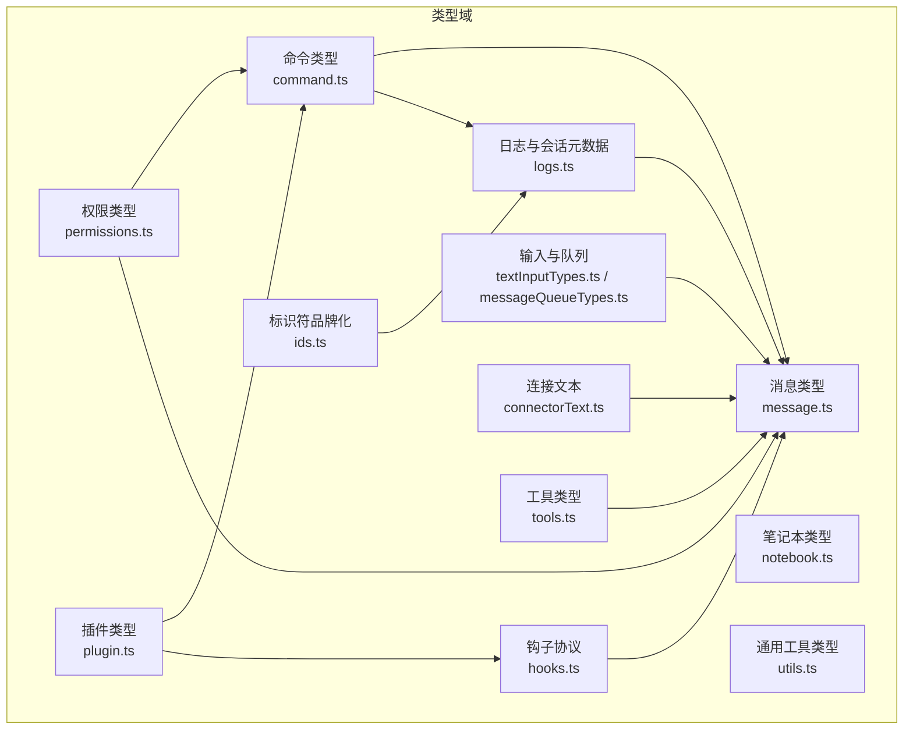
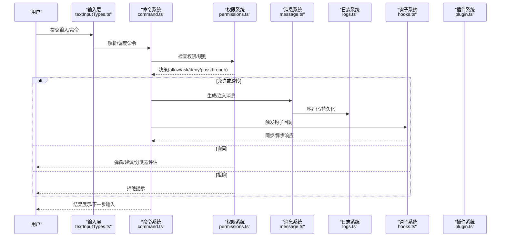
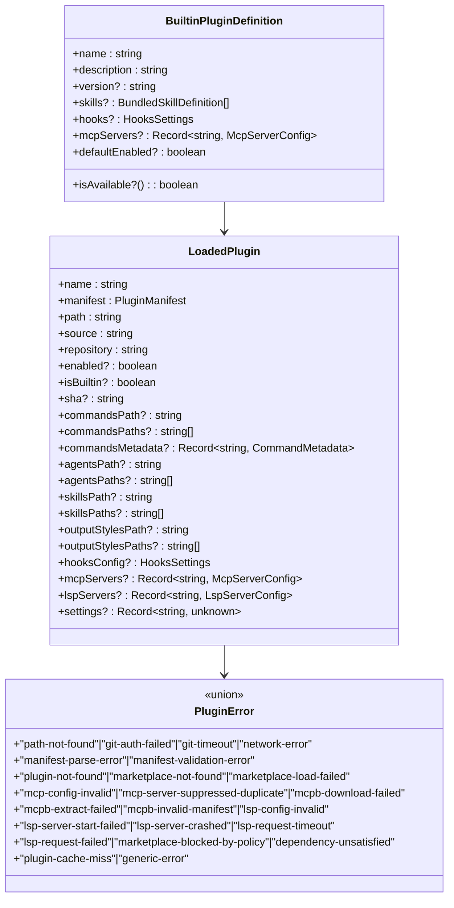
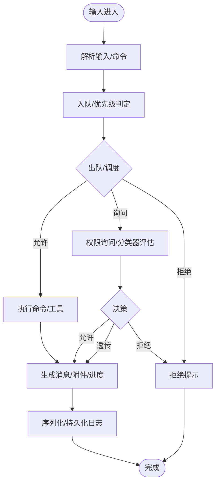
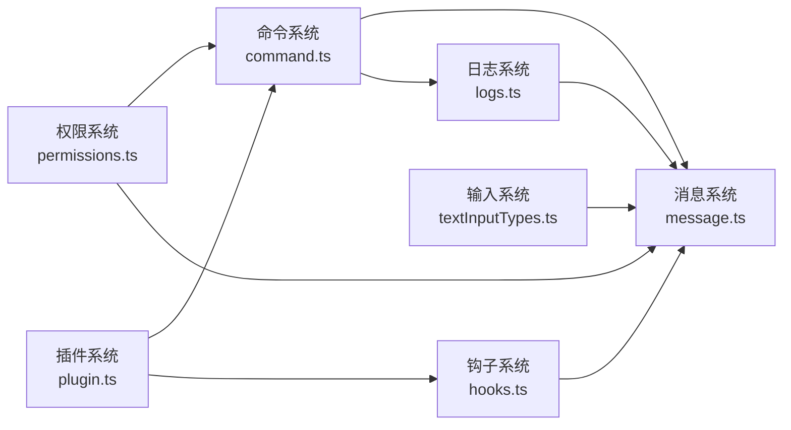

# 类型系统

<cite>
**本文引用的文件**
- [message.ts](file://src/types/message.ts)
- [command.ts](file://src/types/command.ts)
- [permissions.ts](file://src/types/permissions.ts)
- [notebook.ts](file://src/types/notebook.ts)
- [plugin.ts](file://src/types/plugin.ts)
- [ids.ts](file://src/types/ids.ts)
- [messageQueueTypes.ts](file://src/types/messageQueueTypes.ts)
- [textInputTypes.ts](file://src/types/textInputTypes.ts)
- [logs.ts](file://src/types/logs.ts)
- [hooks.ts](file://src/types/hooks.ts)
- [connectorText.ts](file://src/types/connectorText.ts)
- [tools.ts](file://src/types/tools.ts)
- [utils.ts](file://src/types/utils.ts)
</cite>

## 目录
1. [简介](#简介)
2. [项目结构](#项目结构)
3. [核心组件](#核心组件)
4. [架构总览](#架构总览)
5. [详细组件分析](#详细组件分析)
6. [依赖分析](#依赖分析)
7. [性能考虑](#性能考虑)
8. [故障排查指南](#故障排查指南)
9. [结论](#结论)
10. [附录](#附录)

## 简介
本文件系统性梳理 Claude Code Best 的类型系统，聚焦以下核心领域：
- 消息类型：涵盖用户、助手、系统、附件、进度、分组工具使用、折叠读取搜索等消息形态及渲染/可折叠语义。
- 命令类型：本地命令、Prompt 命令、本地 JSX 命令的统一抽象与执行上下文、可用性与启用策略。
- 权限类型：权限模式、行为、规则、决策与结果、分类器、解释说明、工具权限上下文等。
- 笔记本类型：Notebook 细胞、内容、输出等占位类型，便于后续实现扩展。
- 插件类型：内置插件、加载插件、错误类型与错误消息映射、插件配置与仓库信息。
- 工具类型：工具进度与通用数据载体占位类型。
- 输入/日志/钩子/连接文本等辅助类型：输入队列、粘贴内容、会话日志条目、钩子回调与响应、连接文本块等。

文档将给出字段定义、数据类型约束、业务规则、类型继承关系图、类型别名说明、泛型使用示例与最佳实践，并记录类型转换与序列化规则。

## 项目结构
类型系统主要分布在 src/types 目录下，按功能域划分：
- 消息与对话：message.ts
- 命令与执行：command.ts
- 权限与安全：permissions.ts
- 插件生态：plugin.ts
- 标识符品牌化：ids.ts
- 输入与队列：textInputTypes.ts、messageQueueTypes.ts
- 日志与会话元数据：logs.ts
- 钩子协议与回调：hooks.ts
- 连接文本：connectorText.ts
- 工具进度：tools.ts
- 通用工具类型：utils.ts



**图表来源**
- [message.ts:1-168](file://src/types/message.ts#L1-L168)
- [command.ts:1-217](file://src/types/command.ts#L1-L217)
- [permissions.ts:1-442](file://src/types/permissions.ts#L1-L442)
- [plugin.ts:1-364](file://src/types/plugin.ts#L1-L364)
- [ids.ts:1-45](file://src/types/ids.ts#L1-L45)
- [textInputTypes.ts:1-388](file://src/types/textInputTypes.ts#L1-L388)
- [messageQueueTypes.ts:1-11](file://src/types/messageQueueTypes.ts#L1-L11)
- [logs.ts:1-331](file://src/types/logs.ts#L1-L331)
- [hooks.ts:1-290](file://src/types/hooks.ts#L1-L290)
- [connectorText.ts:1-5](file://src/types/connectorText.ts#L1-L5)
- [tools.ts:1-13](file://src/types/tools.ts#L1-L13)
- [utils.ts:1-4](file://src/types/utils.ts#L1-L4)

**章节来源**
- [message.ts:1-168](file://src/types/message.ts#L1-L168)
- [command.ts:1-217](file://src/types/command.ts#L1-L217)
- [permissions.ts:1-442](file://src/types/permissions.ts#L1-L442)
- [plugin.ts:1-364](file://src/types/plugin.ts#L1-L364)
- [ids.ts:1-45](file://src/types/ids.ts#L1-L45)
- [textInputTypes.ts:1-388](file://src/types/textInputTypes.ts#L1-L388)
- [messageQueueTypes.ts:1-11](file://src/types/messageQueueTypes.ts#L1-L11)
- [logs.ts:1-331](file://src/types/logs.ts#L1-L331)
- [hooks.ts:1-290](file://src/types/hooks.ts#L1-L290)
- [connectorText.ts:1-5](file://src/types/connectorText.ts#L1-L5)
- [tools.ts:1-13](file://src/types/tools.ts#L1-L13)
- [utils.ts:1-4](file://src/types/utils.ts#L1-L4)

## 核心组件
本节概述四大类核心类型及其职责边界与关键字段。

- 消息类型（Message）
  - 基础消息结构包含类型判别字段、UUID、是否为元消息、是否仅可见于转录、工具使用结果、附件、message 内嵌对象等。
  - 具体子类型通过字面量类型收窄，如 assistant、user、system、attachment、progress、grouped_tool_use、collapsed_read_search。
  - 提供渲染与可折叠消息集合，以及折叠组聚合统计字段（读取、搜索、内存读写、提交、分支、PR 等）。

- 命令类型（Command）
  - 统一抽象 PromptCommand、LocalCommand、LocalJSXCommand 三类命令。
  - 包含可用性（auth/provider）、描述、启用状态、隐藏、别名、MCP 标记、参数提示、版本、是否允许模型调用、是否用户可触发、来源、工作流标记、立即执行、敏感参数等。
  - 提供本地命令与 JSX 命令的调用签名、上下文、结果展示策略与完成回调。

- 权限类型（Permissions）
  - 权限模式：外部可配置模式集合与内部运行时模式集合；行为：allow/deny/ask；规则来源与值。
  - 决策结果：允许、询问、拒绝、透传；并支持异步分类器检查与建议更新。
  - 工具权限上下文：模式、附加工作目录、规则来源映射、是否可绕过权限提示、自动化检查前置等。

- 插件类型（Plugin）
  - 内置插件定义：名称、描述、版本、技能、钩子、MCP/LSP 服务器、可用性与默认启用状态。
  - 加载插件：清单、路径、来源、仓库、启用状态、组件路径、命令/代理/技能/输出样式/钩子/MCP/LSP 配置、设置。
  - 错误类型：覆盖路径不存在、Git 认证失败、网络错误、清单解析/校验失败、市场不存在/加载失败、MCP/LSP 配置无效/启动失败/超时/失败、策略阻断、依赖未满足、缓存缺失、通用错误等。
  - 错误消息映射函数：根据错误类型生成用户可读提示。

**章节来源**
- [message.ts:14-168](file://src/types/message.ts#L14-L168)
- [command.ts:16-217](file://src/types/command.ts#L16-L217)
- [permissions.ts:16-442](file://src/types/permissions.ts#L16-L442)
- [plugin.ts:18-364](file://src/types/plugin.ts#L18-L364)

## 架构总览
类型系统围绕“消息—命令—权限—插件—输入/日志/钩子”的主干协作链路构建，形成如下交互：



**图表来源**
- [command.ts:16-217](file://src/types/command.ts#L16-L217)
- [permissions.ts:164-267](file://src/types/permissions.ts#L164-L267)
- [message.ts:33-168](file://src/types/message.ts#L33-L168)
- [logs.ts:8-53](file://src/types/logs.ts#L8-L53)
- [hooks.ts:201-290](file://src/types/hooks.ts#L201-L290)
- [plugin.ts:48-70](file://src/types/plugin.ts#L48-L70)

## 详细组件分析

### 消息类型（Message）
- 字段与约束
  - type：字面量联合，限定消息类型集合。
  - uuid：全局唯一标识，用于会话与转录追踪。
  - isMeta：是否为元消息（对模型可见但不显示在 UI 转录中）。
  - isCompactSummary：紧凑摘要标记。
  - toolUseResult：工具使用结果占位。
  - isVisibleInTranscriptOnly：仅在转录中可见。
  - attachment：附件对象，包含类型与可选工具 use ID。
  - message：内嵌对象，包含角色、ID、内容、用量等。
  - 扩展键：保留扩展字段以兼容未来演进。
- 子类型与别名
  - AssistantMessage、UserMessage、SystemMessage、SystemLocalCommandMessage、AttachmentMessage<T>、ProgressMessage<T>、NormalizedUserMessage、NormalizedAssistantMessage<T>、SystemAPIErrorMessage、SystemFileSnapshotMessage、SystemThinkingMessage、SystemAgentsKilledMessage、SystemApiMetricsMessage、SystemAwaySummaryMessage、SystemBridgeStatusMessage、SystemInformationalMessage、SystemMemorySavedMessage、SystemMicrocompactBoundaryMessage、SystemPermissionRetryMessage、SystemScheduledTaskFireMessage、SystemStopHookSummaryMessage、SystemTurnDurationMessage、GroupedToolUseMessage、CollapsedReadSearchGroup、RenderableMessage、CollapsibleMessage、TombstoneMessage、ToolUseSummaryMessage、SystemCompactBoundaryMessage、HookResultMessage、SystemMessageLevel、PartialCompactDirection、MessageOrigin、CompactMetadata、StopHookInfo 等。
- 渲染与折叠
  - RenderableMessage 聚合了可渲染的消息形态。
  - CollapsibleMessage 定义了可折叠的消息集合。
  - CollapsedReadSearchGroup 聚合了多类操作计数与最近显示提示、消息列表与展示消息等。
- 业务规则
  - grouped_tool_use 将多个助手/用户消息与结果进行汇总展示。
  - collapsed_read_search 将读取、搜索、内存读写、MCP 调用、Git 操作、PR 等聚合为单一折叠组。
  - system 类型消息承载系统级状态、指标、权限重试、计划任务触发、停止钩子汇总、思考消息等。
- 泛型与别名
  - AttachmentMessage<T>、ProgressMessage<T>、NormalizedAssistantMessage<T> 使用泛型承载特定数据。
  - 多处使用 Record<string, unknown> 作为扩展字段容器，确保向前兼容。
- 序列化与转换
  - 日志序列化包含 cwd、userType、entrypoint、sessionId、timestamp、version、gitBranch、slug 等字段，便于恢复与审计。
  - 折叠组包含锚点 UUID（head/tail/anchor）与额外元数据，支撑上下文压缩与恢复。

```mermaid
classDiagram
class Message {
+type : MessageType
+uuid : UUID
+isMeta? : boolean
+isCompactSummary? : boolean
+toolUseResult? : unknown
+isVisibleInTranscriptOnly? : boolean
+attachment? : { type : string; toolUseID? : string }
+message? : { role? : string; id? : string; content? : MessageContent; usage? : BetaUsage }
}
class AssistantMessage
class UserMessage
class SystemMessage
class AttachmentMessage_T_
class ProgressMessage_T_
class GroupedToolUseMessage
class CollapsedReadSearchGroup
Message <|-- AssistantMessage
Message <|-- UserMessage
Message <|-- SystemMessage
Message <|-- AttachmentMessage_T_
Message <|-- ProgressMessage_T_
Message <|-- GroupedToolUseMessage
Message <|-- CollapsedReadSearchGroup
```

**图表来源**
- [message.ts:33-168](file://src/types/message.ts#L33-L168)

**章节来源**
- [message.ts:14-168](file://src/types/message.ts#L14-L168)
- [logs.ts:8-53](file://src/types/logs.ts#L8-L53)

### 命令类型（Command）
- 字段与约束
  - CommandBase：描述、启用状态、隐藏、别名、MCP 标记、参数提示、使用场景、版本、禁用模型调用、用户可触发、来源、工作流标记、立即执行、敏感参数、用户可见名称等。
  - PromptCommand：提示词内容长度、参数名、允许工具、模型、来源（内置/插件/MCP）、插件信息、非交互式禁用、钩子设置、技能根目录、上下文（内联/派生）、代理类型、努力值、路径匹配、获取提示词函数等。
  - LocalCommand：本地命令类型、支持非交互式、懒加载模块与调用。
  - LocalJSXCommand：本地 JSX 命令类型、懒加载模块与调用、上下文扩展（工具可用性、消息设置、选项、主题、动态 MCP 配置、IDE 安装状态、恢复入口等）。
  - 可用性（availability）：claude-ai/console 等环境要求。
  - 结果展示策略：skip/system/user。
- 泛型与别名
  - AttachmentMessage<T>、ProgressMessage<T>、NormalizedAssistantMessage<T> 等使用泛型承载特定数据。
- 序列化与转换
  - 命令元数据与来源（commands/skills/plugin/managed/bundled/mcp）用于 UI 展示与权限判定。
  - 上下文 fork 与 inline 影响会话隔离与预算分配。

```mermaid
classDiagram
class CommandBase {
+availability? : CommandAvailability[]
+description : string
+isEnabled?() : boolean
+isHidden? : boolean
+name : string
+aliases? : string[]
+isMcp? : boolean
+argumentHint? : string
+whenToUse? : string
+version? : string
+disableModelInvocation? : boolean
+userInvocable? : boolean
+loadedFrom? : string
+kind? : "workflow"
+immediate? : boolean
+isSensitive? : boolean
+userFacingName?() : string
}
class PromptCommand {
+type : "prompt"
+progressMessage : string
+contentLength : number
+argNames? : string[]
+allowedTools? : string[]
+model? : string
+source : SettingSource | "builtin" | "mcp" | "plugin" | "bundled"
+pluginInfo? : { pluginManifest; repository }
+disableNonInteractive? : boolean
+hooks? : HooksSettings
+skillRoot? : string
+context? : "inline"|"fork"
+agent? : string
+effort? : EffortValue
+paths? : string[]
+getPromptForCommand(args, context) : ContentBlockParam[]
}
class LocalCommand {
+type : "local"
+supportsNonInteractive : boolean
+load() : Promise<LocalCommandModule>
}
class LocalJSXCommand {
+type : "local-jsx"
+load() : Promise<LocalJSXCommandModule>
}
class Command
Command --> PromptCommand
Command --> LocalCommand
Command --> LocalJSXCommand
CommandBase <|-- Command
```

**图表来源**
- [command.ts:16-217](file://src/types/command.ts#L16-L217)

**章节来源**
- [command.ts:16-217](file://src/types/command.ts#L16-L217)

### 权限类型（Permissions）
- 字段与约束
  - 权限模式：外部模式集合（acceptEdits/bypassPermissions/default/dontAsk/plan/auto/bubble），内部运行时集合。
  - 行为：allow/deny/ask/passthrough。
  - 规则：来源（用户/项目/本地/标志/策略/CLI/命令/会话）、行为、工具名与可选内容。
  - 更新：添加/替换/移除规则、设置模式、增删工作目录。
  - 决策：允许（可携带更新输入、反馈、内容块）、询问（消息、建议、阻断路径、元数据、异步分类器检查、内容块）、拒绝（消息、原因、工具 use ID）。
  - 分类器：结果（匹配/置信度/原因）、行为（deny/ask/allow）、用量统计、阶段信息、请求 ID/消息 ID。
  - 解释：风险等级、解释、推理、风险。
  - 工具权限上下文：模式、附加工作目录映射、各类规则来源映射、是否可绕过权限提示、避免弹窗、前置自动化检查、预计划模式等。
- 泛型与别名
  - PermissionAllowDecision<Input>、PermissionAskDecision<Input>、PermissionDenyDecision、PermissionDecision<Input>、PermissionResult<Input> 均使用泛型承载输入上下文。
- 序列化与转换
  - 决策原因类型丰富，涵盖规则、模式、子命令结果、权限提示工具、钩子、异步代理、沙箱覆盖、分类器、工作目录、安全检查等。

```mermaid
classDiagram
class PermissionMode {
<<union>>
+"acceptEdits"|"bypassPermissions"|"default"|"dontAsk"|"plan"|"auto"|"bubble"
}
class PermissionBehavior {
<<union>>
+"allow"|"deny"|"ask"
}
class PermissionRule {
+source : PermissionRuleSource
+ruleBehavior : PermissionBehavior
+ruleValue : PermissionRuleValue
}
class PermissionUpdate {
<<union>>
+"addRules"|"replaceRules"|"removeRules"|"setMode"|"addDirectories"|"removeDirectories"
}
class PermissionDecision_T_ {
<<union>>
+PermissionAllowDecision_T_
+PermissionAskDecision_T_
+PermissionDenyDecision
}
class PermissionResult_T_ {
<<union>>
+PermissionDecision_T_
+{ behavior : "passthrough"; message; decisionReason?; suggestions?; blockedPath?; pendingClassifierCheck? }
}
PermissionMode --> PermissionBehavior
PermissionRule --> PermissionBehavior
PermissionUpdate --> PermissionRule
PermissionDecision_T_ --> PermissionResult_T_
```

**图表来源**
- [permissions.ts:16-325](file://src/types/permissions.ts#L16-L325)

**章节来源**
- [permissions.ts:16-325](file://src/types/permissions.ts#L16-L325)

### 插件类型（Plugin）
- 字段与约束
  - 内置插件：名称、描述、版本、技能、钩子、MCP/LSP 服务器、可用性、默认启用。
  - 加载插件：名称、清单、路径、来源、仓库、启用状态、是否内置、SHA、命令/代理/技能/输出样式路径、命令元数据、钩子配置、MCP/LSP 配置、设置。
  - 错误类型：路径不存在、Git 认证失败/超时、网络错误、清单解析/校验失败、插件未找到/市场不存在/加载失败、MCP/LSP 配置无效/启动失败/崩溃/超时/失败、策略阻断、依赖未满足、缓存缺失、通用错误等。
  - 错误消息映射：根据错误类型生成用户可读提示字符串。
- 泛型与别名
  - 无显式泛型使用。
- 序列化与转换
  - 插件加载结果包含已启用、已禁用与错误列表，便于 UI 展示与诊断。



**图表来源**
- [plugin.ts:18-364](file://src/types/plugin.ts#L18-L364)

**章节来源**
- [plugin.ts:18-364](file://src/types/plugin.ts#L18-L364)

### 笔记本类型（Notebook）
- 当前为占位类型，声明 NotebookCell、NotebookContent、NotebookCellOutput、NotebookCellSource、NotebookCellSourceOutput、NotebookOutputImage、NotebookCellType 等类型别名，便于后续实现扩展。

**章节来源**
- [notebook.ts:1-9](file://src/types/notebook.ts#L1-L9)

### 工具类型（Tools）
- 当前为占位类型，声明 AgentToolProgress、BashProgress、MCPProgress、REPLToolProgress、SkillToolProgress、TaskOutputProgress、ToolProgressData、WebSearchProgress、ShellProgress、PowerShellProgress、SdkWorkflowProgress 等类型别名，便于后续实现扩展。

**章节来源**
- [tools.ts:1-13](file://src/types/tools.ts#L1-L13)

### 输入/日志/钩子/连接文本类型
- 输入与队列
  - QueueOperationMessage：队列操作消息，包含操作类型、时间戳、会话 ID、内容等。
  - QueuedCommand：队列命令，包含值（文本或内容块数组）、模式、优先级、UUID、孤儿权限、粘贴内容、预展开值、跳过斜杠命令、桥接来源、元消息标记、来源、工作负载标签、子代理 ID 等。
  - 文本输入属性与状态：基础属性、Vim 模式、输入状态、提示模式、队列优先级等。
- 日志与会话元数据
  - SerializedMessage：序列化消息，包含 cwd、userType、entrypoint、sessionId、timestamp、version、gitBranch、slug 等。
  - LogOption：日志项，包含日期、消息数组、全路径、值、创建/修改时间、首条提示、消息数量、文件大小、是否侧链、是否精简、会话 ID、团队名、代理名/颜色/设置、是否队友、叶子 UUID、摘要、自定义标题、标签、文件历史快照、归属快照、上下文折叠提交/快照、Git 分支/项目路径、PR 编号/URL/仓库、模式、工作树会话、内容替换记录等。
  - 多种会话元消息：摘要、自定义标题、AI 标题、最后提示、任务摘要、标签、代理名/颜色/设置、PR 链接、模式、工作树状态、内容替换、文件历史快照、归属快照、推测接受、上下文折叠提交/快照等。
- 钩子协议
  - HookCallbackContext：应用状态访问与归属状态更新。
  - HookCallback：回调钩子，包含超时、内部钩子标记、输入、工具 use ID、AbortSignal、钩子索引、上下文等。
  - HookResult/AggregatedHookResult：钩子结果，包含消息、阻止错误、阻止继续、停止原因、权限行为、附加上下文、初始用户消息、更新输入/输出、权限请求结果、重试等。
  - 同步/异步钩子响应模式与类型守卫。
- 连接文本
  - ConnectorTextBlock/ConnectorTextDelta：连接文本块与增量，包含类型、连接文本、签名等字段。



**图表来源**
- [textInputTypes.ts:299-358](file://src/types/textInputTypes.ts#L299-L358)
- [messageQueueTypes.ts:2-10](file://src/types/messageQueueTypes.ts#L2-L10)
- [logs.ts:8-53](file://src/types/logs.ts#L8-L53)
- [hooks.ts:201-290](file://src/types/hooks.ts#L201-L290)

**章节来源**
- [messageQueueTypes.ts:1-11](file://src/types/messageQueueTypes.ts#L1-L11)
- [textInputTypes.ts:299-358](file://src/types/textInputTypes.ts#L299-L358)
- [logs.ts:8-331](file://src/types/logs.ts#L8-L331)
- [hooks.ts:201-290](file://src/types/hooks.ts#L201-L290)
- [connectorText.ts:1-5](file://src/types/connectorText.ts#L1-L5)

## 依赖分析
- 模块耦合
  - 命令系统依赖消息、日志、工具上下文、IDE/主题/动态 MCP 配置等。
  - 权限系统被命令与工具使用广泛依赖，贯穿执行链路。
  - 插件系统与钩子系统相互配合，提供扩展能力与生命周期控制。
  - 输入系统与消息系统紧密耦合，队列优先级影响消息处理顺序。
- 外部依赖
  - 第三方 SDK 类型（Anthropic SDK）用于内容块与用量统计。
  - Zod Schema 用于钩子响应的编译期与运行时验证。
- 循环依赖规避
  - 权限类型抽离至纯类型文件，避免运行时循环导入。



**图表来源**
- [command.ts:1-217](file://src/types/command.ts#L1-L217)
- [permissions.ts:1-442](file://src/types/permissions.ts#L1-L442)
- [plugin.ts:1-364](file://src/types/plugin.ts#L1-L364)
- [textInputTypes.ts:1-388](file://src/types/textInputTypes.ts#L1-L388)
- [logs.ts:1-331](file://src/types/logs.ts#L1-L331)
- [hooks.ts:1-290](file://src/types/hooks.ts#L1-L290)
- [message.ts:1-168](file://src/types/message.ts#L1-L168)

**章节来源**
- [command.ts:1-217](file://src/types/command.ts#L1-L217)
- [permissions.ts:1-442](file://src/types/permissions.ts#L1-L442)
- [plugin.ts:1-364](file://src/types/plugin.ts#L1-L364)
- [textInputTypes.ts:1-388](file://src/types/textInputTypes.ts#L1-L388)
- [logs.ts:1-331](file://src/types/logs.ts#L1-L331)
- [hooks.ts:1-290](file://src/types/hooks.ts#L1-L290)
- [message.ts:1-168](file://src/types/message.ts#L1-L168)

## 性能考虑
- 消息折叠与压缩
  - collapsed_read_search 聚合大量操作计数与消息列表，有助于减少转录体积与渲染开销。
- 队列优先级
  - now/next/later 优先级策略在工具执行中断与轮次结束时平衡吞吐与实时性。
- 分类器异步评估
  - 允许/询问决策支持异步分类器检查，避免阻塞主线程。
- 品牌化 ID
  - SessionId/AgentId 品牌化与格式校验，降低运行时拼接与误用成本。

[本节为通用指导，无需具体文件分析]

## 故障排查指南
- 插件错误定位
  - 使用 getPluginErrorMessage 根据 PluginError 类型生成用户可读提示，快速定位路径、认证、网络、清单、市场、MCP/LSP 配置、策略、依赖、缓存等问题。
- 权限决策溯源
  - 通过 PermissionDecisionReason 的多种类型（规则/模式/子命令结果/权限提示工具/钩子/异步代理/沙箱覆盖/分类器/工作目录/安全检查/其他）回溯决策依据。
- 钩子响应校验
  - 使用 isSyncHookJSONOutput/isAsyncHookJSONOutput 判断响应类型，结合 Zod Schema 进行编译期与运行时验证，确保钩子输出一致性。

**章节来源**
- [plugin.ts:295-363](file://src/types/plugin.ts#L295-L363)
- [permissions.ts:271-324](file://src/types/permissions.ts#L271-L324)
- [hooks.ts:182-193](file://src/types/hooks.ts#L182-L193)

## 结论
本类型系统以消息为核心，围绕命令、权限、插件、输入/日志/钩子/连接文本等维度构建了清晰的契约与扩展点。通过品牌化 ID、泛型与别名、严格的来源与行为枚举、丰富的决策与错误类型，实现了高可维护性与可演进性。建议在新增类型时遵循现有命名与约束风格，保持跨模块的一致性与可测试性。

[本节为总结，无需具体文件分析]

## 附录
- 泛型使用示例与最佳实践
  - 泛型用于承载特定数据（如 AttachmentMessage<T>、ProgressMessage<T>、NormalizedAssistantMessage<T>），在需要强类型约束且允许扩展时使用。
  - 对于可变扩展字段，采用 Record<string, unknown> 或开放接口，确保向后兼容。
- 类型转换与序列化规则
  - 消息序列化包含 cwd、userType、entrypoint、sessionId、timestamp、version、gitBranch、slug 等字段，日志排序基于修改时间与创建时间。
  - 队列命令包含优先级、来源、工作负载标签、子代理 ID 等，确保跨线程/子代理隔离与可追踪性。
  - 钩子响应区分同步/异步，使用类型守卫与 Zod Schema 进行双重保障。

**章节来源**
- [message.ts:33-168](file://src/types/message.ts#L33-L168)
- [logs.ts:8-331](file://src/types/logs.ts#L8-L331)
- [textInputTypes.ts:299-358](file://src/types/textInputTypes.ts#L299-L358)
- [hooks.ts:182-193](file://src/types/hooks.ts#L182-L193)