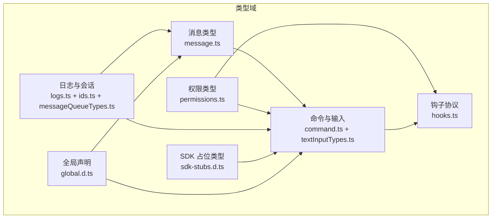
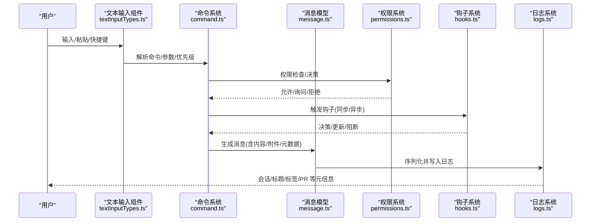
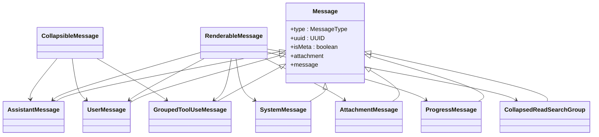
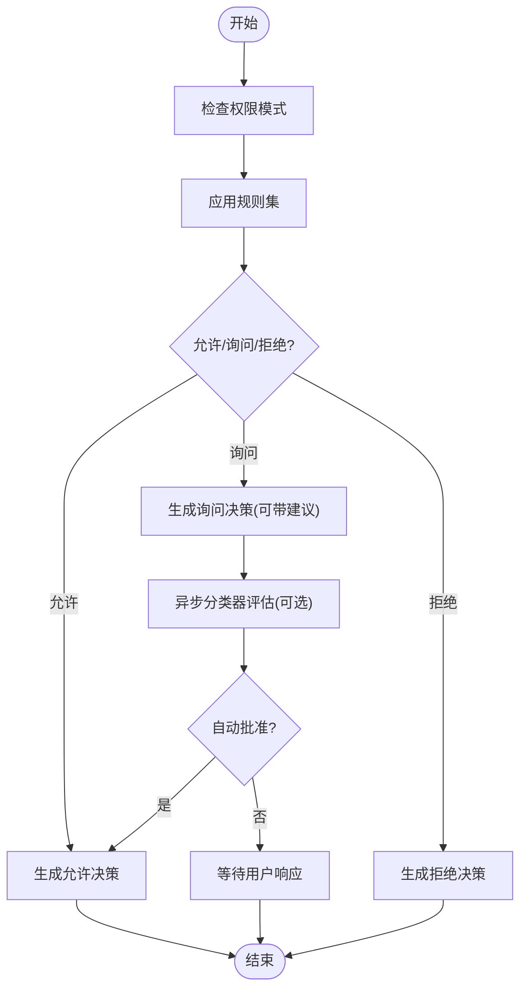
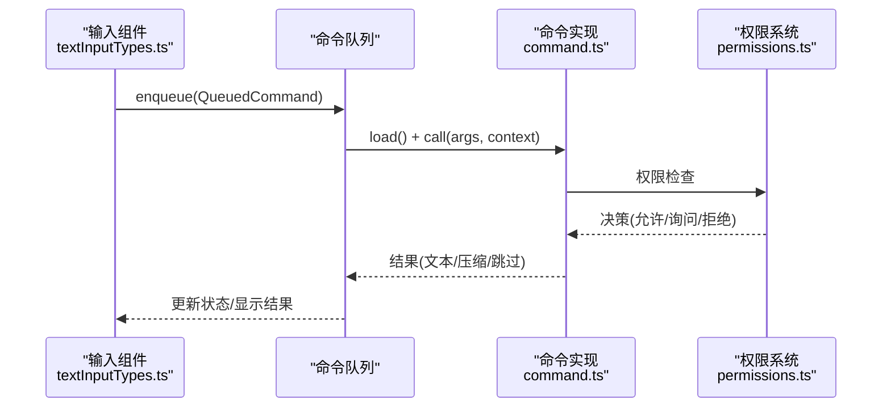
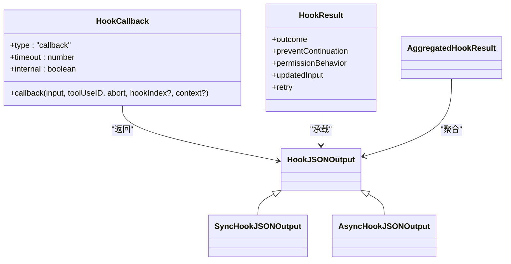
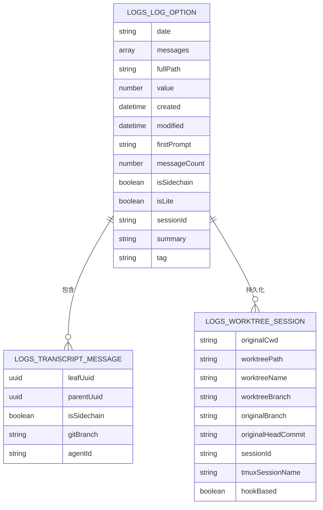
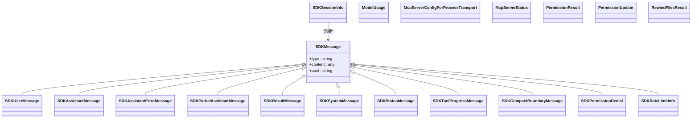
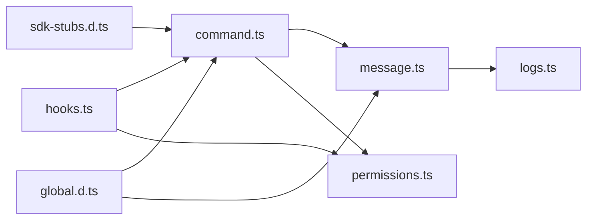

# 类型定义规范

<cite>
**本文引用的文件**
- [global.d.ts](file://src/types/global.d.ts)
- [sdk-stubs.d.ts](file://src/types/sdk-stubs.d.ts)
- [message.ts](file://src/types/message.ts)
- [tools.ts](file://src/types/tools.ts)
- [permissions.ts](file://src/types/permissions.ts)
- [notebook.ts](file://src/types/notebook.ts)
- [statusLine.ts](file://src/types/statusLine.ts)
- [textInputTypes.ts](file://src/types/textInputTypes.ts)
- [command.ts](file://src/types/command.ts)
- [ids.ts](file://src/types/ids.ts)
- [hooks.ts](file://src/types/hooks.ts)
- [utils.ts](file://src/types/utils.ts)
- [logs.ts](file://src/types/logs.ts)
- [messageQueueTypes.ts](file://src/types/messageQueueTypes.ts)
</cite>

## 目录
1. [引言](#引言)
2. [项目结构与类型组织](#项目结构与类型组织)
3. [核心类型总览](#核心类型总览)
4. [架构概览](#架构概览)
5. [详细类型分析](#详细类型分析)
6. [依赖关系分析](#依赖关系分析)
7. [性能与复杂度考量](#性能与复杂度考量)
8. [故障排查与常见问题](#故障排查与常见问题)
9. [结论](#结论)
10. [附录：最佳实践与示例路径](#附录最佳实践与示例路径)

## 引言
本规范面向 Claude Code 的 TypeScript 类型系统，提供完整、可追溯的类型定义参考。内容覆盖消息模型、权限体系、命令与输入、钩子协议、日志与会话标识等核心领域，并给出类型安全最佳实践与常见错误的解决思路。所有说明均基于仓库中的实际类型文件，避免臆测。

## 项目结构与类型组织
- 类型文件按职责分层存放于 src/types 下，采用“领域+功能”命名方式，便于检索与维护。
- 全局宏与环境声明集中在 global.d.ts；SDK 前向兼容占位类型在 sdk-stubs.d.ts 中声明。
- 关键类型族：
  - 消息与渲染：message.ts
  - 权限与决策：permissions.ts
  - 命令与上下文：command.ts、textInputTypes.ts
  - 钩子协议：hooks.ts
  - 日志与会话：logs.ts、ids.ts、messageQueueTypes.ts
  - 工具进度与笔记：tools.ts、notebook.ts
  - UI 输入状态：statusLine.ts
  - 通用工具类型：utils.ts

**图表来源**
- [message.ts:1-168](file://src/types/message.ts#L1-L168)
- [permissions.ts:1-442](file://src/types/permissions.ts#L1-L442)
- [command.ts:1-217](file://src/types/command.ts#L1-L217)
- [textInputTypes.ts:1-388](file://src/types/textInputTypes.ts#L1-L388)
- [hooks.ts:1-290](file://src/types/hooks.ts#L1-L290)
- [logs.ts:1-331](file://src/types/logs.ts#L1-L331)
- [ids.ts:1-45](file://src/types/ids.ts#L1-L45)
- [messageQueueTypes.ts:1-11](file://src/types/messageQueueTypes.ts#L1-L11)
- [sdk-stubs.d.ts:1-118](file://src/types/sdk-stubs.d.ts#L1-L118)
- [global.d.ts:1-82](file://src/types/global.d.ts#L1-L82)

**章节来源**
- [global.d.ts:1-82](file://src/types/global.d.ts#L1-L82)
- [sdk-stubs.d.ts:1-118](file://src/types/sdk-stubs.d.ts#L1-L118)

## 核心类型总览
- 消息模型
  - 基础消息与判别字段、内容类型、可渲染消息集合、折叠组等。
  - 参考：[消息类型定义:19-168](file://src/types/message.ts#L19-L168)
- 权限体系
  - 模式、行为、规则、更新、决策结果、解释器结果、工作目录扩展等。
  - 参考：[权限类型定义:15-442](file://src/types/permissions.ts#L15-L442)
- 命令与输入
  - 命令基类、Prompt/本地/JSX 命令、输入模式与队列优先级、粘贴内容处理等。
  - 参考：[命令类型定义:16-217](file://src/types/command.ts#L16-L217)、[输入类型定义:25-388](file://src/types/textInputTypes.ts#L25-L388)
- 钩子协议
  - 同步/异步响应、回调钩子、阻塞错误、聚合结果等。
  - 参考：[钩子类型定义:22-290](file://src/types/hooks.ts#L22-L290)
- 日志与会话
  - 序列化消息、日志选项、标题/标签/PR 链接、工作树状态、内容替换、归档快照等。
  - 参考：[日志类型定义:8-331](file://src/types/logs.ts#L8-L331)
- 会话与代理标识
  - SessionId/AgentId 品牌类型与转换函数。
  - 参考：[ID 类型定义:6-45](file://src/types/ids.ts#L6-L45)
- SDK 占位类型
  - 使用场景、MCP、权限、重绕、钩子输入输出、SDK 消息、会话信息等。
  - 参考：[SDK 占位类型:12-118](file://src/types/sdk-stubs.d.ts#L12-L118)
- 其他
  - 工具进度、笔记本单元、状态行命令输入、通用工具类型等。
  - 参考：[tools.ts:1-13](file://src/types/tools.ts#L1-L13)、[notebook.ts:1-9](file://src/types/notebook.ts#L1-L9)、[statusLine.ts:1-3](file://src/types/statusLine.ts#L1-L3)、[utils.ts:1-4](file://src/types/utils.ts#L1-L4)

**章节来源**
- [message.ts:19-168](file://src/types/message.ts#L19-L168)
- [permissions.ts:15-442](file://src/types/permissions.ts#L15-L442)
- [command.ts:16-217](file://src/types/command.ts#L16-L217)
- [textInputTypes.ts:25-388](file://src/types/textInputTypes.ts#L25-L388)
- [hooks.ts:22-290](file://src/types/hooks.ts#L22-L290)
- [logs.ts:8-331](file://src/types/logs.ts#L8-L331)
- [ids.ts:6-45](file://src/types/ids.ts#L6-L45)
- [sdk-stubs.d.ts:12-118](file://src/types/sdk-stubs.d.ts#L12-L118)
- [tools.ts:1-13](file://src/types/tools.ts#L1-L13)
- [notebook.ts:1-9](file://src/types/notebook.ts#L1-L9)
- [statusLine.ts:1-3](file://src/types/statusLine.ts#L1-L3)
- [utils.ts:1-4](file://src/types/utils.ts#L1-L4)

## 架构概览
下图展示类型层的关键交互：命令/输入驱动消息生成，消息进入日志与会话管理，权限与钩子贯穿其中以保证安全与可观测性。

**图表来源**
- [textInputTypes.ts:25-388](file://src/types/textInputTypes.ts#L25-L388)
- [command.ts:16-217](file://src/types/command.ts#L16-L217)
- [permissions.ts:15-442](file://src/types/permissions.ts#L15-L442)
- [hooks.ts:22-290](file://src/types/hooks.ts#L22-L290)
- [message.ts:19-168](file://src/types/message.ts#L19-L168)
- [logs.ts:8-331](file://src/types/logs.ts#L8-L331)

## 详细类型分析

### 消息模型与渲染
- 设计要点
  - 使用判别字段 type 组织消息子类型，确保编译期分支安全。
  - 内容支持字符串、内容块数组与类型化数组，提升可读性与类型推断。
  - 提供可折叠/可渲染消息集合，便于 UI 层统一处理。
- 关键类型
  - 基础消息、助手/用户/系统/附件/进度消息、折叠组、渲染集合等。
- 复杂度与性能
  - 判别字段与窄化类型避免运行时分支，渲染层可按需展开。
- 错误与边界
  - 注意附件与内容块的可选字段，避免空值访问。
  - 折叠组包含多种操作统计，序列化时应保持字段一致性。

**图表来源**
- [message.ts:19-168](file://src/types/message.ts#L19-L168)

**章节来源**
- [message.ts:19-168](file://src/types/message.ts#L19-L168)

### 权限系统与决策
- 设计要点
  - 模式枚举与行为三态（允许/拒绝/询问），规则来源与更新目标解耦。
  - 决策结果支持异步分类器评估与建议更新，增强自动化与可解释性。
- 关键类型
  - 模式、行为、规则、更新、命令元数据、决策结果、解释器结果、工作目录扩展等。
- 复杂度与性能
  - 规则按来源分桶存储，查询时按源过滤，时间复杂度与规则数量线性相关。
- 错误与边界
  - 分类器可能因提示过长而失败，需回退到常规提示策略。

**图表来源**
- [permissions.ts:15-442](file://src/types/permissions.ts#L15-L442)

**章节来源**
- [permissions.ts:15-442](file://src/types/permissions.ts#L15-L442)

### 命令与输入处理
- 设计要点
  - 命令分为 Prompt/本地/JSX 三类，支持延迟加载与上下文注入。
  - 输入模式区分 bash/prompt/孤儿权限通知等，队列优先级控制执行时机。
  - 粘贴内容支持图片与大文本，提供校验与 ID 提取工具函数。
- 关键类型
  - 命令基类、本地/JSX 命令模块、输入状态、队列命令、粘贴内容等。
- 复杂度与性能
  - 延迟加载减少首屏开销；粘贴内容过滤在入队前完成，避免无效请求。
- 错误与边界
  - 图片粘贴为空时需过滤，防止 API 拒绝；桥接来源需跳过斜杠命令以避免本地冲突。

**图表来源**
- [textInputTypes.ts:25-388](file://src/types/textInputTypes.ts#L25-L388)
- [command.ts:16-217](file://src/types/command.ts#L16-L217)
- [permissions.ts:15-442](file://src/types/permissions.ts#L15-L442)

**章节来源**
- [command.ts:16-217](file://src/types/command.ts#L16-L217)
- [textInputTypes.ts:25-388](file://src/types/textInputTypes.ts#L25-L388)

### 钩子协议与回调
- 设计要点
  - 支持同步与异步两种响应，回调钩子可携带超时与内部标记。
  - 聚合结果包含消息、阻止错误、权限行为、更新输入/输出等。
- 关键类型
  - 响应模式、回调钩子、进度消息、阻塞错误、聚合结果等。
- 复杂度与性能
  - 异步钩子通过超时控制避免阻塞；同步钩子快速返回，降低延迟。
- 错误与边界
  - 阻断错误与非阻断错误区分，确保流程可控。

**图表来源**
- [hooks.ts:22-290](file://src/types/hooks.ts#L22-L290)

**章节来源**
- [hooks.ts:22-290](file://src/types/hooks.ts#L22-L290)

### 日志与会话标识
- 设计要点
  - 序列化消息包含会话、时间戳、入口点、版本、Git 分支等元信息。
  - 日志选项支持轻量/完整两种形态，侧链/代理等多维元数据。
  - 会话标识使用品牌类型，避免混用。
- 关键类型
  - 序列化消息、日志选项、标题/标签/PR 链接、工作树状态、内容替换、归档快照等。
  - SessionId/AgentId 品牌类型与转换函数。
- 复杂度与性能
  - 轻量日志不加载消息体，节省内存；完整日志用于恢复与分析。
- 错误与边界
  - 归档提交仅持久边界与摘要占位，恢复时惰性填充归档内容。

**图表来源**
- [logs.ts:8-331](file://src/types/logs.ts#L8-L331)
- [ids.ts:6-45](file://src/types/ids.ts#L6-L45)

**章节来源**
- [logs.ts:8-331](file://src/types/logs.ts#L8-L331)
- [ids.ts:6-45](file://src/types/ids.ts#L6-L45)

### SDK 类型与外部集成
- 设计要点
  - SDK 占位类型覆盖使用量、MCP、权限、重绕、钩子输入输出、SDK 消息、会话信息等。
  - 通过 any 保持导入结构有效，同时抑制 TS 错误，便于开源发布。
- 关键类型
  - 使用量、MCP 服务器配置/状态、权限模式/结果/更新、重绕结果、钩子输入/输出、SDK 消息、会话信息等。
- 复杂度与性能
  - 占位类型不引入运行时成本，仅在编译期提供类型信息。
- 错误与边界
  - 当上游源未发布时，使用 any 作为过渡；后续替换为真实类型。

**图表来源**
- [sdk-stubs.d.ts:12-118](file://src/types/sdk-stubs.d.ts#L12-L118)

**章节来源**
- [sdk-stubs.d.ts:12-118](file://src/types/sdk-stubs.d.ts#L12-L118)

### 工具进度、笔记本与状态行
- 工具进度类型族：Bash/REPL/MCP/Shell/PowerShell/WebSearch/Skill/TaskOutput 等，用于描述不同工具的执行进度。
- 笔记本类型族：单元格、内容、输出、图像等，当前为占位类型。
- 状态行命令输入：占位类型，后续补充具体结构。
- 通用工具类型：DeepImmutable、Permutations 等，当前为占位类型。

**章节来源**
- [tools.ts:1-13](file://src/types/tools.ts#L1-L13)
- [notebook.ts:1-9](file://src/types/notebook.ts#L1-L9)
- [statusLine.ts:1-3](file://src/types/statusLine.ts#L1-L3)
- [utils.ts:1-4](file://src/types/utils.ts#L1-L4)

## 依赖关系分析
- 模块内聚与耦合
  - 消息与日志紧密耦合，日志选项包含序列化消息；命令与权限双向依赖（命令触发权限检查，权限影响命令执行）。
  - 钩子系统与命令/权限协作，形成可观测与可控的执行闭环。
- 外部依赖
  - SDK 占位类型依赖 @anthropic-ai/sdk 的资源类型，确保与上游 SDK 的内容块结构一致。
- 循环依赖规避
  - 权限类型独立于实现，通过纯类型文件避免循环导入。

**图表来源**
- [message.ts:19-168](file://src/types/message.ts#L19-L168)
- [logs.ts:8-331](file://src/types/logs.ts#L8-L331)
- [command.ts:16-217](file://src/types/command.ts#L16-L217)
- [permissions.ts:15-442](file://src/types/permissions.ts#L15-L442)
- [hooks.ts:22-290](file://src/types/hooks.ts#L22-L290)
- [sdk-stubs.d.ts:12-118](file://src/types/sdk-stubs.d.ts#L12-L118)
- [global.d.ts:1-82](file://src/types/global.d.ts#L1-L82)

**章节来源**
- [message.ts:19-168](file://src/types/message.ts#L19-L168)
- [logs.ts:8-331](file://src/types/logs.ts#L8-L331)
- [command.ts:16-217](file://src/types/command.ts#L16-L217)
- [permissions.ts:15-442](file://src/types/permissions.ts#L15-L442)
- [hooks.ts:22-290](file://src/types/hooks.ts#L22-L290)
- [sdk-stubs.d.ts:12-118](file://src/types/sdk-stubs.d.ts#L12-L118)
- [global.d.ts:1-82](file://src/types/global.d.ts#L1-L82)

## 性能与复杂度考量
- 类型层面
  - 判别字段与窄化类型减少运行时分支，提升渲染与处理效率。
  - 延迟加载命令模块降低首屏负载。
- 数据结构
  - 规则按来源分桶存储，查询按源过滤，时间复杂度与规则数量线性相关。
  - 日志选项支持轻量/完整两种形态，按需加载消息体。
- 运行时
  - 钩子异步响应通过超时控制，避免阻塞主流程；同步钩子快速返回。

[本节为通用指导，无需特定文件来源]

## 故障排查与常见问题
- 类型不匹配
  - 症状：SDK 占位类型与实际 SDK 类型不一致导致编译错误。
  - 处理：将占位类型替换为真实类型；若上游尚未发布，保留占位并补充必要字段。
  - 参考：[sdk-stubs.d.ts:12-118](file://src/types/sdk-stubs.d.ts#L12-L118)
- 权限决策异常
  - 症状：分类器提示过长或不可用，导致阻断。
  - 处理：回退到常规提示策略；检查分类器阶段与用量统计。
  - 参考：[permissions.ts:330-397](file://src/types/permissions.ts#L330-L397)
- 消息内容为空
  - 症状：附件或内容块为空导致 API 拒绝。
  - 处理：在入队前过滤空内容；使用工具函数提取有效图片 ID。
  - 参考：[textInputTypes.ts:367-382](file://src/types/textInputTypes.ts#L367-L382)、[message.ts:40-48](file://src/types/message.ts#L40-L48)
- 钩子阻断
  - 症状：异步钩子超时或同步钩子返回阻止。
  - 处理：调整超时；检查钩子回调上下文与权限行为。
  - 参考：[hooks.ts:169-290](file://src/types/hooks.ts#L169-L290)
- 日志恢复不完整
  - 症状：归档提交仅持久边界与摘要占位，恢复时需惰性填充。
  - 处理：遵循归档/快照规则，确保边界 UUID 与摘要一致。
  - 参考：[logs.ts:255-295](file://src/types/logs.ts#L255-L295)

**章节来源**
- [sdk-stubs.d.ts:12-118](file://src/types/sdk-stubs.d.ts#L12-L118)
- [permissions.ts:330-397](file://src/types/permissions.ts#L330-L397)
- [textInputTypes.ts:367-382](file://src/types/textInputTypes.ts#L367-L382)
- [message.ts:40-48](file://src/types/message.ts#L40-L48)
- [hooks.ts:169-290](file://src/types/hooks.ts#L169-L290)
- [logs.ts:255-295](file://src/types/logs.ts#L255-L295)

## 结论
本规范梳理了 Claude Code 的核心类型域，明确了消息、权限、命令、钩子、日志与会话标识等关键类型的设计与交互。通过判别字段、品牌类型、延迟加载与异步钩子等手段，在保证类型安全的同时兼顾性能与可维护性。建议在后续迭代中逐步替换 SDK 占位类型为真实类型，并完善工具与笔记本类型族，以进一步提升类型系统的完整性与可用性。

[本节为总结性内容，无需特定文件来源]

## 附录：最佳实践与示例路径
- 类型安全最佳实践
  - 使用判别字段与窄化类型，避免运行时分支。
  - 品牌类型隔离 SessionId/AgentId，防止混用。
  - 延迟加载重型模块，减少首屏负担。
  - 异步钩子设置合理超时，避免阻塞主流程。
- 常见类型错误与修复
  - SDK 占位类型：替换为真实类型或补充必要字段。
  - 权限决策：处理分类器不可用与提示过长场景。
  - 消息内容：过滤空内容，使用工具函数提取有效 ID。
  - 钩子阻断：调整超时与回调上下文，明确权限行为。
  - 日志恢复：遵循归档/快照规则，确保边界与摘要一致。
- 示例路径（不含代码内容）
  - [消息类型定义:19-168](file://src/types/message.ts#L19-L168)
  - [权限类型定义:15-442](file://src/types/permissions.ts#L15-L442)
  - [命令类型定义:16-217](file://src/types/command.ts#L16-L217)
  - [输入类型定义:25-388](file://src/types/textInputTypes.ts#L25-L388)
  - [钩子类型定义:22-290](file://src/types/hooks.ts#L22-L290)
  - [日志类型定义:8-331](file://src/types/logs.ts#L8-L331)
  - [ID 类型定义:6-45](file://src/types/ids.ts#L6-L45)
  - [SDK 占位类型:12-118](file://src/types/sdk-stubs.d.ts#L12-L118)

**章节来源**
- [message.ts:19-168](file://src/types/message.ts#L19-L168)
- [permissions.ts:15-442](file://src/types/permissions.ts#L15-L442)
- [command.ts:16-217](file://src/types/command.ts#L16-L217)
- [textInputTypes.ts:25-388](file://src/types/textInputTypes.ts#L25-L388)
- [hooks.ts:22-290](file://src/types/hooks.ts#L22-L290)
- [logs.ts:8-331](file://src/types/logs.ts#L8-L331)
- [ids.ts:6-45](file://src/types/ids.ts#L6-L45)
- [sdk-stubs.d.ts:12-118](file://src/types/sdk-stubs.d.ts#L12-L118)