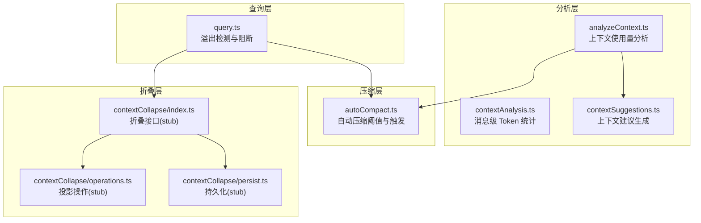
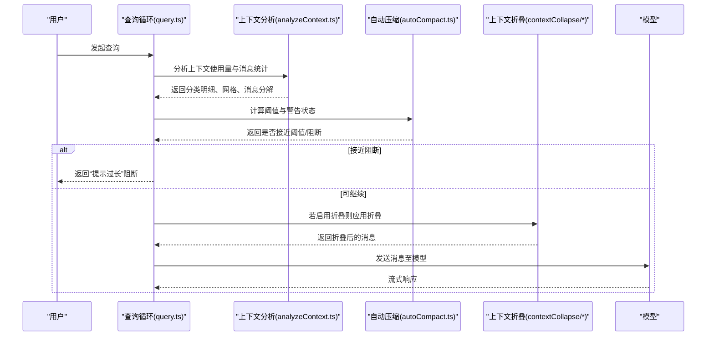
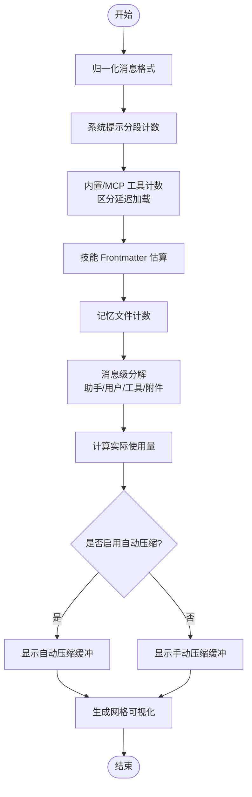
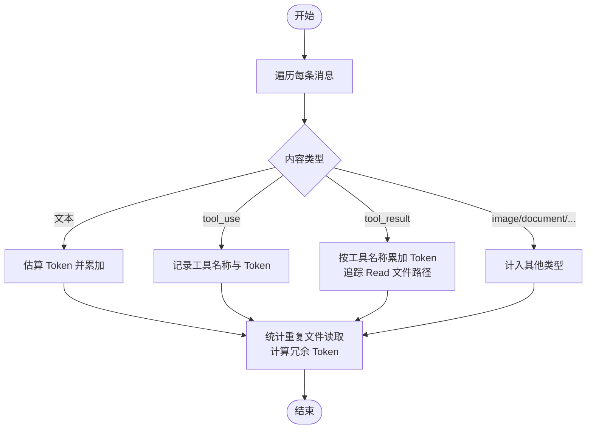
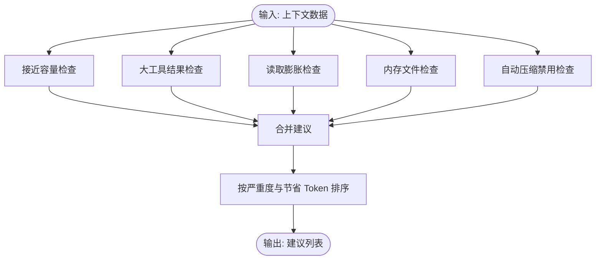
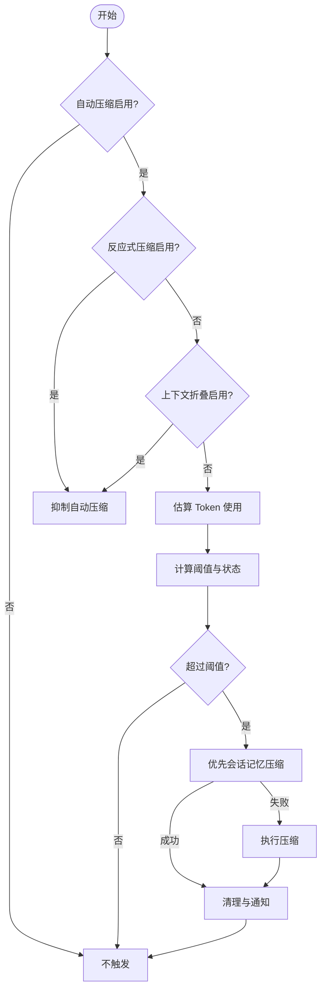
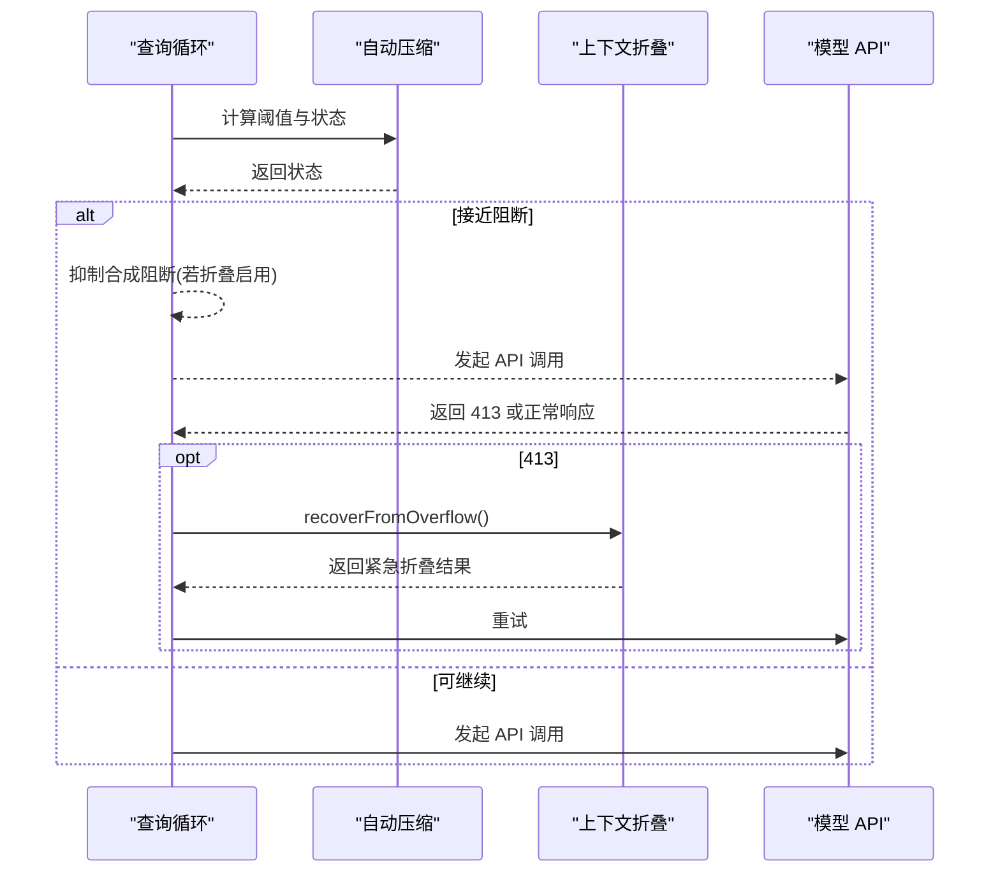
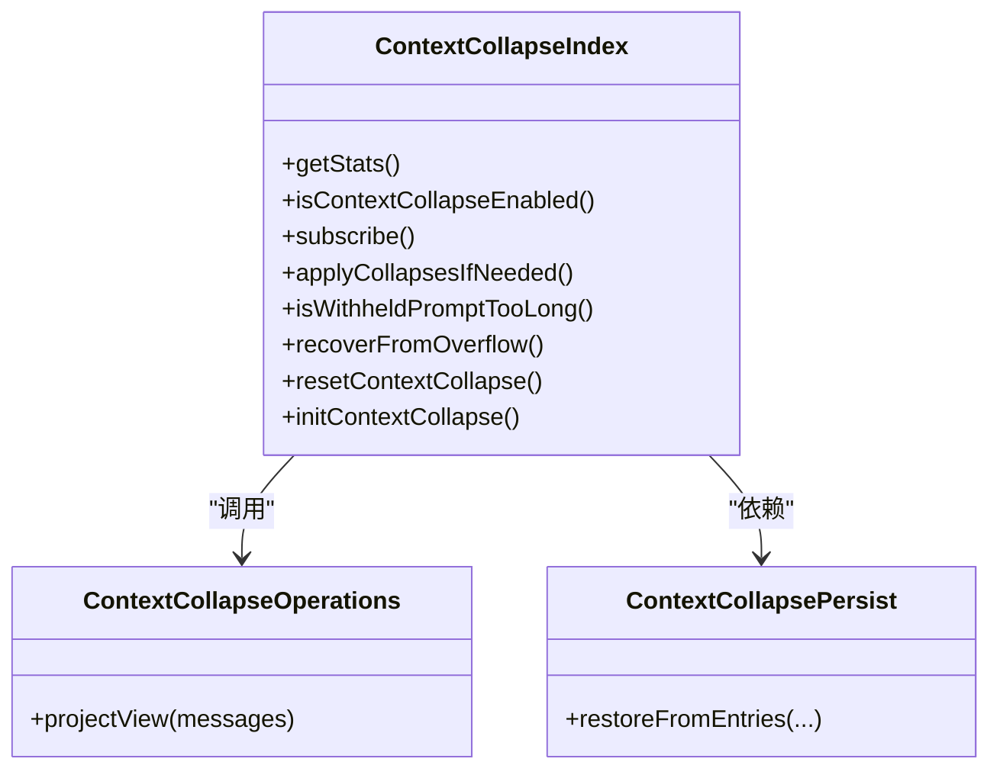
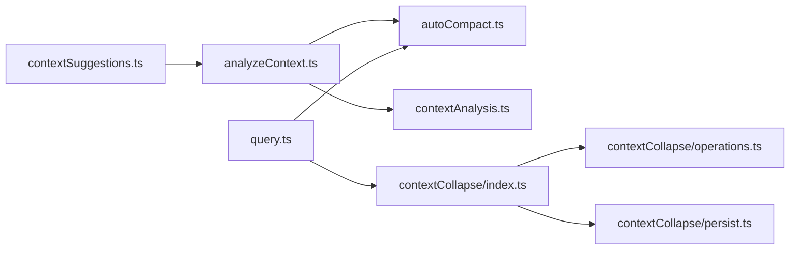

# 上下文分析引擎

<cite>
**本文档引用的文件**
- [src/utils/analyzeContext.ts](file://src/utils/analyzeContext.ts)
- [src/utils/contextAnalysis.ts](file://src/utils/contextAnalysis.ts)
- [src/utils/contextSuggestions.ts](file://src/utils/contextSuggestions.ts)
- [src/services/compact/autoCompact.ts](file://src/services/compact/autoCompact.ts)
- [src/query.ts](file://src/query.ts)
- [src/services/contextCollapse/index.ts](file://src/services/contextCollapse/index.ts)
- [src/services/contextCollapse/operations.ts](file://src/services/contextCollapse/operations.ts)
- [src/services/contextCollapse/persist.ts](file://src/services/contextCollapse/persist.ts)
- [src/utils/context.ts](file://src/utils/context.ts)
- [docs/features/context-collapse.md](file://docs/features/context-collapse.md)
</cite>

## 目录
1. [简介](#简介)
2. [项目结构](#项目结构)
3. [核心组件](#核心组件)
4. [架构总览](#架构总览)
5. [详细组件分析](#详细组件分析)
6. [依赖关系分析](#依赖关系分析)
7. [性能考量](#性能考量)
8. [故障排查指南](#故障排查指南)
9. [结论](#结论)
10. [附录](#附录)

## 简介
本文件系统性阐述 Claude Code Best 的“上下文分析引擎”，聚焦以下目标：
- 解释上下文分析的核心算法：内容重要性评估、冗余信息检测、上下文质量评分
- 描述数据预处理、特征提取与统计计算方法
- 说明上下文折叠机制的实现原理：内容聚合、去重处理与结构化表示
- 解释分析结果的应用场景：自动压缩决策、性能优化与用户体验提升
- 提供分析配置参数的详细说明：权重设置、阈值调整与算法选择
- 给出具体分析示例与调试方法，帮助开发者理解并优化分析效果

## 项目结构
上下文分析引擎由多模块协同构成：
- 分析与统计：上下文使用量分析、消息级统计、建议生成
- 自动压缩：阈值计算、触发条件、失败熔断
- 查询集成：溢出检测、阻断策略、与折叠的协作
- 折叠子系统：占位接口与布线（当前为 stub）

**图表来源**
- [src/utils/analyzeContext.ts:921-1386](file://src/utils/analyzeContext.ts#L921-L1386)
- [src/utils/contextAnalysis.ts:27-97](file://src/utils/contextAnalysis.ts#L27-L97)
- [src/utils/contextSuggestions.ts:31-51](file://src/utils/contextSuggestions.ts#L31-L51)
- [src/services/compact/autoCompact.ts:93-145](file://src/services/compact/autoCompact.ts#L93-L145)
- [src/query.ts:608-648](file://src/query.ts#L608-L648)
- [src/services/contextCollapse/index.ts:1-67](file://src/services/contextCollapse/index.ts#L1-L67)
- [src/services/contextCollapse/operations.ts:1-5](file://src/services/contextCollapse/operations.ts#L1-L5)
- [src/services/contextCollapse/persist.ts:1-4](file://src/services/contextCollapse/persist.ts#L1-L4)

**章节来源**
- [src/utils/analyzeContext.ts:921-1386](file://src/utils/analyzeContext.ts#L921-L1386)
- [src/utils/contextAnalysis.ts:27-97](file://src/utils/contextAnalysis.ts#L27-L97)
- [src/utils/contextSuggestions.ts:31-51](file://src/utils/contextSuggestions.ts#L31-L51)
- [src/services/compact/autoCompact.ts:93-145](file://src/services/compact/autoCompact.ts#L93-L145)
- [src/query.ts:608-648](file://src/query.ts#L608-L648)
- [src/services/contextCollapse/index.ts:1-67](file://src/services/contextCollapse/index.ts#L1-L67)
- [src/services/contextCollapse/operations.ts:1-5](file://src/services/contextCollapse/operations.ts#L1-L5)
- [src/services/contextCollapse/persist.ts:1-4](file://src/services/contextCollapse/persist.ts#L1-L4)

## 核心组件
- 上下文使用量分析（analyzeContext.ts）
  - 聚合系统提示、内置工具、MCP 工具、自定义代理、记忆文件、技能、消息等各部分 Token 使用
  - 输出分类明细、网格可视化、消息级细粒度分解（工具调用/结果、附件类型）
- 消息级 Token 统计（contextAnalysis.ts）
  - 对消息内容进行 Token 估算与归类，识别重复读取（如文件多次读取）并计算冗余 Token
- 上下文建议生成（contextSuggestions.ts）
  - 基于阈值与占比生成建议，覆盖“接近容量”“大工具结果”“读取膨胀”“内存文件”“自动压缩禁用”等场景
- 自动压缩（autoCompact.ts）
  - 计算有效上下文窗口、阈值与警告/错误/阻断边界；带熔断保护；与折叠特性门控互斥
- 查询集成（query.ts）
  - 在 API 调用前进行溢出检测与阻断；在启用折叠时抑制合成阻断以让折叠/反应式压缩接管
- 折叠子系统（contextCollapse/*）
  - 当前为占位接口与布线，预留“后台 LLM 压缩”“413 恢复”“与自动压缩协作”“持久化”等能力

**章节来源**
- [src/utils/analyzeContext.ts:921-1386](file://src/utils/analyzeContext.ts#L921-L1386)
- [src/utils/contextAnalysis.ts:27-97](file://src/utils/contextAnalysis.ts#L27-L97)
- [src/utils/contextSuggestions.ts:31-51](file://src/utils/contextSuggestions.ts#L31-L51)
- [src/services/compact/autoCompact.ts:93-145](file://src/services/compact/autoCompact.ts#L93-L145)
- [src/query.ts:608-648](file://src/query.ts#L608-L648)
- [src/services/contextCollapse/index.ts:1-67](file://src/services/contextCollapse/index.ts#L1-L67)

## 架构总览
上下文分析引擎贯穿“分析—建议—压缩—查询—折叠”的闭环：
- 分析层产出结构化上下文使用报告与消息级统计
- 建议层基于阈值给出优化建议
- 压缩层在接近阈值时触发自动压缩，必要时熔断
- 查询层在 API 调用前进行溢出检测与阻断，协调折叠与反应式压缩
- 折叠层作为特性开关下的备用/补充机制，负责消息级压缩与持久化

**图表来源**
- [src/query.ts:608-648](file://src/query.ts#L608-L648)
- [src/utils/analyzeContext.ts:921-1386](file://src/utils/analyzeContext.ts#L921-L1386)
- [src/services/compact/autoCompact.ts:93-145](file://src/services/compact/autoCompact.ts#L93-L145)
- [src/services/contextCollapse/index.ts:47-62](file://src/services/contextCollapse/index.ts#L47-L62)

## 详细组件分析

### 上下文使用量分析（analyzeContext.ts）
- 数据预处理
  - 归一化消息格式，剥离冗余字段，确保计数 API 正常工作
  - 对系统提示分段计数，支持动态边界与系统上下文注入
  - 记忆文件（CLAUDE.md）按条目独立计数并汇总
- 特征提取
  - 内置工具与 MCP 工具分别计数，支持延迟加载工具的区分展示
  - 技能 Frontmatter 令牌估算，避免与工具 Schema 重复计数
  - 消息级分解：助手消息、用户消息、工具调用、工具结果、附件类型
- 统计计算
  - 实际使用量 = 所有非延迟类别的总和
  - 预留缓冲：根据是否启用自动压缩或手动压缩决定显示的缓冲类别
  - 网格可视化：按模型上下文窗口与终端宽度映射为方格矩阵，直观展示占用与空闲
- 结果输出
  - 分类明细、总 Token、百分比、网格行、消息分解、API 使用统计

**图表来源**
- [src/utils/analyzeContext.ts:921-1386](file://src/utils/analyzeContext.ts#L921-L1386)

**章节来源**
- [src/utils/analyzeContext.ts:921-1386](file://src/utils/analyzeContext.ts#L921-L1386)

### 消息级 Token 统计（contextAnalysis.ts）
- 数据预处理
  - 支持字符串与多内容块消息；对附件单独计数
- 特征提取
  - 识别本地命令输出、工具调用与结果、图像/文档等类型
  - 统计重复文件读取（按路径聚合），计算平均每次读取 Token 与冗余总量
- 统计计算
  - 总 Token、人类消息、助手消息、本地命令输出、其他类型
  - 生成冗余读取统计（数量与冗余 Token）
- 指标导出
  - 转换为 Metrics 字典，包含各类百分比与冗余占比

**图表来源**
- [src/utils/contextAnalysis.ts:99-189](file://src/utils/contextAnalysis.ts#L99-L189)

**章节来源**
- [src/utils/contextAnalysis.ts:27-97](file://src/utils/contextAnalysis.ts#L27-L97)
- [src/utils/contextAnalysis.ts:99-189](file://src/utils/contextAnalysis.ts#L99-L189)

### 上下文建议生成（contextSuggestions.ts）
- 阈值与权重
  - 大工具结果占比阈值、绝对 Token 阈值
  - 读取结果占比阈值
  - 接近容量阈值、内存文件占比与绝对阈值
- 建议生成
  - 接近容量：提示即将触发自动压缩或建议手动压缩
  - 大工具结果：针对 Bash、Read、Grep、WebFetch 等工具给出优化建议与预计节省 Token
  - 读取膨胀：对重复读取给出优化建议
  - 内存文件：列出最大文件并建议清理
  - 自动压缩禁用：提醒开启自动压缩以避免阻断
- 排序规则
  - 严重程度优先（warning > info），其次按预计节省 Token 降序

**图表来源**
- [src/utils/contextSuggestions.ts:31-51](file://src/utils/contextSuggestions.ts#L31-L51)

**章节来源**
- [src/utils/contextSuggestions.ts:31-51](file://src/utils/contextSuggestions.ts#L31-L51)
- [src/utils/contextSuggestions.ts:55-149](file://src/utils/contextSuggestions.ts#L55-L149)
- [src/utils/contextSuggestions.ts:151-185](file://src/utils/contextSuggestions.ts#L151-L185)
- [src/utils/contextSuggestions.ts:187-217](file://src/utils/contextSuggestions.ts#L187-L217)
- [src/utils/contextSuggestions.ts:219-235](file://src/utils/contextSuggestions.ts#L219-L235)

### 自动压缩（autoCompact.ts）
- 上下文窗口与阈值
  - 有效上下文窗口 = 模型上下文窗口 - 最大输出预留
  - 自动压缩阈值 = 有效窗口 - 自动压缩缓冲
  - 警告/错误/阻断阈值在阈值基础上进一步扣除缓冲
- 触发条件
  - 用户启用且未禁用自动压缩
  - 反应式压缩特性关闭（避免与反应式压缩冲突）
  - 折叠特性关闭（折叠拥有阈值阶梯，抑制自动压缩）
- 熔断保护
  - 连续失败次数达到上限则跳过后续尝试，防止无效 API 调用
- 与查询集成
  - 查询循环在阻断条件下返回“提示过长”错误；否则继续

**图表来源**
- [src/services/compact/autoCompact.ts:160-239](file://src/services/compact/autoCompact.ts#L160-L239)
- [src/services/compact/autoCompact.ts:241-351](file://src/services/compact/autoCompact.ts#L241-L351)

**章节来源**
- [src/services/compact/autoCompact.ts:93-145](file://src/services/compact/autoCompact.ts#L93-L145)
- [src/services/compact/autoCompact.ts:160-239](file://src/services/compact/autoCompact.ts#L160-L239)
- [src/services/compact/autoCompact.ts:241-351](file://src/services/compact/autoCompact.ts#L241-L351)

### 查询集成（query.ts）
- 溢出检测与阻断
  - 在 API 调用前根据阈值判断是否达到阻断上限，若达到则返回“提示过长”错误
- 与折叠协作
  - 当启用上下文折叠且自动压缩也启用时，抑制合成阻断，让折叠/反应式压缩接管
- 与反应式压缩协作
  - hoist 媒体恢复门，保证回收前后一致

**图表来源**
- [src/query.ts:608-648](file://src/query.ts#L608-L648)
- [src/services/contextCollapse/index.ts:59-62](file://src/services/contextCollapse/index.ts#L59-L62)

**章节来源**
- [src/query.ts:608-648](file://src/query.ts#L608-L648)
- [src/services/contextCollapse/index.ts:47-62](file://src/services/contextCollapse/index.ts#L47-L62)

### 折叠子系统（contextCollapse/*）
- 接口与职责
  - 折叠核心：状态统计、启用判断、应用折叠、溢出恢复、初始化与订阅
  - 折叠操作：消息投影（如 projectView）
  - 折叠持久化：状态恢复
- 当前状态
  - 全部为占位 stub，接口完备但逻辑为空；布线已就绪，等待实现
- 关键设计
  - 后台 LLM 压缩：以摘要替代旧消息，保留关键信息
  - 413 恢复：API 返回 413 时紧急折叠
  - 与自动压缩协作：折叠在消息级别，压缩在对话级别
  - 持久化：折叠状态持久化，会话恢复时重载

**图表来源**
- [src/services/contextCollapse/index.ts:1-67](file://src/services/contextCollapse/index.ts#L1-L67)
- [src/services/contextCollapse/operations.ts:1-5](file://src/services/contextCollapse/operations.ts#L1-L5)
- [src/services/contextCollapse/persist.ts:1-4](file://src/services/contextCollapse/persist.ts#L1-L4)

**章节来源**
- [src/services/contextCollapse/index.ts:1-67](file://src/services/contextCollapse/index.ts#L1-L67)
- [src/services/contextCollapse/operations.ts:1-5](file://src/services/contextCollapse/operations.ts#L1-L5)
- [src/services/contextCollapse/persist.ts:1-4](file://src/services/contextCollapse/persist.ts#L1-L4)
- [docs/features/context-collapse.md:1-141](file://docs/features/context-collapse.md#L1-L141)

## 依赖关系分析
- analyzeContext.ts 依赖
  - 自动压缩阈值与缓冲常量
  - 工具定义计数、系统提示构建、记忆文件加载、技能 Frontmatter 估算
  - 消息微压缩（microcompact）用于更准确的消息统计
- contextAnalysis.ts 与 contextSuggestions.ts
  - 前者提供 Token 统计与冗余读取指标，后者据此生成建议
- autoCompact.ts
  - 与 query.ts 协同：在阻断条件下返回错误；在折叠启用时抑制合成阻断
- contextCollapse/*
  - 与 query.ts 布线：溢出检测、413 恢复、折叠应用
  - 与 autoCompact.ts 互斥：折叠启用时抑制自动压缩

**图表来源**
- [src/utils/analyzeContext.ts:921-1386](file://src/utils/analyzeContext.ts#L921-L1386)
- [src/utils/contextAnalysis.ts:27-97](file://src/utils/contextAnalysis.ts#L27-L97)
- [src/utils/contextSuggestions.ts:31-51](file://src/utils/contextSuggestions.ts#L31-L51)
- [src/services/compact/autoCompact.ts:93-145](file://src/services/compact/autoCompact.ts#L93-L145)
- [src/query.ts:608-648](file://src/query.ts#L608-L648)
- [src/services/contextCollapse/index.ts:47-62](file://src/services/contextCollapse/index.ts#L47-L62)

**章节来源**
- [src/utils/analyzeContext.ts:921-1386](file://src/utils/analyzeContext.ts#L921-L1386)
- [src/utils/contextAnalysis.ts:27-97](file://src/utils/contextAnalysis.ts#L27-L97)
- [src/utils/contextSuggestions.ts:31-51](file://src/utils/contextSuggestions.ts#L31-L51)
- [src/services/compact/autoCompact.ts:93-145](file://src/services/compact/autoCompact.ts#L93-L145)
- [src/query.ts:608-648](file://src/query.ts#L608-L648)
- [src/services/contextCollapse/index.ts:47-62](file://src/services/contextCollapse/index.ts#L47-L62)

## 性能考量
- 计数 API 降级链路
  - 主路径：专用计数 API；失败时回退到 Haiku 计数；仍失败则返回 null
- 并行计数
  - 系统提示分段、记忆文件、工具定义、代理定义等均采用 Promise.all 并行计数，显著降低总耗时
- 估算与精确计数结合
  - 消息级分解使用快速估算，最终总 Token 通过 API 精确计数，兼顾速度与准确性
- 熔断保护
  - 自动压缩连续失败达到上限后熔断，避免无效 API 调用与资源浪费

[本节为通用指导，无需特定文件来源]

## 故障排查指南
- “提示过长”阻断
  - 现象：查询返回 invalid_request 错误，提示过长
  - 排查：确认是否接近阻断阈值；检查自动压缩是否启用；查看折叠是否在运行
  - 处理：启用自动压缩或手动压缩；减少大工具结果；使用建议优化
- 自动压缩无效
  - 现象：接近阈值但未触发压缩
  - 排查：确认自动压缩开关；检查反应式压缩特性；确认折叠特性是否启用
  - 处理：关闭折叠或反应式压缩；调整环境变量阈值
- 折叠未生效
  - 现象：上下文接近限制但未折叠
  - 排查：确认 FEATURE_CONTEXT_COLLAPSE 是否启用；检查 applyCollapsesIfNeeded 是否被调用
  - 处理：实现折叠核心逻辑；确保 recoverFromOverflow 在 413 时被调用
- 建议不准确
  - 现象：建议与实际不符
  - 排查：检查阈值配置；确认消息分解是否正确；核对冗余读取统计
  - 处理：调整阈值；优化工具使用；减少重复读取

**章节来源**
- [src/services/compact/autoCompact.ts:257-351](file://src/services/compact/autoCompact.ts#L257-L351)
- [src/query.ts:608-648](file://src/query.ts#L608-L648)
- [src/utils/contextSuggestions.ts:31-51](file://src/utils/contextSuggestions.ts#L31-L51)

## 结论
上下文分析引擎通过“结构化统计 + 智能建议 + 自动压缩 + 查询阻断 + 折叠协同”的闭环，实现了对上下文使用的精细化管理。当前分析与建议模块已完成，自动压缩与查询集成已就绪，折叠子系统处于占位阶段。建议优先完善折叠核心与操作模块，以实现从消息级到对话级的全面上下文治理。

[本节为总结，无需特定文件来源]

## 附录

### 分析配置参数说明
- 自动压缩阈值与缓冲
  - 自动压缩阈值 = 有效上下文窗口 - 自动压缩缓冲
  - 警告/错误/阻断阈值在阈值基础上进一步扣除缓冲
  - 环境变量可覆盖自动压缩百分比与阻断阈值
- 上下文窗口
  - 依据模型能力与特性（如 1M 上下文实验）动态确定
- 建议阈值
  - 大工具结果占比阈值、绝对 Token 阈值
  - 读取结果占比阈值
  - 接近容量阈值、内存文件占比与绝对阈值

**章节来源**
- [src/services/compact/autoCompact.ts:32-91](file://src/services/compact/autoCompact.ts#L32-L91)
- [src/services/compact/autoCompact.ts:93-145](file://src/services/compact/autoCompact.ts#L93-L145)
- [src/utils/context.ts:70-99](file://src/utils/context.ts#L70-L99)
- [src/utils/contextSuggestions.ts:21-28](file://src/utils/contextSuggestions.ts#L21-L28)

### 典型分析示例
- 示例 1：系统提示 + 内置工具 + MCP 工具 + 记忆文件 + 技能 + 消息
  - 步骤：归一化消息 → 分段计数系统提示 → 计数工具与技能 → 计数记忆文件 → 消息级分解 → 计算实际使用量与预留缓冲 → 生成网格与建议
  - 结果：分类明细、网格可视化、消息分解、建议列表
- 示例 2：重复文件读取
  - 步骤：识别 Read 工具调用与结果 → 按路径聚合 → 计算平均每次读取 Token 与冗余总量
  - 结果：冗余读取统计（数量与冗余 Token）

**章节来源**
- [src/utils/analyzeContext.ts:921-1386](file://src/utils/analyzeContext.ts#L921-L1386)
- [src/utils/contextAnalysis.ts:83-94](file://src/utils/contextAnalysis.ts#L83-L94)

### 调试方法
- 日志与调试
  - 使用调试日志输出 Token 使用与阈值计算细节
  - 在自动压缩失败时记录连续失败次数与熔断行为
- 建议验证
  - 对比建议与实际占比，调整阈值
  - 检查消息分解是否正确，尤其是工具调用与结果的匹配
- 折叠验证
  - 在启用折叠时观察 recoverFromOverflow 是否被调用
  - 确认 projectView 是否正确过滤折叠后的消息视图

**章节来源**
- [src/services/compact/autoCompact.ts:257-351](file://src/services/compact/autoCompact.ts#L257-L351)
- [src/query.ts:608-648](file://src/query.ts#L608-L648)
- [src/services/contextCollapse/index.ts:59-62](file://src/services/contextCollapse/index.ts#L59-L62)