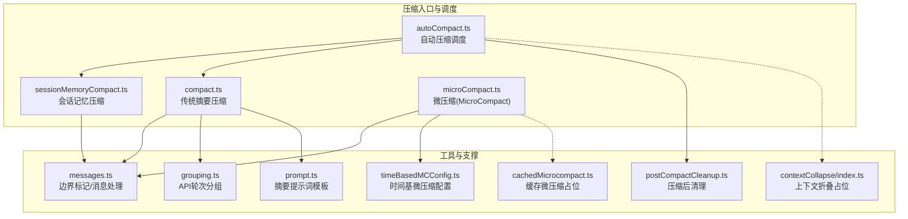
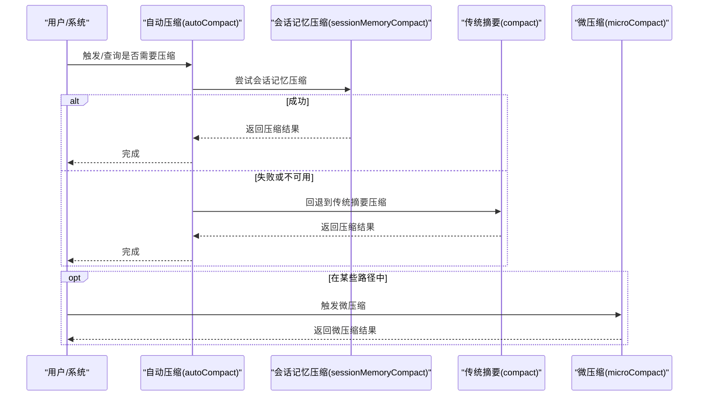
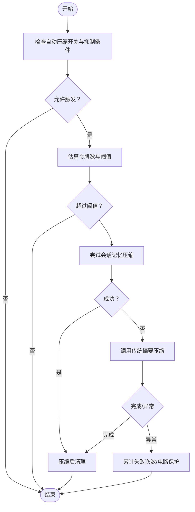
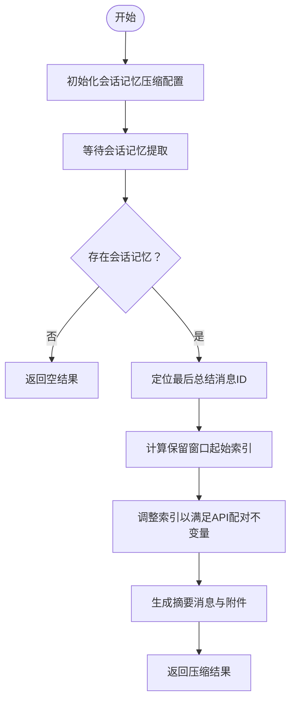
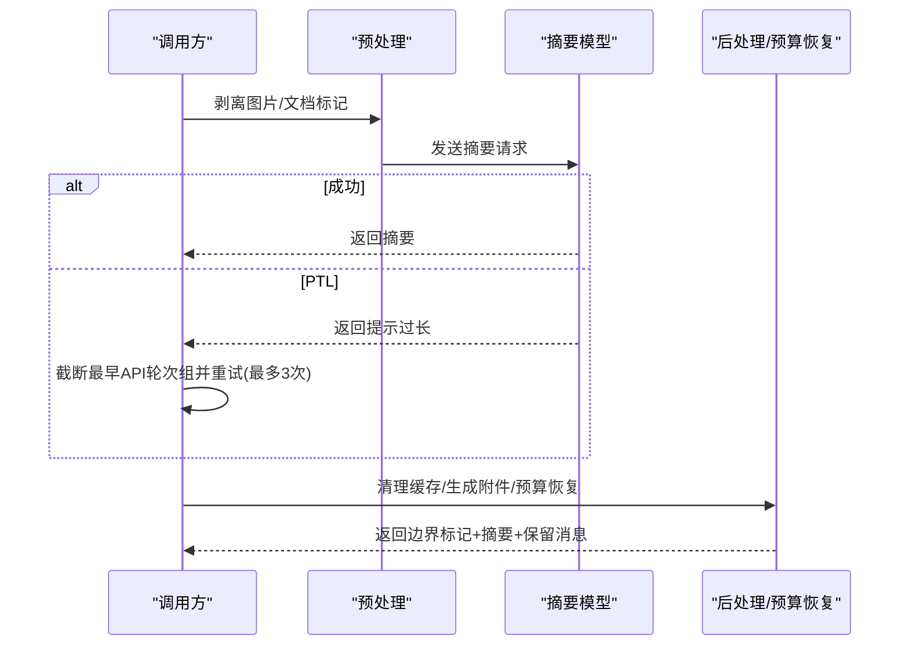
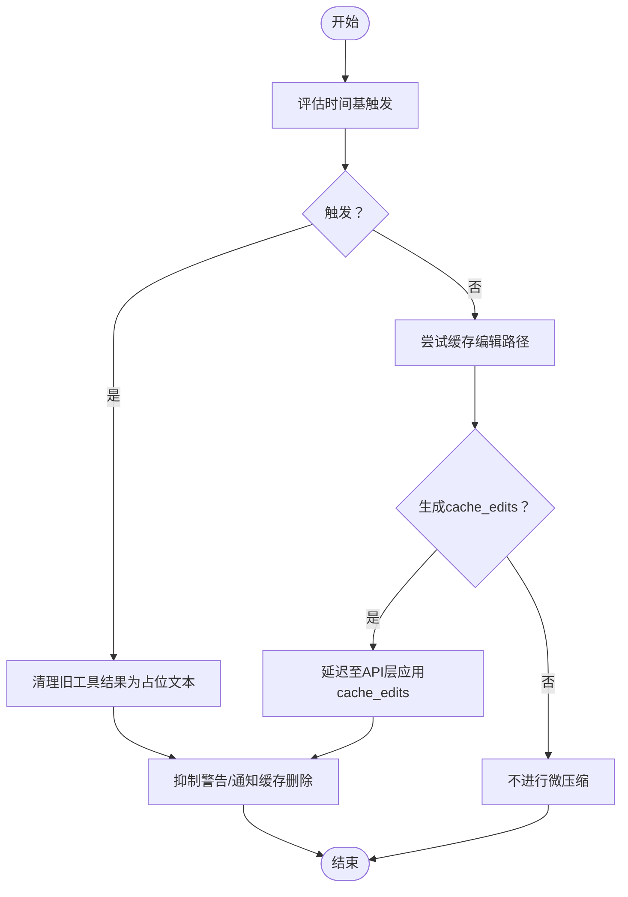
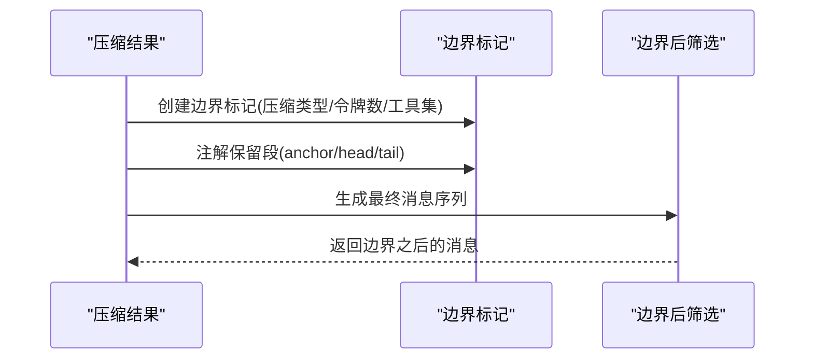
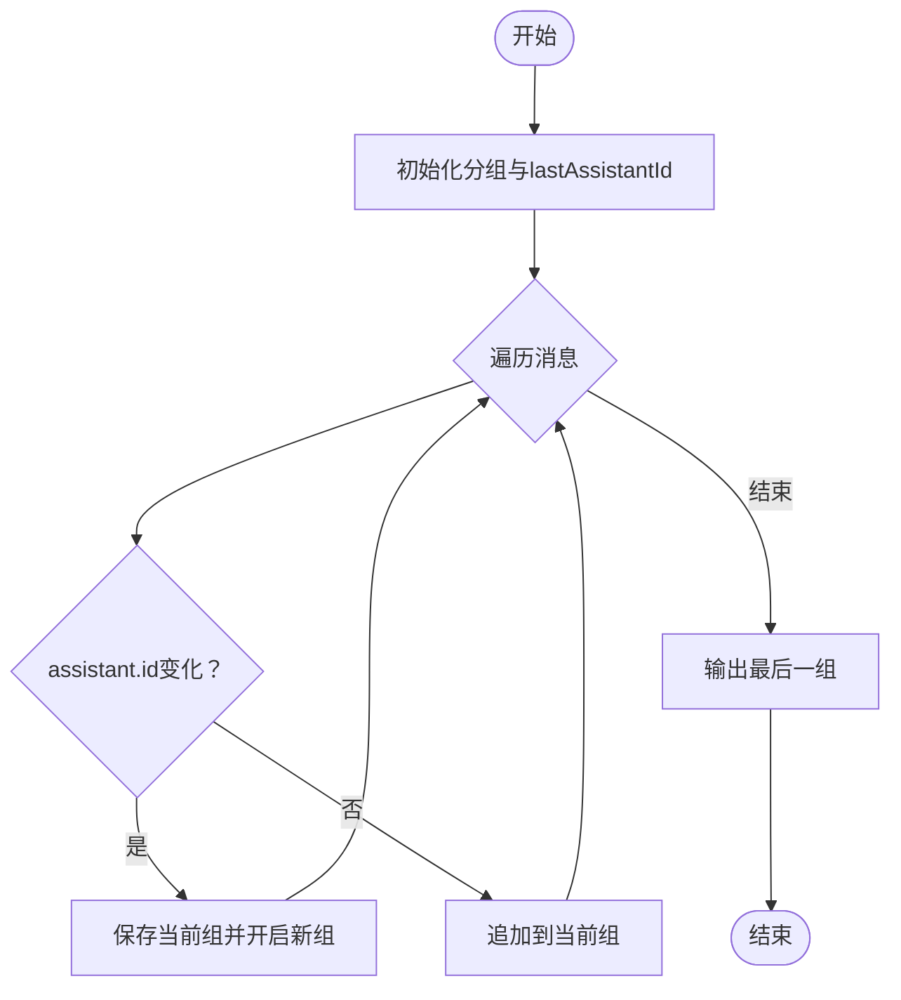
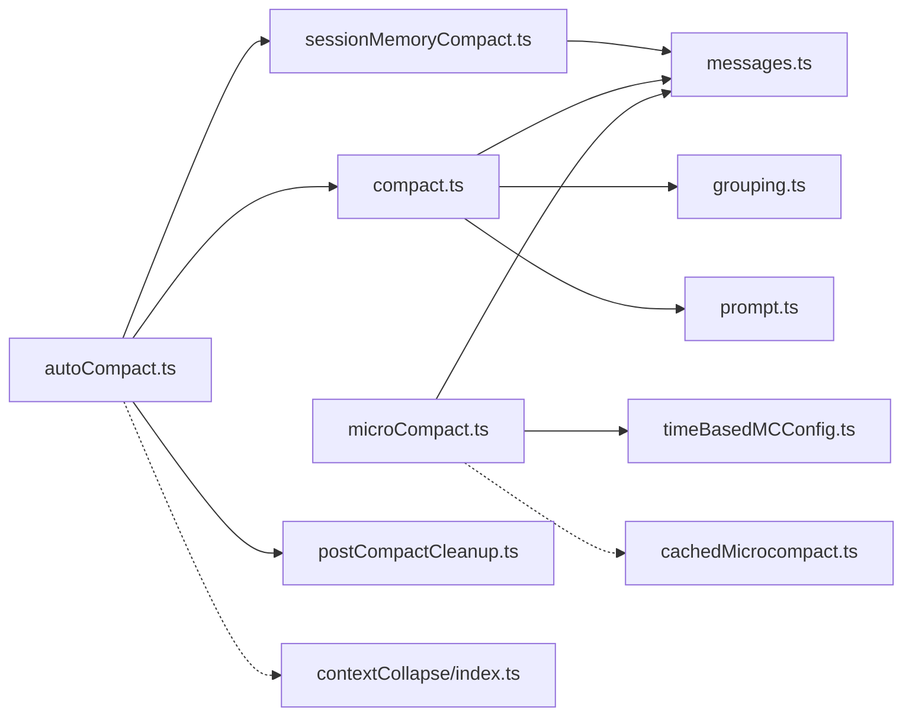

# 上下文压缩策略

<cite>
**本文引用的文件**
- [compaction.mdx](file://docs/context/compaction.mdx)
- [autoCompact.ts](file://src/services/compact/autoCompact.ts)
- [compact.ts](file://src/services/compact/compact.ts)
- [sessionMemoryCompact.ts](file://src/services/compact/sessionMemoryCompact.ts)
- [microCompact.ts](file://src/services/compact/microCompact.ts)
- [grouping.ts](file://src/services/compact/grouping.ts)
- [timeBasedMCConfig.ts](file://src/services/compact/timeBasedMCConfig.ts)
- [cachedMicrocompact.ts](file://src/services/compact/cachedMicrocompact.ts)
- [postCompactCleanup.ts](file://src/services/compact/postCompactCleanup.ts)
- [prompt.ts](file://src/services/compact/prompt.ts)
- [messages.ts](file://src/utils/messages.ts)
- [index.ts](file://src/services/contextCollapse/index.ts)
</cite>

## 目录
1. [简介](#简介)
2. [项目结构](#项目结构)
3. [核心组件](#核心组件)
4. [架构总览](#架构总览)
5. [详细组件分析](#详细组件分析)
6. [依赖关系分析](#依赖关系分析)
7. [性能考量](#性能考量)
8. [故障排查指南](#故障排查指南)
9. [结论](#结论)
10. [附录](#附录)

## 简介
本文件系统化阐述 Claude Code Best 的上下文压缩策略，聚焦“三层递进”的压缩体系与“边界标记”机制。文档覆盖：
- 主动压缩（自动压缩）与被动压缩（手动/回退）两种模式的工作原理与触发条件
- 消息分组策略、摘要生成算法、令牌估算方法
- 压缩边界标记（CompactBoundary）的前缀保持与后缀保持策略
- 缓存管理、错误处理与重试机制
- 压缩配置参数（令牌预算、文件大小限制、技能内容限制）
- 压缩示例与性能优化建议

## 项目结构
围绕上下文压缩的核心代码位于 src/services/compact 及其相关工具模块；压缩边界与消息处理位于 src/utils/messages.ts；自动压缩调度位于 src/services/compact/autoCompact.ts；会话记忆压缩位于 src/services/compact/sessionMemoryCompact.ts；微压缩（MicroCompact）位于 src/services/compact/microCompact.ts；消息分组策略位于 src/services/compact/grouping.ts；时间基微压缩配置位于 src/services/compact/timeBasedMCConfig.ts；缓存微压缩占位实现位于 src/services/compact/cachedMicrocompact.ts；压缩后清理位于 src/services/compact/postCompactCleanup.ts；摘要提示词模板位于 src/services/compact/prompt.ts；上下文折叠（Context Collapse）占位实现位于 src/services/contextCollapse/index.ts。

图示来源
- [autoCompact.ts:1-352](file://src/services/compact/autoCompact.ts#L1-L352)
- [compact.ts:1-800](file://src/services/compact/compact.ts#L1-L800)
- [sessionMemoryCompact.ts:1-631](file://src/services/compact/sessionMemoryCompact.ts#L1-L631)
- [microCompact.ts:1-531](file://src/services/compact/microCompact.ts#L1-L531)
- [messages.ts:1-800](file://src/utils/messages.ts#L1-L800)
- [grouping.ts:1-64](file://src/services/compact/grouping.ts#L1-L64)
- [timeBasedMCConfig.ts:1-44](file://src/services/compact/timeBasedMCConfig.ts#L1-L44)
- [cachedMicrocompact.ts:1-38](file://src/services/compact/cachedMicrocompact.ts#L1-L38)
- [prompt.ts:1-375](file://src/services/compact/prompt.ts#L1-L375)
- [postCompactCleanup.ts:1-78](file://src/services/compact/postCompactCleanup.ts#L1-L78)
- [index.ts:1-67](file://src/services/contextCollapse/index.ts#L1-L67)

章节来源
- [compaction.mdx:1-240](file://docs/context/compaction.mdx#L1-L240)
- [autoCompact.ts:1-352](file://src/services/compact/autoCompact.ts#L1-L352)
- [compact.ts:1-800](file://src/services/compact/compact.ts#L1-L800)
- [sessionMemoryCompact.ts:1-631](file://src/services/compact/sessionMemoryCompact.ts#L1-L631)
- [microCompact.ts:1-531](file://src/services/compact/microCompact.ts#L1-L531)
- [messages.ts:1-800](file://src/utils/messages.ts#L1-L800)
- [grouping.ts:1-64](file://src/services/compact/grouping.ts#L1-L64)
- [timeBasedMCConfig.ts:1-44](file://src/services/compact/timeBasedMCConfig.ts#L1-L44)
- [cachedMicrocompact.ts:1-38](file://src/services/compact/cachedMicrocompact.ts#L1-L38)
- [prompt.ts:1-375](file://src/services/compact/prompt.ts#L1-L375)
- [postCompactCleanup.ts:1-78](file://src/services/compact/postCompactCleanup.ts#L1-L78)
- [index.ts:1-67](file://src/services/contextCollapse/index.ts#L1-L67)

## 核心组件
- 自动压缩（主动压缩）：基于有效上下文窗口与阈值动态触发，优先尝试会话记忆压缩，失败则回退到传统摘要压缩，并具备电路保护与重试控制。
- 会话记忆压缩（被动压缩）：利用已提取的会话记忆作为摘要，无需调用摘要模型，通过保留窗口计算与 API 对齐不变量保证消息完整性。
- 传统摘要压缩（被动压缩）：调用模型生成摘要，进行图片剥离、附件去重、预算恢复等预处理与后处理，支持 PTL（请求过长）重试与截断兜底。
- 微压缩（MicroCompact）：局部清理旧工具输出，支持时间基触发与缓存编辑路径，兼顾近实时与跨轮次的上下文压力管理。
- 边界标记（CompactBoundary）：压缩后插入系统消息，标注压缩类型、前压缩令牌数、最后用户消息 UUID、发现工具集等元数据，支持“保留段”注解与边界后消息筛选。
- 消息分组策略：按 API 轮次分组，确保摘要生成与重试时的原子性与一致性。
- 配置与预算：令牌预算、文件大小限制、技能内容限制、时间基微压缩阈值等参数化配置。

章节来源
- [autoCompact.ts:1-352](file://src/services/compact/autoCompact.ts#L1-L352)
- [sessionMemoryCompact.ts:1-631](file://src/services/compact/sessionMemoryCompact.ts#L1-L631)
- [compact.ts:1-800](file://src/services/compact/compact.ts#L1-L800)
- [microCompact.ts:1-531](file://src/services/compact/microCompact.ts#L1-L531)
- [messages.ts:1-800](file://src/utils/messages.ts#L1-L800)
- [grouping.ts:1-64](file://src/services/compact/grouping.ts#L1-L64)
- [prompt.ts:1-375](file://src/services/compact/prompt.ts#L1-L375)

## 架构总览
三层压缩策略的优先级链路如下：

图示来源
- [autoCompact.ts:241-351](file://src/services/compact/autoCompact.ts#L241-L351)
- [sessionMemoryCompact.ts:514-630](file://src/services/compact/sessionMemoryCompact.ts#L514-L630)
- [compact.ts:389-765](file://src/services/compact/compact.ts#L389-L765)
- [microCompact.ts:253-293](file://src/services/compact/microCompact.ts#L253-L293)

章节来源
- [compaction.mdx:19-42](file://docs/context/compaction.mdx#L19-L42)
- [autoCompact.ts:241-351](file://src/services/compact/autoCompact.ts#L241-L351)
- [sessionMemoryCompact.ts:514-630](file://src/services/compact/sessionMemoryCompact.ts#L514-L630)
- [compact.ts:389-765](file://src/services/compact/compact.ts#L389-L765)
- [microCompact.ts:253-293](file://src/services/compact/microCompact.ts#L253-L293)

## 详细组件分析

### 组件一：自动压缩（主动压缩）
- 设计要点
  - 有效上下文窗口 = 模型上下文窗口 - 摘要最大输出预留
  - 自动压缩阈值 = 有效上下文窗口 - 缓冲区（13K）
  - 警告阈值 = 阈值 - 20K；错误阈值 = 阈值 - 20K；阻断阈值可由环境变量覆盖
  - 电路保护：连续失败超过阈值（默认 3 次）后停止尝试，避免无效 API 调用
  - 抑制条件：启用上下文折叠或仅响应式压缩时抑制主动压缩
- 流程
  - shouldAutoCompact：计算当前令牌数与阈值比较，结合抑制条件判断
  - autoCompactIfNeeded：优先尝试会话记忆压缩，成功即返回；否则调用传统摘要压缩，异常时累加失败次数并可能触发电路保护

图示来源
- [autoCompact.ts:93-145](file://src/services/compact/autoCompact.ts#L93-L145)
- [autoCompact.ts:160-239](file://src/services/compact/autoCompact.ts#L160-L239)
- [autoCompact.ts:241-351](file://src/services/compact/autoCompact.ts#L241-L351)
- [sessionMemoryCompact.ts:514-630](file://src/services/compact/sessionMemoryCompact.ts#L514-L630)
- [compact.ts:389-765](file://src/services/compact/compact.ts#L389-L765)

章节来源
- [autoCompact.ts:1-352](file://src/services/compact/autoCompact.ts#L1-L352)
- [compaction.mdx:9-23](file://docs/context/compaction.mdx#L9-L23)

### 组件二：会话记忆压缩（被动压缩）
- 设计要点
  - 使用已提取的会话记忆作为摘要，无需调用摘要模型
  - 保留窗口计算：最小 10K 令牌、至少 5 条含文本的消息、最多 40K 令牌
  - API 对齐不变量调整：确保 tool_use 与 tool_result 配对不被切分，必要时向前扩展起始索引
  - 边界处理：过滤旧边界消息，避免重复修剪
- 流程
  - 初始化远程配置（GrowthBook）
  - 等待会话记忆提取完成
  - 计算保留窗口起始索引，过滤旧边界
  - 生成摘要消息与附件，构建压缩结果

图示来源
- [sessionMemoryCompact.ts:514-630](file://src/services/compact/sessionMemoryCompact.ts#L514-L630)
- [sessionMemoryCompact.ts:324-397](file://src/services/compact/sessionMemoryCompact.ts#L324-L397)
- [sessionMemoryCompact.ts:232-314](file://src/services/compact/sessionMemoryCompact.ts#L232-L314)

章节来源
- [sessionMemoryCompact.ts:1-631](file://src/services/compact/sessionMemoryCompact.ts#L1-L631)
- [compaction.mdx:75-121](file://docs/context/compaction.mdx#L75-L121)

### 组件三：传统摘要压缩（被动压缩）
- 设计要点
  - 预处理：剥离图片/文档标记、去除将被重新注入的附件
  - 摘要生成：使用带“禁止工具调用”前置与尾注的提示词模板
  - 后处理：预算恢复（最多 50K 令牌），恢复最近读取文件（最多 5 个，每文件最多 5K）、技能指令（每技能最多 5K，总计 25K）
  - 错误处理与重试：当摘要请求本身触发 PTL（请求过长）时，按 API 轮次分组截断最早组并重试，最多 3 次
- 流程
  - 执行 Pre-compact Hook，合并用户与 Hook 指令
  - 构造摘要请求，循环尝试直至成功或达到最大重试次数
  - 清理缓存状态，异步生成文件与代理附件
  - 创建边界标记与摘要消息，构建最终消息序列

图示来源
- [compact.ts:147-225](file://src/services/compact/compact.ts#L147-L225)
- [compact.ts:389-765](file://src/services/compact/compact.ts#L389-L765)
- [compact.ts:245-293](file://src/services/compact/compact.ts#L245-L293)
- [prompt.ts:293-303](file://src/services/compact/prompt.ts#L293-L303)

章节来源
- [compact.ts:1-800](file://src/services/compact/compact.ts#L1-L800)
- [prompt.ts:1-375](file://src/services/compact/prompt.ts#L1-L375)
- [compaction.mdx:122-158](file://docs/context/compaction.mdx#L122-L158)

### 组件四：微压缩（MicroCompact，局部压缩）
- 设计要点
  - 白名单工具：文件读取、命令输出、搜索结果、文件列表、网页搜索/抓取、编辑/写入等
  - 时间基触发：当自上次主循环助手消息的时间间隔超过阈值且缓存已过期时，清理旧工具结果
  - 缓存编辑路径：在热缓存场景下，通过 cache_edits 删除工具结果而不破坏前缀缓存
  - 令牌估算：针对不同内容块（文本、工具结果、图片/文档、thinking、tool_use 等）分别估算
- 流程
  - 评估时间基触发条件
  - 若触发，按 keepRecent 保留最新若干工具结果，其余清空为占位文本
  - 否则尝试缓存编辑路径，注册工具结果并生成 cache_edits，延迟至 API 层应用
  - 成功后抑制警告并在缓存检测中通知

图示来源
- [microCompact.ts:422-444](file://src/services/compact/microCompact.ts#L422-L444)
- [microCompact.ts:446-530](file://src/services/compact/microCompact.ts#L446-L530)
- [microCompact.ts:305-399](file://src/services/compact/microCompact.ts#L305-L399)
- [timeBasedMCConfig.ts:1-44](file://src/services/compact/timeBasedMCConfig.ts#L1-L44)
- [cachedMicrocompact.ts:1-38](file://src/services/compact/cachedMicrocompact.ts#L1-L38)

章节来源
- [microCompact.ts:1-531](file://src/services/compact/microCompact.ts#L1-L531)
- [timeBasedMCConfig.ts:1-44](file://src/services/compact/timeBasedMCConfig.ts#L1-L44)
- [compaction.mdx:44-74](file://docs/context/compaction.mdx#L44-L74)

### 组件五：压缩边界标记与保留段注解
- 设计要点
  - 插入 SystemCompactBoundaryMessage，包含压缩类型、前压缩令牌数、最后用户消息 UUID、发现工具集等
  - 保留段注解 preservedSegment：记录 anchor/head/tail UUID，便于会话恢复时重建链路
  - 边界后消息筛选：通过 getMessagesAfterCompactBoundary 获取边界之后的消息集合
- 流程
  - 构建边界标记并注解保留段
  - 在压缩结果中统一顺序：边界标记、摘要消息、保留消息、附件、Hook 结果
  - 会话恢复时根据 preservedSegment 修复链路

图示来源
- [messages.ts:1-800](file://src/utils/messages.ts#L1-L800)
- [compact.ts:351-369](file://src/services/compact/compact.ts#L351-L369)
- [compact.ts:332-340](file://src/services/compact/compact.ts#L332-L340)

章节来源
- [messages.ts:1-800](file://src/utils/messages.ts#L1-L800)
- [compaction.mdx:159-202](file://docs/context/compaction.mdx#L159-L202)

### 组件六：消息分组策略（API 轮次）
- 设计要点
  - 按 assistant.message.id 变化划分 API 轮次，确保每轮内部 tool_use 与 tool_result 配对有效
  - 该分组用于 PTL 重试时按轮次截断，保证 API 合约约束
- 流程
  - 遍历消息，遇到新的 assistant.id 则开启新组
  - 输出分组数组，供后续截断与预算恢复使用

图示来源
- [grouping.ts:22-63](file://src/services/compact/grouping.ts#L22-L63)

章节来源
- [grouping.ts:1-64](file://src/services/compact/grouping.ts#L1-L64)
- [compact.ts:245-293](file://src/services/compact/compact.ts#L245-L293)

### 组件七：压缩后清理与缓存管理
- 设计要点
  - 压缩后清理：重置微压缩状态、在主线程场景下重置上下文折叠状态、清理系统提示段、分类器批准与推测检查、Beta 跟踪状态、会话消息缓存等
  - 缓存编辑路径：在微压缩中延迟应用 cache_edits，避免破坏前缀缓存
  - 上下文折叠占位：在启用折叠特性时，抑制自动压缩以避免与折叠竞争
- 流程
  - 根据 querySource 判断主线程/子代理场景，选择性清理
  - 通知缓存检测系统压缩已完成，避免误报

章节来源
- [postCompactCleanup.ts:1-78](file://src/services/compact/postCompactCleanup.ts#L1-L78)
- [microCompact.ts:305-399](file://src/services/compact/microCompact.ts#L305-L399)
- [autoCompact.ts:215-223](file://src/services/compact/autoCompact.ts#L215-L223)
- [index.ts:1-67](file://src/services/contextCollapse/index.ts#L1-L67)

## 依赖关系分析

图示来源
- [autoCompact.ts:1-352](file://src/services/compact/autoCompact.ts#L1-L352)
- [sessionMemoryCompact.ts:1-631](file://src/services/compact/sessionMemoryCompact.ts#L1-L631)
- [compact.ts:1-800](file://src/services/compact/compact.ts#L1-L800)
- [microCompact.ts:1-531](file://src/services/compact/microCompact.ts#L1-L531)
- [messages.ts:1-800](file://src/utils/messages.ts#L1-L800)
- [grouping.ts:1-64](file://src/services/compact/grouping.ts#L1-L64)
- [prompt.ts:1-375](file://src/services/compact/prompt.ts#L1-L375)
- [timeBasedMCConfig.ts:1-44](file://src/services/compact/timeBasedMCConfig.ts#L1-L44)
- [cachedMicrocompact.ts:1-38](file://src/services/compact/cachedMicrocompact.ts#L1-L38)
- [postCompactCleanup.ts:1-78](file://src/services/compact/postCompactCleanup.ts#L1-L78)
- [index.ts:1-67](file://src/services/contextCollapse/index.ts#L1-L67)

章节来源
- [autoCompact.ts:1-352](file://src/services/compact/autoCompact.ts#L1-L352)
- [compact.ts:1-800](file://src/services/compact/compact.ts#L1-L800)
- [sessionMemoryCompact.ts:1-631](file://src/services/compact/sessionMemoryCompact.ts#L1-L631)
- [microCompact.ts:1-531](file://src/services/compact/microCompact.ts#L1-L531)
- [messages.ts:1-800](file://src/utils/messages.ts#L1-L800)
- [grouping.ts:1-64](file://src/services/compact/grouping.ts#L1-L64)
- [prompt.ts:1-375](file://src/services/compact/prompt.ts#L1-L375)
- [timeBasedMCConfig.ts:1-44](file://src/services/compact/timeBasedMCConfig.ts#L1-L44)
- [cachedMicrocompact.ts:1-38](file://src/services/compact/cachedMicrocompact.ts#L1-L38)
- [postCompactCleanup.ts:1-78](file://src/services/compact/postCompactCleanup.ts#L1-L78)
- [index.ts:1-67](file://src/services/contextCollapse/index.ts#L1-L67)

## 性能考量
- 令牌估算保守 padding：对整体估算乘以 4/3，降低低估风险
- 分组与重试：API 轮次分组确保重试时按轮次截断，减少无效工作
- 缓存编辑：在热缓存场景下通过 cache_edits 删除工具结果，避免前缀重建带来的额外成本
- 配置化阈值：通过环境变量与远程配置（GrowthBook）灵活调整微压缩与会话记忆压缩阈值
- 电路保护：连续失败上限避免无效 API 调用，降低资源浪费

## 故障排查指南
- 自动压缩未触发
  - 检查自动压缩开关与抑制条件（上下文折叠、仅响应式压缩）
  - 查看令牌估算与阈值计算日志
- 会话记忆压缩失败
  - 确认会话记忆文件是否存在且非模板内容
  - 检查 lastSummarizedMessageId 是否存在于当前消息链
- 传统摘要压缩 PTL
  - 使用 truncateHeadForPTLRetry 按 API 轮次截断最早组并重试
  - 检查预处理是否移除了不必要的图片/文档块
- 微压缩未生效
  - 确认时间基触发条件与查询来源（主线程）
  - 检查缓存编辑路径是否可用（模型支持、特性开关）

章节来源
- [autoCompact.ts:147-239](file://src/services/compact/autoCompact.ts#L147-L239)
- [sessionMemoryCompact.ts:514-630](file://src/services/compact/sessionMemoryCompact.ts#L514-L630)
- [compact.ts:245-293](file://src/services/compact/compact.ts#L245-L293)
- [microCompact.ts:422-530](file://src/services/compact/microCompact.ts#L422-L530)

## 结论
Claude Code Best 的上下文压缩策略通过“三层递进”与“边界标记”实现了高效、可控且可恢复的上下文管理。自动压缩负责主动缓解压力，会话记忆压缩提供零 API 调用的高性价比摘要，传统摘要压缩保障兜底能力与 PTL 恢复。微压缩在局部场景提供即时的上下文瘦身。配合消息分组、预算恢复、缓存管理与电路保护，系统在复杂对话场景中保持稳定与高性能。

## 附录

### 压缩配置参数说明
- 令牌预算与阈值
  - 自动压缩阈值：有效上下文窗口 - 13K 缓冲
  - 警告阈值：阈值 - 20K；错误阈值：阈值 - 20K
  - 阻断阈值：默认为有效上下文窗口 - 3K，可通过环境变量覆盖
  - 环境变量：CLAUDE_CODE_AUTO_COMPACT_WINDOW、CLAUDE_CODE_BLOCKING_LIMIT_OVERRIDE、CLAUDE_AUTOCOMPACT_PCT_OVERRIDE
- 传统摘要压缩预算
  - POST_COMPACT_TOKEN_BUDGET：50K
  - POST_COMPACT_MAX_FILES_TO_RESTORE：5
  - POST_COMPACT_MAX_TOKENS_PER_FILE：5K
  - POST_COMPACT_MAX_TOKENS_PER_SKILL：5K
  - POST_COMPACT_SKILLS_TOKEN_BUDGET：25K
- 微压缩配置
  - 时间基微压缩：enabled、gapThresholdMinutes、keepRecent（来自 GrowthBook 配置）
  - 图片/文档块估算：统一按 2000 令牌估算
- 会话记忆压缩配置
  - minTokens：10K
  - minTextBlockMessages：5
  - maxTokens：40K
  - 可通过远程配置覆盖

章节来源
- [autoCompact.ts:62-145](file://src/services/compact/autoCompact.ts#L62-L145)
- [compact.ts:124-133](file://src/services/compact/compact.ts#L124-L133)
- [microCompact.ts:38-205](file://src/services/compact/microCompact.ts#L38-L205)
- [sessionMemoryCompact.ts:47-88](file://src/services/compact/sessionMemoryCompact.ts#L47-L88)
- [timeBasedMCConfig.ts:18-44](file://src/services/compact/timeBasedMCConfig.ts#L18-L44)