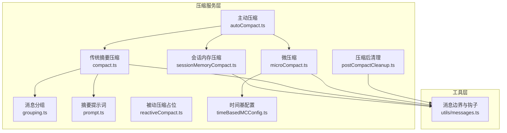
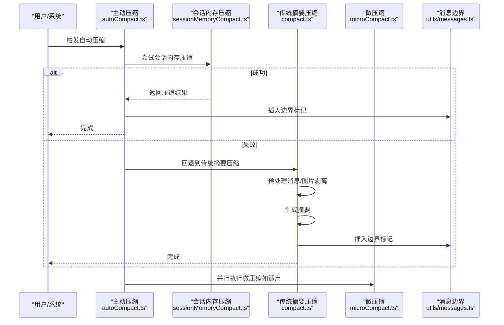
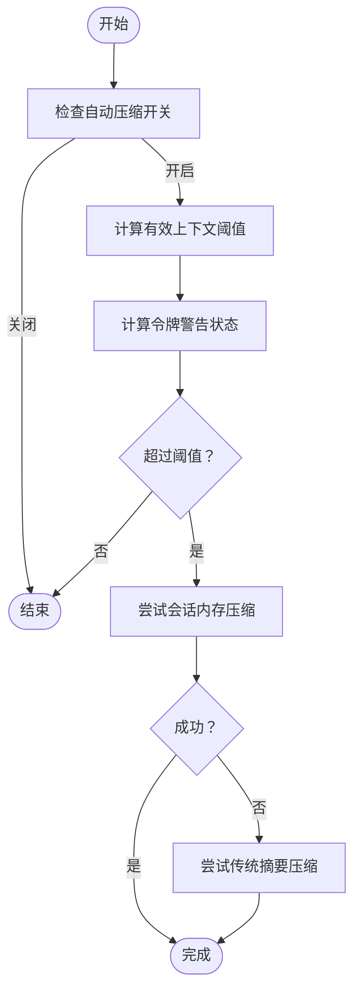
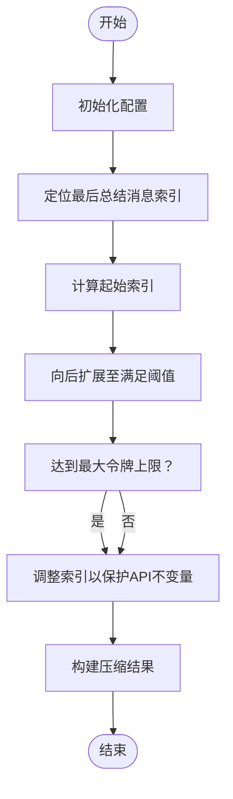
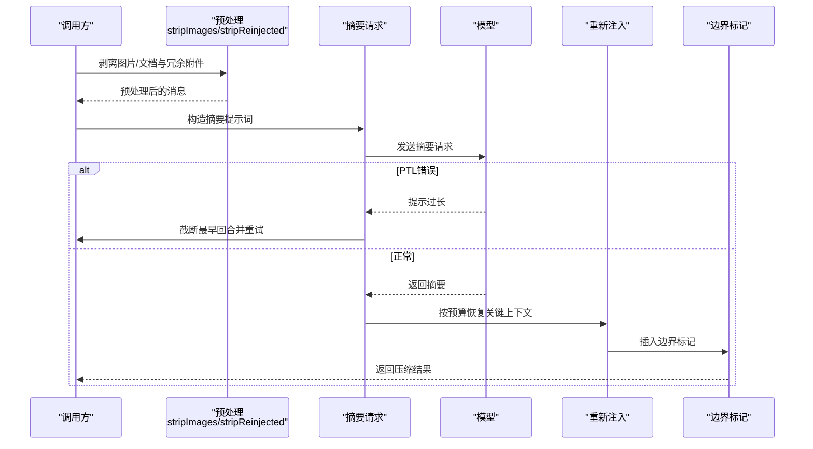
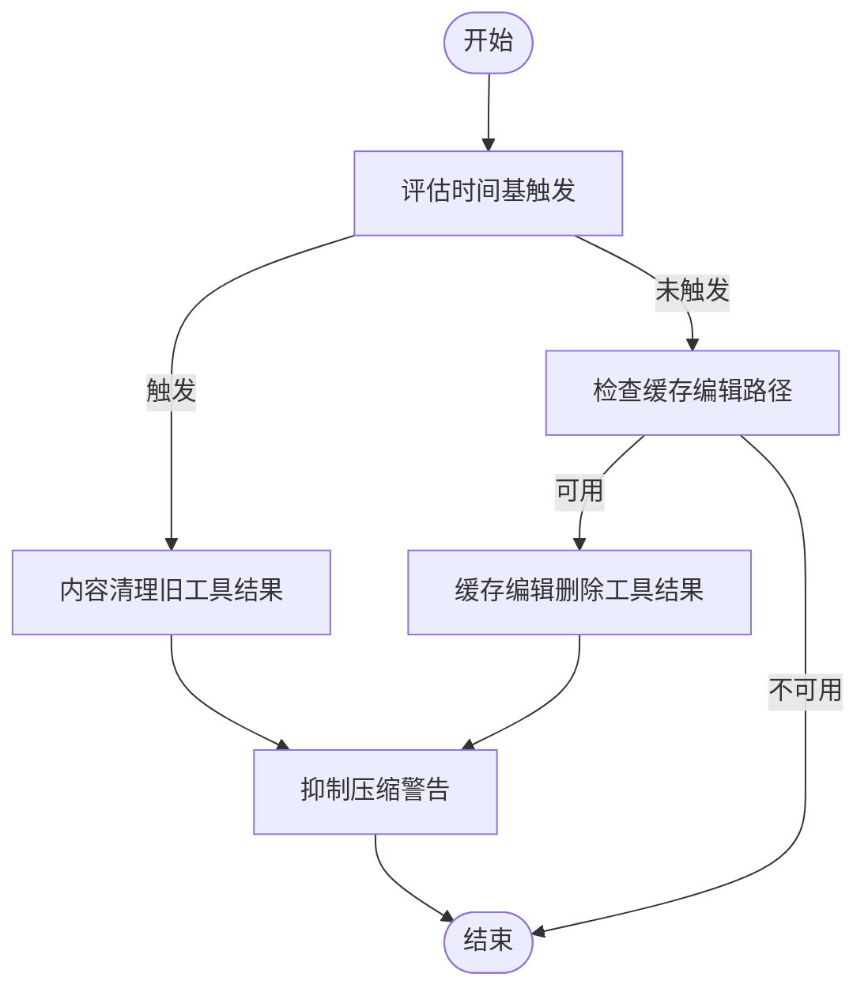
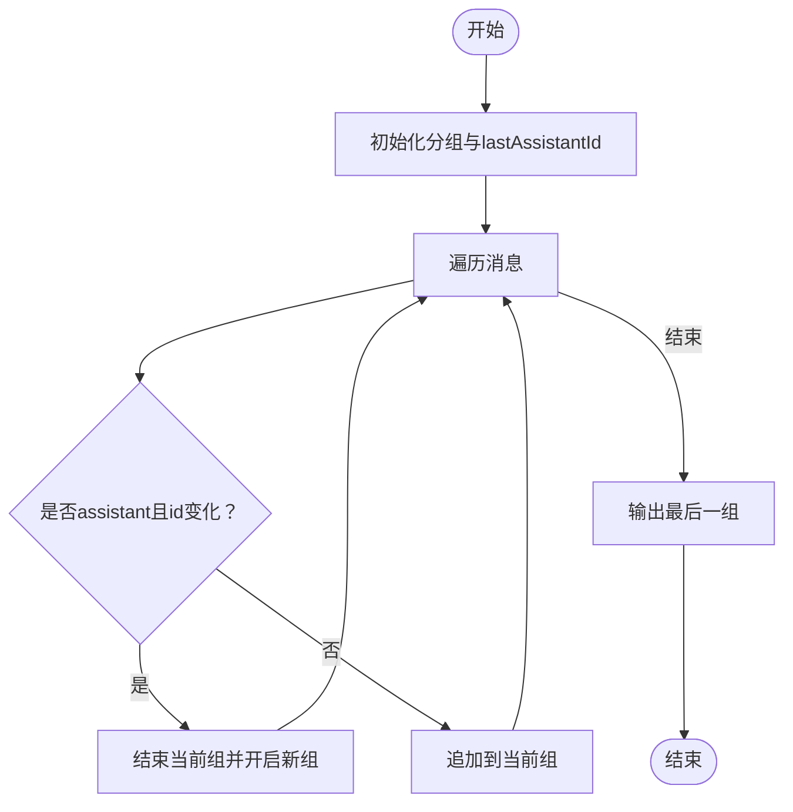
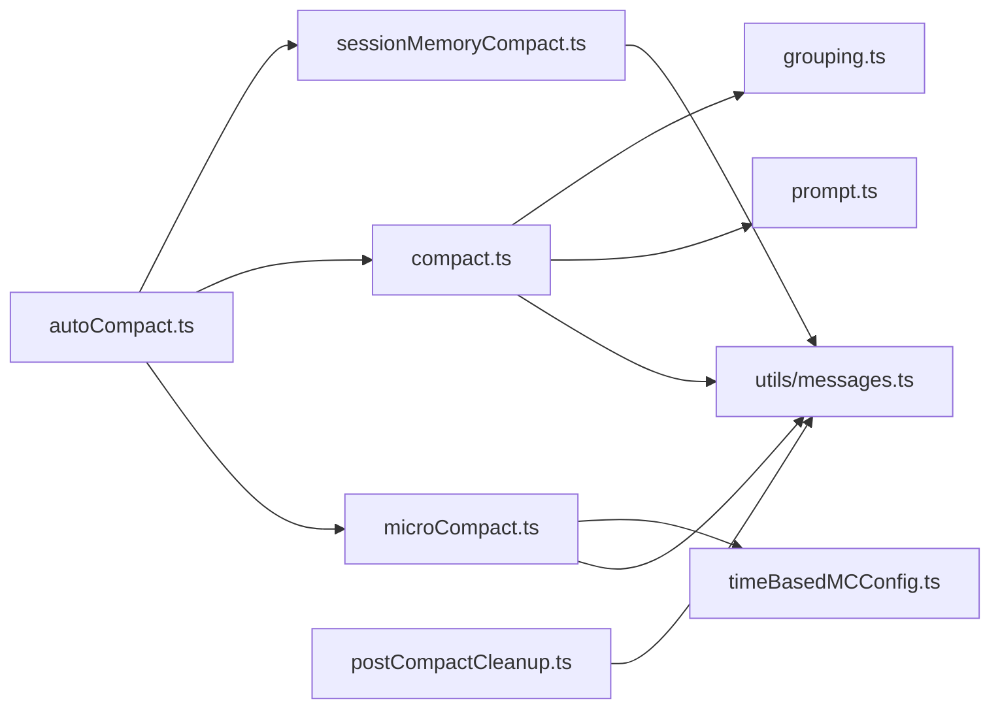

# 压缩算法实现

<cite>
**本文引用的文件**
- [src/services/compact/compact.ts](file://src/services/compact/compact.ts)
- [src/services/compact/autoCompact.ts](file://src/services/compact/autoCompact.ts)
- [src/services/compact/sessionMemoryCompact.ts](file://src/services/compact/sessionMemoryCompact.ts)
- [src/services/compact/microCompact.ts](file://src/services/compact/microCompact.ts)
- [src/services/compact/grouping.ts](file://src/services/compact/grouping.ts)
- [src/services/compact/prompt.ts](file://src/services/compact/prompt.ts)
- [src/services/compact/reactiveCompact.ts](file://src/services/compact/reactiveCompact.ts)
- [src/services/compact/postCompactCleanup.ts](file://src/services/compact/postCompactCleanup.ts)
- [src/services/compact/timeBasedMCConfig.ts](file://src/services/compact/timeBasedMCConfig.ts)
- [src/utils/messages.ts](file://src/utils/messages.ts)
- [docs/context/compaction.mdx](file://docs/context/compaction.mdx)
</cite>

## 目录
1. [简介](#简介)
2. [项目结构](#项目结构)
3. [核心组件](#核心组件)
4. [架构概览](#架构概览)
5. [详细组件分析](#详细组件分析)
6. [依赖关系分析](#依赖关系分析)
7. [性能考量](#性能考量)
8. [故障排除指南](#故障排除指南)
9. [结论](#结论)
10. [附录](#附录)

## 简介
本文件系统性阐述 Claude Code Best 的压缩算法实现，重点覆盖主动压缩与被动压缩两种模式的工作机制与触发条件；消息分组策略、摘要生成算法与令牌估算方法；压缩边界标记的作用与实现（前缀保持与后缀保持）；缓存管理、错误处理与重试机制；以及压缩配置参数（令牌预算、文件大小限制、技能内容限制）。文档同时提供压缩示例与性能优化建议，帮助开发者深入理解实现细节与最佳实践。

## 项目结构
压缩相关代码主要位于 `src/services/compact/` 目录，配合 `src/utils/messages.ts` 提供消息边界与工具对完整性保障，`docs/context/compaction.mdx` 提供高层设计说明。整体采用“三层策略 + 边界标记 + 钩子”的架构：

- 主动压缩（AutoCompact）：基于令牌预算与上下文窗口阈值自动触发，优先尝试 Session Memory 压缩，失败则回退到传统摘要压缩。
- 被动压缩（ReactiveCompact）：在出现 PTL（Prompt Too Long）等错误时进行激进压缩或兜底截断，当前为内部实验性占位实现。
- 微压缩（MicroCompact）：针对单个工具输出的局部清理，支持时间基触发与缓存编辑两种路径。

图表来源
- [src/services/compact/autoCompact.ts:241-351](file://src/services/compact/autoCompact.ts#L241-L351)
- [src/services/compact/sessionMemoryCompact.ts:514-630](file://src/services/compact/sessionMemoryCompact.ts#L514-L630)
- [src/services/compact/compact.ts:389-765](file://src/services/compact/compact.ts#L389-L765)
- [src/services/compact/microCompact.ts:253-531](file://src/services/compact/microCompact.ts#L253-L531)
- [src/services/compact/grouping.ts:22-63](file://src/services/compact/grouping.ts#L22-L63)
- [src/services/compact/prompt.ts:293-303](file://src/services/compact/prompt.ts#L293-L303)
- [src/services/compact/reactiveCompact.ts:1-23](file://src/services/compact/reactiveCompact.ts#L1-L23)
- [src/services/compact/postCompactCleanup.ts:31-77](file://src/services/compact/postCompactCleanup.ts#L31-L77)
- [src/services/compact/timeBasedMCConfig.ts:36-43](file://src/services/compact/timeBasedMCConfig.ts#L36-L43)
- [src/utils/messages.ts:1-200](file://src/utils/messages.ts#L1-L200)

章节来源
- [docs/context/compaction.mdx:9-42](file://docs/context/compaction.mdx#L9-L42)

## 核心组件
- 主动压缩（AutoCompact）：根据模型上下文窗口与输出预留令牌计算有效阈值，结合令牌警告状态判断是否触发压缩；优先尝试 Session Memory 压缩，失败则调用传统摘要压缩，并设置电路保护避免无限重试。
- 会话内存压缩（Session Memory Compact）：在启用相关特性标志时，直接使用已提取的会话记忆作为摘要，无需调用摘要模型；通过保留窗口计算与工具对完整性校验确保 API 合规。
- 传统摘要压缩（Traditional Compact）：对消息进行预处理（去除图片/文档块、剥离会重新注入的附件），调用模型生成摘要，随后按预算重新注入关键上下文（文件、技能、MCP 工具等）。
- 微压缩（MicroCompact）：清理过期工具输出，支持时间基触发与缓存编辑两种路径；提供令牌估算与边界标记辅助。
- 消息分组（Grouping）：按 API 回合边界分组，便于 PTL 重试时精准丢弃最早回合。
- 摘要提示词（Prompt）：提供基础与局部摘要模板，控制摘要格式与输出结构。
- 被动压缩（ReactiveCompact）：当前为占位实现，未来可能承担更激进的压缩策略。
- 压缩后清理（Post-Compact Cleanup）：释放缓存与跟踪状态，避免跨压缩的污染。

章节来源
- [src/services/compact/autoCompact.ts:32-91](file://src/services/compact/autoCompact.ts#L32-L91)
- [src/services/compact/sessionMemoryCompact.ts:47-88](file://src/services/compact/sessionMemoryCompact.ts#L47-L88)
- [src/services/compact/compact.ts:124-133](file://src/services/compact/compact.ts#L124-L133)
- [src/services/compact/microCompact.ts:40-50](file://src/services/compact/microCompact.ts#L40-L50)
- [src/services/compact/grouping.ts:22-63](file://src/services/compact/grouping.ts#L22-L63)
- [src/services/compact/prompt.ts:293-303](file://src/services/compact/prompt.ts#L293-L303)
- [src/services/compact/reactiveCompact.ts:1-23](file://src/services/compact/reactiveCompact.ts#L1-L23)
- [src/services/compact/postCompactCleanup.ts:31-77](file://src/services/compact/postCompactCleanup.ts#L31-L77)

## 架构概览
压缩流程遵循“三层策略 + 边界标记 + 钩子”的设计，确保在不同场景下选择最优压缩路径，并维持消息完整性与可恢复性。

图表来源
- [src/services/compact/autoCompact.ts:241-351](file://src/services/compact/autoCompact.ts#L241-L351)
- [src/services/compact/sessionMemoryCompact.ts:514-630](file://src/services/compact/sessionMemoryCompact.ts#L514-L630)
- [src/services/compact/compact.ts:389-765](file://src/services/compact/compact.ts#L389-L765)
- [src/services/compact/microCompact.ts:253-531](file://src/services/compact/microCompact.ts#L253-L531)
- [src/utils/messages.ts:1-200](file://src/utils/messages.ts#L1-L200)

## 详细组件分析

### 主动压缩（AutoCompact）
- 触发条件：基于模型上下文窗口与输出预留令牌计算有效阈值，结合令牌警告状态判断是否超过阈值；支持环境变量与用户配置覆盖。
- 优先级链：先尝试 Session Memory 压缩，失败再回退到传统摘要压缩；支持电路保护，避免连续失败导致的 API 负载。
- 与会话内存压缩协作：若使用会话内存压缩，压缩后重置最后总结消息 ID，并通知缓存破坏检测，避免误报。

图表来源
- [src/services/compact/autoCompact.ts:160-239](file://src/services/compact/autoCompact.ts#L160-L239)
- [src/services/compact/autoCompact.ts:241-351](file://src/services/compact/autoCompact.ts#L241-L351)

章节来源
- [src/services/compact/autoCompact.ts:32-91](file://src/services/compact/autoCompact.ts#L32-L91)
- [src/services/compact/autoCompact.ts:147-158](file://src/services/compact/autoCompact.ts#L147-L158)
- [src/services/compact/autoCompact.ts:160-239](file://src/services/compact/autoCompact.ts#L160-L239)
- [src/services/compact/autoCompact.ts:241-351](file://src/services/compact/autoCompact.ts#L241-L351)

### 会话内存压缩（Session Memory Compact）
- 保留窗口计算：从最后总结消息索引向后扩展，累计令牌与文本消息数量，满足最小令牌数与最少文本消息数后停止，且不超过最大令牌上限。
- 工具对完整性保护：向前扫描保留消息集合，确保 tool_result 对应的 tool_use 未被切分；同时处理流式传输中共享 message.id 的 thinking 块合并。
- 配置管理：支持从远程配置加载阈值，具备默认值与边界检查。

图表来源
- [src/services/compact/sessionMemoryCompact.ts:324-397](file://src/services/compact/sessionMemoryCompact.ts#L324-L397)
- [src/services/compact/sessionMemoryCompact.ts:232-314](file://src/services/compact/sessionMemoryCompact.ts#L232-L314)
- [src/services/compact/sessionMemoryCompact.ts:437-503](file://src/services/compact/sessionMemoryCompact.ts#L437-L503)

章节来源
- [src/services/compact/sessionMemoryCompact.ts:47-88](file://src/services/compact/sessionMemoryCompact.ts#L47-L88)
- [src/services/compact/sessionMemoryCompact.ts:324-397](file://src/services/compact/sessionMemoryCompact.ts#L324-L397)
- [src/services/compact/sessionMemoryCompact.ts:232-314](file://src/services/compact/sessionMemoryCompact.ts#L232-L314)
- [src/services/compact/sessionMemoryCompact.ts:437-503](file://src/services/compact/sessionMemoryCompact.ts#L437-L503)

### 传统摘要压缩（Traditional Compact）
- 预处理：剥离用户消息中的图片/文档块，替换为标记；移除会重新注入的附件（如技能发现/列表），避免摘要污染。
- 摘要生成：构造摘要提示词，调用模型生成摘要；若出现 PTL 错误，按令牌缺口或 20% 比例丢弃最早 API 回合并重试。
- 重新注入：按预算恢复最近读取文件、已激活技能指令、CLAUDE.md、MCP 工具发现结果等关键上下文。
- 边界标记：插入系统边界消息，记录压缩类型、压缩前令牌数、最后用户消息 UUID、发现工具等元数据。

图表来源
- [src/services/compact/compact.ts:147-225](file://src/services/compact/compact.ts#L147-L225)
- [src/services/compact/compact.ts:245-293](file://src/services/compact/compact.ts#L245-L293)
- [src/services/compact/compact.ts:389-765](file://src/services/compact/compact.ts#L389-L765)
- [src/services/compact/prompt.ts:293-303](file://src/services/compact/prompt.ts#L293-L303)

章节来源
- [src/services/compact/compact.ts:124-133](file://src/services/compact/compact.ts#L124-L133)
- [src/services/compact/compact.ts:147-225](file://src/services/compact/compact.ts#L147-L225)
- [src/services/compact/compact.ts:245-293](file://src/services/compact/compact.ts#L245-L293)
- [src/services/compact/compact.ts:389-765](file://src/services/compact/compact.ts#L389-L765)
- [src/services/compact/prompt.ts:293-303](file://src/services/compact/prompt.ts#L293-L303)

### 微压缩（MicroCompact）
- 时间基触发：当自上次主循环 assistant 消息的时间间隔超过阈值时，内容清理最近 N 个可压缩工具结果，其余清空；适用于服务器端缓存已过期场景。
- 缓存编辑路径：在支持的模型与主线程场景下，通过缓存编辑 API 删除工具结果而不失效前缀缓存，减少重写成本。
- 令牌估算：对文本、tool_result、图片/文档、thinking、tool_use 等内容块分别估算令牌数，保守放大 4/3 以留安全余量。

图表来源
- [src/services/compact/microCompact.ts:422-444](file://src/services/compact/microCompact.ts#L422-L444)
- [src/services/compact/microCompact.ts:446-531](file://src/services/compact/microCompact.ts#L446-L531)
- [src/services/compact/microCompact.ts:305-399](file://src/services/compact/microCompact.ts#L305-L399)
- [src/services/compact/microCompact.ts:164-205](file://src/services/compact/microCompact.ts#L164-L205)
- [src/services/compact/timeBasedMCConfig.ts:36-43](file://src/services/compact/timeBasedMCConfig.ts#L36-L43)

章节来源
- [src/services/compact/microCompact.ts:40-50](file://src/services/compact/microCompact.ts#L40-L50)
- [src/services/compact/microCompact.ts:164-205](file://src/services/compact/microCompact.ts#L164-L205)
- [src/services/compact/microCompact.ts:253-531](file://src/services/compact/microCompact.ts#L253-L531)
- [src/services/compact/timeBasedMCConfig.ts:18-28](file://src/services/compact/timeBasedMCConfig.ts#L18-L28)

### 消息分组策略（Grouping）
- API 回合边界：以 assistant 的 message.id 变化为分界点，确保每个分组内工具调用与结果配对有效，API 合约要求每个 tool_use 在下一个 assistant 轮次前得到解决。
- 重试兜底：当 PTL 错误发生时，按令牌缺口或 20% 比例丢弃最早回合，保证重试进度。

图表来源
- [src/services/compact/grouping.ts:22-63](file://src/services/compact/grouping.ts#L22-L63)
- [src/services/compact/compact.ts:245-293](file://src/services/compact/compact.ts#L245-L293)

章节来源
- [src/services/compact/grouping.ts:22-63](file://src/services/compact/grouping.ts#L22-L63)
- [src/services/compact/compact.ts:245-293](file://src/services/compact/compact.ts#L245-L293)

### 摘要生成算法与提示词
- 模板结构：提供基础摘要与局部摘要两类模板，均包含分析草稿与摘要输出结构，强调技术要点、文件与代码片段、错误与修复、当前工作与下一步。
- 输出格式：摘要输出包含分析草稿与摘要标签，最终由格式化函数剥离分析草稿并规范化摘要标签。

章节来源
- [src/services/compact/prompt.ts:61-143](file://src/services/compact/prompt.ts#L61-L143)
- [src/services/compact/prompt.ts:145-204](file://src/services/compact/prompt.ts#L145-L204)
- [src/services/compact/prompt.ts:305-335](file://src/services/compact/prompt.ts#L305-L335)

### 压缩边界标记与前缀/后缀保持
- 边界标记：压缩完成后插入系统边界消息，记录压缩类型、压缩前令牌数、最后用户消息 UUID、发现工具等元数据；支持 preservedSegment 注解，记录保留段落的头/锚/尾 UUID，便于会话恢复。
- 前缀保持（suffix-preserving）：在部分压缩（reactive/session-memory）场景，锚点为最后摘要消息，保留段落在摘要之后，适合后缀保持策略。
- 后缀保持（prefix-preserving）：在局部压缩场景，锚点为边界消息本身，保留段落在边界之前，适合前缀保持策略。

章节来源
- [docs/context/compaction.mdx:159-202](file://docs/context/compaction.mdx#L159-L202)
- [src/services/compact/compact.ts:351-369](file://src/services/compact/compact.ts#L351-L369)
- [src/utils/messages.ts:1-200](file://src/utils/messages.ts#L1-L200)

### 缓存管理、错误处理与重试机制
- 缓存管理：压缩后清理文件状态缓存、嵌套内存路径缓存、系统提示词段落、分类器批准与推测检查等；会话内存压缩后通知缓存破坏检测，避免误报。
- 错误处理：主动压缩失败时设置电路保护，避免无限重试；传统摘要压缩遇到 PTL 错误时按令牌缺口或 20% 截断最早回合并重试，最多三次。
- 钩子机制：压缩前后可执行自定义钩子，注入“必须保留”标记或验证关键信息是否保留。

章节来源
- [src/services/compact/compact.ts:519-532](file://src/services/compact/compact.ts#L519-L532)
- [src/services/compact/compact.ts:462-493](file://src/services/compact/compact.ts#L462-L493)
- [src/services/compact/postCompactCleanup.ts:31-77](file://src/services/compact/postCompactCleanup.ts#L31-L77)
- [src/services/compact/compact.ts:227-230](file://src/services/compact/compact.ts#L227-L230)

### 压缩配置参数详解
- 令牌预算与窗口：
  - 有效上下文窗口 = 模型上下文窗口 - 摘要输出预留令牌（上限 20K）。
  - 自动压缩阈值 = 有效上下文窗口 - 13K 缓冲。
  - 警告阈值缓冲：20K；错误阈值缓冲：20K；手动压缩缓冲：3K。
- 重新注入预算：
  - POST_COMPACT_TOKEN_BUDGET：50K（总预算）
  - POST_COMPACT_MAX_FILES_TO_RESTORE：5（最多恢复文件数）
  - POST_COMPACT_MAX_TOKENS_PER_FILE：5K（每文件最大令牌）
  - POST_COMPACT_MAX_TOKENS_PER_SKILL：5K（每技能最大令牌）
  - POST_COMPACT_SKILLS_TOKEN_BUDGET：25K（技能总预算）
- 会话内存压缩阈值：
  - minTokens：10K；minTextBlockMessages：5；maxTokens：40K。
- 微压缩：
  - 图片/文档块最大令牌估算：2000。
  - 时间基微压缩：enabled、gapThresholdMinutes、keepRecent 由远程配置提供。

章节来源
- [src/services/compact/autoCompact.ts:28-49](file://src/services/compact/autoCompact.ts#L28-L49)
- [src/services/compact/autoCompact.ts:72-91](file://src/services/compact/autoCompact.ts#L72-L91)
- [src/services/compact/compact.ts:124-133](file://src/services/compact/compact.ts#L124-L133)
- [src/services/compact/sessionMemoryCompact.ts:47-61](file://src/services/compact/sessionMemoryCompact.ts#L47-L61)
- [src/services/compact/microCompact.ts:38-38](file://src/services/compact/microCompact.ts#L38-L38)

## 依赖关系分析
- 组件耦合：
  - autoCompact.ts 依赖 sessionMemoryCompact.ts 与 compact.ts，形成“会话内存优先”的策略链。
  - compact.ts 依赖 grouping.ts 与 prompt.ts，负责消息预处理、摘要生成与重新注入。
  - microCompact.ts 依赖 timeBasedMCConfig.ts 与 tokenEstimation，提供时间基触发与令牌估算。
  - postCompactCleanup.ts 与 utils/messages.ts 提供清理与边界标记能力。
- 外部依赖：
  - 摘要模型调用、令牌计数与缓存破坏检测等外部服务接口贯穿压缩流程。

图表来源
- [src/services/compact/autoCompact.ts:241-351](file://src/services/compact/autoCompact.ts#L241-L351)
- [src/services/compact/compact.ts:389-765](file://src/services/compact/compact.ts#L389-L765)
- [src/services/compact/microCompact.ts:253-531](file://src/services/compact/microCompact.ts#L253-L531)
- [src/services/compact/grouping.ts:22-63](file://src/services/compact/grouping.ts#L22-L63)
- [src/services/compact/prompt.ts:293-303](file://src/services/compact/prompt.ts#L293-L303)
- [src/services/compact/postCompactCleanup.ts:31-77](file://src/services/compact/postCompactCleanup.ts#L31-L77)
- [src/utils/messages.ts:1-200](file://src/utils/messages.ts#L1-L200)

## 性能考量
- 令牌估算保守放大：对消息内容块估算时乘以 4/3，降低估算误差带来的压缩不足风险。
- 缓存编辑优先：在支持的模型与主线程场景下，优先使用缓存编辑路径，避免重写整个前缀，显著降低重算成本。
- 会话内存压缩：在可用时直接使用已提取的会话记忆，避免摘要模型调用，提升吞吐与稳定性。
- 电路保护：主动压缩失败达到阈值后停止重试，避免无效 API 调用与资源浪费。
- 重新注入预算控制：严格限制文件与技能恢复数量与每项上限，平衡上下文完整性与预算约束。

## 故障排除指南
- 主动压缩频繁失败：
  - 检查自动压缩开关与环境变量覆盖；确认电路保护是否触发。
  - 调整有效上下文窗口与阈值缓冲，避免误触发。
- PTL 错误无法恢复：
  - 确认重试次数与截断策略是否生效；检查消息分组是否正确。
  - 验证图片/文档剥离与附件剔除是否充分。
- 工具对不匹配或 API 报错：
  - 检查会话内存压缩的工具对完整性保护逻辑是否生效。
  - 确认边界消息插入与 preservedSegment 注解是否正确。
- 缓存误报：
  - 压缩后通知缓存破坏检测，避免误判为外部破坏事件。

章节来源
- [src/services/compact/autoCompact.ts:257-265](file://src/services/compact/autoCompact.ts#L257-L265)
- [src/services/compact/compact.ts:462-493](file://src/services/compact/compact.ts#L462-L493)
- [src/services/compact/compact.ts:245-293](file://src/services/compact/compact.ts#L245-L293)
- [src/services/compact/sessionMemoryCompact.ts:232-314](file://src/services/compact/sessionMemoryCompact.ts#L232-L314)
- [src/services/compact/compact.ts:699-705](file://src/services/compact/compact.ts#L699-L705)

## 结论
该压缩系统通过“主动压缩 + 会话内存压缩 + 传统摘要压缩”的三层策略，结合消息分组、边界标记与钩子机制，实现了在不同场景下的高效上下文管理。时间基微压缩与缓存编辑路径进一步优化了性能与成本。通过严格的令牌估算、预算控制与错误重试机制，系统在保证上下文完整性的同时，提升了稳定性与可维护性。

## 附录
- 压缩示例与最佳实践：
  - 在长会话中优先启用会话内存压缩，减少摘要模型调用。
  - 使用时间基微压缩清理过期工具输出，避免服务器端缓存过期导致的全量重写。
  - 合理设置自动压缩阈值与缓冲，避免频繁触发。
  - 严格控制重新注入预算，优先恢复最近关键文件与技能。
  - 在出现 PTL 错误时，利用消息分组与截断策略快速恢复。