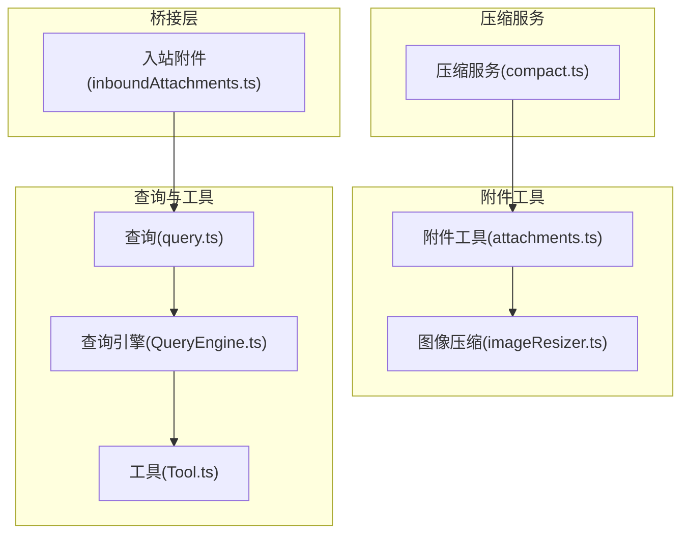
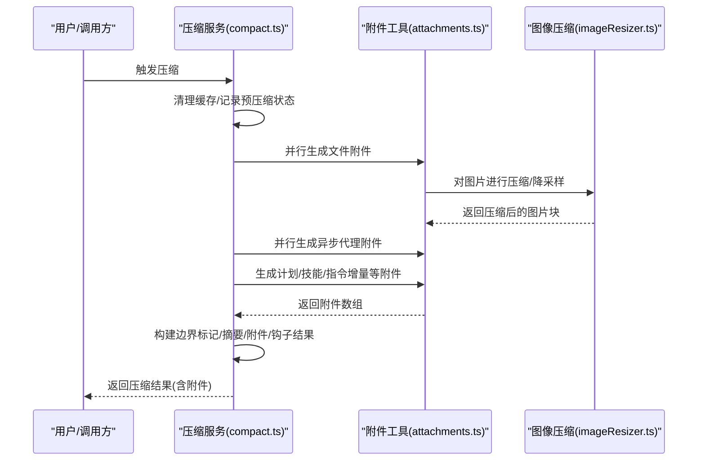
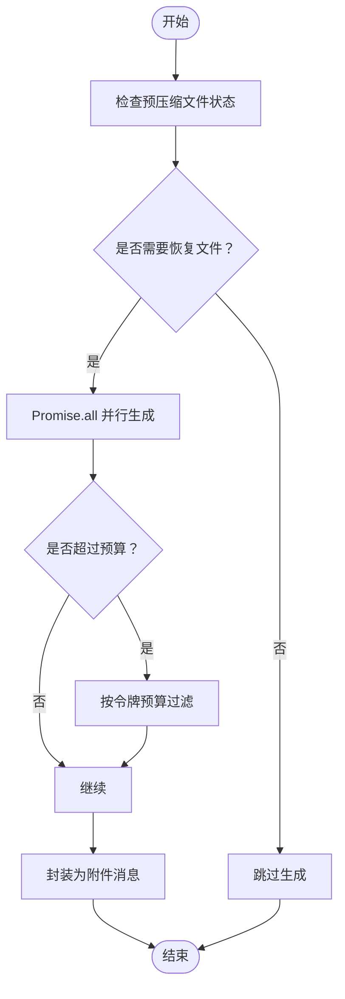
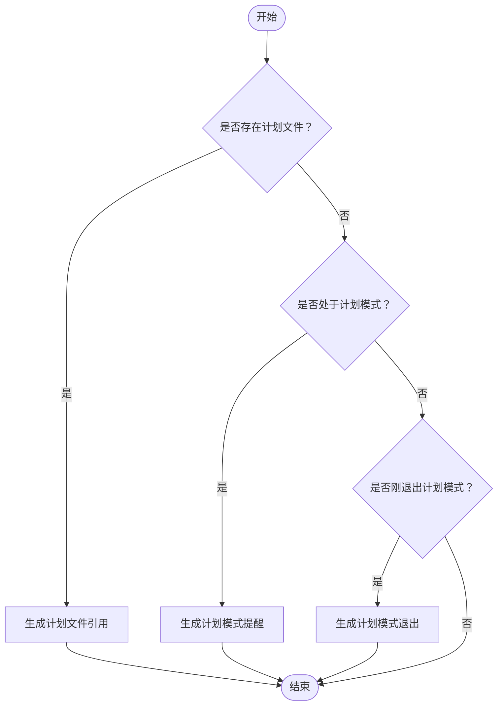
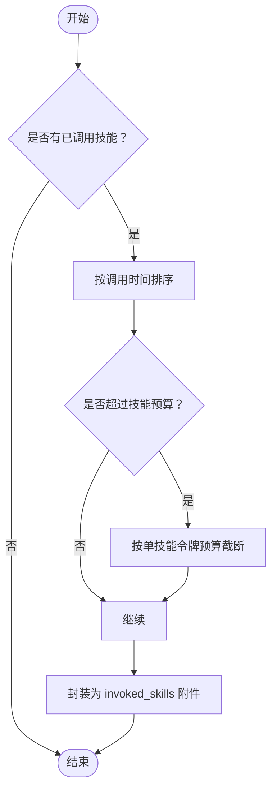
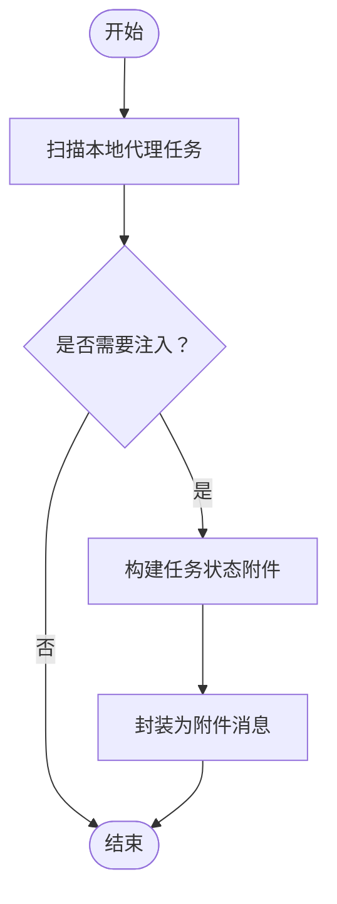
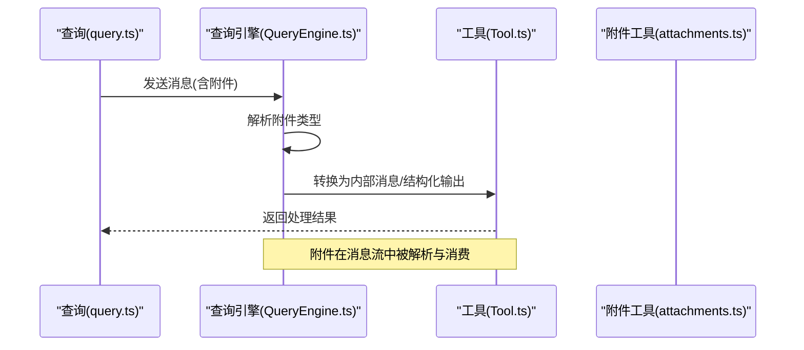
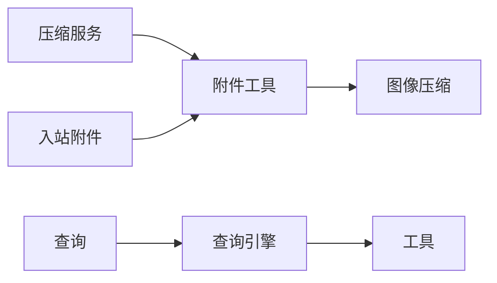

# 后处理附件生成

<cite>
**本文档引用的文件**
- [src/services/compact/compact.ts](file://src/services/compact/compact.ts)
- [src/utils/attachments.ts](file://src/utils/attachments.ts)
- [src/utils/imageResizer.ts](file://src/utils/imageResizer.ts)
- [src/bridge/inboundAttachments.ts](file://src/bridge/inboundAttachments.ts)
- [src/QueryEngine.ts](file://src/QueryEngine.ts)
- [src/Tool.ts](file://src/Tool.ts)
- [src/query.ts](file://src/query.ts)
</cite>

## 目录
1. [简介](#简介)
2. [项目结构](#项目结构)
3. [核心组件](#核心组件)
4. [架构总览](#架构总览)
5. [详细组件分析](#详细组件分析)
6. [依赖关系分析](#依赖关系分析)
7. [性能考量](#性能考量)
8. [故障排查指南](#故障排查指南)
9. [结论](#结论)
10. [附录](#附录)

## 简介
本文件面向 Claude Code Best 的“后处理附件生成”机制，系统性阐述压缩后生成的各类附件类型（文件附件、计划附件、技能附件、代理附件）的生成条件、内容格式与注入时机；解析并发处理策略与性能优化；阐明附件与压缩上下文的关系，以及如何确保信息的准确性与完整性；并给出可配置项与扩展点，帮助开发者理解压缩后内容的丰富化机制。

## 项目结构
围绕“后处理附件生成”，相关代码主要分布在以下模块：
- 压缩服务：负责在会话压缩完成后，异步生成并注入各类附件，以恢复关键上下文。
- 附件工具：统一定义附件类型、生成器与消息包装器，提供并发安全的附件收集与注入。
- 图像压缩：为图片类附件提供尺寸与格式优化，保障令牌预算。
- 桥接层：处理外部输入附件的解析与路径映射。
- 查询引擎与工具：承载附件在消息流中的解析与消费。

**图表来源**
- [src/services/compact/compact.ts:389-765](file://src/services/compact/compact.ts#L389-L765)
- [src/utils/attachments.ts:1-1004](file://src/utils/attachments.ts#L1-L1004)
- [src/utils/imageResizer.ts:498-628](file://src/utils/imageResizer.ts#L498-L628)
- [src/bridge/inboundAttachments.ts:115-134](file://src/bridge/inboundAttachments.ts#L115-L134)
- [src/QueryEngine.ts:844-906](file://src/QueryEngine.ts#L844-L906)
- [src/Tool.ts:33-325](file://src/Tool.ts#L33-L325)
- [src/query.ts:1511-1708](file://src/query.ts#L1511-L1708)

**章节来源**
- [src/services/compact/compact.ts:389-765](file://src/services/compact/compact.ts#L389-L765)
- [src/utils/attachments.ts:1-1004](file://src/utils/attachments.ts#L1-L1004)

## 核心组件
- 压缩后文件附件生成器：在压缩完成后，从预压缩时缓存的文件状态中批量生成文件附件，控制单文件令牌预算与总量预算，避免超限。
- 计划附件生成器：当存在计划文件或处于计划模式时，生成计划文件引用或计划模式提醒，确保模型在压缩后仍能延续计划工作流。
- 技能附件生成器：汇总本次会话中调用过的技能内容，按令牌预算截断并注入，避免重复注入全量技能列表。
- 代理附件生成器：扫描后台运行或未完成的本地代理任务，生成任务状态附件，防止重复执行或遗漏结果。
- 并发附件收集：通过 Promise.all 并行生成文件附件与异步代理附件，同时分线程与主线程两类附件并行处理，缩短整体延迟。
- 附件消息包装：将任意附件封装为标准的附件消息，统一注入到压缩后的消息序列中。

**章节来源**
- [src/services/compact/compact.ts:533-563](file://src/services/compact/compact.ts#L533-L563)
- [src/utils/attachments.ts:3201-3211](file://src/utils/attachments.ts#L3201-L3211)

## 架构总览
下图展示压缩后附件生成的端到端流程：压缩服务触发附件生成，附件工具并行收集各类附件，再由压缩服务构建最终消息序列。

**图表来源**
- [src/services/compact/compact.ts:533-587](file://src/services/compact/compact.ts#L533-L587)
- [src/utils/attachments.ts:1006-1043](file://src/utils/attachments.ts#L1006-L1043)
- [src/utils/imageResizer.ts:498-628](file://src/utils/imageResizer.ts#L498-L628)

## 详细组件分析

### 文件附件生成
- 生成条件
  - 预压缩阶段已缓存文件状态，压缩后基于该状态重建附件。
  - 控制最大恢复文件数与单文件令牌预算，避免超出上下文限制。
- 内容格式
  - 支持完整文件内容、仅文件引用、PDF 引用、以及“已读过”的轻量提示。
  - 大文件自动截断，保留前若干行，避免令牌超限。
- 注入时机
  - 在压缩成功后、构建最终消息之前注入，确保后续令牌统计与预算控制准确。
- 并发策略
  - 使用 Promise.all 并行生成多个文件附件，显著降低等待时间。
- 性能优化
  - 若文件未修改且存在于上下文中，则返回“已读过”附件，避免重复传输。
  - 图片附件在生成前进行压缩与降采样，减少令牌占用。

**图表来源**
- [src/services/compact/compact.ts:1417-1467](file://src/services/compact/compact.ts#L1417-L1467)
- [src/utils/attachments.ts:3021-3200](file://src/utils/attachments.ts#L3021-L3200)

**章节来源**
- [src/services/compact/compact.ts:1417-1467](file://src/services/compact/compact.ts#L1417-L1467)
- [src/utils/attachments.ts:3021-3200](file://src/utils/attachments.ts#L3021-L3200)

### 计划附件生成
- 生成条件
  - 存在计划文件或当前处于计划模式。
- 内容格式
  - 计划文件引用：包含计划文件路径与内容。
  - 计划模式提醒：包含提醒类型（全量/稀疏）、是否子代理、计划文件是否存在等。
  - 计划模式退出：一次性通知，用于告知模型已退出计划模式。
- 注入时机
  - 在压缩完成后，若满足条件即注入，确保模型在压缩后仍保持计划工作流。
- 并发策略
  - 与文件附件并行生成，不阻塞主流程。

**图表来源**
- [src/services/compact/compact.ts:1473-1489](file://src/services/compact/compact.ts#L1473-L1489)
- [src/utils/attachments.ts:1233-1274](file://src/utils/attachments.ts#L1233-L1274)

**章节来源**
- [src/services/compact/compact.ts:1473-1489](file://src/services/compact/compact.ts#L1473-L1489)
- [src/utils/attachments.ts:1233-1274](file://src/utils/attachments.ts#L1233-L1274)

### 技能附件生成
- 生成条件
  - 本次会话中调用过技能。
- 内容格式
  - 技能清单：包含技能名称、路径与内容（按令牌预算截断）。
- 注入时机
  - 在压缩完成后，按最近调用时间排序，优先保留最相关的技能内容。
- 并发策略
  - 与文件附件并行生成，避免阻塞。

**图表来源**
- [src/services/compact/compact.ts:1497-1537](file://src/services/compact/compact.ts#L1497-L1537)

**章节来源**
- [src/services/compact/compact.ts:1497-1537](file://src/services/compact/compact.ts#L1497-L1537)

### 代理附件生成
- 生成条件
  - 存在后台运行或尚未检索结果的本地代理任务。
- 内容格式
  - 任务状态：包含任务 ID、类型、描述、状态、增量摘要、输出文件路径等。
- 注入时机
  - 在压缩完成后，对每个符合条件的代理任务生成状态附件，避免重复执行或遗漏结果。
- 并发策略
  - 与文件附件并行生成，提升吞吐。

**图表来源**
- [src/services/compact/compact.ts:1571-1602](file://src/services/compact/compact.ts#L1571-L1602)

**章节来源**
- [src/services/compact/compact.ts:1571-1602](file://src/services/compact/compact.ts#L1571-L1602)

### 并发处理策略与性能优化
- 并发策略
  - 文件附件与异步代理附件通过 Promise.all 并行生成，显著降低总等待时间。
  - 线程级附件与主线程附件也并行处理，进一步缩短生成周期。
- 性能优化
  - 预压缩缓存文件状态，压缩后直接复用，避免重复读取。
  - 图像压缩采用多策略回退，优先保持原格式，必要时转 JPEG，兼顾质量与体积。
  - 令牌预算控制：单文件与技能内容均设置上限，避免超限导致的失败重试。
  - “已读过”优化：若文件未修改，直接返回“已读过”附件，避免重复传输。

**章节来源**
- [src/services/compact/compact.ts:533-563](file://src/services/compact/compact.ts#L533-L563)
- [src/utils/attachments.ts:1006-1043](file://src/utils/attachments.ts#L1006-L1043)
- [src/utils/imageResizer.ts:498-628](file://src/utils/imageResizer.ts#L498-L628)

### 附件与压缩上下文的关系
- 压缩前：附件工具根据用户输入、IDE 选择、队列命令、工具/代理/MCP 指令变化等生成附件，这些附件可能被压缩器丢弃或合并。
- 压缩后：压缩服务重新注入关键附件（文件、计划、技能、代理），并补充指令增量与工具状态，确保模型在压缩后仍具备完整上下文。
- 消息解析：查询引擎与工具侧对附件进行解析与消费，例如将附件转换为用户消息或结构化输出。

**图表来源**
- [src/query.ts:1511-1708](file://src/query.ts#L1511-L1708)
- [src/QueryEngine.ts:844-906](file://src/QueryEngine.ts#L844-L906)
- [src/Tool.ts:33-325](file://src/Tool.ts#L33-L325)

**章节来源**
- [src/query.ts:1511-1708](file://src/query.ts#L1511-L1708)
- [src/QueryEngine.ts:844-906](file://src/QueryEngine.ts#L844-L906)
- [src/Tool.ts:33-325](file://src/Tool.ts#L33-L325)

## 依赖关系分析
- 压缩服务依赖附件工具提供的生成器与消息包装器，以保证附件的一致性与可注入性。
- 附件工具依赖图像压缩模块对图片进行优化，以满足令牌预算。
- 桥接层负责将外部输入附件解析为本地路径，供附件工具使用。
- 查询引擎与工具负责消费附件，将其转换为模型可见的内容。

**图表来源**
- [src/services/compact/compact.ts:37-42](file://src/services/compact/compact.ts#L37-L42)
- [src/utils/attachments.ts:73-73](file://src/utils/attachments.ts#L73-L73)
- [src/bridge/inboundAttachments.ts:115-134](file://src/bridge/inboundAttachments.ts#L115-L134)
- [src/query.ts:1511-1708](file://src/query.ts#L1511-L1708)
- [src/QueryEngine.ts:844-906](file://src/QueryEngine.ts#L844-L906)
- [src/Tool.ts:33-325](file://src/Tool.ts#L33-L325)

**章节来源**
- [src/services/compact/compact.ts:37-42](file://src/services/compact/compact.ts#L37-L42)
- [src/utils/attachments.ts:73-73](file://src/utils/attachments.ts#L73-L73)
- [src/bridge/inboundAttachments.ts:115-134](file://src/bridge/inboundAttachments.ts#L115-L134)

## 性能考量
- 并行化：通过 Promise.all 并行生成文件与代理附件，显著降低延迟。
- 预算控制：为单文件与技能内容设置明确的令牌上限，避免超限导致的失败与重试。
- 缓存复用：利用预压缩缓存与“已读过”优化，减少不必要的 IO 与网络传输。
- 图像优化：在生成前进行压缩与降采样，降低令牌占用，提高吞吐。
- 令牌估算：在构建最终消息前进行粗略令牌估算，辅助判断是否需要再次触发自动压缩。

[本节为通用指导，无需特定文件引用]

## 故障排查指南
- 附件未注入
  - 检查生成器的触发条件（如计划文件存在、技能被调用、代理任务状态）。
  - 确认并发生成是否因异常而提前失败，查看日志事件与错误分支。
- 令牌超限
  - 检查单文件与技能内容的截断逻辑是否生效。
  - 核对预算常量与实际使用情况，必要时调整阈值。
- 图像过大
  - 确认图像压缩策略是否正确应用，必要时检查媒体类型与尺寸。
- 附件解析异常
  - 在查询引擎与工具侧检查附件类型解析分支，确保新增类型有对应处理。

**章节来源**
- [src/utils/attachments.ts:1006-1043](file://src/utils/attachments.ts#L1006-L1043)
- [src/utils/imageResizer.ts:498-628](file://src/utils/imageResizer.ts#L498-L628)
- [src/QueryEngine.ts:844-906](file://src/QueryEngine.ts#L844-L906)

## 结论
后处理附件生成通过“压缩后重建关键上下文”的方式，在保证令牌预算与性能的前提下，最大化地恢复文件、计划、技能与代理等重要信息。其并发策略与预算控制有效降低了延迟并提升了稳定性；与压缩上下文的紧密耦合确保了模型在压缩后仍能维持一致的工作流。开发者可通过配置预算参数与扩展附件类型，进一步定制化丰富化机制。

[本节为总结，无需特定文件引用]

## 附录

### 附件类型与生成条件速览
- 文件附件
  - 条件：预压缩文件状态存在且未超过预算
  - 格式：文件内容、文件引用、PDF 引用、已读过提示
  - 注入：压缩完成后并行生成
- 计划附件
  - 条件：存在计划文件或处于计划模式
  - 格式：计划文件引用、计划模式提醒、计划模式退出
  - 注入：压缩完成后按需生成
- 技能附件
  - 条件：会话中调用过技能
  - 格式：invoked_skills（按调用时间排序与截断）
  - 注入：压缩完成后并行生成
- 代理附件
  - 条件：存在后台运行或未检索结果的本地代理任务
  - 格式：任务状态（ID、类型、描述、状态、摘要、输出路径）
  - 注入：压缩完成后并行生成

**章节来源**
- [src/services/compact/compact.ts:1417-1602](file://src/services/compact/compact.ts#L1417-L1602)
- [src/utils/attachments.ts:3021-3200](file://src/utils/attachments.ts#L3021-L3200)
- [src/utils/attachments.ts:1233-1274](file://src/utils/attachments.ts#L1233-L1274)