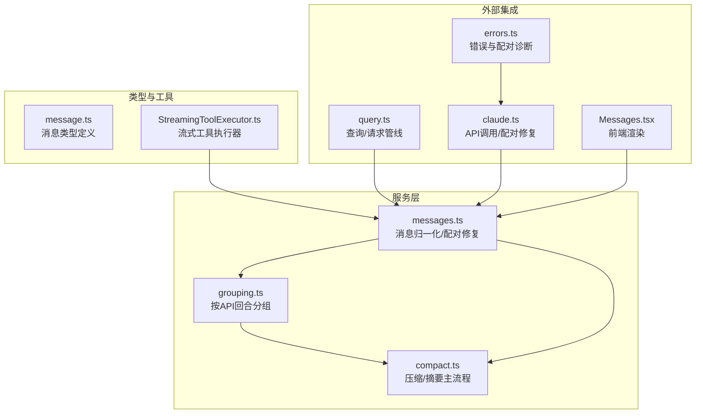
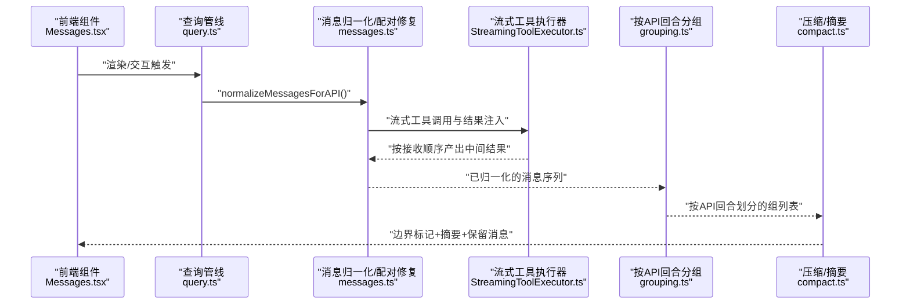
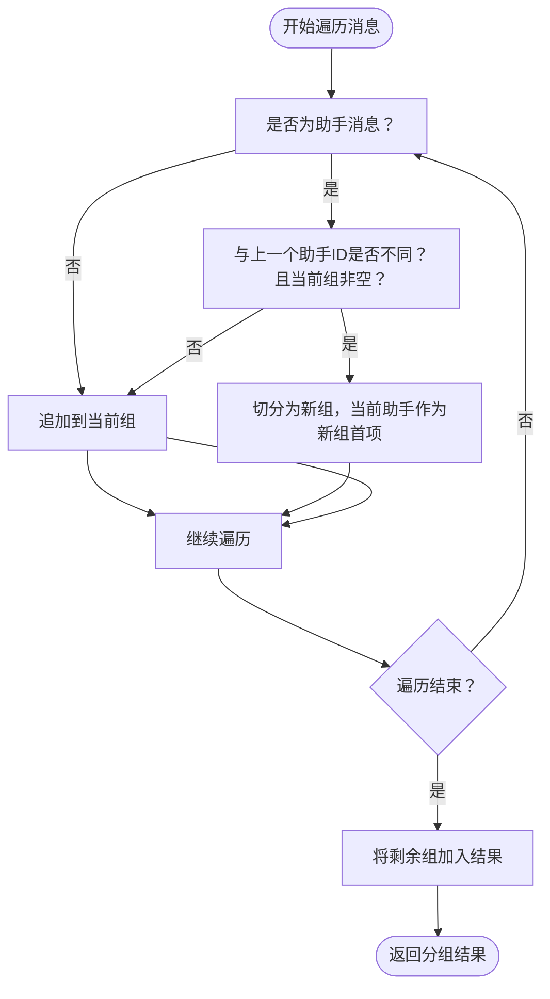
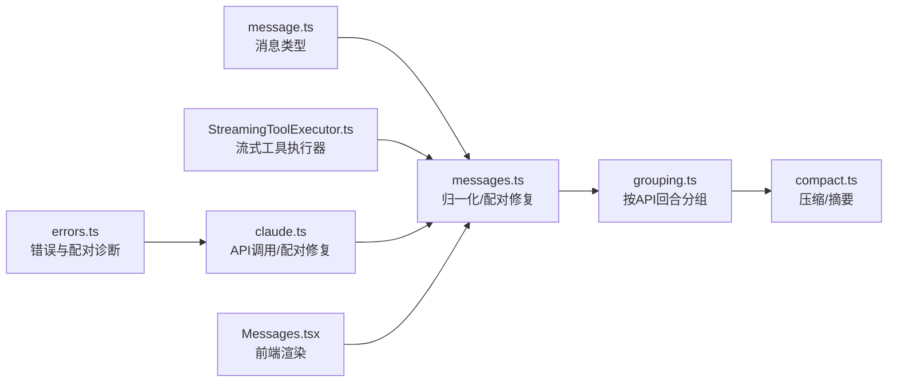

# 消息分组策略

<cite>
**本文引用的文件**
- [grouping.ts](file://src/services/compact/grouping.ts)
- [grouping.test.ts](file://src/services/compact/__tests__/grouping.test.ts)
- [message.ts](file://src/types/message.ts)
- [messages.ts](file://src/utils/messages.ts)
- [compact.ts](file://src/services/compact/compact.ts)
- [StreamingToolExecutor.ts](file://src/services/tools/StreamingToolExecutor.ts)
- [claude.ts](file://src/services/api/claude.ts)
- [errors.ts](file://src/services/api/errors.ts)
- [query.ts](file://src/query.ts)
- [messages.tsx](file://src/components/Messages.tsx)
</cite>

## 目录
1. [引言](#引言)
2. [项目结构](#项目结构)
3. [核心组件](#核心组件)
4. [架构总览](#架构总览)
5. [详细组件分析](#详细组件分析)
6. [依赖关系分析](#依赖关系分析)
7. [性能考量](#性能考量)
8. [故障排查指南](#故障排查指南)
9. [结论](#结论)
10. [附录](#附录)

## 引言
本文件面向开发者与技术文档读者，系统阐述 Claude Code Best 中“基于 API 轮次”的消息分组策略。该策略以“API 回合边界”为核心，确保每个由同一助手响应 ID 标识的完整回合作为一个独立分组，从而在压缩、摘要与上下文管理中获得更强的一致性与可操作性。本文将从算法原理、消息类型行为、时间戳与上下文连续性、聚合规则、压缩影响与性能优化等维度进行深入解析，并辅以图示与来源标注，帮助读者快速掌握消息组织的核心机制。

## 项目结构
围绕消息分组的关键代码分布在以下模块：
- 分组算法：位于服务层的分组模块，负责按 API 回合边界切分消息序列。
- 类型定义：统一的消息类型与字段约定，支撑分组与后续处理。
- 工具与归一化：消息归一化、工具配对修复、流式工具执行器等，影响分组的输入与顺序。
- 压缩与摘要：压缩流程依赖分组结果进行段落级处理，提升摘要质量与效率。
- 组件渲染：前端组件在展示层面也依赖分组与归一化后的消息结构。

图表来源
- [grouping.ts:1-64](file://src/services/compact/grouping.ts#L1-L64)
- [messages.ts:1-200](file://src/utils/messages.ts#L1-L200)
- [compact.ts:1-200](file://src/services/compact/compact.ts#L1-L200)
- [message.ts:1-168](file://src/types/message.ts#L1-L168)
- [StreamingToolExecutor.ts:34-71](file://src/services/tools/StreamingToolExecutor.ts#L34-L71)
- [claude.ts:78-1314](file://src/services/api/claude.ts#L78-L1314)
- [errors.ts:272-304](file://src/services/api/errors.ts#L272-L304)
- [query.ts:562-916](file://src/query.ts#L562-L916)
- [messages.tsx:483-540](file://src/components/Messages.tsx#L483-L540)

章节来源
- [grouping.ts:1-64](file://src/services/compact/grouping.ts#L1-L64)
- [message.ts:1-168](file://src/types/message.ts#L1-L168)

## 核心组件
- 分组算法（按 API 回合）：根据“助手消息的 message.id 是否变化”作为唯一边界判定条件，确保同一轮次内的流式分块与工具结果保持在同一组内；同时保证“当前组非空”时才触发新组，避免无意义切分。
- 消息类型体系：统一的 Message 接口与子类型（用户、助手、系统、附件、进度、分组工具使用、折叠读搜索等），为分组与后续处理提供稳定的结构基础。
- 归一化与配对修复：在进入分组前，通过归一化与 ensureToolResultPairing 修复工具使用与结果的配对问题，确保分组边界在语义上安全可靠。
- 流式工具执行器：在流式生成过程中，工具调用与结果以正确顺序插入，配合分组算法维持回合内顺序一致性。
- 压缩与摘要：压缩流程以分组为单位进行段落级处理，结合边界标记与保留段元数据，提升摘要质量并控制上下文长度。

章节来源
- [grouping.ts:22-63](file://src/services/compact/grouping.ts#L22-L63)
- [message.ts:33-71](file://src/types/message.ts#L33-L71)
- [messages.ts:5161-5499](file://src/utils/messages.ts#L5161-L5499)
- [StreamingToolExecutor.ts:40-71](file://src/services/tools/StreamingToolExecutor.ts#L40-L71)
- [compact.ts:117-122](file://src/services/compact/compact.ts#L117-L122)

## 架构总览
下图展示了从消息输入到分组、再到压缩摘要的整体流程，强调“API 回合边界”在其中的关键作用。

图表来源
- [messages.tsx:483-540](file://src/components/Messages.tsx#L483-L540)
- [query.ts:562-916](file://src/query.ts#L562-L916)
- [messages.ts:5161-5499](file://src/utils/messages.ts#L5161-L5499)
- [StreamingToolExecutor.ts:40-71](file://src/services/tools/StreamingToolExecutor.ts#L40-L71)
- [grouping.ts:22-63](file://src/services/compact/grouping.ts#L22-L63)
- [compact.ts:117-122](file://src/services/compact/compact.ts#L117-L122)

## 详细组件分析

### 分组算法：按 API 回合切分
- 边界判定：仅当遇到“类型为助手且其 message.id 与上一个助手消息不同”，并且当前组非空时，才将当前助手消息作为新组起点。这确保了同一轮次内的所有流式分块与工具结果被合并到同一组。
- 同一轮次内聚合：同一 message.id 的多个助手消息（如流式分块）始终属于同一组，避免将同一回合拆散。
- 系统消息与用户消息：系统消息与用户消息会进入当前组，不会触发新组；只有当出现新的助手消息且满足上述条件时才切分。
- 结果特性：不产生空组；保持组内消息顺序不变；支持单个助手消息、全用户消息、多轮次等多样输入。

图表来源
- [grouping.ts:22-63](file://src/services/compact/grouping.ts#L22-L63)

章节来源
- [grouping.ts:22-63](file://src/services/compact/grouping.ts#L22-L63)
- [grouping.test.ts:11-121](file://src/services/compact/__tests__/grouping.test.ts#L11-L121)

### 消息类型与分组行为
- 用户消息：进入当前组，不触发新组；连续用户消息保持在同一组内。
- 助手消息：作为分组边界的主要依据；同 ID 的多个助手消息（流式分块）保持在同一组。
- 系统消息：进入当前组，不影响边界；若其后紧接新 ID 的助手消息且当前组非空，则触发新组。
- 工具结果（用户侧）：在助手消息之后出现时，仍属于同一组，不打断回合边界。
- 附件/进度/折叠读搜索等：作为普通内容块参与分组，不改变边界逻辑。

章节来源
- [message.ts:19-164](file://src/types/message.ts#L19-L164)
- [grouping.test.ts:100-120](file://src/services/compact/__tests__/grouping.test.ts#L100-L120)

### 时间戳与上下文连续性
- 时间戳：分组算法本身不直接处理时间戳，但消息归一化与前端渲染会利用时间戳与 UUID 进行显示与链路追踪。压缩流程通过“边界标记”与“保留段元数据”维护上下文的前后关系。
- 上下文连续性：分组以“API 回合”为单位，天然契合模型 API 的工具使用与结果配对契约，确保摘要与压缩在语义上正确的段落边界进行。

章节来源
- [messages.ts:4572-4596](file://src/utils/messages.ts#L4572-L4596)
- [compact.ts:351-369](file://src/services/compact/compact.ts#L351-L369)

### 聚合规则与顺序保证
- 聚合规则：同一轮次内的助手分块与工具结果按到达顺序聚合；系统与用户消息按出现顺序进入当前组。
- 顺序保证：分组过程中严格保持输入顺序；最终组内顺序与输入一致，避免重排带来的语义偏差。
- 边界修复：对于异常输入（如断点续跑或截断导致的悬空工具使用），在 API 层通过 ensureToolResultPairing 修复配对，再由分组算法在“新 ID + 当前组非空”条件下安全切分。

章节来源
- [grouping.ts:34-42](file://src/services/compact/grouping.ts#L34-L42)
- [messages.ts:5161-5499](file://src/utils/messages.ts#L5161-L5499)
- [claude.ts:1311-1314](file://src/services/api/claude.ts#L1311-L1314)

### 对压缩效果与摘要质量的影响
- 更细粒度的分组：相比按“人类回合”切分，API 回合分组更精细，允许在单提示代理会话中对每个回合分别进行压缩与摘要，提升摘要针对性与上下文利用率。
- 边界标记与保留段：压缩后通过边界标记与“保留段”元数据，明确哪些消息应被保留、如何重建链路，减少信息丢失并提升检索与回溯能力。
- 压缩流程入口：压缩主流程显式依赖分组结果，先按组切分，再进行摘要生成与消息保留策略，最后构建后压缩消息数组。

章节来源
- [grouping.ts:3-21](file://src/services/compact/grouping.ts#L3-L21)
- [compact.ts:117-122](file://src/services/compact/compact.ts#L117-L122)
- [compact.ts:332-340](file://src/services/compact/compact.ts#L332-L340)
- [compact.ts:351-369](file://src/services/compact/compact.ts#L351-L369)

### 实现细节与性能考虑
- 时间复杂度：线性扫描一次消息序列，时间复杂度 O(n)，空间开销主要来自结果分组数组与当前组缓存，整体为 O(n)。
- 边界判定常量：仅比较最近一个助手消息的 ID，无需额外状态机或回溯，实现简洁高效。
- 流式与并发：流式工具执行器保证结果顺序与并发安全，避免分组阶段出现乱序；前端渲染也针对流式工具使用做了去重与稳定键处理，间接保障分组稳定性。
- 错误与异常：当输入存在悬空工具使用时，API 层的配对修复会在分组前完成，确保边界判定不受异常输入干扰。

章节来源
- [grouping.ts:22-63](file://src/services/compact/grouping.ts#L22-L63)
- [StreamingToolExecutor.ts:40-71](file://src/services/tools/StreamingToolExecutor.ts#L40-L71)
- [messages.ts:5161-5499](file://src/utils/messages.ts#L5161-L5499)
- [messages.tsx:525-540](file://src/components/Messages.tsx#L525-L540)

## 依赖关系分析
- 分组算法依赖消息类型定义与归一化工具；压缩流程进一步依赖分组结果与边界标记生成。
- API 层在调用前通过 ensureToolResultPairing 修复配对问题，为分组提供“语义安全”的输入。
- 查询管线在不同阶段多次调用归一化与工具执行器，确保分组输入的完整性与顺序正确。

图表来源
- [message.ts:1-168](file://src/types/message.ts#L1-L168)
- [messages.ts:5161-5499](file://src/utils/messages.ts#L5161-L5499)
- [grouping.ts:1-64](file://src/services/compact/grouping.ts#L1-L64)
- [compact.ts:117-122](file://src/services/compact/compact.ts#L117-L122)
- [StreamingToolExecutor.ts:40-71](file://src/services/tools/StreamingToolExecutor.ts#L40-L71)
- [claude.ts:78-1314](file://src/services/api/claude.ts#L78-L1314)
- [errors.ts:272-304](file://src/services/api/errors.ts#L272-L304)
- [messages.tsx:483-540](file://src/components/Messages.tsx#L483-L540)

章节来源
- [grouping.ts:1-64](file://src/services/compact/grouping.ts#L1-L64)
- [messages.ts:1-200](file://src/utils/messages.ts#L1-L200)
- [compact.ts:1-200](file://src/services/compact/compact.ts#L1-L200)

## 性能考量
- 线性分组：单次遍历，常数级额外状态，适合长会话与高吞吐场景。
- 顺序与并发：流式工具执行器保证顺序与并发安全，避免额外排序成本。
- 压缩阶段：分组后按组处理，减少跨回合的上下文污染，提升摘要质量与内存占用可控性。
- 建议：在大规模消息流中，优先确保输入已归一化与配对修复完成，以减少异常路径的额外处理。

## 故障排查指南
- 症状：分组后出现异常切分或遗漏工具结果
  - 可能原因：输入未经过 ensureToolResultPairing 修复，导致工具使用与结果未正确配对
  - 处理：确认 API 层配对修复已在调用前执行；检查消息序列是否包含悬空工具使用
- 症状：流式工具结果顺序错乱
  - 可能原因：工具执行器并发策略或结果缓冲未正确应用
  - 处理：核对流式工具执行器的并发与顺序保证逻辑；确保前端渲染对流式工具使用做了稳定键处理
- 症状：边界标记未生效或链路重建失败
  - 可能原因：边界标记缺失或保留段元数据不完整
  - 处理：确认压缩流程中边界标记与“保留段”元数据的生成与传递

章节来源
- [messages.ts:5161-5499](file://src/utils/messages.ts#L5161-L5499)
- [claude.ts:1311-1314](file://src/services/api/claude.ts#L1311-L1314)
- [errors.ts:272-304](file://src/services/api/errors.ts#L272-L304)
- [StreamingToolExecutor.ts:40-71](file://src/services/tools/StreamingToolExecutor.ts#L40-L71)
- [compact.ts:351-369](file://src/services/compact/compact.ts#L351-L369)

## 结论
“按 API 回合”的消息分组策略以助手消息 ID 为唯一边界判定条件，兼顾了流式分块与工具结果的聚合需求，同时在语义上与模型 API 的工具使用契约保持一致。该策略为压缩与摘要提供了更细粒度、更可靠的段落边界，显著提升了摘要质量与上下文连续性。通过归一化与配对修复的前置处理，以及流式工具执行器的顺序保障，分组算法在复杂场景下仍能保持高性能与高可靠性。

## 附录
- 关键流程参考路径
  - 分组算法实现：[grouping.ts:22-63](file://src/services/compact/grouping.ts#L22-L63)
  - 单元测试覆盖：[grouping.test.ts:11-121](file://src/services/compact/__tests__/grouping.test.ts#L11-L121)
  - 消息类型定义：[message.ts:33-71](file://src/types/message.ts#L33-L71)
  - 归一化与配对修复：[messages.ts:5161-5499](file://src/utils/messages.ts#L5161-L5499)
  - 压缩流程入口与边界标记：[compact.ts:117-122](file://src/services/compact/compact.ts#L117-L122), [compact.ts:351-369](file://src/services/compact/compact.ts#L351-L369)
  - 流式工具执行器：[StreamingToolExecutor.ts:40-71](file://src/services/tools/StreamingToolExecutor.ts#L40-L71)
  - API 层配对修复与错误诊断：[claude.ts:1311-1314](file://src/services/api/claude.ts#L1311-L1314), [errors.ts:272-304](file://src/services/api/errors.ts#L272-L304)
  - 前端渲染与流式工具使用处理：[messages.tsx:525-540](file://src/components/Messages.tsx#L525-L540)