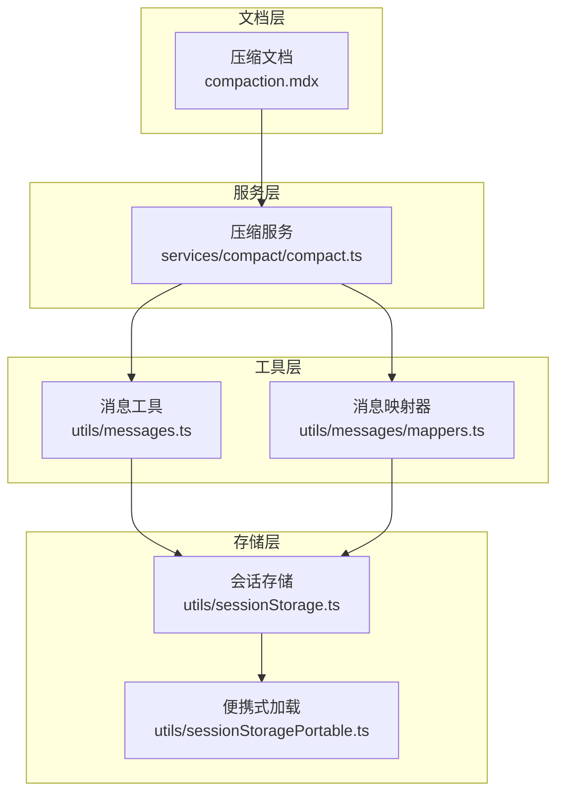
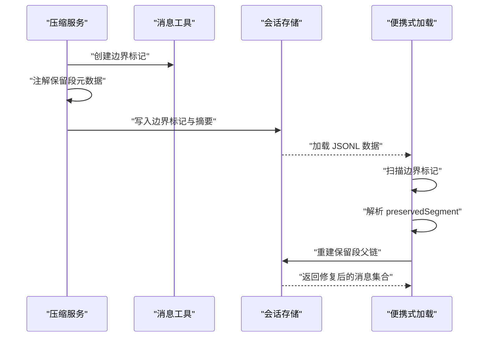
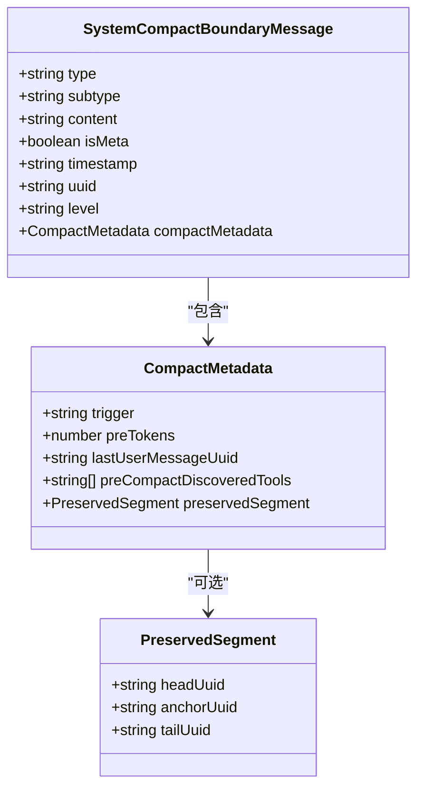
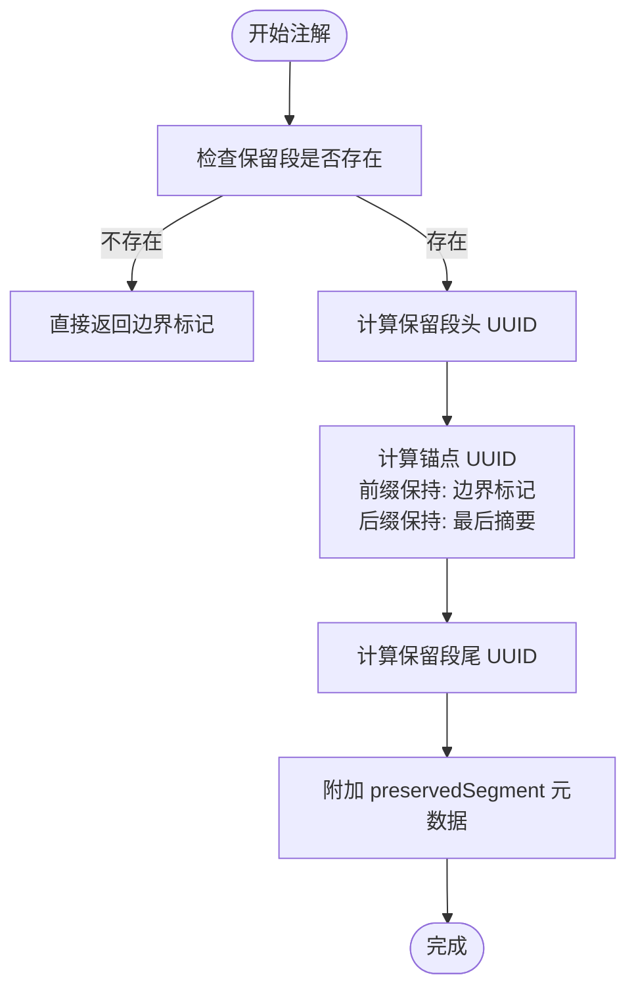
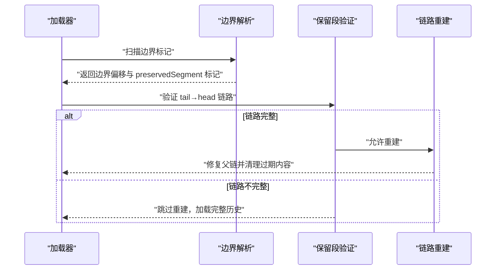
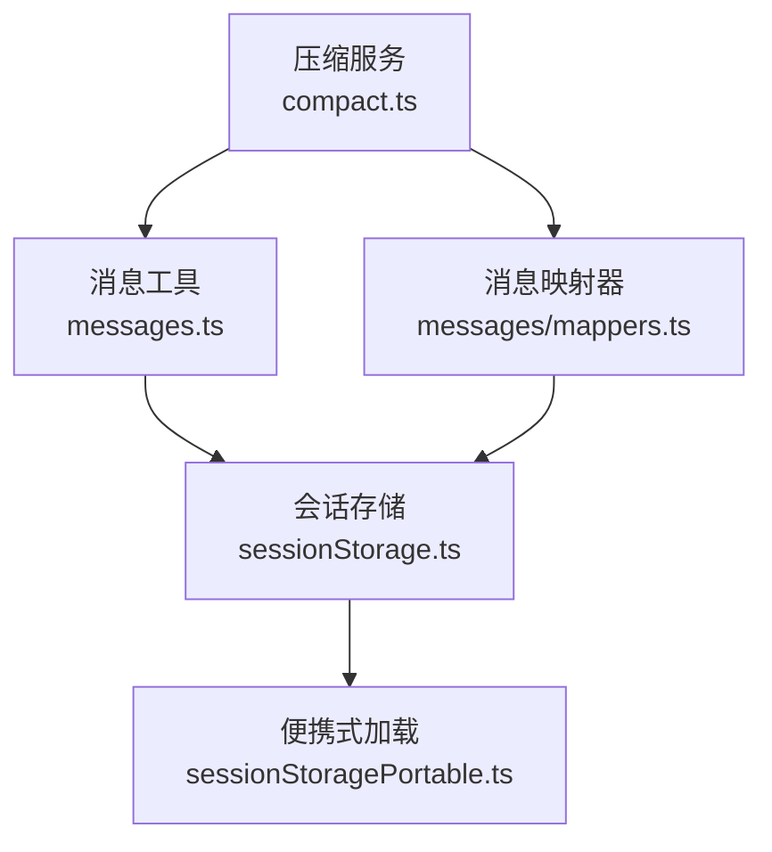

# 边界标记机制

<cite>
**本文档引用的文件**
- [compaction.mdx](file://docs/context/compaction.mdx)
- [compact.ts](file://src/services/compact/compact.ts)
- [messages.ts](file://src/utils/messages.ts)
- [messages/mappers.ts](file://src/utils/messages/mappers.ts)
- [sessionStorage.ts](file://src/utils/sessionStorage.ts)
- [sessionStoragePortable.ts](file://src/utils/sessionStoragePortable.ts)
- [messages.ts](file://src/utils/messages.ts)
</cite>

## 目录
1. [简介](#简介)
2. [项目结构](#项目结构)
3. [核心组件](#核心组件)
4. [架构概览](#架构概览)
5. [详细组件分析](#详细组件分析)
6. [依赖分析](#依赖分析)
7. [性能考虑](#性能考虑)
8. [故障排除指南](#故障排除指南)
9. [结论](#结论)

## 简介
本文件深入解析 Claude Code Best 的边界标记机制，重点阐述压缩边界标记的设计目的、实现原理与运行流程。边界标记用于在压缩过程中标识保留段落的锚点，确保压缩后的上下文连续性与消息关系完整性。文档将详细说明前缀保持与后缀保持两种策略的区别与适用场景，并解释边界标记的元数据结构（头 UUID、锚 UUID、尾 UUID）及其在会话恢复中的作用。

## 项目结构
边界标记机制涉及多个层次的实现：
- 文档层：在压缩文档中明确边界标记的概念与用途
- 服务层：压缩服务负责创建边界标记、注解保留段元数据
- 工具层：消息工具函数负责边界标记的识别与范围切分
- 存储层：会话存储负责在加载时根据边界标记重建消息链并验证保留段

**图表来源**
- [compaction.mdx](file://docs/context/compaction.mdx)
- [compact.ts](file://src/services/compact/compact.ts)
- [messages.ts](file://src/utils/messages.ts)
- [messages/mappers.ts](file://src/utils/messages/mappers.ts)
- [sessionStorage.ts](file://src/utils/sessionStorage.ts)
- [sessionStoragePortable.ts](file://src/utils/sessionStoragePortable.ts)

**章节来源**
- [compaction.mdx](file://docs/context/compaction.mdx)
- [compact.ts](file://src/services/compact/compact.ts)
- [messages.ts](file://src/utils/messages.ts)
- [messages/mappers.ts](file://src/utils/messages/mappers.ts)
- [sessionStorage.ts](file://src/utils/sessionStorage.ts)
- [sessionStoragePortable.ts](file://src/utils/sessionStoragePortable.ts)

## 核心组件
- 边界标记消息体：系统消息类型为 compact_boundary，携带压缩触发方式、压缩前 token 数、最后用户消息 UUID 等基础元数据
- 保留段注解：在边界标记上附加 preservedSegment，记录保留段的头 UUID、锚 UUID、尾 UUID
- 边界标记识别：通过 subtype 判断是否为边界标记，并支持向前向后扫描定位
- 保留段重建：在会话加载时，依据 preservedSegment 将保留段重新拼接到链表中，修复父链并清理过期内容

**章节来源**
- [messages.ts](file://src/utils/messages.ts)
- [compact.ts](file://src/services/compact/compact.ts)
- [sessionStorage.ts](file://src/utils/sessionStorage.ts)

## 架构概览
边界标记贯穿压缩与恢复两大阶段：
- 创建阶段：压缩服务在生成摘要后插入边界标记，并根据策略注解保留段元数据
- 校验与重建阶段：加载器扫描边界标记，验证保留段完整性，修复父链并删除过期内容

**图表来源**
- [compact.ts](file://src/services/compact/compact.ts)
- [messages.ts](file://src/utils/messages.ts)
- [sessionStorage.ts](file://src/utils/sessionStorage.ts)
- [sessionStoragePortable.ts](file://src/utils/sessionStoragePortable.ts)

## 详细组件分析

### 边界标记消息体与识别
- 边界标记消息体字段：type='system'、subtype='compact_boundary'，包含 compactMetadata（触发方式、压缩前 token 数、最后用户消息 UUID、发现工具列表等）
- 识别方法：通过 isCompactBoundaryMessage 判断消息类型；通过 findLastCompactBoundaryIndex 获取最后一个边界标记索引
- 范围切分：getMessagesAfterCompactBoundary 返回从最后一个边界标记开始的子序列，便于后续处理

**图表来源**
- [messages.ts](file://src/utils/messages.ts)
- [messages/mappers.ts](file://src/utils/messages/mappers.ts)

**章节来源**
- [messages.ts](file://src/utils/messages.ts)
- [messages/mappers.ts](file://src/utils/messages/mappers.ts)

### 保留段注解与策略
- 注解函数：annotateBoundaryWithPreservedSegment 在边界标记上附加 preservedSegment，记录保留段的头、锚、尾 UUID
- 策略差异：
  - 前缀保持（prefix-preserving）：锚点为边界标记自身，保留段位于边界标记之后
  - 后缀保持（suffix-preserving）：锚点为最后一个摘要消息，保留段位于摘要之后
- 适用场景：
  - 前缀保持：适用于局部压缩（partial compact），希望保留边界标记之前的上下文
  - 后缀保持：适用于会话内存压缩（session memory compact），希望保留最近摘要之后的上下文

**图表来源**
- [compact.ts](file://src/services/compact/compact.ts)

**章节来源**
- [compact.ts](file://src/services/compact/compact.ts)

### 加载与验证流程
- 便携式加载：scanChunkLines 与 processStraddle 在流式读取中扫描边界标记，遇到边界则截断输出，同时解析 preservedSegment
- 保留段验证：applyPreservedSegmentRelinks 在加载完成后验证 tail→head 链路完整性，若不完整则跳过重建，确保恢复时加载完整历史
- 父链修复：将保留段头的父链指向锚点，锚点的其他子节点指向保留段尾，清理过期内容

**图表来源**
- [sessionStoragePortable.ts](file://src/utils/sessionStoragePortable.ts)
- [sessionStorage.ts](file://src/utils/sessionStorage.ts)

**章节来源**
- [sessionStoragePortable.ts](file://src/utils/sessionStoragePortable.ts)
- [sessionStorage.ts](file://src/utils/sessionStorage.ts)

### 元数据结构详解
- compactMetadata 字段：
  - trigger：压缩触发方式（auto、manual、micro）
  - preTokens：压缩前 token 数
  - lastUserMessageUuid：压缩前最后一条用户消息 UUID
  - preCompactDiscoveredTools：压缩前发现的工具列表
- preservedSegment 字段：
  - headUuid：保留段第一条消息的 UUID
  - anchorUuid：锚点 UUID（前缀保持为边界标记，后缀保持为最后摘要）
  - tailUuid：保留段最后一条消息的 UUID

这些字段共同确保：
- 上下文连续性：通过 anchorUuid 将保留段与摘要或边界连接
- 关系完整性：通过 headUuid、tailUuid 维持保留段内部的父子关系
- 恢复准确性：在加载时根据 preservedSegment 重建链路，避免重复压缩已保留的消息

**章节来源**
- [messages.ts](file://src/utils/messages.ts)
- [messages/mappers.ts](file://src/utils/messages/mappers.ts)
- [compact.ts](file://src/services/compact/compact.ts)
- [sessionStorage.ts](file://src/utils/sessionStorage.ts)

## 依赖分析
边界标记机制的关键依赖关系如下：
- 压缩服务依赖消息工具创建边界标记与注解保留段
- 会话存储依赖边界标记进行加载时的链路重建与验证
- 便携式加载依赖边界标记进行流式截断与 preservedSegment 解析

**图表来源**
- [compact.ts](file://src/services/compact/compact.ts)
- [messages.ts](file://src/utils/messages.ts)
- [messages/mappers.ts](file://src/utils/messages/mappers.ts)
- [sessionStorage.ts](file://src/utils/sessionStorage.ts)
- [sessionStoragePortable.ts](file://src/utils/sessionStoragePortable.ts)

**章节来源**
- [compact.ts](file://src/services/compact/compact.ts)
- [messages.ts](file://src/utils/messages.ts)
- [messages/mappers.ts](file://src/utils/messages/mappers.ts)
- [sessionStorage.ts](file://src/utils/sessionStorage.ts)
- [sessionStoragePortable.ts](file://src/utils/sessionStoragePortable.ts)

## 性能考虑
- 流式扫描：便携式加载采用流式扫描与截断，避免一次性加载整个文件，降低内存占用
- 快速路径：在没有边界标记的块中跳过行分割，提高处理速度
- 验证前置：在修改前先验证保留段链路，避免无效操作导致的额外开销
- 事件日志：通过事件日志记录 relink 失败等异常，便于诊断与优化

## 故障排除指南
- 保留段链路断裂：当 tail→head 链路无法到达头部时，系统会记录事件并跳过重建，加载完整历史以确保一致性
- 边界标记缺失：若未检测到边界标记，加载器将返回全部消息，确保不会误删内容
- preservedSegment 解析失败：解析失败时视为普通系统消息，不影响整体流程

**章节来源**
- [sessionStorage.ts](file://src/utils/sessionStorage.ts)
- [sessionStoragePortable.ts](file://src/utils/sessionStoragePortable.ts)

## 结论
边界标记机制通过在压缩后插入系统消息并在其上附加保留段元数据，实现了对压缩上下文的精确控制与可靠恢复。前缀保持与后缀保持策略分别服务于不同压缩场景，结合流式加载与链路验证，确保了消息关系的完整性与会话恢复的准确性。开发者在扩展或调试边界标记相关功能时，应重点关注 preservedSegment 的生成、验证与重建流程，以及边界标记在不同压缩路径中的行为差异。