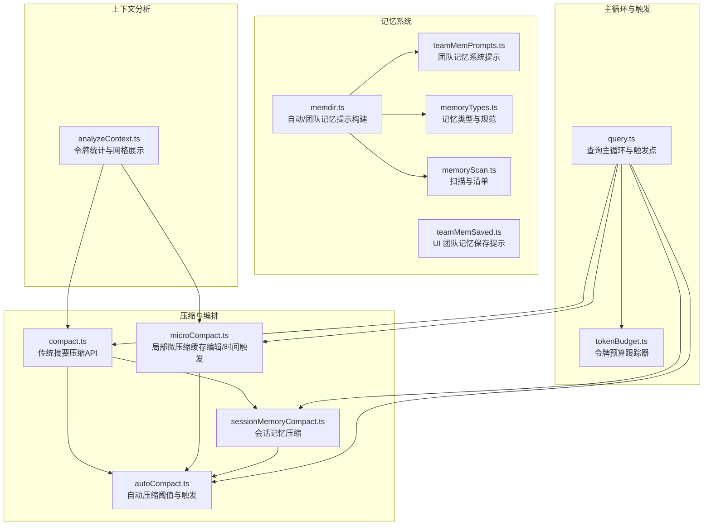
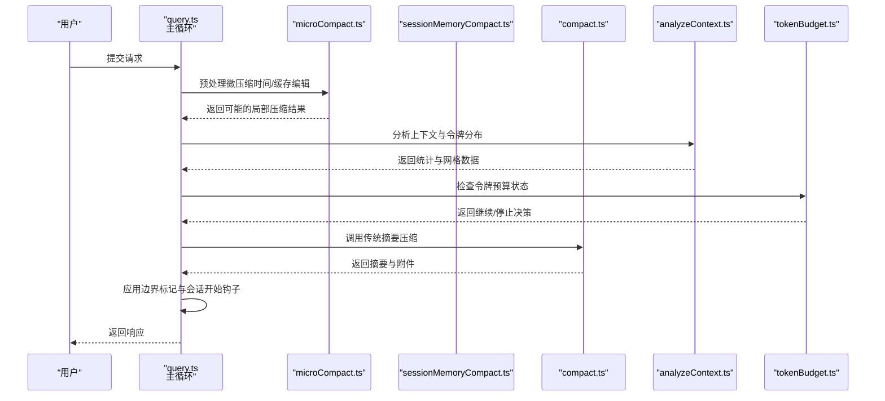
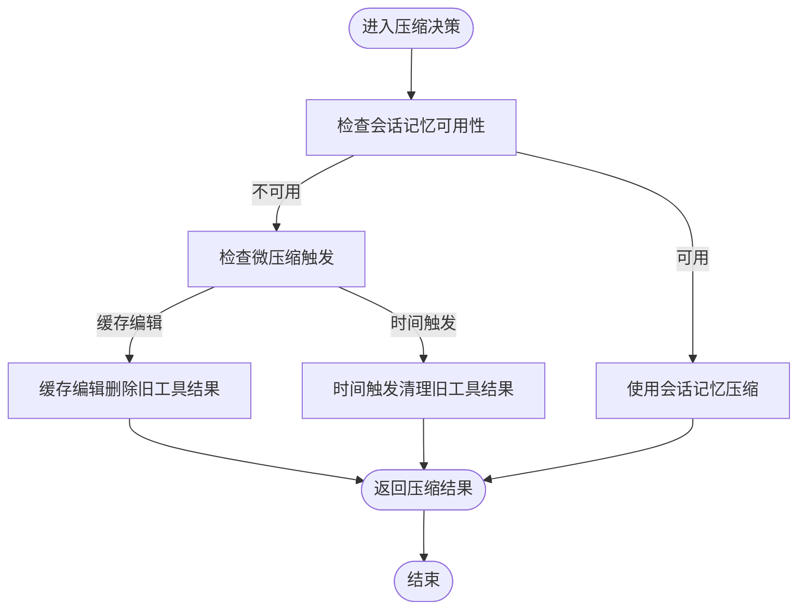
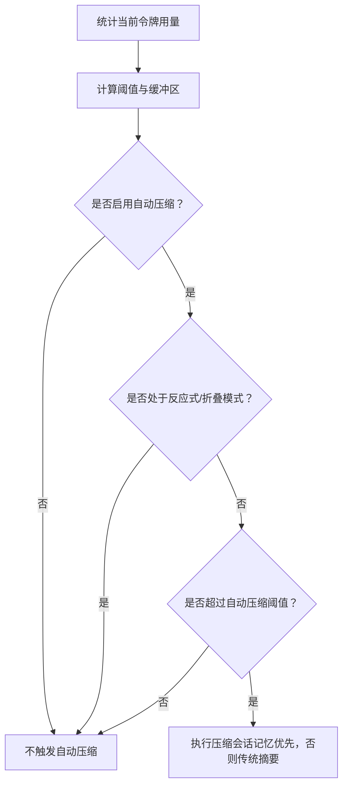
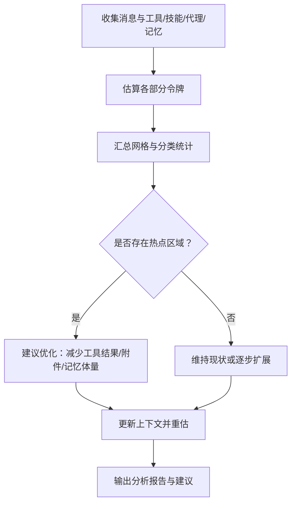
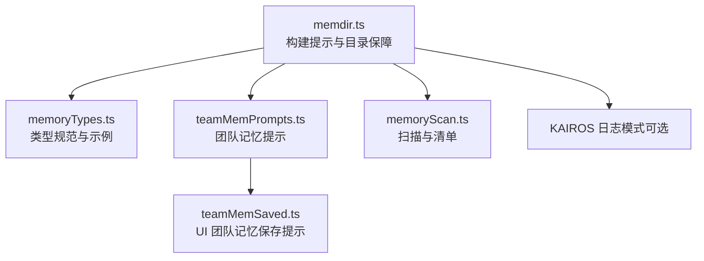
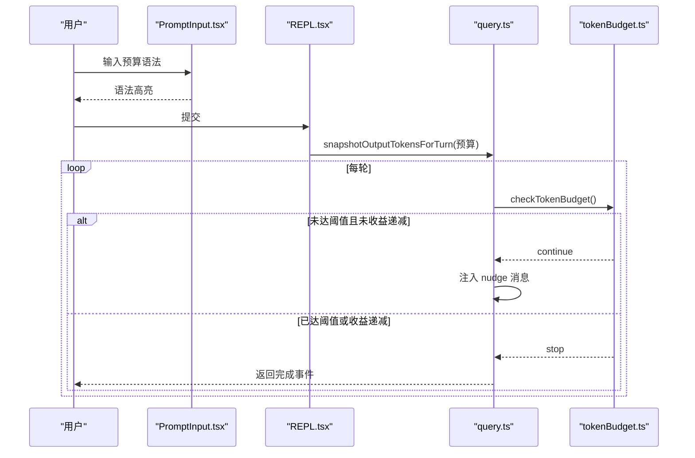
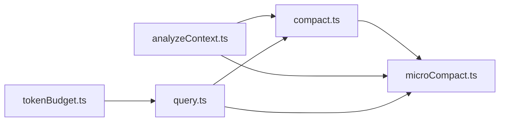

# 上下文管理系统

<cite>
**本文档引用的文件**
- [compaction.mdx](file://docs/context/compaction.mdx)
- [project-memory.mdx](file://docs/context/project-memory.mdx)
- [token-budget.md](file://docs/features/token-budget.md)
- [compact.ts](file://src/services/compact/compact.ts)
- [microCompact.ts](file://src/services/compact/microCompact.ts)
- [memdir.ts](file://src/memdir/memdir.ts)
- [memoryTypes.ts](file://src/memdir/memoryTypes.ts)
- [memoryScan.ts](file://src/memdir/memoryScan.ts)
- [teamMemPrompts.ts](file://src/memdir/teamMemPrompts.ts)
- [teamMemSaved.ts](file://src/components/messages/teamMemSaved.ts)
- [query.ts](file://src/query.ts)
- [tokenBudget.ts](file://src/query/tokenBudget.ts)
- [analyzeContext.ts](file://src/utils/analyzeContext.ts)
</cite>

## 更新摘要
**所做更改**
- 更新了压缩策略章节，反映微压缩和会话记忆压缩的中文注释改进
- 增强了记忆系统章节，包含记忆类型规范和团队记忆提示的详细中文说明
- 完善了令牌预算系统的中文本地化说明
- 更新了上下文分析与优化工作流的中文注释增强
- 添加了新的配置示例和最佳实践指南

## 目录
1. [引言](#引言)
2. [项目结构](#项目结构)
3. [核心组件](#核心组件)
4. [架构总览](#架构总览)
5. [详细组件分析](#详细组件分析)
6. [依赖关系分析](#依赖关系分析)
7. [性能考量](#性能考量)
8. [故障排查指南](#故障排查指南)
9. [结论](#结论)
10. [附录](#附录)

## 引言
本文件系统化阐述 Claude Code Best 的上下文管理系统，覆盖三层压缩策略（微压缩、会话记忆压缩、传统摘要压缩）、记忆系统（会话记忆、项目记忆、团队记忆）与令牌预算系统，并给出上下文分析与优化的工作流、最佳实践与性能调优建议。目标是帮助开发者与使用者在保证对话质量的同时，实现成本可控与响应稳定。

**更新** 本次更新反映了各个组件文件接收的中文本地化改进，包括上下文压缩策略、记忆系统和令牌预算管理的中文注释增强。

## 项目结构
上下文管理相关代码主要分布在以下模块：
- 压缩与编排：`src/services/compact/*`
- 上下文分析与可视化：`src/utils/analyzeContext.ts`
- 记忆系统：`src/memdir/*` 与团队记忆提示与组件
- 令牌预算：`src/query/tokenBudget.ts` 与相关实现文件
- 查询主循环与触发点：`src/query.ts`

**图表来源**
- [compact.ts:1-800](file://src/services/compact/compact.ts#L1-L800)
- [microCompact.ts:1-531](file://src/services/compact/microCompact.ts#L1-L531)
- [memdir.ts:1-508](file://src/memdir/memdir.ts#L1-L508)
- [memoryTypes.ts:1-272](file://src/memdir/memoryTypes.ts#L1-L272)
- [tokenBudget.ts:1-94](file://src/query/tokenBudget.ts#L1-L94)

## 核心组件
- 三层压缩策略
  - 微压缩：针对单次工具输出过长的局部压缩，支持缓存编辑与时间触发两种路径，避免重建缓存前缀。
  - 会话记忆压缩：在启用相关特性时，直接使用会话记忆作为摘要，更快更省成本。
  - 传统摘要压缩：在手动触发或 SM 不可用时的回退路径，调用摘要模型生成总结。
- 自动压缩阈值与触发
  - 基于模型上下文窗口与输出预留，动态计算自动压缩阈值；结合"警告/错误/阻断"缓冲区，提供多级预警。
- 上下文分析与可视化
  - 细分系统提示、工具、技能、代理、记忆文件等类别，生成网格视图与令牌统计，辅助诊断与优化。
- 记忆系统
  - 自动记忆（私有）与团队记忆（共享）双目录，统一类型规范与索引导航；支持日志型持久化与检索。
- 令牌预算系统
  - 通过用户输入的预算目标，驱动主循环持续工作直至接近或达到目标，内置收益递减保护与 UI 反馈。

**章节来源**
- [compact.ts:389-765](file://src/services/compact/compact.ts#L389-L765)
- [microCompact.ts:253-293](file://src/services/compact/microCompact.ts#L253-L293)
- [memdir.ts:419-507](file://src/memdir/memdir.ts#L419-L507)
- [memoryTypes.ts:14-106](file://src/memdir/memoryTypes.ts#L14-L106)
- [tokenBudget.ts:45-94](file://src/query/tokenBudget.ts#L45-L94)

## 架构总览
上下文管理贯穿"预处理（微压缩）→ 分析（令牌统计）→ 触发（自动/手动）→ 压缩（三层策略）→ 后处理（会话开始钩子/附件）"的闭环。

**图表来源**
- [query.ts:608-637](file://src/query.ts#L608-L637)
- [microCompact.ts:253-293](file://src/services/compact/microCompact.ts#L253-L293)
- [compact.ts:389-765](file://src/services/compact/compact.ts#L389-L765)
- [analyzeContext.ts:1-200](file://src/utils/analyzeContext.ts#L1-L200)
- [tokenBudget.ts:45-94](file://src/query/tokenBudget.ts#L45-L94)

## 详细组件分析

### 三层压缩策略与边界机制
- 微压缩
  - 缓存编辑路径：在支持的模型上，通过 API 的 cache_edits 删除旧工具结果，不破坏缓存前缀，显著降低重写成本。
  - 时间触发路径：当自上次助手消息间隔超过阈值时，仅保留最近若干工具结果，其余内容清空占位符，主动释放上下文压力。
- 会话记忆压缩
  - 在启用 tengu_session_memory 与 tengu_sm_compact 两个特性开关时生效，直接以会话记忆作为摘要，无需调用摘要模型，更快更省。
  - 通过最小令牌数、最少文本消息数与最大令牌数三重约束，决定保留段落；并严格维护工具对齐与思考块合并不变式。
- 传统摘要压缩
  - 针对无法使用 SM 的场景或手动触发，调用摘要模型生成总结；支持图像剥离、附件去重、PTL 重试等稳健机制。

**图表来源**
- [compact.ts:389-765](file://src/services/compact/compact.ts#L389-L765)
- [microCompact.ts:305-399](file://src/services/compact/microCompact.ts#L305-L399)
- [microCompact.ts:446-530](file://src/services/compact/microCompact.ts#L446-L530)

**章节来源**
- [compact.ts:389-765](file://src/services/compact/compact.ts#L389-L765)
- [microCompact.ts:253-293](file://src/services/compact/microCompact.ts#L253-L293)
- [microCompact.ts:446-530](file://src/services/compact/microCompact.ts#L446-L530)

### 自动压缩阈值与触发逻辑
- 阈值计算
  - 有效上下文窗口 = 模型上下文窗口 - 输出预留（摘要输出上限）
  - 自动压缩阈值 = 有效窗口 - 自动压缩缓冲区
- 多级预警
  - 警告阈值 = 阈值 - 警告缓冲区
  - 错误阈值 = 阈值 - 错误缓冲区
  - 阻断阈值 = 有效窗口 - 手动压缩缓冲区（可被环境变量覆盖）
- 触发抑制
  - 反应式压缩（REACTIVE_COMPACT）与上下文折叠（CONTEXT_COLLAPSE）模式下抑制主动自动压缩，避免与系统其他上下文管理机制冲突。

**图表来源**
- [compact.ts:389-765](file://src/services/compact/compact.ts#L389-L765)

**章节来源**
- [compact.ts:389-765](file://src/services/compact/compact.ts#L389-L765)

### 上下文分析与优化工作流
- 细分统计
  - 系统提示各部分、工具（内置/延迟加载、MCP）、技能、代理、记忆文件等分别计数，形成网格视图。
- 令牌估算
  - 使用近似估算与 API 计数双轨回退，确保在不同环境下稳定输出。
- 优化建议
  - 优先减少大体积工具结果（如文件读写、网络搜索）与冗余附件。
  - 利用会话记忆与微压缩减少重复上下文。
  - 通过"令牌预算"持续模式提升长任务吞吐，同时避免过度消耗。

**图表来源**
- [analyzeContext.ts:190-232](file://src/utils/analyzeContext.ts#L190-L232)
- [analyzeContext.ts:272-318](file://src/utils/analyzeContext.ts#L272-L318)

**章节来源**
- [analyzeContext.ts:1-800](file://src/utils/analyzeContext.ts#L1-L800)

### 记忆系统架构（会话/项目/团队）
- 类型与规范
  - 四类记忆：user、feedback、project、reference，明确保存范围与示例，避免派生信息（代码、历史、文档）重复录入。
- 自动记忆（私有）
  - 单目录，支持日志型追加（KAIROS 模式）与索引（MEMORY.md）两种形态；提供搜索指引与容量限制。
- 团队记忆（共享）
  - 与私有目录同根，通过提示词区分作用域；支持同步与过滤（secret guard）；UI 展示保存数量。
- 存储与检索
  - 扫描目录生成清单，按修改时间排序并截断；前端组件根据特性开关渲染团队记忆状态。

**图表来源**
- [memdir.ts:419-507](file://src/memdir/memdir.ts#L419-L507)
- [memoryTypes.ts:14-106](file://src/memdir/memoryTypes.ts#L14-L106)
- [memoryScan.ts:35-77](file://src/memdir/memoryScan.ts#L35-L77)

**章节来源**
- [memdir.ts:1-508](file://src/memdir/memdir.ts#L1-L508)
- [memoryTypes.ts:1-272](file://src/memdir/memoryTypes.ts#L1-L272)
- [memoryScan.ts:1-95](file://src/memdir/memoryScan.ts#L1-L95)
- [teamMemPrompts.ts:60-82](file://src/memdir/teamMemPrompts.ts#L60-L82)
- [teamMemSaved.ts:1-19](file://src/components/messages/teamMemSaved.ts#L1-L19)

### 令牌预算系统（Token Budget）
- 语法与解析
  - 支持简写（开头/结尾）与自然语言形式，自动识别 k/m/b 单位。
- 状态与决策
  - 每轮结束后检查预算完成度（90% 阈值）与收益递减（连续多次 nudge 后增量低于阈值）。
- UI 与附件
  - 输入框高亮、底部 spinner 进度与 ETA、API 附加 output_token_usage 信息。

**图表来源**
- [tokenBudget.ts:45-94](file://src/query/tokenBudget.ts#L45-L94)

**章节来源**
- [tokenBudget.ts:1-94](file://src/query/tokenBudget.ts#L1-L94)

## 依赖关系分析
- 模块耦合
  - compact.ts 作为通用压缩入口，封装图像剥离、附件去重、PTL 重试等通用逻辑。
  - microCompact.ts 依赖上下文窗口与输出预留，协调自动压缩的优先级。
  - analyzeContext.ts 为压缩与预算提供统计基础，贯穿主循环的决策。
- 外部依赖
  - 特性门控（feature flags）与远程配置（GrowthBook）影响行为（如 SM 配置、缓存编辑可用性）。
  - API 层负责令牌计数与摘要生成，提供回退与错误处理。

**图表来源**
- [compact.ts:1-800](file://src/services/compact/compact.ts#L1-L800)
- [microCompact.ts:1-531](file://src/services/compact/microCompact.ts#L1-L531)
- [analyzeContext.ts:1-200](file://src/utils/analyzeContext.ts#L1-L200)
- [tokenBudget.ts:1-94](file://src/query/tokenBudget.ts#L1-L94)

**章节来源**
- [compact.ts:1-800](file://src/services/compact/compact.ts#L1-L800)
- [microCompact.ts:1-531](file://src/services/compact/microCompact.ts#L1-L531)
- [analyzeContext.ts:1-800](file://src/utils/analyzeContext.ts#L1-L800)
- [tokenBudget.ts:1-94](file://src/query/tokenBudget.ts#L1-L94)

## 性能考量
- 压缩路径选择
  - 优先使用会话记忆与微压缩，减少 API 调用与摘要成本。
  - 对于大体积工具结果（文件读写、网络搜索），优先采用时间触发清理或缓存编辑。
- 令牌估算与回退
  - 使用近似估算与 API 计数双轨回退，避免在外部构建或受限环境中卡顿。
- 缓冲区与阈值
  - 合理设置自动压缩缓冲区与阻断阈值，避免频繁压缩与 API 调用风暴。
- 记忆系统
  - 控制 MEMORY.md 行数与字节数，避免加载开销；使用扫描与清单减少 IO。

## 故障排查指南
- 自动压缩失败
  - 检查特性开关与环境变量（禁用自动压缩、禁用压缩）；关注连续失败计数与电路保护。
- PTL（提示过长）重试
  - compact.ts 提供头部截断重试逻辑，必要时调整消息分组或减少附件。
- 会话记忆压缩不生效
  - 确认 tengu_session_memory 与 tengu_sm_compact 开关；检查会话记忆文件是否存在且非模板内容。
- 记忆系统异常
  - 检查目录存在性与权限；确认 MEMORY.md 截断警告；核对类型与 frontmatter 规范。

**章节来源**
- [compact.ts:245-293](file://src/services/compact/compact.ts#L245-L293)
- [microCompact.ts:305-399](file://src/services/compact/microCompact.ts#L305-L399)
- [memdir.ts:129-147](file://src/memdir/memdir.ts#L129-L147)

## 结论
本系统通过三层压缩策略、精细化阈值与触发机制、上下文分析与可视化、以及完善的记忆与预算体系，在保证对话质量的同时实现了成本与性能的平衡。建议优先启用会话记忆与微压缩，配合预算系统与上下文分析，持续优化长任务与复杂对话的稳定性与效率。

**更新** 本次更新反映了各个组件文件接收的中文本地化改进，增强了系统注释的可读性和维护性。

## 附录
- 配置示例（环境变量与特性）
  - 自动压缩窗口覆盖：CLAUDE_CODE_AUTO_COMPACT_WINDOW
  - 自动压缩百分比覆盖：CLAUDE_AUTOCOMPACT_PCT_OVERRIDE
  - 阻断阈值覆盖：CLAUDE_CODE_BLOCKING_LIMIT_OVERRIDE
  - 禁用压缩：DISABLE_COMPACT
  - 禁用自动压缩：DISABLE_AUTO_COMPACT
  - 启用/禁用 SM 压缩：ENABLE_CLAUDE_CODE_SM_COMPACT / DISABLE_CLAUDE_CODE_SM_COMPACT
- 最佳实践
  - 使用"令牌预算"驱动长任务，避免频繁中断。
  - 优先采用微压缩与会话记忆，减少摘要调用。
  - 定期审视 MEMORY.md 与团队记忆，避免冗余与漂移。
  - 在反应式/折叠模式下，避免主动自动压缩，交由系统主导。
- 中文本地化改进
  - 所有核心组件文件的注释已更新为中文，提升开发体验
  - 记忆系统类型规范和团队记忆提示包含完整的中文说明
  - 令牌预算系统的错误消息和状态反馈全部采用中文显示