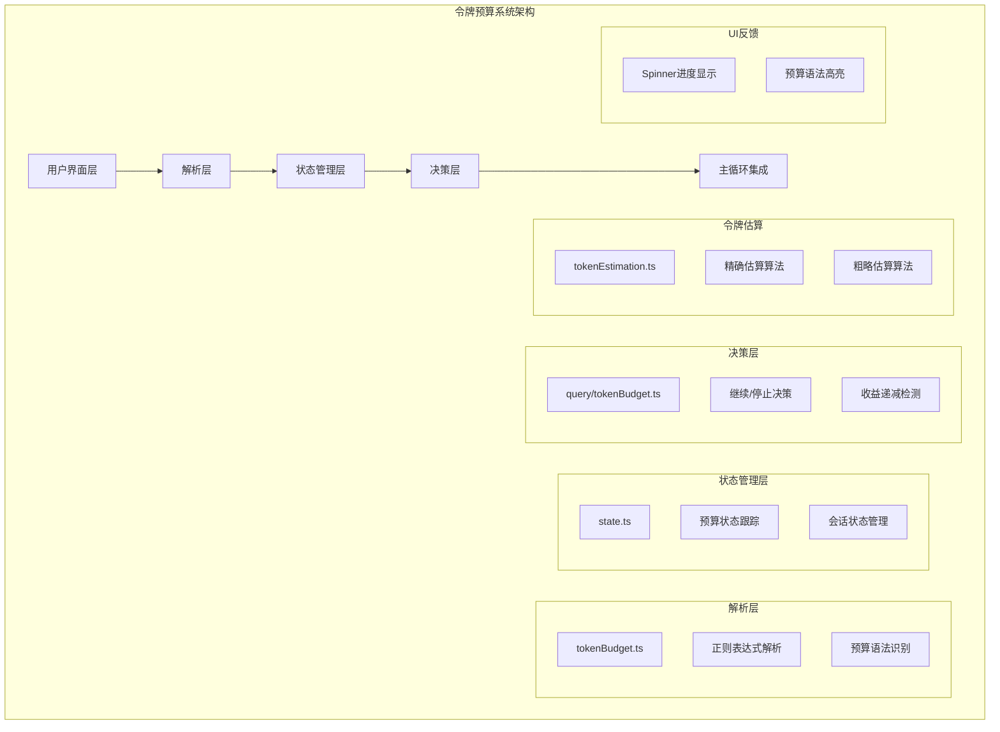
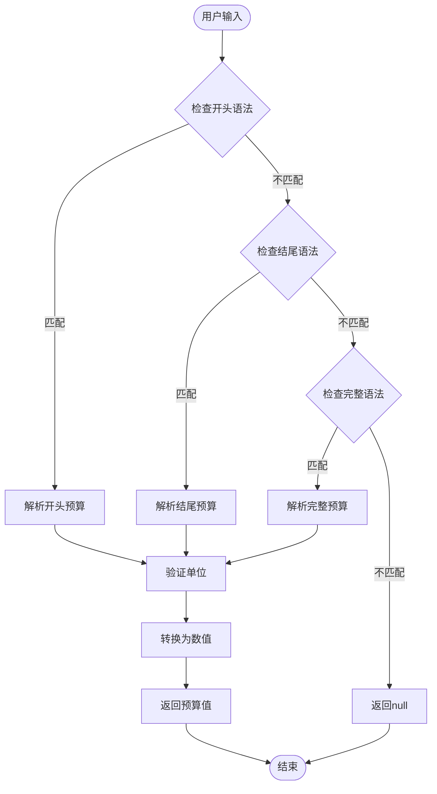
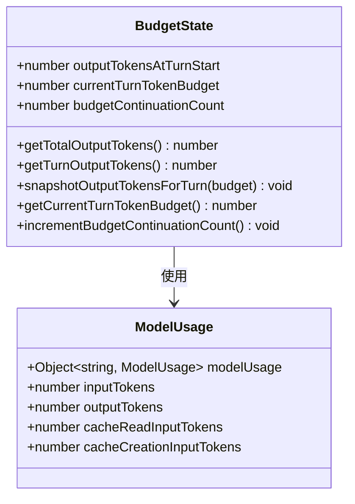
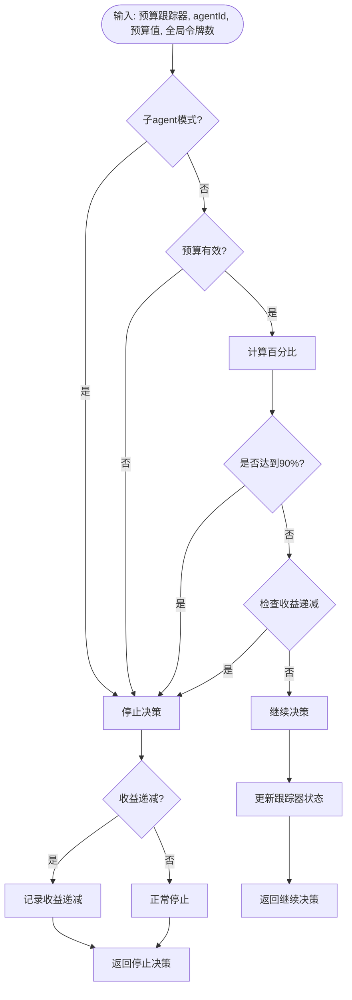
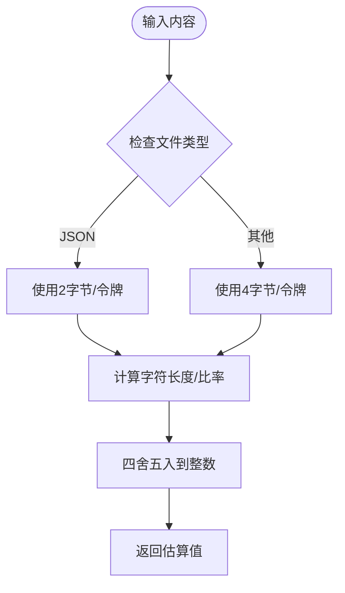
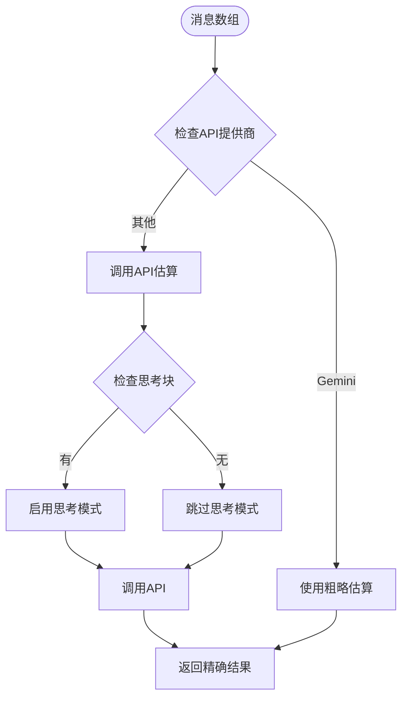
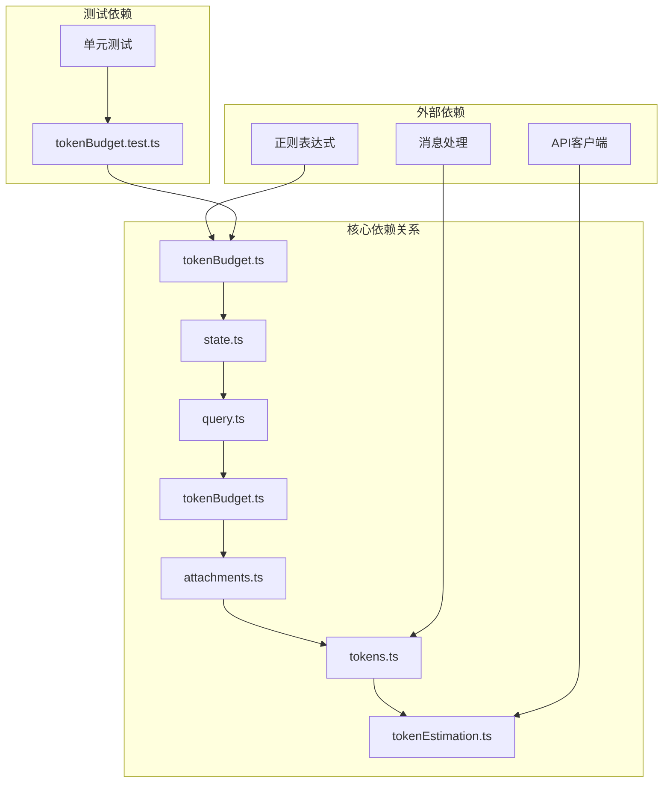

# 令牌预算管理

<cite>
**本文档引用的文件**
- [token-budget.md](file://docs/features/token-budget.md)
- [tokenBudget.ts](file://src/utils/tokenBudget.ts)
- [state.ts](file://src/bootstrap/state.ts)
- [tokenBudget.ts](file://src/query/tokenBudget.ts)
- [query.ts](file://src/query.ts)
- [tokenEstimation.ts](file://src/services/tokenEstimation.ts)
- [tokens.ts](file://src/utils/tokens.ts)
- [attachments.ts](file://src/utils/attachments.ts)
- [tokenBudget.test.ts](file://src/utils/__tests__/tokenBudget.test.ts)
</cite>

## 目录
1. [简介](#简介)
2. [项目结构](#项目结构)
3. [核心组件](#核心组件)
4. [架构概览](#架构概览)
5. [详细组件分析](#详细组件分析)
6. [依赖关系分析](#依赖关系分析)
7. [性能考虑](#性能考虑)
8. [故障排除指南](#故障排除指南)
9. [结论](#结论)
10. [附录](#附录)

## 简介

Claude Code Best 的令牌预算管理系统是一个智能化的输出令牌管理解决方案，旨在让用户能够指定输出令牌预算目标，实现自动化的持续工作模式。该系统通过精确的令牌估算算法和动态调整机制，确保在达到用户设定的令牌目标后自动停止，同时避免最后一轮产生的过度令牌消耗。

该系统特别适用于大型重构、批量修改、大规模代码生成等需要多轮工具调用的长任务场景，用户只需在提示词中指定预算目标（如 `+500k`、`spend 2M tokens`），Claude 就会自动持续工作直到达到目标。

## 项目结构

令牌预算管理系统主要分布在以下目录和文件中：



**图表来源**
- [token-budget.md](file://docs/features/token-budget.md)
- [tokenBudget.ts](file://src/utils/tokenBudget.ts)
- [state.ts](file://src/bootstrap/state.ts)
- [tokenBudget.ts](file://src/query/tokenBudget.ts)

**章节来源**
- [token-budget.md](file://docs/features/token-budget.md)
- [tokenBudget.ts](file://src/utils/tokenBudget.ts)
- [state.ts](file://src/bootstrap/state.ts)

## 核心组件

### 1. 预算解析器

预算解析器负责从用户输入中提取令牌预算目标，支持多种语法格式：

- **简写语法**：`+500k`、`+2.5M`、`+1b`（必须位于输入开头）
- **结尾语法**：`请继续 +100k`、`完成任务 +2m`
- **完整语法**：`spend 2M tokens`、`use 1B tokens`

### 2. 状态管理器

状态管理器跟踪当前回合的预算状态，包括：
- `outputTokensAtTurnStart`：回合开始时的累计输出令牌数
- `currentTurnTokenBudget`：当前回合的预算目标
- `budgetContinuationCount`：当前回合已自动续接的次数

### 3. 决策引擎

决策引擎基于预算跟踪器做出继续或停止的决策，采用90%阈值策略和收益递减保护机制。

### 4. 令牌估算系统

系统提供两种令牌估算策略：
- **精确估算**：使用API进行准确的令牌计数
- **粗略估算**：基于字符长度的快速估算，支持不同文件类型的字节/令牌比率

**章节来源**
- [tokenBudget.ts](file://src/utils/tokenBudget.ts)
- [state.ts](file://src/bootstrap/state.ts)
- [tokenBudget.ts](file://src/query/tokenBudget.ts)
- [tokenEstimation.ts](file://src/services/tokenEstimation.ts)

## 架构概览

令牌预算管理系统的整体架构采用分层设计，确保各组件职责清晰、耦合度低：

```mermaid
sequenceDiagram
participant User as 用户
participant Parser as 预算解析器
participant State as 状态管理器
participant Decision as 决策引擎
participant Loop as 主循环
participant UI as 用户界面
User->>Parser : 输入预算语法
Parser->>Parser : 正则解析预算值
Parser->>State : 设置预算目标
State->>State : 快照输出令牌数
loop 每轮对话循环
Loop->>State : 获取当前输出令牌数
State->>Decision : 传入预算状态
Decision->>Decision : 计算百分比和增量
Decision->>Decision : 检查收益递减
Decision->>Loop : 返回继续/停止决策
alt 继续
Loop->>UI : 注入nudge消息
UI->>User : 显示进度更新
else 停止
Loop->>UI : 显示完成状态
UI->>User : 显示最终统计
end
end
```

**图表来源**
- [token-budget.md](file://docs/features/token-budget.md)
- [tokenBudget.ts](file://src/query/tokenBudget.ts)
- [state.ts](file://src/bootstrap/state.ts)

**章节来源**
- [token-budget.md](file://docs/features/token-budget.md)
- [query.ts](file://src/query.ts)

## 详细组件分析

### 预算解析组件

预算解析组件实现了灵活的语法识别机制，支持多种用户友好的输入格式：



**图表来源**
- [tokenBudget.ts](file://src/utils/tokenBudget.ts)

预算解析的关键特性包括：
- **优先级规则**：开头简写语法优先于结尾语法和完整语法
- **大小写不敏感**：支持大写和小写的单位标识符
- **正则表达式优化**：避免使用lookbehind以提高JSC JIT性能

**章节来源**
- [tokenBudget.ts](file://src/utils/tokenBudget.ts)
- [tokenBudget.test.ts](file://src/utils/__tests__/tokenBudget.test.ts)

### 状态管理组件

状态管理组件负责维护会话级别的预算状态，确保预算信息在整个对话过程中保持一致：



**图表来源**
- [state.ts](file://src/bootstrap/state.ts)

状态管理的核心功能：
- **回合边界管理**：通过快照机制确保每个回合的预算独立计算
- **全局状态聚合**：汇总所有模型的输出令牌使用情况
- **预算持续性**：在对话过程中保持预算状态的一致性

**章节来源**
- [state.ts](file://src/bootstrap/state.ts)

### 决策引擎组件

决策引擎是预算管理系统的核心逻辑组件，负责基于当前状态做出继续或停止的智能决策：



**图表来源**
- [tokenBudget.ts](file://src/query/tokenBudget.ts)

决策引擎的关键算法：
- **90%阈值策略**：在达到预算90%时停止，避免最后一轮过度消耗
- **收益递减检测**：连续3轮后每轮新增<500 tokens视为收益递减
- **子agent豁免**：避免在子任务中重复触发预算检查

**章节来源**
- [tokenBudget.ts](file://src/query/tokenBudget.ts)

### 令牌估算组件

令牌估算组件提供了两种估算策略，平衡准确性与性能：

#### 粗略估算算法

粗略估算使用字符长度作为基础，根据不同文件类型调整字节/令牌比率：



**图表来源**
- [tokenEstimation.ts](file://src/services/tokenEstimation.ts)

粗略估算的特点：
- **高性能**：基于字符串长度计算，无需API调用
- **类型感知**：针对JSON等特殊格式优化估算精度
- **可预测性**：提供稳定的估算结果

#### 精确估算算法

精确估算通过API调用获得准确的令牌计数：



**图表来源**
- [tokenEstimation.ts](file://src/services/tokenEstimation.ts)

精确估算的优势：
- **高准确性**：通过API获得真实的令牌计数
- **上下文感知**：考虑消息的完整上下文环境
- **工具支持**：支持工具调用的令牌估算

**章节来源**
- [tokenEstimation.ts](file://src/services/tokenEstimation.ts)
- [tokens.ts](file://src/utils/tokens.ts)

## 依赖关系分析

令牌预算管理系统与其他组件的依赖关系如下：



**图表来源**
- [tokenBudget.ts](file://src/utils/tokenBudget.ts)
- [state.ts](file://src/bootstrap/state.ts)
- [tokenBudget.ts](file://src/query/tokenBudget.ts)
- [attachments.ts](file://src/utils/attachments.ts)
- [tokens.ts](file://src/utils/tokens.ts)
- [tokenEstimation.ts](file://src/services/tokenEstimation.ts)

**章节来源**
- [tokenBudget.ts](file://src/utils/tokenBudget.ts)
- [state.ts](file://src/bootstrap/state.ts)
- [tokenEstimation.ts](file://src/services/tokenEstimation.ts)

## 性能考虑

令牌预算管理系统在设计时充分考虑了性能优化：

### 1. 正则表达式优化

- 避免使用lookbehind语法，提高JSC JIT编译性能
- 使用预编译的正则表达式减少运行时开销
- 通过位置偏移优化避免不必要的字符串处理

### 2. 估算策略选择

- **粗略估算**：适用于快速判断和早期过滤
- **精确估算**：仅在必要时使用API调用
- **混合策略**：根据场景选择最合适的估算方法

### 3. 内存管理

- 状态数据结构设计紧凑，避免内存泄漏
- 及时清理临时状态，释放内存资源
- 使用弱引用避免循环引用

### 4. 并发处理

- 预算检查采用非阻塞方式
- 异步API调用避免阻塞主线程
- 批量处理减少系统调用次数

## 故障排除指南

### 常见问题及解决方案

#### 1. 预算解析失败

**症状**：用户输入预算语法但系统无法识别
**原因**：
- 语法格式不正确
- 单位标识符错误
- 输入包含特殊字符

**解决方法**：
- 检查预算语法格式
- 确认单位标识符大小写
- 验证输入文本的完整性

#### 2. 预算停止过早

**症状**：系统在达到预算90%之前就停止
**原因**：
- 收益递减检测触发
- 子agent模式影响
- 预算跟踪器状态异常

**解决方法**：
- 检查收益递减阈值设置
- 验证子agent配置
- 重置预算跟踪器状态

#### 3. 令牌估算不准确

**症状**：估算结果与实际使用差异较大
**原因**：
- 粗略估算的局限性
- 文件类型识别错误
- API调用失败

**解决方法**：
- 使用精确估算替代粗略估算
- 检查文件类型检测逻辑
- 重新执行API估算

**章节来源**
- [tokenBudget.test.ts](file://src/utils/__tests__/tokenBudget.test.ts)

## 结论

Claude Code Best 的令牌预算管理系统通过精心设计的架构和算法，为用户提供了强大而灵活的令牌管理能力。系统的主要优势包括：

1. **用户友好**：支持多种自然语言语法，降低使用门槛
2. **智能决策**：采用90%阈值和收益递减保护机制
3. **性能优化**：提供粗略和精确两种估算策略
4. **稳定性强**：完善的错误处理和状态管理机制

该系统特别适合需要长时间运行的AI任务，能够显著提升开发效率和用户体验。通过合理的配置和使用，开发者可以更好地控制令牌使用，优化成本效益。

## 附录

### 配置选项

| 选项名称 | 类型 | 默认值 | 描述 |
|---------|------|--------|------|
| FEATURE_TOKEN_BUDGET | 布尔值 | false | 启用/禁用令牌预算功能 |
| COMPLETION_THRESHOLD | 数值 | 0.9 | 预算完成阈值（0-1之间） |
| DIMINISHING_THRESHOLD | 数值 | 500 | 收益递减检测阈值（令牌数） |
| CONTINUATION_COUNT | 数值 | 3 | 连续nudge轮数阈值 |

### 监控指标

- **预算达成率**：实际使用量与预算目标的比率
- **收益递减频率**：触发收益递减保护的次数
- **估算误差率**：粗略估算与精确估算的差异
- **系统响应时间**：预算检查和决策的平均耗时

### 最佳实践

1. **合理设置预算**：根据任务复杂度和预期输出量设置合适的预算
2. **监控系统性能**：定期检查估算准确性和系统响应时间
3. **优化估算策略**：在性能和准确性之间找到最佳平衡点
4. **错误处理**：建立完善的错误处理和恢复机制