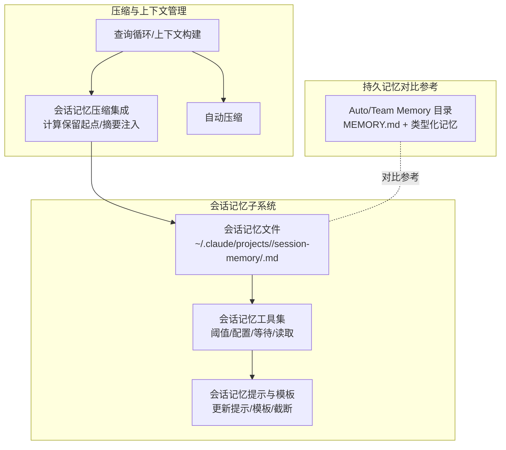
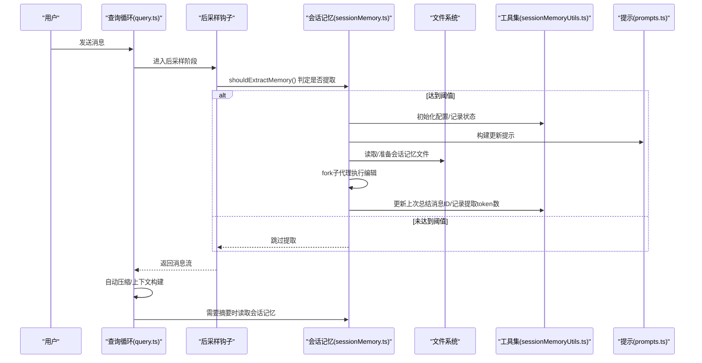
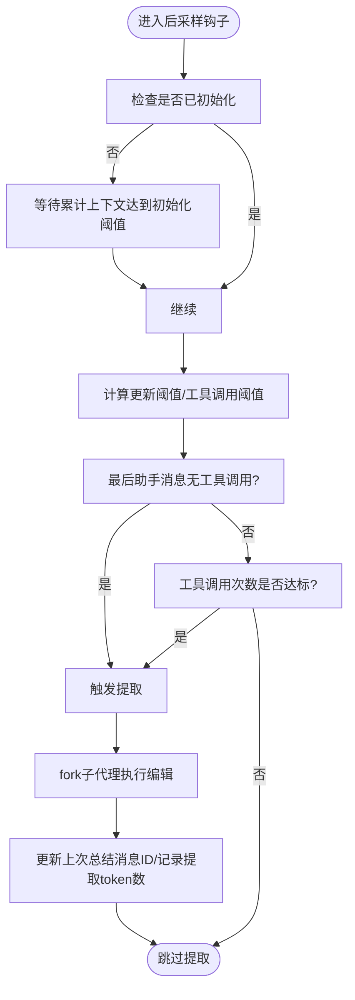
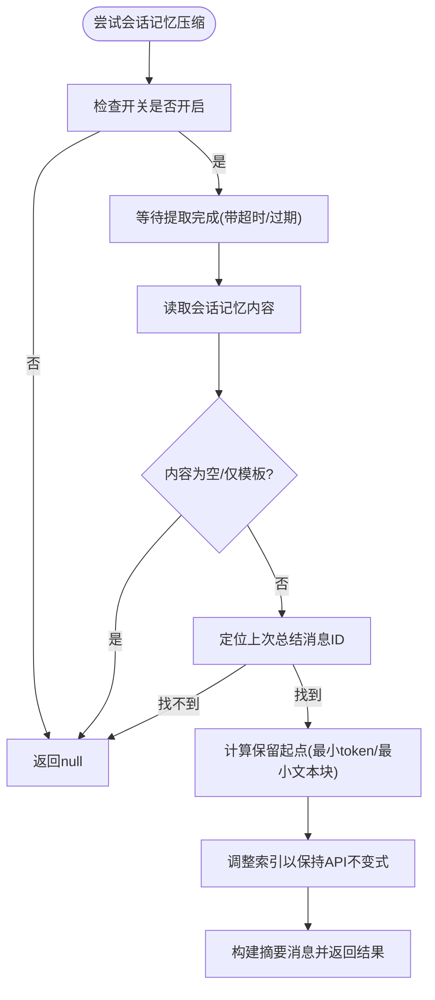

# 会话记忆系统

<cite>
**本文引用的文件**
- [sessionMemory.ts](file://src/services/SessionMemory/sessionMemory.ts)
- [sessionMemoryUtils.ts](file://src/services/SessionMemory/sessionMemoryUtils.ts)
- [sessionMemoryCompact.ts](file://src/services/compact/sessionMemoryCompact.ts)
- [prompts.ts](file://src/services/SessionMemory/prompts.ts)
- [memdir.ts](file://src/memdir/memdir.ts)
- [memoryTypes.ts](file://src/memdir/memoryTypes.ts)
- [memoryAge.ts](file://src/memdir/memoryAge.ts)
- [backgroundHousekeeping.ts](file://src/utils/backgroundHousekeeping.ts)
- [context.ts](file://src/context.ts)
- [query.ts](file://src/query.ts)
- [V6.md](file://V6.md)
</cite>

## 目录
1. [引言](#引言)
2. [项目结构](#项目结构)
3. [核心组件](#核心组件)
4. [架构总览](#架构总览)
5. [详细组件分析](#详细组件分析)
6. [依赖关系分析](#依赖关系分析)
7. [性能考量](#性能考量)
8. [故障排查指南](#故障排查指南)
9. [结论](#结论)
10. [附录](#附录)

## 引言
本文件系统性阐述 Claude Code Best 的“会话记忆”（Session Memory）机制，涵盖其存储结构、生命周期管理、检索与整合策略、与“持久记忆”（Auto/Team Memory）的差异、自动清理与过期策略、在对话循环中的作用、配置项、数据结构与序列化、性能优化与最佳实践。目标读者既包括需要快速上手的使用者，也包括希望深入理解实现细节的工程师。

## 项目结构
会话记忆由“会话内记忆文件 + 提取与压缩集成”两部分构成：
- 会话内记忆文件：以 Markdown 文件形式按固定模板维护当前会话的关键信息，由后台子代理周期性提取更新。
- 与压缩流程集成：当上下文过大时，会话记忆可作为摘要来源参与自动压缩，减少历史消息占用的 token。

图示来源
- [sessionMemory.ts:1-496](file://src/services/SessionMemory/sessionMemory.ts#L1-L496)
- [sessionMemoryUtils.ts:1-208](file://src/services/SessionMemory/sessionMemoryUtils.ts#L1-L208)
- [sessionMemoryCompact.ts:1-631](file://src/services/compact/sessionMemoryCompact.ts#L1-L631)
- [prompts.ts:1-325](file://src/services/SessionMemory/prompts.ts#L1-L325)
- [memdir.ts:1-508](file://src/memdir/memdir.ts#L1-L508)

章节来源
- [sessionMemory.ts:1-496](file://src/services/SessionMemory/sessionMemory.ts#L1-L496)
- [sessionMemoryUtils.ts:1-208](file://src/services/SessionMemory/sessionMemoryUtils.ts#L1-L208)
- [sessionMemoryCompact.ts:1-631](file://src/services/compact/sessionMemoryCompact.ts#L1-L631)
- [prompts.ts:1-325](file://src/services/SessionMemory/prompts.ts#L1-L325)
- [memdir.ts:1-508](file://src/memdir/memdir.ts#L1-L508)

## 核心组件
- 会话记忆文件与提取器
  - 会话记忆文件：按固定模板维护标题、当前状态、任务说明、文件与函数、工作流、错误与修正、代码库与系统文档、学习要点、关键结果、工作日志等小节。
  - 提取器：在对话采样后钩子中，基于模板与当前会话上下文，通过子代理调用编辑工具更新该文件；支持手动触发。
- 会话记忆工具集
  - 配置与阈值：最小上下文窗口 token、两次更新间最小增长 token、工具调用次数阈值。
  - 状态跟踪：初始化标记、上次总结消息 ID、提取进行中状态、最近一次提取 token 数。
  - 读取与等待：读取文件内容、等待正在进行的提取完成。
- 会话记忆压缩集成
  - 使用场景：当自动压缩或会话记忆功能开启时，从会话记忆文件生成摘要消息，插入到压缩后的消息序列中，避免将整个会话记忆占满预算。
  - 保留策略：从“上次总结消息 ID”之后的消息起，向前扩展保留满足最小 token 数与最小文本块消息数的范围，并调整索引以避免破坏工具调用/结果配对与思考块合并不变式。
- 持久记忆（对比参考）
  - Auto/Team Memory：类型化、可检索的记忆系统，用于跨会话持久化；会话记忆更偏向“本次会话内的即时摘要”。

章节来源
- [sessionMemory.ts:1-496](file://src/services/SessionMemory/sessionMemory.ts#L1-L496)
- [sessionMemoryUtils.ts:1-208](file://src/services/SessionMemory/sessionMemoryUtils.ts#L1-L208)
- [sessionMemoryCompact.ts:1-631](file://src/services/compact/sessionMemoryCompact.ts#L1-L631)
- [prompts.ts:1-325](file://src/services/SessionMemory/prompts.ts#L1-L325)
- [memdir.ts:1-508](file://src/memdir/memdir.ts#L1-L508)

## 架构总览
会话记忆在对话循环中的位置与交互如下：

图示来源
- [query.ts:241-800](file://src/query.ts#L241-L800)
- [sessionMemory.ts:134-350](file://src/services/SessionMemory/sessionMemory.ts#L134-L350)
- [sessionMemoryUtils.ts:128-177](file://src/services/SessionMemory/sessionMemoryUtils.ts#L128-L177)
- [prompts.ts:226-247](file://src/services/SessionMemory/prompts.ts#L226-L247)

## 详细组件分析

### 会话记忆文件与模板
- 文件位置与命名：位于项目会话记忆目录下，文件名为会话标识对应的 .md。
- 模板结构：包含标题、当前状态、任务说明、文件与函数、工作流、错误与修正、代码库与系统文档、学习要点、关键结果、工作日志等小节；每个小节配有“模板说明”行，用于指导内容组织。
- 自定义模板与提示：支持用户自定义模板与更新提示，若不存在则回退到默认模板与提示。
- 截断策略：为避免单个小节过长，采用字符级截断并在末尾标注截断提示；整体文件超过最大 token 预算时给出警告并要求收缩。

章节来源
- [prompts.ts:11-41](file://src/services/SessionMemory/prompts.ts#L11-L41)
- [prompts.ts:86-129](file://src/services/SessionMemory/prompts.ts#L86-L129)
- [prompts.ts:134-196](file://src/services/SessionMemory/prompts.ts#L134-L196)
- [prompts.ts:226-247](file://src/services/SessionMemory/prompts.ts#L226-L247)
- [prompts.ts:256-324](file://src/services/SessionMemory/prompts.ts#L256-L324)

### 提取与更新流程
- 触发条件
  - 必须先满足“初始化阈值”（累计上下文窗口 token 达到最小值），再满足“更新阈值”（两次提取之间上下文增长达到最小值）。
  - 工具调用次数需达到阈值，或最后一条助手消息不含工具调用（安全提取时机）。
- 并发与等待
  - 若提取进行中且未过期（超过一分钟），等待其完成；超时或过期则不等待直接返回。
- 子代理执行
  - 使用 fork 子代理隔离上下文，仅允许对会话记忆文件使用编辑工具，确保安全与一致性。
- 结果记录
  - 成功提取后记录提取时的上下文 token 数，更新“上次总结消息 ID”，以便后续压缩保留策略使用。

图示来源
- [sessionMemory.ts:134-181](file://src/services/SessionMemory/sessionMemory.ts#L134-L181)
- [sessionMemory.ts:272-350](file://src/services/SessionMemory/sessionMemory.ts#L272-L350)
- [sessionMemoryUtils.ts:89-105](file://src/services/SessionMemory/sessionMemoryUtils.ts#L89-L105)

章节来源
- [sessionMemory.ts:134-350](file://src/services/SessionMemory/sessionMemory.ts#L134-L350)
- [sessionMemoryUtils.ts:89-105](file://src/services/SessionMemory/sessionMemoryUtils.ts#L89-L105)

### 会话记忆与压缩集成
- 使用条件：会话记忆开关与压缩开关同时开启时启用。
- 保留策略：从“上次总结消息 ID”出发，向前扩展保留满足最小 token 数与最小文本块消息数的范围；若遇到边界消息则停止扩展。
- 不变式保护：为避免破坏工具调用/结果配对与思考块合并，会调整起始索引，确保不会切分配对或丢失思考块。
- 摘要注入：将会话记忆内容截断后生成摘要消息，插入到压缩后的消息序列中，避免占用过多预算。

图示来源
- [sessionMemoryCompact.ts:514-630](file://src/services/compact/sessionMemoryCompact.ts#L514-L630)
- [sessionMemoryCompact.ts:324-397](file://src/services/compact/sessionMemoryCompact.ts#L324-L397)
- [sessionMemoryCompact.ts:437-503](file://src/services/compact/sessionMemoryCompact.ts#L437-L503)

章节来源
- [sessionMemoryCompact.ts:400-432](file://src/services/compact/sessionMemoryCompact.ts#L400-L432)
- [sessionMemoryCompact.ts:514-630](file://src/services/compact/sessionMemoryCompact.ts#L514-L630)

### 会话记忆与持久记忆（Auto/Team Memory）的区别
- 作用范围
  - 会话记忆：面向“当前会话”的即时摘要，帮助在会话内维持上下文连贯性，减少重复信息。
  - 持久记忆：面向“跨会话”的长期知识沉淀，按类型（user/feedback/project/reference）组织，支持检索与共享。
- 存储与访问
  - 会话记忆：单文件（Markdown），按模板小节维护；由会话记忆流程读取/更新。
  - 持久记忆：目录结构（MEMORY.md 为索引，各类型主题文件为内容），支持检索与搜索。
- 生命周期
  - 会话记忆：随会话结束而终止，不跨会话持久化。
  - 持久记忆：长期保存，支持清理与合并（如自动整理、团队同步）。
- 与压缩的关系
  - 会话记忆可作为压缩摘要来源；持久记忆通常不参与压缩摘要生成。

章节来源
- [memdir.ts:1-508](file://src/memdir/memdir.ts#L1-L508)
- [memoryTypes.ts:1-272](file://src/memdir/memoryTypes.ts#L1-L272)
- [sessionMemory.ts:1-496](file://src/services/SessionMemory/sessionMemory.ts#L1-L496)

### 自动清理与过期策略
- 会话记忆文件层面
  - 会话结束后，历史会话记忆文件不会自动删除；可通过后台清理流程定期清理旧版本与过期文件。
- 后台清理
  - 定期清理旧消息文件与版本文件，避免磁盘膨胀；在用户活跃度较低时延迟执行。
- 会话记忆提取的过期
  - 提取进行中超过一定时间（例如一分钟）会被视为过期，等待逻辑会直接返回，避免阻塞。

章节来源
- [backgroundHousekeeping.ts:28-75](file://src/utils/backgroundHousekeeping.ts#L28-L75)
- [sessionMemoryUtils.ts:89-105](file://src/services/SessionMemory/sessionMemoryUtils.ts#L89-L105)

### 在对话循环中的作用
- 上下文构建
  - 会话记忆内容可作为摘要注入到压缩后的消息序列中，帮助模型在有限 token 下仍能把握会话要点。
- 响应生成
  - 会话记忆文件的内容在提取后可用于指导后续响应，确保“当前状态”“关键结果”等信息准确传达。
- 与系统/用户上下文的整合
  - 系统上下文与用户上下文在查询循环中被拼接，会话记忆摘要作为补充上下文参与最终请求。

章节来源
- [query.ts:449-543](file://src/query.ts#L449-L543)
- [sessionMemoryCompact.ts:437-503](file://src/services/compact/sessionMemoryCompact.ts#L437-L503)

### 配置选项与参数
- 会话记忆配置（阈值与行为）
  - minimumMessageTokensToInit：初始化阈值（上下文窗口累计 token 数）
  - minimumTokensBetweenUpdate：两次更新之间的最小增长 token 数
  - toolCallsBetweenUpdates：两次更新之间的工具调用次数阈值
  - 默认值：初始化阈值、两次更新间阈值、工具调用阈值
- 会话记忆压缩配置
  - minTokens：保留摘要的最小 token 数
  - minTextBlockMessages：保留的最少含文本块消息数
  - maxTokens：保留摘要的最大 token 数（硬上限）
- 动态配置来源
  - 会话记忆配置与压缩配置均可从远程配置加载，且仅在显式大于零时生效，避免默认值被零值覆盖。
- 远程配置加载策略
  - 会话记忆配置：懒加载，仅在钩子首次运行时初始化一次。
  - 压缩配置：首次使用时初始化一次，随后复用。

章节来源
- [sessionMemoryUtils.ts:18-36](file://src/services/SessionMemory/sessionMemoryUtils.ts#L18-L36)
- [sessionMemoryUtils.ts:131-145](file://src/services/SessionMemory/sessionMemoryUtils.ts#L131-L145)
- [sessionMemory.ts:240-264](file://src/services/SessionMemory/sessionMemory.ts#L240-L264)
- [sessionMemoryCompact.ts:102-130](file://src/services/compact/sessionMemoryCompact.ts#L102-L130)

### 数据结构与序列化
- 会话记忆文件
  - 结构：Markdown，包含多个小节，每个小节有标题与“模板说明”行；内容为具体信息。
  - 序列化：纯文本；更新通过编辑工具写回，保持结构不变。
- 会话记忆摘要
  - 结构：用户消息（isCompactSummary 标记），内容为会话记忆的摘要文本；必要时追加截断提示。
  - 序列化：消息对象（包含内容数组、可见性标记等），注入到压缩后的消息序列中。
- 持久记忆（对比参考）
  - 结构：MEMORY.md 为索引，各类型主题文件为内容；frontmatter 包含名称、描述、类型等字段。
  - 序列化：Markdown 文档，支持检索与搜索。

章节来源
- [prompts.ts:11-41](file://src/services/SessionMemory/prompts.ts#L11-L41)
- [prompts.ts:437-503](file://src/services/SessionMemory/prompts.ts#L437-L503)
- [memdir.ts:272-316](file://src/memdir/memdir.ts#L272-L316)
- [memoryTypes.ts:261-271](file://src/memdir/memoryTypes.ts#L261-L271)

### 性能优化策略
- 提示缓存与子代理
  - 提取过程使用 fork 子代理，结合缓存安全参数，避免污染父上下文，提升稳定性与缓存命中率。
- 阈值控制
  - 通过“初始化阈值”“更新阈值”“工具调用阈值”三重控制，降低不必要的提取频率，减少 IO 与模型调用开销。
- 截断与预算控制
  - 会话记忆小节与整体文件均设置截断阈值，避免占用过多 token 预算；压缩时对会话记忆进行截断，保证摘要可控。
- 并发与等待
  - 提取进行中时的等待逻辑带有超时与过期判断，避免长时间阻塞主流程。
- 后台清理
  - 在用户不活跃时延迟清理旧文件，减少对交互体验的影响。

章节来源
- [sessionMemory.ts:318-325](file://src/services/SessionMemory/sessionMemory.ts#L318-L325)
- [sessionMemoryUtils.ts:89-105](file://src/services/SessionMemory/sessionMemoryUtils.ts#L89-L105)
- [prompts.ts:8-10](file://src/services/SessionMemory/prompts.ts#L8-L10)
- [prompts.ts:256-324](file://src/services/SessionMemory/prompts.ts#L256-L324)
- [backgroundHousekeeping.ts:28-75](file://src/utils/backgroundHousekeeping.ts#L28-L75)

### 使用示例与最佳实践
- 使用示例
  - 手动触发提取：通过命令触发会话记忆提取，绕过阈值检查，适合需要立即生成摘要的场景。
  - 查看会话记忆：在压缩或摘要注入时读取会话记忆内容，了解当前会话的摘要要点。
- 最佳实践
  - 合理设置阈值：根据会话复杂度与 token 预算调整初始化阈值与更新阈值，避免频繁提取或遗漏关键信息。
  - 保持模板结构：更新会话记忆时严格遵循模板结构，确保摘要质量与一致性。
  - 控制小节长度：关注单个小节的长度与整体文件长度，避免超出截断阈值导致内容被截断。
  - 与压缩配合：在自动压缩开启时，利用会话记忆摘要减少历史消息占用，提升上下文效率。
  - 注意并发与等待：在高并发场景下，注意提取进行中的等待与过期策略，避免阻塞主流程。

章节来源
- [sessionMemory.ts:387-453](file://src/services/SessionMemory/sessionMemory.ts#L387-L453)
- [sessionMemory.ts:514-566](file://src/services/SessionMemory/sessionMemory.ts#L514-L566)
- [prompts.ts:64-79](file://src/services/SessionMemory/prompts.ts#L64-L79)
- [sessionMemoryUtils.ts:89-105](file://src/services/SessionMemory/sessionMemoryUtils.ts#L89-L105)

## 依赖关系分析
会话记忆系统与其他模块的耦合关系如下：

```mermaid
graph LR
SM["会话记忆(sessionMemory.ts)"] --> SU["工具集(sessionMemoryUtils.ts)"]
SM --> PR["提示(prompts.ts)"]
SM --> FS["文件系统"]
SM --> PH["后采样钩子"]
SM --> AC["自动压缩(deps.autocompact)"]
SM --> Q["查询循环(query.ts)"]
SMCOMP["会话记忆压缩(sessionMemoryCompact.ts)"] --> SU
SMCOMP --> Q
SMCOMP --> PR
MEMDIR["持久记忆(memdir.ts)"] -. 对比参考 .- SM
```

图示来源
- [sessionMemory.ts:1-496](file://src/services/SessionMemory/sessionMemory.ts#L1-L496)
- [sessionMemoryUtils.ts:1-208](file://src/services/SessionMemory/sessionMemoryUtils.ts#L1-L208)
- [sessionMemoryCompact.ts:1-631](file://src/services/compact/sessionMemoryCompact.ts#L1-L631)
- [prompts.ts:1-325](file://src/services/SessionMemory/prompts.ts#L1-L325)
- [memdir.ts:1-508](file://src/memdir/memdir.ts#L1-L508)
- [query.ts:449-543](file://src/query.ts#L449-L543)

章节来源
- [sessionMemory.ts:1-496](file://src/services/SessionMemory/sessionMemory.ts#L1-L496)
- [sessionMemoryCompact.ts:1-631](file://src/services/compact/sessionMemoryCompact.ts#L1-L631)
- [memdir.ts:1-508](file://src/memdir/memdir.ts#L1-L508)

## 性能考量
- 提示缓存与子代理：通过 fork 子代理与缓存安全参数，减少父上下文污染，提高缓存命中率与稳定性。
- 阈值控制：三重阈值控制提取频率，避免过度 IO 与模型调用。
- 截断策略：对小节与整体文件进行截断，防止预算超支。
- 并发等待：提取进行中等待带有超时与过期判断，避免阻塞。
- 后台清理：在用户不活跃时延迟清理，减少对交互影响。

## 故障排查指南
- 提取未发生
  - 检查是否满足初始化阈值与更新阈值，以及最后助手消息是否含有工具调用。
  - 检查是否处于非主线程（子代理/队友等不触发提取）。
- 提取卡住或等待
  - 查看提取进行中状态与过期时间，确认是否因长时间未完成而被视为过期。
- 摘要未注入
  - 检查会话记忆开关与压缩开关是否同时开启，以及会话记忆内容是否为空或仅模板。
  - 检查“上次总结消息 ID”是否存在，否则会回退到传统压缩。
- 文件读取异常
  - 检查文件权限与路径，确认文件存在且可读；若不可访问，返回空内容并记录事件。

章节来源
- [sessionMemory.ts:272-350](file://src/services/SessionMemory/sessionMemory.ts#L272-L350)
- [sessionMemoryUtils.ts:89-126](file://src/services/SessionMemory/sessionMemoryUtils.ts#L89-L126)
- [sessionMemoryCompact.ts:514-630](file://src/services/compact/sessionMemoryCompact.ts#L514-L630)

## 结论
会话记忆系统通过“模板化的会话摘要文件 + 后采样提取 + 与压缩流程的集成”，在不牺牲上下文连贯性的前提下，显著降低了长会话的 token 占用与重复信息。其阈值控制、并发等待与截断策略共同保障了性能与稳定性；与持久记忆系统的清晰分工使其成为“会话内高效摘要”的关键能力。合理配置与遵循最佳实践，可进一步提升其在实际对话中的价值。

## 附录
- 相关文档与架构说明
  - 项目总体架构与记忆系统概览参见文档。

章节来源
- [V6.md:1106-1196](file://V6.md#L1106-L1196)