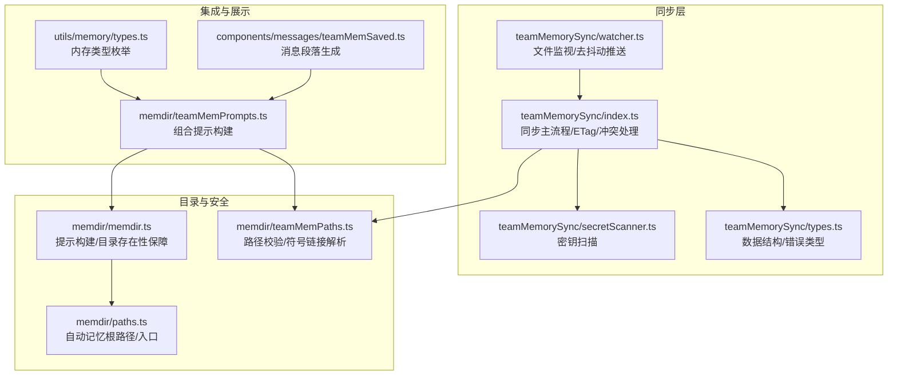
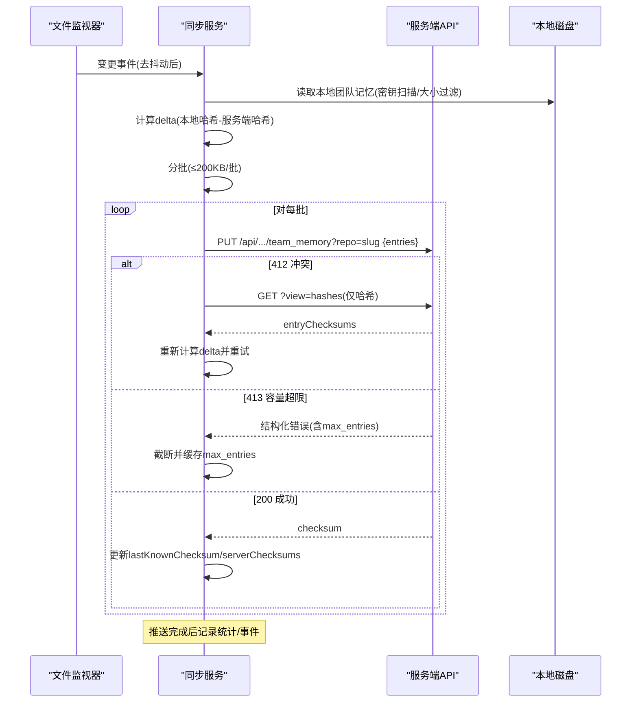
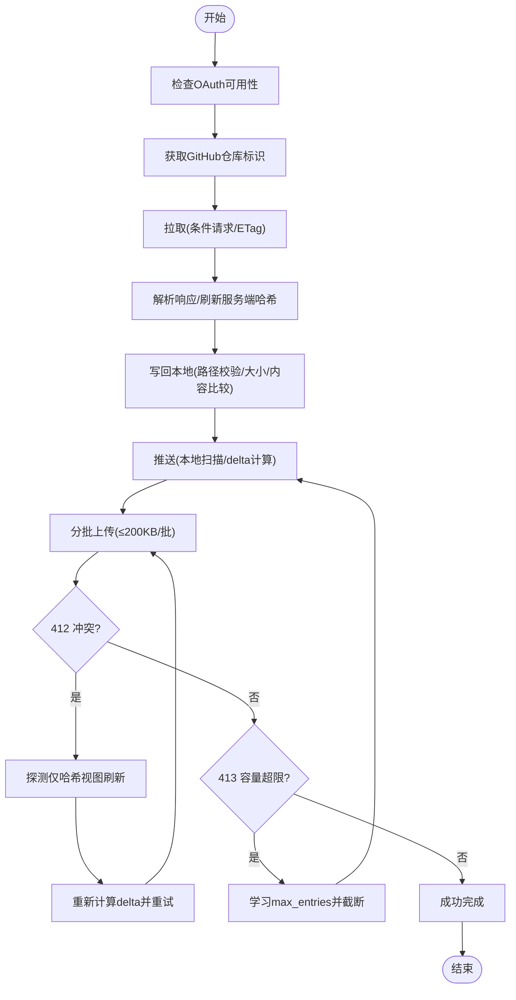
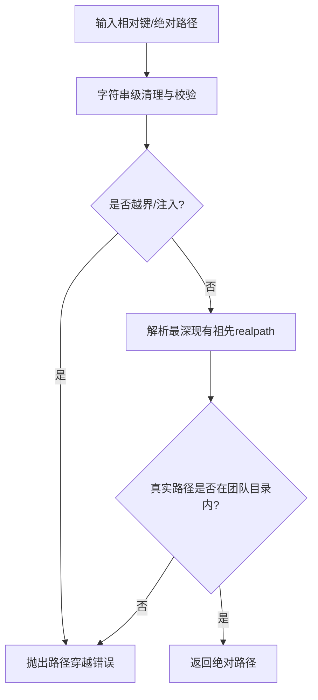
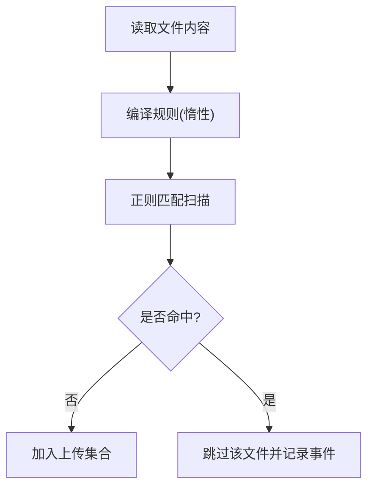
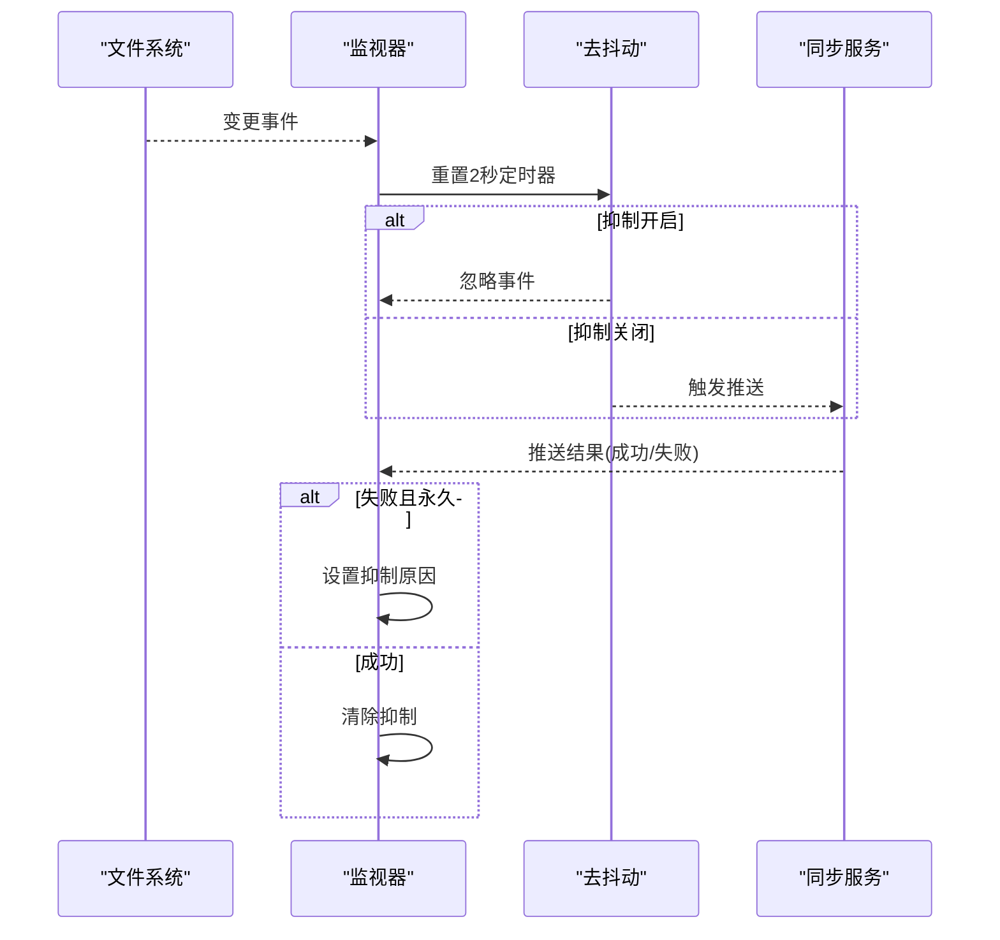
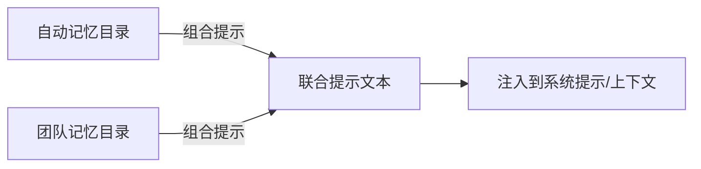
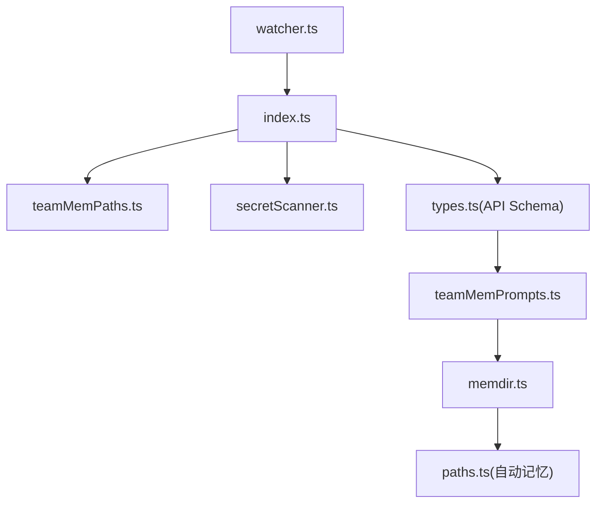

# 团队记忆系统

<cite>
**本文引用的文件**
- [teammem.md](file://docs/features/teammem.md)
- [index.ts](file://src/services/teamMemorySync/index.ts)
- [secretScanner.ts](file://src/services/teamMemorySync/secretScanner.ts)
- [watcher.ts](file://src/services/teamMemorySync/watcher.ts)
- [types.ts](file://src/services/teamMemorySync/types.ts)
- [teamMemPaths.ts](file://src/memdir/teamMemPaths.ts)
- [paths.ts](file://src/memdir/paths.ts)
- [memdir.ts](file://src/memdir/memdir.ts)
- [teamMemPrompts.ts](file://src/memdir/teamMemPrompts.ts)
- [types.ts](file://src/utils/memory/types.ts)
- [teamMemSaved.ts](file://src/components/messages/teamMemSaved.ts)
</cite>

## 目录
1. [简介](#简介)
2. [项目结构](#项目结构)
3. [核心组件](#核心组件)
4. [架构总览](#架构总览)
5. [详细组件分析](#详细组件分析)
6. [依赖关系分析](#依赖关系分析)
7. [性能考量](#性能考量)
8. [故障排除指南](#故障排除指南)
9. [结论](#结论)
10. [附录](#附录)

## 简介
本文件面向 Claude Code Best 的团队记忆系统，系统性阐述其分布式存储架构、同步机制与冲突解决策略，解析团队记忆目录结构与其与自动记忆的关系，说明权限与安全策略（含密钥扫描、路径校验、OAuth 授权等），并给出配置项、最佳实践与故障排除建议。目标是帮助开发者与使用者全面理解“团队共享记忆”的工作原理与落地细节。

## 项目结构
团队记忆系统围绕以下模块协同工作：
- 同步服务：负责拉取/推送、ETag 条件请求、冲突探测与重试、分批上传、容量学习与告警
- 路径与安全：严格的路径校验、符号链接解析与边界检查，防止路径穿越与逃逸
- 密钥扫描：上传前对内容进行高置信度规则扫描，确保敏感信息不出境
- 文件监视器：对团队记忆目录进行递归监听，去抖动后触发推送
- 类型与提示：统一的数据结构、错误类型与提示构建，支持自动记忆与团队记忆的组合提示

图示来源
- [index.ts:1-120](file://src/services/teamMemorySync/index.ts#L1-L120)
- [types.ts:1-157](file://src/services/teamMemorySync/types.ts#L1-L157)
- [secretScanner.ts:1-325](file://src/services/teamMemorySync/secretScanner.ts#L1-L325)
- [watcher.ts:1-388](file://src/services/teamMemorySync/watcher.ts#L1-L388)
- [teamMemPaths.ts:1-293](file://src/memdir/teamMemPaths.ts#L1-L293)
- [memdir.ts:1-508](file://src/memdir/memdir.ts#L1-L508)
- [paths.ts:1-279](file://src/memdir/paths.ts#L1-L279)
- [teamMemPrompts.ts:1-27](file://src/memdir/teamMemPrompts.ts#L1-L27)
- [types.ts:1-12](file://src/utils/memory/types.ts#L1-L12)
- [teamMemSaved.ts:1-19](file://src/components/messages/teamMemSaved.ts#L1-L19)

章节来源
- [teammem.md:1-148](file://docs/features/teammem.md#L1-L148)
- [index.ts:1-120](file://src/services/teamMemorySync/index.ts#L1-L120)
- [teamMemPaths.ts:1-293](file://src/memdir/teamMemPaths.ts#L1-L293)
- [secretScanner.ts:1-325](file://src/services/teamMemorySync/secretScanner.ts#L1-L325)
- [watcher.ts:1-388](file://src/services/teamMemorySync/watcher.ts#L1-L388)
- [memdir.ts:1-508](file://src/memdir/memdir.ts#L1-L508)
- [paths.ts:1-279](file://src/memdir/paths.ts#L1-L279)
- [teamMemPrompts.ts:1-27](file://src/memdir/teamMemPrompts.ts#L1-L27)
- [types.ts:1-12](file://src/utils/memory/types.ts#L1-L12)
- [teamMemSaved.ts:1-19](file://src/components/messages/teamMemSaved.ts#L1-L19)

## 核心组件
- 同步状态与协议
  - 同步状态对象包含上次已知校验和、服务端逐键哈希映射、服务端最大条目限制等，用于增量计算与乐观锁
  - 协议：GET 获取完整数据或仅哈希视图；PUT 上传条目，采用 upsert 语义
- 拉取流程（Server → Local）
  - 条件请求（ETag）避免重复下载；304 表示无变更；404 表示服务端尚无数据
  - 解析响应后刷新服务端哈希映射，并将远端条目写回本地，严格路径校验与大小限制
- 推送流程（Local → Server）
  - 读取本地目录，预筛密钥与超大文件；计算本地哈希与服务端差异（delta）
  - 分批上传（≤200KB/批），遇到 412 冲突时探测仅含哈希的视图以刷新服务端哈希并重试
  - 遇到 413 结构化错误时学习服务端最大条目限制，后续推送截断
- 密钥扫描
  - 上传前扫描内容，命中即跳过该文件，记录事件但不影响其他文件同步
- 文件监视
  - 递归监听团队记忆目录，2 秒去抖动后触发推送；对永久失败进行抑制，删除文件可清除抑制
- 目录与安全
  - 严格字符串与符号链接双重校验，确保写入路径始终位于团队记忆目录边界内
  - 自动记忆与团队记忆目录同属一个基座，团队记忆为自动记忆子目录

章节来源
- [index.ts:95-127](file://src/services/teamMemorySync/index.ts#L95-L127)
- [index.ts:188-306](file://src/services/teamMemorySync/index.ts#L188-L306)
- [index.ts:387-410](file://src/services/teamMemorySync/index.ts#L387-L410)
- [index.ts:462-553](file://src/services/teamMemorySync/index.ts#L462-L553)
- [index.ts:557-673](file://src/services/teamMemorySync/index.ts#L557-L673)
- [index.ts:689-755](file://src/services/teamMemorySync/index.ts#L689-L755)
- [secretScanner.ts:277-295](file://src/services/teamMemorySync/secretScanner.ts#L277-L295)
- [watcher.ts:167-229](file://src/services/teamMemorySync/watcher.ts#L167-L229)
- [watcher.ts:252-305](file://src/services/teamMemorySync/watcher.ts#L252-L305)
- [teamMemPaths.ts:265-284](file://src/memdir/teamMemPaths.ts#L265-L284)
- [paths.ts:223-235](file://src/memdir/paths.ts#L223-L235)

## 架构总览
团队记忆系统采用“客户端-服务端”双向同步模型，结合条件请求与乐观锁，实现低冲突、高可靠的数据一致性。

图示来源
- [watcher.ts:132-145](file://src/services/teamMemorySync/watcher.ts#L132-L145)
- [index.ts:462-553](file://src/services/teamMemorySync/index.ts#L462-L553)
- [index.ts:889-1193](file://src/services/teamMemorySync/index.ts#L889-L1193)
- [types.ts:47-57](file://src/services/teamMemorySync/types.ts#L47-L57)

## 详细组件分析

### 组件A：同步服务（拉取/推送/冲突处理）
- 拉取
  - 条件请求：If-None-Match；304/404/200 分支处理
  - 刷新服务端哈希映射；写入本地时进行路径校验、大小检查与内容比较，避免不必要的写入
- 推送
  - 本地扫描：密钥扫描、超大文件过滤、按服务端已知容量截断
  - 增量计算：基于本地内容哈希与服务端哈希的差集
  - 分批上传：字节计数精确估算，避免网关拒绝
  - 冲突处理：412 时探测仅哈希视图刷新后再重试；最多两次冲突重试
  - 容量学习：413 结构化错误中提取 max_entries，后续推送按此截断
- 错误分类与退避
  - 认证/超时/网络/解析/未知；区分可重试与永久失败

图示来源
- [index.ts:188-306](file://src/services/teamMemorySync/index.ts#L188-L306)
- [index.ts:689-755](file://src/services/teamMemorySync/index.ts#L689-L755)
- [index.ts:889-1193](file://src/services/teamMemorySync/index.ts#L889-L1193)
- [types.ts:77-124](file://src/services/teamMemorySync/types.ts#L77-L124)

章节来源
- [index.ts:188-306](file://src/services/teamMemorySync/index.ts#L188-L306)
- [index.ts:387-410](file://src/services/teamMemorySync/index.ts#L387-L410)
- [index.ts:462-553](file://src/services/teamMemorySync/index.ts#L462-L553)
- [index.ts:557-673](file://src/services/teamMemorySync/index.ts#L557-L673)
- [index.ts:689-755](file://src/services/teamMemorySync/index.ts#L689-L755)
- [index.ts:889-1193](file://src/services/teamMemorySync/index.ts#L889-L1193)
- [types.ts:77-157](file://src/services/teamMemorySync/types.ts#L77-L157)

### 组件B：路径安全与目录边界
- 字符串级校验：拒绝空字节、URL 编码遍历、Unicode 正规化攻击、反斜杠、绝对路径等
- 符号链接解析：对最深存在的祖先进行 realpath，确保真实路径仍在团队记忆目录内
- 写入路径校验：先字符串级 containment，再 realpath 后的真实 containment
- 目录结构：团队记忆为自动记忆子目录，二者共享同一基座，便于统一提示与权限管理

图示来源
- [teamMemPaths.ts:22-64](file://src/memdir/teamMemPaths.ts#L22-L64)
- [teamMemPaths.ts:109-171](file://src/memdir/teamMemPaths.ts#L109-L171)
- [teamMemPaths.ts:228-284](file://src/memdir/teamMemPaths.ts#L228-L284)

章节来源
- [teamMemPaths.ts:1-293](file://src/memdir/teamMemPaths.ts#L1-L293)
- [paths.ts:223-235](file://src/memdir/paths.ts#L223-L235)

### 组件C：密钥扫描与隐私保护
- 规则来源：基于 gitleaks 的高置信度规则集合，仅保留特征明显的前缀匹配
- 扫描时机：上传前在本地扫描，命中即跳过该文件，不进入上传集合
- 数据最小化：仅记录规则 ID 与标签，不记录任何密钥值；支持内容脱敏输出

图示来源
- [secretScanner.ts:277-295](file://src/services/teamMemorySync/secretScanner.ts#L277-L295)
- [secretScanner.ts:312-324](file://src/services/teamMemorySync/secretScanner.ts#L312-L324)

章节来源
- [secretScanner.ts:1-325](file://src/services/teamMemorySync/secretScanner.ts#L1-L325)

### 组件D：文件监视与去抖动推送
- 递归监听：macOS 使用 fsevents，Linux 使用 inotify，目录级监听减少句柄占用
- 去抖动：2 秒窗口内多次变更合并为一次推送
- 抑制策略：对不可自愈的永久失败进行抑制，删除文件可清除抑制
- 启动流程：首次拉取后启动监视器，即使服务端无内容也保持监听

图示来源
- [watcher.ts:167-229](file://src/services/teamMemorySync/watcher.ts#L167-L229)
- [watcher.ts:252-305](file://src/services/teamMemorySync/watcher.ts#L252-L305)
- [watcher.ts:314-319](file://src/services/teamMemorySync/watcher.ts#L314-L319)

章节来源
- [watcher.ts:1-388](file://src/services/teamMemorySync/watcher.ts#L1-L388)

### 组件E：提示构建与目录组织
- 自动记忆与团队记忆组合提示：当两者均启用时，构建联合提示，分别描述两类目录的作用与范围
- 目录存在性保障：确保目录存在，避免模型写入前的权限问题
- 入口文件约束：MEMORY.md 作为索引文件，有行数与字节数上限，超限时截断并提示

图示来源
- [memdir.ts:448-472](file://src/memdir/memdir.ts#L448-L472)
- [teamMemPrompts.ts:22-27](file://src/memdir/teamMemPrompts.ts#L22-L27)
- [memdir.ts:57-103](file://src/memdir/memdir.ts#L57-L103)

章节来源
- [memdir.ts:1-508](file://src/memdir/memdir.ts#L1-L508)
- [teamMemPrompts.ts:1-27](file://src/memdir/teamMemPrompts.ts#L1-L27)

## 依赖关系分析
- 模块耦合
  - 同步服务依赖路径安全模块进行写入校验，依赖密钥扫描模块进行上传前过滤
  - 文件监视器依赖同步服务执行推送，同时受同步状态影响（如抑制策略）
  - 提示构建依赖自动记忆与团队记忆路径，二者同属同一基座
- 外部依赖
  - OAuth 令牌与授权头用于服务端访问
  - Git 远程仓库标识用于确定同步作用域
  - Axios 用于 HTTP 请求与错误分类

图示来源
- [watcher.ts:1-388](file://src/services/teamMemorySync/watcher.ts#L1-L388)
- [index.ts:1-120](file://src/services/teamMemorySync/index.ts#L1-L120)
- [teamMemPaths.ts:1-293](file://src/memdir/teamMemPaths.ts#L1-L293)
- [secretScanner.ts:1-325](file://src/services/teamMemorySync/secretScanner.ts#L1-L325)
- [types.ts:1-157](file://src/services/teamMemorySync/types.ts#L1-L157)
- [teamMemPrompts.ts:1-27](file://src/memdir/teamMemPrompts.ts#L1-L27)
- [memdir.ts:1-508](file://src/memdir/memdir.ts#L1-L508)
- [paths.ts:1-279](file://src/memdir/paths.ts#L1-L279)

章节来源
- [watcher.ts:1-388](file://src/services/teamMemorySync/watcher.ts#L1-L388)
- [index.ts:1-120](file://src/services/teamMemorySync/index.ts#L1-L120)
- [teamMemPaths.ts:1-293](file://src/memdir/teamMemPaths.ts#L1-L293)
- [secretScanner.ts:1-325](file://src/services/teamMemorySync/secretScanner.ts#L1-L325)
- [types.ts:1-157](file://src/services/teamMemorySync/types.ts#L1-L157)
- [teamMemPrompts.ts:1-27](file://src/memdir/teamMemPrompts.ts#L1-L27)
- [memdir.ts:1-508](file://src/memdir/memdir.ts#L1-L508)
- [paths.ts:1-279](file://src/memdir/paths.ts#L1-L279)

## 性能考量
- 增量同步与分批上传
  - 仅上传哈希变化的条目，显著降低带宽与服务器压力
  - 单批 ≤200KB，避免网关拒绝，提升成功率
- 并行写入与去抖动
  - 写入阶段 Promise.all 并行处理，缩短初始拉取时间
  - 2 秒去抖动减少频繁推送带来的网络与服务器压力
- 容量学习与截断
  - 通过结构化 413 错误学习服务端最大条目限制，后续推送按需截断，避免反复失败
- 路径校验与安全前置
  - 在磁盘写入前完成路径与内容校验，减少无效 IO 与潜在风险

## 故障排除指南
- 常见错误与定位
  - 401/403：检查 OAuth 是否可用与作用域是否满足要求
  - 404：服务端尚无数据，属正常；首次拉取为空时会重置校验和
  - 412：乐观锁冲突，系统会探测仅哈希视图并重试；若持续出现，检查并发推送
  - 413：容量超限，系统会学习 max_entries 并截断；可通过删除文件缓解
  - 429：速率限制，等待后重试
  - 超时/网络：检查网络连通与代理设置
- 永久失败抑制
  - 当出现不可自愈的错误（如 no_oauth/no_repo/4xx 非 409/429）时，监视器会抑制后续推送，直到删除文件或重启会话清除抑制
- 密钥扫描导致跳过
  - 若某文件被跳过，检查日志中的规则 ID；确认内容中是否存在高置信度密钥模式
- 目录与权限
  - 确保团队记忆目录存在且可写；自动记忆与团队记忆共享基座，注意权限继承

章节来源
- [index.ts:266-305](file://src/services/teamMemorySync/index.ts#L266-L305)
- [index.ts:516-552](file://src/services/teamMemorySync/index.ts#L516-L552)
- [watcher.ts:61-73](file://src/services/teamMemorySync/watcher.ts#L61-L73)
- [watcher.ts:189-203](file://src/services/teamMemorySync/watcher.ts#L189-L203)

## 结论
团队记忆系统通过严格的路径安全、上传前密钥扫描、条件请求与乐观锁、增量与分批上传、以及服务端容量学习，实现了在多成员协作场景下的高效、安全与一致的分布式存储。自动记忆与团队记忆共享同一基座，既保证了统一的提示与权限模型，又通过子目录隔离实现了清晰的职责边界。配合文件监视器的去抖动推送与完善的错误处理，系统在复杂网络与并发环境下仍能保持稳定与可预测的行为。

## 附录

### 目录结构与关系
- 自动记忆根目录：由环境变量或设置决定，通常位于用户配置目录下
- 团队记忆目录：自动记忆根目录下的 team 子目录，作为团队共享的唯一写入入口
- 提示构建：当两者均启用时，系统会构建联合提示，分别描述两类目录的用途与范围

章节来源
- [paths.ts:85-90](file://src/memdir/paths.ts#L85-L90)
- [paths.ts:223-235](file://src/memdir/paths.ts#L223-L235)
- [memdir.ts:448-472](file://src/memdir/memdir.ts#L448-L472)
- [teamMemPrompts.ts:22-27](file://src/memdir/teamMemPrompts.ts#L22-L27)

### 权限与安全策略
- 访问控制
  - 需要第一方 OAuth 登录且具备必要作用域才可启用团队记忆同步
  - 仅支持 GitHub 远程仓库，非 GitHub 远程无法同步
- 加密与隐私
  - 上传前密钥扫描，密钥绝不离开本地；仅记录规则 ID 与标签
  - 路径校验与符号链接解析，防止路径穿越与外部写入
- 传输与一致性
  - 使用 ETag 条件请求与 If-Match 乐观锁，减少冲突概率
  - 仅哈希视图探测用于快速刷新，避免不必要的内容下载

章节来源
- [index.ts:151-161](file://src/services/teamMemorySync/index.ts#L151-L161)
- [index.ts:163-184](file://src/services/teamMemorySync/index.ts#L163-L184)
- [secretScanner.ts:277-295](file://src/services/teamMemorySync/secretScanner.ts#L277-L295)
- [teamMemPaths.ts:228-284](file://src/memdir/teamMemPaths.ts#L228-L284)

### 实时同步算法要点
- 变更检测：文件监视器递归监听，2 秒去抖动
- 冲突合并：推送侧采用乐观锁与探测仅哈希视图；拉取侧服务端覆盖本地
- 一致性保证：ETag 与逐键哈希映射确保最终一致；分批上传与容量学习降低失败率

章节来源
- [watcher.ts:167-229](file://src/services/teamMemorySync/watcher.ts#L167-L229)
- [index.ts:315-384](file://src/services/teamMemorySync/index.ts#L315-L384)
- [index.ts:889-1193](file://src/services/teamMemorySync/index.ts#L889-L1193)

### 配置选项与参数
- 功能开关
  - FEATURE_TEAMMEM：启用团队记忆功能
- 网络与同步
  - TEAM_MEMORY_SYNC_URL：自定义同步端点（可选）
  - 同步超时：固定超时时间
  - 最大重试次数：拉取与通用错误重试
  - 冲突重试上限：推送侧 412 冲突最多重试两次
- 安全与容量
  - MAX_FILE_SIZE_BYTES：单文件大小上限（预筛）
  - MAX_PUT_BODY_BYTES：单次 PUT 字节上限（分批）
  - 结构化 413：学习服务端 max_entries 并截断

章节来源
- [index.ts:71-91](file://src/services/teamMemorySync/index.ts#L71-L91)
- [index.ts:315-384](file://src/services/teamMemorySync/index.ts#L315-L384)
- [types.ts:47-57](file://src/services/teamMemorySync/types.ts#L47-L57)

### 最佳实践
- 优先使用自动记忆作为个人知识沉淀，团队记忆用于共享上下文与约定
- 将长列表与索引文件控制在行数与字节限制内，避免截断提示
- 避免在团队记忆中存放敏感信息；即便未被扫描到，也应遵循最小暴露原则
- 合理组织子目录，保持文件粒度适中，便于增量同步与冲突定位
- 在高并发场景下，尽量避免同时修改同一文件，减少 412 冲突概率