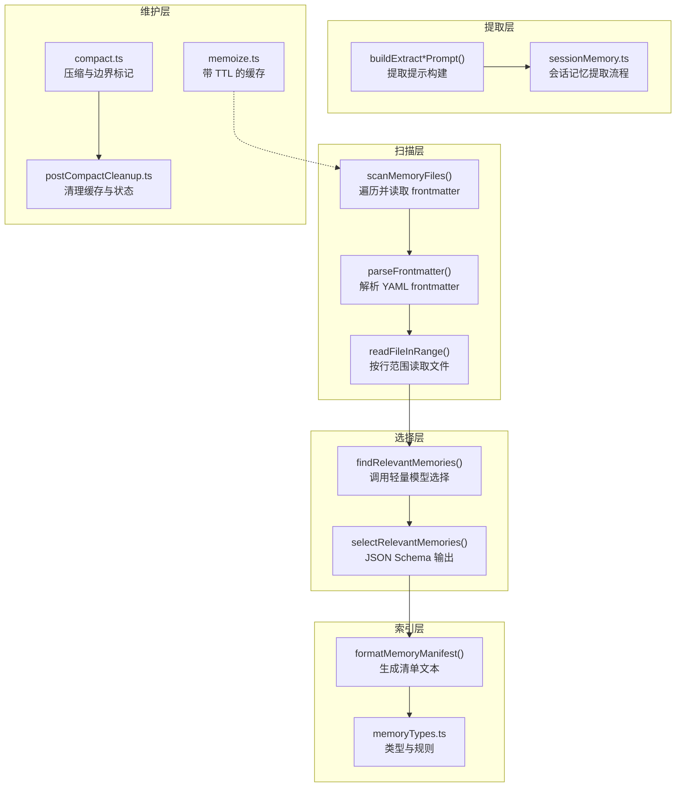
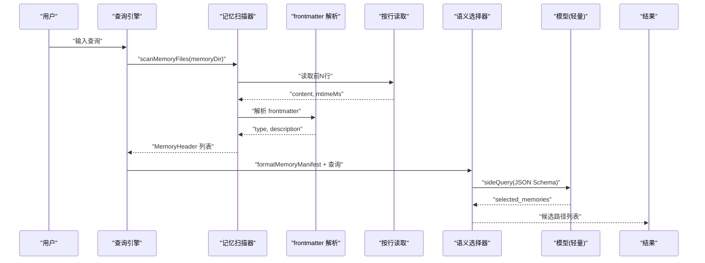
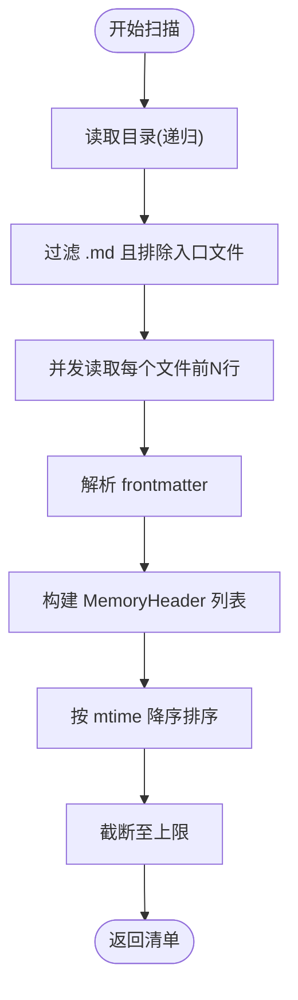
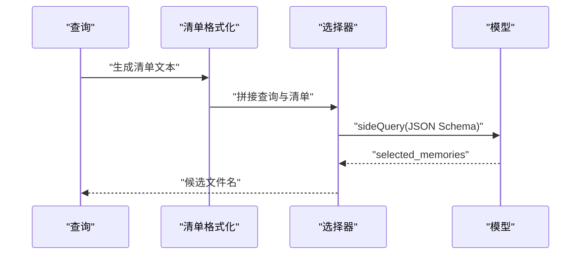
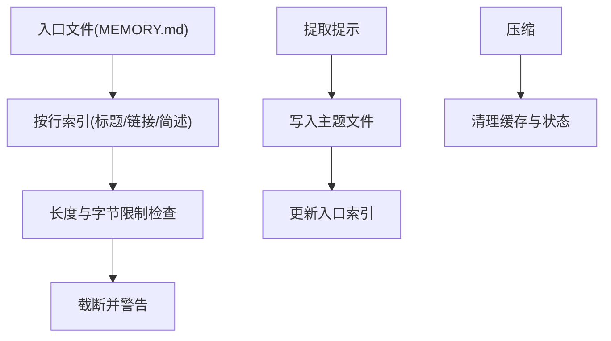
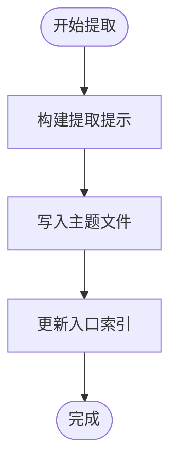
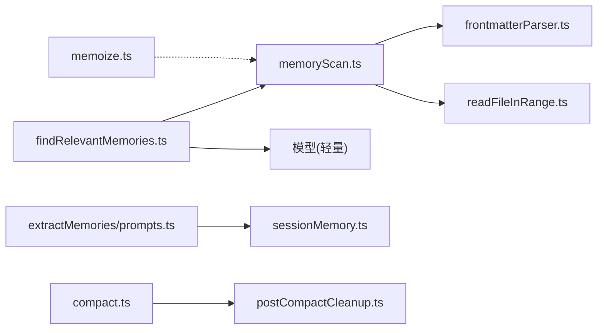

# 记忆扫描与索引

<cite>
**本文引用的文件**
- [memoryScan.ts](file://src/memdir/memoryScan.ts)
- [findRelevantMemories.ts](file://src/memdir/findRelevantMemories.ts)
- [memoryTypes.ts](file://src/memdir/memoryTypes.ts)
- [memdir.ts](file://src/memdir/memdir.ts)
- [frontmatterParser.ts](file://src/utils/frontmatterParser.ts)
- [readFileInRange.ts](file://src/utils/readFileInRange.ts)
- [memoryAge.ts](file://src/memdir/memoryAge.ts)
- [teamMemPrompts.ts](file://src/memdir/teamMemPrompts.ts)
- [project-memory.mdx](file://docs/context/project-memory.mdx)
- [prompts.ts](file://src/services/extractMemories/prompts.ts)
- [sessionMemory.ts](file://src/services/SessionMemory/sessionMemory.ts)
- [index.ts](file://src/native-ts/file-index/index.ts)
- [compact.ts](file://src/services/compact/compact.ts)
- [postCompactCleanup.ts](file://src/services/compact/postCompactCleanup.ts)
- [memoize.ts](file://src/utils/memoize.ts)
</cite>

## 目录
1. [简介](#简介)
2. [项目结构](#项目结构)
3. [核心组件](#核心组件)
4. [架构总览](#架构总览)
5. [详细组件分析](#详细组件分析)
6. [依赖关系分析](#依赖关系分析)
7. [性能考量](#性能考量)
8. [故障排查指南](#故障排查指南)
9. [结论](#结论)
10. [附录](#附录)

## 简介
本文件系统化阐述 Claude Code Best 的“记忆扫描与索引”体系，覆盖以下主题：
- 记忆扫描算法：文件遍历策略、内容解析与元数据提取
- 相关记忆查找机制：语义匹配、关键词检索与上下文关联
- 记忆索引构建：倒排索引、向量嵌入与相似度计算（当前实现以轻量级语义选择为主）
- 记忆提取自动化：内容摘要、关键信息抽取与格式标准化
- 性能优化：增量扫描、缓存机制与并发处理
- 维护与更新：定期重建与实时更新策略
- 使用示例与调优建议

## 项目结构
记忆子系统由“扫描—选择—索引—提取—维护”五层构成：
- 扫描层：遍历记忆目录，读取 frontmatter，生成内存清单
- 选择层：基于用户查询与工具噪声，通过轻量模型进行语义筛选
- 索引层：以文件路径与类型为索引键，支持快速检索与排序
- 提取层：自动/手动记忆提取与写入，维护索引入口文件
- 维护层：压缩、清理与缓存失效管理

**图表来源**
- [memoryScan.ts:35-94](file://src/memdir/memoryScan.ts#L35-L94)
- [frontmatterParser.ts:130-175](file://src/utils/frontmatterParser.ts#L130-L175)
- [readFileInRange.ts:73-122](file://src/utils/readFileInRange.ts#L73-L122)
- [findRelevantMemories.ts:39-141](file://src/memdir/findRelevantMemories.ts#L39-L141)
- [memoryTypes.ts:14-31](file://src/memdir/memoryTypes.ts#L14-L31)
- [prompts.ts:50-112](file://src/services/extractMemories/prompts.ts#L50-L112)
- [sessionMemory.ts:40-482](file://src/services/SessionMemory/sessionMemory.ts#L40-L482)
- [compact.ts:327-369](file://src/services/compact/compact.ts#L327-L369)
- [postCompactCleanup.ts:31-39](file://src/services/compact/postCompactCleanup.ts#L31-L39)
- [memoize.ts:40-49](file://src/utils/memoize.ts#L40-L49)

**章节来源**
- [memoryScan.ts:1-94](file://src/memdir/memoryScan.ts#L1-L94)
- [findRelevantMemories.ts:1-142](file://src/memdir/findRelevantMemories.ts#L1-L142)
- [memoryTypes.ts:1-272](file://src/memdir/memoryTypes.ts#L1-L272)
- [memdir.ts:1-508](file://src/memdir/memdir.ts#L1-L508)
- [frontmatterParser.ts:1-371](file://src/utils/frontmatterParser.ts#L1-L371)
- [readFileInRange.ts:1-384](file://src/utils/readFileInRange.ts#L1-L384)
- [project-memory.mdx:80-125](file://docs/context/project-memory.mdx#L80-L125)

## 核心组件
- 记忆扫描器：递归遍历记忆目录，过滤 .md 文件，仅读取前若干行以获取 frontmatter 与 mtime，避免全量读取带来的开销
- 语义选择器：将内存清单与查询拼接为提示，调用轻量模型进行 JSON Schema 输出，返回候选文件名集合
- 元数据提取：从 frontmatter 中提取 type 与 description，并结合文件路径与修改时间组织清单
- 类型与规则：定义四类记忆类型与保存/使用规范，确保内容质量与一致性
- 提取与索引：构建提取提示，指导模型将对话要点写入独立文件并更新索引入口；同时维护入口文件长度与字节限制
- 维护与清理：在压缩后清理模块级缓存与跟踪状态，避免跨线程污染

**章节来源**
- [memoryScan.ts:35-94](file://src/memdir/memoryScan.ts#L35-L94)
- [findRelevantMemories.ts:39-141](file://src/memdir/findRelevantMemories.ts#L39-L141)
- [memoryTypes.ts:14-178](file://src/memdir/memoryTypes.ts#L14-L178)
- [memdir.ts:199-316](file://src/memdir/memdir.ts#L199-L316)
- [prompts.ts:50-112](file://src/services/extractMemories/prompts.ts#L50-L112)
- [compact.ts:327-369](file://src/services/compact/compact.ts#L327-L369)
- [postCompactCleanup.ts:31-39](file://src/services/compact/postCompactCleanup.ts#L31-L39)

## 架构总览
下图展示从用户输入到相关记忆返回的关键流程，以及与提取流程的衔接。

**图表来源**
- [memoryScan.ts:35-94](file://src/memdir/memoryScan.ts#L35-L94)
- [frontmatterParser.ts:130-175](file://src/utils/frontmatterParser.ts#L130-L175)
- [readFileInRange.ts:73-122](file://src/utils/readFileInRange.ts#L73-L122)
- [findRelevantMemories.ts:77-141](file://src/memdir/findRelevantMemories.ts#L77-L141)

**章节来源**
- [findRelevantMemories.ts:39-141](file://src/memdir/findRelevantMemories.ts#L39-L141)
- [project-memory.mdx:96-125](file://docs/context/project-memory.mdx#L96-L125)

## 详细组件分析

### 记忆扫描算法
- 遍历策略：递归读取目录，过滤 .md 文件且排除特定入口文件，限制最大文件数以控制后续处理成本
- 内容解析：仅读取前若干行，避免大文件全量读取；解析 frontmatter 获取类型与描述
- 元数据提取：记录文件名、绝对路径、mtimeMs，便于后续新鲜度展示与排序
- 并发与中断：对每个文件的读取采用 Promise.allSettled，支持 AbortSignal 中断；最终按 mtime 降序截断至上限

**图表来源**
- [memoryScan.ts:35-94](file://src/memdir/memoryScan.ts#L35-L94)
- [readFileInRange.ts:73-122](file://src/utils/readFileInRange.ts#L73-L122)
- [frontmatterParser.ts:130-175](file://src/utils/frontmatterParser.ts#L130-L175)

**章节来源**
- [memoryScan.ts:21-77](file://src/memdir/memoryScan.ts#L21-L77)
- [readFileInRange.ts:73-122](file://src/utils/readFileInRange.ts#L73-L122)
- [frontmatterParser.ts:130-175](file://src/utils/frontmatterParser.ts#L130-L175)

### 相关记忆查找机制
- 语义匹配：将内存清单与查询拼接为提示，调用轻量模型进行 JSON Schema 输出，返回最多五个文件名
- 关键词检索：通过最近使用工具列表进行去噪，避免对正在使用的工具参考文档进行召回
- 上下文关联：将入口文件内容与清单一并传入，帮助模型理解当前上下文

**图表来源**
- [findRelevantMemories.ts:77-141](file://src/memdir/findRelevantMemories.ts#L77-L141)
- [memoryScan.ts:84-94](file://src/memdir/memoryScan.ts#L84-L94)

**章节来源**
- [findRelevantMemories.ts:18-141](file://src/memdir/findRelevantMemories.ts#L18-L141)

### 记忆索引构建与维护
- 入口文件索引：入口文件作为“索引”，每行指向具体主题文件，限制行数与字节数，超限时截断并提示
- 类型与规则：四类记忆类型与保存/使用规范，确保内容可检索、可验证
- 提取与更新：提取流程指导模型将要点写入独立文件并更新入口索引；会话记忆模块负责提取后的权限与状态管理
- 压缩与清理：压缩后清理模块级缓存与跟踪状态，避免跨线程状态污染

**图表来源**
- [memdir.ts:57-103](file://src/memdir/memdir.ts#L57-L103)
- [memdir.ts:272-316](file://src/memdir/memdir.ts#L272-L316)
- [prompts.ts:50-112](file://src/services/extractMemories/prompts.ts#L50-L112)
- [sessionMemory.ts:40-482](file://src/services/SessionMemory/sessionMemory.ts#L40-L482)
- [compact.ts:327-369](file://src/services/compact/compact.ts#L327-L369)
- [postCompactCleanup.ts:31-39](file://src/services/compact/postCompactCleanup.ts#L31-L39)

**章节来源**
- [memdir.ts:199-316](file://src/memdir/memdir.ts#L199-L316)
- [prompts.ts:50-112](file://src/services/extractMemories/prompts.ts#L50-L112)
- [sessionMemory.ts:40-482](file://src/services/SessionMemory/sessionMemory.ts#L40-L482)

### 记忆提取自动化流程
- 提示构建：根据是否启用团队记忆与是否跳过索引，动态生成两步式或一步式保存流程
- 写入与索引：先写入主题文件，再更新入口索引；保持索引简洁，避免冗长内容
- 权限与安全：限制仅对目标记忆文件执行编辑操作，防止越权

**图表来源**
- [prompts.ts:50-112](file://src/services/extractMemories/prompts.ts#L50-L112)
- [sessionMemory.ts:457-482](file://src/services/SessionMemory/sessionMemory.ts#L457-L482)

**章节来源**
- [prompts.ts:50-112](file://src/services/extractMemories/prompts.ts#L50-L112)
- [sessionMemory.ts:457-482](file://src/services/SessionMemory/sessionMemory.ts#L457-L482)

### 类型与规则（记忆分类）
- 四类记忆：user、feedback、project、reference
- 保存与使用规范：明确何时保存、如何使用、避免保存的内容
- 入口文件示例：提供 frontmatter 示例与正文结构建议

**章节来源**
- [memoryTypes.ts:14-178](file://src/memdir/memoryTypes.ts#L14-L178)
- [memoryTypes.ts:261-271](file://src/memdir/memoryTypes.ts#L261-L271)

## 依赖关系分析
- 扫描依赖：文件系统读取、frontmatter 解析、按行读取工具
- 选择依赖：扫描输出、模型侧查询、JSON Schema 输出
- 提取依赖：提示构建、写入工具、入口文件维护
- 维护依赖：压缩流程、清理流程、缓存模块

**图表来源**
- [memoryScan.ts:7-11](file://src/memdir/memoryScan.ts#L7-L11)
- [findRelevantMemories.ts:1-11](file://src/memdir/findRelevantMemories.ts#L1-L11)
- [frontmatterParser.ts:1-8](file://src/utils/frontmatterParser.ts#L1-L8)
- [readFileInRange.ts:40-44](file://src/utils/readFileInRange.ts#L40-L44)
- [prompts.ts:50-112](file://src/services/extractMemories/prompts.ts#L50-L112)
- [sessionMemory.ts:40-62](file://src/services/SessionMemory/sessionMemory.ts#L40-L62)
- [compact.ts:327-369](file://src/services/compact/compact.ts#L327-L369)
- [postCompactCleanup.ts:31-39](file://src/services/compact/postCompactCleanup.ts#L31-L39)
- [memoize.ts:40-49](file://src/utils/memoize.ts#L40-L49)

**章节来源**
- [memoryScan.ts:1-11](file://src/memdir/memoryScan.ts#L1-L11)
- [findRelevantMemories.ts:1-11](file://src/memdir/findRelevantMemories.ts#L1-L11)

## 性能考量
- 增量扫描与并发
  - 仅读取前若干行，避免全量读取；对每个文件读取并发执行，失败项单独处理
  - 通过 mtime 排序与上限截断，减少后续模型负担
- 缓存机制
  - 使用带 TTL 的缓存模块，实现写穿透与后台刷新，降低重复计算成本
- 大文件处理
  - 快速路径：小文件直接读取并内存切分
  - 流式路径：大文件按块读取，仅累积目标行，避免内存膨胀
- 去噪与剪枝
  - 结合最近使用工具列表，过滤掉可能成为噪声的工具参考文档
- 压缩与清理
  - 压缩后清理模块级缓存与跟踪状态，避免跨线程状态污染

**章节来源**
- [memoryScan.ts:21-34](file://src/memdir/memoryScan.ts#L21-L34)
- [readFileInRange.ts:73-122](file://src/utils/readFileInRange.ts#L73-L122)
- [readFileInRange.ts:128-194](file://src/utils/readFileInRange.ts#L128-L194)
- [readFileInRange.ts:344-383](file://src/utils/readFileInRange.ts#L344-L383)
- [findRelevantMemories.ts:92-95](file://src/memdir/findRelevantMemories.ts#L92-L95)
- [memoize.ts:40-49](file://src/utils/memoize.ts#L40-L49)
- [compact.ts:327-369](file://src/services/compact/compact.ts#L327-L369)
- [postCompactCleanup.ts:31-39](file://src/services/compact/postCompactCleanup.ts#L31-L39)

## 故障排查指南
- frontmatter 解析失败
  - 当 frontmatter 含特殊字符时，解析器会尝试转义并重试；若仍失败，会记录调试日志以便诊断
- 文件过大
  - 快速路径下超过阈值会抛出错误；流式路径下可配置截断模式，避免内存暴涨
- 选择器失败
  - 模型调用异常会被捕获并返回空结果；若被中断则直接返回空
- 入口文件截断
  - 当行数或字节超过限制时，会截断并在内容末尾添加警告提示

**章节来源**
- [frontmatterParser.ts:148-175](file://src/utils/frontmatterParser.ts#L148-L175)
- [readFileInRange.ts:57-67](file://src/utils/readFileInRange.ts#L57-L67)
- [findRelevantMemories.ts:131-140](file://src/memdir/findRelevantMemories.ts#L131-L140)
- [memdir.ts:57-103](file://src/memdir/memdir.ts#L57-L103)

## 结论
该记忆扫描与索引系统以“轻量模型 + 结构化 frontmatter”的组合实现了高效、可控的记忆检索与提取。通过按行读取、并发扫描、去噪与截断等手段，兼顾了性能与可用性；通过入口文件索引与类型规则，保证了长期可维护性。未来可在以下方向演进：
- 引入倒排索引与向量嵌入，提升语义检索精度与速度
- 扩展增量索引与实时更新策略，降低全量扫描频率
- 完善索引重建与版本化管理，增强稳定性与可追溯性

## 附录

### 使用示例
- 启用记忆系统：确保自动记忆开关开启，必要时配置团队记忆
- 保存记忆：根据提取提示将要点写入独立文件，并更新入口索引
- 搜索过去上下文：在支持的场景下使用 grep 或工具进行窄关键词检索

**章节来源**
- [memdir.ts:419-507](file://src/memdir/memdir.ts#L419-L507)
- [prompts.ts:50-112](file://src/services/extractMemories/prompts.ts#L50-L112)
- [memdir.ts:375-407](file://src/memdir/memdir.ts#L375-L407)

### 性能调优建议
- 控制扫描范围：合理设置最大文件数量与前缀行数，平衡召回与性能
- 利用缓存：对热点查询与扫描结果使用带 TTL 的缓存，减少重复计算
- 分批处理：对大规模目录采用分批扫描与异步合并策略
- 压缩周期：定期执行压缩并清理缓存，保持系统稳定

**章节来源**
- [memoryScan.ts:21-34](file://src/memdir/memoryScan.ts#L21-L34)
- [memoize.ts:40-49](file://src/utils/memoize.ts#L40-L49)
- [compact.ts:327-369](file://src/services/compact/compact.ts#L327-L369)
- [postCompactCleanup.ts:31-39](file://src/services/compact/postCompactCleanup.ts#L31-L39)