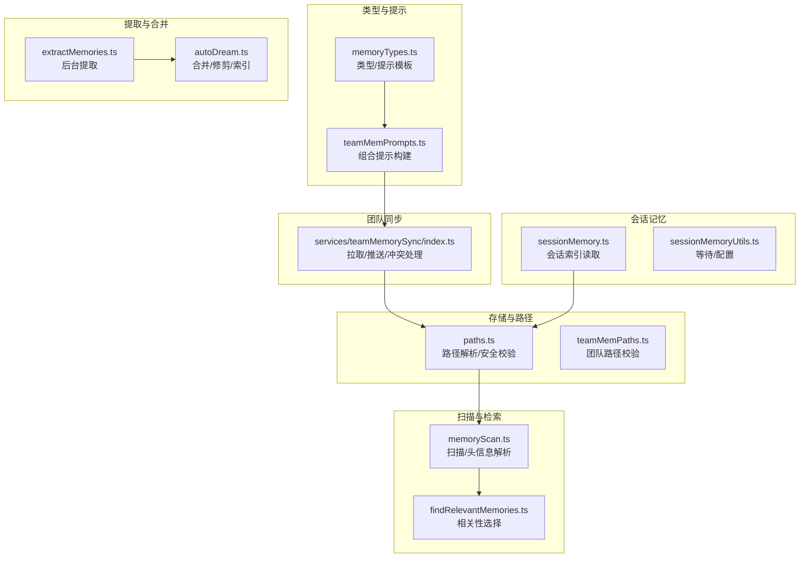
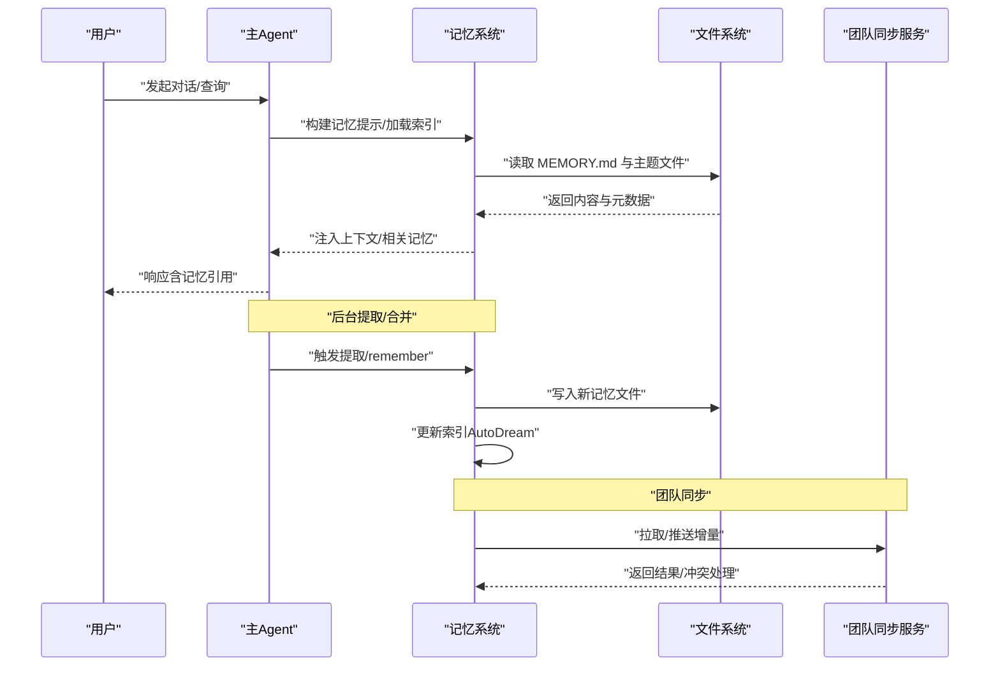
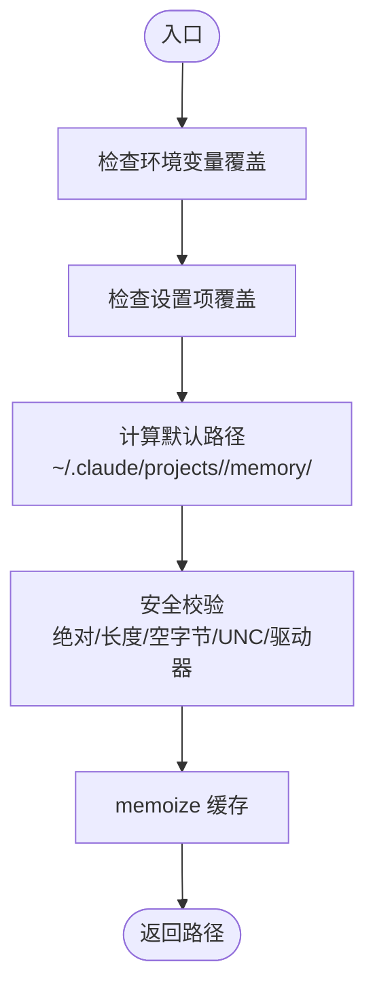
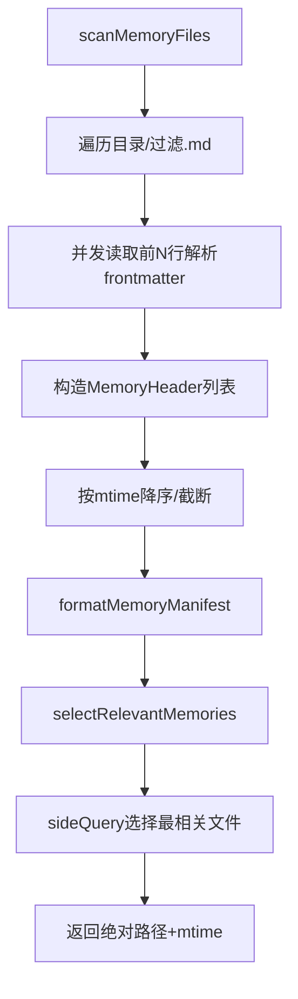
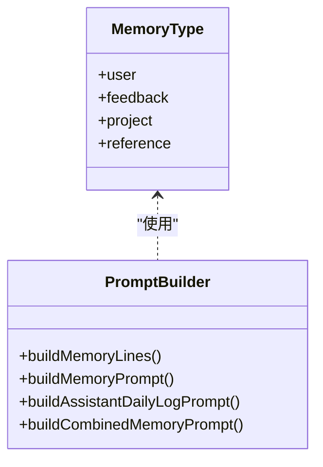
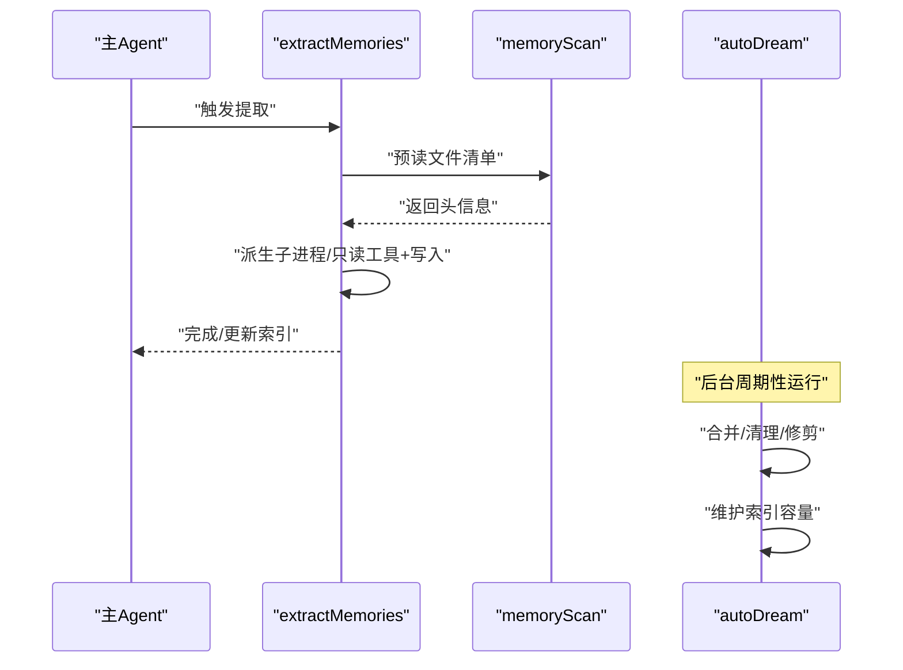
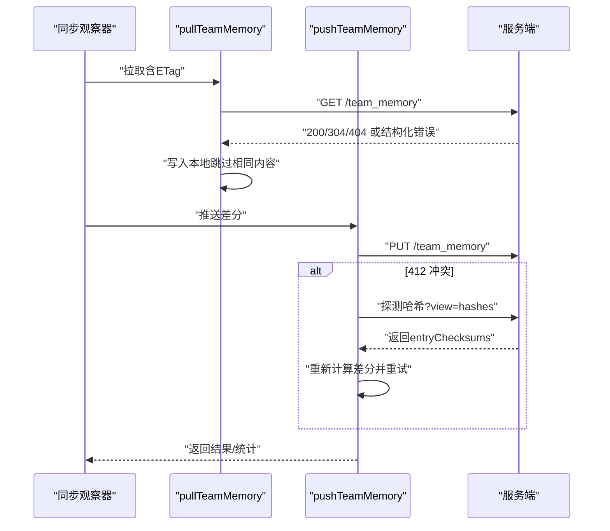
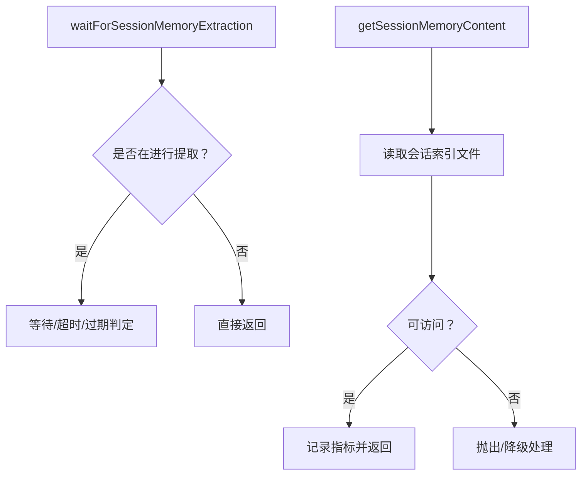
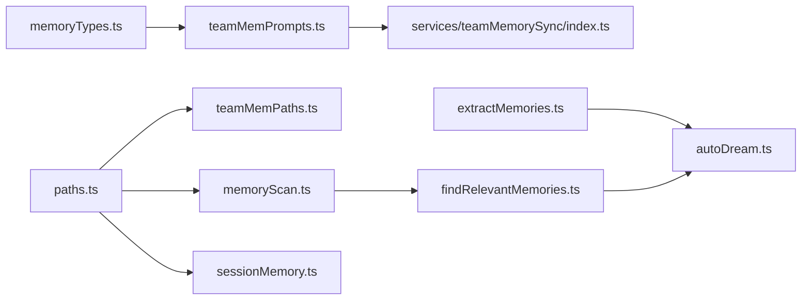

# 记忆系统架构

<cite>
**本文档引用的文件**
- [memdir.ts](file://src/memdir/memdir.ts)
- [memoryScan.ts](file://src/memdir/memoryScan.ts)
- [paths.ts](file://src/memdir/paths.ts)
- [memoryTypes.ts](file://src/memdir/memoryTypes.ts)
- [findRelevantMemories.ts](file://src/memdir/findRelevantMemories.ts)
- [teamMemPaths.ts](file://src/memdir/teamMemPaths.ts)
- [teamMemPrompts.ts](file://src/memdir/teamMemPrompts.ts)
- [index.ts](file://src/services/teamMemorySync/index.ts)
- [extractMemories.ts](file://src/services/extractMemories/extractMemories.ts)
- [autoDream.ts](file://src/services/autoDream/autoDream.ts)
- [sessionMemory.ts](file://src/services/SessionMemory/sessionMemory.ts)
- [sessionMemoryUtils.ts](file://src/services/SessionMemory/sessionMemoryUtils.ts)
- [project-memory.mdx](file://docs/context/project-memory.mdx)
- [V6.md](file://V6.md)
</cite>

## 目录
1. [简介](#简介)
2. [项目结构](#项目结构)
3. [核心组件](#核心组件)
4. [架构总览](#架构总览)
5. [详细组件分析](#详细组件分析)
6. [依赖关系分析](#依赖关系分析)
7. [性能考量](#性能考量)
8. [故障排查指南](#故障排查指南)
9. [结论](#结论)
10. [附录](#附录)

## 简介
本文件系统性阐述 Claude Code Best 的记忆系统架构，聚焦于会话记忆、项目记忆与团队记忆的存储结构、检索机制与同步策略。系统采用纯文件存储（无数据库、无向量库），以 Markdown 文件与目录结构为核心载体，结合智能索引（MEMORY.md）、类型化分类（user/feedback/project/reference）与前后端协同的扫描、提取与合并流程，实现跨对话、跨会话、跨团队的知识沉淀与复用。

## 项目结构
记忆系统由以下关键模块构成：
- 存储与路径管理：负责自动记忆与团队记忆的目录定位、路径校验与安全约束
- 扫描与检索：对记忆目录进行文件遍历、元数据解析与相关性选择
- 类型与提示：定义记忆类型、保存规范与系统提示文本
- 提取与合并：后台异步提取、自动整理与压缩索引
- 团队同步：基于服务端的双向同步、乐观锁与冲突处理
- 会话记忆：会话级索引文件的读取与配置

**图表来源**
- [paths.ts:223-235](file://src/memdir/paths.ts#L223-L235)
- [memoryScan.ts:35-77](file://src/memdir/memoryScan.ts#L35-L77)
- [findRelevantMemories.ts:39-75](file://src/memdir/findRelevantMemories.ts#L39-L75)
- [memoryTypes.ts:14-31](file://src/memdir/memoryTypes.ts#L14-L31)
- [teamMemPrompts.ts:22-99](file://src/memdir/teamMemPrompts.ts#L22-L99)
- [index.ts:770-800](file://src/services/teamMemorySync/index.ts#L770-L800)
- [extractMemories.ts](file://src/services/extractMemories/extractMemories.ts)
- [autoDream.ts](file://src/services/autoDream/autoDream.ts)
- [sessionMemory.ts:228-264](file://src/services/SessionMemory/sessionMemory.ts#L228-L264)
- [sessionMemoryUtils.ts:85-105](file://src/services/SessionMemory/sessionMemoryUtils.ts#L85-L105)

**章节来源**
- [project-memory.mdx:9-28](file://docs/context/project-memory.mdx#L9-L28)
- [V6.md:1106-1196](file://V6.md#L1106-L1196)

## 核心组件
- 自动记忆（Auto Memory）
  - 存储位置：~/.claude/projects/<sanitized-git-root>/memory/
  - 入口索引：MEMORY.md（最多200行，约25KB；超限截断并警告）
  - 类型体系：user/feedback/project/reference
  - 行为约束：禁止保存可从当前项目状态推导的内容
- 团队记忆（Team Memory）
  - 存储位置：自动记忆子目录 ~/.claude/projects/.../memory/team/
  - 同步协议：服务端/客户端双向同步，拉取覆盖本地、推送按内容哈希差分
  - 安全校验：路径规范化、符号链接检测、键名注入防护
- 提取与合并（Extract & AutoDream）
  - 提取：每轮对话后触发，派生子进程只读工具+写记忆
  - 合并：定期后台运行，修剪冗余、解决矛盾、生成索引
- 会话记忆（Session Memory）
  - 会话级索引文件，支持远程配置与节流控制

**章节来源**
- [memdir.ts:34-103](file://src/memdir/memdir.ts#L34-L103)
- [memoryTypes.ts:14-31](file://src/memdir/memoryTypes.ts#L14-L31)
- [paths.ts:223-235](file://src/memdir/paths.ts#L223-L235)
- [teamMemPaths.ts:84-94](file://src/memdir/teamMemPaths.ts#L84-L94)
- [index.ts:1-25](file://src/services/teamMemorySync/index.ts#L1-L25)
- [sessionMemory.ts:228-264](file://src/services/SessionMemory/sessionMemory.ts#L228-L264)

## 架构总览
记忆系统围绕“文件即知识”的理念构建，通过统一的提示模板与类型约束，确保知识的可检索性与一致性。系统在不同层级提供检索与注入能力：会话层（系统提示注入）、查询层（相关性选择）、提取层（后台自动归纳）与同步层（团队共享）。

**图表来源**
- [memdir.ts:419-507](file://src/memdir/memdir.ts#L419-L507)
- [memoryScan.ts:35-77](file://src/memdir/memoryScan.ts#L35-L77)
- [findRelevantMemories.ts:39-75](file://src/memdir/findRelevantMemories.ts#L39-L75)
- [index.ts:1153-1191](file://src/services/teamMemorySync/index.ts#L1153-L1191)
- [autoDream.ts](file://src/services/autoDream/autoDream.ts)

## 详细组件分析

### 存储与路径管理
- 自动记忆路径解析
  - 优先级：环境变量覆盖 > 设置项覆盖 > 默认 ~/.claude/projects/<git-root>/memory/
  - 安全校验：拒绝相对路径、根路径、UNC/Windows驱动器、空字节等危险输入
  - 缓存优化：基于项目根目录的 memoize，避免重复解析设置文件
- 团队记忆路径与安全
  - 团队目录位于自动记忆子目录下，启用条件与自动记忆一致
  - 写入前进行字符串级路径规范化与符号链接解析，防止路径穿越与符号链接逃逸
- 日志模式（KAIROS）
  - 长时会话采用追加式日志而非实时索引，夜间任务汇总为 MEMORY.md

**图表来源**
- [paths.ts:85-90](file://src/memdir/paths.ts#L85-L90)
- [paths.ts:223-235](file://src/memdir/paths.ts#L223-L235)
- [paths.ts:109-150](file://src/memdir/paths.ts#L109-L150)
- [teamMemPaths.ts:22-64](file://src/memdir/teamMemPaths.ts#L22-L64)
- [teamMemPaths.ts:228-256](file://src/memdir/teamMemPaths.ts#L228-L256)

**章节来源**
- [paths.ts:30-55](file://src/memdir/paths.ts#L30-L55)
- [paths.ts:223-235](file://src/memdir/paths.ts#L223-L235)
- [teamMemPaths.ts:73-78](file://src/memdir/teamMemPaths.ts#L73-L78)
- [teamMemPaths.ts:228-256](file://src/memdir/teamMemPaths.ts#L228-L256)

### 扫描与检索
- 扫描算法
  - 递归遍历目录，过滤 .md 文件（排除入口索引）
  - 仅读取前若干行以解析 frontmatter，同时获取 mtime
  - 并发解析，按 mtime 降序排序，限制最大文件数
- 相关性选择
  - 将文件清单格式化为“类型/时间戳/描述”清单
  - 使用模型对查询进行选择，返回最多5个最相关文件
  - 支持近期工具列表过滤，避免重复引用已使用工具的参考文档

**图表来源**
- [memoryScan.ts:35-77](file://src/memdir/memoryScan.ts#L35-L77)
- [memoryScan.ts:84-94](file://src/memdir/memoryScan.ts#L84-L94)
- [findRelevantMemories.ts:77-141](file://src/memdir/findRelevantMemories.ts#L77-L141)

**章节来源**
- [memoryScan.ts:24-77](file://src/memdir/memoryScan.ts#L24-L77)
- [findRelevantMemories.ts:39-75](file://src/memdir/findRelevantMemories.ts#L39-L75)

### 类型与提示
- 类型体系
  - user：用户角色/偏好/知识（私有）
  - feedback：方法指导/纠正/确认（默认私有）
  - project：项目工作/目标/决策（团队共享）
  - reference：外部系统指针（团队共享）
- 提示模板
  - 组合模式：同时包含私有与团队目录，带作用域标签与示例
  - 个体模式：仅私有目录，去除作用域限定
  - 行为约束：明确禁止保存可从代码/历史推导的内容

**图表来源**
- [memoryTypes.ts:14-31](file://src/memdir/memoryTypes.ts#L14-L31)
- [memdir.ts:199-316](file://src/memdir/memdir.ts#L199-L316)
- [teamMemPrompts.ts:22-99](file://src/memdir/teamMemPrompts.ts#L22-L99)

**章节来源**
- [memoryTypes.ts:14-106](file://src/memdir/memoryTypes.ts#L14-L106)
- [memdir.ts:199-316](file://src/memdir/memdir.ts#L199-L316)
- [teamMemPrompts.ts:22-99](file://src/memdir/teamMemPrompts.ts#L22-L99)

### 提取与合并
- 提取（extractMemories）
  - 触发时机：对话结束或显式命令
  - 工作方式：派生子进程，使用只读工具扫描与抽取，写入记忆文件
  - 与扫描协作：扫描阶段预读文件清单，减少模型侧的文件系统交互
- 合并（autoDream）
  - 后台运行，防并发锁
  - 功能：合并/清理/修剪，维护索引（MEMORY.md）不超过容量上限
  - 矛盾解决：当文件内容冲突时，修正错误文件

**图表来源**
- [extractMemories.ts](file://src/services/extractMemories/extractMemories.ts)
- [memoryScan.ts:35-77](file://src/memdir/memoryScan.ts#L35-L77)
- [autoDream.ts](file://src/services/autoDream/autoDream.ts)

**章节来源**
- [V6.md:1158-1167](file://V6.md#L1158-L1167)
- [V6.md:1154-1157](file://V6.md#L1154-L1157)

### 团队同步
- 协议与语义
  - 拉取：服务端覆盖本地（服务器对键值拥有最终决定权）
  - 推送：按内容哈希差分上传；412 冲突时探测哈希并重试
  - 删除：不传播；删除本地文件不会移除服务器条目
- 安全与合规
  - 路径校验：键名与写入路径双重校验，拒绝路径穿越与符号链接逃逸
  - 机密扫描：上传前扫描凭证，发现则跳过该文件并记录
- 错误处理
  - 认证失败、网络异常、超时等分类处理
  - 结构化 413（条目过多）：学习服务器限制并截断

**图表来源**
- [index.ts:1153-1191](file://src/services/teamMemorySync/index.ts#L1153-L1191)
- [index.ts:889-888](file://src/services/teamMemorySync/index.ts#L889-L888)
- [index.ts:770-800](file://src/services/teamMemorySync/index.ts#L770-L800)
- [index.ts:462-553](file://src/services/teamMemorySync/index.ts#L462-L553)
- [teamMemPaths.ts:265-284](file://src/memdir/teamMemPaths.ts#L265-L284)

**章节来源**
- [index.ts:1-25](file://src/services/teamMemorySync/index.ts#L1-L25)
- [index.ts:770-800](file://src/services/teamMemorySync/index.ts#L770-L800)
- [index.ts:889-888](file://src/services/teamMemorySync/index.ts#L889-L888)
- [teamMemPaths.ts:22-64](file://src/memdir/teamMemPaths.ts#L22-L64)
- [teamMemPaths.ts:265-284](file://src/memdir/teamMemPaths.ts#L265-L284)

### 会话记忆
- 会话索引读取
  - 在会话开始时读取会话记忆文件，记录事件指标
  - 若文件不可访问则降级处理
- 配置与节流
  - 远程配置缓存与懒初始化，避免阻塞
  - 设定最小消息令牌数、最小令牌间隔与工具调用间隔，防止频繁更新

**图表来源**
- [sessionMemoryUtils.ts:85-105](file://src/services/SessionMemory/sessionMemoryUtils.ts#L85-L105)
- [sessionMemory.ts:228-264](file://src/services/SessionMemory/sessionMemory.ts#L228-L264)

**章节来源**
- [sessionMemoryUtils.ts:85-105](file://src/services/SessionMemory/sessionMemoryUtils.ts#L85-L105)
- [sessionMemory.ts:228-264](file://src/services/SessionMemory/sessionMemory.ts#L228-L264)

## 依赖关系分析
- 组件耦合
  - 路径模块被扫描、检索、团队同步广泛依赖，形成核心基础
  - 类型与提示模块被所有记忆构建流程复用
  - 提取与合并模块与扫描模块存在数据依赖（扫描结果用于选择）
- 外部依赖
  - 文件系统操作封装（fs/promises）
  - HTTP 客户端（axios）用于团队同步
  - 模型侧查询（sideQuery）用于相关性选择

**图表来源**
- [paths.ts:223-235](file://src/memdir/paths.ts#L223-L235)
- [memoryScan.ts:35-77](file://src/memdir/memoryScan.ts#L35-L77)
- [teamMemPaths.ts:84-94](file://src/memdir/teamMemPaths.ts#L84-L94)
- [memoryTypes.ts:14-31](file://src/memdir/memoryTypes.ts#L14-L31)
- [teamMemPrompts.ts:22-99](file://src/memdir/teamMemPrompts.ts#L22-L99)
- [index.ts:770-800](file://src/services/teamMemorySync/index.ts#L770-L800)
- [findRelevantMemories.ts:39-75](file://src/memdir/findRelevantMemories.ts#L39-L75)
- [extractMemories.ts](file://src/services/extractMemories/extractMemories.ts)
- [autoDream.ts](file://src/services/autoDream/autoDream.ts)
- [sessionMemory.ts:228-264](file://src/services/SessionMemory/sessionMemory.ts#L228-L264)

**章节来源**
- [V6.md:1169-1181](file://V6.md#L1169-L1181)

## 性能考量
- I/O 优化
  - 扫描阶段单次读取并内嵌 stat 获取 mtime，避免双轮 stat
  - 限制最大文件数与索引大小，降低内存与网络压力
- 并发与缓存
  - 路径解析 memoize，减少设置文件解析开销
  - 并发读取 frontmatter，缩短整体延迟
- 网络与同步
  - 推送采用差分与批量分片，避免超大请求体
  - 结构化 413 学习服务器限制，动态截断

[本节为通用性能建议，无需特定文件引用]

## 故障排查指南
- 认证与权限
  - 团队同步需第一方 OAuth 且具备必要作用域；若失败，检查认证状态与网络连接
- 路径与安全
  - 团队路径校验失败多因路径穿越或符号链接逃逸；检查键名与写入路径
- 索引截断
  - MEMORY.md 超限会截断并警告；精简索引条目，保持每行简洁
- 同步冲突
  - 412 冲突时会探测哈希并重试；若持续失败，检查网络与服务端状态

**章节来源**
- [index.ts:151-161](file://src/services/teamMemorySync/index.ts#L151-L161)
- [teamMemPaths.ts:22-64](file://src/memdir/teamMemPaths.ts#L22-L64)
- [memdir.ts:57-103](file://src/memdir/memdir.ts#L57-L103)
- [index.ts:495-500](file://src/services/teamMemorySync/index.ts#L495-L500)

## 结论
该记忆系统以“文件即知识”为核心，通过严格的类型约束、路径安全校验与智能检索，实现了跨对话、跨会话与跨团队的知识沉淀与复用。提取与合并机制保证了知识的持续增长与质量控制，团队同步提供了可靠的协作基座。整体设计兼顾易用性与安全性，适合在多样化开发场景中稳定运行。

[本节为总结性内容，无需特定文件引用]

## 附录

### 配置选项与最佳实践
- 存储位置
  - 环境变量覆盖：CLAUDE_CODE_REMOTE_MEMORY_DIR（远端内存目录）
  - 设置项覆盖：autoMemoryDirectory（支持 ~/ 展开）
  - 默认：~/.claude/projects/<git-root>/memory/
- 清理策略
  - 自动记忆索引容量限制：200行/约25KB
  - 团队同步条目上限：学习自服务端结构化 413 的 max_entries
- 备份机制
  - 团队记忆文件作为纯文本备份；建议配合版本控制与本地快照
- 序列化与缓存
  - 团队同步使用 sha256 内容哈希进行差分；本地与服务端状态映射
  - 会话记忆读取与配置缓存，避免重复 I/O

**章节来源**
- [paths.ts:85-90](file://src/memdir/paths.ts#L85-L90)
- [paths.ts:179-186](file://src/memdir/paths.ts#L179-L186)
- [memdir.ts:34-38](file://src/memdir/memdir.ts#L34-L38)
- [index.ts:75-89](file://src/services/teamMemorySync/index.ts#L75-L89)
- [sessionMemoryUtils.ts:131-138](file://src/services/SessionMemory/sessionMemoryUtils.ts#L131-L138)